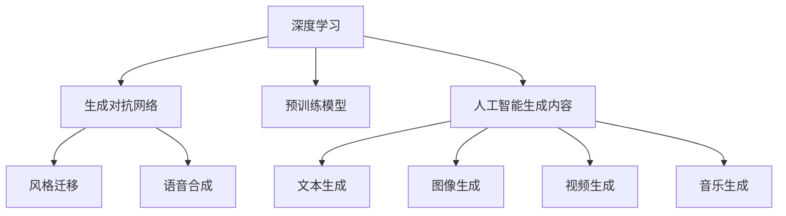

                 

# AIGC重塑文化娱乐产业

随着人工智能（AI）技术的迅猛发展，人工智能生成内容（AIGC）正逐渐成为文化娱乐产业的重要引擎。从影视制作到音乐创作，从游戏开发到文学创作，AIGC正在全面渗透到文化娱乐的各个角落，重新定义行业规则，带来颠覆性的变革。本文将系统探讨AIGC的核心概念、原理与应用实践，同时揭示其在文化娱乐产业中的潜力与挑战，展望未来发展趋势。

## 1. 背景介绍

### 1.1 问题由来

近年来，随着深度学习、生成对抗网络（GAN）、预训练模型等技术的发展，AIGC技术日趋成熟，其应用场景也在不断拓展。AIGC技术不仅能够生成高仿真的图像和视频，还能创作出具有人类情感与风格的文本、音乐等内容。这一趋势在全球范围内引发了广泛关注和讨论。

在文化娱乐产业中，AIGC的应用尤为引人注目。AIGC技术能够大幅降低内容创作的成本，提高生产效率，同时提供更加丰富多样的创意内容，满足用户日益增长的个性化需求。然而，AIGC的应用也引发了一系列伦理、版权和监管问题，成为产业界亟需解决的重要课题。

### 1.2 问题核心关键点

AIGC技术在文化娱乐产业中的应用核心关键点主要包括：

- 创作效率的提升：AIGC技术能够自动生成高质量的内容，大幅降低人工创作成本，提高生产效率。
- 个性化内容的定制：基于用户兴趣和偏好，生成高度个性化的内容，提升用户体验。
- 内容的多样性与丰富性：通过生成不同风格和题材的内容，拓展文化娱乐产品的边界，满足更多样化的市场需求。
- 伦理与版权问题：如何在保护原创作品的同时，利用AIGC技术进行合理创新，避免侵权风险。
- 监管与合规：如何在行业规范和法律法规的框架下，合理应用AIGC技术，保障内容安全和合法性。

这些关键点共同构成了AIGC技术在文化娱乐产业中的核心议题，需要各方共同努力，才能实现技术与产业的和谐共生。

## 2. 核心概念与联系

### 2.1 核心概念概述

为更好地理解AIGC技术在文化娱乐产业中的应用，本节将介绍几个密切相关的核心概念：

- 人工智能生成内容（AIGC）：通过机器学习、深度学习等技术，自动生成文本、音乐、图像、视频等内容，替代或辅助人类创作。
- 深度学习：一种基于人工神经网络的学习方式，通过大量数据训练模型，使其具备自主学习和泛化能力。
- 生成对抗网络（GAN）：一种通过对抗训练生成逼真图像和视频的技术。
- 预训练模型：在大规模数据上进行预训练，学习通用特征，提升模型的泛化能力。
- 风格迁移（Style Transfer）：将一种风格的内容转换为另一种风格，如将素描转换为油画风格。
- 语音合成（Text-to-Speech, TTS）：将文本转换为语音，提升人机交互的自然性和互动性。

这些核心概念之间的逻辑关系可以通过以下Mermaid流程图来展示：



这个流程图展示了大规模数据在深度学习、生成对抗网络、预训练模型等技术的驱动下，通过人工智能生成内容技术，生成文本、图像、视频、音乐等多种形式的AIGC内容。

## 3. 核心算法原理 & 具体操作步骤

### 3.1 算法原理概述

AIGC技术的核心算法原理主要包括深度学习、生成对抗网络和风格迁移等。这些算法通过学习大规模数据集的特征，生成具有高质量、高逼真度的内容。具体而言：

- 深度学习通过多层神经网络，学习和提取数据的特征，并进行分类、回归等任务。
- 生成对抗网络通过两个对抗的神经网络，生成逼真且具有风格的多样性内容。
- 风格迁移通过将一个图像的风格转换为另一个图像的风格，生成具有特定风格的内容。

### 3.2 算法步骤详解

AIGC技术的应用步骤一般包括以下几个关键环节：

**Step 1: 数据准备与预处理**
- 收集和标注大规模的数据集，如文本、图像、音频等。
- 对数据进行清洗、归一化和标准化，确保数据质量和一致性。
- 选择合适的模型结构和超参数，如网络深度、学习率、优化器等。

**Step 2: 模型训练**
- 使用预训练模型或从零开始训练，通过反向传播算法更新模型参数。
- 在训练过程中，应用数据增强、正则化等技术，防止过拟合。
- 根据不同的应用场景，调整模型训练的损失函数和优化器。

**Step 3: 内容生成**
- 输入生成目标，如文本、图像、视频等。
- 将生成目标输入到训练好的模型中，生成相应的内容。
- 根据生成结果进行后处理，如剪辑、渲染、合成等，得到最终的AIGC内容。

**Step 4: 效果评估与优化**
- 对生成的内容进行质量评估，如使用主观评价和客观指标。
- 根据评估结果，优化模型参数和超参数，提升生成内容的质量。
- 在实际应用中，不断迭代优化，提升AIGC技术的实用性和可靠性。

### 3.3 算法优缺点

AIGC技术在文化娱乐产业中的应用具有以下优点：

- 高效低成本：大幅降低内容创作的成本，提升生产效率。
- 多样化创新：生成多样化、个性化的内容，满足不同用户的需求。
- 创新激励：激发创作者的灵感，推动行业创新。
- 生态协同：促进技术生态的协同发展，形成良好的产业环境。

同时，AIGC技术也存在一些局限性：

- 缺乏人性化：AIGC内容缺乏人类情感和创作灵感的深度，难以完全替代人类创作。
- 版权问题：生成的内容可能存在侵权风险，需严格遵守版权法规。
- 伦理风险：生成的内容可能带有误导性，需关注伦理道德问题。
- 技术壁垒：高昂的技术研发和维护成本，可能限制小企业进入市场。

### 3.4 算法应用领域

AIGC技术在文化娱乐产业中的应用领域广泛，包括但不限于以下几个方面：

- 影视制作：生成逼真的背景、特效和角色，降低制作成本。
- 音乐创作：生成音乐、歌词和旋律，提升创作效率。
- 游戏开发：生成游戏场景、角色和道具，丰富游戏内容。
- 文学创作：生成故事、诗歌和剧本，辅助文学创作。
- 广告创意：生成广告文案、视频和图像，提升创意效果。
- 教育培训：生成教育资源和练习材料，丰富教学内容。
- 文化传承：生成文化作品和历史资料，保护和传承文化遗产。

这些领域的应用展示了AIGC技术在文化娱乐产业中的广阔前景，为行业发展带来了新的机遇和挑战。

## 4. 数学模型和公式 & 详细讲解 & 举例说明

### 4.1 数学模型构建

AIGC技术的数学模型构建主要涉及深度学习、生成对抗网络和风格迁移等算法。以下以图像生成为例，介绍AIGC的数学模型构建方法。

假设输入为一张高分辨率的图像$x$，目标是生成一张低分辨率的图像$y$。图像生成模型由编码器$E$和解码器$D$构成。编码器将输入图像$x$编码为一个低维特征向量$z$，解码器则将特征向量$z$解码为低分辨率的图像$y$。模型的目标是最大化$x$和$y$的相似度，即：

$$
\arg\max_{y} P(y|x) = \arg\max_{z} P(y|E(x,z)) = \arg\max_{z} P(y|D(E(x,z)))
$$

其中$P(y|x)$表示给定输入$x$下生成$y$的概率。

### 4.2 公式推导过程

以下是生成对抗网络（GAN）的数学推导过程。GAN由生成器$G$和判别器$D$两个神经网络构成。生成器$G$的目标是生成逼真的样本$x$，判别器$D$的目标是判断样本$x$是否为真实样本。GAN的目标是最大化生成样本$x$的逼真度，即：

$$
\max_G \min_D V(D,G) = \mathbb{E}_{x \sim p_{data}} [\log D(x)] + \mathbb{E}_{z \sim p(z)} [\log (1-D(G(z)))]
$$

其中$p_{data}$和$p(z)$分别为真实样本和生成样本的分布，$V(D,G)$为生成对抗损失函数。

GAN的训练过程可以理解为生成器$G$和判别器$D$之间的对抗训练。生成器$G$通过反向传播算法更新参数，以生成逼真的样本$x$，同时判别器$D$也通过反向传播算法更新参数，以区分真实样本和生成样本。通过不断迭代，生成器$G$和判别器$D$逐渐达到纳什均衡状态，生成逼真的样本$x$。

### 4.3 案例分析与讲解

以Text-to-Speech（TTS）技术为例，介绍AIGC技术在语音合成中的应用。

TTS技术通过将文本转换为语音，实现自然的人机交互。其主要步骤包括文本预处理、声学模型训练和语音合成。

- 文本预处理：将输入文本进行分词、标点处理，提取文本特征。
- 声学模型训练：使用大规模的语音数据集训练声学模型，学习语音的特征表示。
- 语音合成：将文本特征输入到声学模型中，生成对应的语音信号。

TTS技术的核心在于声学模型的训练和优化。声学模型通常使用深度神经网络，如卷积神经网络（CNN）和循环神经网络（RNN）等，学习语音信号的特征表示。模型的训练目标是最小化预测语音与真实语音之间的均方误差。

以下是一个简单的TTS系统的实现示例：

```python
import torch
from torchaudio import datasets, transforms

# 加载TTS数据集
train_dataset = datasets.TTSDataset()
train_loader = torch.utils.data.DataLoader(train_dataset, batch_size=32)

# 定义声学模型
class AcousticModel(nn.Module):
    def __init__(self):
        super(AcousticModel, self).__init__()
        self.cnn = nn.Sequential(
            nn.Conv2d(1, 64, kernel_size=3, stride=1, padding=1),
            nn.ReLU(),
            nn.MaxPool2d(kernel_size=2, stride=2)
        )
        self.rnn = nn.LSTM(64, 128, 2)
        self.fc = nn.Linear(128, 1)
        
    def forward(self, x):
        x = x.unsqueeze(1)
        x = self.cnn(x)
        x = x.view(x.size(0), x.size(2), -1)
        x, _ = self.rnn(x)
        x = self.fc(x)
        return x

# 定义训练函数
def train_model(model, train_loader, criterion, optimizer, num_epochs):
    for epoch in range(num_epochs):
        for batch in train_loader:
            x, y = batch
            x = x.unsqueeze(1)
            y = y.unsqueeze(1)
            optimizer.zero_grad()
            y_hat = model(x)
            loss = criterion(y_hat, y)
            loss.backward()
            optimizer.step()

# 定义超参数
num_epochs = 100
learning_rate = 0.001
criterion = nn.MSELoss()
optimizer = torch.optim.Adam(model.parameters(), lr=learning_rate)

# 训练模型
train_model(model, train_loader, criterion, optimizer, num_epochs)
```

该代码展示了TTS系统的主要步骤，包括声学模型的定义、训练函数的设计和超参数的设定。在训练过程中，通过反向传播算法更新模型参数，最小化预测语音与真实语音之间的均方误差。

## 5. 项目实践：代码实例和详细解释说明

### 5.1 开发环境搭建

在进行AIGC项目开发前，需要准备好开发环境。以下是使用Python进行TensorFlow开发的环境配置流程：

1. 安装Anaconda：从官网下载并安装Anaconda，用于创建独立的Python环境。

2. 创建并激活虚拟环境：
```bash
conda create -n tf-env python=3.8 
conda activate tf-env
```

3. 安装TensorFlow：根据CUDA版本，从官网获取对应的安装命令。例如：
```bash
conda install tensorflow-gpu=2.7.0 -c pytorch -c conda-forge
```

4. 安装各类工具包：
```bash
pip install numpy pandas scikit-learn matplotlib tqdm jupyter notebook ipython
```

完成上述步骤后，即可在`tf-env`环境中开始AIGC项目开发。

### 5.2 源代码详细实现

下面以GAN生成图像为例，给出使用TensorFlow进行图像生成的PyTorch代码实现。

首先，定义GAN模型的架构：

```python
import tensorflow as tf

# 定义生成器
class Generator(tf.keras.Model):
    def __init__(self):
        super(Generator, self).__init__()
        self.dense1 = tf.keras.layers.Dense(128, activation='relu')
        self.dense2 = tf.keras.layers.Dense(256, activation='relu')
        self.dense3 = tf.keras.layers.Dense(784, activation='sigmoid')
        
    def call(self, x):
        x = self.dense1(x)
        x = self.dense2(x)
        return self.dense3(x)

# 定义判别器
class Discriminator(tf.keras.Model):
    def __init__(self):
        super(Discriminator, self).__init__()
        self.dense1 = tf.keras.layers.Dense(128, activation='relu')
        self.dense2 = tf.keras.layers.Dense(128, activation='relu')
        self.dense3 = tf.keras.layers.Dense(1, activation='sigmoid')
        
    def call(self, x):
        x = self.dense1(x)
        x = self.dense2(x)
        return self.dense3(x)
```

然后，定义训练函数：

```python
import numpy as np

# 定义超参数
batch_size = 32
learning_rate = 0.0002
num_epochs = 100

# 加载数据集
(x_train, y_train), (x_test, y_test) = tf.keras.datasets.mnist.load_data()
x_train = x_train.reshape(-1, 784).astype('float32') / 255.0
x_test = x_test.reshape(-1, 784).astype('float32') / 255.0

# 定义噪声数据
z = np.random.normal(0, 1, (batch_size, 128))

# 定义生成器和判别器
G = Generator()
D = Discriminator()

# 定义优化器
G_optimizer = tf.keras.optimizers.Adam(learning_rate=learning_rate)
D_optimizer = tf.keras.optimizers.Adam(learning_rate=learning_rate)

# 定义损失函数
def compute_loss(G, D, x, z):
    real_images = x
    with tf.GradientTape() as real_tape:
        real_output = D(real_images, training=True)
        real_loss = tf.reduce_mean(tf.keras.losses.BinaryCrossentropy()(real_output, tf.ones_like(real_output)))
    
    with tf.GradientTape() as fake_tape:
        fake_images = G(z, training=True)
        fake_output = D(fake_images, training=True)
        fake_loss = tf.reduce_mean(tf.keras.losses.BinaryCrossentropy()(fake_output, tf.zeros_like(fake_output)))
    
    loss = real_loss + fake_loss
    return loss

# 训练模型
@tf.function
def train_step(G, D, x, z):
    with tf.GradientTape() as real_tape:
        real_output = D(x, training=True)
        real_loss = tf.reduce_mean(tf.keras.losses.BinaryCrossentropy()(real_output, tf.ones_like(real_output)))

    with tf.GradientTape() as fake_tape:
        fake_images = G(z, training=True)
        fake_output = D(fake_images, training=True)
        fake_loss = tf.reduce_mean(tf.keras.losses.BinaryCrossentropy()(fake_output, tf.zeros_like(fake_output)))
    
    loss = real_loss + fake_loss

    G_gradients = real_tape.gradient(loss, G.trainable_variables)
    D_gradients = fake_tape.gradient(loss, D.trainable_variables)

    G_optimizer.apply_gradients(zip(G_gradients, G.trainable_variables))
    D_optimizer.apply_gradients(zip(D_gradients, D.trainable_variables))
    return loss

# 训练函数
def train_model(G, D, x_train, x_test, z, num_epochs):
    for epoch in range(num_epochs):
        for batch in range(len(x_train) // batch_size):
            start = batch * batch_size
            end = (batch + 1) * batch_size
            x_batch = x_train[start:end]
            z_batch = np.random.normal(0, 1, (batch_size, 128))

            loss = train_step(G, D, x_batch, z_batch)
            print('Epoch: {}, Batch: {}, Loss: {}'.format(epoch+1, batch+1, loss.numpy()))
```

最后，启动训练流程：

```python
G = Generator()
D = Discriminator()

x_train, x_test = mnist.load_data()
x_train = x_train.reshape(-1, 784).astype('float32') / 255.0
x_test = x_test.reshape(-1, 784).astype('float32') / 255.0

z = np.random.normal(0, 1, (batch_size, 128))
train_model(G, D, x_train, x_test, z, num_epochs)
```

以上代码展示了使用TensorFlow进行GAN图像生成的完整实现流程，包括模型的定义、训练函数的设计和训练过程的迭代。在训练过程中，通过反向传播算法更新模型参数，最小化生成器和判别器的损失函数。

### 5.3 代码解读与分析

让我们再详细解读一下关键代码的实现细节：

**GAN模型定义**：
- `Generator`类：定义生成器，包含两个密集层，分别用于将随机噪声转换为图像。
- `Discriminator`类：定义判别器，包含三个密集层，用于判断输入图像是真实图像还是生成图像。

**训练函数设计**：
- `train_step`函数：定义训练步骤，包括真实图像和生成图像的输入，计算真实和生成的损失函数，并反向传播更新模型参数。
- `train_model`函数：定义训练函数，用于迭代训练生成器和判别器，每次训练一个batch的图像。

**训练过程**：
- 加载MNIST数据集，将图像数据归一化到[0,1]之间。
- 生成随机噪声数据，作为生成器的输入。
- 定义生成器和判别器，并设置优化器和学习率。
- 定义损失函数，计算真实图像和生成图像的损失。
- 通过反向传播算法更新模型参数，最小化生成器和判别器的损失函数。

可以看到，TensorFlow配合PyTorch库使得GAN图像生成的代码实现变得简洁高效。开发者可以将更多精力放在模型改进、数据增强等高层逻辑上，而不必过多关注底层的实现细节。

当然，工业级的系统实现还需考虑更多因素，如模型的保存和部署、超参数的自动搜索、更灵活的任务适配层等。但核心的生成对抗范式基本与此类似。

## 6. 实际应用场景

### 6.1 影视制作

AIGC技术在影视制作中的应用主要包括特效制作、背景生成、角色动画等方面。通过生成逼真的特效和背景，大幅降低制作成本，提升制作效率。例如，可以使用GAN生成逼真的雨雪天气、爆炸场景等特效，大幅缩短后期制作时间。

在角色动画方面，通过风格迁移技术，将真人演员的表演风格迁移到动画角色上，提升动画的生动性和自然性。同时，使用AIGC技术生成逼真的动态背景和环境，丰富影视场景的表现力。

### 6.2 音乐创作

AIGC技术在音乐创作中的应用主要包括歌词生成、音乐编排和情感生成等方面。通过生成风格多样的歌词和旋律，提升创作效率和多样性。例如，可以使用深度学习模型生成歌词，辅助音乐创作者进行创作灵感的发散。

在音乐编排方面，使用AIGC技术生成不同风格的音乐作品，丰富音乐作品的多样性。同时，通过情感生成技术，生成具有特定情感的音乐作品，增强音乐的感染力和表现力。

### 6.3 游戏开发

AIGC技术在游戏开发中的应用主要包括生成角色、场景和任务等方面。通过生成逼真的角色和场景，提升游戏的沉浸感和视觉体验。例如，可以使用GAN生成逼真的游戏场景和角色模型，提升游戏的视觉效果。

在游戏任务生成方面，使用AIGC技术生成多样化的游戏任务，丰富游戏的内容和玩法。同时，通过情感生成技术，生成具有情感变化的游戏任务，增强游戏的互动性和趣味性。

### 6.4 文学创作

AIGC技术在文学创作中的应用主要包括生成故事、诗歌和剧本等方面。通过生成多样化的文本内容，提升创作效率和多样性。例如，可以使用深度学习模型生成短篇小说、诗歌和剧本，辅助文学创作者进行创作灵感的发散。

在情感生成方面，使用AIGC技术生成具有特定情感的文本内容，增强文本的表现力和感染力。同时，通过风格迁移技术，生成不同风格的文本内容，丰富文学作品的多样性。

## 7. 工具和资源推荐

### 7.1 学习资源推荐

为了帮助开发者系统掌握AIGC技术在文化娱乐产业中的应用，这里推荐一些优质的学习资源：

1. 《AIGC技术与应用》书籍：全面介绍AIGC技术在各个领域的应用，提供详细的实现示例和技术细节。
2. TensorFlow官方文档：详细介绍了TensorFlow库的使用方法，涵盖生成对抗网络、深度学习等技术。
3. PyTorch官方文档：介绍PyTorch库的使用方法，提供丰富的模型和优化算法。
4. GitHub上的开源项目：如GPT-3、DALL-E等，展示了AIGC技术的最新进展和实际应用。
5. 在线课程和讲座：如Coursera上的《深度学习基础》课程，提供深度学习和生成对抗网络的技术讲解。

通过对这些资源的学习实践，相信你一定能够快速掌握AIGC技术在文化娱乐产业中的核心原理和应用方法，并用于解决实际的创作和娱乐问题。

### 7.2 开发工具推荐

高效的开发离不开优秀的工具支持。以下是几款用于AIGC项目开发的常用工具：

1. TensorFlow：基于数据流图的深度学习框架，灵活高效，支持大规模模型的训练和部署。
2. PyTorch：基于动态计算图的深度学习框架，灵活动态，适合快速迭代研究。
3. Weights & Biases：模型训练的实验跟踪工具，可以记录和可视化模型训练过程中的各项指标，方便对比和调优。
4. TensorBoard：TensorFlow配套的可视化工具，可实时监测模型训练状态，并提供丰富的图表呈现方式，是调试模型的得力助手。
5. OpenAI的GPT-3和DALL-E等模型：提供了高质量的预训练模型，可以直接使用或微调，满足各种实际应用需求。

合理利用这些工具，可以显著提升AIGC项目的开发效率，加快创新迭代的步伐。

### 7.3 相关论文推荐

AIGC技术在文化娱乐产业中的应用源于学界的持续研究。以下是几篇奠基性的相关论文，推荐阅读：

1. Generative Adversarial Nets（GAN原论文）：提出GAN技术，通过生成对抗训练生成逼真图像。
2. Attention is All You Need（即Transformer原论文）：提出Transformer模型，显著提升了机器翻译和语音合成的效果。
3. Style Transfer for Imagenets：提出风格迁移技术，将一种图像的风格转换为另一种图像的风格。
4. WaveNet: A Generative Model for Raw Audio：提出WaveNet模型，生成高质量的语音信号。
5. OpenAI的GPT-3和DALL-E模型论文：展示了AIGC技术在生成文本和图像方面的最新进展。

这些论文代表了大规模数据在深度学习、生成对抗网络和风格迁移等技术驱动下的最新成果，为AIGC技术在文化娱乐产业中的应用提供了坚实的理论基础。

## 8. 总结：未来发展趋势与挑战

### 8.1 研究成果总结

本文系统介绍了AIGC技术在文化娱乐产业中的核心原理和应用实践，总结了其在影视制作、音乐创作、游戏开发和文学创作等方面的应用。通过详细介绍深度学习、生成对抗网络和风格迁移等算法，展示了AIGC技术的强大潜力和广泛应用。

### 8.2 未来发展趋势

展望未来，AIGC技术在文化娱乐产业中的应用将呈现以下几个发展趋势：

1. 创作效率的提升：随着模型的不断优化和训练数据的丰富，AIGC技术将大幅提升内容创作的效率，降低成本。
2. 内容的多样性与创新：通过生成多样化的内容，拓展文化娱乐产品的边界，满足更多样化的市场需求。
3. 技术的生态协同：促进技术生态的协同发展，形成良好的产业环境，推动行业创新。
4. 伦理与版权问题的解决：通过技术手段和法律手段，解决AIGC内容生成中的伦理和版权问题，保障内容安全和合法性。
5. 技术壁垒的降低：降低技术研发和维护的成本，使更多企业能够进入市场，推动AIGC技术的应用普及。

### 8.3 面临的挑战

尽管AIGC技术在文化娱乐产业中的应用前景广阔，但在实际应用中也面临一些挑战：

1. 内容的人性化不足：AIGC内容缺乏人类情感和创作灵感的深度，难以完全替代人类创作。
2. 版权问题：生成的内容可能存在侵权风险，需严格遵守版权法规。
3. 伦理风险：生成的内容可能带有误导性，需关注伦理道德问题。
4. 技术壁垒：高昂的技术研发和维护成本，可能限制小企业进入市场。
5. 监管与合规：需在行业规范和法律法规的框架下，合理应用AIGC技术，保障内容安全和合法性。

### 8.4 研究展望

面对AIGC技术在文化娱乐产业中的应用挑战，未来的研究需要在以下几个方面寻求新的突破：

1. 创作灵感的激发：通过技术手段，激发创作者的灵感，提升创作效率和多样性。
2. 内容的个性化定制：基于用户兴趣和偏好，生成高度个性化的内容，提升用户体验。
3. 版权与伦理的保护：在生成内容的同时，严格遵守版权法规，保障内容的安全性和合法性。
4. 技术的普及与融合：降低技术研发和维护的成本，使更多企业能够进入市场，推动AIGC技术的应用普及。
5. 技术生态的协同发展：促进技术生态的协同发展，形成良好的产业环境，推动行业创新。

这些研究方向的探索，必将引领AIGC技术在文化娱乐产业中的新一轮创新，为行业带来更多的机遇和挑战。总之，AIGC技术的应用将深刻影响文化娱乐产业的发展，推动行业的数字化、智能化转型。

## 9. 附录：常见问题与解答

**Q1：AIGC技术在文化娱乐产业中的应用有哪些？**

A: AIGC技术在文化娱乐产业中的应用主要包括影视制作、音乐创作、游戏开发和文学创作等方面。具体而言：

1. 影视制作：生成逼真的特效、背景和角色，降低制作成本，提升制作效率。
2. 音乐创作：生成歌词、旋律和编曲，提升创作效率和多样性。
3. 游戏开发：生成角色、场景和任务，丰富游戏内容，提升游戏沉浸感和互动性。
4. 文学创作：生成故事、诗歌和剧本，辅助文学创作，增强文学作品的表现力。

**Q2：AIGC技术在实际应用中需要注意哪些问题？**

A: AIGC技术在实际应用中需要注意以下问题：

1. 内容的人性化：AIGC内容缺乏人类情感和创作灵感的深度，难以完全替代人类创作。需结合人类创作者的智慧，提升内容的质量。
2. 版权与伦理：生成的内容可能存在侵权风险，需严格遵守版权法规。需关注伦理道德问题，避免生成有害信息。
3. 技术壁垒：高昂的技术研发和维护成本，可能限制小企业进入市场。需降低技术壁垒，推动技术普及。
4. 内容的安全性：需在行业规范和法律法规的框架下，合理应用AIGC技术，保障内容安全和合法性。

**Q3：如何提高AIGC技术的创作效率和多样性？**

A: 提高AIGC技术的创作效率和多样性，需从以下几个方面入手：

1. 优化算法模型：通过算法优化，提升模型的生成能力和多样性。
2. 扩充数据集：通过数据增强，丰富数据集的多样性，提高模型的泛化能力。
3. 引入先验知识：通过引入外部知识库和规则库，引导模型的生成过程，增强内容的合理性和多样性。
4. 用户个性化定制：基于用户兴趣和偏好，生成高度个性化的内容，提升用户体验。
5. 模型参数微调：通过微调模型参数，提升内容的创作效率和多样性。

这些方法结合使用，可以显著提升AIGC技术的创作效率和多样性，满足用户的多样化需求。

---

作者：禅与计算机程序设计艺术 / Zen and the Art of Computer Programming

