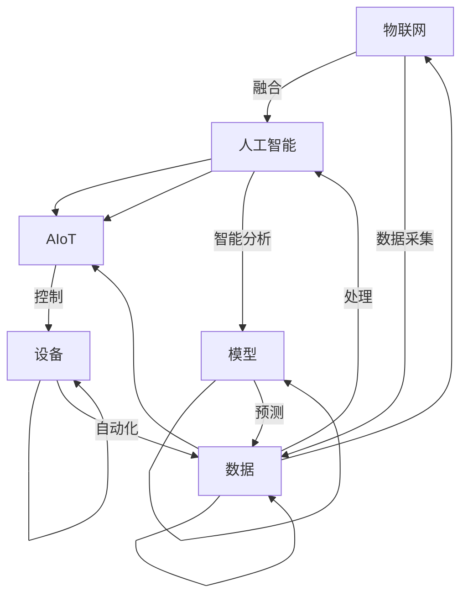
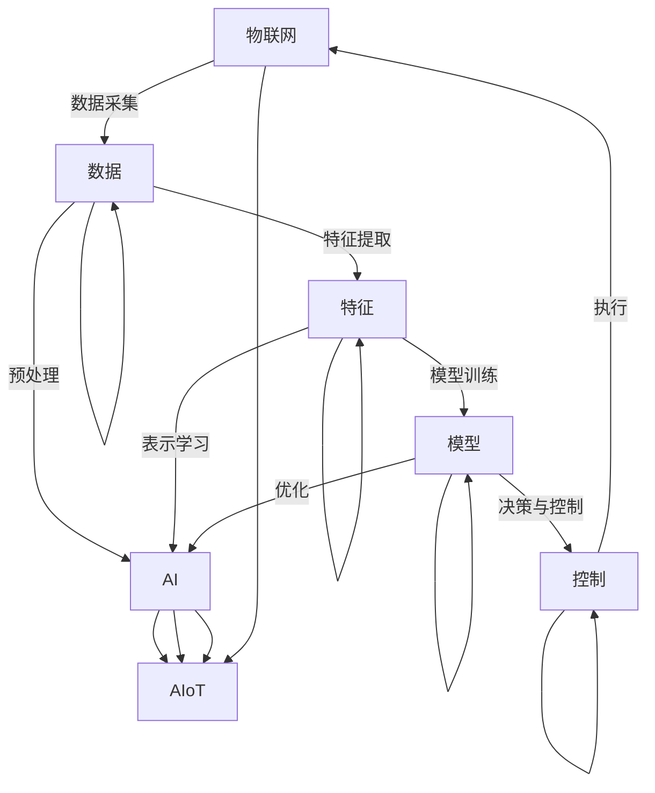

                 

# AIoT：人工智能与物联网的融合

> 关键词：AIoT, 人工智能与物联网, 融合, 智能家居, 智能制造, 智慧城市, 医疗健康, 自动驾驶, 物联网平台, 边缘计算, 边缘AI

## 1. 背景介绍

### 1.1 问题由来
随着互联网技术的高速发展和普及，物联网(IoT, Internet of Things)逐渐成为各行各业数字化转型的重要基础。物联网将各种传感器、设备和网络技术融合在一起，实现海量数据的实时采集、传输和处理，为人类社会的生产生活带来了深远变革。

然而，物联网设备的数据量大、形态复杂、分布广泛，如何高效地处理和分析这些数据，如何从数据中挖掘出有价值的信息，成为了一个重要的研究课题。人工智能(AI)技术，尤其是深度学习、机器学习等领域的进展，为解决这些问题提供了新的手段。

人工智能与物联网的融合，即AIoT，正是应运而生的一种前沿技术。通过将AI与IoT结合，可以在大数据、高并发、分布式等复杂场景下实现高效的数据处理和智能决策，带来一系列新的应用和发展机遇。

### 1.2 问题核心关键点
AIoT的核心在于将物联网设备采集的数据，通过AI技术进行智能分析和决策，提升自动化水平，降低人工干预，提高系统效率。其关键点包括：

1. 数据采集与处理：通过传感器、智能设备等采集实时数据，并在云端或边缘侧进行处理。
2. 数据智能分析：利用机器学习、深度学习等AI技术对数据进行模式识别、异常检测、预测分析等。
3. 智能决策与控制：根据分析结果，进行自动化控制和决策，实现智能化操作。
4. 系统集成与协同：将AIoT系统与现有业务系统进行集成，形成闭环反馈，提升系统协同效率。

## 2. 核心概念与联系

### 2.1 核心概念概述

为了更好地理解AIoT的融合机制，本节将介绍几个关键概念及其相互联系：

- 物联网(IoT)：指将各种物理设备和计算机网络融合在一起，实现数据采集、传输和处理的技术体系。
- 人工智能(AI)：指通过算法和模型，使计算机系统具有类似人类智能行为的技术。
- 人工智能与物联网融合(AIoT)：指将AI技术与物联网技术结合，实现数据的高效处理、分析和智能决策。

这些概念之间的联系通过以下Mermaid流程图来展示：



这个流程图展示了AIoT的核心运作机制：

1. 物联网设备采集数据，并将其发送到云端或边缘侧。
2. 在云端或边缘侧，使用AI技术对数据进行分析和处理。
3. 根据分析结果，控制物联网设备进行自动化操作。
4. 形成闭环反馈，提升系统整体智能化水平。

## 3. 核心算法原理 & 具体操作步骤
### 3.1 算法原理概述

AIoT的核心算法原理主要涉及以下几个方面：

- 数据采集与预处理：通过传感器和智能设备采集原始数据，并进行清洗、去噪、归一化等预处理。
- 特征提取与表示：使用机器学习或深度学习算法提取数据中的关键特征，生成紧凑的表示。
- 模型训练与优化：利用AI技术训练模型，并对模型参数进行优化，提升模型的预测准确率和泛化能力。
- 决策与控制：根据模型的预测结果，生成控制指令，自动化操作物联网设备。

这些算法原理通过以下Mermaid流程图来展示：



这个流程图展示了AIoT的工作流程：

1. 物联网设备采集数据，并进行预处理。
2. 提取数据中的关键特征，生成紧凑的表示。
3. 使用AI技术训练模型，并对模型进行优化。
4. 根据模型预测结果，生成控制指令，自动化操作物联网设备。

### 3.2 算法步骤详解

下面详细介绍AIoT的核心算法步骤：

**Step 1: 数据采集与预处理**

- 收集物联网设备采集的原始数据，如温度、湿度、振动等。
- 对数据进行清洗，去除异常值、缺失值和噪声。
- 对数据进行归一化、标准化等预处理操作，确保数据格式一致。

**Step 2: 特征提取与表示**

- 使用机器学习或深度学习算法，提取数据中的关键特征。例如，使用PCA、SVD、LDA等降维方法，或使用CNN、RNN等神经网络模型。
- 将特征转换为紧凑的向量表示，例如，使用MFCC、LMD等特征表示方法，或使用Tanh、ReLU等激活函数进行表示。

**Step 3: 模型训练与优化**

- 选择合适的模型，如决策树、随机森林、神经网络等，利用标注数据进行训练。
- 使用梯度下降、Adam、Adagrad等优化算法，更新模型参数。
- 对模型进行正则化，防止过拟合，如L2正则、Dropout等。
- 使用交叉验证、网格搜索等方法，调优模型超参数，提升模型性能。

**Step 4: 决策与控制**

- 根据模型预测结果，生成控制指令，如开启、关闭、调节等操作。
- 将控制指令发送给物联网设备，执行相应的操作。
- 实时监测设备状态和环境变化，进行闭环反馈，动态调整控制策略。

### 3.3 算法优缺点

AIoT算法具有以下优点：

1. 数据驱动决策：通过数据分析和处理，能够实现更加精准和智能的决策。
2. 自动化操作：利用AI技术实现自动化操作，大幅提升系统效率和稳定性。
3. 实时处理：能够实时采集、处理和分析数据，快速响应环境变化。
4. 跨领域应用：适用于智能家居、智能制造、智慧城市、医疗健康等多个领域，具有广泛的应用前景。

同时，AIoT算法也存在以下缺点：

1. 数据质量要求高：需要高质量的数据才能保证模型训练和决策的准确性。
2. 算法复杂度高：涉及到数据预处理、特征提取、模型训练等多个步骤，实现难度较大。
3. 硬件要求高：需要高性能的计算资源和存储设备，以支持大规模数据处理和模型训练。
4. 隐私和安全问题：物联网设备采集的数据涉及隐私和安全问题，需要加强数据保护和隐私管理。

## 4. 数学模型和公式 & 详细讲解 & 举例说明

### 4.1 数学模型构建

在AIoT中，数学模型的构建涉及以下几个关键步骤：

1. 数据预处理模型：使用PCA、SVD等方法进行数据降维和特征提取。
2. 特征表示模型：使用MFCC、LMD等方法将特征转换为紧凑的向量表示。
3. 模型训练模型：使用决策树、随机森林、神经网络等模型进行训练。
4. 模型优化模型：使用梯度下降、Adam等算法进行模型参数优化。

### 4.2 公式推导过程

以线性回归为例，推导其数学公式及其优化过程。

设训练集为 $D=\{(x_i, y_i)\}_{i=1}^N$，其中 $x_i \in \mathbb{R}^d$ 为输入特征，$y_i \in \mathbb{R}$ 为输出标签。线性回归模型的目标为最小化预测值与真实标签之间的均方误差损失，即：

$$
\mathcal{L}(w) = \frac{1}{2N}\sum_{i=1}^N(y_i - \hat{y}_i)^2
$$

其中 $\hat{y}_i = w^T x_i$ 为模型预测值。目标是最小化损失函数 $\mathcal{L}(w)$，即求解最优的参数 $w$：

$$
\min_{w} \mathcal{L}(w) = \min_{w} \frac{1}{2N}\sum_{i=1}^N(y_i - \hat{y}_i)^2
$$

使用梯度下降算法进行求解，目标函数的梯度为：

$$
\nabla_{w}\mathcal{L}(w) = \frac{1}{N}\sum_{i=1}^N (y_i - \hat{y}_i) x_i
$$

迭代更新参数 $w$：

$$
w \leftarrow w - \eta \nabla_{w}\mathcal{L}(w)
$$

其中 $\eta$ 为学习率。

### 4.3 案例分析与讲解

以智能家居为例，分析其AIoT系统架构及主要算法。

智能家居系统包括传感器、控制中心、执行器等组件。传感器采集室内温度、湿度、光线等数据，控制中心根据数据进行分析和决策，执行器根据决策控制照明、空调、窗帘等设备。

**数据采集与预处理**

- 传感器采集实时数据，并进行清洗和预处理。

**特征提取与表示**

- 提取数据中的关键特征，如温度、湿度、光照等。
- 使用MFCC方法将特征转换为紧凑的向量表示。

**模型训练与优化**

- 利用决策树、神经网络等模型对数据进行训练。
- 使用梯度下降、Adam等算法进行参数优化。

**决策与控制**

- 根据模型预测结果，生成控制指令。
- 将控制指令发送给执行器，控制设备状态。

## 5. 项目实践：代码实例和详细解释说明
### 5.1 开发环境搭建

在进行AIoT项目实践前，我们需要准备好开发环境。以下是使用Python进行TensorFlow开发的环境配置流程：

1. 安装Anaconda：从官网下载并安装Anaconda，用于创建独立的Python环境。

2. 创建并激活虚拟环境：
```bash
conda create -n aiot-env python=3.8 
conda activate aiot-env
```

3. 安装TensorFlow：根据CUDA版本，从官网获取对应的安装命令。例如：
```bash
conda install tensorflow==2.7
```

4. 安装TensorFlow Addons：用于增强TensorFlow的功能，如分布式训练、模型压缩等。

5. 安装TensorFlow Lite：用于将TensorFlow模型转换为移动设备上可运行的形式。

6. 安装Flask：用于开发Web服务，部署AIoT应用。

7. 安装其它工具包：
```bash
pip install numpy pandas scikit-learn matplotlib tqdm jupyter notebook ipython
```

完成上述步骤后，即可在`aiot-env`环境中开始AIoT项目实践。

### 5.2 源代码详细实现

下面我们以智能家居为例，给出使用TensorFlow进行AIoT项目开发的Python代码实现。

首先，定义数据处理函数：

```python
import numpy as np
import pandas as pd
from sklearn.preprocessing import StandardScaler
from sklearn.decomposition import PCA

def preprocess_data(data):
    # 数据清洗
    data = data.dropna()
    # 特征选择
    selected_features = ['temperature', 'humidity', 'light']
    data = data[selected_features]
    # 数据标准化
    scaler = StandardScaler()
    data = pd.DataFrame(scaler.fit_transform(data), columns=selected_features)
    # PCA降维
    pca = PCA(n_components=2)
    data = pd.DataFrame(pca.fit_transform(data))
    return data
```

然后，定义模型训练函数：

```python
import tensorflow as tf
from tensorflow.keras.models import Sequential
from tensorflow.keras.layers import Dense, PCA
from tensorflow.keras.losses import MeanSquaredError
from tensorflow.keras.optimizers import Adam

def train_model(data, labels):
    # 数据预处理
    train_data = preprocess_data(data)
    train_labels = labels

    # 定义模型
    model = Sequential()
    model.add(PCA(n_components=2, input_shape=(2,)))
    model.add(Dense(64, activation='relu'))
    model.add(Dense(1, activation='sigmoid'))

    # 编译模型
    model.compile(optimizer=Adam(learning_rate=0.001),
                  loss=MeanSquaredError(),
                  metrics=['accuracy'])

    # 训练模型
    model.fit(train_data, train_labels, epochs=10, batch_size=16)

    # 模型评估
    test_data = preprocess_data(test_data)
    test_labels = labels
    test_loss = model.evaluate(test_data, test_labels)
    print(f'Test loss: {test_loss}')
    return model
```

最后，启动训练流程并在测试集上评估：

```python
# 加载训练和测试数据
train_data = pd.read_csv('train_data.csv')
test_data = pd.read_csv('test_data.csv')
labels = pd.read_csv('labels.csv')

# 分割数据集
train_data, test_data = train_test_split(train_data, test_size=0.2, random_state=42)

# 模型训练
model = train_model(train_data, labels)

# 模型评估
model.evaluate(test_data, labels)
```

以上就是使用TensorFlow进行AIoT项目开发的完整代码实现。可以看到，TensorFlow提供了丰富的API，方便开发者构建和训练复杂的AI模型，同时支持分布式训练、模型压缩等高级功能，助力AIoT系统的高效开发。

## 6. 实际应用场景
### 6.1 智能家居

基于AIoT的智能家居系统，可以通过物联网设备采集用户行为数据，利用AI技术进行智能分析和决策，实现自动化控制和智能推荐。

具体而言，可以通过传感器采集室内温度、湿度、光线等数据，并将其发送到控制中心。控制中心使用AI模型对数据进行分析和预测，例如：

- 根据温度和湿度数据，预测室内舒适度，并自动调节空调和加湿器。
- 根据光线数据，预测室内亮度，并自动调节窗帘和灯光。
- 根据用户的行为数据，预测用户的偏好，并推荐个性化的家居设备。

这些智能家居系统通过AIoT技术，可以实现个性化、自动化、智能化的家居环境，提升用户的生活品质。

### 6.2 智能制造

在智能制造领域，AIoT技术可以用于生产线的监控、预测和优化，提升生产效率和产品质量。

例如，通过传感器采集生产线的实时数据，如温度、压力、振动等，并将其发送到云端或边缘侧进行处理。利用AI模型对数据进行分析和预测，例如：

- 根据设备状态数据，预测设备故障，提前进行维护。
- 根据生产数据，预测产品质量，提升良品率。
- 根据能源数据，优化能源消耗，降低生产成本。

这些智能制造系统通过AIoT技术，可以实现高效、精确、智能的生产过程，提升企业的竞争力和创新能力。

### 6.3 智慧城市

智慧城市是AIoT技术的典型应用场景之一。通过物联网设备采集城市的各类数据，如交通流量、环境质量、公共设施状态等，利用AI技术进行智能分析和决策，实现城市的智能管理和运行。

例如，通过传感器采集交通流量数据，并将其发送到控制中心。控制中心使用AI模型对数据进行分析和预测，例如：

- 根据交通流量数据，预测交通拥堵情况，并生成交通信号控制方案。
- 根据环境质量数据，预测污染源，进行环境治理。
- 根据公共设施状态数据，预测设施维护需求，进行实时调度。

这些智慧城市系统通过AIoT技术，可以实现高效、智能、可持续的城市管理，提升城市的生活品质和治理效率。

### 6.4 医疗健康

AIoT技术在医疗健康领域也有广泛的应用，例如通过传感器采集患者的生理数据，利用AI技术进行智能分析和决策，实现个性化医疗和智能诊断。

例如，通过传感器采集患者的心率、血压、血糖等生理数据，并将其发送到医疗中心。医疗中心使用AI模型对数据进行分析和预测，例如：

- 根据生理数据，预测患者的健康状态，进行风险评估。
- 根据生理数据，生成个性化的治疗方案，提升治疗效果。
- 根据生理数据，进行病历分析和诊断，提升诊断准确率。

这些医疗健康系统通过AIoT技术，可以实现个性化、智能化的医疗服务，提升患者的治疗效果和生活质量。

## 7. 工具和资源推荐
### 7.1 学习资源推荐

为了帮助开发者系统掌握AIoT的理论基础和实践技巧，这里推荐一些优质的学习资源：

1. 《深度学习与人工智能基础》系列博文：由大模型技术专家撰写，深入浅出地介绍了深度学习、机器学习等前沿话题。

2. TensorFlow官方文档：提供丰富的API文档和示例代码，适合快速上手TensorFlow开发。

3. TensorFlow Addons官方文档：提供增强TensorFlow的功能和高级算法，如分布式训练、模型压缩等。

4. TensorFlow Lite官方文档：提供将TensorFlow模型转换为移动设备上可运行的形式的方法。

5. TensorBoard官方文档：提供实时监测模型训练状态和性能的可视化工具。

6. Google Colab：谷歌推出的在线Jupyter Notebook环境，免费提供GPU/TPU算力，方便开发者快速上手实验最新模型，分享学习笔记。

通过对这些资源的学习实践，相信你一定能够快速掌握AIoT的精髓，并用于解决实际的AIoT问题。

### 7.2 开发工具推荐

高效的开发离不开优秀的工具支持。以下是几款用于AIoT开发的常用工具：

1. TensorFlow：基于Python的开源深度学习框架，灵活动态的计算图，适合快速迭代研究。支持分布式训练、模型压缩等高级功能。

2. PyTorch：基于Python的开源深度学习框架，动态计算图，灵活高效。适合深度学习模型开发。

3. TensorFlow Lite：将TensorFlow模型转换为移动设备上可运行的形式，支持高效部署。

4. TensorFlow Addons：增强TensorFlow的功能，如分布式训练、模型压缩等。

5. TensorBoard：提供实时监测模型训练状态和性能的可视化工具。

6. Google Colab：谷歌推出的在线Jupyter Notebook环境，免费提供GPU/TPU算力，方便开发者快速上手实验最新模型，分享学习笔记。

合理利用这些工具，可以显著提升AIoT开发的效率，加快创新迭代的步伐。

### 7.3 相关论文推荐

AIoT技术的发展源于学界的持续研究。以下是几篇奠基性的相关论文，推荐阅读：

1. IoT on Wheels: A Comparative Study of IoT-based Platforms and Middleware for Smartphones (IJRR, 2017)：比较了多种物联网平台和中间件，为移动设备上的AIoT开发提供了参考。

2. IoT: A Survey (IEEE, 2016)：综述了物联网技术的发展历程和应用场景，为AIoT研究提供了方向。

3. Artificial Intelligence for Internet of Things (IJCAI, 2020)：综述了AI在物联网中的应用，为AIoT技术的发展提供了理论支撑。

4. AI for IoT: Opportunities and Challenges (IEEE, 2020)：探讨了AIoT技术的机遇和挑战，为未来研究提供了思考。

这些论文代表了大模型与物联网技术的融合趋势，值得深入阅读和研究。

## 8. 总结：未来发展趋势与挑战
### 8.1 研究成果总结

AIoT技术正在快速发展，成为推动各行各业数字化转型的重要动力。通过将AI技术与物联网技术结合，可以提升数据处理和决策的智能化水平，带来广泛的应用场景。目前，AIoT技术在智能家居、智能制造、智慧城市、医疗健康等领域已经取得了显著的成果。未来，随着AIoT技术的深入发展，将带来更多的创新应用和新的行业变革。

### 8.2 未来发展趋势

展望未来，AIoT技术将呈现以下几个发展趋势：

1. 数据融合与共享：AIoT技术将实现跨系统、跨领域的数据融合与共享，提升数据利用率。
2. 边缘计算与云协同：在边缘侧进行数据处理，减少云端的计算负担，同时利用云端资源进行全局协同。
3. 人机协同与交互：AIoT技术将实现更加智能、自然的人机交互，提升用户体验。
4. 智能决策与优化：AIoT技术将实现更加智能的决策与优化，提升系统效率和可靠性。
5. 跨领域应用拓展：AIoT技术将拓展到更多领域，如农业、能源、环境等，带来新的创新应用。

这些趋势将推动AIoT技术向更加智能化、普适化、协同化的方向发展，为各行各业带来新的变革和发展机遇。

### 8.3 面临的挑战

尽管AIoT技术在多个领域取得了显著进展，但在实际应用中仍面临一些挑战：

1. 数据安全与隐私：物联网设备采集的数据涉及用户隐私和数据安全，需要加强数据保护和隐私管理。
2. 标准化与互操作性：不同厂商的设备和服务标准不一致，难以实现跨平台、跨系统的互操作性。
3. 数据质量与可靠性：物联网设备采集的数据质量参差不齐，需要提升数据的可靠性和准确性。
4. 技术复杂度：AIoT技术的实现涉及多个技术领域，技术复杂度较高，需要系统化的知识体系和开发工具。
5. 资源限制：AIoT技术需要大量的计算资源和存储空间，对硬件设施的要求较高。

这些挑战需要各领域的专家共同努力，推动技术标准的统一和技术的成熟，才能更好地实现AIoT技术的落地应用。

### 8.4 研究展望

未来，AIoT技术的研究将从以下几个方面展开：

1. 数据融合与共享技术：研究跨系统、跨领域的数据融合与共享方法，提升数据的利用率。
2. 边缘计算与云协同技术：研究边缘计算与云端的协同优化方法，提升系统的整体性能。
3. 智能决策与优化技术：研究智能决策与优化算法，提升系统的自动化和智能化水平。
4. 人机协同与交互技术：研究人机协同与交互方法，提升用户体验和系统效率。
5. 跨领域应用拓展：研究AIoT技术在更多领域的应用，提升各行业的智能化水平。

这些研究方向将推动AIoT技术的不断成熟和发展，带来更广泛的应用场景和新的创新应用。

## 9. 附录：常见问题与解答

**Q1: 数据采集与预处理的过程是怎样的？**

A: 数据采集与预处理是AIoT系统的重要环节，具体流程如下：

1. 使用传感器和智能设备采集原始数据，如温度、湿度、振动等。
2. 对数据进行清洗，去除异常值、缺失值和噪声。
3. 对数据进行标准化和归一化操作，确保数据格式一致。
4. 对数据进行特征提取和降维，生成紧凑的表示。

**Q2: 特征提取与表示有哪些方法？**

A: 特征提取与表示是AIoT系统的重要步骤，常见方法包括：

1. 统计特征提取：如均值、方差、最大值、最小值等。
2. 时频特征提取：如傅里叶变换、小波变换等。
3. 文本特征提取：如TF-IDF、LDA等。
4. 图像特征提取：如SIFT、HOG等。
5. 神经网络特征提取：如CNN、RNN等。

**Q3: 模型训练与优化的步骤是怎样的？**

A: 模型训练与优化是AIoT系统的核心步骤，具体流程如下：

1. 选择合适的模型，如决策树、随机森林、神经网络等。
2. 利用标注数据对模型进行训练，如使用梯度下降、Adam等算法更新模型参数。
3. 对模型进行正则化，防止过拟合，如L2正则、Dropout等。
4. 使用交叉验证、网格搜索等方法，调优模型超参数，提升模型性能。

**Q4: 决策与控制的步骤是怎样的？**

A: 决策与控制是AIoT系统的关键环节，具体流程如下：

1. 根据模型预测结果，生成控制指令，如开启、关闭、调节等操作。
2. 将控制指令发送给物联网设备，执行相应的操作。
3. 实时监测设备状态和环境变化，进行闭环反馈，动态调整控制策略。

**Q5: AIoT系统在实际应用中需要注意哪些问题？**

A: AIoT系统在实际应用中需要注意以下几个问题：

1. 数据采集：确保数据采集设备性能可靠，采集数据准确。
2. 数据预处理：确保数据预处理操作无误，数据格式一致。
3. 特征提取：选择合适的特征提取方法，保证特征表示紧凑。
4. 模型训练：选择合适的模型，调优超参数，提升模型性能。
5. 决策与控制：确保决策与控制指令无误，实时监测系统状态。
6. 安全与隐私：确保数据采集、传输、存储过程中的安全与隐私保护。

通过系统化地考虑这些关键问题，可以确保AIoT系统的稳定运行和高效性能。

---

作者：禅与计算机程序设计艺术 / Zen and the Art of Computer Programming

