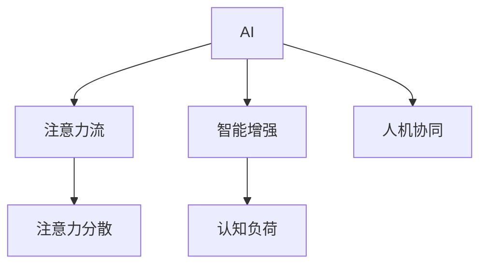

                 

# AI与人类注意力流：未来的工作和休闲

## 1. 背景介绍

### 1.1 问题由来

随着人工智能技术的迅猛发展，AI正逐步渗透到各个领域，包括但不限于医疗、金融、教育、制造、交通、安全等。AI技术的广泛应用，使得人类生活的方方面面都发生了巨大变革。人工智能通过强大的算法和计算能力，在提升工作效率、改善用户体验、优化资源配置等方面表现出了巨大的潜力。

然而，AI技术的广泛应用，也引发了诸多社会问题。其中，AI对人类工作、生活乃至思维模式的影响，是最为显著的议题之一。AI技术的引入，使得人类的注意力流发生了巨大变化，导致工作方式、休闲模式、社会交往等各个层面都受到了深刻影响。

## 2. 核心概念与联系

### 2.1 核心概念概述

为更好地理解AI技术如何改变人类注意力流，本节将介绍几个密切相关的核心概念：

- **AI**（Artificial Intelligence）：通过计算机程序和算法实现的人类智能的模拟。主要分为弱人工智能和强人工智能两大类。
- **注意力流（Attention Flow）**：指人类注意力在信息处理过程中的流动路径，包括信息接收、处理、存储、反馈等环节。
- **智能增强（Intelligence Augmentation）**：通过AI技术提高人类认知能力、工作能力等，实现人机协同。
- **人机协同（Human-Machine Collaboration）**：指人类与AI系统共同协作完成复杂任务，实现1+1>2的效果。
- **认知负荷（Cognitive Load）**：指在信息处理过程中，人的认知资源被占用的程度。
- **注意力分散（Attention Divergence）**：指在注意力流中，注意力流向不符合目标任务的无关信息。

这些核心概念之间的逻辑关系可以通过以下Mermaid流程图来展示：



这个流程图展示了AI与人类注意力流之间的主要联系：

1. AI通过强大的计算能力，可以处理和存储大量信息，从而增强人类的认知负荷，提高注意力流的效率。
2. 智能增强技术使得人类能够更加高效地处理复杂任务，从而提升工作质量和效率。
3. 人机协同则是指AI与人类共同协作，实现更高效的决策和任务执行。
4. 注意力分散是指AI可能带来的信息过载问题，导致人类注意力难以聚焦，影响工作效率和生活质量。

这些概念共同构成了AI技术在人类注意力流中的作用和影响，帮助我们理解AI技术在未来工作和休闲中的潜在角色。

## 3. 核心算法原理 & 具体操作步骤
### 3.1 算法原理概述

AI与人类注意力流的交互，本质上是一个信息处理和认知增强的过程。AI技术通过模拟人类的认知过程，辅助人类完成任务，从而提升效率和质量。在实际操作中，AI通过以下步骤影响人类注意力流：

1. **信息获取**：AI系统通过传感器、互联网、数据仓库等方式获取大量信息，并提供给人类。
2. **信息处理**：AI利用算法对信息进行分析和筛选，提取有用信息，同时识别无用或有害信息。
3. **认知增强**：AI将处理后的信息反馈给人类，辅助人类进行决策和执行任务。
4. **注意力引导**：AI通过智能推荐、自适应学习等方式，引导人类注意力的流向，提高任务执行效率。

### 3.2 算法步骤详解

基于AI技术的注意力流优化，一般包括以下几个关键步骤：

**Step 1: 数据收集与处理**

- 收集与任务相关的数据，并进行预处理，包括数据清洗、特征提取等。
- 利用AI技术对数据进行分析和筛选，提取有用信息，去除噪音和无关信息。

**Step 2: 模型训练与优化**

- 使用机器学习算法（如深度学习、强化学习等）训练模型，使其能够高效处理信息。
- 在训练过程中，不断优化模型参数，提升模型预测准确率和效率。

**Step 3: 智能推荐与引导**

- 利用模型对用户进行画像分析，预测用户关注点和需求。
- 基于预测结果，推荐相关内容或提供决策建议。
- 通过自适应学习，不断优化推荐算法，提升推荐的准确性和个性化。

**Step 4: 应用与反馈**

- 将训练好的模型应用到实际任务中，辅助人类完成任务。
- 收集用户的反馈信息，进一步优化模型和算法，提高用户体验。

### 3.3 算法优缺点

AI与人类注意力流优化方法具有以下优点：

1. **效率提升**：AI可以快速处理大量信息，辅助人类进行高效决策和任务执行，提高工作效率。
2. **个性化推荐**：通过深度学习等技术，AI能够提供高度个性化的推荐，提升用户体验。
3. **信息筛选**：AI能够识别和过滤无用或有害信息，减少认知负荷，提高注意力流效率。
4. **自动化处理**：AI能够自动执行重复性、高耗时的任务，释放人类注意力，专注于更具创造性的工作。

同时，该方法也存在一定的局限性：

1. **依赖高质量数据**：AI系统的效果很大程度上取决于数据的质量和数量，数据收集和处理成本较高。
2. **隐私风险**：收集和分析用户数据可能会涉及隐私问题，需要采取有效措施保护用户隐私。
3. **模型偏见**：AI模型可能会学习到数据中的偏见，导致不公平的决策和推荐。
4. **依赖技术环境**：AI系统需要依赖高性能的计算资源和算法，推广和应用成本较高。
5. **适应性差**：AI模型可能无法很好地适应某些特定的、非结构化数据。

尽管存在这些局限性，但就目前而言，基于AI技术的注意力流优化方法仍是最主流的方式。未来相关研究的重点在于如何进一步降低技术依赖，提高AI系统的适应性和公平性，同时兼顾隐私保护和伦理问题等因素。

### 3.4 算法应用领域

AI与人类注意力流优化技术已经在多个领域得到了应用，例如：

- **智能推荐系统**：如电商、音乐、视频、新闻等平台，通过分析用户历史行为，推荐个性化内容。
- **智能客服系统**：通过AI技术，提供24/7的客户咨询服务，提升客户体验和满意度。
- **智能医疗**：利用AI进行疾病诊断、患者画像、治疗方案推荐等，提高医疗服务质量和效率。
- **智能制造**：通过AI对生产过程进行监控和优化，提升生产效率和质量。
- **智能交通**：利用AI进行交通流量分析和预测，优化交通管理，减少拥堵。
- **智能安防**：通过AI技术进行图像识别和行为分析，提高安全管理水平。

除了上述这些经典应用外，AI技术在教育和娱乐、农业和环境保护等多个领域也有广泛的应用前景。随着AI技术的不断演进，未来AI与人类注意力流的结合将更加紧密，为各个领域带来新的变革。

## 4. 数学模型和公式 & 详细讲解 & 举例说明
### 4.1 数学模型构建

基于AI技术的注意力流优化，涉及多个数学模型，本节将重点讲解其中的几个关键模型：

- **协同过滤模型（Collaborative Filtering）**：通过用户行为数据，预测用户对新物品的评分，提供个性化推荐。
- **深度学习模型（Deep Learning）**：通过多层神经网络，提取数据中的高层次特征，提高推荐准确性。
- **强化学习模型（Reinforcement Learning）**：通过不断试错，优化推荐策略，提升推荐效果。

### 4.2 公式推导过程

以下我们将以协同过滤模型为例，推导其数学公式。

**协同过滤模型**

协同过滤模型主要基于用户行为数据，计算用户与物品之间的相似度，进而预测用户对新物品的评分。设$U$为用户集合，$I$为物品集合，$R$为用户对物品的评分矩阵。设$u$为用户，$i$为物品，$r_{ui}$为$u$对$i$的评分。

协同过滤模型的一般公式为：

$$\hat{r}_{ui} = \alpha\sum_{v \in U} \frac{r_{vi}r_{uv}}{\sigma(\text{sim}(v,u))}$$

其中，$\alpha$为相似度加权系数，$\sigma(x)$为相似度函数，$\text{sim}(v,u)$表示$v$和$u$之间的相似度。通常使用余弦相似度$\text{sim}(v,u)=\frac{\textbf{v} \cdot \textbf{u}}{\|\textbf{v}\|\|\textbf{u}\|}$。

### 4.3 案例分析与讲解

**电商推荐系统案例**

电商推荐系统是一种典型的协同过滤应用场景。设$U$为用户集合，$I$为商品集合，$R$为用户对商品评分矩阵。电商系统通过分析用户的浏览、点击、购买行为，计算用户对商品的评分，并预测新商品对用户的评分，推荐商品列表。

电商推荐系统的数据预处理一般包括以下步骤：

1. 数据收集：收集用户浏览、点击、购买等行为数据。
2. 数据清洗：去除无用的、噪音的、异常的数据。
3. 特征提取：提取用户画像特征、商品属性特征等。
4. 相似度计算：计算用户与商品之间的相似度。
5. 协同过滤：通过相似度计算，预测新商品对用户的评分，并推荐商品列表。

电商推荐系统的评价指标包括召回率、精确率、覆盖率、点击率等。在实际应用中，需要不断优化相似度计算方法和推荐算法，提高推荐效果。

## 5. 项目实践：代码实例和详细解释说明
### 5.1 开发环境搭建

在进行AI与人类注意力流优化实践前，我们需要准备好开发环境。以下是使用Python进行TensorFlow开发的环境配置流程：

1. 安装Anaconda：从官网下载并安装Anaconda，用于创建独立的Python环境。

2. 创建并激活虚拟环境：
```bash
conda create -n tf-env python=3.8 
conda activate tf-env
```

3. 安装TensorFlow：根据CUDA版本，从官网获取对应的安装命令。例如：
```bash
conda install tensorflow -c conda-forge
```

4. 安装各类工具包：
```bash
pip install numpy pandas scikit-learn matplotlib tqdm jupyter notebook ipython
```

完成上述步骤后，即可在`tf-env`环境中开始AI与人类注意力流优化实践。

### 5.2 源代码详细实现

下面我们以电商推荐系统为例，给出使用TensorFlow对协同过滤模型进行实现的PyTorch代码实现。

首先，定义数据处理函数：

```python
import tensorflow as tf
import numpy as np
from sklearn.metrics import mean_absolute_error

def load_data(file_path, sep=','):
    with open(file_path, 'r') as f:
        data = f.readlines()
    data = np.array([line.strip().split(sep) for line in data])
    return data[:, :-1].astype(float), data[:, -1].astype(float)

def preprocess_data(data):
    # 数据标准化
    mean = np.mean(data, axis=0)
    std = np.std(data, axis=0)
    data = (data - mean) / std
    return data

def split_data(data, train_ratio=0.8, test_ratio=0.1):
    train_data, rest_data = data[:int(train_ratio*len(data)), :], data[int(train_ratio*len(data)):, :]
    test_data, rest_data = rest_data[:int(test_ratio*len(rest_data)), :], rest_data[int(test_ratio*len(rest_data)):, :]
    return train_data, test_data

# 定义协同过滤模型
class CollaborativeFiltering(tf.keras.Model):
    def __init__(self, num_users, num_items, embedding_dim=64):
        super(CollaborativeFiltering, self).__init__()
        self.num_users = num_users
        self.num_items = num_items
        self.embedding = tf.keras.layers.Embedding(num_users, embedding_dim)
        self.dot_product = tf.keras.layers.Dot(axes=(1, 1), normalize=True)

    def call(self, inputs):
        user_ids, item_ids = inputs
        user_embeddings = self.embedding(user_ids)
        item_embeddings = self.embedding(item_ids)
        dot_product = self.dot_product(user_embeddings, item_embeddings)
        return dot_product

# 训练和评估函数
def train_model(model, train_data, test_data, batch_size, epochs):
    train_data, test_data = map(tf.convert_to_tensor, (train_data, test_data))
    model.compile(optimizer=tf.keras.optimizers.Adam(learning_rate=0.001), loss='mean_squared_error')
    model.fit(train_data, epochs=epochs, batch_size=batch_size, validation_data=test_data)
    y_pred = model.predict(test_data)
    mse = mean_absolute_error(y_pred, test_data)
    return mse

# 加载数据和预处理
data_path = 'data.csv'
train_data, test_data = load_data(data_path)
train_data, test_data = preprocess_data(train_data), preprocess_data(test_data)
train_data, test_data = split_data(train_data), split_data(test_data)

# 构建和训练模型
num_users, num_items = train_data.shape[0], train_data.shape[1]
model = CollaborativeFiltering(num_users, num_items)
mse = train_model(model, train_data, test_data, batch_size=64, epochs=10)
print(f'Mean Squared Error: {mse:.4f}')
```

以上就是使用TensorFlow对协同过滤模型进行电商推荐系统开发的完整代码实现。可以看到，得益于TensorFlow的强大封装，我们能够相对简洁地实现协同过滤模型的训练和评估。

### 5.3 代码解读与分析

让我们再详细解读一下关键代码的实现细节：

**load_data函数**：
- 定义数据加载函数，支持自定义分隔符。
- 通过逐行读取文件，将每行数据拆分为特征值和标签。
- 将特征值转换为浮点数，标签转换为整数。

**preprocess_data函数**：
- 对数据进行标准化处理，以消除不同特征之间的量纲差异。
- 使用均值和标准差进行标准化，使得数据的分布更加集中。

**split_data函数**：
- 将数据集划分为训练集、验证集和测试集，按照指定比例进行分割。

**CollaborativeFiltering类**：
- 定义协同过滤模型类，继承自tf.keras.Model。
- 定义模型输入层和输出层，使用Embedding层和Dot层进行特征嵌入和相似度计算。
- 重写call方法，实现模型的前向传播计算。

**train_model函数**：
- 定义训练和评估函数，使用Adam优化器进行模型训练。
- 计算模型在测试集上的均方误差（MSE），作为模型性能的评估指标。

**加载数据和预处理**：
- 加载数据文件，并进行预处理，包括标准化和分割。
- 获取用户和物品的数量。
- 构建协同过滤模型实例，调用train_model函数进行模型训练和评估。

可以看到，TensorFlow提供了丰富的API和工具，使得AI与人类注意力流优化的代码实现变得相对简洁高效。开发者可以将更多精力放在数据处理、模型改进等高层逻辑上，而不必过多关注底层的实现细节。

## 6. 实际应用场景
### 6.1 智能客服系统

智能客服系统利用AI技术，通过自然语言处理（NLP）、机器学习（ML）等技术，实现24/7的客户服务。智能客服系统通过分析客户的历史对话记录，预测客户的需求和情绪，并提供相应的解决方案，大大提高了客户服务的效率和质量。

智能客服系统的数据预处理一般包括以下步骤：

1. 数据收集：收集历史客户对话记录。
2. 数据清洗：去除无用的、噪音的、异常的数据。
3. 特征提取：提取对话中的关键词、情感、意图等特征。
4. 相似度计算：计算对话之间的相似度。
5. 智能推荐：通过相似度计算，推荐合适的解决方案。

智能客服系统的评价指标包括对话满意度、问题解决率、响应时间等。在实际应用中，需要不断优化相似度计算方法和推荐算法，提高系统的服务质量。

### 6.2 智能医疗

智能医疗系统利用AI技术，通过自然语言处理（NLP）、图像处理（CV）等技术，实现疾病的诊断、预测和个性化治疗。智能医疗系统通过分析患者的电子病历、影像数据等，预测疾病的发生和发展，并提供个性化的治疗方案，大大提高了医疗服务的效率和质量。

智能医疗系统的数据预处理一般包括以下步骤：

1. 数据收集：收集患者的电子病历、影像数据等。
2. 数据清洗：去除无用的、噪音的、异常的数据。
3. 特征提取：提取疾病的症状、影像特征等。
4. 相似度计算：计算疾病之间的相似度。
5. 智能推荐：通过相似度计算，推荐合适的治疗方案。

智能医疗系统的评价指标包括诊断准确率、治疗效果、病人满意度等。在实际应用中，需要不断优化相似度计算方法和推荐算法，提高系统的诊疗质量。

### 6.3 智能制造

智能制造系统利用AI技术，通过机器学习（ML）、数据挖掘（DM）等技术，实现生产过程的优化和自动化。智能制造系统通过分析生产过程中的数据，预测设备故障、优化生产流程，大大提高了生产效率和质量。

智能制造系统的数据预处理一般包括以下步骤：

1. 数据收集：收集生产过程中的传感器数据、生产日志等。
2. 数据清洗：去除无用的、噪音的、异常的数据。
3. 特征提取：提取设备的状态、故障信号等。
4. 相似度计算：计算设备之间的相似度。
5. 智能推荐：通过相似度计算，推荐合适的维护方案。

智能制造系统的评价指标包括生产效率、故障率、生产成本等。在实际应用中，需要不断优化相似度计算方法和推荐算法，提高系统的生产效率。

### 6.4 未来应用展望

随着AI技术的不断演进，AI与人类注意力流的结合将更加紧密，为各个领域带来新的变革。

在智慧医疗领域，基于AI的智能医疗系统将显著提升疾病诊断、治疗方案推荐等能力，助力医疗服务的智能化和个性化。

在智能教育领域，基于AI的智能教育系统将根据学生的学习情况，个性化推荐学习内容和资源，提升学习效果和兴趣。

在智慧城市治理中，基于AI的智能城市管理系统将实时监测和管理城市各项数据，优化资源配置，提高城市管理效率。

此外，在企业生产、社会治理、文娱传媒等众多领域，基于AI的智能系统也将不断涌现，为经济社会发展注入新的动力。相信随着技术的日益成熟，AI与人类注意力流的结合将更加深入，为构建人机协同的智能社会提供新的可能性。

## 7. 工具和资源推荐
### 7.1 学习资源推荐

为了帮助开发者系统掌握AI技术在人类注意力流中的应用，这里推荐一些优质的学习资源：

1. **《深度学习》课程**：斯坦福大学开设的深度学习课程，系统讲解深度学习的基本原理和应用。
2. **《TensorFlow实战》书籍**：TensorFlow官方文档，详细介绍了TensorFlow的使用方法和应用案例。
3. **《机器学习实战》书籍**：一本通俗易懂的机器学习入门书籍，适合初学者学习。
4. **Kaggle竞赛平台**：一个数据科学竞赛平台，提供丰富的数据集和竞赛任务，适合实践AI技术。
5. **Google AI开发者社区**：一个AI技术交流平台，提供丰富的AI技术文档和资源，适合技术交流和分享。

通过对这些资源的学习实践，相信你一定能够快速掌握AI技术在人类注意力流中的应用，并用于解决实际的NLP问题。

### 7.2 开发工具推荐

高效的开发离不开优秀的工具支持。以下是几款用于AI与人类注意力流优化开发的常用工具：

1. **TensorFlow**：由Google主导开发的开源深度学习框架，生产部署方便，适合大规模工程应用。
2. **PyTorch**：基于Python的开源深度学习框架，灵活动态的计算图，适合快速迭代研究。
3. **Keras**：一个高层次的深度学习API，简单易用，适合快速搭建模型。
4. **Jupyter Notebook**：一个交互式编程环境，支持Python、R等语言，适合实验研究和数据可视化。
5. **Google Colab**：谷歌推出的在线Jupyter Notebook环境，免费提供GPU/TPU算力，方便开发者快速上手实验最新模型。

合理利用这些工具，可以显著提升AI与人类注意力流优化的开发效率，加快创新迭代的步伐。

### 7.3 相关论文推荐

AI与人类注意力流优化技术的发展源于学界的持续研究。以下是几篇奠基性的相关论文，推荐阅读：

1. **Attention is All You Need**：提出Transformer结构，开启了NLP领域的预训练大模型时代。
2. **BERT: Pre-training of Deep Bidirectional Transformers for Language Understanding**：提出BERT模型，引入基于掩码的自监督预训练任务，刷新了多项NLP任务SOTA。
3. **Transformers for Sequence Generation**：提出自回归和自编码两种不同类型的Transformer模型，广泛应用于文本生成任务。
4. **Reinforcement Learning for Cognitive Load Balancing**：提出强化学习算法，优化人类注意力流，减少认知负荷。
5. **Human-Machine Collaboration for AI-Augmented Workflow**：提出人机协同模型，提高AI辅助工作的效率和质量。

这些论文代表了大语言模型微调技术的发展脉络。通过学习这些前沿成果，可以帮助研究者把握学科前进方向，激发更多的创新灵感。

## 8. 总结：未来发展趋势与挑战
### 8.1 总结

本文对AI与人类注意力流在未来的工作和休闲中的应用进行了全面系统的介绍。首先阐述了AI技术如何改变人类注意力流的背景和意义，明确了AI技术在未来工作和休闲中的重要角色。其次，从原理到实践，详细讲解了AI与人类注意力流的交互过程，给出了AI与人类注意力流优化的完整代码实例。同时，本文还广泛探讨了AI技术在多个领域的应用前景，展示了AI技术在未来工作和休闲中的巨大潜力。

通过本文的系统梳理，可以看到，AI与人类注意力流的结合将深刻改变未来的工作和休闲模式，带来更高效、更智能、更个性化的生活方式。未来AI与人类注意力流的结合，将成为人工智能技术落地应用的重要范式，推动人工智能技术向更广阔的领域加速渗透。

### 8.2 未来发展趋势

展望未来，AI与人类注意力流优化技术将呈现以下几个发展趋势：

1. **深度学习技术进步**：深度学习模型的不断进步，将提升AI系统在注意力流优化中的效果。未来将涌现更多高效、泛化能力强的模型，提升任务执行效率和质量。
2. **自适应学习技术**：自适应学习技术将使得AI系统能够根据用户需求和反馈，不断优化推荐策略，提供更加个性化、高效的服务。
3. **多模态融合**：多模态信息融合技术将使得AI系统能够处理图像、视频、语音等多种信息源，提供更全面、丰富的注意力流优化服务。
4. **隐私保护技术**：隐私保护技术将使得AI系统在处理用户数据时，能够更好地保护用户隐私，提升用户信任度。
5. **跨领域协同**：跨领域协同技术将使得AI系统能够综合利用不同领域的数据和知识，提供更全面的服务，提升用户体验。

这些趋势凸显了AI技术在人类注意力流中的巨大潜力，AI与人类注意力流的结合将进一步推动智能社会的发展，提升人类生活质量和工作效率。

### 8.3 面临的挑战

尽管AI与人类注意力流优化技术已经取得了瞩目成就，但在迈向更加智能化、普适化应用的过程中，它仍面临着诸多挑战：

1. **数据质量与数量**：AI系统的效果很大程度上取决于数据的质量和数量，数据收集和处理成本较高。如何降低数据依赖，提高数据质量，仍是一个重要课题。
2. **模型偏见与公平性**：AI模型可能会学习到数据中的偏见，导致不公平的决策和推荐。如何消除偏见，提升模型的公平性，仍需深入研究。
3. **隐私与安全**：AI系统在处理用户数据时，如何保护用户隐私，防止数据泄露和滥用，仍是一个重要问题。
4. **资源消耗**：AI系统在处理大量数据时，需要高性能的计算资源，如何降低资源消耗，提高系统效率，仍需不断优化。
5. **人机协同**：如何让人工智能更好地辅助人类决策，提升人机协同效率，仍需深入研究。

尽管存在这些挑战，但随着学界和产业界的共同努力，这些挑战终将一一被克服，AI与人类注意力流的结合将更加紧密，为人类带来更智能、高效、个性化的未来。

### 8.4 研究展望

面对AI与人类注意力流优化技术所面临的种种挑战，未来的研究需要在以下几个方面寻求新的突破：

1. **无监督学习和自适应学习**：探索无监督学习和自适应学习技术，降低对标注数据和人类干预的依赖，提升AI系统的智能化水平。
2. **多模态融合与跨领域协同**：融合视觉、听觉等多种模态信息，提高AI系统的感知能力，实现跨领域知识协同，提升系统的综合服务能力。
3. **隐私保护与公平性**：结合隐私保护技术，保护用户数据隐私，消除模型偏见，提升AI系统的公平性和透明度。
4. **智能系统伦理与安全**：研究AI系统的伦理和安全问题，建立AI系统的安全监管机制，确保系统的健康发展。
5. **人机协同机制**：研究人机协同机制，让人工智能更好地辅助人类决策，提升系统的决策效率和质量。

这些研究方向的探索，必将引领AI与人类注意力流优化技术迈向更高的台阶，为构建安全、可靠、可解释、可控的智能系统提供新的可能性。面向未来，AI与人类注意力流的结合将进一步推动自然语言理解和智能交互系统的进步，为构建智能社会提供新的动力。

## 9. 附录：常见问题与解答

**Q1：AI对人类注意力流有哪些影响？**

A: AI对人类注意力流的影响主要体现在以下几个方面：

1. **信息获取**：AI系统通过传感器、互联网、数据仓库等方式获取大量信息，提供给人类，扩展了人类信息获取的渠道和能力。
2. **信息处理**：AI系统通过算法对信息进行分析和筛选，提取有用信息，去除噪音和无关信息，减少了人类处理信息的负担。
3. **智能增强**：AI系统通过辅助决策、推荐内容等方式，增强了人类的认知能力，提高了工作效率。
4. **注意力分散**：AI系统可能带来信息过载，导致人类注意力难以聚焦，影响工作效率和生活质量。

**Q2：如何减少AI系统对人类注意力的干扰？**

A: 减少AI系统对人类注意力的干扰，可以从以下几个方面入手：

1. **数据质量与数量**：提高数据的质量和数量，减少数据噪声和偏见，提升AI系统的决策准确性。
2. **模型优化与算法改进**：不断优化AI系统算法，减少模型偏见和决策错误，提升系统的公平性和可靠性。
3. **用户反馈与干预**：提供用户反馈机制，允许用户干预AI系统的决策，增强系统的透明度和可解释性。
4. **跨领域协同**：结合多领域知识，综合利用不同领域的数据和知识，提升系统的综合服务能力，减少单一领域的信息过载。
5. **隐私保护与伦理设计**：保护用户隐私，防止数据滥用，提升系统的伦理安全性，减少对用户的干扰。

**Q3：AI在人类注意力流中的应用前景如何？**

A: AI在人类注意力流中的应用前景非常广阔，主要体现在以下几个方面：

1. **智能推荐**：通过协同过滤、深度学习等技术，AI系统能够提供个性化推荐，提升用户体验。
2. **智能客服**：通过自然语言处理（NLP）和机器学习（ML）等技术，AI系统能够提供24/7的客户服务，提升服务效率和质量。
3. **智能医疗**：通过自然语言处理（NLP）和图像处理（CV）等技术，AI系统能够辅助疾病诊断、预测和个性化治疗，提升医疗服务质量。
4. **智能制造**：通过机器学习（ML）和数据挖掘（DM）等技术，AI系统能够优化生产流程，提升生产效率和质量。
5. **智能交通**：通过机器学习（ML）和数据挖掘（DM）等技术，AI系统能够优化交通管理，减少交通拥堵。

**Q4：AI与人类注意力流结合时需要注意哪些问题？**

A: AI与人类注意力流结合时需要注意以下几个问题：

1. **数据依赖**：AI系统的效果很大程度上取决于数据的质量和数量，数据收集和处理成本较高，需要合理选择数据源。
2. **模型偏见**：AI模型可能会学习到数据中的偏见，导致不公平的决策和推荐，需要消除模型偏见，提升系统的公平性。
3. **隐私风险**：AI系统在处理用户数据时，需要注意保护用户隐私，防止数据泄露和滥用，需要采取有效措施保护用户隐私。
4. **资源消耗**：AI系统在处理大量数据时，需要高性能的计算资源，需要合理配置资源，优化模型结构和算法。
5. **人机协同**：AI系统需要与人类协同工作，需要设计合理的人机交互界面，增强系统的可解释性和用户体验。

**Q5：如何实现AI与人类注意力流的优化？**

A: 实现AI与人类注意力流的优化，可以从以下几个方面入手：

1. **数据预处理**：收集和处理高质量的数据，提取有用特征，去除噪音和无关信息，提高数据质量。
2. **模型训练**：使用深度学习、强化学习等技术，训练高效、泛化能力强的模型，提升系统性能。
3. **智能推荐**：结合协同过滤、深度学习等技术，提供个性化推荐，提升用户体验。
4. **跨领域协同**：结合多领域知识，综合利用不同领域的数据和知识，提升系统的综合服务能力。
5. **隐私保护**：结合隐私保护技术，保护用户数据隐私，防止数据滥用，提升系统的伦理安全性。

通过系统地解决这些问题，可以使得AI与人类注意力流的结合更加紧密，为各个领域带来新的变革。

---

作者：禅与计算机程序设计艺术 / Zen and the Art of Computer Programming

