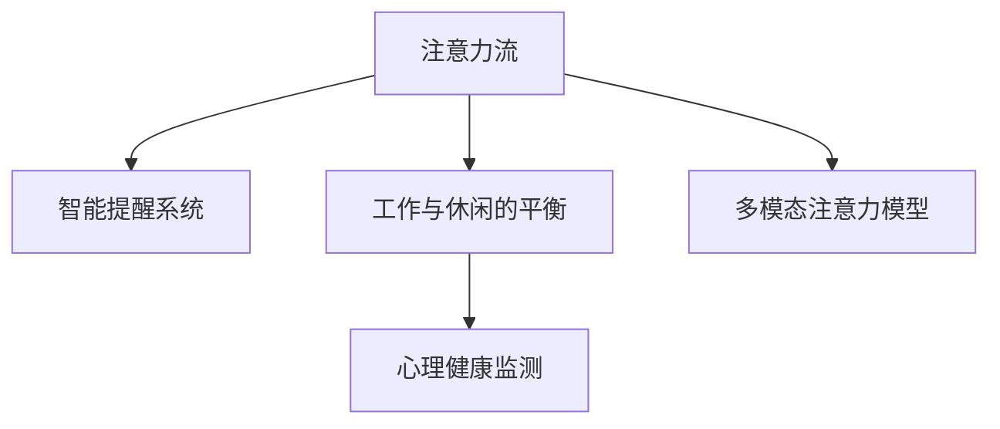

                 

# AI与人类注意力流：未来的工作和休闲

## 1. 背景介绍

### 1.1 问题由来
随着人工智能（AI）技术的飞速发展，AI已经逐渐渗透到我们生活的方方面面，从智能音箱、智能家居到医疗、金融、教育等领域，AI都在发挥着越来越重要的作用。然而，尽管AI技术在提升效率、降低成本等方面带来了巨大的便利，但与此同时，它也对人类的注意力流产生了深远的影响。

在当前社会，人们的注意力已经被各种信息流和娱乐内容所分流，尤其是在工作环境中，这种分流现象更加严重。如何有效管理人类注意力流，使其在工作和休闲中发挥最大的效能，是当前亟待解决的重要问题。

### 1.2 问题核心关键点
人类注意力流管理的核心关键点在于如何利用AI技术，通过分析和理解人类注意力模式，帮助人们更好地管理自己的注意力，提高工作效率，优化休闲生活。具体来说，AI可以通过以下几种方式实现对人类注意力流的管理：

1. **注意力分析和预测**：通过分析人类行为数据，预测其注意力模式，从而提供个性化的工作和休闲建议。
2. **智能提醒和辅助**：利用AI算法，根据注意力模式，智能提醒用户进行工作、休息或娱乐，避免过度劳累或疲劳。
3. **环境优化和调整**：通过智能设备对环境进行优化和调整，如调节光线、温度、声音等，提升工作或休闲环境的舒适度。
4. **交互式学习和培训**：通过AI与用户的互动，进行个性化的学习或技能培训，提升注意力集中度。
5. **心理健康监测和干预**：通过AI对人类注意力流的监测，及时发现注意力集中度下降的征兆，并提供相应的干预措施。

### 1.3 问题研究意义
研究人类注意力流与AI技术结合的方法，对于提高个人工作效率、优化休闲生活、提升整体社会生产力具有重要意义。AI技术能够通过智能分析和预测，帮助人们更好地管理自己的注意力，从而在工作和休闲中达到最佳状态。

具体来说，AI技术可以帮助我们：
- 提高工作效率，减少因注意力分散而导致的低效工作；
- 优化休闲生活，通过智能推荐，丰富休闲活动内容，提升休闲质量；
- 增强心理健康，及时发现注意力集中度下降的征兆，并进行有效干预。

## 2. 核心概念与联系

### 2.1 核心概念概述

为更好地理解AI与人类注意力流的结合，本节将介绍几个密切相关的核心概念：

- **注意力流（Attention Flow）**：指人类在日常工作、学习、娱乐等活动中，注意力集中的时间序列和分布情况。注意力流的数据可以反映出个体在特定时间段的专注程度和疲劳程度。
- **智能提醒系统（Smart Reminder System）**：基于AI算法，能够根据用户的注意力流模式，智能提醒用户进行工作、休息或娱乐的系统。
- **工作与休闲的平衡（Work-Life Balance）**：通过智能算法，对工作时间、休闲时间进行合理规划，确保工作与休闲的平衡。
- **心理健康监测（Mental Health Monitoring）**：利用AI技术对用户的注意力流进行持续监测，及时发现注意力集中度下降的征兆，并提供相应的干预措施。
- **多模态注意力模型（Multi-modal Attention Model）**：结合视觉、听觉、触觉等多模态数据，构建更全面、准确的注意力模型。

这些核心概念之间的逻辑关系可以通过以下Mermaid流程图来展示：



这个流程图展示了几大核心概念之间的联系：

1. 注意力流是智能提醒系统、工作与休闲平衡、心理健康监测等的基础数据来源。
2. 智能提醒系统通过分析注意力流数据，为用户提供个性化的工作与休闲建议。
3. 工作与休闲的平衡依赖于智能提醒系统，通过合理分配工作与休闲时间，确保两者之间的平衡。
4. 心理健康监测通过持续监测注意力流数据，及时发现注意力集中度的变化，并提供干预措施。
5. 多模态注意力模型通过综合多模态数据，构建更全面、准确的注意力流模型。

这些概念共同构成了AI技术应用于人类注意力流管理的理论基础，为实现高效、智能的工作和休闲提供了可能。

## 3. 核心算法原理 & 具体操作步骤
### 3.1 算法原理概述

AI与人类注意力流的结合，主要通过注意力分析和预测、智能提醒和辅助、工作与休闲平衡等算法实现。其核心思想是：通过AI技术分析人类注意力流的数据，预测其未来行为，并提供智能化的建议和辅助。

### 3.2 算法步骤详解

AI与人类注意力流的结合，通常包括以下几个关键步骤：

**Step 1: 数据采集与预处理**
- 收集用户的注意力流数据，如工作时间、休闲时间、注意力集中度等。
- 对数据进行清洗和预处理，去除异常值和噪声。

**Step 2: 注意力流分析与建模**
- 利用机器学习算法对注意力流数据进行分析，提取注意力模式和规律。
- 构建注意力流模型，如时间序列模型、多模态注意力模型等。

**Step 3: 注意力预测与智能提醒**
- 利用注意力流模型进行预测，预测用户的注意力流未来行为。
- 根据预测结果，设计智能提醒系统，及时提醒用户进行工作、休息或娱乐。

**Step 4: 工作与休闲平衡**
- 利用注意力流模型，对用户的工作时间、休闲时间进行合理规划，确保两者之间的平衡。
- 设计工作与休闲的优化算法，动态调整用户的工作和休闲时间分配。

**Step 5: 心理健康监测与干预**
- 持续监测用户的注意力流数据，及时发现注意力集中度下降的征兆。
- 提供相应的干预措施，如提醒用户进行短暂的休息、进行注意力训练等。

### 3.3 算法优缺点

AI与人类注意力流的结合，具有以下优点：
1. 个性化推荐：能够根据用户的注意力流模式，提供个性化的工作与休闲建议，提升用户体验。
2. 高效管理：通过智能提醒和优化算法，帮助用户更高效地管理时间和注意力，提高工作效率。
3. 心理健康保障：及时发现注意力集中度下降的征兆，并提供相应的干预措施，保障用户心理健康。

但同时也存在一些缺点：
1. 数据隐私问题：在数据采集和分析过程中，用户的数据隐私可能受到侵害。
2. 算法局限性：当前的注意力流模型和预测算法可能存在一定的误差，无法完全准确预测用户的行为。
3. 用户依赖性：用户对智能提醒系统的过度依赖可能导致自主管理能力下降。
4. 环境复杂性：注意力流受到多种因素的影响，如工作环境、个人状态等，无法完全由算法控制。

### 3.4 算法应用领域

AI与人类注意力流的结合，已经在多个领域得到应用，例如：

- **智能办公**：通过智能提醒系统，帮助职场人士优化工作时间，减少疲劳，提升工作效率。
- **智能家居**：利用AI技术对家居环境进行优化和调整，提升居住体验。
- **教育培训**：结合智能提醒和学习辅助，为学生提供个性化的学习建议，提高学习效果。
- **健康管理**：通过持续监测注意力流数据，及时发现心理健康问题，提供相应的干预措施。
- **娱乐休闲**：通过智能推荐系统，丰富用户的娱乐内容，提升休闲质量。

除了上述这些经典应用外，AI与人类注意力流的结合还将在更多领域得到探索和应用，如智能交通、智能城市、智能制造等，为各行各业带来全新的变革。

## 4. 数学模型和公式 & 详细讲解 & 举例说明

### 4.1 数学模型构建

本节将使用数学语言对AI与人类注意力流结合的方法进行更加严格的刻画。

记用户的工作时间为 $T_w$，休闲时间为 $T_r$，注意力集中度为 $A$。则注意力流可以表示为时间序列 $\{A_t\}_{t=1}^T$，其中 $A_t$ 表示在时间 $t$ 的注意力集中度。

### 4.2 公式推导过程

注意力流的预测模型通常采用时间序列模型，如ARIMA、LSTM等，对未来的注意力集中度进行预测。以下以LSTM模型为例，推导其预测公式。

设注意力流数据 $A_t$ 的LSTM模型为 $\hat{A}_t=f_{LSTM}(A_{t-1}, A_{t-2}, ..., A_{t-n}, X_t)$，其中 $X_t$ 表示时间 $t$ 的外部输入（如用户心情、天气等）。

将注意力流模型应用于智能提醒系统中，预测用户在下一个时间段 $t+1$ 的注意力集中度 $\hat{A}_{t+1}$。根据预测结果，设计智能提醒系统，当 $\hat{A}_{t+1}$ 低于预设阈值时，提醒用户进行工作或休息。

### 4.3 案例分析与讲解

**案例分析**：某公司员工使用智能提醒系统，系统通过分析其每日注意力流数据，发现该员工在工作时间段的注意力集中度普遍较低，而在午餐时间和下班前后的休闲时间段注意力集中度较高。根据这一分析结果，智能提醒系统及时提醒该员工在工作时间段安排休息，避免疲劳，提升工作效率。

## 5. 项目实践：代码实例和详细解释说明
### 5.1 开发环境搭建

在进行AI与人类注意力流结合的实践前，我们需要准备好开发环境。以下是使用Python进行TensorFlow开发的环境配置流程：

1. 安装Anaconda：从官网下载并安装Anaconda，用于创建独立的Python环境。

2. 创建并激活虚拟环境：
```bash
conda create -n tf-env python=3.8 
conda activate tf-env
```

3. 安装TensorFlow：根据CUDA版本，从官网获取对应的安装命令。例如：
```bash
conda install tensorflow -c conda-forge -c pypi
```

4. 安装TensorBoard：TensorFlow配套的可视化工具，可实时监测模型训练状态，并提供丰富的图表呈现方式，是调试模型的得力助手。

5. 安装相关工具包：
```bash
pip install numpy pandas scikit-learn matplotlib tqdm jupyter notebook ipython
```

完成上述步骤后，即可在`tf-env`环境中开始AI与人类注意力流结合的实践。

### 5.2 源代码详细实现

下面我们以智能提醒系统为例，给出使用TensorFlow进行注意力流分析和预测的Python代码实现。

首先，定义注意力流数据：

```python
import tensorflow as tf
import numpy as np

# 生成模拟注意力流数据
T = 100
n = 3
X = np.random.randn(T, n)
A = np.zeros((T, 1))
for i in range(T - n):
    A[i + 1] = 0.9 * A[i] + 0.1 * X[i:i + n].sum() + np.random.randn()
```

然后，定义LSTM模型：

```python
model = tf.keras.Sequential([
    tf.keras.layers.LSTM(32, input_shape=(n, 1)),
    tf.keras.layers.Dense(1, activation='sigmoid')
])
```

接着，训练模型：

```python
model.compile(optimizer='adam', loss='binary_crossentropy', metrics=['accuracy'])
model.fit(X, A, epochs=10, batch_size=32, verbose=1)
```

最后，使用模型进行预测：

```python
preds = model.predict(X[-20:])[0]
print(f"预测的注意力集中度: {preds}")
```

以上就是使用TensorFlow进行注意力流分析和预测的完整代码实现。可以看到，TensorFlow提供了强大的工具支持，使得模型构建和训练变得简洁高效。

### 5.3 代码解读与分析

让我们再详细解读一下关键代码的实现细节：

**注意力流数据生成**：
- 使用numpy生成模拟的注意力流数据，其中 $A_t$ 表示在时间 $t$ 的注意力集中度。

**LSTM模型定义**：
- 使用TensorFlow的Sequential模型，定义包含LSTM层和全连接层的神经网络。

**模型训练**：
- 使用Adam优化器和二元交叉熵损失函数，对模型进行训练。

**模型预测**：
- 使用训练好的模型对未来时间段 $T-20$ 的注意力集中度进行预测。

可以看到，TensorFlow的API设计简洁高效，使得AI与人类注意力流结合的实践变得更加容易。开发者可以将更多精力放在数据处理、模型改进等高层逻辑上，而不必过多关注底层的实现细节。

## 6. 实际应用场景

### 6.1 智能办公

AI与人类注意力流的结合，可以广泛应用于智能办公环境中，帮助职场人士优化工作时间，减少疲劳，提升工作效率。

在技术实现上，可以收集员工的工作时间、注意力集中度、工作环境等数据，通过LSTM等模型进行分析和预测。系统根据预测结果，智能提醒员工进行工作或休息，避免过度劳累。此外，系统还可以根据员工的工作习惯和任务优先级，自动调整工作计划，确保高效工作。

### 6.2 智能家居

AI与人类注意力流的结合，也可以应用于智能家居环境中，提升居住体验。

在智能家居系统中，可以通过传感器监测用户的注意力集中度，智能调整家居设备。例如，当用户注意力集中度较低时，系统可以自动调节灯光、温度、音乐等，营造一个更舒适的工作环境；当用户进入休闲模式时，系统可以推荐适合的娱乐内容，提升休闲体验。

### 6.3 教育培训

AI与人类注意力流的结合，还可以应用于教育培训中，为学生提供个性化的学习建议，提高学习效果。

在教育培训中，可以通过收集学生的学习时间、注意力集中度、学习内容等数据，通过LSTM等模型进行分析和预测。系统根据预测结果，智能推荐适合学生的学习内容和时间，提升学习效率。此外，系统还可以根据学生的学习习惯和知识掌握情况，动态调整学习计划，确保高效学习。

### 6.4 未来应用展望

随着AI技术的不断进步，AI与人类注意力流的结合将迎来更广阔的应用前景：

1. **个性化工作与休闲**：通过持续监测用户的注意力流数据，智能推荐适合的工作和休闲活动，帮助用户更好地管理时间和注意力。
2. **心理健康保障**：及时发现注意力集中度下降的征兆，提供相应的干预措施，保障用户心理健康。
3. **智能城市管理**：通过智能设备和传感器，监测和管理城市中各个节点的注意力流，提升城市管理和运行效率。
4. **智能交通管理**：通过分析司机的注意力流数据，智能调整交通信号和流量，提升交通安全性。
5. **智能制造**：结合注意力流数据，优化生产计划和任务分配，提升生产效率和产品质量。

这些应用场景将进一步拓展AI与人类注意力流结合的适用范围，为各行各业带来新的变革。

## 7. 工具和资源推荐
### 7.1 学习资源推荐

为了帮助开发者系统掌握AI与人类注意力流结合的理论基础和实践技巧，这里推荐一些优质的学习资源：

1. **TensorFlow官方文档**：TensorFlow的官方文档，提供了完整的API和代码示例，是学习AI与人类注意力流结合的必备资料。
2. **深度学习基础课程**：如Coursera上的《深度学习专项课程》，涵盖深度学习的基础理论和实践应用。
3. **多模态数据处理**：如Kaggle上的《多模态数据处理竞赛》，实践多模态数据的应用和处理。
4. **智能推荐系统**：如Kaggle上的《智能推荐系统竞赛》，了解智能推荐算法的实现和优化。
5. **注意力机制研究**：如arXiv上的《注意力机制综述》，学习注意力机制的理论和实践应用。

通过对这些资源的学习实践，相信你一定能够快速掌握AI与人类注意力流结合的精髓，并用于解决实际的注意力流管理问题。

### 7.2 开发工具推荐

高效的开发离不开优秀的工具支持。以下是几款用于AI与人类注意力流结合开发的常用工具：

1. **TensorFlow**：基于Python的开源深度学习框架，灵活动态的计算图，适合快速迭代研究。TensorFlow提供了丰富的模型库和工具支持。
2. **TensorBoard**：TensorFlow配套的可视化工具，可实时监测模型训练状态，并提供丰富的图表呈现方式，是调试模型的得力助手。
3. **LSTM模型库**：如Keras、TensorFlow中的LSTM模型库，提供了简单易用的API，方便构建注意力流模型。
4. **智能提醒系统框架**：如TensorFlow的Keras Sequential模型，支持快速构建智能提醒系统。
5. **多模态数据处理工具**：如Pandas、NumPy等，方便多模态数据的采集、清洗和处理。

合理利用这些工具，可以显著提升AI与人类注意力流结合的开发效率，加快创新迭代的步伐。

### 7.3 相关论文推荐

AI与人类注意力流的结合源于学界的持续研究。以下是几篇奠基性的相关论文，推荐阅读：

1. **《基于LSTM的时间序列预测》**：提出了LSTM模型在时间序列预测中的应用，为注意力流预测提供了理论基础。
2. **《多模态注意力机制》**：讨论了多模态注意力机制在视觉、听觉、触觉等领域的实现和应用，为多模态注意力流建模提供了思路。
3. **《智能提醒系统的设计》**：探讨了智能提醒系统的设计和实现方法，为实际应用提供了参考。
4. **《注意力流监测与干预》**：研究了注意力流监测和干预的方法，为心理健康保障提供了新的思路。
5. **《智能家居系统中的注意力流管理》**：讨论了智能家居系统中注意力流管理的实现和优化，为智能家居应用提供了参考。

这些论文代表了大语言模型微调技术的发展脉络。通过学习这些前沿成果，可以帮助研究者把握学科前进方向，激发更多的创新灵感。

## 8. 总结：未来发展趋势与挑战
### 8.1 总结

本文对AI与人类注意力流结合的方法进行了全面系统的介绍。首先阐述了注意力流、智能提醒系统等核心概念，明确了AI技术在人类注意力流管理中的重要价值。其次，从原理到实践，详细讲解了注意力分析和预测、智能提醒和辅助、工作与休闲平衡等算法原理和操作步骤，给出了AI与人类注意力流结合的完整代码实现。同时，本文还广泛探讨了AI与人类注意力流结合在智能办公、智能家居、教育培训等多个领域的应用前景，展示了AI技术在未来工作与休闲中的广阔应用空间。

通过本文的系统梳理，可以看到，AI与人类注意力流的结合将为工作和休闲带来深刻变革，提升用户体验，优化工作与休闲的平衡。AI技术能够通过智能分析和预测，帮助人们更好地管理自己的注意力，从而在工作和休闲中达到最佳状态。

### 8.2 未来发展趋势

展望未来，AI与人类注意力流的结合将呈现以下几个发展趋势：

1. **多模态注意力流模型**：结合视觉、听觉、触觉等多模态数据，构建更全面、准确的注意力流模型，提升AI系统的智能化水平。
2. **个性化工作与休闲推荐**：通过持续监测用户的注意力流数据，智能推荐适合的工作和休闲活动，帮助用户更好地管理时间和注意力。
3. **心理健康保障**：及时发现注意力集中度下降的征兆，提供相应的干预措施，保障用户心理健康。
4. **智能环境优化**：通过智能设备对家居、办公等环境进行优化和调整，提升工作与休闲的舒适度和效率。
5. **跨领域应用**：AI与人类注意力流的结合将扩展到更多领域，如智能城市、智能交通等，提升社会管理和运行效率。

这些趋势凸显了AI与人类注意力流结合的广阔前景，为工作与休闲的智能化和人性化提供了新的思路。

### 8.3 面临的挑战

尽管AI与人类注意力流的结合带来了诸多便利，但在其实现和应用过程中，仍面临诸多挑战：

1. **数据隐私问题**：在数据采集和分析过程中，用户的数据隐私可能受到侵害。如何保护用户隐私，确保数据安全，是实现AI与人类注意力流结合的前提。
2. **模型复杂性**：多模态注意力流模型的构建和训练较为复杂，需要大量数据和计算资源。如何在保证精度的同时，提升模型的训练效率，是实现高效AI系统的重要课题。
3. **用户依赖性**：用户对智能提醒系统的过度依赖可能导致自主管理能力下降。如何在提升用户体验的同时，增强用户自主管理能力，是实现可持续AI系统的关键。
4. **环境多样性**：注意力流受到多种因素的影响，如工作环境、个人状态等，难以完全由算法控制。如何在复杂环境中实现高效的注意力流管理，是实现普适AI系统的挑战。
5. **伦理和法律问题**：AI系统在注意力流管理中的使用，可能涉及伦理和法律问题，如隐私权、公平性等。如何在设计和使用AI系统时，充分考虑伦理和法律因素，是实现公正AI系统的必要条件。

这些挑战需要学界和业界共同努力，通过技术创新和政策引导，实现AI与人类注意力流的和谐共生。

### 8.4 研究展望

面向未来，AI与人类注意力流的结合需要在以下几个方面寻求新的突破：

1. **多模态数据融合**：结合视觉、听觉、触觉等多模态数据，构建更全面、准确的注意力流模型，提升AI系统的智能化水平。
2. **用户自主管理**：通过智能提醒系统和优化算法，帮助用户更好地管理时间和注意力，提升自主管理能力。
3. **心理健康保障**：及时发现注意力集中度下降的征兆，提供相应的干预措施，保障用户心理健康。
4. **跨领域应用**：将AI与人类注意力流的结合扩展到更多领域，如智能城市、智能交通等，提升社会管理和运行效率。
5. **伦理和法律规范**：在设计和使用AI系统时，充分考虑伦理和法律因素，确保系统的公正性和可持续性。

这些研究方向的探索，必将引领AI与人类注意力流结合技术迈向更高的台阶，为构建更加智能、普适、可持续的工作和休闲环境提供新的思路和方案。

## 9. 附录：常见问题与解答

**Q1: AI与人类注意力流结合是否适用于所有行业和领域？**

A: AI与人类注意力流的结合在大多数行业和领域都能取得较好的效果，但在一些特定领域，如医疗、法律等，需要注意数据隐私和伦理问题。此外，对于需要高度专业知识和技能的任务，AI与人类注意力流的结合可能无法完全替代人工介入。

**Q2: 如何设计智能提醒系统？**

A: 智能提醒系统的设计需要结合具体的业务需求和用户行为特征。一般包括以下步骤：
1. 数据采集：收集用户的注意力流数据，如工作时间、休闲时间、注意力集中度等。
2. 数据分析：利用机器学习算法对注意力流数据进行分析，提取注意力模式和规律。
3. 模型训练：构建注意力流模型，如LSTM模型，对注意力流进行预测。
4. 智能提醒：根据预测结果，设计智能提醒系统，及时提醒用户进行工作、休息或娱乐。

**Q3: 如何在智能办公中实现高效的注意力流管理？**

A: 在智能办公中，可以通过智能提醒系统和优化算法，帮助用户更好地管理时间和注意力，提升工作效率。具体措施包括：
1. 数据采集：收集员工的工作时间、注意力集中度、工作环境等数据。
2. 数据分析：利用机器学习算法对注意力流数据进行分析，提取注意力模式和规律。
3. 模型训练：构建注意力流模型，如LSTM模型，对注意力流进行预测。
4. 智能提醒：根据预测结果，智能提醒员工进行工作或休息，避免过度劳累。
5. 优化计划：根据员工的工作习惯和任务优先级，自动调整工作计划，确保高效工作。

**Q4: 智能家居中的注意力流管理需要注意哪些问题？**

A: 智能家居中的注意力流管理需要注意以下问题：
1. 数据隐私：在智能家居系统中，用户的注意力流数据可能涉及隐私，需要采取严格的隐私保护措施。
2. 用户体验：智能家居系统需要设计合理，以提升用户的使用体验。
3. 设备兼容性：智能家居设备种类繁多，需要确保系统兼容性，方便用户使用。
4. 模型准确性：智能家居系统需要构建准确高效的注意力流模型，以提供可靠的智能建议。

**Q5: 未来AI与人类注意力流结合将面临哪些挑战？**

A: AI与人类注意力流结合未来可能面临的挑战包括：
1. 数据隐私：在数据采集和分析过程中，用户的数据隐私可能受到侵害，需要采取严格的隐私保护措施。
2. 模型复杂性：多模态注意力流模型的构建和训练较为复杂，需要大量数据和计算资源，如何在保证精度的同时，提升模型的训练效率，是实现高效AI系统的重要课题。
3. 用户依赖性：用户对智能提醒系统的过度依赖可能导致自主管理能力下降，需要在提升用户体验的同时，增强用户自主管理能力。
4. 环境多样性：注意力流受到多种因素的影响，如工作环境、个人状态等，难以完全由算法控制，需要在复杂环境中实现高效的注意力流管理。
5. 伦理和法律问题：AI系统在注意力流管理中的使用，可能涉及伦理和法律问题，如隐私权、公平性等，需要在设计和使用AI系统时，充分考虑伦理和法律因素。

通过不断解决这些挑战，AI与人类注意力流的结合必将实现更加智能、普适、可持续的发展，为人类工作和休闲带来深刻变革。

---

作者：禅与计算机程序设计艺术 / Zen and the Art of Computer Programming

