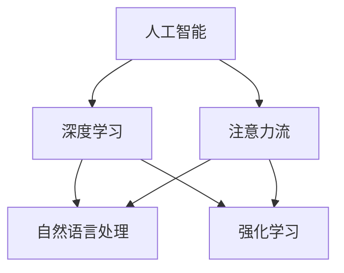

                 

# AI与人类注意力流：未来的工作、技能与注意力流管理技术的应用前景展望趋势

## 1. 背景介绍

### 1.1 问题由来

在当前信息爆炸的时代，人工智能(AI)技术正在迅速改变我们的工作和生活方式。然而，AI与人类在注意力流上的融合尚处于早期探索阶段，尤其是如何利用AI技术更好地管理人类注意力流，以提升工作效率、改善生活质量，成为迫切需要解决的问题。

### 1.2 问题核心关键点

人类注意力流是指人在完成任务时，注意力在不同任务、不同时间段的分配和转移。如何利用AI技术，尤其是基于深度学习的模型，对人类注意力流进行预测、分析和管理，是一个前沿且具有广泛应用前景的课题。

- **注意力流预测**：通过分析用户的行为数据，预测用户在不同时间段的注意力流，以提供个性化的任务推荐和时间规划。
- **注意力流分析**：通过深度学习模型，分析用户注意力流的模式和规律，发现注意力流失的原因和改进点。
- **注意力流管理**：基于预测和分析结果，设计智能系统，通过提醒、调整任务优先级等方式，引导用户保持高效的工作状态。

这些问题在当前的学术界和工业界中引起了广泛的关注，其核心在于如何利用AI技术，更好地理解和优化人类注意力流，从而提升人类的生产力和生活质量。

## 2. 核心概念与联系

### 2.1 核心概念概述

为更好地理解AI与人类注意力流的融合，本节将介绍几个密切相关的核心概念：

- **人工智能(AI)**：利用计算机模拟人类智能的科学和技术，包括机器学习、深度学习、自然语言处理等方向。
- **注意力流(Attention Flow)**：指人在完成任务时，注意力在不同任务、不同时间段的分配和转移，是影响工作效率和生活质量的关键因素。
- **深度学习(DL)**：利用多层神经网络进行复杂数据分析和模式识别的技术。
- **自然语言处理(NLP)**：使计算机理解和处理人类语言的技术，如语音识别、文本生成等。
- **强化学习(RL)**：通过智能体与环境的交互，学习最优策略以达成特定目标的机器学习技术。

这些概念之间的逻辑关系可以通过以下Mermaid流程图来展示：



这个流程图展示了一些关键概念之间的关联关系：

1. 人工智能是包含深度学习和强化学习等技术的一个大范畴。
2. 深度学习在自然语言处理和注意力流分析中都有广泛应用。
3. 注意力流和自然语言处理紧密相关，可以借助自然语言处理技术对注意力流进行分析和干预。
4. 强化学习在注意力流管理和优化中也扮演重要角色，可以设计智能系统引导用户注意力流向更高效的任务。

这些概念共同构成了AI与人类注意力流融合的框架，为进一步的研究和应用提供了理论基础。

## 3. 核心算法原理 & 具体操作步骤
### 3.1 算法原理概述

基于深度学习的注意力流预测和管理方法，本质上是一个复杂的时间序列预测和优化问题。其核心思想是通过深度神经网络，对用户的行为数据进行建模，预测其注意力流在不同时间段的分布情况，并基于预测结果，设计智能系统对注意力流进行干预，提升用户的工作效率和生活质量。

### 3.2 算法步骤详解

基于深度学习的注意力流预测和管理方法一般包括以下几个关键步骤：

**Step 1: 数据收集与预处理**

- 收集用户的行为数据，包括点击、阅读、编辑等与任务相关的行为记录。
- 对行为数据进行清洗和预处理，如去除异常值、归一化等。

**Step 2: 构建深度学习模型**

- 设计合适的神经网络结构，如LSTM、GRU、Transformer等，用于捕捉时间序列数据的特征。
- 选择合适的优化算法及其参数，如Adam、SGD等，设置学习率、批大小、迭代轮数等。
- 添加正则化技术，如L2正则、Dropout等，防止模型过拟合。

**Step 3: 训练与预测**

- 使用行为数据集对模型进行训练，计算损失函数并根据优化算法更新模型参数。
- 在训练过程中，周期性地在验证集上评估模型性能，根据性能指标决定是否触发Early Stopping。
- 使用训练好的模型对用户的行为数据进行预测，得到注意力流的分布情况。

**Step 4: 干预与优化**

- 根据注意力流预测结果，设计智能系统对用户的工作时间、任务优先级等进行动态调整。
- 使用强化学习技术，对智能系统的干预效果进行优化，不断提升系统效率。

**Step 5: 测试与部署**

- 在测试集上评估智能系统的干预效果，对比模型预测和实际行为数据，评估预测准确性和干预效果。
- 使用智能系统对用户的行为进行实时干预，观察其对工作效率和生活质量的提升。
- 持续收集新的数据，定期重新训练模型和优化智能系统，以适应数据分布的变化。

以上是基于深度学习的注意力流预测和管理方法的一般流程。在实际应用中，还需要针对具体任务的特点，对模型的各个环节进行优化设计，如改进训练目标函数，引入更多的正则化技术，搜索最优的超参数组合等，以进一步提升模型性能。

### 3.3 算法优缺点

基于深度学习的注意力流预测和管理方法具有以下优点：

- **高效性**：深度学习模型可以自动学习数据中的复杂特征，实现高效的预测和优化。
- **灵活性**：模型结构可以灵活设计，适应不同的应用场景和数据特征。
- **实时性**：通过在线训练和预测，系统可以实时调整用户的工作状态。

同时，该方法也存在一定的局限性：

- **数据依赖性**：模型性能高度依赖于数据的质量和量，需要收集大量的行为数据。
- **计算资源消耗大**：深度学习模型训练和预测需要大量的计算资源，可能会带来较高的成本。
- **解释性不足**：深度学习模型通常是"黑盒"系统，难以解释其内部工作机制和决策逻辑。

尽管存在这些局限性，但就目前而言，基于深度学习的注意力流预测和管理方法仍是最前沿的技术手段，广泛应用于各种AI驱动的智能系统和应用中。

### 3.4 算法应用领域

基于深度学习的注意力流预测和管理方法，已经在多个领域得到了应用，例如：

- **智能助理**：如Siri、Alexa等智能助理，利用注意力流分析技术，为用户提供个性化的任务推荐和语音交互优化。
- **信息检索**：如Google、Bing等搜索引擎，通过分析用户注意力流，提升搜索结果的相关性和排序。
- **个性化推荐**：如Netflix、Amazon等电商网站，利用注意力流预测技术，实现更精准的个性化商品推荐。
- **健康管理**：如健康追踪设备，通过分析用户注意力流，提供个性化的健康指导和预警。
- **教育技术**：如在线学习平台，利用注意力流管理技术，优化学习路径和课程推荐。

除了上述这些经典应用外，深度学习模型在注意力流预测和管理中的应用还在不断拓展，如智能家居、智能交通等领域，为人类生产生活带来了新的变革。

## 4. 数学模型和公式 & 详细讲解
### 4.1 数学模型构建

本节将使用数学语言对基于深度学习的注意力流预测和管理过程进行更加严格的刻画。

记用户的行为数据为 $X=\{x_1, x_2, ..., x_n\}$，其中 $x_t$ 表示用户在某时间段内的行为记录，如点击网页、阅读文章等。记用户的注意力流为 $Y=\{y_1, y_2, ..., y_n\}$，其中 $y_t$ 表示用户在时间 $t$ 内对不同任务的注意力分配，如花在任务1的时间比例。

定义注意力流预测模型为 $f: X \rightarrow Y$，其目标是通过训练，学习用户行为与注意力流之间的关系，即：

$$
\hat{y}_t = f(x_t; \theta)
$$

其中 $\hat{y}_t$ 表示模型对用户在第 $t$ 时间的注意力流预测结果，$\theta$ 为模型参数。模型的损失函数定义为：

$$
\mathcal{L}(\theta) = \sum_{t=1}^{n} \ell(y_t, \hat{y}_t)
$$

其中 $\ell$ 为损失函数，如均方误差、交叉熵等。

### 4.2 公式推导过程

以下我们以注意力流预测为例，推导深度学习模型的预测公式。

假设模型 $f$ 为LSTM网络，其状态更新规则如下：

$$
h_t = \tanh(W_h x_t + U_h h_{t-1} + b_h)
$$
$$
c_t = \sigma(W_c x_t + U_c h_{t-1} + b_c)
$$
$$
o_t = \sigma(W_o x_t + U_o h_{t-1} + b_o)
$$
$$
\hat{y}_t = o_t \cdot \tanh(c_t)
$$

其中 $W_h, U_h, b_h, W_c, U_c, b_c, W_o, U_o, b_o$ 为模型参数，$h_t$ 和 $c_t$ 分别为LSTM的状态和记忆单元，$\hat{y}_t$ 表示模型对用户在第 $t$ 时间的注意力流预测结果。

利用上述LSTM预测模型，我们可以通过训练数据集对模型进行优化，最小化损失函数 $\mathcal{L}(\theta)$，得到最优模型参数 $\theta^*$。在预测阶段，使用训练好的模型对用户的行为数据进行预测，得到注意力流的分布情况。

### 4.3 案例分析与讲解

以电商平台的个性化推荐系统为例，分析注意力流预测和管理的应用。

假设电商平台收集了用户的历史浏览、点击、购买等行为数据，构建了深度学习模型 $f$ 用于预测用户对不同商品的注意力分配。在训练阶段，使用历史行为数据对模型进行训练，最小化损失函数 $\mathcal{L}(\theta)$，得到最优模型参数 $\theta^*$。在预测阶段，使用训练好的模型对用户的新行为数据进行预测，得到注意力流的分布情况。

根据注意力流分布，智能系统可以动态调整推荐商品，如对用户关注的商品进行加权推荐，对用户忽视的商品降低推荐权重，甚至进行过滤，从而提升用户的购物体验和满意度。

## 5. 项目实践：代码实例和详细解释说明
### 5.1 开发环境搭建

在进行注意力流预测和管理实践前，我们需要准备好开发环境。以下是使用Python进行TensorFlow开发的环境配置流程：

1. 安装Anaconda：从官网下载并安装Anaconda，用于创建独立的Python环境。

2. 创建并激活虚拟环境：
```bash
conda create -n tf-env python=3.8 
conda activate tf-env
```

3. 安装TensorFlow：根据CUDA版本，从官网获取对应的安装命令。例如：
```bash
conda install tensorflow tensorflow-gpu -c conda-forge -c pytorch -c pypi -c nvidia
```

4. 安装各类工具包：
```bash
pip install numpy pandas scikit-learn matplotlib tqdm jupyter notebook ipython
```

完成上述步骤后，即可在`tf-env`环境中开始注意力流预测和管理的实践。

### 5.2 源代码详细实现

这里我们以电商平台的个性化推荐系统为例，给出使用TensorFlow实现注意力流预测的PyTorch代码实现。

首先，定义注意力流预测模型：

```python
import tensorflow as tf

class AttentionFlowModel(tf.keras.Model):
    def __init__(self, input_dim, hidden_units):
        super(AttentionFlowModel, self).__init__()
        self.lstm = tf.keras.layers.LSTM(hidden_units, return_sequences=True, return_state=True)
        self.dense = tf.keras.layers.Dense(input_dim)

    def call(self, inputs, initial_state):
        h, c = initial_state
        output, (h, c) = self.lstm(inputs, initial_state=(h, c))
        h = tf.concat((h, c), axis=1)
        y_hat = self.dense(h)
        return y_hat, (h, c)
```

然后，定义训练和预测函数：

```python
def train_model(model, dataset, batch_size, epochs):
    model.compile(optimizer=tf.keras.optimizers.Adam(learning_rate=0.001), loss='mse')
    model.fit(dataset, epochs=epochs, batch_size=batch_size)

def predict(model, new_data):
    return model.predict(new_data)
```

最后，启动训练流程并在测试集上评估：

```python
# 假设已经构建了行为数据集
train_dataset = ...
test_dataset = ...

# 构建模型
model = AttentionFlowModel(input_dim=2, hidden_units=64)

# 训练模型
train_model(model, train_dataset, batch_size=32, epochs=10)

# 使用模型预测注意力流
attention_flows = predict(model, new_data)
```

以上就是使用TensorFlow实现注意力流预测的完整代码实现。可以看到，TensorFlow提供了便捷的深度学习框架，使得模型构建和训练变得相对简单。

### 5.3 代码解读与分析

让我们再详细解读一下关键代码的实现细节：

**AttentionFlowModel类**：
- `__init__`方法：初始化LSTM和Dense层等关键组件，设定输入维度和隐藏层单元数。
- `call`方法：实现模型的前向传播，使用LSTM处理输入数据，通过Dense层输出注意力流预测结果。

**train_model函数**：
- 使用TensorFlow的API，将模型编译为指定损失函数的优化器，并使用指定批大小和迭代次数进行训练。

**predict函数**：
- 使用模型对新的行为数据进行预测，得到注意力流的分布情况。

**训练流程**：
- 使用行为数据集对模型进行训练，输出训练过程中的损失和准确率等指标。
- 使用测试集对训练好的模型进行评估，观察其预测效果。

可以看到，TensorFlow提供了便捷的API，使得注意力流预测模型的构建和训练变得相对简单。开发者可以将更多精力放在数据处理、模型改进等高层逻辑上，而不必过多关注底层的实现细节。

当然，工业级的系统实现还需考虑更多因素，如模型的保存和部署、超参数的自动搜索、更灵活的任务适配层等。但核心的注意力流预测范式基本与此类似。

## 6. 实际应用场景
### 6.1 智能助理

基于深度学习的注意力流预测和管理方法，可以广泛应用于智能助理系统中。智能助理通过分析用户的注意力流，可以提供个性化的任务推荐和语音交互优化，从而提升用户体验。

例如，智能助理可以根据用户在不同时间段的注意力流，自动调整日程安排和提醒，确保用户在合适的时间段内进行高优先级任务。同时，智能助理还可以通过自然语言处理技术，理解用户意图，提供更准确的语音命令和回复。

### 6.2 信息检索

深度学习模型在信息检索中的应用，主要体现在对用户注意力流的分析上。搜索引擎通过分析用户的行为数据，可以预测用户对不同搜索结果的关注程度，从而优化搜索结果的排序和相关性。

例如，当用户输入查询时，搜索引擎可以实时预测用户对不同搜索结果的关注度，并根据预测结果，动态调整搜索结果的排序，提高用户满意度。

### 6.3 个性化推荐

基于深度学习的注意力流预测和管理方法，可以应用于电商、媒体等领域的个性化推荐系统。推荐系统通过分析用户的注意力流，可以提供更加精准的商品推荐和内容推荐，提升用户体验和满意度。

例如，电商平台可以通过分析用户的历史行为数据，预测用户对不同商品的注意力流，从而进行个性化的商品推荐。视频平台则可以通过分析用户对不同视频的注意力流，进行内容推荐和广告投放。

### 6.4 未来应用展望

随着深度学习技术的不断发展，基于注意力流的AI应用将呈现以下几个趋势：

1. **多模态融合**：未来，AI系统将更加注重多模态数据的融合，如视觉、听觉和文本数据的结合，提供更全面、更精准的用户注意力流预测和分析。
2. **跨领域应用**：AI系统将不仅仅局限于特定的应用领域，而是逐步拓展到更多领域，如健康、教育、金融等，提升各领域的工作效率和生活质量。
3. **实时性增强**：随着计算资源的提升，AI系统将更加注重实时性，能够及时捕捉和响应用户注意力流的变化，提供更及时的干预和优化。
4. **普适性提高**：AI系统将更加注重普适性，能够适应不同用户群体的需求，提供个性化的服务。

这些趋势凸显了基于深度学习的注意力流预测和管理技术的广阔前景。未来，AI系统将在更多领域得到广泛应用，为人类生产生活带来新的变革。

## 7. 工具和资源推荐
### 7.1 学习资源推荐

为了帮助开发者系统掌握深度学习在注意力流管理中的应用，这里推荐一些优质的学习资源：

1. TensorFlow官方文档：提供详尽的TensorFlow框架使用指南，包括构建深度学习模型、训练和预测等关键功能。
2. PyTorch官方文档：提供便捷的深度学习框架使用指南，支持动态计算图，适用于快速迭代研究。
3. Coursera《深度学习专项课程》：由斯坦福大学教授Andrew Ng主讲的深度学习课程，涵盖深度学习的基本概念和高级技术。
4. Udacity《深度学习纳米学位》：涵盖深度学习在多个实际应用中的实践案例，如自然语言处理、计算机视觉等。
5. HuggingFace官方博客：提供最新的深度学习技术应用案例，涵盖自然语言处理、视觉处理等多个方向。

通过对这些资源的学习实践，相信你一定能够快速掌握深度学习在注意力流管理中的应用，并用于解决实际的AI问题。

### 7.2 开发工具推荐

高效的开发离不开优秀的工具支持。以下是几款用于深度学习开发的常用工具：

1. TensorFlow：由Google主导开发的开源深度学习框架，支持多种硬件平台，适合大规模工程应用。
2. PyTorch：由Facebook主导开发的深度学习框架，支持动态计算图，适合快速迭代研究。
3. Weights & Biases：模型训练的实验跟踪工具，可以记录和可视化模型训练过程中的各项指标，方便对比和调优。
4. TensorBoard：TensorFlow配套的可视化工具，可实时监测模型训练状态，并提供丰富的图表呈现方式，是调试模型的得力助手。

合理利用这些工具，可以显著提升深度学习在注意力流预测和管理任务的开发效率，加快创新迭代的步伐。

### 7.3 相关论文推荐

深度学习在注意力流预测和管理中的应用，在学术界和工业界已经引起了广泛关注，以下是几篇奠基性的相关论文，推荐阅读：

1. Attention is All You Need（即Transformer原论文）：提出了Transformer结构，开启了深度学习在注意力流分析中的新纪元。
2. RNN Architectures for speech and time-series processing（LSTM论文）：提出LSTM结构，用于时间序列数据的建模，是深度学习在时间序列预测中的重要工具。
3. Sequence to Sequence Learning with Neural Networks（Seq2Seq论文）：提出Seq2Seq模型，用于序列到序列的任务，如机器翻译、语音识别等，为注意力流预测提供了重要的技术基础。
4. Attention-Based Interpretation of AI and Cognitive Systems（Attention论文）：系统介绍了注意力流在AI系统中的应用，探讨了如何通过注意力流优化AI系统的性能。
5. Deep Attention-based Models for Learning to Execute and Explanation（Attention-based论文）：提出注意力流在执行和解释中的应用，展示了深度学习在任务规划和决策优化中的潜力。

这些论文代表了大深度学习在注意力流预测和管理中的应用研究的发展脉络。通过学习这些前沿成果，可以帮助研究者把握学科前进方向，激发更多的创新灵感。

## 8. 总结：未来发展趋势与挑战
### 8.1 总结

本文对基于深度学习的注意力流预测和管理方法进行了全面系统的介绍。首先阐述了深度学习在人类注意力流管理中的研究背景和意义，明确了注意力流预测和管理的核心思想。其次，从原理到实践，详细讲解了深度学习模型的构建和训练过程，给出了模型开发的完整代码实例。同时，本文还广泛探讨了注意力流预测和管理在智能助理、信息检索、个性化推荐等多个领域的应用前景，展示了深度学习技术的广泛应用前景。

通过本文的系统梳理，可以看到，基于深度学习的注意力流预测和管理方法正在成为AI技术的重要范式，极大地拓展了深度学习技术的应用边界，为AI技术在更多领域的应用奠定了基础。未来，伴随深度学习技术的不断发展，注意力流预测和管理技术必将进一步提升AI系统的性能和应用范围，为人类生产生活带来新的变革。

### 8.2 未来发展趋势

展望未来，深度学习在注意力流预测和管理中的应用将呈现以下几个发展趋势：

1. **多模态融合**：未来，AI系统将更加注重多模态数据的融合，如视觉、听觉和文本数据的结合，提供更全面、更精准的用户注意力流预测和分析。
2. **跨领域应用**：AI系统将不仅仅局限于特定的应用领域，而是逐步拓展到更多领域，如健康、教育、金融等，提升各领域的工作效率和生活质量。
3. **实时性增强**：随着计算资源的提升，AI系统将更加注重实时性，能够及时捕捉和响应用户注意力流的变化，提供更及时的干预和优化。
4. **普适性提高**：AI系统将更加注重普适性，能够适应不同用户群体的需求，提供个性化的服务。
5. **低成本化**：未来，AI系统将更加注重成本效益，通过优化算法和模型结构，降低计算资源消耗，提高系统性价比。
6. **安全性增强**：随着AI系统在各个领域的应用，其安全性问题也将得到更多关注，未来的系统将更加注重数据隐私和系统鲁棒性。

这些趋势凸显了深度学习在注意力流预测和管理技术中的广阔前景。未来，AI系统将在更多领域得到广泛应用，为人类生产生活带来新的变革。

### 8.3 面临的挑战

尽管深度学习在注意力流预测和管理中的应用已经取得了显著进展，但在迈向更加智能化、普适化应用的过程中，仍面临诸多挑战：

1. **数据依赖性**：深度学习模型高度依赖于数据的质量和量，需要收集大量的行为数据，数据收集和标注成本较高。
2. **计算资源消耗大**：深度学习模型训练和预测需要大量的计算资源，可能会带来较高的成本，难以大规模部署。
3. **模型复杂性**：深度学习模型的设计复杂，参数较多，难以进行解释和调试，需要更多的模型压缩和优化技术。
4. **泛化能力不足**：深度学习模型在特定任务上的泛化能力有限，需要更多的迁移学习和跨领域应用研究。
5. **鲁棒性不足**：深度学习模型对数据分布的变化敏感，容易产生泛化能力和鲁棒性问题。

尽管存在这些挑战，但随着深度学习技术的不断发展，这些挑战终将逐步被克服，深度学习技术必将在更多领域得到广泛应用，为人类生产生活带来新的变革。

### 8.4 研究展望

面对深度学习在注意力流预测和管理中面临的挑战，未来的研究需要在以下几个方面寻求新的突破：

1. **数据增强技术**：通过数据增强技术，利用少量标注数据，提高深度学习模型的泛化能力，降低数据依赖性。
2. **模型压缩技术**：通过模型压缩技术，降低深度学习模型的参数量和计算资源消耗，提高系统的可部署性。
3. **迁移学习技术**：通过迁移学习技术，实现跨领域、跨任务的应用，提高系统的普适性。
4. **鲁棒性提升**：通过引入对抗样本、正则化等技术，提高深度学习模型的鲁棒性，增强其泛化能力。
5. **多模态融合技术**：通过多模态融合技术，实现视觉、听觉、文本等多模态数据的融合，提供更全面、更精准的注意力流预测和分析。
6. **伦理道德研究**：通过伦理道德研究，确保AI系统的公平性、透明性和可解释性，避免滥用和误导。

这些研究方向将引领深度学习在注意力流预测和管理技术的发展，为构建安全、可靠、可解释、可控的智能系统铺平道路。面向未来，深度学习在注意力流预测和管理技术的应用前景广阔，需要在数据、算法、工程、伦理等多个维度协同发力，共同推动人工智能技术的发展和应用。

## 9. 附录：常见问题与解答

**Q1：深度学习在注意力流预测和管理中的应用是否适用于所有领域？**

A: 深度学习在注意力流预测和管理中的应用，主要适用于数据量较大、行为模式复杂、具有时间序列特性的领域。对于一些数据量较少、行为模式简单的领域，深度学习技术可能无法发挥其优势。

**Q2：在注意力流预测中，如何选择适当的深度学习模型？**

A: 在选择深度学习模型时，需要考虑数据的特点和任务的复杂度。如LSTM适用于时间序列数据，RNN适用于具有时序性的任务，Transformer适用于长距离依赖的复杂任务。同时，还可以通过模型比较实验，选择性能最优的模型。

**Q3：在注意力流管理中，如何平衡实时性和准确性？**

A: 在注意力流管理中，实时性和准确性是相互矛盾的，需要通过模型优化和算法设计进行平衡。可以使用在线学习技术，逐步更新模型参数，提高实时性；或者采用异步训练和离线优化的方法，提升模型准确性。

**Q4：注意力流预测和管理技术在实际应用中需要注意哪些问题？**

A: 在实际应用中，需要注意数据的隐私保护，避免泄露用户隐私；同时，需要注意模型的解释性和可控性，确保系统的透明性和公平性。

**Q5：未来在注意力流预测和管理中，有哪些新技术值得关注？**

A: 未来，值得关注的新技术包括强化学习、对抗生成网络、知识图谱等。这些新技术将进一步提升AI系统的性能和鲁棒性，推动AI技术在更多领域的应用。

---

作者：禅与计算机程序设计艺术 / Zen and the Art of Computer Programming

