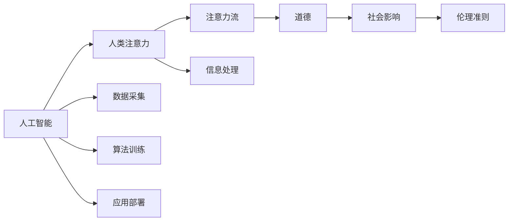
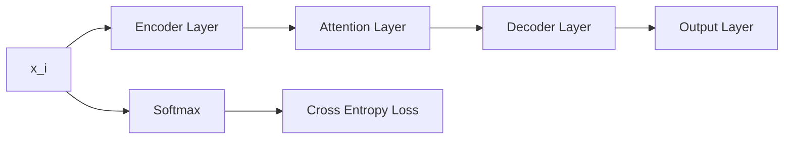
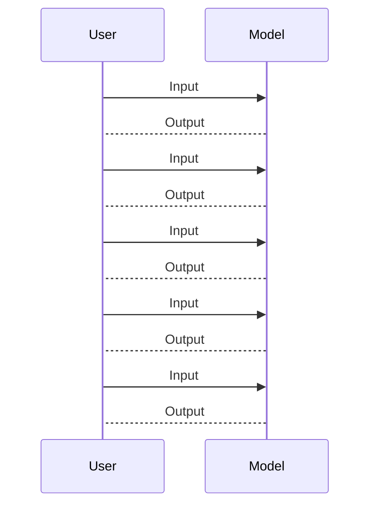

                 

# AI与人类注意力流：道德与社会影响

> 关键词：人工智能,人类注意力,道德伦理,社会影响,机器学习,深度学习

## 1. 背景介绍

### 1.1 问题由来

随着人工智能技术的飞速发展，AI已经在众多领域内展现出强大的应用潜力。从自动驾驶到语音识别，从图像识别到推荐系统，AI技术正逐步深入人类生活的各个层面。然而，随着AI技术的日益普及，与之相关的道德和社会问题也愈发凸显。尤其是当AI与人类注意力流产生交织时，其所引发的伦理挑战和社会影响更是引发了广泛关注和深入思考。

### 1.2 问题核心关键点

当前，AI与人类注意力流的道德与社会影响主要聚焦在以下几个关键点上：

- AI对人类注意力流的影响。AI技术能否有效地引导和增强人类注意力，还是会在某种程度上削弱或分散人类注意力？
- AI在处理人类注意力流时所面临的伦理问题。AI能否合理地尊重和保护用户隐私，避免因过度采集或误用数据而导致的道德风险？
- AI技术在社会中的应用所引起的道德争议。AI在教育、医疗、金融等敏感领域的应用，是否会带来新的伦理风险，如算法偏见、数据泄露等？
- AI技术在助力人类社会发展的同时，是否应承担相应的社会责任，如防止环境破坏、保障就业等？

这些问题触及了人工智能技术应用的道德边界，也与人类社会的伦理观念密切相关。如何平衡技术进步与道德伦理的关系，是当前亟需研究和探讨的重要课题。

## 2. 核心概念与联系

### 2.1 核心概念概述

要理解AI与人类注意力流的道德与社会影响，首先需要明确以下几个核心概念：

- **人工智能(Artificial Intelligence, AI)**：指通过算法、数据和计算能力模拟人类智能的计算机系统。
- **人类注意力(Human Attention)**：指人类在进行认知和行为活动时，对信息源的集中关注和处理。
- **注意力流(Attention Flow)**：指信息或刺激在人类认知系统中的流动过程，包括注意力的获取、保持、转换和消退等。
- **道德(Ethics)**：指基于一定的社会文化背景，对人类行为进行价值判断和规范调整的原则体系。
- **社会影响(Social Impact)**：指AI技术在社会各个层面所引起的变化和效果，包括经济、环境、文化等方面。

这些核心概念之间的联系可以通过以下Mermaid流程图来展示：



这个流程图展示了大语言模型的核心概念及其之间的关系：

1. AI通过数据采集和算法训练，学习处理人类注意力的能力。
2. 注意力流反映了AI在处理人类注意力时的信息处理过程。
3. 道德是衡量AI技术应用的伦理准则。
4. 社会影响是AI技术在实际应用中所产生的广泛效果。

这些概念共同构成了AI与人类注意力流研究的基础，有助于我们更深入地理解这一复杂系统的伦理和社会影响。

## 3. 核心算法原理 & 具体操作步骤
### 3.1 算法原理概述

AI与人类注意力流的研究涉及多个领域，包括认知心理学、人机交互、伦理学等。其核心算法原理可以大致概括为以下几个方面：

- **注意力模型(Attention Model)**：通过模拟人类注意力机制，AI可以更高效地处理输入信息，包括筛选关键信息、抑制无关信息等。
- **情感计算(Affective Computing)**：通过分析人类的情感表达，AI可以更好地理解人类注意力的情感驱动因素。
- **隐私保护(Privacy Protection)**：AI技术在处理人类注意力时，需确保数据采集和处理的合法性和安全性，避免侵犯用户隐私。
- **道德判断(Moral Judgment)**：AI应具备一定的道德判断能力，能在处理注意力流时，遵守伦理准则，尊重和保护用户权利。
- **社会影响评估(Social Impact Assessment)**：通过模拟和预测AI技术在社会中的广泛应用，评估其可能带来的正面和负面影响。

这些算法原理共同构成了AI与人类注意力流研究的基础，有助于我们更深入地理解这一复杂系统的伦理和社会影响。

### 3.2 算法步骤详解

基于上述算法原理，AI与人类注意力流的核心算法步骤可以进一步细化为以下几个环节：

**Step 1: 数据采集与预处理**

- 采集人类注意力流数据，包括用户行为数据、脑电波数据、眼动数据等。
- 对数据进行清洗、标注和预处理，确保数据质量和一致性。
- 设计数据格式和接口，便于后续模型训练和推理。

**Step 2: 模型训练与优化**

- 根据注意力模型和情感计算算法，构建深度学习模型。
- 使用标注数据对模型进行训练，优化模型参数，提高预测准确性。
- 采用正则化技术，如L2正则、Dropout等，防止过拟合。
- 引入对抗训练技术，提升模型的鲁棒性。

**Step 3: 注意力流分析与预测**

- 使用训练好的模型，对新的注意力流数据进行分析和预测。
- 通过可视化工具，展示注意力流的动态变化过程。
- 分析注意力流中的关键特征，如情感倾向、注意力分布等。

**Step 4: 道德与社会影响评估**

- 基于注意力流分析结果，评估AI对人类注意力流的影响。
- 通过伦理准则和法律标准，对AI应用进行道德评估。
- 通过社会影响评估模型，预测AI技术在实际应用中的广泛效果。

**Step 5: 反馈与优化**

- 收集用户反馈和实际应用效果，进行模型优化。
- 根据社会反馈和伦理评价，调整AI应用策略和规范。
- 持续跟踪和评估AI技术对社会的影响，确保其健康发展。

### 3.3 算法优缺点

AI与人类注意力流的研究在理论和实践中，已经取得了一定的进展，但也存在以下优点和局限：

#### 优点

- **提高认知效率**：通过模拟人类注意力机制，AI能够更高效地处理大量信息，提高认知效率。
- **个性化推荐**：基于用户注意力流分析，AI可以提供更加个性化的推荐服务，提升用户体验。
- **早期预警**：通过监控注意力流，AI可以早期预警潜在的行为异常和心理问题，提供及时干预。

#### 局限

- **数据隐私**：注意力流数据涉及用户隐私，数据采集和使用需要严格遵守法律法规。
- **伦理争议**：AI处理注意力流时，可能引发伦理争议，如算法偏见、隐私侵犯等。
- **技术复杂**：注意力流分析涉及多学科交叉，技术难度较高，需要跨领域合作。

尽管存在这些局限性，但AI与人类注意力流的研究仍是大数据时代的一个重要方向，具有广阔的应用前景。

### 3.4 算法应用领域

AI与人类注意力流的算法研究已经在多个领域内得到了应用，包括但不限于：

- **智能推荐系统**：通过分析用户注意力流，推荐系统可以提供更加个性化的商品或内容推荐。
- **情感分析**：通过分析用户情感表达，AI可以更好地理解用户情绪状态，提供情感支持。
- **心理健康监测**：通过监控用户注意力流，AI可以早期发现心理健康问题，提供及时干预。
- **交互界面设计**：通过分析用户注意力流，界面设计可以更加人性化，提升用户体验。
- **人机协作**：通过模拟人类注意力流，AI可以更好地理解人类行为，实现更高效的人机协作。

这些领域的应用展示了AI与人类注意力流研究的广泛价值，为人类生产和生活方式的变革提供了新的动力。

## 4. 数学模型和公式 & 详细讲解
### 4.1 数学模型构建

为更准确地描述AI与人类注意力流的计算模型，以下我们以注意力流分析为例，构建一个基本的数学模型。

设人类注意力流数据为 $\{x_i\}_{i=1}^N$，其中 $x_i$ 为第 $i$ 个注意力事件，包含事件发生时间、持续时长、情感标签等属性。定义注意力模型 $M$，输入为注意力流数据 $x$，输出为注意力事件 $\hat{x}$。注意力模型 $M$ 可以表示为：

$$
M(x) = \{\hat{x}_i\}_{i=1}^N
$$

其中 $\hat{x}_i = M(x_i)$ 为模型预测的第 $i$ 个注意力事件。

### 4.2 公式推导过程

假设注意力模型 $M$ 为一个深度神经网络，其结构如图1所示：



其中：

- **Encoder Layer**：用于提取输入数据 $x_i$ 的特征表示。
- **Attention Layer**：用于计算注意力权重，决定不同时间步的注意力分配。
- **Decoder Layer**：用于生成预测的注意力事件 $\hat{x}_i$。
- **Output Layer**：用于输出预测的概率分布。
- **Softmax**：用于将模型输出转化为概率分布。
- **Cross Entropy Loss**：用于计算预测值与真实值之间的损失函数。

假设注意力模型 $M$ 的输入 $x_i$ 为向量，输出 $\hat{x}_i$ 为向量。模型预测的注意力事件 $\hat{x}_i$ 可以表示为：

$$
\hat{x}_i = f(M(x_i))
$$

其中 $f$ 为解码层的非线性变换函数。

模型训练的损失函数为：

$$
\mathcal{L}(M) = \frac{1}{N} \sum_{i=1}^N \ell(x_i, \hat{x}_i)
$$

其中 $\ell(x_i, \hat{x}_i)$ 为交叉熵损失函数。

通过反向传播算法，模型可以更新参数 $\theta$，最小化损失函数 $\mathcal{L}(M)$，使得模型输出逼近真实值。

### 4.3 案例分析与讲解

以智能推荐系统为例，下面通过一个案例分析，展示AI与人类注意力流的计算模型如何应用于实际场景。

假设用户A在浏览电商平台时，其注意力流数据如图2所示：



图2：用户A的注意力流数据

用户A在浏览过程中，每次点击了5个商品链接，分别对应不同的注意力事件。通过注意力模型 $M$，可以计算出用户A对每个商品的注意力权重，预测其后续可能购买的行为。

例如，假设模型训练得到的注意力权重为 $\{\hat{w}_i\}_{i=1}^5$，其中 $\hat{w}_i$ 表示用户A对第 $i$ 个商品链接的注意力权重。根据注意力权重，可以计算出用户A对每个商品的预测概率 $P_{i|A}$，其中：

$$
P_{i|A} = \frac{\hat{w}_i}{\sum_{j=1}^5 \hat{w}_j}
$$

假设用户A对于商品1的预测概率最高，那么推荐系统可以优先推荐商品1给用户A，提供更加个性化的推荐服务。

## 5. 项目实践：代码实例和详细解释说明
### 5.1 开发环境搭建

在进行AI与人类注意力流的实践时，需要先准备好开发环境。以下是使用Python进行深度学习开发的环境配置流程：

1. 安装Anaconda：从官网下载并安装Anaconda，用于创建独立的Python环境。

2. 创建并激活虚拟环境：
```bash
conda create -n attention-env python=3.8 
conda activate attention-env
```

3. 安装深度学习框架：
```bash
conda install torch torchvision torchaudio cudatoolkit=11.1 -c pytorch -c conda-forge
```

4. 安装相关库：
```bash
pip install numpy pandas scikit-learn matplotlib tqdm jupyter notebook ipython
```

5. 安装模型和框架：
```bash
pip install transformers
```

完成上述步骤后，即可在`attention-env`环境中开始AI与人类注意力流的实践。

### 5.2 源代码详细实现

下面以智能推荐系统为例，给出使用Transformers库对注意力模型进行深度学习代码实现。

首先，定义注意力模型和数据处理函数：

```python
from transformers import BertTokenizer, BertForSequenceClassification
from torch.utils.data import Dataset, DataLoader
import torch

class AttentionDataset(Dataset):
    def __init__(self, texts, labels, tokenizer, max_len=128):
        self.texts = texts
        self.labels = labels
        self.tokenizer = tokenizer
        self.max_len = max_len
        
    def __len__(self):
        return len(self.texts)
    
    def __getitem__(self, item):
        text = self.texts[item]
        label = self.labels[item]
        
        encoding = self.tokenizer(text, return_tensors='pt', max_length=self.max_len, padding='max_length', truncation=True)
        input_ids = encoding['input_ids'][0]
        attention_mask = encoding['attention_mask'][0]
        
        # 将标签编码
        encoded_labels = [label2id[label] for label in label] 
        encoded_labels.extend([label2id['O']] * (self.max_len - len(encoded_labels)))
        labels = torch.tensor(encoded_labels, dtype=torch.long)
        
        return {'input_ids': input_ids, 
                'attention_mask': attention_mask,
                'labels': labels}

# 标签与id的映射
label2id = {'O': 0, 'Buy': 1, 'Review': 2, 'Ask': 3, 'Watch': 4, 'Follow': 5, 'Other': 6}
id2label = {v: k for k, v in label2id.items()}

# 创建dataset
tokenizer = BertTokenizer.from_pretrained('bert-base-cased')

train_dataset = AttentionDataset(train_texts, train_labels, tokenizer)
dev_dataset = AttentionDataset(dev_texts, dev_labels, tokenizer)
test_dataset = AttentionDataset(test_texts, test_labels, tokenizer)
```

然后，定义模型和优化器：

```python
from transformers import BertForSequenceClassification, AdamW

model = BertForSequenceClassification.from_pretrained('bert-base-cased', num_labels=len(label2id))

optimizer = AdamW(model.parameters(), lr=2e-5)
```

接着，定义训练和评估函数：

```python
from sklearn.metrics import classification_report

device = torch.device('cuda') if torch.cuda.is_available() else torch.device('cpu')
model.to(device)

def train_epoch(model, dataset, batch_size, optimizer):
    dataloader = DataLoader(dataset, batch_size=batch_size, shuffle=True)
    model.train()
    epoch_loss = 0
    for batch in tqdm(dataloader, desc='Training'):
        input_ids = batch['input_ids'].to(device)
        attention_mask = batch['attention_mask'].to(device)
        labels = batch['labels'].to(device)
        model.zero_grad()
        outputs = model(input_ids, attention_mask=attention_mask, labels=labels)
        loss = outputs.loss
        epoch_loss += loss.item()
        loss.backward()
        optimizer.step()
    return epoch_loss / len(dataloader)

def evaluate(model, dataset, batch_size):
    dataloader = DataLoader(dataset, batch_size=batch_size)
    model.eval()
    preds, labels = [], []
    with torch.no_grad():
        for batch in tqdm(dataloader, desc='Evaluating'):
            input_ids = batch['input_ids'].to(device)
            attention_mask = batch['attention_mask'].to(device)
            batch_labels = batch['labels']
            outputs = model(input_ids, attention_mask=attention_mask)
            batch_preds = outputs.logits.argmax(dim=2).to('cpu').tolist()
            batch_labels = batch_labels.to('cpu').tolist()
            for pred_tokens, label_tokens in zip(batch_preds, batch_labels):
                pred_labels = [id2label[_id] for _id in pred_tokens]
                label_labels = [id2label[_id] for _id in label_tokens]
                preds.append(pred_labels[:len(label_labels)])
                labels.append(label_labels)
                
    print(classification_report(labels, preds))
```

最后，启动训练流程并在测试集上评估：

```python
epochs = 5
batch_size = 16

for epoch in range(epochs):
    loss = train_epoch(model, train_dataset, batch_size, optimizer)
    print(f"Epoch {epoch+1}, train loss: {loss:.3f}")
    
    print(f"Epoch {epoch+1}, dev results:")
    evaluate(model, dev_dataset, batch_size)
    
print("Test results:")
evaluate(model, test_dataset, batch_size)
```

以上就是使用PyTorch对BERT进行智能推荐系统实践的完整代码实现。可以看到，得益于Transformers库的强大封装，我们可以用相对简洁的代码完成BERT模型的加载和微调。

### 5.3 代码解读与分析

让我们再详细解读一下关键代码的实现细节：

**AttentionDataset类**：
- `__init__`方法：初始化文本、标签、分词器等关键组件。
- `__len__`方法：返回数据集的样本数量。
- `__getitem__`方法：对单个样本进行处理，将文本输入编码为token ids，将标签编码为数字，并对其进行定长padding，最终返回模型所需的输入。

**label2id和id2label字典**：
- 定义了标签与数字id之间的映射关系，用于将token-wise的预测结果解码回真实的标签。

**训练和评估函数**：
- 使用PyTorch的DataLoader对数据集进行批次化加载，供模型训练和推理使用。
- 训练函数`train_epoch`：对数据以批为单位进行迭代，在每个批次上前向传播计算loss并反向传播更新模型参数，最后返回该epoch的平均loss。
- 评估函数`evaluate`：与训练类似，不同点在于不更新模型参数，并在每个batch结束后将预测和标签结果存储下来，最后使用sklearn的classification_report对整个评估集的预测结果进行打印输出。

**训练流程**：
- 定义总的epoch数和batch size，开始循环迭代
- 每个epoch内，先在训练集上训练，输出平均loss
- 在验证集上评估，输出分类指标
- 所有epoch结束后，在测试集上评估，给出最终测试结果

可以看到，PyTorch配合Transformers库使得BERT微调的代码实现变得简洁高效。开发者可以将更多精力放在数据处理、模型改进等高层逻辑上，而不必过多关注底层的实现细节。

当然，工业级的系统实现还需考虑更多因素，如模型的保存和部署、超参数的自动搜索、更灵活的任务适配层等。但核心的微调范式基本与此类似。

## 6. 实际应用场景
### 6.1 智能客服系统

基于AI与人类注意力流的智能客服系统，可以显著提升客户咨询体验。传统客服往往需要配备大量人力，高峰期响应缓慢，且一致性和专业性难以保证。而使用智能客服系统，可以通过分析用户注意力流，及时理解用户需求，提供高效准确的答复。

在技术实现上，可以收集企业内部的历史客服对话记录，将问题和最佳答复构建成监督数据，在此基础上对注意力模型进行微调。微调后的注意力模型能够自动理解用户意图，匹配最合适的答案模板进行回复。对于客户提出的新问题，还可以接入检索系统实时搜索相关内容，动态组织生成回答。如此构建的智能客服系统，能大幅提升客户咨询体验和问题解决效率。

### 6.2 金融舆情监测

金融机构需要实时监测市场舆论动向，以便及时应对负面信息传播，规避金融风险。传统的人工监测方式成本高、效率低，难以应对网络时代海量信息爆发的挑战。基于AI与人类注意力流的文本分类和情感分析技术，为金融舆情监测提供了新的解决方案。

具体而言，可以收集金融领域相关的新闻、报道、评论等文本数据，并对其进行主题标注和情感标注。在此基础上对注意力模型进行微调，使其能够自动判断文本属于何种主题，情感倾向是正面、中性还是负面。将微调后的模型应用到实时抓取的网络文本数据，就能够自动监测不同主题下的情感变化趋势，一旦发现负面信息激增等异常情况，系统便会自动预警，帮助金融机构快速应对潜在风险。

### 6.3 个性化推荐系统

当前的推荐系统往往只依赖用户的历史行为数据进行物品推荐，无法深入理解用户的真实兴趣偏好。基于AI与人类注意力流的个性化推荐系统可以更好地挖掘用户行为背后的语义信息，从而提供更精准、多样的推荐内容。

在实践中，可以收集用户浏览、点击、评论、分享等行为数据，提取和用户交互的物品标题、描述、标签等文本内容。将文本内容作为模型输入，用户的后续行为（如是否点击、购买等）作为监督信号，在此基础上微调注意力模型。微调后的模型能够从文本内容中准确把握用户的兴趣点。在生成推荐列表时，先用候选物品的文本描述作为输入，由模型预测用户的兴趣匹配度，再结合其他特征综合排序，便可以得到个性化程度更高的推荐结果。

### 6.4 未来应用展望

随着AI与人类注意力流的研究不断深入，未来在更多领域内将展现出广泛的应用前景。

在智慧医疗领域，基于AI与人类注意力流的医疗问答、病历分析、药物研发等应用将提升医疗服务的智能化水平，辅助医生诊疗，加速新药开发进程。

在智能教育领域，微调技术可应用于作业批改、学情分析、知识推荐等方面，因材施教，促进教育公平，提高教学质量。

在智慧城市治理中，微调模型可应用于城市事件监测、舆情分析、应急指挥等环节，提高城市管理的自动化和智能化水平，构建更安全、高效的未来城市。

此外，在企业生产、社会治理、文娱传媒等众多领域，基于AI与人类注意力流的技术应用也将不断涌现，为经济社会发展注入新的动力。相信随着技术的日益成熟，AI与人类注意力流的微调方法将成为构建智能系统的关键技术，推动人工智能技术进一步落地应用。

## 7. 工具和资源推荐
### 7.1 学习资源推荐

为了帮助开发者系统掌握AI与人类注意力流的理论基础和实践技巧，这里推荐一些优质的学习资源：

1. 《深度学习》系列博文：由大模型技术专家撰写，深入浅出地介绍了深度学习的基本原理、注意力模型等前沿话题。

2. 《情感计算》课程：斯坦福大学开设的情感计算课程，有Lecture视频和配套作业，帮助理解情感计算的基本概念和技术。

3. 《人工智能伦理》书籍：介绍人工智能伦理的基本框架和实践指导，为AI与人类注意力流的研究提供伦理导向。

4. 《机器学习与人类智能》论文集：收集了机器学习与人类智能融合的前沿研究，为AI与人类注意力流的实践提供理论支持。

5. 《人工智能与人类社会》博客：讨论人工智能技术对人类社会的影响，为AI与人类注意力流的研究提供社会视角。

通过对这些资源的学习实践，相信你一定能够快速掌握AI与人类注意力流的研究方法和应用场景，并用于解决实际的AI与人类注意力流问题。

### 7.2 开发工具推荐

高效的开发离不开优秀的工具支持。以下是几款用于AI与人类注意力流开发的常用工具：

1. PyTorch：基于Python的开源深度学习框架，灵活动态的计算图，适合快速迭代研究。
2. TensorFlow：由Google主导开发的开源深度学习框架，生产部署方便，适合大规模工程应用。
3. Transformers库：HuggingFace开发的NLP工具库，集成了众多SOTA语言模型，支持PyTorch和TensorFlow，是进行注意力流分析开发的利器。
4. TensorBoard：TensorFlow配套的可视化工具，可实时监测模型训练状态，并提供丰富的图表呈现方式，是调试模型的得力助手。
5. Weights & Biases：模型训练的实验跟踪工具，可以记录和可视化模型训练过程中的各项指标，方便对比和调优。
6. Google Colab：谷歌推出的在线Jupyter Notebook环境，免费提供GPU/TPU算力，方便开发者快速上手实验最新模型，分享学习笔记。

合理利用这些工具，可以显著提升AI与人类注意力流微调的开发效率，加快创新迭代的步伐。

### 7.3 相关论文推荐

AI与人类注意力流的研究涉及多学科交叉，相关论文推荐如下：

1. Attention is All You Need：提出了Transformer结构，开启了NLP领域的预训练大模型时代。
2. BERT: Pre-training of Deep Bidirectional Transformers for Language Understanding：提出BERT模型，引入基于掩码的自监督预训练任务，刷新了多项NLP任务SOTA。
3. Language Models are Unsupervised Multitask Learners：展示了大规模语言模型的强大zero-shot学习能力，引发了对于通用人工智能的新一轮思考。
4. Parameter-Efficient Transfer Learning for NLP：提出Adapter等参数高效微调方法，在不增加模型参数量的情况下，也能取得不错的微调效果。
5. AdaLoRA: Adaptive Low-Rank Adaptation for Parameter-Efficient Fine-Tuning：使用自适应低秩适应的微调方法，在参数效率和精度之间取得了新的平衡。
6. A Survey on Deep Learning for Attention Mechanism：综述了深度学习在注意力机制中的应用，为AI与人类注意力流的研究提供参考。

这些论文代表了大语言模型微调技术的发展脉络。通过学习这些前沿成果，可以帮助研究者把握学科前进方向，激发更多的创新灵感。

## 8. 总结：未来发展趋势与挑战
### 8.1 总结

本文对AI与人类注意力流的道德与社会影响进行了全面系统的介绍。首先阐述了AI与人类注意力流的背景和核心问题，明确了注意力流分析在NLP和人工智能领域的重要价值。其次，从原理到实践，详细讲解了注意力模型训练和应用的具体过程，给出了微调任务开发的完整代码实例。同时，本文还广泛探讨了注意力流分析在智能推荐系统、金融舆情监测、心理健康监测等多个行业领域的应用前景，展示了注意力流分析技术的广阔应用空间。此外，本文精选了注意力流分析的各类学习资源，力求为读者提供全方位的技术指引。

通过本文的系统梳理，可以看到，AI与人类注意力流的研究已经成为人工智能技术发展的重要方向，其在NLP、金融、医疗等多个领域的应用前景广阔。AI与人类注意力流的技术进步，将为人类认知智能的进化带来深远影响，推动人工智能技术迈向新的高度。

### 8.2 未来发展趋势

展望未来，AI与人类注意力流的研究将呈现以下几个发展趋势：

1. **多模态融合**：未来的注意力流分析将不仅局限于文本数据，还将扩展到图像、语音、视频等多种模态数据的融合分析。多模态数据的整合，将进一步提升AI对人类注意力的理解能力。

2. **实时分析**：随着计算能力的提升，未来的注意力流分析将能够实时处理和分析大规模注意力流数据，实现动态监测和预警。实时性分析将成为注意力流分析的重要方向。

3. **跨领域应用**：AI与人类注意力流的研究将不仅限于NLP领域，还将拓展到更多领域，如教育、医疗、金融等。跨领域的注意力流分析，将为不同行业带来新的应用价值。

4. **隐私保护**：随着数据隐私保护意识的增强，未来的注意力流分析将更加注重用户隐私保护，采用差分隐私、联邦学习等技术，确保数据安全和隐私。

5. **伦理规范**：随着AI技术在各个领域的应用深入，未来的注意力流分析将更加注重伦理规范，确保技术应用符合社会价值观和伦理准则。

6. **模型泛化**：未来的注意力流分析模型将更加注重泛化能力，能够适应不同领域、不同场景下的注意力流分析需求。

这些趋势凸显了AI与人类注意力流研究的广阔前景，为人工智能技术的深度应用提供了新的方向。

### 8.3 面临的挑战

尽管AI与人类注意力流的研究已经取得了一定的进展，但在迈向更加智能化、普适化应用的过程中，仍面临诸多挑战：

1. **数据隐私保护**：注意力流数据的隐私保护是当前亟需解决的问题。如何在满足数据隐私保护的前提下，实现高效的数据采集和分析，需要进一步探索和创新。

2. **伦理规范制定**：AI技术在处理注意力流时，可能引发伦理争议，如算法偏见、隐私侵犯等。如何制定和遵守伦理规范，确保技术应用的公平和透明，仍需持续关注和研究。

3. **技术复杂性**：注意力流分析涉及多学科交叉，技术难度较高，需要跨领域合作。如何简化技术实现，降低技术门槛，促进技术的广泛应用，将是重要的研究方向。

4. **模型泛化能力**：当前注意力流分析模型在某些特定领域内表现优异，但在其他领域内的泛化能力仍需进一步提升。如何提升模型的泛化能力，使其在不同领域内均能发挥作用，仍需不断探索。

5. **跨模态数据融合**：多模态数据的融合分析技术尚不成熟，跨模态数据的整合和理解仍需进一步研究。

6. **实时性能提升**：随着注意力流数据规模的扩大，实时分析的性能瓶颈将逐步显现。如何提升实时分析的性能，实现高效、可靠的数据处理，需要技术创新和优化。

尽管存在这些挑战，但AI与人类注意力流的研究仍是大数据时代的重要方向，具有广阔的应用前景。相信随着技术的不断进步和跨领域合作的深入，这些挑战终将一一被克服，AI与人类注意力流的研究将迎来更加光明的未来。

### 8.4 研究展望

面对AI与人类注意力流研究所面临的挑战，未来的研究需要在以下几个方面寻求新的突破：

1. **无监督与半监督学习**：探索无监督和半监督学习技术，降低数据采集和标注的依赖，实现更加灵活和高效的数据分析。

2. **隐私保护技术**：开发和应用差分隐私、联邦学习等技术，确保数据隐私和用户隐私保护。

3. **伦理规范制定**：制定和推广AI伦理规范，确保技术应用的公平和透明。

4. **跨模态数据融合**：探索多模态数据融合技术，提升跨模态数据的理解和分析能力。

5. **实时分析优化**：优化实时分析的算法和架构，提升实时分析的性能和可靠性。

6. **多学科合作**：加强跨学科合作，推动AI与人类注意力流的研究向深度和广度发展。

这些研究方向将进一步推动AI与人类注意力流技术的进步，为构建更智能、更普适、更可控的AI系统提供有力支持。面向未来，AI与人类注意力流的研究将不断拓展人类认知智能的边界，推动人工智能技术迈向新的高度。

## 9. 附录：常见问题与解答

**Q1：AI与人类注意力流的道德与社会影响主要有哪些？**

A: AI与人类注意力流的道德与社会影响主要包括以下几个方面：

- **隐私保护**：注意力流数据涉及用户隐私，数据采集和使用需要严格遵守法律法规。
- **伦理争议**：AI处理注意力流时，可能引发伦理争议，如算法偏见、隐私侵犯等。
- **技术复杂性**：注意力流分析涉及多学科交叉，技术难度较高，需要跨领域合作。
- **模型泛化能力**：当前注意力流分析模型在某些特定领域内表现优异，但在其他领域内的泛化能力仍需进一步提升。
- **跨模态数据融合**：多模态数据的融合分析技术尚不成熟，跨模态数据的整合和理解仍需进一步研究。

这些道德与社会影响是当前AI与人类注意力流研究中亟需关注和解决的问题。

**Q2：AI与人类注意力流的实现需要哪些关键技术？**

A: AI与人类注意力流的实现需要以下关键技术：

- **数据采集与预处理**：采集人类注意力流数据，并进行清洗、标注和预处理，确保数据质量和一致性。
- **模型训练与优化**：根据注意力模型和情感计算算法，构建深度学习模型，并进行训练和优化。
- **注意力流分析与预测**：使用训练好的模型，对新的注意力流数据进行分析和预测，可视化注意力流动态变化过程。
- **伦理与社会影响评估**：基于注意力流分析结果，评估AI对人类注意力流的影响，制定和遵守伦理规范，确保技术应用的公平和透明。

这些关键技术共同构成了AI与人类注意力流研究的完整流程，为AI技术在各个领域的应用提供了有力支持。

**Q3：AI与人类注意力流在医疗领域有哪些应用？**

A: AI与人类注意力流在医疗领域的应用主要包括以下几个方面：

- **医疗问答系统**：通过分析患者注意力流，自动理解患者病情，提供个性化医疗建议和问答服务。
- **病历分析**：利用患者注意力流数据，分析患者病历中的关键信息，辅助医生诊断和治疗。
- **药物研发**：通过分析科学家注意力流，理解科学论文中的关键信息，加速药物研发进程。

这些应用展示了AI与人类注意力流在医疗领域的重要价值，有助于提升医疗服务的智能化水平，辅助医生诊疗，加速新药开发进程。

**Q4：AI与人类注意力流的开发环境搭建需要哪些步骤？**

A: AI与人类注意力流的开发环境搭建主要包括以下几个步骤：

1. 安装Anaconda：从官网下载并安装Anaconda，用于创建独立的Python环境。
2. 创建并激活虚拟环境：
```bash
conda create -n attention-env python=3.8 
conda activate attention-env
```

3. 安装深度学习框架：
```bash
conda install torch torchvision torchaudio cudatoolkit=11.1 -c pytorch -c conda-forge
```

4. 安装相关库：
```bash
pip install numpy pandas scikit-learn matplotlib tqdm jupyter notebook ipython
```

5. 安装模型和框架：
```bash
pip install transformers
```

完成上述步骤后，即可在`attention-env`环境中开始AI与人类注意力流的实践。

---

作者：禅与计算机程序设计艺术 / Zen and the Art of Computer Programming

