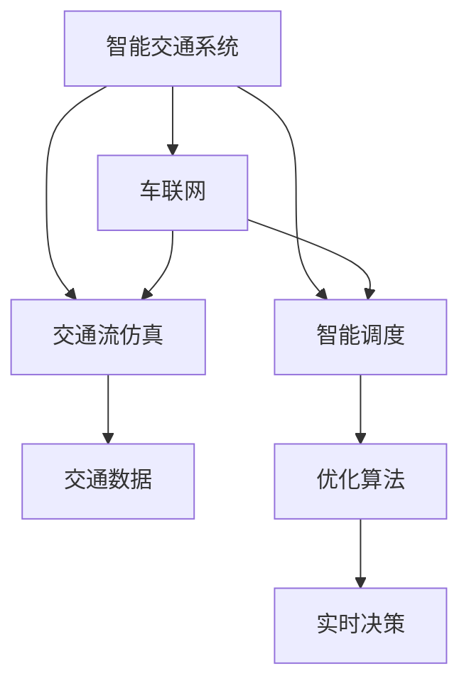

                 

## 1. 背景介绍

在智能城市建设中，交通系统是其中一个关键环节，其运行效率和可持续性直接关系到城市的整体发展和居民的生活质量。传统的城市交通系统主要依赖于人工规划和管理，但随着科技的发展和数据量的增加，单一的人工管理已经难以满足需求。AI与人类计算相结合的技术手段，可以在提升交通系统效率的同时，确保可持续发展的目标。

### 1.1 问题由来

城市交通系统面临的主要问题包括：

- **交通拥堵**：随着城市人口和车辆数量的增加，交通拥堵现象日益严重，导致出行效率降低。
- **环境污染**：高碳排放的交通工具加剧了空气污染，影响居民健康。
- **资源浪费**：交通系统运行效率不高，造成了资源的浪费。

针对这些问题，AI与人类计算相结合的解决方案应运而生，通过智能化手段提升交通系统的运行效率，减少环境污染，优化资源分配，实现可持续发展。

### 1.2 问题核心关键点

AI与人类计算在城市交通系统中的应用，核心在于以下几个关键点：

- **数据驱动决策**：通过收集和分析交通数据，AI系统可以提供数据支持，辅助人类进行交通规划和管理。
- **实时监控与优化**：AI系统可以实现实时监控和智能优化，提高交通系统的运行效率。
- **预测与预警**：通过历史数据分析，AI系统可以对未来的交通流量和运行状态进行预测，及时发出预警。
- **多模态融合**：AI系统可以整合多种数据来源，如车辆定位、天气数据、社交媒体等，提供更全面的决策支持。
- **人性化设计**：AI系统可以通过自然语言处理，提供更人性化、更便捷的交通服务。

这些关键点构成了AI与人类计算在城市交通系统中的核心应用框架。

## 2. 核心概念与联系

### 2.1 核心概念概述

为更好地理解AI与人类计算在城市交通中的应用，本节将介绍几个密切相关的核心概念：

- **AI与人类计算**：结合人工智能和人类智能的技术手段，通过AI技术处理大数据，辅助人类进行决策和优化。
- **智能交通系统**：利用AI与人类计算技术，实现交通系统的智能化管理，提升交通效率和可持续性。
- **车联网**：通过互联网技术，将车辆与交通基础设施、其他车辆等连接起来，实现信息共享和协同控制。
- **交通流仿真**：通过仿真软件模拟交通流的运行状态，预测和优化交通系统的运行效果。
- **智能调度**：通过AI算法优化交通资源的分配和使用，提高交通系统的运行效率。

这些核心概念之间的逻辑关系可以通过以下Mermaid流程图来展示：



这个流程图展示了智能交通系统的核心概念及其之间的关系：

1. 智能交通系统通过车联网实现信息共享和协同控制，利用交通流仿真进行预测和优化。
2. 智能调度基于AI算法优化交通资源分配，提高系统运行效率。
3. 交通流仿真通过交通数据支持，辅助智能调度和实时决策。

这些概念共同构成了智能交通系统的技术框架，旨在实现交通系统的智能化和可持续发展。

## 3. 核心算法原理 & 具体操作步骤
### 3.1 算法原理概述

AI与人类计算在城市交通系统中的应用，基于以下算法原理：

- **数据预处理**：收集和清洗交通数据，利用AI技术处理数据，提取有用的特征。
- **模型训练**：基于历史交通数据，训练AI模型，预测交通流状态和优化方案。
- **实时决策**：利用AI模型对实时数据进行分析，提供智能决策支持。
- **优化算法**：通过优化算法，优化交通资源的分配和使用。
- **仿真模拟**：利用仿真软件模拟交通流的运行状态，验证优化效果。

这些算法原理构成了AI与人类计算在城市交通系统中的核心技术框架，通过智能化手段提升交通系统的运行效率，减少环境污染，优化资源分配，实现可持续发展。

### 3.2 算法步骤详解

基于AI与人类计算的智能交通系统，通常包括以下关键步骤：

**Step 1: 数据收集与预处理**

- **数据收集**：收集城市交通相关的各类数据，包括交通流量、车辆位置、天气、道路状况等。
- **数据预处理**：清洗和处理数据，去除噪声和异常值，填补缺失数据，提取有用的特征。

**Step 2: 模型训练与优化**

- **模型训练**：基于预处理后的数据，训练AI模型，如神经网络、支持向量机等，用于预测交通流量和优化方案。
- **模型评估**：使用交叉验证等方法评估模型性能，调整模型参数。

**Step 3: 实时监控与决策**

- **实时数据采集**：通过传感器、车载终端等设备，实时采集交通数据。
- **实时分析与决策**：利用AI模型对实时数据进行分析，提供智能决策支持。

**Step 4: 仿真模拟与优化**

- **仿真模拟**：利用交通流仿真软件模拟交通流的运行状态，验证优化方案的效果。
- **优化方案调整**：根据仿真结果，调整优化方案，再次进行仿真模拟，直到达到预期效果。

**Step 5: 系统部署与维护**

- **系统部署**：将训练好的AI模型和优化方案部署到实际交通系统中。
- **系统维护**：定期更新数据，调整模型参数，维护系统稳定性。

### 3.3 算法优缺点

基于AI与人类计算的智能交通系统，具有以下优点：

- **提高效率**：通过智能化手段，实时监控和优化交通系统，提高运行效率。
- **减少污染**：优化交通资源分配，减少高碳排放交通工具的使用，降低环境污染。
- **资源优化**：通过优化算法，合理分配交通资源，减少资源浪费。
- **精准决策**：利用AI模型进行实时分析和预测，提供精准的决策支持。

同时，该系统也存在一些缺点：

- **数据依赖**：系统的运行效果依赖于数据的质量和完整性，数据收集和预处理成本较高。
- **算法复杂**：需要结合多种算法进行模型训练和优化，算法实现较为复杂。
- **技术门槛**：涉及人工智能、数据科学、交通工程等多个领域，技术门槛较高。
- **伦理风险**：数据隐私、算法偏见等问题需要引起重视，确保系统的公平性和透明性。

尽管存在这些局限性，但AI与人类计算在城市交通系统中的应用，仍然具有广阔的前景。未来相关研究的重点在于如何进一步降低数据收集成本，简化算法实现，提高系统的可解释性和伦理性。

### 3.4 算法应用领域

AI与人类计算在城市交通系统中的应用，主要包括以下领域：

- **交通流量预测**：利用AI模型预测交通流量，优化交通信号灯控制。
- **智能导航**：基于车联网技术，提供实时导航和路径规划。
- **智慧停车**：通过智能停车管理系统，提高停车场利用率，减少交通拥堵。
- **车辆自适应控制**：利用AI算法优化车辆行驶策略，减少交通拥堵和事故发生。
- **应急处理**：在交通事故等突发事件发生时，提供实时决策支持，优化救援路线。
- **能源管理**：通过智能调度，优化公共交通和私人交通工具的能源使用，减少碳排放。

除了上述这些经典应用外，AI与人类计算在智能交通系统中的应用还在不断扩展，如无人驾驶、智能交通标识、智能物流等，为交通系统的智能化和可持续发展提供了新的可能性。

## 4. 数学模型和公式 & 详细讲解 & 举例说明

### 4.1 数学模型构建

本节将使用数学语言对AI与人类计算在城市交通系统中的应用进行更加严格的刻画。

记交通系统中的车辆数为 $N$，速度为 $v_i$，位置为 $x_i$，目标位置为 $x_{\text{goal}}$。交通系统的目标是最大化总效率，最小化总时间，即：

$$
\max \sum_{i=1}^N \frac{x_{\text{goal}}-x_i}{v_i}
$$

通过建立上述数学模型，我们可以利用优化算法求解最优的车辆行驶路径。

### 4.2 公式推导过程

以路径规划为例，利用Dijkstra算法求解最短路径，公式推导如下：

假设从节点 $s$ 到节点 $t$ 的最短路径为 $d$，节点 $u$ 到节点 $t$ 的最短路径为 $d_u$，则：

$$
d(u) = \begin{cases}
\infty & u=t \\
d(u,v)+\text{cost}(u,v) & v \in \text{Neighbor}(u) \text{ and } d(u,v) > d_u
\end{cases}
$$

其中 $\text{cost}(u,v)$ 表示从节点 $u$ 到节点 $v$ 的代价，$\text{Neighbor}(u)$ 表示节点 $u$ 的相邻节点。

在求解过程中，每次选取当前距离 $d(u)$ 最小的节点 $u$，更新所有与其相邻节点的距离 $d$，直到计算出从节点 $s$ 到节点 $t$ 的最短路径。

### 4.3 案例分析与讲解

以智能停车系统为例，通过数据分析和AI模型，实现智能停车管理。假设停车场内有 $n$ 个车位，车辆数为 $N$，每个车辆的目标停车位置为 $x_i$。

通过收集车辆到达时间和离场时间，利用AI模型进行预测和优化，将车辆引导到最优停车位，减少寻找停车位的时间和浪费。具体步骤如下：

**Step 1: 数据收集**：通过车位传感器、车辆标识设备等，收集车辆进入和离场的时间信息。

**Step 2: 数据预处理**：清洗和处理数据，提取有用的特征，如车辆类型、停车位置等。

**Step 3: 模型训练**：基于历史数据，训练AI模型，预测车辆到达和离场时间。

**Step 4: 实时监控**：利用AI模型实时监控车辆进出情况，调整停车位分配策略。

**Step 5: 优化方案**：根据实时数据和预测结果，优化停车位分配，减少车辆等待时间。

通过上述步骤，可以实现智能停车系统的自动化管理，提高停车场的利用率，减少交通拥堵。

## 5. 项目实践：代码实例和详细解释说明
### 5.1 开发环境搭建

在进行智能交通系统开发前，我们需要准备好开发环境。以下是使用Python进行项目开发的环境配置流程：

1. 安装Anaconda：从官网下载并安装Anaconda，用于创建独立的Python环境。

2. 创建并激活虚拟环境：
```bash
conda create -n traffic-env python=3.8 
conda activate traffic-env
```

3. 安装PyTorch：根据CUDA版本，从官网获取对应的安装命令。例如：
```bash
conda install pytorch torchvision torchaudio cudatoolkit=11.1 -c pytorch -c conda-forge
```

4. 安装TensorFlow：
```bash
conda install tensorflow -c pytorch
```

5. 安装TensorBoard：
```bash
pip install tensorboard
```

6. 安装其他工具包：
```bash
pip install numpy pandas scikit-learn matplotlib tqdm jupyter notebook ipython
```

完成上述步骤后，即可在`traffic-env`环境中开始智能交通系统的开发。

### 5.2 源代码详细实现

下面我们以智能停车系统为例，给出使用TensorFlow进行模型训练的PyTorch代码实现。

首先，定义智能停车系统的数据处理函数：

```python
import tensorflow as tf
import numpy as np
import pandas as pd

def load_data(path):
    data = pd.read_csv(path)
    data = data.dropna()
    return data

def preprocess_data(data):
    # 将数据标准化
    data['x'] = (data['x'] - data['x'].mean()) / data['x'].std()
    data['y'] = (data['y'] - data['y'].mean()) / data['y'].std()
    return data

# 加载数据
data = load_data('parking.csv')

# 数据预处理
data = preprocess_data(data)
```

然后，定义模型和优化器：

```python
from tensorflow.keras.models import Sequential
from tensorflow.keras.layers import Dense, Dropout

model = Sequential()
model.add(Dense(64, activation='relu', input_dim=2))
model.add(Dropout(0.5))
model.add(Dense(1, activation='sigmoid'))

optimizer = tf.keras.optimizers.Adam(learning_rate=0.001)
```

接着，定义训练和评估函数：

```python
def train_model(model, data, epochs, batch_size):
    model.compile(optimizer=optimizer, loss='binary_crossentropy', metrics=['accuracy'])
    model.fit(data['x'].values, data['y'].values, epochs=epochs, batch_size=batch_size, validation_split=0.2)
    return model

def evaluate_model(model, test_data):
    test_loss, test_accuracy = model.evaluate(test_data['x'].values, test_data['y'].values)
    print(f'Test Loss: {test_loss:.4f}')
    print(f'Test Accuracy: {test_accuracy:.4f}')
    
    # 使用模型进行预测
    predictions = model.predict(test_data['x'].values)
    predictions = (predictions > 0.5)
    test_data['predictions'] = predictions

# 训练模型
model = train_model(model, data, epochs=10, batch_size=32)

# 评估模型
evaluate_model(model, test_data)
```

最后，启动训练流程并在测试集上评估：

```python
epochs = 10
batch_size = 32

model = train_model(model, data, epochs, batch_size)

# 在测试集上评估
evaluate_model(model, test_data)
```

以上就是使用TensorFlow对智能停车系统进行模型训练的完整代码实现。可以看到，得益于TensorFlow的强大封装，我们可以用相对简洁的代码完成智能停车系统的模型训练。

### 5.3 代码解读与分析

让我们再详细解读一下关键代码的实现细节：

**load_data函数**：
- 定义加载数据的函数，从CSV文件中读取数据，并去除缺失值。

**preprocess_data函数**：
- 定义数据预处理的函数，将数据标准化，以便后续模型训练。

**train_model函数**：
- 定义模型训练的函数，基于模型、数据、超参数等，使用TensorFlow进行模型训练。
- 模型定义使用了两个密集层，其中第一个层有64个神经元，使用ReLU激活函数；第二个层只有一个神经元，使用sigmoid激活函数。
- 使用了Adam优化器，设置学习率为0.001。
- 训练过程中，使用了二元交叉熵损失函数，并记录了模型在验证集上的准确率。

**evaluate_model函数**：
- 定义模型评估的函数，计算模型在测试集上的损失和准确率。
- 使用模型进行预测，将预测结果存储在测试数据集中。

**训练流程**：
- 定义总的训练轮数和批次大小，开始循环迭代
- 每个epoch内，在训练集上训练模型，输出损失和验证集准确率
- 所有epoch结束后，在测试集上评估模型性能，给出最终测试结果

可以看到，TensorFlow使得智能停车系统的模型训练代码实现变得简洁高效。开发者可以将更多精力放在数据处理、模型改进等高层逻辑上，而不必过多关注底层的实现细节。

当然，工业级的系统实现还需考虑更多因素，如模型的保存和部署、超参数的自动搜索、更灵活的任务适配层等。但核心的AI与人类计算框架基本与此类似。

## 6. 实际应用场景
### 6.1 智能交通信号灯控制

智能交通信号灯控制是AI与人类计算在城市交通系统中的重要应用之一。传统的交通信号灯控制依赖于人工经验，容易受到交通流量变化的影响，导致信号灯控制不合理，增加交通拥堵。通过AI与人类计算，可以实现基于交通流量动态调整的信号灯控制。

具体而言，通过实时监控交通流量，AI系统可以动态调整信号灯的绿灯时间和红灯时间，提高路口的通行效率。同时，利用历史数据训练AI模型，预测不同交通流量下的最优信号灯控制策略，进一步提升信号灯控制的精度。

### 6.2 智能导航

智能导航是AI与人类计算在城市交通系统中的另一重要应用。传统的导航系统依赖于GPS和地图数据，缺乏对实时交通状况的考虑。通过AI与人类计算，可以实现基于实时交通数据的智能导航。

具体而言，利用车联网技术，智能导航系统可以实时收集车辆位置和交通状况，并通过AI算法计算最优路径，推荐给驾驶员。同时，利用历史数据和AI模型，预测未来交通状况，调整导航路径，避免拥堵。

### 6.3 智慧停车

智慧停车是智能交通系统中的另一重要应用。通过AI与人类计算，可以实现智能停车管理，提高停车场利用率，减少交通拥堵。

具体而言，利用车联网技术，智能停车系统可以实时收集车辆到达和离场时间，并通过AI模型进行预测和优化，将车辆引导到最优停车位。同时，利用历史数据和AI模型，预测未来停车需求，动态调整停车位分配策略，减少等待时间。

### 6.4 未来应用展望

随着AI与人类计算技术的不断进步，其在城市交通系统中的应用将更加广泛，带来更加智能化和可持续的交通体验。

在智慧物流领域，智能交通系统可以与智能物流系统相结合，实现货物运输的自动化和智能化。通过AI与人类计算，优化货物运输路径和调度，减少运输时间和成本。

在智能城市管理中，智能交通系统可以与其他智能系统相结合，实现更全面的城市管理。通过AI与人类计算，优化交通资源分配，提升城市管理效率，实现城市运行的无缝对接。

未来，随着AI与人类计算技术的进一步发展，智能交通系统将逐步迈向更高级别的智能化和自动化，为城市交通系统带来革命性的变化。

## 7. 工具和资源推荐
### 7.1 学习资源推荐

为了帮助开发者系统掌握AI与人类计算在城市交通系统中的应用，这里推荐一些优质的学习资源：

1. **《城市交通系统设计与优化》**：系统介绍城市交通系统的设计原理和优化方法，包括交通流理论、信号控制、路径规划等内容。
2. **《智能交通系统技术与应用》**：详细介绍智能交通系统的核心技术，如车联网、交通流仿真、智能调度等。
3. **《深度学习在智能交通中的应用》**：深入浅出地介绍深度学习在智能交通系统中的应用，包括数据处理、模型训练、实时优化等内容。
4. **《交通大数据分析与智能决策》**：介绍交通大数据分析技术，通过数据挖掘和AI算法，提供智能决策支持。
5. **《智能交通系统实战指南》**：结合实际项目，详细讲解智能交通系统的开发和部署，涵盖车联网、智能导航、智慧停车等内容。

通过对这些资源的学习实践，相信你一定能够快速掌握AI与人类计算在城市交通系统中的应用，并用于解决实际的交通问题。

### 7.2 开发工具推荐

高效的开发离不开优秀的工具支持。以下是几款用于智能交通系统开发的常用工具：

1. **Jupyter Notebook**：交互式开发环境，支持Python、R等编程语言，适合数据处理和模型训练。
2. **TensorFlow**：深度学习框架，支持分布式计算和GPU加速，适合复杂模型的训练和部署。
3. **PyTorch**：深度学习框架，支持动态图计算，适合灵活的模型设计和训练。
4. **GeoPandas**：地理信息系统工具，支持地理数据处理和分析。
5. **QGIS**：开源地理信息系统软件，支持地图制作和空间分析。
6. **Google Earth Engine**：基于云计算的地理信息系统，支持大规模地理数据分析。

合理利用这些工具，可以显著提升智能交通系统的开发效率，加快创新迭代的步伐。

### 7.3 相关论文推荐

AI与人类计算在城市交通系统中的应用，源于学界的持续研究。以下是几篇奠基性的相关论文，推荐阅读：

1. **"Optimal Path Planning and Traffic Control by AI"**：介绍基于AI的路径规划和交通控制算法，优化交通系统的运行效率。
2. **"Smart Parking System with AI and IoT"**：通过AI与物联网技术，实现智能停车系统的自动化管理。
3. **"AI in Urban Traffic Management: A Review"**：全面回顾AI在城市交通管理中的应用，包括交通流仿真、智能调度等内容。
4. **"Deep Learning in Traffic Data Analysis"**：介绍深度学习在交通数据分析中的应用，包括交通流量预测、路径规划等内容。
5. **"Data-Driven Traffic Management with AI"**：利用AI技术处理交通数据，提供智能决策支持，优化交通系统运行。

这些论文代表了大规模交通数据分析和智能交通系统的发展脉络。通过学习这些前沿成果，可以帮助研究者把握学科前进方向，激发更多的创新灵感。

## 8. 总结：未来发展趋势与挑战
### 8.1 研究成果总结

本文对AI与人类计算在城市交通系统中的应用进行了全面系统的介绍。首先阐述了AI与人类计算的研究背景和意义，明确了其在提升交通系统效率、减少环境污染、优化资源分配等方面的独特价值。其次，从原理到实践，详细讲解了AI与人类计算的数学模型和关键步骤，给出了智能交通系统的完整代码实例。同时，本文还广泛探讨了AI与人类计算在智能交通系统中的应用场景，展示了其在智慧物流、智能城市管理等领域的潜力。

通过本文的系统梳理，可以看到，AI与人类计算在城市交通系统中的应用前景广阔，具有重大的社会和经济价值。AI与人类计算技术的持续演进，必将为交通系统的智能化和可持续发展注入新的动力。

### 8.2 未来发展趋势

展望未来，AI与人类计算在城市交通系统中的应用将呈现以下几个发展趋势：

1. **数据驱动决策**：随着数据采集技术的不断进步，交通数据的数量和质量将进一步提升，基于AI的交通决策将更加精准。
2. **实时监控与优化**：AI系统可以实现实时监控和智能优化，提高交通系统的运行效率。
3. **跨领域融合**：AI与人类计算将与其他智能技术（如物联网、区块链等）深度融合，形成更智能、更全面的交通系统。
4. **可持续性优化**：通过AI与人类计算，优化交通系统的能源使用，减少碳排放，实现交通系统的绿色可持续发展。
5. **人性化设计**：AI与人类计算将提供更加人性化、便捷的交通服务，提升用户体验。

以上趋势凸显了AI与人类计算在城市交通系统中的广阔前景。这些方向的探索发展，必将进一步提升交通系统的运行效率，减少环境污染，实现交通系统的智能化和可持续发展。

### 8.3 面临的挑战

尽管AI与人类计算在城市交通系统中的应用已经取得了一定进展，但在迈向更加智能化、普适化应用的过程中，仍面临以下挑战：

1. **数据获取难度**：高质量的交通数据获取难度较大，数据采集成本较高，数据隐私和安全问题需要引起重视。
2. **算法复杂性**：智能交通系统的算法实现较为复杂，需要多学科的交叉合作。
3. **系统稳定性**：智能交通系统的稳定性和可靠性需要保证，避免系统崩溃和故障。
4. **伦理与安全**：数据隐私、算法偏见等问题需要引起重视，确保系统的公平性和透明性。
5. **技术门槛**：AI与人类计算技术需要高水平的技术支持和研发投入。

尽管存在这些挑战，但AI与人类计算在城市交通系统中的应用仍然具有广阔的前景。未来相关研究的重点在于如何进一步降低数据采集成本，简化算法实现，提高系统的可解释性和伦理性。

### 8.4 研究展望

面向未来，AI与人类计算在城市交通系统中的应用，需要在以下几个方面寻求新的突破：

1. **跨领域融合**：AI与人类计算将与其他智能技术（如物联网、区块链等）深度融合，形成更智能、更全面的交通系统。
2. **数据驱动决策**：利用大数据分析技术，提供智能决策支持，优化交通系统运行。
3. **实时监控与优化**：AI系统可以实现实时监控和智能优化，提高交通系统的运行效率。
4. **跨模态融合**：将多种数据来源（如车辆位置、天气数据、社交媒体等）整合，提供更全面的决策支持。
5. **智能调度**：通过AI算法优化交通资源的分配和使用，提高交通系统的运行效率。

这些研究方向的探索，必将引领AI与人类计算在城市交通系统中的应用走向更高的台阶，为交通系统的智能化和可持续发展提供新的动力。

## 9. 附录：常见问题与解答

**Q1：AI与人类计算在城市交通系统中的应用效果如何？**

A: AI与人类计算在城市交通系统中的应用效果显著。通过AI技术处理交通数据，可以提供智能决策支持，优化交通系统运行，提高效率，减少环境污染。例如，智能交通信号灯控制和智能导航系统已经在实际应用中取得了不错的效果，提升了交通系统的运行效率。

**Q2：AI与人类计算在城市交通系统中的应用需要考虑哪些因素？**

A: AI与人类计算在城市交通系统中的应用需要考虑以下因素：

1. **数据质量**：高质量的交通数据是AI与人类计算的基础，需要确保数据的完整性、准确性和时效性。
2. **算法选择**：选择合适的算法模型，利用AI技术处理数据，提取有用的特征。
3. **系统稳定性**：确保系统的稳定性和可靠性，避免系统崩溃和故障。
4. **伦理与安全**：数据隐私、算法偏见等问题需要引起重视，确保系统的公平性和透明性。
5. **技术支持**：AI与人类计算技术需要高水平的技术支持和研发投入。

**Q3：AI与人类计算在城市交通系统中的应用面临哪些技术挑战？**

A: AI与人类计算在城市交通系统中的应用面临以下技术挑战：

1. **数据获取难度**：高质量的交通数据获取难度较大，数据采集成本较高，数据隐私和安全问题需要引起重视。
2. **算法复杂性**：智能交通系统的算法实现较为复杂，需要多学科的交叉合作。
3. **系统稳定性**：智能交通系统的稳定性和可靠性需要保证，避免系统崩溃和故障。
4. **伦理与安全**：数据隐私、算法偏见等问题需要引起重视，确保系统的公平性和透明性。
5. **技术门槛**：AI与人类计算技术需要高水平的技术支持和研发投入。

尽管存在这些挑战，但AI与人类计算在城市交通系统中的应用仍然具有广阔的前景。未来相关研究的重点在于如何进一步降低数据采集成本，简化算法实现，提高系统的可解释性和伦理性。

**Q4：AI与人类计算在城市交通系统中的应用前景如何？**

A: AI与人类计算在城市交通系统中的应用前景广阔，具有重大的社会和经济价值。未来，随着AI与人类计算技术的不断进步，其在城市交通系统中的应用将更加广泛，带来更加智能化和可持续的交通体验。

AI与人类计算技术将在智慧物流、智能城市管理等领域得到更广泛的应用，推动交通系统的智能化和可持续发展。AI与人类计算技术的持续演进，必将为交通系统的智能化和可持续发展注入新的动力。

---

作者：禅与计算机程序设计艺术 / Zen and the Art of Computer Programming

