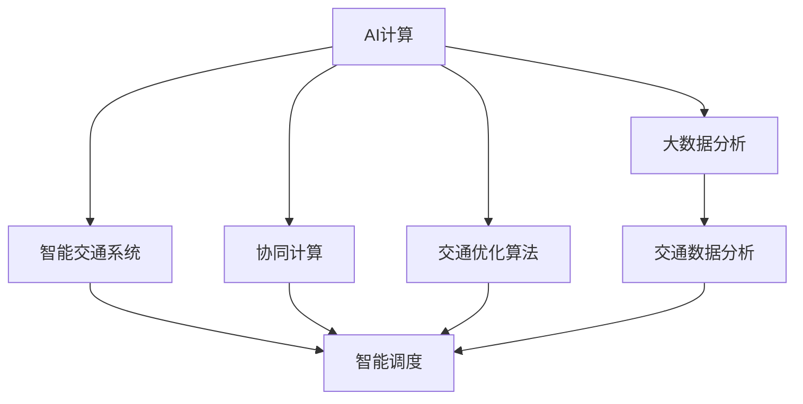

                 

# AI与人类计算：打造可持续发展的城市交通系统

> 关键词：AI计算, 智能交通系统, 可持续城市发展, 大数据分析, 协同计算, 交通优化算法

## 1. 背景介绍

### 1.1 问题由来
随着全球人口的快速增长和城市化进程的加快，城市交通系统面临着严峻的挑战。交通拥堵、环境污染、资源浪费等问题已经成为制约城市发展的重要因素。为了应对这些挑战，许多城市开始引入人工智能(AI)技术，探索以AI为核心的智能交通系统，以实现交通系统的智能化、绿色化和可持续发展。

### 1.2 问题核心关键点
智能交通系统利用AI技术对交通数据进行高效分析和处理，通过数据驱动的决策支持，优化交通流量分配，提升交通系统的整体效率。其核心关键点包括：
- AI计算：利用机器学习、深度学习等技术，对交通数据进行智能分析与预测。
- 智能调度：实现交通信号灯、公交车、出租车等交通工具的智能调度。
- 协同计算：整合各类交通资源，提升交通系统的协同效率。
- 交通优化算法：优化交通流的分布与流动，实现交通系统的合理配置。
- 大数据分析：通过实时采集和分析交通数据，掌握交通运行情况，优化决策。

## 2. 核心概念与联系

### 2.1 核心概念概述

为了更好地理解AI与人类计算在智能交通系统中的应用，本节将介绍几个关键概念：

- AI计算：通过机器学习、深度学习等技术，对城市交通数据进行智能分析和处理，辅助决策和预测。
- 智能交通系统：利用AI技术优化交通信号灯、公交车、出租车等交通工具的调度，提升交通效率和安全性。
- 协同计算：将各类交通资源整合到一个统一的平台，实现资源共享和协同优化。
- 交通优化算法：通过数学模型和算法优化交通流的分布与流动，实现交通系统的合理配置。
- 大数据分析：利用大数据技术，实时采集和分析交通数据，掌握交通运行情况，优化决策。

这些概念之间的逻辑关系可以通过以下Mermaid流程图来展示：



这个流程图展示了一些核心概念之间的关系：

1. AI计算提供智能分析和预测能力，是智能交通系统的基础。
2. 智能交通系统通过AI计算的辅助，优化交通调度，提升交通效率。
3. 协同计算整合各类交通资源，进一步提升调度效率。
4. 交通优化算法优化交通流分配，实现合理的交通配置。
5. 大数据分析实时监控交通运行情况，提供决策支持。

## 3. 核心算法原理 & 具体操作步骤

### 3.1 算法原理概述

智能交通系统中的AI计算主要通过以下算法原理：

- 机器学习：利用历史交通数据训练模型，预测未来交通流量和拥堵情况。
- 深度学习：使用神经网络对交通数据进行高维表示学习，提取更丰富的特征。
- 强化学习：通过与环境互动，优化交通信号控制策略。
- 协同优化算法：将不同的交通元素（如车辆、信号灯、行人）视为一个系统，通过协同算法优化系统整体的运行效率。

这些算法共同构建了智能交通系统的AI计算基础，实现了对交通数据的智能分析、预测和优化。

### 3.2 算法步骤详解

以下以交通流量预测为例，详细讲解基于AI计算的交通流量预测步骤：

1. **数据采集**：通过传感器、摄像头、GPS等设备，实时采集交通流量数据。
2. **数据预处理**：对采集的数据进行清洗、归一化、特征提取等预处理步骤。
3. **模型训练**：选择适当的机器学习模型（如线性回归、决策树、随机森林、深度神经网络等），利用历史交通数据进行模型训练。
4. **模型验证**：使用验证集对模型进行验证，调整模型参数，确保预测精度。
5. **预测应用**：将训练好的模型应用于实时交通流量预测，生成流量预测结果。

### 3.3 算法优缺点

基于AI计算的智能交通系统具有以下优点：

- **高效性**：利用AI技术快速处理大量交通数据，提高决策效率。
- **实时性**：能够实时监控和预测交通流量，及时调整交通调度策略。
- **精准性**：通过深度学习模型提取丰富的交通特征，提高预测精度。
- **自适应性**：能够根据环境变化动态调整交通策略，提升系统适应性。

然而，也存在一些局限性：

- **数据依赖**：模型效果依赖于历史数据的完整性和质量。
- **模型复杂性**：深度学习模型的训练和调优需要大量计算资源和时间。
- **算法可解释性**：AI计算的决策过程相对黑盒，难以解释和调试。
- **安全性**：AI计算可能受到攻击，影响系统安全性。

### 3.4 算法应用领域

AI计算在智能交通系统中应用于多个领域：

- **交通流量预测**：利用AI模型预测未来交通流量，优化交通信号控制。
- **路径规划**：通过AI计算，提供最优路径选择，减少交通拥堵。
- **交通监控**：实时监控交通数据，分析交通异常情况，预警交通事件。
- **智能调度**：优化公交车、出租车等交通工具的调度，提高运输效率。
- **事故预防**：利用AI技术分析事故原因，预测潜在风险，减少交通事故。

## 4. 数学模型和公式 & 详细讲解 & 举例说明

### 4.1 数学模型构建

智能交通系统中的AI计算涉及多种数学模型，如线性回归模型、决策树模型、随机森林模型、深度神经网络模型等。以下以线性回归模型为例，讲解其数学模型构建过程：

设交通流量为 $y$，影响交通流量的因素包括温度 $x_1$、湿度 $x_2$、天气状况 $x_3$ 等，建立线性回归模型：

$$ y = \theta_0 + \theta_1 x_1 + \theta_2 x_2 + \theta_3 x_3 + \epsilon $$

其中 $\theta_0, \theta_1, \theta_2, \theta_3$ 为模型参数，$\epsilon$ 为误差项。

### 4.2 公式推导过程

线性回归模型的最小二乘法推导如下：

1. **损失函数**：最小化预测值与实际值之间的平方误差，即：

$$ J(\theta) = \frac{1}{2N} \sum_{i=1}^N (y_i - \hat{y}_i)^2 $$

其中 $y_i$ 为实际流量，$\hat{y}_i$ 为预测流量。

2. **梯度下降**：通过梯度下降算法最小化损失函数：

$$ \theta_k = \theta_k - \alpha \frac{\partial J(\theta)}{\partial \theta_k} $$

其中 $\alpha$ 为学习率，$\frac{\partial J(\theta)}{\partial \theta_k}$ 为损失函数对参数 $k$ 的偏导数。

### 4.3 案例分析与讲解

假设某城市一天的交通流量数据如下表：

| 时间 | 温度 $x_1$ | 湿度 $x_2$ | 天气状况 $x_3$ | 流量 $y$ |
| --- | --- | --- | --- | --- |
| 6:00 | 10 | 70 | 晴 | 1000 |
| 7:00 | 12 | 75 | 晴 | 1500 |
| 8:00 | 14 | 80 | 晴 | 2000 |
| 9:00 | 16 | 85 | 晴 | 2500 |
| 10:00 | 18 | 90 | 晴 | 3000 |
| 11:00 | 20 | 95 | 多云 | 3000 |
| 12:00 | 22 | 100 | 多云 | 3500 |
| 13:00 | 24 | 105 | 阴 | 3000 |
| 14:00 | 26 | 110 | 阴 | 2500 |
| 15:00 | 28 | 115 | 阴 | 2000 |
| 16:00 | 30 | 120 | 晴 | 1500 |
| 17:00 | 32 | 125 | 晴 | 1000 |
| 18:00 | 34 | 130 | 晴 | 800 |

我们可以构建线性回归模型，并使用梯度下降算法对其进行训练，计算出的模型参数 $\theta_0, \theta_1, \theta_2, \theta_3$ 可以用于预测未来的交通流量。

## 5. 项目实践：代码实例和详细解释说明

### 5.1 开发环境搭建

在进行AI计算项目实践前，我们需要准备好开发环境。以下是使用Python进行PyTorch开发的环境配置流程：

1. 安装Anaconda：从官网下载并安装Anaconda，用于创建独立的Python环境。

2. 创建并激活虚拟环境：
```bash
conda create -n ai-env python=3.8 
conda activate ai-env
```

3. 安装PyTorch：根据CUDA版本，从官网获取对应的安装命令。例如：
```bash
conda install pytorch torchvision torchaudio cudatoolkit=11.1 -c pytorch -c conda-forge
```

4. 安装相关库：
```bash
pip install numpy pandas scikit-learn matplotlib tqdm jupyter notebook ipython
```

完成上述步骤后，即可在`ai-env`环境中开始AI计算的开发实践。

### 5.2 源代码详细实现

以下以线性回归模型为例，给出使用PyTorch进行交通流量预测的PyTorch代码实现。

```python
import torch
import torch.nn as nn
import torch.optim as optim
from sklearn.model_selection import train_test_split
from sklearn.metrics import mean_squared_error
import pandas as pd

# 数据预处理
data = pd.read_csv('traffic_data.csv')
X = data[['temperature', 'humidity', 'weather']]
y = data['traffic']
X_train, X_test, y_train, y_test = train_test_split(X, y, test_size=0.2)

# 模型定义
class LinearRegression(nn.Module):
    def __init__(self):
        super(LinearRegression, self).__init__()
        self.linear = nn.Linear(X.shape[1], 1)
    
    def forward(self, x):
        return self.linear(x)

# 模型训练
model = LinearRegression()
criterion = nn.MSELoss()
optimizer = optim.SGD(model.parameters(), lr=0.01)
epochs = 100

for epoch in range(epochs):
    optimizer.zero_grad()
    predictions = model(X_train)
    loss = criterion(predictions, y_train)
    loss.backward()
    optimizer.step()
    print(f'Epoch {epoch+1}, loss: {loss.item()}')

# 模型评估
predictions = model(X_test)
mse = mean_squared_error(y_test, predictions)
print(f'Test MSE: {mse}')
```

以上就是使用PyTorch进行线性回归模型训练的完整代码实现。可以看到，利用PyTorch的高效计算能力，可以轻松实现AI计算模型训练。

### 5.3 代码解读与分析

让我们再详细解读一下关键代码的实现细节：

**数据预处理**：
- 使用pandas库读取数据集，对数据进行清洗和归一化处理。
- 将数据集划分为训练集和测试集，用于模型训练和评估。

**模型定义**：
- 使用PyTorch定义线性回归模型，其中`nn.Linear`用于定义线性层。
- `forward`方法定义模型前向传播过程。

**模型训练**：
- 使用SGD优化器进行模型参数优化，定义损失函数为均方误差。
- 循环迭代训练模型，每次更新模型参数，并输出训练损失。

**模型评估**：
- 使用测试集对模型进行评估，计算均方误差作为模型性能指标。

可以看到，PyTorch提供了强大的计算能力，使得AI计算模型的开发和训练变得简洁高效。开发者可以将更多精力放在数据处理和模型改进上，而不必过多关注底层的实现细节。

当然，工业级的系统实现还需考虑更多因素，如模型的保存和部署、超参数的自动搜索、更灵活的任务适配层等。但核心的AI计算模型训练基本与此类似。

## 6. 实际应用场景

### 6.1 智能交通信号灯

智能交通信号灯利用AI计算对实时交通流量进行分析和预测，根据流量情况动态调整信号灯周期和绿灯时长，优化交通流量分配。例如，在早晚高峰时段，AI系统可以自动调整信号灯周期，减少交通拥堵。

### 6.2 公交调度优化

基于AI计算的公交调度系统，通过实时分析乘客流量、车辆位置、交通拥堵情况等数据，优化公交线路和车辆调度，提升公交运输效率。例如，在交通拥堵区域增加公交车频次，减少乘客等待时间。

### 6.3 智能停车管理

利用AI计算对停车场的实时停车数据进行分析，优化停车策略。例如，通过预测未来停车需求，调整停车场出入口数量，减少停车等待时间。

### 6.4 未来应用展望

随着AI计算技术的不断发展，智能交通系统将呈现以下几个发展趋势：

1. **边缘计算**：在靠近交通源的设备和边缘服务器上进行实时计算，减少延迟，提高响应速度。
2. **联邦学习**：通过分布式计算和本地数据训练，保护用户隐私，提升模型性能。
3. **实时优化**：利用实时数据进行动态调整，实现高效的交通流量控制。
4. **智能预测**：利用深度学习模型进行交通流量的精确预测，优化交通调度。
5. **跨界融合**：与物联网、大数据、云计算等技术结合，构建一体化智能交通系统。

这些趋势将进一步提升智能交通系统的智能化、自动化和协同化水平，为城市交通的可持续发展提供有力支持。

## 7. 工具和资源推荐

### 7.1 学习资源推荐

为了帮助开发者系统掌握AI计算在智能交通系统中的应用，这里推荐一些优质的学习资源：

1. 《深度学习与自动驾驶》系列博文：由AI领域专家撰写，深入浅出地介绍了深度学习在自动驾驶中的应用，涵盖交通流预测、智能调度等主题。

2. CS223《机器学习》课程：斯坦福大学开设的机器学习课程，系统讲解机器学习的基本概念和算法，适合入门学习。

3. 《深度学习》书籍：Ian Goodfellow等人的经典著作，全面介绍了深度学习的原理和应用，包括交通数据处理和预测。

4. PyTorch官方文档：PyTorch的官方文档，提供了丰富的实例和API参考，适合快速上手开发。

5. Kaggle平台：Kaggle提供大量交通数据集和比赛，可以帮助开发者进行实践和竞赛，积累经验。

通过对这些资源的学习实践，相信你一定能够快速掌握AI计算在智能交通系统中的应用，并用于解决实际的交通问题。

### 7.2 开发工具推荐

高效的开发离不开优秀的工具支持。以下是几款用于AI计算开发的常用工具：

1. PyTorch：基于Python的开源深度学习框架，灵活动态的计算图，适合快速迭代研究。

2. TensorFlow：由Google主导开发的开源深度学习框架，生产部署方便，适合大规模工程应用。

3. TensorBoard：TensorFlow配套的可视化工具，可实时监测模型训练状态，提供丰富的图表呈现方式。

4. Weights & Biases：模型训练的实验跟踪工具，可以记录和可视化模型训练过程中的各项指标，方便对比和调优。

5. Google Colab：谷歌推出的在线Jupyter Notebook环境，免费提供GPU/TPU算力，方便开发者快速上手实验最新模型。

合理利用这些工具，可以显著提升AI计算模型的开发效率，加快创新迭代的步伐。

### 7.3 相关论文推荐

AI计算在智能交通系统中的应用源于学界的持续研究。以下是几篇奠基性的相关论文，推荐阅读：

1. Deep Learning for Autonomous Vehicles（深度学习在自动驾驶中的应用）：提出利用深度学习模型进行交通流预测和路径规划，提升自动驾驶系统的性能。

2. Traffic Flow Prediction and Control with Machine Learning（利用机器学习进行交通流预测和控制）：通过建立交通流量预测模型，优化交通信号控制，减少交通拥堵。

3. Adaptive Traffic Signals Control with Reinforcement Learning（利用强化学习进行自适应交通信号控制）：利用强化学习算法优化信号灯控制策略，提高交通效率。

4. Cooperative Adaptive Cruise Control with Deep Neural Networks（利用深度神经网络进行协同自适应巡航控制）：通过深度神经网络实现多车协同，优化交通流控制。

5. Federated Learning for Traffic Prediction and Control（联邦学习在交通预测和控制中的应用）：通过分布式计算和本地数据训练，提升交通流预测和控制模型性能。

这些论文代表了大规模AI计算在智能交通系统中的前沿发展，为未来研究提供了重要的借鉴。

## 8. 总结：未来发展趋势与挑战

### 8.1 总结

本文对AI计算在智能交通系统中的应用进行了全面系统的介绍。首先阐述了AI计算在交通数据智能分析与预测中的作用，明确了其对智能交通系统的重要性。其次，从原理到实践，详细讲解了AI计算的数学模型和操作步骤，给出了交通流量预测的完整代码实现。同时，本文还广泛探讨了AI计算在智能交通系统中的应用场景，展示了其巨大的潜力。此外，本文精选了AI计算技术的各类学习资源，力求为读者提供全方位的技术指引。

通过本文的系统梳理，可以看到，AI计算为智能交通系统的智能化、绿色化和可持续发展提供了有力的技术支撑，推动了城市交通的全面升级。未来，伴随AI计算技术的持续演进，智能交通系统必将在更大范围、更深层次上得到应用，为人类社会的可持续发展贡献力量。

### 8.2 未来发展趋势

展望未来，AI计算在智能交通系统中的发展趋势包括：

1. **高效计算**：随着计算资源的增长和算法优化，AI计算的实时性、高效性将进一步提升，支持更大规模、更复杂的智能交通应用。
2. **协同计算**：通过联邦学习、边缘计算等技术，实现多源数据融合，提升交通系统的协同效率。
3. **智能预测**：利用深度学习模型和大数据技术，进行更精准的交通流量预测，优化交通调度。
4. **跨界融合**：与物联网、大数据、云计算等技术结合，构建一体化智能交通系统，提升系统智能化水平。
5. **数据驱动**：通过实时数据反馈，不断优化AI计算模型，提升系统适应性和自学习能力。

这些趋势将推动AI计算在智能交通系统中的广泛应用，实现交通系统的智能、绿色和可持续发展。

### 8.3 面临的挑战

尽管AI计算在智能交通系统中的应用取得了一定的成果，但在迈向更加智能化、普适化应用的过程中，仍面临诸多挑战：

1. **数据质量问题**：交通数据的质量和实时性直接影响AI计算模型的效果，需要解决数据采集、清洗、融合等问题。
2. **模型复杂性**：深度学习模型的训练和调优需要大量计算资源和时间，如何简化模型结构，提高计算效率，是一个重要研究方向。
3. **系统安全性**：AI计算系统可能受到网络攻击，影响系统安全稳定，需要加强数据安全防护和系统监控。
4. **算法可解释性**：AI计算的决策过程相对黑盒，难以解释和调试，需要探索更好的模型解释和可解释性技术。

这些挑战需要通过持续的研究和优化，才能使AI计算技术在智能交通系统中得到更广泛的应用。

### 8.4 研究展望

未来，需要在以下几个方面进行深入研究：

1. **数据增强技术**：利用数据增强技术提升数据质量，解决数据偏差和噪声问题。
2. **模型压缩与加速**：研究高效的模型压缩与加速技术，提升计算效率，降低资源消耗。
3. **跨模态融合**：探索跨模态数据的融合技术，提升系统的融合能力和泛化能力。
4. **模型解释与可解释性**：开发更好的模型解释和可解释性技术，增强系统的透明度和可解释性。
5. **系统鲁棒性**：研究系统鲁棒性技术，增强系统的稳定性和安全性。

这些研究方向将推动AI计算技术在智能交通系统中的进一步发展，提升系统的智能化水平和稳定性。

## 9. 附录：常见问题与解答

**Q1：AI计算在智能交通系统中是否适用于所有交通场景？**

A: AI计算在智能交通系统中适用于大部分交通场景，但在一些特殊场景中，如极端天气、特殊道路等，需要结合具体场景进行优化。例如，在极端天气条件下，AI计算模型可能无法准确预测交通流量，需要引入其他传感器数据进行辅助。

**Q2：如何选择适当的AI计算模型？**

A: 选择适当的AI计算模型需要考虑以下几个因素：
1. 数据量：大数据集适合使用深度学习模型，小数据集适合使用机器学习模型。
2. 计算资源：计算资源有限时，选择参数较少、计算速度较快的模型。
3. 精度要求：高精度要求时，选择复杂的深度神经网络模型，低精度要求时，选择简单的线性回归模型。

**Q3：AI计算模型的训练和调优过程中需要注意哪些问题？**

A: AI计算模型的训练和调优过程中需要注意以下问题：
1. 数据预处理：数据清洗、归一化、特征提取等预处理步骤，提升模型效果。
2. 模型选择：选择适当的模型架构和参数，避免过拟合或欠拟合。
3. 学习率选择：选择合适学习率，避免学习率过大导致模型发散或过小导致收敛缓慢。
4. 正则化技术：引入L2正则、Dropout等技术，防止过拟合。
5. 模型评估：使用验证集评估模型效果，调整模型参数，提升模型泛化能力。

**Q4：AI计算模型在实际应用中需要注意哪些问题？**

A: AI计算模型在实际应用中需要注意以下问题：
1. 数据质量：确保数据的质量和实时性，避免数据偏差和噪声影响模型效果。
2. 计算资源：考虑计算资源的限制，选择高效的模型和算法。
3. 系统安全：保护系统数据和模型安全，防止攻击和泄露。
4. 模型解释：增强模型的可解释性，提高系统的透明度和可信度。

**Q5：AI计算系统如何应对极端天气条件？**

A: 极端天气条件对AI计算系统提出了更高的要求，可以采取以下措施应对：
1. 多源数据融合：结合气象数据、传感器数据等，进行综合分析，提升预测准确性。
2. 动态调整：根据天气变化动态调整模型参数，优化预测结果。
3. 应急预案：制定应急预案，提高系统鲁棒性，减少突发事件对交通的影响。

这些问题的解决需要系统设计者的综合考虑和深入研究，确保AI计算系统在各种场景下都能稳定运行。

---

作者：禅与计算机程序设计艺术 / Zen and the Art of Computer Programming

