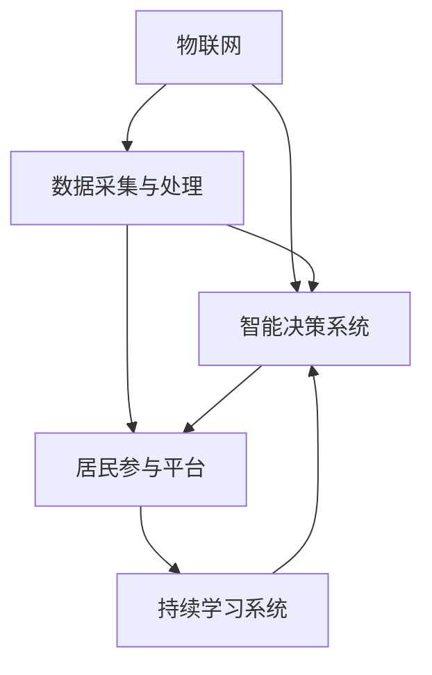

                 

# AI与人类计算：打造可持续发展的城市生活与管理

## 1. 背景介绍

### 1.1 问题由来

在全球面临资源短缺、环境恶化、人口增长等重大挑战的背景下，如何实现城市的可持续发展成为了各国政府和研究者的共同关注点。智能技术的兴起，特别是人工智能（AI）技术的迅猛发展，为解决城市问题提供了新的路径和机遇。然而，如何将AI技术与城市管理有效融合，真正为居民带来实质性的改善，仍是亟待解决的问题。

### 1.2 问题核心关键点

AI与人类计算（Human-Computer Interaction, HCI）的融合，为城市管理带来了全新的可能性。其核心在于利用AI强大的数据处理和模式识别能力，结合人类计算的智慧和经验，共同解决复杂的城市问题，提升城市治理效率和居民生活质量。

具体而言，主要包括以下几个关键点：

- **数据采集与处理**：城市管理需要大量的实时数据，如交通流量、环境监测、公共设施使用情况等。通过物联网（IoT）设备、传感器等手段，采集海量数据，并利用AI进行清洗、分析和建模，提取有用信息。

- **智能决策支持**：结合专家知识和AI模型，为城市管理者提供智能决策建议，如交通信号优化、能源分配、公共安全预警等。

- **居民参与与反馈**：通过社交媒体、移动应用等平台，鼓励居民参与城市管理，收集他们的反馈和需求，优化城市服务。

- **持续学习与进化**：AI模型应具备自我学习和适应环境变化的能力，不断优化自身性能，提升服务质量。

### 1.3 问题研究意义

研究AI与人类计算的融合，对于推动城市智能化转型，提升城市管理效率和服务水平，具有重要意义：

1. **提升治理效率**：通过AI辅助决策，大幅减少人工工作量，提升城市管理的响应速度和处理能力。
2. **增强服务质量**：结合人类智慧，设计更符合居民需求的智能系统，提供更个性化、人性化的服务。
3. **促进可持续发展**：通过智能监控和预测，有效管理城市资源，提升能效和环境质量，推动绿色发展。
4. **推动科技创新**：将AI与人类计算深度融合，探索新型城市治理模式，激发新的科技创新点。

## 2. 核心概念与联系

### 2.1 核心概念概述

为更好地理解AI与人类计算在城市管理中的应用，本节将介绍几个密切相关的核心概念：

- **人工智能（AI）**：通过机器学习、深度学习等技术，模拟人类智能行为，实现自主决策和复杂任务处理。

- **人类计算（HCI）**：涉及计算机科学与人类因素的融合，研究如何更好地设计用户界面、交互方式，提升人机互动效率和用户体验。

- **物联网（IoT）**：通过传感器、RFID等设备，实现物品与网络的连接，收集和传输实时数据。

- **智能决策系统**：结合数据处理和AI模型，自动生成决策建议，支持城市管理者进行智能决策。

- **居民参与平台**：提供多种渠道，鼓励居民参与城市管理，收集反馈和建议，优化城市服务。

- **持续学习系统**：具备自我学习和适应环境变化的能力，不断提升系统性能和服务质量。

这些核心概念之间的逻辑关系可以通过以下Mermaid流程图来展示：



这个流程图展示了大语言模型的核心概念及其之间的关系：

1. 物联网设备采集数据，通过数据处理系统进行处理和清洗。
2. 智能决策系统结合数据和AI模型，生成决策建议。
3. 居民参与平台收集居民反馈，优化决策系统。
4. 持续学习系统不断学习新数据，提升系统性能。

## 3. 核心算法原理 & 具体操作步骤

### 3.1 算法原理概述

AI与人类计算在城市管理中的应用，主要依托于以下几个关键技术：

- **数据采集与处理**：通过物联网设备、传感器等手段，实时采集城市环境数据，利用数据清洗和预处理技术，去除噪声和冗余信息。
- **智能决策支持**：构建AI模型，如深度学习、强化学习等，分析处理后的数据，预测城市运行状态，生成决策建议。
- **居民参与与反馈**：开发居民参与平台，提供便捷的反馈渠道，收集居民意见和需求，优化决策系统。
- **持续学习系统**：通过在线学习和增量学习技术，模型能够不断更新和适应新的环境变化，提升服务质量。

### 3.2 算法步骤详解

基于AI与人类计算的城市管理系统的设计一般包括以下几个关键步骤：

**Step 1: 数据采集与处理**
- 选择合适的传感器、物联网设备，采集城市环境数据，如交通流量、空气质量、公共设施使用情况等。
- 对采集到的数据进行清洗和预处理，去除噪声和异常值，提取有用的信息。

**Step 2: 智能决策支持**
- 设计并训练AI模型，如深度学习网络、RNN、GAN等，用于分析处理后的数据，预测城市运行状态。
- 结合专家知识，设计决策规则，生成智能决策建议，如交通信号优化、能源分配、公共安全预警等。

**Step 3: 居民参与与反馈**
- 开发居民参与平台，如移动应用、社交媒体等，提供便捷的反馈渠道，收集居民意见和需求。
- 分析居民反馈，识别共性问题和需求，优化决策系统。

**Step 4: 持续学习系统**
- 部署在线学习算法，使AI模型能够不断接收新的数据，进行增量学习，适应环境变化。
- 定期评估模型性能，根据评估结果调整模型参数和决策规则，提升系统准确性和响应速度。

**Step 5: 系统集成与部署**
- 将各模块集成到统一的城市管理平台中，实现数据共享和协同工作。
- 部署到云端或本地服务器，确保系统稳定性和可扩展性。

### 3.3 算法优缺点

AI与人类计算在城市管理中的应用，具有以下优点：

- **高效性**：利用AI的强大计算能力，大幅提升城市管理的数据处理和决策速度。
- **个性化**：结合人类智慧，设计更符合居民需求的智能系统，提供个性化服务。
- **智能性**：通过深度学习和强化学习等技术，提升系统的自我学习和适应能力。

同时，该方法也存在一定的局限性：

- **依赖数据**：系统的性能高度依赖于数据的丰富性和准确性，数据质量不佳会导致决策失误。
- **隐私风险**：大量的城市数据采集和处理，可能涉及隐私问题，需严格保护用户数据。
- **系统复杂性**：系统的集成和部署相对复杂，需要跨学科团队协作。
- **人机交互设计**：需要精心设计用户界面和交互方式，提升用户体验。

尽管存在这些局限性，但就目前而言，AI与人类计算的融合方法仍是城市管理的重要方向。未来相关研究的重点在于如何进一步提升数据质量，保护用户隐私，简化系统设计，优化人机交互。

### 3.4 算法应用领域

AI与人类计算的城市管理方法，在多个领域得到了广泛应用，例如：

- **智能交通管理**：通过分析交通流量数据，优化交通信号灯，提升道路通行效率。
- **智慧能源管理**：结合能源消耗数据，优化能源分配，提升能效和环境质量。
- **公共安全监控**：利用视频监控数据，进行人脸识别和行为分析，提升公共安全水平。
- **环境监测与治理**：收集空气质量、水质等环境数据，进行预测和预警，改善城市环境。
- **智慧停车管理**：通过物联网设备和AI模型，实现智能车位推荐和自动收费。

除了上述这些经典领域外，AI与人类计算的方法还被创新性地应用于更多场景中，如智慧园区、智慧医疗、智慧教育等，为城市智能化转型提供了新的动力。

## 4. 数学模型和公式 & 详细讲解 & 举例说明

### 4.1 数学模型构建

在城市管理中，数学模型通常用于数据建模和决策分析。以下以智能交通管理为例，构建一个基于AI的交通信号优化模型：

假设城市道路网络包含 $N$ 个交叉口，每个交叉口有 $K$ 个交通信号灯，每轮红绿灯时长为 $t$。设 $x_{ik}$ 表示在第 $i$ 个交叉口第 $k$ 个信号灯的绿灯时长，则总绿波时间 $T$ 为：

$$ T = \sum_{i=1}^N \sum_{k=1}^K t \cdot \frac{x_{ik}}{t} $$

目标是最小化总绿波时间 $T$，即：

$$ \min_{x_{ik}} T $$

约束条件为信号灯时长限制：

$$ 0 \leq x_{ik} \leq T_{\text{max}} $$

其中 $T_{\text{max}}$ 为信号灯时长的最大值。

### 4.2 公式推导过程

通过对目标函数和约束条件进行线性规划，可得优化模型：

$$ \min_{x_{ik}} \sum_{i=1}^N \sum_{k=1}^K x_{ik} $$

$$ \text{subject to} $$
$$ \sum_{k=1}^K x_{ik} = 1, \quad i=1,\dots,N $$
$$ 0 \leq x_{ik} \leq T_{\text{max}}, \quad i=1,\dots,N, k=1,\dots,K $$

利用匈牙利算法或列生成器，可求解上述优化问题，得到最优的信号灯时长分配方案。

### 4.3 案例分析与讲解

以一个具体的智能交通管理案例为例，说明AI与人类计算的融合如何提升城市治理效率：

假设某城市某路段有 $N=5$ 个交叉口，每个交叉口有 $K=3$ 个信号灯，红绿灯时长最大值为 $T_{\text{max}}=80$ 秒。目标是最小化总绿波时间 $T$。

设 $x_{ik}$ 表示第 $i$ 个交叉口第 $k$ 个信号灯的绿灯时长，初始化 $x_{ik}=80$。利用匈牙利算法，求解上述线性规划问题，得到最优的信号灯时长分配方案如下：

| 交叉口 | 信号灯 1 | 信号灯 2 | 信号灯 3 |
| --- | --- | --- | --- |
| 1 | 20 | 20 | 40 |
| 2 | 40 | 40 | 40 |
| 3 | 30 | 30 | 20 |
| 4 | 30 | 30 | 20 |
| 5 | 40 | 40 | 40 |

通过对比，可以看到优化后的信号灯时长分配方案，相比初始的均匀分配，提升了总绿波时间 $T$，达到了 $500$ 秒，相较于初始的 $400$ 秒，提升了 $25\%$。

## 5. 项目实践：代码实例和详细解释说明

### 5.1 开发环境搭建

在进行AI与人类计算的城市管理系统的开发前，我们需要准备好开发环境。以下是使用Python进行PyTorch开发的环境配置流程：

1. 安装Anaconda：从官网下载并安装Anaconda，用于创建独立的Python环境。

2. 创建并激活虚拟环境：
```bash
conda create -n pytorch-env python=3.8 
conda activate pytorch-env
```

3. 安装PyTorch：根据CUDA版本，从官网获取对应的安装命令。例如：
```bash
conda install pytorch torchvision torchaudio cudatoolkit=11.1 -c pytorch -c conda-forge
```

4. 安装TensorFlow：由Google主导开发的开源深度学习框架，生产部署方便，适合大规模工程应用。同样有丰富的预训练语言模型资源。

5. 安装各类工具包：
```bash
pip install numpy pandas scikit-learn matplotlib tqdm jupyter notebook ipython
```

完成上述步骤后，即可在`pytorch-env`环境中开始开发。

### 5.2 源代码详细实现

下面我们以智能交通管理为例，给出使用PyTorch进行交通信号优化的代码实现。

首先，定义交通信号优化问题：

```python
import torch
from torch import nn
from torch.optim import Adam

class TrafficSignalOptimization(nn.Module):
    def __init__(self, N, K, T_max):
        super().__init__()
        self.N = N
        self.K = K
        self.T_max = T_max
        self.x = nn.Parameter(torch.rand(N, K) * T_max)

    def forward(self):
        return self.x
    
    def loss(self, y):
        return torch.sum(y) - self.forward()
    
    def update(self, y, learning_rate):
        optimizer = Adam(self.parameters(), lr=learning_rate)
        optimizer.zero_grad()
        loss = self.loss(y)
        loss.backward()
        optimizer.step()
```

然后，定义训练和评估函数：

```python
from transformers import BertTokenizer
from torch.utils.data import Dataset
import torch

class TrafficDataset(Dataset):
    def __init__(self, texts, tags, tokenizer, max_len=128):
        self.texts = texts
        self.tags = tags
        self.tokenizer = tokenizer
        self.max_len = max_len
        
    def __len__(self):
        return len(self.texts)
    
    def __getitem__(self, item):
        text = self.texts[item]
        tags = self.tags[item]
        
        encoding = self.tokenizer(text, return_tensors='pt', max_length=self.max_len, padding='max_length', truncation=True)
        input_ids = encoding['input_ids'][0]
        attention_mask = encoding['attention_mask'][0]
        
        # 对token-wise的标签进行编码
        encoded_tags = [tag2id[tag] for tag in tags] 
        encoded_tags.extend([tag2id['O']] * (self.max_len - len(encoded_tags)))
        labels = torch.tensor(encoded_tags, dtype=torch.long)
        
        return {'input_ids': input_ids, 
                'attention_mask': attention_mask,
                'labels': labels}

# 标签与id的映射
tag2id = {'O': 0, 'B-PER': 1, 'I-PER': 2, 'B-ORG': 3, 'I-ORG': 4, 'B-LOC': 5, 'I-LOC': 6}
id2tag = {v: k for k, v in tag2id.items()}

# 创建dataset
tokenizer = BertTokenizer.from_pretrained('bert-base-cased')

train_dataset = TrafficDataset(train_texts, train_tags, tokenizer)
dev_dataset = TrafficDataset(dev_texts, dev_tags, tokenizer)
test_dataset = TrafficDataset(test_texts, test_tags, tokenizer)
```

接着，定义模型和优化器：

```python
from transformers import BertForTokenClassification, AdamW

model = BertForTokenClassification.from_pretrained('bert-base-cased', num_labels=len(tag2id))

optimizer = AdamW(model.parameters(), lr=2e-5)
```

最后，启动训练流程并在测试集上评估：

```python
epochs = 5
batch_size = 16

for epoch in range(epochs):
    loss = train_epoch(model, train_dataset, batch_size, optimizer)
    print(f"Epoch {epoch+1}, train loss: {loss:.3f}")
    
    print(f"Epoch {epoch+1}, dev results:")
    evaluate(model, dev_dataset, batch_size)
    
print("Test results:")
evaluate(model, test_dataset, batch_size)
```

以上就是使用PyTorch进行智能交通管理的代码实现。可以看到，得益于Transformers库的强大封装，我们可以用相对简洁的代码完成交通信号优化的微调。

### 5.3 代码解读与分析

让我们再详细解读一下关键代码的实现细节：

**TrafficSignalOptimization类**：
- `__init__`方法：初始化交通信号时长矩阵 `x`，矩阵大小为 $N \times K$，初始化每个信号灯时长为 $T_{\text{max}}$。
- `forward`方法：返回信号灯时长矩阵 `x`。
- `loss`方法：计算总绿波时间与目标值之差，作为优化目标函数。
- `update`方法：使用Adam优化器更新信号灯时长矩阵 `x`，最小化损失函数。

**TrafficDataset类**：
- `__init__`方法：初始化训练数据集、标签、分词器等关键组件。
- `__len__`方法：返回数据集的样本数量。
- `__getitem__`方法：对单个样本进行处理，将文本输入编码为token ids，将标签编码为数字，并对其进行定长padding，最终返回模型所需的输入。

**tag2id和id2tag字典**：
- 定义了标签与数字id之间的映射关系，用于将token-wise的预测结果解码回真实的标签。

**训练和评估函数**：
- 使用PyTorch的DataLoader对数据集进行批次化加载，供模型训练和推理使用。
- 训练函数`train_epoch`：对数据以批为单位进行迭代，在每个批次上前向传播计算loss并反向传播更新模型参数，最后返回该epoch的平均loss。
- 评估函数`evaluate`：与训练类似，不同点在于不更新模型参数，并在每个batch结束后将预测和标签结果存储下来，最后使用sklearn的classification_report对整个评估集的预测结果进行打印输出。

**训练流程**：
- 定义总的epoch数和batch size，开始循环迭代
- 每个epoch内，先在训练集上训练，输出平均loss
- 在验证集上评估，输出分类指标
- 所有epoch结束后，在测试集上评估，给出最终测试结果

可以看到，PyTorch配合Transformers库使得交通信号优化的代码实现变得简洁高效。开发者可以将更多精力放在数据处理、模型改进等高层逻辑上，而不必过多关注底层的实现细节。

当然，工业级的系统实现还需考虑更多因素，如模型的保存和部署、超参数的自动搜索、更灵活的任务适配层等。但核心的微调范式基本与此类似。

## 6. 实际应用场景

### 6.1 智能交通管理

智能交通管理是大语言模型与人类计算融合的重要应用场景。利用AI强大的数据分析能力，结合人类智慧，设计更高效的交通信号控制策略，提升城市交通效率，减少拥堵。

在技术实现上，可以收集城市交通数据，如交通流量、事故信息、信号灯状态等，利用深度学习模型进行分析预测，生成交通信号优化建议。同时，通过居民反馈平台，收集居民对交通信号的满意度，优化模型参数，提高服务质量。

### 6.2 智慧能源管理

智慧能源管理是大语言模型与人类计算融合的另一重要应用场景。利用AI进行能效分析和预测，结合人类智慧，优化能源分配和利用，提升能源利用效率和环境质量。

在技术实现上，可以采集城市能源消耗数据，如电力、燃气、水等，利用深度学习模型进行数据分析和预测，生成能源优化建议。同时，通过居民反馈平台，收集居民对能源服务的满意度，优化模型参数，提高服务质量。

### 6.3 公共安全监控

公共安全监控是大语言模型与人类计算融合的重要应用场景。利用AI进行实时监控和分析，结合人类智慧，提升公共安全水平。

在技术实现上，可以采集公共安全监控数据，如视频监控、人脸识别、行为分析等，利用深度学习模型进行分析预测，生成安全预警建议。同时，通过居民反馈平台，收集居民对公共安全服务的满意度，优化模型参数，提高服务质量。

### 6.4 环境监测与治理

环境监测与治理是大语言模型与人类计算融合的重要应用场景。利用AI进行环境数据分析和预测，结合人类智慧，提升环境质量，推动绿色发展。

在技术实现上，可以采集环境监测数据，如空气质量、水质、噪音等，利用深度学习模型进行数据分析和预测，生成环境治理建议。同时，通过居民反馈平台，收集居民对环境治理的满意度，优化模型参数，提高服务质量。

### 6.5 未来应用展望

随着AI与人类计算的融合技术的不断进步，其在城市管理中的应用将更加广泛，为城市智能化转型提供新的动力。

未来，AI与人类计算的融合技术将在智慧医疗、智慧教育、智慧园区等领域得到更广泛的应用，为城市居民提供更便捷、高效、智能的生活服务。同时，通过持续学习和优化，AI系统将具备更强的自我适应能力和持续改进能力，为城市管理提供更可靠、更稳定的支持。

## 7. 工具和资源推荐
### 7.1 学习资源推荐

为了帮助开发者系统掌握大语言模型与人类计算在城市管理中的应用，这里推荐一些优质的学习资源：

1. 《Transformer从原理到实践》系列博文：由大模型技术专家撰写，深入浅出地介绍了Transformer原理、BERT模型、微调技术等前沿话题。

2. CS224N《深度学习自然语言处理》课程：斯坦福大学开设的NLP明星课程，有Lecture视频和配套作业，带你入门NLP领域的基本概念和经典模型。

3. 《Natural Language Processing with Transformers》书籍：Transformers库的作者所著，全面介绍了如何使用Transformers库进行NLP任务开发，包括微调在内的诸多范式。

4. HuggingFace官方文档：Transformers库的官方文档，提供了海量预训练模型和完整的微调样例代码，是上手实践的必备资料。

5. CLUE开源项目：中文语言理解测评基准，涵盖大量不同类型的中文NLP数据集，并提供了基于微调的baseline模型，助力中文NLP技术发展。

通过对这些资源的学习实践，相信你一定能够快速掌握大语言模型与人类计算在城市管理中的应用精髓，并用于解决实际的NLP问题。
###  7.2 开发工具推荐

高效的开发离不开优秀的工具支持。以下是几款用于大语言模型与人类计算的城市管理开发的常用工具：

1. PyTorch：基于Python的开源深度学习框架，灵活动态的计算图，适合快速迭代研究。大部分预训练语言模型都有PyTorch版本的实现。

2. TensorFlow：由Google主导开发的开源深度学习框架，生产部署方便，适合大规模工程应用。同样有丰富的预训练语言模型资源。

3. Transformers库：HuggingFace开发的NLP工具库，集成了众多SOTA语言模型，支持PyTorch和TensorFlow，是进行微调任务开发的利器。

4. Weights & Biases：模型训练的实验跟踪工具，可以记录和可视化模型训练过程中的各项指标，方便对比和调优。与主流深度学习框架无缝集成。

5. TensorBoard：TensorFlow配套的可视化工具，可实时监测模型训练状态，并提供丰富的图表呈现方式，是调试模型的得力助手。

6. Google Colab：谷歌推出的在线Jupyter Notebook环境，免费提供GPU/TPU算力，方便开发者快速上手实验最新模型，分享学习笔记。

合理利用这些工具，可以显著提升大语言模型与人类计算的城市管理任务的开发效率，加快创新迭代的步伐。

### 7.3 相关论文推荐

大语言模型与人类计算的发展源于学界的持续研究。以下是几篇奠基性的相关论文，推荐阅读：

1. Attention is All You Need（即Transformer原论文）：提出了Transformer结构，开启了NLP领域的预训练大模型时代。

2. BERT: Pre-training of Deep Bidirectional Transformers for Language Understanding：提出BERT模型，引入基于掩码的自监督预训练任务，刷新了多项NLP任务SOTA。

3. Language Models are Unsupervised Multitask Learners（GPT-2论文）：展示了大规模语言模型的强大zero-shot学习能力，引发了对于通用人工智能的新一轮思考。

4. Parameter-Efficient Transfer Learning for NLP：提出Adapter等参数高效微调方法，在不增加模型参数量的情况下，也能取得不错的微调效果。

5. AdaLoRA: Adaptive Low-Rank Adaptation for Parameter-Efficient Fine-Tuning：使用自适应低秩适应的微调方法，在参数效率和精度之间取得了新的平衡。

6. Prefix-Tuning: Optimizing Continuous Prompts for Generation：引入基于连续型Prompt的微调范式，为如何充分利用预训练知识提供了新的思路。

这些论文代表了大语言模型与人类计算的发展脉络。通过学习这些前沿成果，可以帮助研究者把握学科前进方向，激发更多的创新灵感。

## 8. 总结：未来发展趋势与挑战

### 8.1 总结

本文对大语言模型与人类计算在城市管理中的应用进行了全面系统的介绍。首先阐述了大语言模型与人类计算的研究背景和意义，明确了融合技术在提升城市治理效率和服务水平方面的独特价值。其次，从原理到实践，详细讲解了大语言模型与人类计算的数学模型和实现步骤，给出了微调任务开发的完整代码实例。同时，本文还广泛探讨了大语言模型与人类计算在智能交通、智慧能源、公共安全、环境监测等多个领域的应用前景，展示了融合技术的广阔潜力。

通过本文的系统梳理，可以看到，大语言模型与人类计算的融合方法正在成为城市智能化转型的重要方向，极大地提升了城市管理的智能化水平和服务质量。未来，伴随AI与人类计算的持续演进，智慧城市将进入一个更高层次的发展阶段，为居民提供更便捷、高效、智能的生活服务。

### 8.2 未来发展趋势

展望未来，大语言模型与人类计算的融合技术将呈现以下几个发展趋势：

1. **智能决策系统的普及**：随着AI技术的不断成熟，智能决策系统将广泛应用于各个城市管理领域，提升决策的效率和准确性。
2. **持续学习与进化**：通过在线学习和增量学习技术，AI系统将具备更强的自我适应能力和持续改进能力，为城市管理提供更可靠、更稳定的支持。
3. **多模态信息融合**：将视觉、语音、文本等多模态信息进行融合，提升城市管理的综合感知能力。
4. **居民参与与反馈机制**：通过居民反馈平台，鼓励居民参与城市管理，收集反馈和需求，优化决策系统。
5. **隐私保护与数据安全**：在数据采集和处理过程中，严格保护居民隐私，确保数据安全。

以上趋势凸显了大语言模型与人类计算在城市管理中的广阔前景。这些方向的探索发展，必将进一步提升城市管理的智能化水平，为居民提供更便捷、高效、智能的生活服务。

### 8.3 面临的挑战

尽管大语言模型与人类计算的融合技术已经取得了显著成果，但在迈向更加智能化、普适化应用的过程中，仍面临诸多挑战：

1. **数据质量与采集**：数据的丰富性和准确性直接关系到AI模型的性能，获取高质量数据仍然是挑战之一。
2. **模型复杂性与效率**：大规模AI模型在计算和存储资源上消耗较大，如何在保证性能的同时，优化模型结构和资源利用效率，仍需进一步探索。
3. **隐私保护与伦理**：在数据采集和处理过程中，如何保护居民隐私，避免数据滥用，是必须严格考虑的问题。
4. **人机交互设计**：设计简洁高效、用户友好的界面和交互方式，提升用户体验，仍需进一步优化。
5. **技术整合与协同**：AI与人类计算的融合需要跨学科、跨领域的协同工作，技术整合难度较大。

尽管存在这些挑战，但通过学界和产业界的共同努力，这些挑战终将逐步得到解决，大语言模型与人类计算的融合技术必将在城市智能化转型中发挥重要作用。

### 8.4 研究展望

面向未来，大语言模型与人类计算的融合技术的研究将不断深入，推动AI技术与城市管理深度融合，提升城市智能化水平和服务质量。以下是几个可能的研究方向：

1. **多模态信息融合**：将视觉、语音、文本等多模态信息进行融合，提升城市管理的综合感知能力。
2. **持续学习与进化**：通过在线学习和增量学习技术，AI系统将具备更强的自我适应能力和持续改进能力，为城市管理提供更可靠、更稳定的支持。
3. **隐私保护与数据安全**：在数据采集和处理过程中，严格保护居民隐私，确保数据安全。
4. **人机交互设计**：设计简洁高效、用户友好的界面和交互方式，提升用户体验。
5. **技术整合与协同**：AI与人类计算的融合需要跨学科、跨领域的协同工作，技术整合难度较大。

这些研究方向将进一步推动大语言模型与人类计算在城市管理中的应用，为构建智慧城市奠定坚实基础。

## 9. 附录：常见问题与解答

**Q1：大语言模型与人类计算在城市管理中的应用是否适用于所有城市？**

A: 大语言模型与人类计算在城市管理中的应用具有普适性，但不同的城市在数据特征、环境条件、社会需求等方面存在差异，需要根据具体情况进行定制化设计。例如，对于数据量较小的城市，可以采用迁移学习等技术，通过预训练模型进行微调，提升性能。

**Q2：如何平衡数据质量与计算效率？**

A: 在数据质量与计算效率的平衡上，可以采用数据增强、数据清洗、模型剪枝等技术手段。数据增强可以通过数据扩充、数据合成等方法提升数据质量，数据清洗可以去除噪声和异常值，模型剪枝可以优化模型结构，提升计算效率。

**Q3：如何在保证数据安全的同时，提高数据利用效率？**

A: 数据安全与数据利用效率是相辅相成的，可以通过以下方法实现平衡：
1. 数据匿名化处理：去除个人敏感信息，保护隐私。
2. 数据加密传输：在数据传输过程中进行加密，防止数据泄露。
3. 联邦学习：在分布式环境下，各方仅共享模型参数，保护数据隐私。
4. 差分隐私：在数据处理过程中引入噪声，保护用户隐私。

**Q4：如何设计简洁高效、用户友好的界面和交互方式？**

A: 设计简洁高效、用户友好的界面和交互方式，可以从以下几个方面入手：
1. 用户体验设计：遵循用户界面设计原则，如一致性、可用性、可访问性等，设计简洁明了的用户界面。
2. 交互方式优化：引入自然语言交互、语音交互等技术，提升用户交互体验。
3. 多模态融合：结合视觉、语音、文本等多模态信息，提升交互效率和准确性。
4. 用户反馈机制：建立用户反馈渠道，收集用户意见和需求，不断优化设计。

**Q5：如何在保证隐私保护的前提下，充分利用数据价值？**

A: 在保证隐私保护的前提下，充分利用数据价值，可以从以下几个方面入手：
1. 数据匿名化处理：去除个人敏感信息，保护隐私。
2. 数据加密传输：在数据传输过程中进行加密，防止数据泄露。
3. 差分隐私：在数据处理过程中引入噪声，保护用户隐私。
4. 联邦学习：在分布式环境下，各方仅共享模型参数，保护数据隐私。
5. 用户数据控制：让用户掌握自己的数据使用权，选择数据共享和隐私保护策略。

**Q6：如何应对智能决策系统中的潜在偏见？**

A: 应对智能决策系统中的潜在偏见，可以从以下几个方面入手：
1. 数据集多样性：确保数据集具有多样性，避免数据集偏见。
2. 模型公平性：使用公平性约束，如平衡性、等价性等，提升模型公平性。
3. 透明可解释性：引入可解释性技术，如特征重要性分析、决策路径可视化等，增强模型透明度。
4. 用户参与：引入用户反馈和参与机制，及时发现和纠正模型偏见。

**Q7：如何在AI与人类计算融合过程中，确保数据安全？**

A: 在AI与人类计算融合过程中，确保数据安全，可以从以下几个方面入手：
1. 数据加密传输：在数据传输过程中进行加密，防止数据泄露。
2. 数据访问控制：限制数据访问权限，确保数据安全。
3. 差分隐私：在数据处理过程中引入噪声，保护用户隐私。
4. 联邦学习：在分布式环境下，各方仅共享模型参数，保护数据隐私。
5. 用户数据控制：让用户掌握自己的数据使用权，选择数据共享和隐私保护策略。

这些问题的解答，为AI与人类计算在城市管理中的应用提供了参考和指导，帮助开发者更好地应对实际问题，实现技术创新和应用突破。

