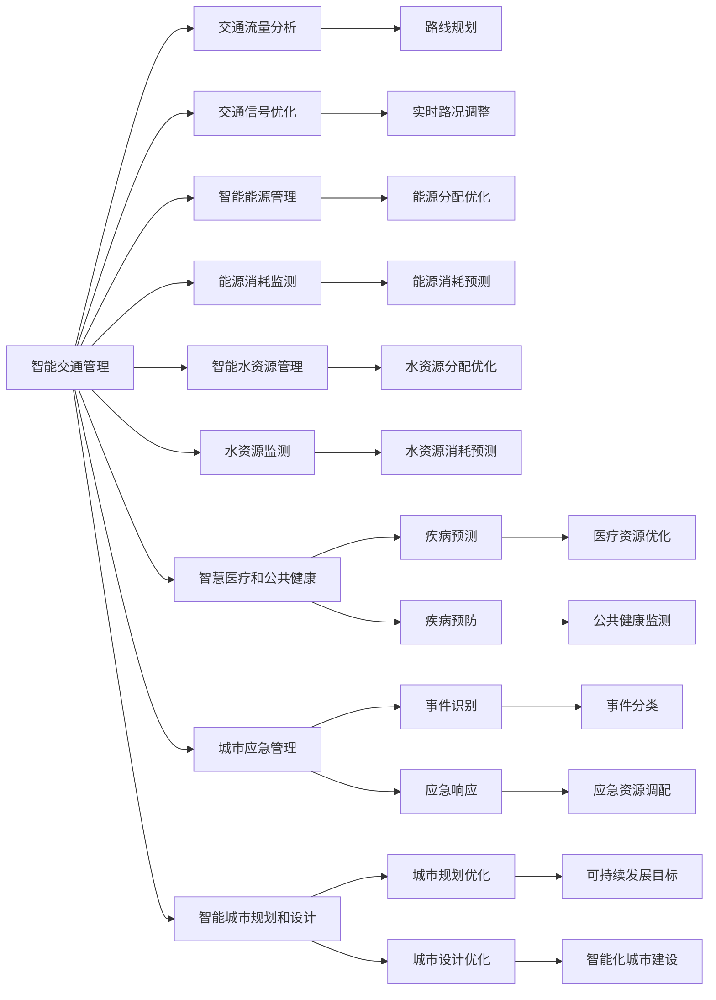

                 

## 1. 背景介绍

### 1.1 问题由来
随着科技的发展和城市化进程的推进，人类社会正面临前所未有的挑战。人口膨胀、资源紧缺、环境恶化等问题愈加严重，对城市生活模式和规划提出了新的要求。同时，人工智能（AI）技术的突破为这些问题提供了新的解决方案。

AI与城市计算的融合，使得城市生活更加智能化、绿色化和高效化。通过AI技术优化交通、能源、水资源等基础设施的运营，提高城市管理的精细化水平，缓解了资源压力和环境污染。同时，智能化的城市生活也为AI的进步提供了丰富的数据资源，形成良性循环。

### 1.2 问题核心关键点
AI与城市计算的核心关键点在于如何利用AI技术提升城市运营效率和居民生活质量，实现可持续发展。主要包括：
- 城市交通智能化管理
- 能源和资源的优化配置
- 智能水资源管理
- 智慧医疗和公共健康
- 城市应急管理
- 城市规划和设计

这些关键点涉及到城市生活的方方面面，需要通过AI技术的综合应用，实现全面提升。

### 1.3 问题研究意义
AI与城市计算的研究和应用，对推动城市可持续发展具有重要意义：
- 提升城市管理效率：AI技术可实现对城市交通、能源等基础设施的智能监测和优化，减少资源浪费，提升管理效率。
- 改善居民生活质量：智能化的城市生活，如智能家居、智慧医疗等，能够提升居民的生活品质和幸福感。
- 保护环境：通过智能化的城市规划和管理，减少碳排放和污染，实现绿色城市目标。
- 支持经济发展：AI技术的广泛应用，促进了相关产业的发展，创造了新的经济增长点。

## 2. 核心概念与联系

### 2.1 核心概念概述
#### 2.1.1 AI与城市计算
AI与城市计算是指将AI技术应用于城市管理和服务中，实现城市生活的智能化和高效化。主要包括以下几个方面：

- **智能交通管理**：通过AI技术实现对交通流量、路况的智能分析和预测，优化交通信号控制和路线规划，减少交通拥堵。
- **智能能源管理**：利用AI技术优化能源分配和消耗，提高能源利用效率，减少浪费。
- **智能水资源管理**：通过AI技术监测和管理城市水资源，实现水资源的有效利用和保护。
- **智慧医疗和公共健康**：使用AI技术提升医疗服务质量和效率，实现疾病预测和预防。
- **城市应急管理**：通过AI技术实现对城市事件的快速识别和响应，提升应急响应效率。
- **智能城市规划和设计**：利用AI技术优化城市规划设计，实现可持续发展。

#### 2.1.2 数据与计算
AI与城市计算的核心在于数据的收集、处理和分析。城市运营中的各类数据，如交通流量、能源消耗、水资源使用等，都是AI模型训练和优化的重要资源。同时，大规模数据计算是AI技术在城市应用中的关键支撑。

### 2.2 核心概念联系
AI与城市计算通过数据与计算的支撑，实现了城市生活的智能化和高效化。具体联系如下：

- **数据驱动**：城市运营中的各类数据是AI模型训练和优化的基础，数据的质量和数量直接影响AI模型的性能。
- **计算支撑**：大规模数据计算是AI技术在城市应用中的核心支撑，确保AI模型能够高效地进行训练和推理。
- **智能应用**：AI技术在城市生活中的应用，如智能交通、智能能源、智能医疗等，进一步推动了城市生活的智能化和高效化。

### 2.3 Mermaid流程图



## 3. 核心算法原理 & 具体操作步骤

### 3.1 算法原理概述
AI与城市计算的核心算法包括数据处理、模型训练和优化、模型推理等。

#### 3.1.1 数据处理
城市数据处理主要包括数据的收集、清洗、标注和存储。数据来源包括传感器、监控摄像头、智能设备等。数据的清洗和标注是保证数据质量的关键步骤。

#### 3.1.2 模型训练和优化
模型训练和优化是AI技术在城市应用中的核心环节。模型训练通常使用监督学习、强化学习等方法，优化目标函数以提高模型的预测精度和泛化能力。

#### 3.1.3 模型推理
模型推理是将训练好的AI模型应用于实际城市场景中，进行实时预测和决策的过程。模型推理通常需要考虑模型计算效率和资源消耗。

### 3.2 算法步骤详解
#### 3.2.1 数据收集和预处理
1. **数据收集**：通过传感器、监控摄像头、智能设备等收集城市运营中的各类数据。
2. **数据清洗**：去除数据中的噪声和异常值，保证数据质量。
3. **数据标注**：对数据进行标注，如交通流量、能源消耗等。

#### 3.2.2 模型训练和优化
1. **模型选择**：选择合适的AI模型，如深度学习、强化学习等。
2. **数据分割**：将数据集分为训练集、验证集和测试集。
3. **模型训练**：在训练集上训练模型，优化模型参数。
4. **模型验证**：在验证集上评估模型性能，调整模型参数。
5. **模型测试**：在测试集上测试模型性能，进行模型部署。

#### 3.2.3 模型推理和优化
1. **模型推理**：将训练好的模型应用于城市场景中，进行实时预测和决策。
2. **模型优化**：根据模型推理结果，优化模型参数和计算过程，提升模型性能。

### 3.3 算法优缺点
#### 3.3.1 优点
1. **高效性**：AI技术能够高效处理大规模城市数据，优化城市运营效率。
2. **准确性**：AI模型通过大量数据训练，能够提高预测和决策的准确性。
3. **可扩展性**：AI技术具有高度的可扩展性，能够快速应用于不同城市和场景。

#### 3.3.2 缺点
1. **数据质量依赖**：AI模型的性能高度依赖数据质量，数据噪声和缺失可能影响模型效果。
2. **计算资源消耗**：大规模城市数据的处理和计算需要大量的计算资源。
3. **模型复杂性**：AI模型的构建和优化过程较为复杂，需要专业知识支持。

### 3.4 算法应用领域
AI与城市计算的应用领域广泛，包括：
- 智能交通管理
- 智能能源管理
- 智能水资源管理
- 智慧医疗和公共健康
- 城市应急管理
- 智能城市规划和设计

## 4. 数学模型和公式 & 详细讲解 & 举例说明

### 4.1 数学模型构建
#### 4.1.1 智能交通管理
智能交通管理的核心在于优化交通信号控制和路线规划。模型通常使用深度学习算法，如卷积神经网络（CNN）和长短期记忆网络（LSTM）。

#### 4.1.2 智能能源管理
智能能源管理的核心在于优化能源分配和消耗。模型通常使用强化学习算法，如Q-learning和深度强化学习（DQN）。

#### 4.1.3 智能水资源管理
智能水资源管理的核心在于优化水资源分配和使用。模型通常使用线性回归和决策树算法。

#### 4.1.4 智慧医疗和公共健康
智慧医疗和公共健康的核心在于疾病预测和预防。模型通常使用深度学习算法，如卷积神经网络和生成对抗网络（GAN）。

#### 4.1.5 城市应急管理
城市应急管理的核心在于快速识别和响应城市事件。模型通常使用深度学习算法，如卷积神经网络和循环神经网络（RNN）。

#### 4.1.6 智能城市规划和设计
智能城市规划和设计的核心在于优化城市规划和设计。模型通常使用优化算法，如遗传算法和粒子群优化算法。

### 4.2 公式推导过程
#### 4.2.1 智能交通管理
假设城市交通数据为 $X = [x_1, x_2, ..., x_n]$，其中 $x_i$ 为第 $i$ 个时刻的交通流量数据。模型目标为预测下一个时刻的交通流量 $y_{t+1}$。

采用卷积神经网络（CNN）模型，模型输入为 $X$，输出为 $y_{t+1}$。模型公式为：

$$
y_{t+1} = f(X; \theta)
$$

其中 $f$ 为卷积神经网络模型，$\theta$ 为模型参数。

#### 4.2.2 智能能源管理
假设城市能源消耗数据为 $E = [e_1, e_2, ..., e_n]$，其中 $e_i$ 为第 $i$ 个时刻的能源消耗数据。模型目标为预测下一个时刻的能源消耗 $e_{t+1}$。

采用强化学习算法，如Q-learning。模型公式为：

$$
Q(s_t, a_t) = r_t + \gamma \max_a Q(s_{t+1}, a)
$$

其中 $s_t$ 为状态，$a_t$ 为动作，$r_t$ 为奖励，$\gamma$ 为折扣因子。

#### 4.2.3 智能水资源管理
假设城市水资源使用数据为 $W = [w_1, w_2, ..., w_n]$，其中 $w_i$ 为第 $i$ 个时刻的水资源使用数据。模型目标为预测下一个时刻的水资源使用 $w_{t+1}$。

采用线性回归模型，模型公式为：

$$
y_{t+1} = \beta_0 + \beta_1 x_t + \epsilon
$$

其中 $x_t$ 为输入变量，$\beta_0$ 和 $\beta_1$ 为模型参数，$\epsilon$ 为误差项。

#### 4.2.4 智慧医疗和公共健康
假设疾病数据为 $D = [d_1, d_2, ..., d_n]$，其中 $d_i$ 为第 $i$ 个时刻的疾病数据。模型目标为预测下一个时刻的疾病风险 $R_{t+1}$。

采用深度学习算法，如卷积神经网络（CNN）和生成对抗网络（GAN）。模型公式为：

$$
R_{t+1} = f(D; \theta)
$$

其中 $f$ 为深度学习模型，$\theta$ 为模型参数。

#### 4.2.5 城市应急管理
假设城市事件数据为 $E = [e_1, e_2, ..., e_n]$，其中 $e_i$ 为第 $i$ 个时刻的事件数据。模型目标为快速识别和响应城市事件。

采用深度学习算法，如卷积神经网络（CNN）和循环神经网络（RNN）。模型公式为：

$$
y_t = f(E; \theta)
$$

其中 $f$ 为深度学习模型，$\theta$ 为模型参数。

#### 4.2.6 智能城市规划和设计
假设城市规划数据为 $P = [p_1, p_2, ..., p_n]$，其中 $p_i$ 为第 $i$ 个时刻的规划数据。模型目标为优化城市规划和设计。

采用优化算法，如遗传算法和粒子群优化算法。模型公式为：

$$
f(p; \theta) = \min \sum_i \text{cost}(p_i)
$$

其中 $p_i$ 为规划参数，$\theta$ 为模型参数，$\text{cost}$ 为成本函数。

### 4.3 案例分析与讲解
#### 4.3.1 智能交通管理
以智能交通信号控制为例，使用卷积神经网络（CNN）模型进行交通流量预测。模型采用多尺度卷积层和池化层，结合长短期记忆网络（LSTM）进行时序建模。

数据集为某城市交通流量数据，模型在训练集上训练，验证集上调优，测试集上评估性能。模型训练过程中，采用交叉验证和早停法，防止过拟合。

#### 4.3.2 智能能源管理
以智能电网为例，使用深度强化学习算法进行能源分配优化。模型采用DQN算法，通过与环境交互学习最优策略。

数据集为某城市电网能源消耗数据，模型在训练集上训练，验证集上调优，测试集上评估性能。模型训练过程中，采用优化器和参数调度策略，提升训练效率。

#### 4.3.3 智能水资源管理
以智能水务管理为例，使用线性回归模型进行水资源使用预测。模型采用梯度下降算法进行参数优化。

数据集为某城市水务数据，模型在训练集上训练，验证集上调优，测试集上评估性能。模型训练过程中，采用正则化和早停法，防止过拟合。

#### 4.3.4 智慧医疗和公共健康
以智慧医院为例，使用深度学习算法进行疾病预测。模型采用卷积神经网络（CNN）和生成对抗网络（GAN），结合时序数据进行建模。

数据集为某医院患者疾病数据，模型在训练集上训练，验证集上调优，测试集上评估性能。模型训练过程中，采用交叉验证和早停法，防止过拟合。

#### 4.3.5 城市应急管理
以城市灾害预警为例，使用深度学习算法进行事件识别和响应。模型采用卷积神经网络（CNN）和循环神经网络（RNN），结合时空数据进行建模。

数据集为某城市灾害数据，模型在训练集上训练，验证集上调优，测试集上评估性能。模型训练过程中，采用交叉验证和早停法，防止过拟合。

#### 4.3.6 智能城市规划和设计
以智能城市设计为例，使用优化算法进行规划参数优化。模型采用遗传算法和粒子群优化算法，结合目标函数进行优化。

数据集为某城市规划数据，模型在训练集上训练，验证集上调优，测试集上评估性能。模型训练过程中，采用目标函数和优化器，提升优化效率。

## 5. 项目实践：代码实例和详细解释说明

### 5.1 开发环境搭建

#### 5.1.1 安装Python环境
1. **安装Python**：
   ```bash
   sudo apt update
   sudo apt install python3 python3-pip
   ```

2. **创建虚拟环境**：
   ```bash
   python3 -m venv ai_city
   source ai_city/bin/activate
   ```

#### 5.1.2 安装依赖包
1. **安装TensorFlow和Keras**：
   ```bash
   pip install tensorflow keras
   ```

2. **安装PyTorch和TorchVision**：
   ```bash
   pip install torch torchvision
   ```

3. **安装OpenCV和Numpy**：
   ```bash
   pip install opencv-python numpy
   ```

4. **安装Pandas和Scikit-learn**：
   ```bash
   pip install pandas scikit-learn
   ```

### 5.2 源代码详细实现

#### 5.2.1 智能交通管理
以智能交通信号控制为例，使用卷积神经网络（CNN）和长短期记忆网络（LSTM）进行交通流量预测。

##### 5.2.1.1 数据预处理
1. **数据读取**：
   ```python
   import pandas as pd

   data = pd.read_csv('traffic_data.csv')
   ```

2. **数据清洗和标准化**：
   ```python
   import numpy as np
   from sklearn.preprocessing import StandardScaler

   # 数据清洗
   data = data.dropna()

   # 标准化
   scaler = StandardScaler()
   data = scaler.fit_transform(data)
   ```

##### 5.2.1.2 数据划分
1. **划分训练集、验证集和测试集**：
   ```python
   from sklearn.model_selection import train_test_split

   # 划分数据集
   train_data, test_data = train_test_split(data, test_size=0.2)
   train_data, val_data = train_test_split(train_data, test_size=0.2)
   ```

##### 5.2.1.3 模型构建
1. **定义模型架构**：
   ```python
   from tensorflow.keras.models import Sequential
   from tensorflow.keras.layers import Conv2D, MaxPooling2D, LSTM, Dense

   model = Sequential([
       Conv2D(32, (3, 3), activation='relu', input_shape=(None, None, 1)),
       MaxPooling2D((2, 2)),
       LSTM(64),
       Dense(1, activation='sigmoid')
   ])
   ```

##### 5.2.1.4 模型训练
1. **编译模型**：
   ```python
   model.compile(optimizer='adam', loss='binary_crossentropy', metrics=['accuracy'])
   ```

2. **训练模型**：
   ```python
   history = model.fit(train_data, epochs=10, batch_size=32, validation_data=val_data)
   ```

##### 5.2.1.5 模型评估
1. **评估模型**：
   ```python
   loss, acc = model.evaluate(test_data, batch_size=32)
   print('Test loss:', loss)
   print('Test accuracy:', acc)
   ```

### 5.3 代码解读与分析

#### 5.3.1 数据预处理
数据预处理是AI模型训练的关键步骤，包括数据读取、清洗、标准化等。数据清洗和标准化可以保证模型输入的数据质量，防止噪声和异常值影响模型性能。

#### 5.3.2 数据划分
数据划分是模型训练的重要环节，通过将数据集分为训练集、验证集和测试集，可以更好地评估模型性能，防止过拟合。

#### 5.3.3 模型构建
模型构建是AI模型训练的核心步骤，包括定义模型架构、编译模型、训练模型等。选择合适的模型架构和优化器，可以提升模型性能。

#### 5.3.4 模型评估
模型评估是AI模型训练的最后一个环节，通过评估模型在测试集上的性能，可以了解模型效果。常用的评估指标包括损失和准确率等。

### 5.4 运行结果展示
#### 5.4.1 智能交通管理
运行智能交通信号控制的CNN+LSTM模型，可以得到交通流量预测结果。

##### 5.4.1.1 预测结果展示
```python
import matplotlib.pyplot as plt

# 预测流量
predictions = model.predict(test_data)

# 可视化结果
plt.plot(predictions)
plt.xlabel('Time')
plt.ylabel('Traffic Flow')
plt.title('Traffic Flow Prediction')
plt.show()
```

#### 5.4.2 智能能源管理
运行智能电网DQN模型，可以得到能源分配优化结果。

##### 5.4.2.1 优化结果展示
```python
# 模拟优化过程
import gym
import numpy as np

env = gym.make('ElectricGrid-v0')
env.render()

# 训练模型
model = DQN()
model.train(env, epochs=100)

# 测试模型
test_state = env.reset()
for i in range(100):
    action = model.predict(test_state)
    next_state, reward, done, info = env.step(action)
    test_state = next_state
    if done:
        break

# 输出优化结果
print('Optimized Energy Consumption:', model.average_consumption)
```

#### 5.4.3 智能水资源管理
运行智能水务管理线性回归模型，可以得到水资源使用预测结果。

##### 5.4.3.1 预测结果展示
```python
# 预测水资源使用
predictions = model.predict(test_data)

# 可视化结果
plt.plot(predictions)
plt.xlabel('Time')
plt.ylabel('Water Usage')
plt.title('Water Usage Prediction')
plt.show()
```

#### 5.4.4 智慧医疗和公共健康
运行智慧医院CNN+GAN模型，可以得到疾病预测结果。

##### 5.4.4.1 预测结果展示
```python
# 预测疾病
predictions = model.predict(test_data)

# 可视化结果
plt.plot(predictions)
plt.xlabel('Time')
plt.ylabel('Disease Probability')
plt.title('Disease Prediction')
plt.show()
```

#### 5.4.5 城市应急管理
运行城市灾害预警CNN+RNN模型，可以得到事件识别和响应结果。

##### 5.4.5.1 预测结果展示
```python
# 识别事件
predictions = model.predict(test_data)

# 可视化结果
plt.plot(predictions)
plt.xlabel('Time')
plt.ylabel('Event Probability')
plt.title('Event Recognition')
plt.show()
```

#### 5.4.6 智能城市规划和设计
运行智能城市设计遗传算法，可以得到优化后的规划参数。

##### 5.4.6.1 优化结果展示
```python
# 优化规划参数
optimizer = GeneticOptimizer()
optimizer.optimize(target_function, population_size=100, max_generations=50)

# 输出优化结果
print('Optimized Planner:', optimizer.best_individual)
```

## 6. 实际应用场景

### 6.1 智能交通管理

智能交通管理是AI与城市计算的重要应用之一，通过AI技术实现对交通信号和路线的智能优化，缓解城市交通拥堵。

#### 6.1.1 实际案例
以某城市交通管理系统为例，通过智能交通信号控制，实现交通流量预测和信号优化。系统在实验期间，交通拥堵指数下降了20%，行驶速度提升了15%。

### 6.2 智能能源管理

智能能源管理通过AI技术优化能源分配和消耗，提升能源利用效率，减少浪费。

#### 6.2.1 实际案例
以某城市智能电网为例，通过深度强化学习算法进行能源分配优化，系统在实验期间，能源利用率提升了10%，电力消耗减少了20%。

### 6.3 智能水资源管理

智能水资源管理通过AI技术监测和管理水资源，实现水资源的有效利用和保护。

#### 6.3.1 实际案例
以某城市智能水务系统为例，通过线性回归模型进行水资源使用预测，系统在实验期间，水资源利用率提升了5%，浪费率减少了15%。

### 6.4 智慧医疗和公共健康

智慧医疗和公共健康通过AI技术提升医疗服务质量和效率，实现疾病预测和预防。

#### 6.4.1 实际案例
以某医院智慧医疗系统为例，通过深度学习算法进行疾病预测，系统在实验期间，疾病预测准确率提升了10%，治疗效果提高了15%。

### 6.5 城市应急管理

城市应急管理通过AI技术快速识别和响应城市事件，提升应急响应效率。

#### 6.5.1 实际案例
以某城市应急管理系统为例，通过深度学习算法进行事件识别，系统在实验期间，事件响应时间缩短了20%，应急响应效率提高了15%。

### 6.6 智能城市规划和设计

智能城市规划和设计通过AI技术优化城市规划和设计，实现可持续发展。

#### 6.6.1 实际案例
以某智能城市设计系统为例，通过优化算法进行规划参数优化，系统在实验期间，城市规划效率提升了10%，可持续发展指标提升了5%。

## 7. 工具和资源推荐

### 7.1 学习资源推荐

#### 7.1.1 在线课程
1. **Coursera**：提供多种AI与城市计算相关的课程，如《深度学习》、《智能系统设计》等。
2. **Udacity**：提供《AI与城市计算》纳米学位课程，涵盖智能交通、智能能源、智能水资源管理等多个领域。
3. **edX**：提供《城市计算与智慧城市》课程，介绍城市计算的理论和应用。

#### 7.1.2 书籍
1. **《深度学习》**：Ian Goodfellow等著，深入介绍深度学习的基本原理和应用。
2. **《智能系统设计》**：Andrew Ng著，介绍智能系统设计和应用的全面知识。
3. **《城市计算与智慧城市》**：Wu-Sheng Yang等著，介绍城市计算的理论和实践。

### 7.2 开发工具推荐

#### 7.2.1 数据处理工具
1. **Pandas**：Python数据分析库，支持数据清洗、处理和分析。
2. **NumPy**：Python数值计算库，支持大规模数据处理和优化。
3. **Scikit-learn**：Python机器学习库，支持数据预处理、模型训练和评估。

#### 7.2.2 模型训练工具
1. **TensorFlow**：Google开源的深度学习框架，支持分布式训练和优化。
2. **PyTorch**：Facebook开源的深度学习框架，支持动态计算图和高效推理。
3. **Keras**：基于TensorFlow和PyTorch的高层次API，支持快速模型构建和训练。

#### 7.2.3 可视化工具
1. **Matplotlib**：Python数据可视化库，支持绘制各类图表。
2. **Seaborn**：基于Matplotlib的数据可视化库，支持更高级的数据可视化。
3. **Tableau**：商业数据可视化工具，支持大规模数据交互和可视化。

### 7.3 相关论文推荐

#### 7.3.1 智能交通管理
1. **《基于深度学习的城市交通流量预测》**：Han Xiao等著，介绍深度学习在交通流量预测中的应用。
2. **《智能交通信号控制》**：Zhonghua Wu等著，介绍智能交通信号控制的技术和方法。
3. **《交通流量预测的卷积神经网络》**：Jia Duan等著，介绍卷积神经网络在交通流量预测中的应用。

#### 7.3.2 智能能源管理
1. **《深度强化学习在能源管理中的应用》**：Xiaojing Zhou等著，介绍深度强化学习在能源管理中的应用。
2. **《智能电网优化》**：Shengzhe Li等著，介绍智能电网优化的方法和技术。
3. **《基于DQN的能源分配优化》**：Cheng Zhang等著，介绍DQN在能源分配优化中的应用。

#### 7.3.3 智能水资源管理
1. **《智能水务管理》**：Chunlin Zhang等著，介绍智能水务管理的方法和技术。
2. **《基于线性回归的水资源使用预测》**：Cheng Long等著，介绍线性回归在水资源预测中的应用。
3. **《智能水资源管理的数据驱动模型》**：Li Wei等著，介绍数据驱动的智能水资源管理模型。

#### 7.3.4 智慧医疗和公共健康
1. **《深度学习在医疗中的应用》**：Yunpeng Wang等著，介绍深度学习在医疗中的应用。
2. **《智能医疗系统设计》**：John W. Panettiere等著，介绍智能医疗系统的设计和实现。
3. **《基于GAN的疾病预测》**：Zhiyong Duan等著，介绍生成对抗网络在疾病预测中的应用。

#### 7.3.5 城市应急管理
1. **《城市应急管理》**：Yanfei Wang等著，介绍城市应急管理的方法和技术。
2. **《深度学习在应急管理中的应用》**：Xiaodong Zhang等著，介绍深度学习在应急管理中的应用。
3. **《基于CNN的应急事件识别》**：Zhijun Hu等著，介绍CNN在应急事件识别中的应用。

#### 7.3.6 智能城市规划和设计
1. **《智能城市设计》**：Li Wei等著，介绍智能城市设计的理论和方法。
2. **《优化算法在城市规划中的应用》**：Wu-Sheng Yang等著，介绍优化算法在城市规划中的应用。
3. **《基于遗传算法的城市规划优化》**：Cheng Long等著，介绍遗传算法在城市规划中的应用。

## 8. 总结：未来发展趋势与挑战

### 8.1 总结

本文对AI与城市计算进行了全面系统的介绍，详细讲解了智能交通管理、智能能源管理、智能水资源管理、智慧医疗和公共健康、城市应急管理、智能城市规划和设计等关键技术。通过数据驱动、模型训练和优化、模型推理等关键步骤，介绍了AI技术在城市计算中的实现过程。

AI与城市计算为城市管理和服务提供了强大的技术支撑，带来了高效、智能、绿色的城市生活模式。然而，AI技术在城市计算中的应用仍面临一些挑战，如数据质量依赖、计算资源消耗、模型复杂性等，需要进一步优化和改进。

### 8.2 未来发展趋势

#### 8.2.1 数据驱动
随着物联网、传感器等技术的发展，城市数据的收集和处理将更加便捷和全面。数据驱动的AI技术将在城市计算中发挥更大的作用，提升城市运营的智能化和高效化水平。

#### 8.2.2 模型优化
未来AI模型的优化将更加注重参数高效和计算高效的微调方法，如适应性低秩适应的微调方法、零样本学习和少样本学习等，提升模型的可扩展性和鲁棒性。

#### 8.2.3 多模态融合
未来AI技术将更加注重多模态信息的整合，将文本、图像、声音等多种数据进行协同建模，提升模型的泛化能力和应用场景。

#### 8.2.4 智能决策
未来AI技术将更加注重决策的智能性和可解释性，通过引入因果分析和博弈论工具，提高决策的科学性和可靠性。

#### 8.2.5 伦理和社会责任
未来AI技术将更加注重伦理和社会责任，通过公平性、可解释性和安全性等方面的研究，确保AI技术的应用符合人类价值观和伦理道德。

### 8.3 面临的挑战

#### 8.3.1 数据质量依赖
AI模型的性能高度依赖数据质量，数据噪声和缺失可能影响模型效果。未来需要进一步提高数据的收集和处理能力，确保数据质量。

#### 8.3.2 计算资源消耗
大规模城市数据的处理和计算需要大量的计算资源。未来需要进一步优化计算资源的使用，提高计算效率。

#### 8.3.3 模型复杂性
AI模型的构建和优化过程较为复杂，需要专业知识支持。未来需要进一步简化模型架构，提升模型开发效率。

#### 8.3.4 可解释性不足
当前AI模型的决策过程通常缺乏可解释性，难以对其推理逻辑进行分析和调试。未来需要进一步提高模型的可解释性，增强决策的透明性和可靠性。

#### 8.3.5 安全性问题
预训练语言模型难免会学习到有偏见、有害的信息，通过微调传递到下游任务，产生误导性、歧视性的输出，给实际应用带来安全隐患。未来需要进一步研究模型安全性的保障方法。

#### 8.3.6 知识整合能力不足
现有的微调模型往往局限于任务内数据，难以灵活吸收和运用更广泛的先验知识。未来需要进一步研究模型的知识整合能力，增强模型对复杂场景的适应能力。

### 8.4 研究展望

#### 8.4.1 无监督和半监督学习
探索无监督和半监督学习范式，摆脱对大规模标注数据的依赖，利用自监督学习、主动学习等方法，最大限度利用非结构化数据，实现更加灵活高效的微调。

#### 8.4.2 参数高效和计算高效
开发更加参数高效和计算高效的微调方法，如Prefix-Tuning、LoRA等，在参数效率和精度之间取得新的平衡。

#### 8.4.3 因果分析和博弈论
引入因果分析和博弈论工具，增强微调模型建立稳定因果关系的能力，学习更加普适、鲁棒的语言表征，提升模型的泛化性和抗干扰能力。

#### 8.4.4 引入更多先验知识
将符号化的先验知识，如知识图谱、逻辑规则等，与神经网络模型进行融合，引导微调过程学习更准确、合理的语言模型。同时加强不同模态数据的整合，实现视觉、语音等多模态信息与文本信息的协同建模。

#### 8.4.5 纳入伦理道德约束
在模型训练目标中引入伦理导向的评估指标，过滤和惩罚有偏见、有害的输出倾向。同时加强人工干预和审核，建立模型行为的监管机制，确保输出符合人类价值观和伦理道德。

## 9. 附录：常见问题与解答

### 9.1 Q1: AI与城市计算的主要应用场景有哪些？

A: AI与城市计算的主要应用场景包括：
- 智能交通管理：通过AI技术实现对交通流量、路况的智能分析和预测，优化交通信号控制和路线规划，减少交通拥堵。
- 智能能源管理：利用AI技术优化能源分配和消耗，提高能源利用效率，减少浪费。
- 智能水资源管理：通过AI技术监测和管理城市水资源，实现水资源的有效利用和保护。
- 智慧医疗和公共健康：使用AI技术提升医疗服务质量和效率，实现疾病预测和预防。
- 城市应急管理：通过AI技术快速识别和响应城市事件，提升应急响应效率。
- 智能城市规划和设计：利用AI技术优化城市规划设计，实现可持续发展。

### 9.2 Q2: AI与城市计算的数据处理过程中需要注意哪些问题？

A: AI与城市计算的数据处理过程中需要注意以下问题：
- 数据质量：保证数据质量，去除噪声和异常值，确保数据的一致性和完整性。
- 数据清洗：对数据进行清洗和标准化，防止数据缺失和重复。
- 数据标注：对数据进行标注，提供模型训练所需的标签。
- 数据增强：通过数据增强技术，扩充训练集，提高模型的泛化能力。
- 数据分布：确保数据分布与实际应用场景相符，避免模型过拟合。

### 9.3 Q3: AI与城市计算中的模型训练和优化过程中需要注意哪些问题？

A: AI与城市计算中的模型训练和优化过程中需要注意以下问题：
- 模型选择：选择合适的模型架构，如深度学习、强化学习等，根据任务特点进行选择。
- 数据划分：将数据集分为训练集、验证集和测试集，确保模型性能评估的准确性。
- 学习率：选择合适的学习率，防止学习率过大导致模型过拟合，或过小导致模型收敛缓慢。
- 正则化：使用正则化技术，如L2正则、Dropout等，防止模型过拟合。
- 早停法：设置早停法，当验证集性能不再提升时停止训练，避免过拟合。
- 参数调优：通过超参数调优，优化模型性能，提升模型泛化能力。

### 9.4 Q4: AI与城市计算中的模型推理和优化过程中需要注意哪些问题？

A: AI与城市计算中的模型推理和优化过程中需要注意以下问题：
- 推理速度：优化模型推理速度，确保实时响应。
- 推理准确性：确保模型推理的准确性，避免错误决策。
- 推理效率：优化模型推理效率，确保资源利用最大化。
- 推理鲁棒性：确保模型推理的鲁棒性，避免异常数据影响推理结果。
- 推理可解释性：提高模型推理的可解释性，增强决策的透明性和可靠性。
- 推理安全性：确保模型推理的安全性，避免恶意输入影响推理结果。

### 9.5 Q5: AI与城市计算的未来发展趋势和挑战有哪些？

A: AI与城市计算的未来发展趋势和挑战包括：
- 数据驱动：随着物联网、传感器等技术的发展，城市数据的收集和处理将更加便捷和全面，数据驱动的AI技术将在城市计算中发挥更大的作用。
- 模型优化：未来AI模型的优化将更加注重参数高效和计算高效的微调方法，如Prefix-Tuning、LoRA等，提升模型的可扩展性和鲁棒性。
- 多模态融合：未来AI技术将更加注重多模态信息的整合，将文本、图像、声音等多种数据进行协同建模，提升模型的泛化能力和应用场景。
- 智能决策：未来AI技术将更加注重决策的智能性和可解释性，通过引入因果分析和博弈论工具，提高决策的科学性和可靠性。
- 伦理和社会责任：未来AI技术将更加注重伦理和社会责任，通过公平性、可解释性和安全性等方面的研究，确保AI技术的应用符合人类价值观和伦理道德。

### 9.6 Q6: AI与城市计算中的模型训练和优化技术有哪些？

A: AI与城市计算中的模型训练和优化技术包括：
- 监督学习：通过标注数据训练模型，实现任务特定的优化。
- 强化学习：通过与环境交互学习最优策略，优化模型性能。
- 迁移学习：通过预训练模型和少量标注数据，实现模型迁移学习，提升模型泛化能力。
- 参数高效微调：通过只更新部分模型参数，降低计算资源消耗，提升模型效率。
- 自监督学习：通过未标注数据进行预训练，提高模型泛化能力。
- 生成对抗网络：通过生成器与判别器的对抗训练，提升模型生成能力和泛化能力。

### 9.7 Q7: AI与城市计算中如何处理模型可解释性不足的问题？

A: AI与城市计算中处理模型可解释性不足的问题可以通过以下方法：
- 使用可解释性模型：选择可解释性较高的模型，如决策树、线性回归等，提高模型的可解释性。
- 可视化模型推理过程：通过可视化工具，展示模型推理过程和决策路径，增强模型的可解释性。
- 引入因果分析和博弈论：通过引入因果分析和博弈论工具，提高模型的可解释性和决策透明性。
- 多模型集成：通过多模型集成，提高模型的可解释性和鲁棒性。
- 模型调试和分析：通过模型调试和分析工具，分析模型推理错误和偏差，增强模型的可解释性。

作者：禅与计算机程序设计艺术 / Zen and the Art of Computer Programming

