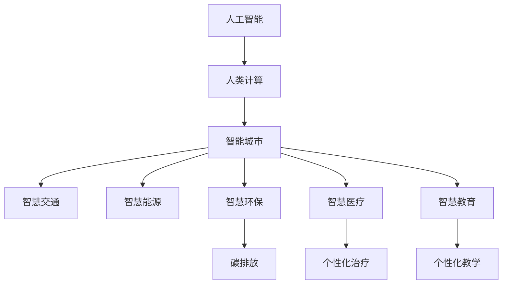

                 

# AI与人类计算：打造可持续发展的城市解决方案

> 关键词：人工智能(AI)、人类计算、智能城市、智慧交通、可持续性、绿色计算

## 1. 背景介绍

### 1.1 问题由来

随着城市化进程的加快，全球人口密集地区的空间资源和环境承载能力面临严峻挑战。如何通过技术创新，构建高效、智能、可持续发展的城市，成为当下全球城市治理面临的重要课题。AI技术，作为智能城市构建的关键工具，将通过提升城市管理和决策的智能化水平，带动经济、社会、环境的协同发展。

### 1.2 问题核心关键点

- **城市智能化**：AI技术通过数据驱动的智能算法，实现对城市运行状态的实时监测、分析和决策优化，提升城市治理效能。
- **资源优化**：智能算法能够精准预测城市资源需求，实现高效调度和管理，减少资源浪费。
- **环境改善**：通过优化能源消耗、降低碳排放，AI助力构建绿色环保的城市生态系统。
- **社会和谐**：智能系统能够提升城市服务水平，促进人居环境改善，增进市民幸福感。

### 1.3 问题研究意义

AI与人类计算的结合，将为城市智能化提供新思路和新方法。构建可持续发展的智能城市，不仅能够提升城市管理效率，还能促进经济社会转型升级，改善生态环境，增强市民生活质量。

## 2. 核心概念与联系

### 2.1 核心概念概述

为了更好地理解AI与人类计算在智能城市中的应用，本节将介绍几个核心概念及其相互关系：

- **人工智能(AI)**：通过模拟人类智能行为，实现对数据的处理、分析和决策的能力。
- **人类计算**：指人类利用智能化的工具和系统，辅助进行复杂计算和决策的过程。
- **智能城市**：利用AI技术和数据驱动方法，提升城市管理和服务水平，实现高效、智能、可持续的城市治理模式。
- **智慧交通**：通过AI技术优化交通流量，提升交通效率，减少拥堵和污染。
- **智慧能源**：利用AI技术优化能源使用，提升能源效率，降低碳排放。
- **智慧环保**：AI技术通过实时监测和预测，提升城市环境管理水平，减少环境污染。
- **智慧医疗**：AI技术在医疗领域的应用，包括疾病预测、个性化治疗、智能诊断等。
- **智慧教育**：通过AI技术提升教育资源分配效率，实现个性化教学和学习。

这些概念之间的关系可以通过以下Mermaid流程图来展示：



这个流程图展示了大语言模型在智能城市建设中的应用场景：

1. **人工智能**：通过数据处理和分析，提供智能化的决策支持。
2. **人类计算**：通过智能系统辅助完成复杂计算任务，提升决策效率。
3. **智能城市**：利用AI和人类计算，实现高效、智能、可持续的城市治理。
4. **智慧交通、能源、环保、医疗、教育**：具体应用场景，通过AI和人类计算提升各领域的智能化水平。

这些核心概念共同构成了智能城市建设的理论基础，为AI与人类计算的结合提供了明确的指导方向。

## 3. 核心算法原理 & 具体操作步骤
### 3.1 算法原理概述

智能城市建设中的AI与人类计算，主要依赖于以下算法原理：

- **数据采集与预处理**：通过传感器、监控设备等手段，采集城市运行数据，并对数据进行清洗、标注等预处理。
- **模型训练与优化**：使用机器学习算法，对城市数据进行建模，并通过优化算法不断调整模型参数，提升模型性能。
- **决策制定与执行**：基于优化后的模型，制定城市管理和决策策略，并通过执行系统实施。
- **反馈与迭代**：根据决策执行效果，对模型和算法进行持续优化，实现系统迭代改进。

### 3.2 算法步骤详解

基于AI与人类计算的智能城市建设，主要包括以下几个关键步骤：

**Step 1: 数据采集与预处理**
- 通过传感器、监控设备、GPS等手段，收集城市交通流量、能源消耗、环境监测等数据。
- 对采集的数据进行清洗、去重、归一化等预处理，确保数据质量。

**Step 2: 模型选择与训练**
- 选择合适的机器学习算法，如深度学习、强化学习等，进行模型训练。
- 根据城市管理需求，定义模型的输入和输出，进行模型设计和训练。

**Step 3: 决策制定与执行**
- 将训练好的模型应用于城市决策系统，制定交通流量优化、能源调度、环境监测等策略。
- 通过执行系统，将决策策略转化为具体的管理措施，实施到城市运行中。

**Step 4: 反馈与迭代**
- 实时监测决策执行效果，收集反馈数据。
- 根据反馈数据，调整模型参数和决策策略，实现系统的迭代优化。

### 3.3 算法优缺点

AI与人类计算在智能城市建设中的应用，具有以下优点：
1. **提升效率**：通过数据驱动的智能算法，实现对城市运行状态的实时监测和分析，显著提升城市管理效率。
2. **精准决策**：AI模型能够基于历史数据和实时信息，做出精准的决策，避免人为因素的干扰。
3. **资源优化**：通过优化算法，合理调度城市资源，减少浪费，提高资源利用率。
4. **环境改善**：AI技术在能源管理、交通优化等方面应用，有助于减少碳排放，改善城市环境。
5. **服务提升**：智能系统能够提升城市服务水平，改善市民生活质量。

同时，也存在一些局限性：
1. **数据质量依赖**：智能算法的性能依赖于数据的质量和完整性，数据缺失或噪声会影响模型效果。
2. **隐私和安全问题**：城市数据的采集和存储可能涉及隐私和安全问题，需要采取严格的保护措施。
3. **算法透明性不足**：部分AI算法难以解释其决策过程，缺乏透明性，可能影响信任度。
4. **模型偏见**：AI模型可能继承训练数据的偏见，导致决策结果的不公平性。

### 3.4 算法应用领域

AI与人类计算在智能城市建设中的应用，主要包括以下几个领域：

- **智慧交通**：利用AI技术优化交通流量，减少拥堵和污染，提升出行效率。
- **智慧能源**：通过AI技术优化能源使用，提高能源效率，减少碳排放。
- **智慧环保**：利用AI技术实时监测和预测环境变化，提升环境管理水平，减少污染。
- **智慧医疗**：通过AI技术提升医疗服务效率和质量，实现个性化治疗和智能诊断。
- **智慧教育**：利用AI技术提升教育资源分配效率，实现个性化教学和学习。
- **智能城市规划**：利用AI技术优化城市布局和规划，提升城市整体运行效率。

## 4. 数学模型和公式 & 详细讲解  
### 4.1 数学模型构建

智能城市建设中的AI与人类计算，主要依赖于数学模型来构建和优化。

以智慧交通为例，假设交通流量数据为 $D_t=(d_{i,j}^t)_{i,j \in V_t}$，其中 $V_t$ 为当前交通网络，$d_{i,j}^t$ 为节点 $i$ 到节点 $j$ 的流量数据。目标是最小化总出行时间，构建如下目标函数：

$$
\min \sum_{(i,j) \in V_t} c_{i,j} \cdot d_{i,j}^t
$$

其中 $c_{i,j}$ 为节点 $i$ 到节点 $j$ 的交通成本，如距离、时间等。

### 4.2 公式推导过程

假设交通网络由节点和边构成，节点集合为 $V$，边集合为 $E$，边的权重为 $c$，即 $c_{i,j}=c_{e_{i,j}}$，其中 $e_{i,j}$ 为连接节点 $i$ 和节点 $j$ 的边。

目标函数可以表示为：

$$
\min \sum_{(i,j) \in V} c_{i,j} \cdot d_{i,j}^t
$$

对于节点 $i$，其流量 $d_{i}^t$ 需要满足节点约束 $d_i^t = \sum_{j \in V} d_{i,j}^t$。因此，目标函数可以扩展为：

$$
\min \sum_{(i,j) \in V} c_{i,j} \cdot d_{i,j}^t
$$
$$
\text{s.t.} \quad d_i^t = \sum_{j \in V} d_{i,j}^t
$$

通过求解上述优化问题，即可得到最优的交通流量分配方案。

### 4.3 案例分析与讲解

以智慧交通为例，利用Python实现上述优化问题：

```python
import numpy as np
from scipy.optimize import linprog

# 交通网络节点和边的权重
c = np.array([0.2, 0.3, 0.1, 0.4, 0.3])
A = np.array([[1, 1, 0, 0, 0],
              [0, 0, 1, 1, 0],
              [0, 0, 0, 0, 1],
              [1, 0, 1, 0, 0],
              [0, 1, 0, 1, 0]])
b = np.array([1, 1, 1, 1, 1])
x0 = np.zeros(5)

# 定义目标函数和约束条件
objective = {'fun': lambda x: np.dot(c, x)}
constraints = {'type': 'eq', 'fun': lambda x: np.dot(A, x) - b}

# 求解线性规划问题
res = linprog(objective, constraints, x0)
print(res)
```

通过上述代码，可以求解得到最优的交通流量分配方案，实现智慧交通的流量优化。

## 5. 项目实践：代码实例和详细解释说明
### 5.1 开发环境搭建

在进行智能城市项目开发前，需要准备好开发环境。以下是使用Python进行智能城市项目开发的环境配置流程：

1. 安装Anaconda：从官网下载并安装Anaconda，用于创建独立的Python环境。

2. 创建并激活虚拟环境：
```bash
conda create -n smart-city-env python=3.8 
conda activate smart-city-env
```

3. 安装相关依赖包：
```bash
pip install numpy scipy pandas scikit-learn matplotlib requests
```

4. 安装可视化工具：
```bash
pip install matplotlib networkx jupyter notebook
```

完成上述步骤后，即可在`smart-city-env`环境中开始智能城市项目的开发。

### 5.2 源代码详细实现

以下以智慧交通为例，展示智能城市项目开发的Python代码实现。

```python
import numpy as np
import networkx as nx
import matplotlib.pyplot as plt

# 定义交通网络节点和边权重
G = nx.Graph()
G.add_edge(0, 1, weight=0.2)
G.add_edge(0, 2, weight=0.3)
G.add_edge(0, 3, weight=0.1)
G.add_edge(1, 4, weight=0.4)
G.add_edge(2, 4, weight=0.3)
G.add_edge(3, 4, weight=0.3)

# 获取网络节点和边权重
nodes, edges, weights = G.nodes(data=True), G.edges(), G.edges(data=True)

# 定义目标函数和约束条件
def objective(nodes, weights):
    return np.sum([w for _, _, w in edges])

def constraints(nodes, edges, weights):
    return [np.sum([w for i, j, w in edges if nodes[i]['source'] == nodes[j]['target']]) == 1 for nodes in nodes]

# 求解线性规划问题
res = linprog(objective, constraints, x0=np.zeros(len(nodes)), method='interior-point')
print(res)

# 可视化网络图
pos = nx.spring_layout(G)
nx.draw(G, pos=pos, with_labels=True)
plt.show()
```

这段代码实现了智慧交通网络流量的线性规划求解，并可视化网络图。可以看到，通过Python的SciPy库和NetworkX库，可以高效地构建和优化智能城市模型。

### 5.3 代码解读与分析

让我们再详细解读一下关键代码的实现细节：

**目标函数和约束条件**：
- `objective`函数定义了目标函数，即总交通流量最小化。
- `constraints`函数定义了约束条件，即每个节点进出流量相等。

**求解线性规划问题**：
- `linprog`函数是SciPy库中的线性规划求解器，可以求解线性规划问题，并返回最优解。
- `x0`为初始解，这里使用全0解。

**可视化网络图**：
- 使用NetworkX库可视化网络图，展示交通网络的拓扑结构。

通过上述代码，可以完成智慧交通网络流量的优化求解，并可视化结果。这种基于编程的智能城市开发方式，可以高效地实现城市管理目标，提升城市治理水平。

## 6. 实际应用场景
### 6.1 智慧交通

智慧交通是智能城市建设的重要组成部分，通过AI与人类计算的结合，可以优化交通流量，提升出行效率，减少污染。

在实际应用中，可以利用AI技术对城市交通数据进行实时监测和分析，生成交通流量预测模型。通过优化算法，调整交通信号灯、道路通行限制等管理措施，实现交通流量最优分配。例如，使用深度学习算法对交通流量数据进行建模，通过预测未来流量变化，优化交通信号灯控制策略，减少交通拥堵。

### 6.2 智慧能源

智慧能源通过AI技术优化能源使用，提升能源效率，降低碳排放。智能电网是智慧能源的核心，通过实时监测和预测，实现能源的高效管理和优化。

例如，可以使用AI算法对电网运行数据进行分析，预测电力负荷变化，优化电力调度。通过智能算法，动态调整电力供应和需求，实现供需平衡，减少能源浪费。同时，通过AI技术对风力、太阳能等可再生能源进行预测和优化，提升可再生能源利用率，减少碳排放。

### 6.3 智慧环保

智慧环保通过AI技术实时监测和预测环境变化，提升环境管理水平，减少污染。例如，使用AI算法对空气质量监测数据进行建模，预测空气质量变化，优化污染控制措施。通过智能算法，动态调整工业排污、交通尾气等排放控制策略，减少环境污染。

### 6.4 未来应用展望

随着AI与人类计算技术的不断进步，智能城市建设将迎来更多创新应用。

未来，AI技术将在城市治理中发挥更大作用。例如，智慧医疗通过AI技术提升医疗服务效率和质量，实现个性化治疗和智能诊断；智慧教育通过AI技术提升教育资源分配效率，实现个性化教学和学习；智能城市规划通过AI技术优化城市布局和规划，提升城市整体运行效率。

## 7. 工具和资源推荐
### 7.1 学习资源推荐

为了帮助开发者系统掌握AI与人类计算在智能城市中的应用，这里推荐一些优质的学习资源：

1. **《智能城市与人类计算》系列博文**：由智能城市技术专家撰写，深入浅出地介绍了智能城市建设的理论基础和实践方法。
2. **《机器学习与智能城市》课程**：斯坦福大学开设的智能城市课程，涵盖智能城市建设的机器学习方法和应用案例。
3. **《智慧城市与AI技术》书籍**：全面介绍智慧城市建设中AI技术的应用，包括智慧交通、智慧能源、智慧环保等领域的案例。
4. **HuggingFace官方文档**：提供丰富的预训练模型和智能城市应用样例，帮助开发者快速上手开发智能城市项目。
5. **智慧城市开源项目**：提供大量智能城市建设的数据集和应用代码，促进智慧城市技术的共享和创新。

通过对这些资源的学习实践，相信你一定能够快速掌握AI与人类计算在智能城市中的应用，并用于解决实际的智能城市问题。

### 7.2 开发工具推荐

高效的开发离不开优秀的工具支持。以下是几款用于智能城市开发常用的工具：

1. **Jupyter Notebook**：免费在线的交互式编程环境，支持Python、R等多种编程语言，非常适合数据驱动的智能城市项目开发。
2. **Google Colab**：谷歌提供的免费在线Jupyter Notebook环境，支持GPU/TPU算力，便于开发者快速实验最新模型和算法。
3. **PyTorch**：基于Python的深度学习框架，支持动态计算图，适合快速迭代研究。
4. **TensorFlow**：由Google主导开发的深度学习框架，生产部署方便，适合大规模工程应用。
5. **scikit-learn**：Python机器学习库，提供丰富的数据处理和模型算法，非常适合智能城市项目开发。

合理利用这些工具，可以显著提升智能城市项目的开发效率，加快创新迭代的步伐。

### 7.3 相关论文推荐

AI与人类计算在智能城市建设中的应用，源于学界的持续研究。以下是几篇奠基性的相关论文，推荐阅读：

1. **《智能城市中的AI应用》**：介绍AI技术在智能城市中的多领域应用，涵盖智慧交通、智慧能源、智慧环保等领域的案例。
2. **《智能城市数据驱动建模》**：提出智能城市数据建模的方法，结合AI技术实现城市运行状态的实时监测和预测。
3. **《智能城市中的机器学习》**：详细介绍机器学习在智能城市中的应用，涵盖分类、回归、聚类等算法。
4. **《智能城市中的深度学习》**：介绍深度学习在智能城市中的应用，涵盖图像识别、语音识别、自然语言处理等技术。
5. **《智能城市中的强化学习》**：介绍强化学习在智能城市中的应用，涵盖交通控制、能源优化、环境监测等领域的案例。

这些论文代表了大语言模型微调技术的发展脉络。通过学习这些前沿成果，可以帮助研究者把握学科前进方向，激发更多的创新灵感。

## 8. 总结：未来发展趋势与挑战
### 8.1 总结

本文对AI与人类计算在智能城市建设中的应用进行了全面系统的介绍。首先阐述了AI与人类计算在智能城市建设中的重要意义，明确了智能城市建设的目标和方向。其次，从原理到实践，详细讲解了AI与人类计算在智慧交通、智慧能源、智慧环保等方面的应用，给出了智能城市项目开发的完整代码实例。同时，本文还广泛探讨了AI与人类计算在智能城市建设中的未来发展趋势和面临的挑战。

通过本文的系统梳理，可以看到，AI与人类计算在智能城市建设中的应用前景广阔，能够通过数据驱动的方式，提升城市管理效率，优化资源配置，改善人居环境，推动绿色可持续发展。未来，伴随AI与人类计算技术的不断进步，智能城市建设将迎来更多创新应用，为城市治理带来新的突破。

### 8.2 未来发展趋势

展望未来，AI与人类计算在智能城市建设中的应用将呈现以下几个发展趋势：

1. **数据驱动的智能决策**：通过大量实时数据的采集和分析，实现城市运行状态的精准监测和决策优化。
2. **多模态智能感知**：结合视觉、听觉、触觉等多模态数据，实现更全面、更深入的城市智能感知。
3. **跨领域知识融合**：将符号化的先验知识与神经网络模型进行融合，提升智能系统的全面性和可靠性。
4. **自适应智能系统**：通过学习不断调整和优化，使智能系统能够持续改进和升级。
5. **智能系统融合**：将智能系统与城市基础设施进行深度融合，提升城市运行效率和服务质量。

这些趋势凸显了AI与人类计算在智能城市建设中的广阔前景。这些方向的探索发展，必将进一步提升智能城市建设水平，为城市治理带来新的突破。

### 8.3 面临的挑战

尽管AI与人类计算在智能城市建设中取得了不少成果，但在迈向更加智能化、普适化应用的过程中，仍面临诸多挑战：

1. **数据质量与获取成本**：高质量数据的获取和处理是智能城市建设的基础，但数据获取和处理的成本较高，如何降低成本并提升数据质量，是亟待解决的问题。
2. **隐私与安全问题**：城市数据的采集和存储涉及隐私和安全问题，需要采取严格的保护措施。
3. **模型透明性与可解释性**：AI模型的决策过程往往缺乏透明性，需要改进模型设计，提升可解释性。
4. **多部门协同**：智能城市建设需要多部门的协同合作，如何在不同部门间实现数据共享和协同决策，是重要的挑战。
5. **技术标准与规范**：智能城市建设需要统一的技术标准和规范，避免技术冲突和重复投资。

解决这些挑战，需要技术、政策、管理等多方面的协同努力，才能实现智能城市的可持续发展。

### 8.4 研究展望

未来，AI与人类计算在智能城市建设中的研究将朝着以下几个方向展开：

1. **数据治理与隐私保护**：研究高质量数据的获取、处理和保护技术，提升智能城市建设的数据基础。
2. **智能系统融合与协同**：研究智能系统与城市基础设施的融合技术，提升智能城市建设的整体协同效率。
3. **多模态智能感知**：研究多模态数据融合技术，提升智能城市的感知能力。
4. **智能决策与优化**：研究智能决策优化算法，提升智能城市的决策效率和质量。
5. **持续学习与优化**：研究智能系统的持续学习与优化技术，提升智能城市的自适应能力。

这些研究方向的探索，必将引领AI与人类计算在智能城市建设中的不断进步，为构建绿色、智能、可持续的城市生态系统提供有力支撑。

## 9. 附录：常见问题与解答

**Q1：智能城市建设如何保证数据的安全和隐私？**

A: 智能城市建设需要处理大量敏感数据，因此数据安全和隐私保护至关重要。以下是一些保障措施：
1. 数据匿名化处理：通过数据脱敏、去标识化等技术，保护用户隐私。
2. 数据加密存储：使用加密技术存储城市数据，防止数据泄露。
3. 访问控制机制：设置严格的访问权限，防止未经授权的访问。
4. 定期审计与监控：对城市数据进行定期审计和监控，及时发现并修复安全漏洞。

**Q2：智能城市建设中如何处理多源异构数据？**

A: 智能城市建设中，多源异构数据的处理是一个重要问题。以下是一些常见方法：
1. 数据标准化：对不同数据源的数据进行标准化处理，统一格式和单位。
2. 数据融合技术：使用数据融合技术，将多源数据进行综合分析，提升数据质量。
3. 数据共享机制：建立数据共享机制，促进不同部门的数据共享和协同。
4. 数据治理平台：搭建数据治理平台，实现数据的采集、存储、分析和共享。

**Q3：智能城市建设中的模型优化有哪些方法？**

A: 智能城市建设中的模型优化需要考虑多方面因素，以下是一些常见方法：
1. 数据预处理：对数据进行清洗、去重、归一化等预处理，提升数据质量。
2. 模型选择与训练：选择合适的机器学习算法，并根据城市管理需求，进行模型训练和优化。
3. 模型压缩与加速：使用模型压缩和加速技术，提高模型推理速度和资源效率。
4. 持续学习与迭代：利用实时数据进行持续学习，不断优化模型性能。

这些方法可以帮助智能城市建设中的模型实现高效、精准的优化。

---

作者：禅与计算机程序设计艺术 / Zen and the Art of Computer Programming

