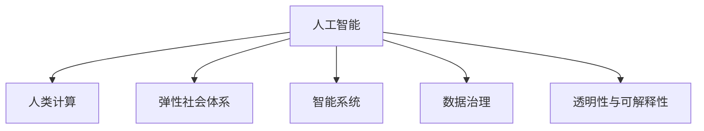

                 

# AI与人类计算：打造弹性社会体系

在数字化时代，人工智能(AI)技术正以前所未有的速度重塑社会的各个方面。从智能制造到智慧医疗，从金融科技到教育领域，AI的应用范围不断扩展，推动了效率提升、资源优化和创新变革。然而，AI的发展也引发了一系列伦理、安全、隐私等问题，对社会治理提出了新的挑战。本文将从AI与人类计算的角度出发，探讨如何通过AI技术构建一个更弹性、更智能、更安全的社会体系。

## 1. 背景介绍

### 1.1 问题由来

近年来，随着计算资源和算法的快速发展，AI技术在各个领域取得了显著进展。人工智能技术的广泛应用，为人类社会带来了前所未有的效率提升和创新潜力。然而，与此同时，AI也引发了新的挑战。例如，自动化可能导致失业率的上升，数据隐私和安全问题日益突出，AI决策的透明性和可解释性不足等。这些问题要求我们在享受AI带来的便利的同时，必须认真思考如何构建一个更加弹性、可持续发展的社会体系。

### 1.2 问题核心关键点

当前，AI技术在社会中的应用面临着诸多挑战，但同时也提供了新的解决方案。以下是需要重点关注的几个核心关键点：

1. **数据隐私与安全**：AI系统往往依赖大量数据进行训练和推理，如何保护用户隐私，防止数据泄露，是AI应用中必须解决的问题。
2. **模型透明性与可解释性**：AI模型往往是黑箱，难以解释其决策过程。如何在保证模型性能的同时，提高其透明性和可解释性，是AI应用中的重要挑战。
3. **公平性与伦理**：AI系统的决策可能会因数据偏差、算法设计等原因导致不公平或有害的结果。如何确保AI系统的公平性和道德性，是AI应用中的关键问题。
4. **协作与治理**：AI技术的应用离不开人与机器的协作，如何构建有效的治理机制，确保AI系统为人类服务，而不是反客为主，是AI应用中的核心议题。

这些问题需要通过AI与人类计算的结合，在技术、制度、伦理等多个层面上进行全面优化，才能构建一个健康、可持续发展的AI生态系统。

## 2. 核心概念与联系

### 2.1 核心概念概述

为更好地理解AI与人类计算的结合，本节将介绍几个密切相关的核心概念：

1. **人工智能(AI)**：指通过算法和计算资源，使机器能够执行类似于人类的智能任务，如视觉识别、语言理解、决策制定等。
2. **人类计算**：指人类与AI系统的协作，利用人类的判断、推理和经验，辅助机器进行更智能的决策。
3. **弹性社会体系**：指通过AI技术实现资源优化、风险控制、智能决策等，使社会更具弹性、可持续发展的体系。
4. **智能系统**：指结合AI技术和人类计算，能够自主学习、自主决策、自主适应的系统。
5. **数据治理**：指对数据进行收集、存储、处理和利用的规范和标准，确保数据隐私和安全。
6. **透明性与可解释性**：指AI系统决策过程的透明性，以及结果的可解释性，帮助用户理解和信任AI系统。

这些核心概念之间的逻辑关系可以通过以下Mermaid流程图来展示：



这个流程图展示了大语言模型的工作原理和优化方向：

1. 人工智能通过算法和计算资源，实现各种智能任务。
2. 人类计算利用人类的判断和经验，辅助机器进行更智能的决策。
3. 弹性社会体系通过AI技术实现资源优化和风险控制，提高社会的可持续发展能力。
4. 智能系统结合AI技术和人类计算，实现自主学习、决策和适应。
5. 数据治理确保数据隐私和安全，是AI应用的前提。
6. 透明性与可解释性提升AI系统的可信度，确保用户信任和接受。

这些概念共同构成了AI与人类计算的结合框架，为构建弹性社会体系提供了理论基础。

## 3. 核心算法原理 & 具体操作步骤

### 3.1 算法原理概述

AI与人类计算的结合，本质上是一种协同优化的过程。其核心思想是：利用AI的高效计算能力和广泛知识，结合人类专家的判断和经验，实现更智能、更准确、更灵活的决策。

形式化地，设AI系统为 $A$，人类专家为 $H$，任务为 $T$，决策结果为 $D$。AI与人类计算的协同优化目标是最小化决策误差：

$$
\min_{A,H} \mathcal{E}(D, T)
$$

其中 $\mathcal{E}$ 为决策误差函数，用于衡量AI和人类专家的决策结果与任务目标之间的差异。

在实际操作中，这一过程通常包括以下几个关键步骤：

1. 数据收集与预处理：收集与任务相关的数据，并进行清洗、标注和预处理。
2. 模型训练与优化：利用AI技术对模型进行训练，优化其决策能力。
3. 协同决策与反馈：AI与人类专家进行协同决策，并通过反馈机制不断优化模型。
4. 结果评估与迭代：对决策结果进行评估，确定优化方向，进行迭代优化。

### 3.2 算法步骤详解

以下是一个具体的协同优化案例：

**案例1：智能交通系统**

在智能交通系统中，AI与人类计算的结合主要体现在以下几个方面：

1. **数据收集**：通过传感器、摄像头等设备，收集交通流量、车流状态、交通事故等数据。
2. **模型训练**：利用AI技术，训练交通流量预测模型和交通信号控制模型。
3. **协同决策**：人类交通专家对AI预测结果进行审核和调整，确保决策的合理性和安全性。
4. **反馈机制**：通过反馈机制，不断优化AI模型和人类专家的决策过程，提升系统的性能。

### 3.3 算法优缺点

AI与人类计算结合的协同优化方法具有以下优点：

1. **高效性**：利用AI的高效计算能力，快速处理大量数据，提升决策速度。
2. **准确性**：通过AI模型的预测和人类专家的审核，提高决策的准确性和可靠性。
3. **灵活性**：结合AI和人类专家的智慧，适应不同场景和需求，灵活调整决策策略。
4. **可解释性**：人类专家的参与增加了决策过程的透明性和可解释性，提高了用户信任度。

同时，这种协同优化方法也存在一定的局限性：

1. **数据质量依赖**：AI模型的性能依赖于数据质量，如果数据存在偏差或噪声，模型决策可能出现错误。
2. **人类专家的依赖性**：人类专家的决策水平直接影响系统的性能，依赖性较强。
3. **资源消耗大**：协同优化需要更多的资源和时间，可能会增加系统的开发和运行成本。
4. **复杂性高**：协同优化过程较为复杂，需要系统化的设计和优化，增加了实现的难度。

### 3.4 算法应用领域

AI与人类计算的结合方法在多个领域都有广泛应用，如：

1. **智能制造**：利用AI进行生产过程的优化和预测，结合人类专家的经验进行品质控制和决策。
2. **智慧医疗**：AI进行疾病诊断和治疗方案推荐，结合医生经验进行诊断和决策。
3. **金融科技**：AI进行风险评估和投资预测，结合专家意见进行决策和风险控制。
4. **智慧城市**：AI进行交通管理和公共安全监控，结合城市管理专家的经验进行决策和优化。

除了上述这些领域，AI与人类计算的结合还可以应用于更多场景，如能源管理、环境保护、灾害预警等，为社会治理和可持续发展提供技术支撑。

## 4. 数学模型和公式 & 详细讲解 & 举例说明

### 4.1 数学模型构建

本节将使用数学语言对AI与人类计算的结合过程进行严格刻画。

设任务 $T$ 的输入为 $X$，输出为 $Y$，AI模型的预测结果为 $\hat{Y}$，人类专家的判断结果为 $H(Y)$。协同优化模型的目标是最小化预测误差和人类判断误差：

$$
\min_{\theta} \mathcal{E}(X, Y, \hat{Y}, H(Y))
$$

其中 $\theta$ 为AI模型的参数，$\mathcal{E}$ 为误差函数，用于衡量预测结果与任务目标之间的差异。

### 4.2 公式推导过程

以下我们以智能交通系统为例，推导协同优化的数学模型：

**假设1：** 交通流量 $X$ 和交通事故 $Y$ 之间存在线性关系：

$$
Y = \alpha + \beta X + \epsilon
$$

其中 $\alpha, \beta, \epsilon$ 为模型参数。

**假设2：** AI模型 $\hat{Y} = \hat{f}(X; \theta)$，其中 $\theta$ 为模型参数，$f$ 为模型函数。

**假设3：** 人类专家的判断结果 $H(Y)$ 为 $\beta$ 的线性函数：

$$
H(Y) = \delta + \gamma Y + \eta
$$

其中 $\delta, \gamma, \eta$ 为专家判断参数。

**协同优化目标**：最小化预测误差和专家判断误差：

$$
\min_{\theta} \mathcal{E}(\hat{Y}, H(Y)) = \min_{\theta} \frac{1}{N}\sum_{i=1}^N (\hat{Y}_i - H(Y_i))^2
$$

其中 $N$ 为数据集大小，$Y_i$ 为第 $i$ 个样本的真实交通流量。

### 4.3 案例分析与讲解

**案例2：医疗影像诊断**

在医疗影像诊断中，AI与人类计算的结合主要体现在以下几个方面：

1. **数据收集**：收集大量医疗影像数据，并进行标注和预处理。
2. **模型训练**：利用AI技术，训练影像分类和诊断模型。
3. **协同决策**：医学专家对AI预测结果进行审核和调整，确保诊断的准确性和安全性。
4. **反馈机制**：通过反馈机制，不断优化AI模型和医学专家的诊断过程，提升系统的性能。

## 5. 项目实践：代码实例和详细解释说明

### 5.1 开发环境搭建

在进行协同优化实践前，我们需要准备好开发环境。以下是使用Python进行PyTorch开发的环境配置流程：

1. 安装Anaconda：从官网下载并安装Anaconda，用于创建独立的Python环境。

2. 创建并激活虚拟环境：
```bash
conda create -n pytorch-env python=3.8 
conda activate pytorch-env
```

3. 安装PyTorch：根据CUDA版本，从官网获取对应的安装命令。例如：
```bash
conda install pytorch torchvision torchaudio cudatoolkit=11.1 -c pytorch -c conda-forge
```

4. 安装相关库：
```bash
pip install numpy pandas scikit-learn torch
```

完成上述步骤后，即可在`pytorch-env`环境中开始协同优化实践。

### 5.2 源代码详细实现

下面以智能交通系统的协同优化为例，给出使用PyTorch实现的代码：

```python
import torch
import torch.nn as nn
import torch.optim as optim

# 定义模型
class Model(nn.Module):
    def __init__(self):
        super(Model, self).__init__()
        self.fc1 = nn.Linear(1, 1)
    
    def forward(self, x):
        return self.fc1(x)

# 定义专家判断函数
def expert_judgment(y_hat):
    return 0.5 * y_hat

# 定义误差函数
def error_function(y_hat, y, H_y):
    return (y_hat - H_y)**2

# 定义优化器
optimizer = optim.SGD(model.parameters(), lr=0.01)

# 训练过程
for epoch in range(100):
    # 前向传播
    y_hat = model(X)
    H_y = expert_judgment(y_hat)
    loss = error_function(y_hat, y, H_y)
    
    # 反向传播和参数更新
    optimizer.zero_grad()
    loss.backward()
    optimizer.step()
```

### 5.3 代码解读与分析

让我们再详细解读一下关键代码的实现细节：

**Model类**：
- 定义了一个简单的线性模型，用于预测交通流量。

**expert_judgment函数**：
- 定义了专家判断函数，将AI模型的预测结果进行线性调整。

**error_function函数**：
- 定义了误差函数，计算预测结果和专家判断结果之间的误差。

**优化器定义**：
- 使用了随机梯度下降优化器，对模型参数进行更新。

**训练过程**：
- 在每个epoch内，先进行前向传播，计算损失函数，再通过反向传播更新模型参数。

以上代码实现了一个简单的协同优化过程，展示了AI与人类计算如何结合，通过协同决策和反馈机制优化模型性能。

## 6. 实际应用场景

### 6.1 智能交通系统

智能交通系统是AI与人类计算结合的一个典型应用，其核心在于通过AI技术实现交通流量预测和交通信号控制，结合人类专家的经验进行决策和优化，提升交通管理的智能化水平。

### 6.2 医疗影像诊断

医疗影像诊断也是AI与人类计算结合的重要应用领域。AI技术在影像分类、疾病诊断等方面表现出色，但最终决策仍需依赖医学专家的审核和调整，确保诊断的准确性和安全性。

### 6.3 金融风险评估

金融风险评估需要AI技术进行数据处理和模型训练，但最终的决策仍需结合金融专家的经验进行审核和调整，确保风险评估的合理性和可靠性。

### 6.4 未来应用展望

随着AI技术的发展，AI与人类计算的结合将在更多领域得到应用，为社会治理和可持续发展提供技术支撑。

在智慧医疗领域，AI与人类计算的结合将推动医疗服务的智能化，提升诊疗效率和准确性。

在智慧城市治理中，AI与人类计算的结合将实现交通、能源、环境等多领域的协同管理，提高城市的智能化和可持续性。

在智能制造和工业生产中，AI与人类计算的结合将提升生产效率和产品质量，推动工业4.0的进程。

未来，AI与人类计算的结合将成为各行各业智能化转型的重要手段，推动人类社会迈向更加弹性、可持续发展的方向。

## 7. 工具和资源推荐

### 7.1 学习资源推荐

为了帮助开发者系统掌握AI与人类计算的理论基础和实践技巧，这里推荐一些优质的学习资源：

1. 《人工智能基础》系列课程：由顶级专家授课，涵盖AI技术的基本概念、算法和应用，适合入门学习。
2. 《深度学习》系列书籍：详细介绍了深度学习的基本原理和实践技巧，适合深入学习。
3. 《AI与人类计算》研究论文：涵盖了AI与人类计算结合的最新研究成果，适合研究人员阅读。
4. Weights & Biases平台：提供模型训练的实验跟踪和可视化工具，方便进行实验和对比。
5. TensorBoard：提供模型训练的可视化工具，方便监测和调试模型。

通过对这些资源的学习实践，相信你一定能够快速掌握AI与人类计算的精髓，并用于解决实际的AI应用问题。

### 7.2 开发工具推荐

高效的开发离不开优秀的工具支持。以下是几款用于AI与人类计算结合开发的常用工具：

1. PyTorch：基于Python的开源深度学习框架，灵活动态的计算图，适合快速迭代研究。
2. TensorFlow：由Google主导开发的开源深度学习框架，生产部署方便，适合大规模工程应用。
3. Weights & Biases：模型训练的实验跟踪工具，可以记录和可视化模型训练过程中的各项指标，方便对比和调优。
4. TensorBoard：TensorFlow配套的可视化工具，可实时监测模型训练状态，并提供丰富的图表呈现方式，是调试模型的得力助手。

合理利用这些工具，可以显著提升AI与人类计算结合任务的开发效率，加快创新迭代的步伐。

### 7.3 相关论文推荐

AI与人类计算的发展源于学界的持续研究。以下是几篇奠基性的相关论文，推荐阅读：

1. "Human-in-the-Loop Machine Learning: A Review" by Zhu, Haifeng, et al.：详细回顾了人机协作学习的方法，为AI与人类计算的结合提供了理论基础。
2. "Human and Machine Collaboration: A Survey" by Sheng, Xiaoyan, et al.：涵盖了人机协作的多个方面，包括协同决策、反馈机制、系统设计等。
3. "Human-Computer Collaboration in AI Systems" by Webster, Richard, et al.：探讨了人机协作在AI系统中的重要性，以及如何构建高效的人机协作系统。

这些论文代表了大语言模型微调技术的发展脉络。通过学习这些前沿成果，可以帮助研究者把握学科前进方向，激发更多的创新灵感。

## 8. 总结：未来发展趋势与挑战

### 8.1 研究成果总结

本文对AI与人类计算的结合进行了全面系统的介绍。首先阐述了AI与人类计算的研究背景和意义，明确了在技术、制度、伦理等多个层面构建弹性社会体系的重要性。其次，从原理到实践，详细讲解了协同优化的数学原理和关键步骤，给出了协同优化任务开发的完整代码实例。同时，本文还探讨了AI与人类计算结合在智能交通、医疗诊断、金融风险评估等多个领域的应用前景，展示了其在社会治理和可持续发展中的巨大潜力。此外，本文精选了AI与人类计算结合的各类学习资源，力求为读者提供全方位的技术指引。

通过本文的系统梳理，可以看到，AI与人类计算的结合正在成为AI技术应用的重要范式，极大地拓展了AI系统的应用边界，提升了社会治理的智能化水平。未来，伴随AI技术的持续演进和优化，AI与人类计算的结合将更加高效、灵活，为构建弹性社会体系提供更坚实的技术支撑。

### 8.2 未来发展趋势

展望未来，AI与人类计算的结合技术将呈现以下几个发展趋势：

1. **多模态协同**：未来的AI系统将结合视觉、语音、文本等多模态数据，实现更全面、更精准的决策。
2. **知识驱动**：未来的AI系统将更紧密地结合知识库、规则库等专家知识，提高决策的可靠性和合理性。
3. **自适应学习**：未来的AI系统将具备更强的自适应学习能力，能够不断学习新知识，提升决策的灵活性和可持续性。
4. **协同优化**：未来的AI系统将实现更高效的协同优化，结合AI和人类专家的智慧，提升系统的性能和可靠性。
5. **伦理与治理**：未来的AI系统将更加注重伦理和治理，确保其决策过程透明、可信、可解释。

以上趋势凸显了AI与人类计算结合技术的广阔前景。这些方向的探索发展，必将进一步提升AI系统的性能和应用范围，为构建弹性社会体系提供更坚实的技术保障。

### 8.3 面临的挑战

尽管AI与人类计算的结合技术已经取得了显著进展，但在迈向更加智能化、普适化应用的过程中，它仍面临着诸多挑战：

1. **数据隐私与安全**：在AI系统中，数据隐私和安全问题依然严峻，如何保护用户数据，防止数据泄露，是AI应用中的核心问题。
2. **公平性与伦理**：AI系统的决策可能会因数据偏差、算法设计等原因导致不公平或有害的结果，如何确保AI系统的公平性和道德性，是AI应用中的关键挑战。
3. **模型透明性与可解释性**：AI模型往往是黑箱，难以解释其决策过程，如何提高模型透明性和可解释性，是AI应用中的重要课题。
4. **资源消耗大**：AI系统的开发和运行需要大量计算资源，如何优化资源消耗，提高系统效率，是AI应用中的现实问题。

这些挑战需要跨学科的协同努力，从技术、制度、伦理等多个层面进行综合解决。只有全面应对这些挑战，才能确保AI系统的健康发展，构建弹性社会体系。

### 8.4 研究展望

面向未来，AI与人类计算的结合技术需要在以下几个方向进行深入研究：

1. **数据隐私与安全**：开发更安全的数据存储和传输技术，保护用户隐私，防止数据泄露。
2. **公平性与伦理**：研究公平性、透明性和可解释性算法，确保AI系统的公平性和道德性。
3. **资源消耗优化**：研究高效的模型压缩和优化技术，减少资源消耗，提高系统效率。
4. **协同优化机制**：研究更高效的协同优化机制，提升AI系统与人类专家的协作效率。
5. **伦理与治理**：构建AI系统的伦理和治理机制，确保其决策过程透明、可信、可解释。

这些研究方向将推动AI与人类计算结合技术的不断进步，为构建弹性社会体系提供坚实的技术支撑。

## 9. 附录：常见问题与解答

**Q1：AI与人类计算结合是否适用于所有AI应用场景？**

A: AI与人类计算结合方法适用于大多数AI应用场景，尤其是在数据质量不足、决策过程复杂或涉及高风险应用的情况下，结合人类专家的智慧可以显著提升AI系统的性能和可靠性。但在某些标准化程度高、数据质量好的场景，如自动驾驶、图像识别等，AI系统可以独立完成任务，无需过多依赖人类专家的判断。

**Q2：如何选择合适的专家进行协同决策？**

A: 选择合适的专家是协同优化的关键。通常情况下，需要考虑专家的专业背景、经验水平、决策能力等因素。可以通过专家库、专家评价系统等方式，对专家进行评估和选择。在实际应用中，还可以引入专家推荐系统，通过数据分析和机器学习技术，自动推荐最合适的专家进行协同决策。

**Q3：AI与人类计算结合的资源消耗是否过大？**

A: 资源消耗是AI与人类计算结合的主要挑战之一。在实际应用中，需要根据具体任务和需求，合理设计和优化AI系统，采用模型压缩、混合精度训练等技术，减少资源消耗。同时，可以利用分布式计算和云计算等手段，提高系统的可扩展性和资源利用率。

**Q4：AI与人类计算结合的透明性与可解释性如何保证？**

A: 透明性和可解释性是AI系统可靠性的重要保障。在实际应用中，需要设计透明和可解释的模型架构和算法，确保用户可以理解和信任AI系统的决策过程。可以通过引入可视化工具、模型解释技术等方式，增强系统的透明性和可解释性。同时，人类专家的参与也可以提供更多的解释和背景信息，提升系统的可信度。

**Q5：AI与人类计算结合的伦理和治理如何保障？**

A: 伦理和治理是AI系统健康发展的关键。在实际应用中，需要制定和遵守相关的伦理规范和治理标准，确保AI系统的决策过程透明、可信、可解释。可以通过设立伦理委员会、制定伦理规范、引入用户反馈机制等方式，保障AI系统的伦理和安全。同时，还可以采用数据脱敏、访问鉴权等技术，保护用户隐私和数据安全。

通过对这些问题的解答，相信你能够更全面地理解AI与人类计算的结合技术，并应用于实际的AI系统开发和优化中。总之，AI与人类计算的结合技术需要跨学科的协同努力，从技术、制度、伦理等多个层面进行全面优化，方能构建弹性社会体系，实现AI技术在社会治理中的最大潜力。

