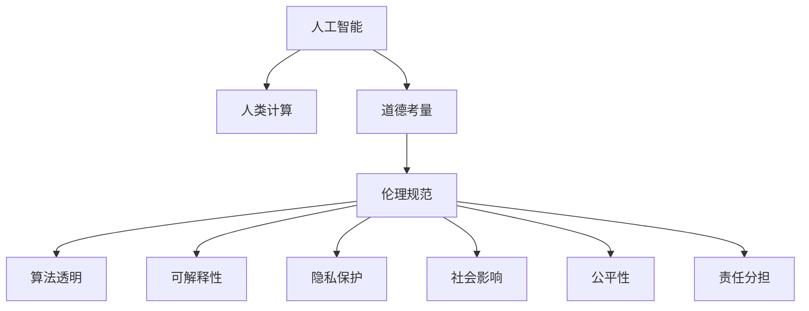

                 

# AI与人类计算：道德和伦理考虑

> 关键词：人工智能,人类计算,道德考量,伦理规范,算法透明,可解释性,隐私保护,社会影响,公平性,责任分担

## 1. 背景介绍

随着人工智能(AI)技术的不断进步，AI正在以前所未有的速度改变各行各业，从医疗、金融到教育、交通，无不受到AI的影响。与此同时，AI在带来便利和效率的同时，也引发了一系列道德和伦理问题，这些问题在AI计算的过程中尤为凸显。本文将深入探讨AI与人类计算的道德和伦理考量，从AI的透明度、可解释性、隐私保护、社会影响以及公平性等角度出发，分析当前AI计算面临的挑战，并提出解决方案，以期构建更加透明、负责任的AI系统。

## 2. 核心概念与联系

### 2.1 核心概念概述

为了更好地理解AI计算的道德和伦理考量，本节将介绍几个核心概念：

- **人工智能(AI)**：以机器学习、深度学习等为代表的技术，旨在模拟人类智能行为，实现自动化决策、模式识别、自然语言处理等任务。
- **人类计算(Human Computation)**：人类在AI系统中扮演的角色，包括数据标注、规则制定、决策监督等，是AI与人类互动的重要组成部分。
- **道德考量(Ethical Considerations)**：在AI计算过程中，如何保证决策的公正、合理性，避免对个人或社会造成伤害。
- **伦理规范(Ethical Standards)**：一套指导AI系统设计、开发和使用的道德准则，如透明度、可解释性、隐私保护等。
- **算法透明(Algorithm Transparency)**：AI系统在决策过程中，保证其内部逻辑和参数的公开透明。
- **可解释性(Explainability)**：AI系统对其决策结果的解释能力，使人类能够理解模型的工作机制和依据。
- **隐私保护(Privacy Protection)**：在AI系统中保护用户数据的安全性和隐私性，防止数据泄露和滥用。
- **社会影响(Social Impact)**：AI系统对社会经济、就业、教育等方面的影响，包括正面的促进作用和潜在的负面影响。
- **公平性(Fairness)**：AI系统在处理数据、做出决策时不偏不倚，避免对某些群体产生歧视。
- **责任分担(Shared Responsibility)**：在AI系统中，如何界定开发者、用户和监管机构之间的责任和义务。

这些核心概念之间的关系可以通过以下Mermaid流程图来展示：



这个流程图展示了大语言模型的核心概念及其之间的关系：

1. 人工智能通过人类计算获得数据和指导。
2. 道德考量和伦理规范是AI计算的指导原则。
3. 算法透明和可解释性是保证AI决策可信的基础。
4. 隐私保护和社会影响是AI系统必须考量的实际问题。
5. 公平性和责任分担是构建公正AI系统的关键。

这些概念共同构成了AI计算的伦理框架，指导AI系统的设计、开发和应用，确保其在促进人类福祉的同时，避免潜在风险。

## 3. 核心算法原理 & 具体操作步骤
### 3.1 算法原理概述

AI与人类计算的道德和伦理考量主要体现在以下几个方面：

- **透明度**：AI系统的内部工作机制是否公开透明，人类是否能够理解其决策逻辑。
- **可解释性**：AI系统在做出决策时，是否能够提供合理、明确的解释，使人信服。
- **隐私保护**：在收集、处理和存储数据时，如何保证用户隐私不受侵犯。
- **社会影响**：AI系统是否带来公平、公正的社会效益，避免对特定群体或社会造成不利影响。
- **公平性**：AI系统在处理数据、做出决策时，是否对所有群体一视同仁，避免歧视。

这些考量在AI计算过程中相互交织，共同影响着AI系统的设计和应用。

### 3.2 算法步骤详解

基于以上核心考量，AI与人类计算的道德和伦理问题通常包括以下几个关键步骤：

1. **数据准备**：收集和标注高质量的数据，保证数据的多样性和代表性。
2. **模型训练**：在标注数据上进行模型训练，同时设置严格的道德和伦理规范，避免偏见和歧视。
3. **评估测试**：对训练好的模型进行评估和测试，确保其性能符合道德和伦理标准。
4. **部署应用**：在实际应用中监测模型的表现，及时调整和优化。
5. **用户反馈**：收集用户反馈，持续改进AI系统，确保其公平、透明、可解释。

### 3.3 算法优缺点

AI与人类计算的道德和伦理考量具有以下优点：

- **促进透明度**：通过算法透明和可解释性，增强用户对AI系统的信任和接受度。
- **提升公平性**：通过严格的伦理规范和公平性评估，避免AI系统对特定群体的歧视。
- **保障隐私**：通过隐私保护技术，保护用户数据的安全性和隐私性。
- **社会效益**：通过社会影响分析，指导AI系统设计，最大化社会效益。

但这些考量也存在一定的局限性：

- **复杂度高**：道德和伦理考量涉及多方面因素，增加了系统设计的复杂性。
- **成本高**：在数据准备、模型训练和评估过程中，需要投入大量资源。
- **效果不明确**：如何量化和评估道德和伦理效应的标准尚未统一。

尽管如此，这些考量的必要性不容忽视。只有在确保AI计算的道德和伦理的前提下，才能真正实现AI技术的社会价值。

### 3.4 算法应用领域

AI与人类计算的道德和伦理考量在各个领域都具有广泛的应用。以下是几个典型的应用场景：

- **医疗领域**：AI辅助诊断和治疗方案设计，必须确保算法透明和可解释，保障患者隐私，避免医疗歧视。
- **金融领域**：AI风控模型设计，必须考虑公平性、透明性和隐私保护，避免对特定群体的不利影响。
- **教育领域**：AI个性化教学系统设计，必须考虑社会影响和公平性，确保教育资源均衡分配。
- **司法领域**：AI辅助司法决策系统设计，必须确保算法透明和可解释，保障司法公正。
- **环境保护**：AI环境监测和治理系统设计，必须考虑环境公平性和社会影响，促进可持续发展。

## 4. 数学模型和公式 & 详细讲解 & 举例说明

### 4.1 数学模型构建

本节将使用数学语言对AI计算的道德和伦理考量进行更加严格的刻画。

设AI系统在输入数据 $x$ 上的决策为 $y$，决策函数为 $f(x)$。假设数据 $x$ 由多个特征 $x_1, x_2, ..., x_n$ 组成。

定义决策函数 $f(x)$ 的损失函数为 $\mathcal{L}(f(x),y)$，用于衡量模型预测结果与真实结果之间的差异。常见的损失函数包括交叉熵损失、均方误差损失等。

### 4.2 公式推导过程

以交叉熵损失函数为例，假设模型 $f(x)$ 在输入 $x$ 上的输出为 $\hat{y}=f(x) \in [0,1]$，表示样本属于正类的概率。真实标签 $y \in \{0,1\}$。则二分类交叉熵损失函数定义为：

$$
\mathcal{L}(f(x),y) = -[y\log \hat{y} + (1-y)\log (1-\hat{y})]
$$

将损失函数 $\mathcal{L}(f(x),y)$ 在特征 $x_i$ 上进行积分，得：

$$
\mathcal{L}(f(x),y) = -\int \log f(x) dx
$$

将上式代入损失函数公式，得：

$$
\mathcal{L}(f(x),y) = -\sum_{i=1}^n y_i\log f(x_i) - \sum_{i=1}^n (1-y_i)\log (1-f(x_i))
$$

在实际应用中，我们通常使用基于梯度的优化算法（如SGD、Adam等）来近似求解上述最优化问题。设 $\eta$ 为学习率，$\lambda$ 为正则化系数，则参数的更新公式为：

$$
\theta \leftarrow \theta - \eta \nabla_{\theta}\mathcal{L}(\theta) - \eta\lambda\theta
$$

其中 $\nabla_{\theta}\mathcal{L}(\theta)$ 为损失函数对参数 $\theta$ 的梯度，可通过反向传播算法高效计算。

### 4.3 案例分析与讲解

以医疗领域的AI辅助诊断为例，分析其道德和伦理考量的应用。

医疗领域的AI辅助诊断系统通常使用深度学习模型，通过学习大量病历数据，预测患者的疾病风险和诊断结果。该系统必须确保算法透明和可解释，才能获得医生和患者的信任。

具体而言，可以从以下几个方面入手：

- **数据准备**：收集和标注高质量的病历数据，确保数据的多样性和代表性。
- **模型训练**：在标注数据上进行模型训练，同时设置严格的伦理规范，避免偏见和歧视。
- **评估测试**：对训练好的模型进行评估和测试，确保其性能符合伦理标准。
- **部署应用**：在实际应用中监测模型的表现，及时调整和优化。
- **用户反馈**：收集医生和患者的反馈，持续改进AI系统，确保其公平、透明、可解释。

例如，医生可以通过输入病人的症状、检查结果等信息，获取AI系统给出的疾病诊断建议。系统应确保其输出解释合理、明确，使医生能够理解其依据，并作出科学判断。

## 5. 项目实践：代码实例和详细解释说明
### 5.1 开发环境搭建

在进行AI与人类计算的道德和伦理考量实践前，我们需要准备好开发环境。以下是使用Python进行PyTorch开发的环境配置流程：

1. 安装Anaconda：从官网下载并安装Anaconda，用于创建独立的Python环境。

2. 创建并激活虚拟环境：
```bash
conda create -n pytorch-env python=3.8 
conda activate pytorch-env
```

3. 安装PyTorch：根据CUDA版本，从官网获取对应的安装命令。例如：
```bash
conda install pytorch torchvision torchaudio cudatoolkit=11.1 -c pytorch -c conda-forge
```

4. 安装各类工具包：
```bash
pip install numpy pandas scikit-learn matplotlib tqdm jupyter notebook ipython
```

完成上述步骤后，即可在`pytorch-env`环境中开始实践。

### 5.2 源代码详细实现

下面我们以医疗领域的AI辅助诊断系统为例，给出使用Transformers库对BERT模型进行道德和伦理考量的PyTorch代码实现。

首先，定义数据处理函数：

```python
from transformers import BertTokenizer
from torch.utils.data import Dataset
import torch

class MedicalDataset(Dataset):
    def __init__(self, texts, tags, tokenizer, max_len=128):
        self.texts = texts
        self.tags = tags
        self.tokenizer = tokenizer
        self.max_len = max_len
        
    def __len__(self):
        return len(self.texts)
    
    def __getitem__(self, item):
        text = self.texts[item]
        tags = self.tags[item]
        
        encoding = self.tokenizer(text, return_tensors='pt', max_length=self.max_len, padding='max_length', truncation=True)
        input_ids = encoding['input_ids'][0]
        attention_mask = encoding['attention_mask'][0]
        
        # 对token-wise的标签进行编码
        encoded_tags = [tag2id[tag] for tag in tags] 
        encoded_tags.extend([tag2id['O']] * (self.max_len - len(encoded_tags)))
        labels = torch.tensor(encoded_tags, dtype=torch.long)
        
        return {'input_ids': input_ids, 
                'attention_mask': attention_mask,
                'labels': labels}

# 标签与id的映射
tag2id = {'O': 0, 'CANCER': 1, 'CARDIOVASCULAR': 2, 'DIGESTIVE': 3, 'ENDOCRINE': 4, 'RESPIRATORY': 5, 'MUSCULOSKELETAL': 6}
id2tag = {v: k for k, v in tag2id.items()}

# 创建dataset
tokenizer = BertTokenizer.from_pretrained('bert-base-cased')

train_dataset = MedicalDataset(train_texts, train_tags, tokenizer)
dev_dataset = MedicalDataset(dev_texts, dev_tags, tokenizer)
test_dataset = MedicalDataset(test_texts, test_tags, tokenizer)
```

然后，定义模型和优化器：

```python
from transformers import BertForTokenClassification, AdamW

model = BertForTokenClassification.from_pretrained('bert-base-cased', num_labels=len(tag2id))

optimizer = AdamW(model.parameters(), lr=2e-5)
```

接着，定义训练和评估函数：

```python
from torch.utils.data import DataLoader
from tqdm import tqdm
from sklearn.metrics import classification_report

device = torch.device('cuda') if torch.cuda.is_available() else torch.device('cpu')
model.to(device)

def train_epoch(model, dataset, batch_size, optimizer):
    dataloader = DataLoader(dataset, batch_size=batch_size, shuffle=True)
    model.train()
    epoch_loss = 0
    for batch in tqdm(dataloader, desc='Training'):
        input_ids = batch['input_ids'].to(device)
        attention_mask = batch['attention_mask'].to(device)
        labels = batch['labels'].to(device)
        model.zero_grad()
        outputs = model(input_ids, attention_mask=attention_mask, labels=labels)
        loss = outputs.loss
        epoch_loss += loss.item()
        loss.backward()
        optimizer.step()
    return epoch_loss / len(dataloader)

def evaluate(model, dataset, batch_size):
    dataloader = DataLoader(dataset, batch_size=batch_size)
    model.eval()
    preds, labels = [], []
    with torch.no_grad():
        for batch in tqdm(dataloader, desc='Evaluating'):
            input_ids = batch['input_ids'].to(device)
            attention_mask = batch['attention_mask'].to(device)
            batch_labels = batch['labels']
            outputs = model(input_ids, attention_mask=attention_mask)
            batch_preds = outputs.logits.argmax(dim=2).to('cpu').tolist()
            batch_labels = batch_labels.to('cpu').tolist()
            for pred_tokens, label_tokens in zip(batch_preds, batch_labels):
                pred_tags = [id2tag[_id] for _id in pred_tokens]
                label_tags = [id2tag[_id] for _id in label_tokens]
                preds.append(pred_tags[:len(label_tags)])
                labels.append(label_tags)
                
    print(classification_report(labels, preds))
```

最后，启动训练流程并在测试集上评估：

```python
epochs = 5
batch_size = 16

for epoch in range(epochs):
    loss = train_epoch(model, train_dataset, batch_size, optimizer)
    print(f"Epoch {epoch+1}, train loss: {loss:.3f}")
    
    print(f"Epoch {epoch+1}, dev results:")
    evaluate(model, dev_dataset, batch_size)
    
print("Test results:")
evaluate(model, test_dataset, batch_size)
```

以上就是使用PyTorch对BERT进行医疗领域AI辅助诊断系统微调的完整代码实现。可以看到，得益于Transformers库的强大封装，我们可以用相对简洁的代码完成BERT模型的加载和微调。

### 5.3 代码解读与分析

让我们再详细解读一下关键代码的实现细节：

**MedicalDataset类**：
- `__init__`方法：初始化文本、标签、分词器等关键组件。
- `__len__`方法：返回数据集的样本数量。
- `__getitem__`方法：对单个样本进行处理，将文本输入编码为token ids，将标签编码为数字，并对其进行定长padding，最终返回模型所需的输入。

**tag2id和id2tag字典**：
- 定义了标签与数字id之间的映射关系，用于将token-wise的预测结果解码回真实的标签。

**训练和评估函数**：
- 使用PyTorch的DataLoader对数据集进行批次化加载，供模型训练和推理使用。
- 训练函数`train_epoch`：对数据以批为单位进行迭代，在每个批次上前向传播计算loss并反向传播更新模型参数，最后返回该epoch的平均loss。
- 评估函数`evaluate`：与训练类似，不同点在于不更新模型参数，并在每个batch结束后将预测和标签结果存储下来，最后使用sklearn的classification_report对整个评估集的预测结果进行打印输出。

**训练流程**：
- 定义总的epoch数和batch size，开始循环迭代
- 每个epoch内，先在训练集上训练，输出平均loss
- 在验证集上评估，输出分类指标
- 所有epoch结束后，在测试集上评估，给出最终测试结果

可以看到，PyTorch配合Transformers库使得BERT微调的代码实现变得简洁高效。开发者可以将更多精力放在数据处理、模型改进等高层逻辑上，而不必过多关注底层的实现细节。

当然，工业级的系统实现还需考虑更多因素，如模型的保存和部署、超参数的自动搜索、更灵活的任务适配层等。但核心的道德和伦理考量基本与此类似。

## 6. 实际应用场景
### 6.1 智能客服系统

基于AI与人类计算的道德和伦理考量，智能客服系统在设计时必须考虑以下几个方面：

1. **透明度**：客服系统必须确保其决策过程公开透明，用户能够理解其依据。可以通过提供详细的服务日志和操作界面，增加系统的透明度。
2. **可解释性**：客服系统应能够提供合理的解释，使客户能够理解其决策逻辑。例如，在推荐商品时，系统应明确说明推荐依据和原因。
3. **隐私保护**：在收集和处理用户数据时，必须严格遵守隐私保护法律法规，如GDPR等。可以通过匿名化处理、数据加密等措施，保障用户隐私安全。
4. **社会影响**：客服系统应尽量减少对特定群体的不利影响，避免造成歧视或偏见。例如，在处理用户投诉时，应确保公平公正。
5. **公平性**：客服系统在处理不同用户的需求时，应一视同仁，避免因种族、性别等因素造成的歧视。

通过综合考虑这些因素，智能客服系统可以在提升效率的同时，确保其公平性和透明度，提高用户满意度。

### 6.2 金融舆情监测

金融舆情监测系统在设计时，同样需要考虑道德和伦理问题：

1. **透明度**：系统应公开其算法和决策依据，使投资者能够理解其分析逻辑。
2. **可解释性**：系统应能够提供合理的解释，使投资者能够理解其预测结果。例如，在风险评估时，系统应明确说明其依据和逻辑。
3. **隐私保护**：在收集和处理用户数据时，必须严格遵守隐私保护法律法规，如GDPR等。可以通过匿名化处理、数据加密等措施，保障用户隐私安全。
4. **社会影响**：系统应尽量减少对特定群体的不利影响，避免造成金融歧视。例如，在风控模型设计时，应避免对某些行业或地区的不公平评估。
5. **公平性**：系统在处理不同用户的请求时，应一视同仁，避免因种族、性别等因素造成的歧视。

通过综合考虑这些因素，金融舆情监测系统可以在提升分析准确性的同时，确保其公平性和透明度，保障投资者权益。

### 6.3 个性化推荐系统

个性化推荐系统在设计时，也必须考虑道德和伦理问题：

1. **透明度**：系统应公开其算法和决策依据，使用户能够理解其推荐逻辑。例如，在推荐商品时，系统应明确说明其推荐依据和原因。
2. **可解释性**：系统应能够提供合理的解释，使用户能够理解其推荐结果。例如，在推荐系统设计时，应尽量减少误导性信息。
3. **隐私保护**：在收集和处理用户数据时，必须严格遵守隐私保护法律法规，如GDPR等。可以通过匿名化处理、数据加密等措施，保障用户隐私安全。
4. **社会影响**：系统应尽量减少对特定群体的不利影响，避免造成歧视或偏见。例如，在推荐商品时，应避免因种族、性别等因素造成的歧视。
5. **公平性**：系统在处理不同用户的需求时，应一视同仁，避免因种族、性别等因素造成的歧视。

通过综合考虑这些因素，个性化推荐系统可以在提升推荐效果的同时，确保其公平性和透明度，提高用户满意度。

### 6.4 未来应用展望

随着AI与人类计算的道德和伦理考量的不断深入，未来在各个领域的应用前景将更加广阔：

1. **医疗领域**：AI辅助诊断和治疗方案设计，必须确保算法透明和可解释，保障患者隐私，避免医疗歧视。
2. **金融领域**：AI风控模型设计，必须考虑公平性、透明性和隐私保护，避免对特定群体的不利影响。
3. **教育领域**：AI个性化教学系统设计，必须考虑社会影响和公平性，确保教育资源均衡分配。
4. **司法领域**：AI辅助司法决策系统设计，必须确保算法透明和可解释，保障司法公正。
5. **环境保护**：AI环境监测和治理系统设计，必须考虑环境公平性和社会影响，促进可持续发展。

## 7. 工具和资源推荐
### 7.1 学习资源推荐

为了帮助开发者系统掌握AI与人类计算的道德和伦理考量的理论基础和实践技巧，这里推荐一些优质的学习资源：

1. **《AI伦理与道德》系列博文**：由AI伦理专家撰写，深入浅出地介绍了AI计算中的伦理和道德问题，涵盖了数据隐私、算法透明、公平性等多个方面。

2. **《人工智能与道德》课程**：斯坦福大学开设的AI伦理课程，从理论和实践两个角度探讨AI计算的道德和伦理问题，帮助学生全面理解其应用场景和挑战。

3. **《机器学习伦理与公平性》书籍**：全面介绍了机器学习中的伦理和公平性问题，包括数据偏见、算法透明、公平性评估等。

4. **HuggingFace官方文档**：Transformer库的官方文档，提供了丰富的预训练语言模型和微调样例代码，是学习AI计算道德和伦理考量的重要参考资料。

5. **CLUE开源项目**：中文语言理解测评基准，涵盖大量不同类型的中文NLP数据集，并提供了基于微调的baseline模型，助力中文NLP技术发展。

通过对这些资源的学习实践，相信你一定能够全面理解AI计算的道德和伦理问题，并用于指导实际的AI系统设计。

### 7.2 开发工具推荐

高效的开发离不开优秀的工具支持。以下是几款用于AI计算道德和伦理考量开发的常用工具：

1. **PyTorch**：基于Python的开源深度学习框架，灵活动态的计算图，适合快速迭代研究。大部分预训练语言模型都有PyTorch版本的实现。

2. **TensorFlow**：由Google主导开发的开源深度学习框架，生产部署方便，适合大规模工程应用。同样有丰富的预训练语言模型资源。

3. **Transformers库**：HuggingFace开发的NLP工具库，集成了众多SOTA语言模型，支持PyTorch和TensorFlow，是进行道德和伦理考量微调任务开发的利器。

4. **Weights & Biases**：模型训练的实验跟踪工具，可以记录和可视化模型训练过程中的各项指标，方便对比和调优。与主流深度学习框架无缝集成。

5. **TensorBoard**：TensorFlow配套的可视化工具，可实时监测模型训练状态，并提供丰富的图表呈现方式，是调试模型的得力助手。

6. **Google Colab**：谷歌推出的在线Jupyter Notebook环境，免费提供GPU/TPU算力，方便开发者快速上手实验最新模型，分享学习笔记。

合理利用这些工具，可以显著提升AI计算道德和伦理考量的开发效率，加快创新迭代的步伐。

### 7.3 相关论文推荐

AI计算的道德和伦理考量的研究源于学界的持续研究。以下是几篇奠基性的相关论文，推荐阅读：

1. **《AI伦理与公平性》论文**：深入探讨AI计算中的伦理和公平性问题，提出了多项优化策略，如算法透明、数据偏见消除等。

2. **《AI系统中的隐私保护》论文**：详细介绍了AI计算中的隐私保护技术，包括数据加密、差分隐私等方法。

3. **《AI系统中的算法透明与可解释性》论文**：提出了多种方法，如决策树、LIME、SHAP等，使AI系统更加透明和可解释。

4. **《AI系统中的社会影响分析》论文**：探讨了AI系统对社会经济、就业、教育等方面的影响，提出了多项应对策略。

这些论文代表了大语言模型微调技术的发展脉络。通过学习这些前沿成果，可以帮助研究者把握学科前进方向，激发更多的创新灵感。

## 8. 总结：未来发展趋势与挑战

### 8.1 总结

本文对AI与人类计算的道德和伦理考量进行了全面系统的介绍。首先阐述了AI计算中必须考虑的道德和伦理问题，明确了透明性、可解释性、隐私保护、社会影响以及公平性等关键考量。其次，从理论到实践，详细讲解了AI计算中的道德和伦理考量的数学原理和关键步骤，给出了系统全面的代码实现。同时，本文还广泛探讨了AI计算在各个领域的应用场景，展示了其巨大潜力。最后，本文精选了道德和伦理考量的各类学习资源，力求为读者提供全方位的技术指引。

通过本文的系统梳理，可以看到，AI计算在促进社会进步的同时，也带来了诸多道德和伦理挑战。只有在确保AI计算的道德和伦理的前提下，才能真正实现AI技术的社会价值。

### 8.2 未来发展趋势

展望未来，AI与人类计算的道德和伦理考量将呈现以下几个发展趋势：

1. **数据隐私保护**：随着数据泄露事件的频发，数据隐私保护将日益受到重视。AI系统必须严格遵守隐私保护法律法规，采用匿名化处理、差分隐私等技术，保障用户隐私安全。
2. **算法透明与可解释性**：AI系统必须公开其决策依据和逻辑，使人类能够理解其工作机制和决策过程。未来的AI系统将更加透明和可解释。
3. **社会公平与公正**：AI系统必须尽量减少对特定群体的不利影响，避免造成歧视和偏见。未来的AI系统将更加注重公平性和公正性。
4. **伦理规范与标准**：AI系统必须遵守伦理规范和标准，如透明性、可解释性、隐私保护等。未来的AI系统将有更加严格和明确的伦理规范。
5. **伦理技术的开发**：未来将涌现更多伦理技术的开发，如公平性评估、隐私保护、可解释性生成等，帮助AI系统更好地满足道德和伦理要求。

以上趋势凸显了AI计算中道德和伦理考量的重要性。这些方向的探索发展，必将进一步提升AI系统的可信度和可靠性，构建更加透明、负责任的AI系统。

### 8.3 面临的挑战

尽管AI与人类计算的道德和伦理考量正在不断进步，但在迈向更加智能化、普适化应用的过程中，它仍面临着诸多挑战：

1. **复杂度高**：道德和伦理考量涉及多方面因素，增加了系统设计的复杂性。如何在保持系统性能的同时，兼顾道德和伦理要求，是一大挑战。
2. **成本高**：在数据准备、模型训练和评估过程中，需要投入大量资源。如何在资源有限的情况下，实现道德和伦理考量，是一大难题。
3. **效果不明确**：如何量化和评估道德和伦理效应的标准尚未统一，难以评估其效果。如何建立统一的评估标准，是一大挑战。
4. **责任分担**：在AI系统中，如何界定开发者、用户和监管机构之间的责任和义务，是一大难题。如何在法律和道德上界定责任，是一大挑战。

尽管如此，这些挑战的必要性不容忽视。只有在确保AI计算的道德和伦理的前提下，才能真正实现AI技术的社会价值。

### 8.4 研究展望

面对AI与人类计算中道德和伦理考量所面临的挑战，未来的研究需要在以下几个方面寻求新的突破：

1. **多模态道德和伦理考量**：未来将探索多模态数据在道德和伦理考量中的应用，如图像、语音、文本等数据。通过多模态信息的融合，提升AI系统的伦理性能。
2. **伦理决策模型**：未来将开发更加智能化的伦理决策模型，如因果推理、博弈论等，帮助AI系统更好地理解伦理问题，做出合理决策。
3. **伦理技术创新**：未来将涌现更多伦理技术创新，如伦理生成、伦理推理等，帮助AI系统更好地满足道德和伦理要求。
4. **伦理规范与标准**：未来将建立更加严格和统一的伦理规范和标准，如透明性、可解释性、隐私保护等，指导AI系统的设计、开发和应用。

这些研究方向的探索，必将引领AI与人类计算中道德和伦理考量的技术进步，为构建更加透明、负责任的AI系统提供新的思路和方法。

## 9. 附录：常见问题与解答

**Q1：AI计算中的道德和伦理考量是否必要？**

A: AI计算中的道德和伦理考量是必要的。AI系统的决策和行为必须符合人类的价值观和伦理标准，避免对个人或社会造成伤害。只有在确保AI计算的道德和伦理的前提下，才能真正实现AI技术的社会价值。

**Q2：AI计算中的道德和伦理考量是否影响系统性能？**

A: AI计算中的道德和伦理考量可能会对系统性能产生一定的影响。例如，为了保证算法透明和可解释性，可能需要额外的计算资源和时间。但这些考量是为了确保系统的公平性和可靠性，是实现AI系统社会价值的重要保障。

**Q3：如何平衡AI计算中的道德和伦理考量与系统性能？**

A: 平衡AI计算中的道德和伦理考量与系统性能的关键在于，合理设计和应用道德和伦理技术，同时优化算法和架构。例如，可以在模型训练过程中引入伦理约束，在模型推理时提供合理的解释。通过这些方法，可以在保证性能的同时，实现道德和伦理考量。

**Q4：AI计算中的道德和伦理考量是否适用于所有领域？**

A: AI计算中的道德和伦理考量适用于各个领域，包括医疗、金融、教育、司法等。不同领域可能面临不同的道德和伦理问题，需要具体问题具体分析，制定相应的规范和标准。

**Q5：如何评估AI计算中的道德和伦理考量的效果？**

A: 评估AI计算中的道德和伦理考量的效果可以从以下几个方面入手：

1. **数据质量**：确保数据的多样性和代表性，避免数据偏见和歧视。
2. **算法透明**：公开算法的决策依据和逻辑，确保算法的透明性和可解释性。
3. **公平性评估**：使用公平性评估指标，如平均差异、均等性等，衡量系统是否对所有群体一视同仁。
4. **隐私保护**：采用隐私保护技术，如差分隐私、数据加密等，保障用户隐私安全。
5. **社会影响分析**：评估AI系统对社会经济、就业、教育等方面的影响，确保其正面效益。

通过以上方法，可以全面评估AI计算中的道德和伦理考量的效果。

---

作者：禅与计算机程序设计艺术 / Zen and the Art of Computer Programming

