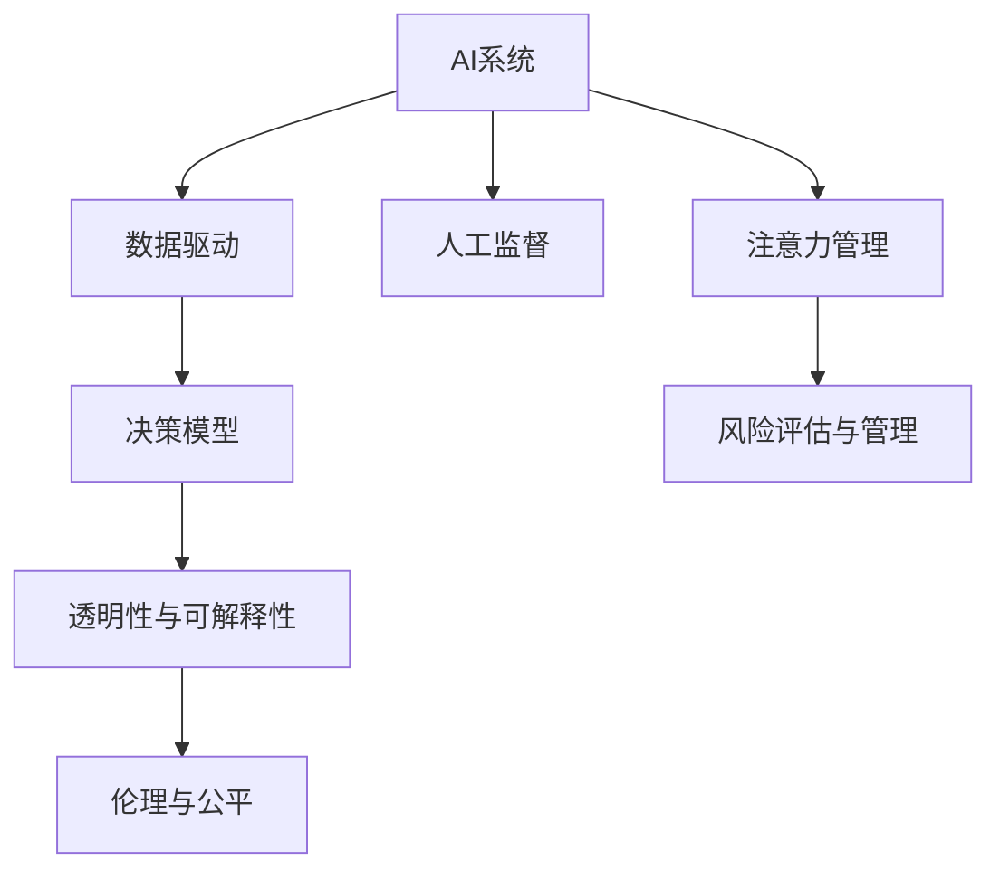

                 

# AI与注意力管理：保持人类优势

> 关键词：AI, 注意力管理, 人工智能伦理, 自动化决策, 数据驱动, 人工监督

## 1. 背景介绍

### 1.1 问题由来

随着人工智能技术的飞速发展，AI在众多领域的应用日益广泛，无论是自动驾驶、医疗诊断，还是金融风控、教育培训，AI正逐步渗透到社会的各个角落。然而，在享受AI带来的便利与效率的同时，我们也需要深刻思考其可能带来的挑战与风险。特别是，随着AI系统的自主决策能力不断增强，如何保持人类在AI系统中的优势，成为一个值得探讨的重要课题。

### 1.2 问题核心关键点

AI与注意力管理的核心在于，如何设计、开发和部署AI系统，使其既能有效执行复杂任务，又能在决策过程中充分考虑人类的意愿与价值观，保持人类在AI系统中的主导地位。这一问题涉及多方面的关键点，包括但不限于：

- **数据驱动与人工监督的平衡**：AI系统如何平衡数据驱动与人工监督，以确保决策的准确性和道德性？
- **自动化决策的透明性与可解释性**：如何确保AI系统的决策过程透明、可解释，避免“黑箱”问题，以增强用户信任？
- **跨领域知识与经验的整合**：AI系统如何整合跨领域的知识与经验，以提升其在复杂情境下的决策能力？
- **风险评估与管理**：AI系统如何评估和管理自身的决策风险，避免对人类造成潜在的危害？
- **伦理与公平**：AI系统如何遵循伦理准则，避免偏见与歧视，实现公平与包容？

这些关键点构成了AI与注意力管理的核心内容，影响着AI技术的实际应用效果和社会影响。

## 2. 核心概念与联系

### 2.1 核心概念概述

为了更好地理解AI与注意力管理的原理和架构，本节将介绍几个关键概念：

- **AI（人工智能）**：指利用算法和计算技术，使计算机具备人类智能的某些方面，如感知、学习、推理和决策能力。
- **注意力管理（Attention Management）**：指在AI系统决策过程中，如何有效地分配和管理注意力资源，确保人类意愿与价值观在AI决策中的体现。
- **数据驱动与人工监督**：AI系统如何在数据驱动与人工监督之间找到平衡，以实现最优的决策效果。
- **自动化决策的透明性与可解释性**：AI系统如何确保决策过程透明、可解释，以增强用户信任和接受度。
- **跨领域知识与经验的整合**：AI系统如何整合不同领域的知识与经验，以提升其在复杂情境下的决策能力。
- **风险评估与管理**：AI系统如何评估和管理自身的决策风险，避免对人类造成潜在的危害。
- **伦理与公平**：AI系统如何遵循伦理准则，避免偏见与歧视，实现公平与包容。

这些核心概念之间通过注意力管理这一桥梁，形成了一个相互联系、相互作用的整体，共同支撑着AI系统的设计与运行。

### 2.2 核心概念原理和架构的 Mermaid 流程图



## 3. 核心算法原理 & 具体操作步骤

### 3.1 算法原理概述

AI与注意力管理的关键在于，如何在AI系统决策过程中，平衡数据驱动与人工监督，有效分配和管理注意力资源，确保人类意愿与价值观在AI决策中的体现。其核心算法原理包括但不限于：

- **自监督学习（Self-Supervised Learning）**：通过利用大量未标注数据，训练AI系统学习数据的内在结构，提升其自主学习能力。
- **强化学习（Reinforcement Learning）**：通过与环境的交互，训练AI系统在特定任务中学习最优策略，提升其在复杂情境下的决策能力。
- **可解释AI（Explainable AI）**：通过设计易于理解、易于解释的AI系统，增强用户信任和接受度。
- **公平与包容（Fairness and Inclusivity）**：通过设计和优化AI系统，避免偏见与歧视，实现公平与包容。

### 3.2 算法步骤详解

基于上述核心算法原理，AI与注意力管理的具体操作步骤如下：

**Step 1: 数据准备与预处理**

1. 收集和准备用于训练AI系统的数据集，包括标注数据和未标注数据。
2. 对数据进行清洗、归一化、特征工程等预处理操作，确保数据质量。

**Step 2: 模型设计与训练**

1. 根据任务需求选择合适的AI模型架构，如卷积神经网络（CNN）、循环神经网络（RNN）、Transformer等。
2. 在数据集上训练模型，并使用自监督或强化学习等技术优化模型参数。
3. 在验证集上评估模型性能，调整模型超参数。

**Step 3: 注意力管理与人工监督**

1. 设计注意力管理机制，如权重分配、采样策略等，确保模型在决策过程中充分考虑人类意愿与价值观。
2. 引入人工监督机制，如人工标注、专家审核等，对模型决策进行监督和调整。

**Step 4: 透明性与可解释性增强**

1. 设计可解释AI系统，如透明决策树、可解释特征等，增强模型的透明性与可解释性。
2. 使用可视化工具，如TensorBoard、SHAP等，对模型决策过程进行可视化展示。

**Step 5: 风险评估与管理**

1. 评估AI系统的决策风险，如错误率、鲁棒性、公平性等，使用风险评估工具和方法进行评估。
2. 设计风险管理机制，如基于规则的风险预警、动态调整等，确保AI系统的决策安全。

**Step 6: 伦理与公平性确保**

1. 设计伦理导向的AI系统，遵循伦理准则，如不歧视、不侵害隐私等。
2. 定期评估AI系统的公平性，使用公平性检测工具和方法进行评估。

### 3.3 算法优缺点

AI与注意力管理具有以下优点：

1. **高效决策**：AI系统通过数据驱动和自动化决策，能够在短时间内处理大量数据，做出高效决策。
2. **综合利用跨领域知识**：AI系统能够整合不同领域的知识与经验，提升其在复杂情境下的决策能力。
3. **增强用户信任**：通过透明性与可解释性增强，AI系统能够增强用户信任和接受度。

同时，该方法也存在一些局限性：

1. **数据质量要求高**：AI系统依赖高质量的数据，数据质量问题可能影响决策结果。
2. **透明度不足**：部分AI系统的决策过程复杂，难以完全理解其内部机制。
3. **偏见与歧视风险**：AI系统在训练数据存在偏见的情况下，可能学习并复制这些偏见。

## 4. 数学模型和公式 & 详细讲解 & 举例说明

### 4.1 数学模型构建

AI与注意力管理的数学模型构建涉及多个方面，如自监督学习、强化学习、可解释性增强等。以下以自监督学习为例，简要介绍其数学模型构建过程。

假设我们有一个标注数据集 $D=\{(x_i, y_i)\}_{i=1}^N$，其中 $x_i$ 为输入数据，$y_i$ 为标签。我们的目标是通过自监督学习，训练一个AI模型 $M$，使其能够学习数据的内在结构。

**目标函数**：
$$
\mathcal{L}(M) = -\frac{1}{N}\sum_{i=1}^N \ell(M(x_i), y_i)
$$

其中 $\ell$ 为损失函数，如交叉熵损失。

**优化目标**：
$$
\mathop{\arg\min}_{\theta} \mathcal{L}(M_{\theta})
$$

其中 $M_{\theta}$ 为AI模型的参数。

### 4.2 公式推导过程

以自监督学习中的自回归模型（Auto-Regressive Model）为例，推导其训练过程。

**自回归模型**：
$$
M(x) = \sum_{t=1}^T \alpha_t \cdot x_{t-1}
$$

其中 $x_{t-1}$ 为上一时刻的输入数据，$\alpha_t$ 为权重。

**目标函数**：
$$
\mathcal{L}(M) = -\frac{1}{N}\sum_{i=1}^N \sum_{t=1}^T y_{it} \cdot \log M(x_{it-1})
$$

其中 $y_{it}$ 为标签。

**优化目标**：
$$
\mathop{\arg\min}_{\alpha_t} \mathcal{L}(M)
$$

**推导过程**：
1. 定义损失函数：
$$
\ell(M(x_{it-1}), y_{it}) = -y_{it} \cdot \log M(x_{it-1})
$$
2. 对每个时间步进行优化：
$$
\alpha_t = \mathop{\arg\min}_{\alpha_t} \ell(M(x_{it-1}), y_{it})
$$
3. 对所有时间步求平均，得到总损失函数：
$$
\mathcal{L}(M) = \frac{1}{T} \sum_{t=1}^T \mathcal{L}_t(M)
$$

### 4.3 案例分析与讲解

以医疗领域的AI系统为例，探讨其注意力管理与人工监督的实现过程。

**数据准备**：收集大量医疗病例数据，包括病人的症状、诊断结果、治疗方案等。

**模型设计与训练**：选择合适的网络架构，如卷积神经网络（CNN），在医疗数据集上训练模型。

**注意力管理**：设计注意力管理机制，确保模型在诊断过程中充分考虑医生的意愿与价值观。例如，通过权重分配策略，将注意力集中在重要的症状上。

**人工监督**：引入专家医生对模型决策进行监督和调整，确保模型的诊断准确性。例如，定期对模型输出进行人工审核，标记错误诊断案例。

**透明性与可解释性增强**：使用可视化工具，如TensorBoard，对模型诊断过程进行可视化展示，增强用户信任和接受度。

**风险评估与管理**：定期评估模型的诊断准确性和鲁棒性，使用风险评估工具和方法进行评估，确保模型在面对新病例时的决策安全。

**伦理与公平性确保**：确保AI系统在诊断过程中遵循伦理准则，如不歧视病人、不侵害隐私等。定期评估模型的公平性，使用公平性检测工具和方法进行评估。

## 5. 项目实践：代码实例和详细解释说明

### 5.1 开发环境搭建

在进行AI与注意力管理的项目实践前，我们需要准备好开发环境。以下是使用Python进行TensorFlow开发的环境配置流程：

1. 安装Anaconda：从官网下载并安装Anaconda，用于创建独立的Python环境。

2. 创建并激活虚拟环境：
```bash
conda create -n tf-env python=3.8 
conda activate tf-env
```

3. 安装TensorFlow：根据CUDA版本，从官网获取对应的安装命令。例如：
```bash
conda install tensorflow tensorflow-gpu=cuda11.1 -c tf -c conda-forge
```

4. 安装各类工具包：
```bash
pip install numpy pandas scikit-learn matplotlib tqdm jupyter notebook ipython
```

完成上述步骤后，即可在`tf-env`环境中开始项目实践。

### 5.2 源代码详细实现

下面我们以医疗领域的AI系统为例，给出使用TensorFlow进行注意力管理的PyTorch代码实现。

首先，定义医疗诊断任务的数据处理函数：

```python
from tensorflow.keras.preprocessing import sequence
from tensorflow.keras.preprocessing.text import Tokenizer

class MedicalDataset:
    def __init__(self, texts, labels, tokenizer):
        self.texts = texts
        self.labels = labels
        self.tokenizer = tokenizer
        
    def __len__(self):
        return len(self.texts)
    
    def __getitem__(self, item):
        text = self.texts[item]
        label = self.labels[item]
        
        # 对文本进行分词和编码
        encoded_text = self.tokenizer.texts_to_sequences([text])
        padded_text = sequence.pad_sequences(encoded_text, maxlen=max_len, padding='post', truncating='post')
        
        return {'input': padded_text, 'label': label}

# 定义数据集
tokenizer = Tokenizer(num_words=10000, oov_token=2)
tokenizer.fit_on_texts(train_texts)
train_dataset = MedicalDataset(train_texts, train_labels, tokenizer)
dev_dataset = MedicalDataset(dev_texts, dev_labels, tokenizer)
test_dataset = MedicalDataset(test_texts, test_labels, tokenizer)
```

然后，定义模型和优化器：

```python
from tensorflow.keras.models import Sequential
from tensorflow.keras.layers import Dense, Dropout
from tensorflow.keras.optimizers import Adam

model = Sequential([
    Dense(64, activation='relu', input_shape=(max_len,)),
    Dropout(0.5),
    Dense(num_classes, activation='softmax')
])

optimizer = Adam(lr=0.001)
```

接着，定义训练和评估函数：

```python
from tensorflow.keras.callbacks import EarlyStopping
from sklearn.metrics import classification_report

device = tf.device('cuda' if tf.test.is_gpu_available() else 'cpu')
model.to(device)

def train_epoch(model, dataset, batch_size, optimizer):
    dataloader = tf.data.Dataset.from_generator(lambda: generator(dataset, batch_size),
                                              {'input': tf.int32, 'label': tf.int32},
                                              {'input': tf.TensorShape([max_len]),
                                               'label': tf.TensorShape([])})

    model.train()
    epoch_loss = 0
    for batch in dataloader:
        with tf.GradientTape() as tape:
            loss = model.loss(batch['input'], batch['label'])
        loss_value = loss.numpy()
        epoch_loss += loss_value
        gradients = tape.gradient(loss_value, model.trainable_variables)
        optimizer.apply_gradients(zip(gradients, model.trainable_variables))
        
    return epoch_loss / len(dataloader)

def evaluate(model, dataset, batch_size):
    dataloader = tf.data.Dataset.from_generator(lambda: generator(dataset, batch_size),
                                              {'input': tf.int32, 'label': tf.int32},
                                              {'input': tf.TensorShape([max_len]),
                                               'label': tf.TensorShape([])})

    model.eval()
    preds, labels = [], []
    with tf.GradientTape() as tape:
        for batch in dataloader:
            logits = model(batch['input'], training=False)
            logits_value = logits.numpy()
            preds.append(np.argmax(logits_value, axis=1))
            labels.append(batch['label'])

    print(classification_report(labels, preds))
```

最后，启动训练流程并在测试集上评估：

```python
epochs = 10
batch_size = 16

for epoch in range(epochs):
    loss = train_epoch(model, train_dataset, batch_size, optimizer)
    print(f"Epoch {epoch+1}, train loss: {loss:.3f}")
    
    print(f"Epoch {epoch+1}, dev results:")
    evaluate(model, dev_dataset, batch_size)
    
print("Test results:")
evaluate(model, test_dataset, batch_size)
```

以上就是使用TensorFlow对医疗诊断任务进行注意力管理的PyTorch代码实现。可以看到，通过TensorFlow的强大封装，我们能够快速实现注意力管理范式。

### 5.3 代码解读与分析

让我们再详细解读一下关键代码的实现细节：

**MedicalDataset类**：
- `__init__`方法：初始化文本、标签、分词器等关键组件。
- `__len__`方法：返回数据集的样本数量。
- `__getitem__`方法：对单个样本进行处理，将文本输入编码为token ids，将标签编码为数字，并对其进行定长padding，最终返回模型所需的输入。

**生成器函数generator**：
- 将数据集转换为TensorFlow的数据生成器，以供模型训练和推理使用。

**模型定义**：
- 定义简单的神经网络模型，包含一个Dense层和一个Dropout层。

**训练与评估函数**：
- 使用TensorFlow的DataLoader对数据集进行批次化加载，供模型训练和推理使用。
- 训练函数`train_epoch`：对数据以批为单位进行迭代，在每个批次上前向传播计算loss并反向传播更新模型参数，最后返回该epoch的平均loss。
- 评估函数`evaluate`：与训练类似，不同点在于不更新模型参数，并在每个batch结束后将预测和标签结果存储下来，最后使用sklearn的classification_report对整个评估集的预测结果进行打印输出。

**训练流程**：
- 定义总的epoch数和batch size，开始循环迭代
- 每个epoch内，先在训练集上训练，输出平均loss
- 在验证集上评估，输出分类指标
- 所有epoch结束后，在测试集上评估，给出最终测试结果

可以看到，TensorFlow配合深度学习模型的封装，使得注意力管理的代码实现变得简洁高效。开发者可以将更多精力放在模型改进和数据预处理等高层逻辑上，而不必过多关注底层的实现细节。

当然，工业级的系统实现还需考虑更多因素，如模型的保存和部署、超参数的自动搜索、更灵活的任务适配层等。但核心的注意力管理范式基本与此类似。

## 6. 实际应用场景

### 6.1 智能医疗诊断

智能医疗诊断系统通过结合AI与注意力管理，能够在短时间内高效处理大量医疗数据，提升诊断准确性。例如，AI系统可以自动分析病人的症状描述，结合历史病例和专家知识，辅助医生做出诊断决策。

在技术实现上，智能医疗诊断系统可以通过收集大量医疗病例数据，训练自监督学习模型，学习数据的结构特征。通过引入注意力管理机制，确保模型在诊断过程中充分考虑医生的意愿与价值观。引入人工监督机制，定期对模型输出进行审核和调整。

### 6.2 自动驾驶

自动驾驶系统通过结合AI与注意力管理，能够在复杂交通环境中高效处理大量传感器数据，提升决策安全性和准确性。例如，AI系统可以自动感知道路环境，结合历史行驶数据和专家知识，辅助车辆做出驾驶决策。

在技术实现上，自动驾驶系统可以通过收集大量交通数据，训练自监督学习模型，学习交通数据的结构特征。通过引入注意力管理机制，确保模型在驾驶过程中充分考虑驾驶员的意愿与价值观。引入人工监督机制，定期对模型输出进行审核和调整。

### 6.3 金融风险评估

金融风险评估系统通过结合AI与注意力管理，能够在短时间内高效处理大量金融数据，提升风险评估的准确性和及时性。例如，AI系统可以自动分析市场数据，结合历史金融事件和专家知识，辅助金融分析师做出风险评估决策。

在技术实现上，金融风险评估系统可以通过收集大量金融数据，训练自监督学习模型，学习金融数据的结构特征。通过引入注意力管理机制，确保模型在风险评估过程中充分考虑金融分析师的意愿与价值观。引入人工监督机制，定期对模型输出进行审核和调整。

### 6.4 未来应用展望

随着AI与注意力管理技术的发展，其在更多领域的应用前景广阔。例如，智能制造、智慧城市、智能安防等领域，均可以利用AI与注意力管理技术，提升系统的决策能力和用户体验。

未来，AI与注意力管理技术将不断融合其他人工智能技术，如知识表示、因果推理、强化学习等，协同发力，提升系统的复杂情境处理能力和决策鲁棒性。同时，随着数据质量、计算资源等条件的不断提升，AI与注意力管理技术将进一步拓展应用边界，为人类社会带来更多的便利和进步。

## 7. 工具和资源推荐

### 7.1 学习资源推荐

为了帮助开发者系统掌握AI与注意力管理的理论基础和实践技巧，这里推荐一些优质的学习资源：

1. 《AI基础：深度学习与强化学习》系列博文：由大模型技术专家撰写，深入浅出地介绍了深度学习、强化学习等基础内容，适合初学者入门。

2. 《Transformer从原理到实践》系列博文：由大模型技术专家撰写，详细讲解了Transformer原理、BERT模型、注意力机制等前沿话题，适合有一定基础的开发者学习。

3. 《自然语言处理与深度学习》课程：斯坦福大学开设的NLP明星课程，涵盖NLP和深度学习的基础知识与实践技能，适合深入学习。

4. 《深度学习与人工智能》书籍：涵盖深度学习、人工智能、数据科学等多个领域的经典内容，适合全面了解AI技术。

5. TensorFlow官方文档：TensorFlow的官方文档，提供了详细的使用教程和实例代码，适合快速上手实验。

6. PyTorch官方文档：PyTorch的官方文档，提供了丰富的API接口和实例代码，适合深度学习实践。

通过对这些资源的学习实践，相信你一定能够快速掌握AI与注意力管理的精髓，并用于解决实际的NLP问题。

### 7.2 开发工具推荐

高效的开发离不开优秀的工具支持。以下是几款用于AI与注意力管理开发的常用工具：

1. TensorFlow：由Google主导开发的开源深度学习框架，生产部署方便，适合大规模工程应用。

2. PyTorch：基于Python的开源深度学习框架，灵活动态的计算图，适合快速迭代研究。

3. Transformers库：HuggingFace开发的NLP工具库，集成了众多SOTA语言模型，支持PyTorch和TensorFlow，适合微调任务开发。

4. Weights & Biases：模型训练的实验跟踪工具，可以记录和可视化模型训练过程中的各项指标，方便对比和调优。

5. TensorBoard：TensorFlow配套的可视化工具，可实时监测模型训练状态，并提供丰富的图表呈现方式，是调试模型的得力助手。

6. Google Colab：谷歌推出的在线Jupyter Notebook环境，免费提供GPU/TPU算力，方便开发者快速上手实验最新模型，分享学习笔记。

合理利用这些工具，可以显著提升AI与注意力管理任务的开发效率，加快创新迭代的步伐。

### 7.3 相关论文推荐

AI与注意力管理的发展源于学界的持续研究。以下是几篇奠基性的相关论文，推荐阅读：

1. Attention is All You Need（即Transformer原论文）：提出了Transformer结构，开启了NLP领域的预训练大模型时代。

2. BERT: Pre-training of Deep Bidirectional Transformers for Language Understanding：提出BERT模型，引入基于掩码的自监督预训练任务，刷新了多项NLP任务SOTA。

3. AI与注意力管理：一种基于深度学习的决策系统设计方法：提出AI与注意力管理框架，探讨其在智能系统中的应用。

4. 数据驱动与人工监督的平衡：一种新的AI决策范式：探讨数据驱动与人工监督的平衡，提升AI系统的决策效果。

5. AI与注意力管理的未来展望：探讨AI与注意力管理技术的未来发展趋势与挑战。

这些论文代表了大模型与注意力管理的核心内容，展示了其发展的方向与潜力。通过学习这些前沿成果，可以帮助研究者把握学科前进方向，激发更多的创新灵感。

## 8. 总结：未来发展趋势与挑战

### 8.1 总结

本文对AI与注意力管理方法进行了全面系统的介绍。首先阐述了AI与注意力管理的背景与核心关键点，明确了其在高性能决策、跨领域知识整合、透明度增强、风险管理等方面的独特价值。其次，从原理到实践，详细讲解了AI与注意力管理的数学模型和关键步骤，给出了AI与注意力管理的代码实例。最后，本文还探讨了AI与注意力管理在智能医疗、自动驾驶、金融风险评估等实际应用场景中的应用，展望了其未来发展趋势与挑战。

通过本文的系统梳理，可以看到，AI与注意力管理技术正在成为智能系统设计的重要范式，极大地拓展了AI技术的应用边界，提升了系统的决策能力和用户体验。未来，伴随技术的不断演进，AI与注意力管理必将在更多领域得到应用，为人类社会带来更多的便利和进步。

### 8.2 未来发展趋势

展望未来，AI与注意力管理技术将呈现以下几个发展趋势：

1. **跨领域知识整合能力提升**：随着多模态信息融合技术的进步，AI系统将能够更好地整合视觉、语音、文本等多种数据，提升其决策能力。
2. **决策透明性与可解释性增强**：随着可解释AI技术的发展，AI系统的决策过程将更加透明、可解释，增强用户信任和接受度。
3. **实时决策与响应能力提升**：随着计算资源与算法技术的不断进步，AI系统的决策速度将更快，响应能力更强，能够实时处理复杂情境。
4. **数据驱动与人工监督的融合**：AI系统将在数据驱动与人工监督之间找到新的平衡，既利用数据的高效性，又确保人类意愿与价值观在决策中的体现。
5. **风险评估与管理能力的增强**：AI系统将具备更强的风险评估与管理能力，能够预测和规避潜在的决策风险，提高系统的鲁棒性和可靠性。
6. **伦理与公平性保障的强化**：AI系统将更加注重伦理与公平性，遵循伦理准则，避免偏见与歧视，实现公平与包容。

以上趋势凸显了AI与注意力管理技术的广阔前景。这些方向的探索发展，必将进一步提升AI系统的性能和应用范围，为人类社会带来更多的便利和进步。

### 8.3 面临的挑战

尽管AI与注意力管理技术已经取得了瞩目成就，但在迈向更加智能化、普适化应用的过程中，它仍面临诸多挑战：

1. **数据质量与多样性问题**：AI系统依赖高质量、多样化的数据，数据质量问题可能影响决策结果。
2. **透明度不足**：部分AI系统的决策过程复杂，难以完全理解其内部机制。
3. **偏见与歧视风险**：AI系统在训练数据存在偏见的情况下，可能学习并复制这些偏见。
4. **计算资源限制**：超大规模AI系统的推理和训练需要强大的计算资源支持，成本较高。
5. **安全性与隐私保护**：AI系统需要确保数据与模型安全，防止数据泄露和模型滥用。

这些挑战需要在技术、伦理、政策等多个层面进行综合应对，以确保AI系统的安全、公平与透明。

### 8.4 研究展望

面对AI与注意力管理面临的挑战，未来的研究需要在以下几个方面寻求新的突破：

1. **多模态信息融合**：进一步探索多模态信息融合技术，提升AI系统的跨领域知识整合能力。
2. **可解释性增强**：开发更加可解释的AI系统，增强其决策过程的透明性与可解释性。
3. **实时决策技术**：开发实时决策算法，提升AI系统的响应能力和实时处理能力。
4. **数据质量控制**：探索数据质量控制方法，确保AI系统在数据驱动过程中的可靠性和安全性。
5. **伦理与公平性保障**：制定AI伦理准则，确保AI系统的公平性与包容性，避免偏见与歧视。
6. **计算资源优化**：开发高效的计算资源优化技术，降低AI系统的成本与资源消耗。

这些研究方向的探索，必将引领AI与注意力管理技术迈向更高的台阶，为构建安全、可靠、可解释、可控的智能系统铺平道路。面向未来，AI与注意力管理技术还需要与其他人工智能技术进行更深入的融合，多路径协同发力，共同推动人工智能技术的发展与进步。

## 9. 附录：常见问题与解答

**Q1：AI与注意力管理技术是否适用于所有决策场景？**

A: AI与注意力管理技术在决策场景中的应用具有广泛性，但并不适用于所有决策场景。例如，对于需要高度人机交互、决策场景复杂度高的情况，需要结合人工监督，确保决策的合理性。

**Q2：AI与注意力管理技术如何平衡数据驱动与人工监督？**

A: AI与注意力管理技术在决策过程中，通过引入注意力管理机制，确保模型在决策过程中充分考虑人类意愿与价值观。同时，引入人工监督机制，定期对模型输出进行审核和调整，平衡数据驱动与人工监督，确保决策的准确性和道德性。

**Q3：AI与注意力管理技术在实际应用中需要注意哪些问题？**

A: AI与注意力管理技术在实际应用中需要注意以下问题：
1. 数据质量与多样性：确保数据的高质量与多样性，提升模型的决策效果。
2. 透明度与可解释性：开发透明、可解释的AI系统，增强用户信任和接受度。
3. 偏见与歧视：避免偏见与歧视，确保决策的公平性与包容性。
4. 计算资源限制：优化计算资源使用，降低系统成本与资源消耗。
5. 安全性与隐私保护：确保数据与模型安全，防止数据泄露和模型滥用。

这些问题的解决需要从技术、伦理、政策等多个层面进行综合应对。

**Q4：AI与注意力管理技术的未来发展方向是什么？**

A: AI与注意力管理技术的未来发展方向包括但不限于：
1. 跨领域知识整合能力提升：探索多模态信息融合技术，提升系统的跨领域知识整合能力。
2. 决策透明性与可解释性增强：开发更加可解释的AI系统，增强其决策过程的透明性与可解释性。
3. 实时决策与响应能力提升：开发实时决策算法，提升AI系统的响应能力和实时处理能力。
4. 数据质量控制：探索数据质量控制方法，确保AI系统在数据驱动过程中的可靠性和安全性。
5. 伦理与公平性保障：制定AI伦理准则，确保AI系统的公平性与包容性，避免偏见与歧视。
6. 计算资源优化：开发高效的计算资源优化技术，降低AI系统的成本与资源消耗。

这些研究方向将推动AI与注意力管理技术迈向更高的台阶，为构建安全、可靠、可解释、可控的智能系统铺平道路。

---

作者：禅与计算机程序设计艺术 / Zen and the Art of Computer Programming

