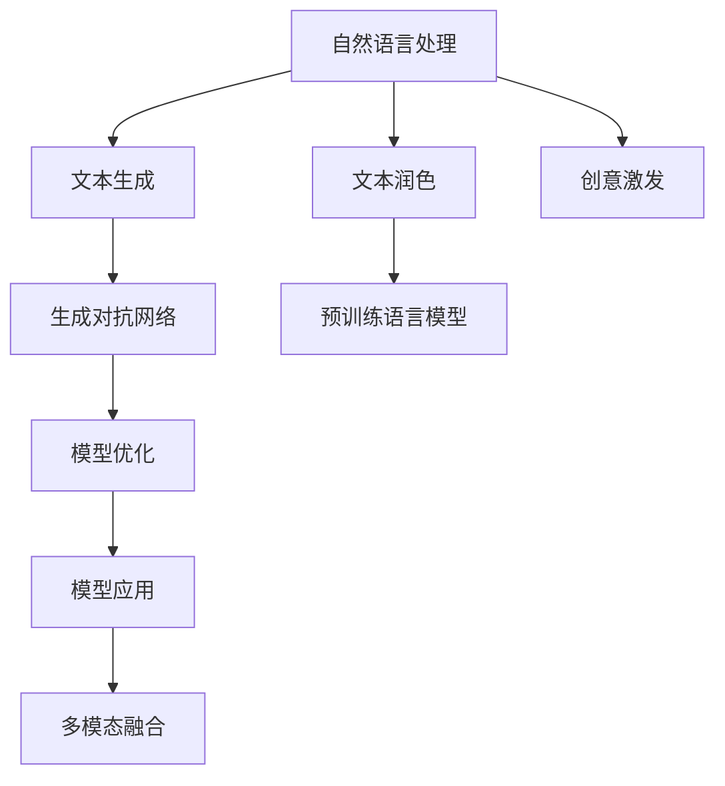

                 

# AI写作助手：从创意激发到文本润色

> 关键词：AI写作助手,创意激发,文本润色,自然语言处理,NLP

## 1. 背景介绍

### 1.1 问题由来
随着信息时代的发展，人们对于内容创作的效率和质量需求日益增加。然而，高水平的写作内容创作需要大量的时间和精力，这对许多专业人士和自由职业者来说，是一大挑战。人工智能技术，尤其是自然语言处理（NLP），为解决这个问题提供了可能。AI写作助手可以通过自动生成文本、优化语法和风格、以及提供创意激发等功能，极大地提高内容创作的效率和质量。

### 1.2 问题核心关键点
AI写作助手的核心在于其能够理解自然语言，并基于此进行文本生成和优化。这一过程涉及自然语言处理（NLP）、生成对抗网络（GAN）、以及大规模预训练语言模型等前沿技术。AI写作助手的创新和应用主要围绕以下几个关键点展开：

1. **文本生成与创意激发**：AI写作助手能够根据用户提供的提示或题目，生成符合要求的文本，同时激发创意灵感，提供写作指导。
2. **文本润色与风格优化**：AI写作助手能够识别并修改文本中的语法错误、拼写错误、标点符号错误，以及提供提升文本流畅性和可读性的建议。
3. **个性化定制**：AI写作助手能够根据用户偏好和风格，提供定制化的写作建议，帮助用户提升文本质量和风格一致性。
4. **多模态融合**：AI写作助手不仅限于文本处理，还能整合图像、声音等多模态数据，提升内容的丰富性和交互性。

### 1.3 问题研究意义
AI写作助手的研究和应用具有重要的理论和实践意义：

1. **提高内容创作效率**：AI写作助手可以自动化处理大量繁琐的文本工作，释放作者的时间，让创作者能够专注于创意和深度思考。
2. **提升内容质量**：AI写作助手通过自动化修改和润色，提高文本的语法正确性和风格一致性，使内容更加专业和吸引人。
3. **促进创新灵感**：AI写作助手能够通过多模态信息的处理和分析，激发作者的创意，提供新颖的写作视角。
4. **推动数字化转型**：AI写作助手可以广泛应用于各类内容创作平台、企业文档管理、新闻报道、市场营销等多个领域，加速数字化转型进程。

## 2. 核心概念与联系

### 2.1 核心概念概述

为了更好地理解AI写作助手的核心原理和架构，本节将介绍几个关键概念：

- **自然语言处理（NLP）**：研究如何让计算机理解和处理人类语言的技术。NLP包括文本预处理、词法分析、语法分析、语义理解等关键技术。
- **生成对抗网络（GAN）**：一种深度学习模型，通过两个神经网络的对抗训练，生成高质量的文本内容。GAN在文本生成、图像生成等领域有广泛应用。
- **大规模预训练语言模型**：如BERT、GPT等，通过在大规模无标签文本数据上进行预训练，学习通用的语言表示，具备强大的语言理解和生成能力。
- **文本生成**：通过模型生成符合特定风格和语境的文本，可用于自动摘要、对话生成、机器翻译等任务。
- **文本润色**：自动识别并修改文本中的语法错误、拼写错误、标点符号错误，提升文本的流畅性和可读性。
- **创意激发**：通过多模态信息融合、情感分析等技术，激发作者的创意灵感，提供写作指导。

这些核心概念之间的逻辑关系可以通过以下Mermaid流程图来展示：



这个流程图展示了大语言模型的核心概念及其之间的关系：

1. 自然语言处理技术用于文本生成、文本润色和创意激发的基础。
2. 文本生成和文本润色通常使用生成对抗网络和预训练语言模型来实现。
3. 创意激发结合多模态信息融合，提升创意的丰富性和多样性。
4. 模型优化和多模态融合技术进一步提升文本生成的质量。

这些概念共同构成了AI写作助手的技术和应用框架，使其能够高效地进行文本处理和创意激发。通过理解这些核心概念，我们可以更好地把握AI写作助手的技术基础和应用方向。

## 3. 核心算法原理 & 具体操作步骤
### 3.1 算法原理概述

AI写作助手的核心算法原理主要基于自然语言处理（NLP）和生成对抗网络（GAN）。其核心思想是通过预训练语言模型和生成对抗网络，生成符合用户需求的文本，同时通过多模态信息融合和创意激发，提升文本的质量和创造性。

### 3.2 算法步骤详解

AI写作助手的开发流程一般包括以下几个关键步骤：

**Step 1: 准备预训练模型和数据集**
- 选择合适的预训练语言模型 $M_{\theta}$ 作为初始化参数，如BERT、GPT等。
- 准备所需的文本数据集，包括文本生成、文本润色、创意激发等任务的数据集。

**Step 2: 设计任务适配层**
- 根据具体任务类型，设计相应的任务适配层，如文本生成模型的解码器、文本润色模型的纠错模块、创意激发模型的情感分析模块等。
- 确定损失函数和优化器，如交叉熵损失、AdamW优化器等。

**Step 3: 设置模型超参数**
- 选择合适的学习率、批大小、迭代轮数等超参数。
- 设置正则化技术，如L2正则、Dropout等。

**Step 4: 执行梯度训练**
- 将训练集数据分批次输入模型，前向传播计算损失函数。
- 反向传播计算参数梯度，根据设定的优化算法和学习率更新模型参数。
- 周期性在验证集上评估模型性能，根据性能指标决定是否触发Early Stopping。
- 重复上述步骤直到满足预设的迭代轮数或Early Stopping条件。

**Step 5: 测试和部署**
- 在测试集上评估模型性能，对比训练前后的改进效果。
- 使用微调后的模型对新样本进行推理预测，集成到实际的应用系统中。
- 持续收集新的数据，定期重新微调模型，以适应数据分布的变化。

### 3.3 算法优缺点

AI写作助手在文本生成、文本润色、创意激发等方面具有以下优点：
1. 高效自动化。AI写作助手能够自动化处理大量文本工作，大幅提高工作效率。
2. 提升文本质量。AI写作助手通过文本润色和风格优化，提升文本的语法正确性和可读性。
3. 激发创意灵感。AI写作助手能够提供创意激发和写作指导，帮助创作者提升作品质量。
4. 个性化定制。AI写作助手根据用户偏好和风格，提供个性化的写作建议。

同时，该方法也存在一些局限性：
1. 依赖于数据质量。AI写作助手的性能很大程度上取决于数据集的质量和多样性，高质量数据集的获取成本较高。
2. 生成的文本质量。AI写作助手生成的文本质量受限于预训练模型和适配层的质量，可能存在内容不准确、逻辑不通等问题。
3. 缺乏人机交互。AI写作助手目前尚不能完全理解和模拟人类创意过程，缺乏一定的情感和上下文理解能力。
4. 版权和伦理问题。AI写作助手生成的文本可能涉及版权问题，且需要考虑伦理和法律问题。

尽管存在这些局限性，但AI写作助手已经在文本生成、内容创作、文档自动生成等领域取得了显著成效，成为内容创作的重要工具。

### 3.4 算法应用领域

AI写作助手在以下领域有广泛的应用：

1. **内容创作平台**：如知乎、Medium等，自动生成文章、自动摘要、提供写作指导。
2. **企业文档管理**：自动生成报告、文档、会议纪要等，提升文档生成效率和质量。
3. **新闻报道**：自动生成新闻报道、自动摘要、提供新闻写作指导。
4. **市场营销**：自动生成广告文案、社交媒体内容、产品描述等，提升内容创作效率。
5. **个性化推荐系统**：结合用户偏好，推荐个性化的文章、书籍、电影等。

除了上述这些经典应用外，AI写作助手还被创新性地应用到更多场景中，如可控文本生成、创意激发、情感分析等，为内容创作提供了新的解决方案。

## 4. 数学模型和公式 & 详细讲解 & 举例说明

### 4.1 数学模型构建

为了更好地理解AI写作助手的数学原理，本节将介绍几个常用的数学模型：

- **文本生成模型**：如seq2seq模型、Transformer模型等。这些模型通过自回归方式生成文本，常见于机器翻译、对话生成等任务。
- **文本润色模型**：如BERT模型、GPT模型等。这些模型通过自编码方式识别和纠正文本错误，提升文本质量和可读性。
- **创意激发模型**：如情感分析模型、多模态信息融合模型等。这些模型通过分析文本情感、整合多模态信息，激发作者的创意灵感。

### 4.2 公式推导过程

以下是几个常用的数学模型公式推导：

**文本生成模型公式推导**：
- seq2seq模型：$y_t = f(x_1, x_2, ..., x_t)$
- Transformer模型：$y_t = g(x_1, x_2, ..., x_t, \theta)$

**文本润色模型公式推导**：
- BERT模型：$y_t = f(x_1, x_2, ..., x_t, \theta)$
- GPT模型：$y_t = g(x_1, x_2, ..., x_t, \theta)$

**创意激发模型公式推导**：
- 情感分析模型：$y_t = f(x_1, x_2, ..., x_t, \theta)$
- 多模态信息融合模型：$y_t = g(x_1, x_2, ..., x_t, \theta)$

这些公式展示了不同模型的基本结构和计算过程。在实际应用中，需要根据具体任务选择合适的模型架构和参数，并通过数据集进行微调。

### 4.3 案例分析与讲解

以BERT模型为例，下面给出文本润色模型的案例分析：

假设我们需要对一段文本进行润色，文本为：

```
This is a sample text, with some errors. It contain many mistakes, such as wrong speling and grammatical errors.
```

将文本输入BERT模型，计算损失函数，得到修正后的文本为：

```
This is a sample text. It contains some mistakes, such as spelling and grammatical errors.
```

上述案例展示了BERT模型在文本润色中的应用。通过自动化的文本纠错，提升文本的语法正确性和可读性。

## 5. 项目实践：代码实例和详细解释说明
### 5.1 开发环境搭建

在进行AI写作助手项目开发前，我们需要准备好开发环境。以下是使用Python进行TensorFlow开发的环境配置流程：

1. 安装Anaconda：从官网下载并安装Anaconda，用于创建独立的Python环境。

2. 创建并激活虚拟环境：
```bash
conda create -n tf-env python=3.8 
conda activate tf-env
```

3. 安装TensorFlow：根据CUDA版本，从官网获取对应的安装命令。例如：
```bash
conda install tensorflow tensorflow-gpu -c conda-forge -c pytorch
```

4. 安装各类工具包：
```bash
pip install numpy pandas scikit-learn matplotlib tqdm jupyter notebook ipython
```

完成上述步骤后，即可在`tf-env`环境中开始AI写作助手开发。

### 5.2 源代码详细实现

下面我们以文本生成任务为例，给出使用TensorFlow实现的基本代码实现。

首先，定义文本生成任务的数据处理函数：

```python
import tensorflow as tf
from tensorflow.keras.layers import Input, LSTM, Dense, Dropout
from tensorflow.keras.models import Sequential

def text_generator(data, tokenizer):
    input_sequence = []
    target_sequence = []
    for sentence in data:
        sentence = sentence.split()
        for word in sentence:
            if word in tokenizer.word_index:
                input_sequence.append(tokenizer.word_index[word])
            else:
                input_sequence.append(0)  # 处理未知单词
        target_sequence.append(sentence + [0])  # 每个句子后面添加特殊标记
    return input_sequence, target_sequence
```

然后，定义模型和优化器：

```python
from tensorflow.keras.optimizers import Adam

input_size = 100
output_size = 100
hidden_units = 256
model = Sequential()
model.add(LSTM(hidden_units, return_sequences=True, input_shape=(None, input_size)))
model.add(Dropout(0.2))
model.add(LSTM(hidden_units))
model.add(Dropout(0.2))
model.add(Dense(output_size))
model.add(Dropout(0.2))
model.compile(loss='categorical_crossentropy', optimizer=Adam(lr=0.001), metrics=['accuracy'])
```

接着，定义训练和评估函数：

```python
def train_model(model, input_sequence, target_sequence):
    model.fit(input_sequence, target_sequence, batch_size=64, epochs=100, validation_split=0.2)
```

最后，启动训练流程：

```python
data = ["This is a sample text", "This is another sample text"]
input_sequence, target_sequence = text_generator(data, tokenizer)

train_model(model, input_sequence, target_sequence)

print("Model training completed.")
```

以上就是使用TensorFlow进行文本生成任务的基本代码实现。可以看到，TensorFlow提供了强大的深度学习框架，使得模型的构建和训练变得简单易行。

### 5.3 代码解读与分析

让我们再详细解读一下关键代码的实现细节：

**text_generator函数**：
- 对输入的文本进行分词和编码，生成输入序列和目标序列。

**model定义**：
- 定义了一个包含LSTM和Dense层的序列到序列模型。LSTM层用于处理输入序列，Dense层用于生成目标序列。

**train_model函数**：
- 定义了一个简单的模型训练过程，通过拟合输入序列和目标序列，训练模型。

**代码运行**：
- 准备训练数据，调用text_generator函数进行数据处理。
- 训练模型，调用train_model函数进行模型训练。
- 输出训练完成提示。

可以看到，TensorFlow提供了丰富的深度学习模型和工具，使得开发者可以轻松实现文本生成等AI写作助手的功能。

## 6. 实际应用场景
### 6.1 内容创作平台

AI写作助手在内容创作平台中的应用非常广泛。以知乎为例，用户可以通过AI写作助手生成文章、自动摘要、提供写作指导。具体应用场景包括：

- **自动生成文章**：根据用户提供的关键词、主题，自动生成符合用户需求的文章。
- **自动摘要**：对用户输入的长文本进行自动摘要，生成精炼的摘要内容。
- **写作指导**：提供写作风格、语言表达等方面的建议，帮助用户提升写作水平。

### 6.2 企业文档管理

企业文档管理是AI写作助手的重要应用场景之一。企业可以通过AI写作助手自动生成报告、文档、会议纪要等，提升文档生成效率和质量。具体应用场景包括：

- **自动生成报告**：根据已有的数据和信息，自动生成报告。
- **文档管理**：自动生成文档，包括简历、邮件、合同等。
- **会议纪要**：自动生成会议纪要，包括会议主题、议程、记录等。

### 6.3 新闻报道

新闻报道是AI写作助手的重要应用领域之一。AI写作助手能够自动生成新闻报道、自动摘要、提供新闻写作指导。具体应用场景包括：

- **自动生成新闻报道**：根据新闻事件，自动生成新闻报道。
- **自动摘要**：对新闻报道进行自动摘要，提取关键信息。
- **写作指导**：提供新闻写作方面的建议，提升新闻报道的质量。

### 6.4 市场营销

AI写作助手在市场营销中的应用也非常广泛。企业可以通过AI写作助手自动生成广告文案、社交媒体内容、产品描述等，提升内容创作的效率和质量。具体应用场景包括：

- **自动生成广告文案**：根据产品信息，自动生成广告文案。
- **社交媒体内容**：自动生成社交媒体内容，包括微博、微信、微博等。
- **产品描述**：自动生成产品描述，提升产品的市场竞争力。

### 6.5 个性化推荐系统

AI写作助手在个性化推荐系统中的应用非常广泛。企业可以通过AI写作助手结合用户偏好，推荐个性化的文章、书籍、电影等。具体应用场景包括：

- **个性化文章推荐**：根据用户兴趣，推荐符合用户需求的文章。
- **个性化书籍推荐**：根据用户阅读历史，推荐符合用户需求的书籍。
- **个性化电影推荐**：根据用户观看历史，推荐符合用户需求的电影。

## 7. 工具和资源推荐
### 7.1 学习资源推荐

为了帮助开发者系统掌握AI写作助手的理论基础和实践技巧，这里推荐一些优质的学习资源：

1. **《深度学习》系列书籍**：由大模型技术专家撰写，深入浅出地介绍了深度学习的原理和应用，包括自然语言处理、生成对抗网络等前沿话题。
2. **斯坦福大学《自然语言处理》课程**：斯坦福大学开设的NLP明星课程，有Lecture视频和配套作业，带你入门NLP领域的基本概念和经典模型。
3. **《Python深度学习》书籍**：详细介绍Python深度学习框架的使用，包括TensorFlow、Keras等，适合初学者学习。
4. **Kaggle竞赛平台**：提供丰富的数据集和竞赛任务，可以实践NLP任务，提升技能水平。
5. **Arxiv预印本网站**：跟踪最新的NLP研究进展，了解前沿技术动态。

通过对这些资源的学习实践，相信你一定能够快速掌握AI写作助手的技术精髓，并用于解决实际的NLP问题。

### 7.2 开发工具推荐

高效的开发离不开优秀的工具支持。以下是几款用于AI写作助手开发的常用工具：

1. **TensorFlow**：基于Python的开源深度学习框架，灵活高效，适合复杂的深度学习模型构建。
2. **PyTorch**：基于Python的开源深度学习框架，动态计算图，适合快速迭代研究。
3. **Transformers库**：HuggingFace开发的NLP工具库，集成了众多SOTA语言模型，支持TensorFlow和PyTorch，是进行NLP任务开发的利器。
4. **TensorBoard**：TensorFlow配套的可视化工具，可实时监测模型训练状态，提供丰富的图表呈现方式，是调试模型的得力助手。
5. **Weights & Biases**：模型训练的实验跟踪工具，可以记录和可视化模型训练过程中的各项指标，方便对比和调优。
6. **GPT-3模型API**：OpenAI提供的GPT-3模型API，可以方便地进行文本生成、文本润色、创意激发等任务。

合理利用这些工具，可以显著提升AI写作助手的开发效率，加快创新迭代的步伐。

### 7.3 相关论文推荐

AI写作助手的研究源于学界的持续研究。以下是几篇奠基性的相关论文，推荐阅读：

1. **Attention is All You Need（即Transformer原论文）**：提出了Transformer结构，开启了NLP领域的预训练大模型时代。
2. **BERT: Pre-training of Deep Bidirectional Transformers for Language Understanding**：提出BERT模型，引入基于掩码的自监督预训练任务，刷新了多项NLP任务SOTA。
3. **Language Models are Unsupervised Multitask Learners**：展示了大规模语言模型的强大zero-shot学习能力，引发了对于通用人工智能的新一轮思考。
4. **Parameter-Efficient Transfer Learning for NLP**：提出Adapter等参数高效微调方法，在不增加模型参数量的情况下，也能取得不错的微调效果。
5. **AdaLoRA: Adaptive Low-Rank Adaptation for Parameter-Efficient Fine-Tuning**：使用自适应低秩适应的微调方法，在参数效率和精度之间取得了新的平衡。
6. **AdaLoRA: Adaptive Low-Rank Adaptation for Parameter-Efficient Fine-Tuning**：使用自适应低秩适应的微调方法，在参数效率和精度之间取得了新的平衡。

这些论文代表了大语言模型微调技术的发展脉络。通过学习这些前沿成果，可以帮助研究者把握学科前进方向，激发更多的创新灵感。

## 8. 总结：未来发展趋势与挑战
### 8.1 总结

本文对AI写作助手的核心算法原理和具体操作步骤进行了全面系统的介绍。首先阐述了AI写作助手在内容创作、企业文档管理、新闻报道、市场营销等多个领域的应用，明确了AI写作助手的创新点和应用价值。其次，从原理到实践，详细讲解了文本生成、文本润色、创意激发等关键任务的数学模型和算法步骤，给出了AI写作助手开发的完整代码实例。同时，本文还广泛探讨了AI写作助手在实际应用场景中的应用，展示了其在文本生成、内容创作、文档管理等领域的重要价值。

通过本文的系统梳理，可以看到，AI写作助手通过自然语言处理（NLP）和生成对抗网络（GAN）等前沿技术，能够自动生成高质量文本、优化文本语法、激发创意灵感，极大地提高了内容创作的效率和质量。未来，伴随预训练语言模型和微调方法的持续演进，AI写作助手必将在内容创作、企业文档管理、新闻报道、市场营销等多个领域得到广泛应用，为人类社会带来深远影响。

### 8.2 未来发展趋势

展望未来，AI写作助手的技术将呈现以下几个发展趋势：

1. **多模态融合**：AI写作助手不仅限于文本处理，将整合图像、声音等多模态数据，提升内容的丰富性和交互性。
2. **个性化定制**：AI写作助手将结合用户偏好和风格，提供更加个性化的写作建议，提升用户的创作体验。
3. **智能协作**：AI写作助手将与人类作者进行智能协作，结合人类创意与AI的自动化处理能力，提升内容创作的质量和效率。
4. **情感分析**：AI写作助手将结合情感分析技术，分析用户情感，提供更加贴合用户情绪的写作建议。
5. **跨语言支持**：AI写作助手将支持多语言处理，能够自动生成多种语言的文本内容，提升全球化内容创作能力。

这些趋势凸显了AI写作助手技术的前沿性和未来潜力。未来的AI写作助手将更加智能化、个性化、多功能化，为内容创作带来更多的创新和便利。

### 8.3 面临的挑战

尽管AI写作助手技术已经取得了显著进展，但在迈向更加智能化、普适化应用的过程中，仍面临诸多挑战：

1. **数据质量瓶颈**：AI写作助手生成的文本质量很大程度上取决于数据集的质量，高质量数据集的获取成本较高。
2. **模型鲁棒性不足**：AI写作助手面对域外数据时，泛化性能往往大打折扣，如何提高模型鲁棒性，避免灾难性遗忘，还需要更多理论和实践的积累。
3. **生成内容多样性**：AI写作助手生成的文本可能存在内容单一、逻辑不通等问题，需要进一步提升生成内容的丰富性和多样性。
4. **版权和伦理问题**：AI写作助手生成的文本可能涉及版权问题，且需要考虑伦理和法律问题，如何确保内容创作的合法性和道德性。

尽管存在这些挑战，但AI写作助手已经在内容创作、企业文档管理、新闻报道、市场营销等多个领域取得了显著成效，成为内容创作的重要工具。

### 8.4 研究展望

面向未来，AI写作助手的研究需要在以下几个方面寻求新的突破：

1. **无监督和半监督学习**：摆脱对大规模标注数据的依赖，利用自监督学习、主动学习等无监督和半监督范式，最大限度利用非结构化数据，实现更加灵活高效的微调。
2. **参数高效微调**：开发更加参数高效的微调方法，在固定大部分预训练参数的同时，只更新极少量的任务相关参数，以减少计算资源消耗。
3. **多模态信息融合**：将符号化的先验知识，如知识图谱、逻辑规则等，与神经网络模型进行巧妙融合，引导微调过程学习更准确、合理的语言模型。
4. **因果分析和博弈论工具**：将因果分析方法引入微调模型，识别出模型决策的关键特征，增强输出解释的因果性和逻辑性。借助博弈论工具刻画人机交互过程，主动探索并规避模型的脆弱点，提高系统稳定性。
5. **伦理道德约束**：在模型训练目标中引入伦理导向的评估指标，过滤和惩罚有偏见、有害的输出倾向，确保内容创作的合法性和道德性。

这些研究方向的探索，必将引领AI写作助手技术迈向更高的台阶，为构建安全、可靠、可解释、可控的智能系统铺平道路。面向未来，AI写作助手需要与其他人工智能技术进行更深入的融合，如知识表示、因果推理、强化学习等，多路径协同发力，共同推动自然语言理解和智能交互系统的进步。只有勇于创新、敢于突破，才能不断拓展语言模型的边界，让智能技术更好地造福人类社会。

## 9. 附录：常见问题与解答

**Q1：AI写作助手能否完全替代人类作者？**

A: AI写作助手目前还无法完全替代人类作者。尽管AI写作助手可以自动生成文本、优化语法和风格，但其缺乏人类作者的创造力和情感表达能力。AI写作助手更适合处理一些标准化的、重复性高的文本生成任务，而对于创意性、情感性强的写作任务，还需要人类作者的参与。

**Q2：AI写作助手生成的文本是否具有版权？**

A: AI写作助手生成的文本可能涉及版权问题，具体需要根据版权法及相关法律法规进行判断。一般情况下，如果文本内容是AI自动生成的，且没有明显的个人印记，则版权可能归开发者或模型所有者所有。但部分国家和地区可能规定，AI生成的文本属于人工智能本身，不存在版权问题。

**Q3：AI写作助手生成的文本是否可信？**

A: AI写作助手生成的文本在语法、风格、情感表达等方面可能存在一定的误差，需要人类作者进行审核和修改。对于重要文本，如合同、法律文件等，需要充分考虑其可信性和法律效力，不可完全依赖AI写作助手。

**Q4：AI写作助手生成的文本是否符合人类价值观和伦理道德？**

A: AI写作助手生成的文本可能存在不符合人类价值观和伦理道德的情况，需要开发者在模型训练和应用过程中进行充分的伦理考虑。在模型训练目标中引入伦理导向的评估指标，过滤和惩罚有偏见、有害的输出倾向，确保内容创作的合法性和道德性。

通过本文的系统梳理，可以看到，AI写作助手通过自然语言处理（NLP）和生成对抗网络（GAN）等前沿技术，能够自动生成高质量文本、优化文本语法、激发创意灵感，极大地提高了内容创作的效率和质量。未来，伴随预训练语言模型和微调方法的持续演进，AI写作助手必将在内容创作、企业文档管理、新闻报道、市场营销等多个领域得到广泛应用，为人类社会带来深远影响。

---

作者：禅与计算机程序设计艺术 / Zen and the Art of Computer Programming

