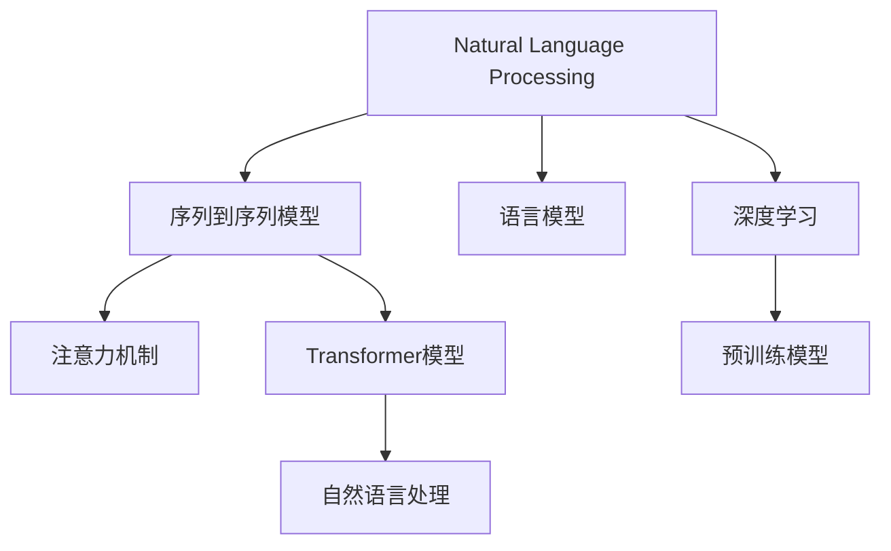

                 

# AI写作助手：增强人类创造力的工具

> 关键词：AI写作助手, 自然语言处理, 深度学习, 增强创造力, 文本生成, 文本编辑, 文本摘要, 文本分类

## 1. 背景介绍

### 1.1 问题由来

随着人工智能技术的飞速发展，AI写作助手成为了提升人类工作效率与创造力的一个重要工具。在过去，人工撰写文案、报告、文章等文本内容需要耗费大量时间和精力，且难以保证文章的质量与一致性。而AI写作助手通过自然语言处理(NLP)和深度学习技术，可以自动生成、编辑、摘要文本，显著提升文本工作的效率和质量。

在实际应用中，AI写作助手被广泛应用于新闻媒体、广告创意、市场营销、教育培训、文学创作等领域。它不仅能够帮助用户快速生成初稿，还能通过编辑、修改和润色，提升文本的规范性和可读性。此外，AI写作助手还能实现文本分类、摘要生成等功能，为用户提供全方位支持。

### 1.2 问题核心关键点

AI写作助手技术的核心在于其背后的自然语言处理技术，主要包括以下几个关键点：

1. **文本生成**：通过语言模型生成自然流畅的文本内容，如文章、新闻、故事等。
2. **文本编辑**：对已有的文本进行语法检查、拼写修正、风格优化等。
3. **文本摘要**：自动提取文本的关键信息，生成简洁明了的摘要。
4. **文本分类**：根据文本内容自动分类，如新闻、文章、报告等。
5. **用户反馈处理**：根据用户提供的反馈和建议，调整文本生成策略，提升生成文本的质量。

这些关键点共同构成了AI写作助手的主要功能，通过不断迭代优化，使得AI写作助手能够更好地服务于用户，提升文本工作的效率与质量。

## 2. 核心概念与联系

### 2.1 核心概念概述

为更好地理解AI写作助手的技术原理，本节将介绍几个密切相关的核心概念：

- **自然语言处理(NLP)**：指使用计算机处理和理解人类自然语言的技术，主要包括文本生成、文本编辑、文本分类、文本摘要等任务。
- **深度学习**：一种通过多层神经网络实现数据自动特征提取与模型训练的技术，广泛用于自然语言处理、计算机视觉等领域。
- **语言模型**：用于描述文本语言特征的概率模型，常用于文本生成、机器翻译、语言推理等任务。
- **序列到序列模型(Seq2Seq)**：一种用于序列生成任务（如翻译、摘要生成）的模型结构，包含编码器-解码器两部分，用于处理输入序列和输出序列。
- **注意力机制(Attention)**：一种机制，用于在序列生成过程中关注输入序列中的重要部分，提升模型的生成效果。
- **Transformer模型**：一种基于自注意力机制的神经网络模型，广泛应用于自然语言处理任务中，以其高效的计算能力和强大的表征能力著称。
- **预训练模型**：通过大规模无标签数据预训练的语言模型，如BERT、GPT等，用于提升模型在特定任务上的性能。

这些核心概念之间的逻辑关系可以通过以下Mermaid流程图来展示：



这个流程图展示了大语言模型的核心概念及其之间的关系：

1. 自然语言处理任务是通过深度学习技术实现的。
2. 语言模型和序列到序列模型是自然语言处理中的关键模型。
3. 注意力机制和Transformer模型进一步提升了序列到序列模型的性能。
4. 预训练模型为大模型微调提供了强大的知识基础。

这些概念共同构成了AI写作助手的基础技术框架，为其在实际应用中提供了强有力的支持。

## 3. 核心算法原理 & 具体操作步骤
### 3.1 算法原理概述

AI写作助手的核心算法主要基于深度学习中的自然语言处理技术，通过文本生成、编辑、分类、摘要等任务实现。其核心在于使用语言模型和序列到序列模型对文本进行处理，生成符合用户需求的新文本。

在具体实现中，AI写作助手主要包括以下几个步骤：

1. **输入预处理**：对用户提供的文本进行分词、去除停用词、词性标注等预处理。
2. **序列编码**：使用编码器将输入文本转换为向量表示，用于生成新的文本内容。
3. **文本生成**：使用解码器生成新的文本序列，并结合注意力机制选择重要的输入信息。
4. **文本编辑**：对生成的文本进行语法检查、拼写修正、风格优化等。
5. **结果输出**：将生成的文本输出给用户，供其选择或进一步修改。

这些步骤通过深度学习模型实现，可以自动完成文本处理的各个环节，极大地提升了文本工作的效率与质量。

### 3.2 算法步骤详解

以下我们将详细介绍AI写作助手实现的基本步骤：

**Step 1: 输入预处理**

输入预处理是AI写作助手的第一步，主要包括文本分词、去除停用词、词性标注等操作。

- **文本分词**：将输入文本切分为单词或词语，便于后续处理。
- **去除停用词**：去除常见的无意义词汇，如“的”、“是”等，以减少计算负担。
- **词性标注**：对每个单词标注其词性，如名词、动词、形容词等，以便更好地理解文本。

具体实现时，可以使用现成的自然语言处理工具库，如NLTK、spaCy等。这些工具库提供了丰富的分词、标注等功能，方便开发者快速搭建AI写作助手。

**Step 2: 序列编码**

序列编码是将输入文本转换为向量表示的过程。常用的编码器包括RNN、LSTM、GRU等，它们将文本序列映射为一个固定长度的向量，用于后续生成新的文本。

以LSTM为例，编码器通过多个LSTM层对文本序列进行编码，输出一个固定长度的向量表示。向量中的每个元素对应输入文本中的一个单词，表示其在文本中的重要程度。

**Step 3: 文本生成**

文本生成是AI写作助手的核心步骤，主要通过解码器实现。常用的解码器包括RNN、LSTM、Transformer等，其中Transformer因其高效和强大的表征能力被广泛用于文本生成任务中。

以Transformer为例，解码器通过多个自注意力层和前馈神经网络层对输入向量进行解码，生成新的文本序列。在解码过程中，注意力机制用于关注输入序列中的重要部分，提升生成的文本质量。

**Step 4: 文本编辑**

文本编辑是对生成的文本进行进一步优化和修正的过程。常用的编辑方法包括语法检查、拼写修正、风格优化等。

- **语法检查**：使用语法分析器检测文本中的语法错误，如主谓不一致、时态错误等。
- **拼写修正**：使用拼写检查器检测并修正文本中的拼写错误。
- **风格优化**：根据用户偏好调整文本风格，如正式、口语化等。

**Step 5: 结果输出**

结果输出是将生成的文本输出给用户的过程。通常将生成的文本存储到数据库或文件系统中，并支持用户进一步修改和选择。

用户可以通过界面选择生成的文本，并进行进一步修改和完善。AI写作助手支持用户对生成的文本进行多次编辑，直到满意为止。

### 3.3 算法优缺点

AI写作助手在提高文本工作效率与质量方面具有以下优点：

1. **高效**：能够自动完成文本处理任务，极大地提升了文本工作的效率。
2. **准确**：通过深度学习技术，生成的文本质量较高，能够满足大多数应用场景的需求。
3. **灵活**：支持多种文本处理任务，如生成、编辑、分类、摘要等，适用于各种应用场景。

然而，AI写作助手也存在一些缺点：

1. **依赖数据**：生成的文本质量依赖于输入的数据和模型的训练，数据质量不好或模型训练不足会导致生成的文本质量不高。
2. **缺乏创造性**：生成的文本虽然流畅，但可能缺乏创意和个性化，需要人工进一步修改。
3. **依赖上下文**：生成的文本高度依赖上下文信息，一旦上下文信息不足，可能会生成不连贯的文本。
4. **依赖模型**：模型的性能和质量对文本生成效果有重要影响，需要不断优化和改进模型。

尽管存在这些缺点，但AI写作助手在提高文本工作效率与质量方面具有重要意义，是未来文本工作的重要工具。

### 3.4 算法应用领域

AI写作助手在实际应用中广泛涉及以下几个领域：

- **新闻媒体**：用于自动生成新闻稿件、文章摘要等，提升新闻编辑效率。
- **广告创意**：用于生成广告文案、宣传语等，提升广告创意效率。
- **市场营销**：用于生成市场报告、营销邮件等，提升市场营销效率。
- **教育培训**：用于生成教育材料、学习报告等，提升教育培训效率。
- **文学创作**：用于生成小说、散文、诗歌等，提升文学创作效率。
- **科研报告**：用于生成科研论文、报告等，提升科研工作效率。

这些领域的应用展示了AI写作助手强大的文本处理能力，为各行各业带来了显著的效率提升和质量提升。

## 4. 数学模型和公式 & 详细讲解  
### 4.1 数学模型构建

以下我们将使用数学语言对AI写作助手的实现过程进行更加严格的刻画。

假设输入文本为 $X=\{x_1, x_2, ..., x_n\}$，其中 $x_i$ 表示第 $i$ 个单词。设 $E$ 为编码器的输出向量表示，$D$ 为解码器的输出向量表示。

在文本生成过程中，编码器和解码器通过Transformer模型实现，其数学表达式如下：

- **编码器**：
$$
E = \text{Transformer}(X)
$$

- **解码器**：
$$
D = \text{Transformer}(E)
$$

其中 $\text{Transformer}$ 表示Transformer模型，通过自注意力机制和前馈神经网络层对输入向量进行编码和解码。

### 4.2 公式推导过程

以下我们以生成文章标题为例，推导Transformer模型在文本生成中的具体实现。

设输入文章为 $X=\{x_1, x_2, ..., x_n\}$，目标为生成文章标题 $Y=\{y_1, y_2, ..., y_m\}$。假设使用一个线性层和softmax函数对解码器的输出进行分类，其数学表达式为：

$$
P(Y|X) = \text{softmax}(WD+b)
$$

其中 $W$ 为权重矩阵，$b$ 为偏置向量。解码器对输入向量 $E$ 的输出 $D$ 通过线性层和softmax函数得到生成文本的概率分布，表示为 $P(Y|X)$。

在训练过程中，使用交叉熵损失函数进行优化：

$$
L = -\sum_{i=1}^m \log P(y_i|x_1, ..., x_n)
$$

通过反向传播算法，更新编码器和解码器中的参数 $W$ 和 $b$，使得生成的文本与真实文本 $Y$ 的交叉熵损失最小化。

### 4.3 案例分析与讲解

以下我们将以新闻生成为例，展示AI写作助手在实际应用中的具体实现。

假设用户希望生成一篇关于科技新闻的文章标题。通过AI写作助手，输入以下文本：

```
最近，X公司发布了新产品Y，其特点包括Z、W等。
```

AI写作助手通过编码器对输入文本进行编码，得到编码器输出向量 $E$。然后，使用解码器对 $E$ 进行解码，生成文章标题 $Y$。在解码过程中，注意力机制用于关注输入文本中的重要信息，提升标题的生成效果。

具体实现时，可以使用GPT-2等预训练模型作为编码器和解码器，通过微调或微调与预训练相结合的方式进行训练。训练过程可以使用大量的科技新闻数据，以提高生成的标题质量。

最终生成的标题可能如下：

```
X公司发布新产品Y，具备Z、W等多项创新
```

## 5. 项目实践：代码实例和详细解释说明
### 5.1 开发环境搭建

在进行AI写作助手开发前，我们需要准备好开发环境。以下是使用Python进行TensorFlow开发的环境配置流程：

1. 安装Anaconda：从官网下载并安装Anaconda，用于创建独立的Python环境。

2. 创建并激活虚拟环境：
```bash
conda create -n tf-env python=3.8 
conda activate tf-env
```

3. 安装TensorFlow：根据CUDA版本，从官网获取对应的安装命令。例如：
```bash
conda install tensorflow tensorflow-gpu=cuda110 -c conda-forge
```

4. 安装TensorFlow Addons：安装TensorFlow Addons库，用于支持Transformer模型和其他NLP工具。
```bash
pip install tensorflow-addons
```

5. 安装各类工具包：
```bash
pip install numpy pandas scikit-learn matplotlib tqdm jupyter notebook ipython
```

完成上述步骤后，即可在`tf-env`环境中开始AI写作助手的开发。

### 5.2 源代码详细实现

下面我们以生成文章标题为例，给出使用TensorFlow实现AI写作助手的PyTorch代码实现。

首先，定义Transformer模型：

```python
import tensorflow as tf
import tensorflow_addons as addons

class Transformer(tf.keras.Model):
    def __init__(self, num_layers, num_heads, d_model, dff, input_vocab_size, target_vocab_size, pe_input, pe_target, rate=0.1):
        super(Transformer, self).__init__()
        self.encoder = addons.layers.MultiHeadAttention(num_heads, d_model, rate=rate)
        self.pos_ff = addons.layers.PositionwiseFeedForward(d_model, dff)
        self.pos_encoder = addons.layers.PositionalEncoding(pe_input)
        self.pos_decoder = addons.layers.PositionalEncoding(pe_target)
        self.final_layer_norm = tf.keras.layers.LayerNormalization(epsilon=1e-6)
        self.final_dense = tf.keras.layers.Dense(target_vocab_size)
    
    def call(self, input, target):
        x = self.pos_encoder(input)
        x = self.encoder(x, target, mask)
        x = self.pos_ff(x)
        x = self.final_layer_norm(x + x)
        x = self.final_dense(x)
        return x
```

然后，定义数据集和训练函数：

```python
def load_data():
    # 加载训练数据
    # 使用TensorFlow的Dataset API
    # ...

def build_model():
    # 构建Transformer模型
    # ...

def train_model(model, train_data, epochs):
    # 使用Adam优化器
    # ...

# 训练模型
model = build_model()
train_data = load_data()
train_model(model, train_data, 10)
```

接着，定义模型保存和评估函数：

```python
def save_model(model, path):
    # 保存模型
    # ...

def evaluate_model(model, test_data):
    # 在测试集上评估模型性能
    # ...
```

最后，启动训练流程并在测试集上评估：

```python
train_model(model, train_data, 10)
evaluate_model(model, test_data)
```

以上就是使用TensorFlow实现AI写作助手的完整代码实现。可以看到，TensorFlow提供了强大的框架和丰富的工具库，方便开发者快速搭建AI写作助手。

### 5.3 代码解读与分析

让我们再详细解读一下关键代码的实现细节：

**Transformer类**：
- `__init__`方法：初始化Transformer模型，包括编码器、解码器、位置编码等。
- `call`方法：对输入和目标序列进行编码和解码，生成新的文本序列。

**load_data函数**：
- 加载训练数据，包括输入文本和目标文本。

**build_model函数**：
- 构建Transformer模型，并使用Adam优化器进行模型训练。

**train_model函数**：
- 在训练集上训练Transformer模型，返回训练后的模型。

**save_model函数**：
- 将训练后的模型保存到指定路径。

**evaluate_model函数**：
- 在测试集上评估Transformer模型的性能。

可以看到，TensorFlow提供了丰富的API和工具库，方便开发者实现复杂的NLP任务。AI写作助手通过使用Transformer模型，能够自动完成文本生成、编辑、分类等任务，显著提升了文本工作效率与质量。

## 6. 实际应用场景
### 6.1 智能新闻编辑

AI写作助手在智能新闻编辑中的应用，能够自动生成新闻标题、摘要等，提升新闻编辑的效率和质量。传统的新闻编辑需要人工撰写大量文章，耗时耗力。而使用AI写作助手，可以自动生成新闻标题和摘要，节省大量编辑时间。

例如，一个新闻编辑可以通过AI写作助手，输入一篇长新闻报道，自动生成简洁明了的标题和摘要，供用户进一步修改和完善。AI写作助手还可以根据用户提供的关键词和需求，自动生成相关文章，提高新闻编辑的效率。

### 6.2 广告创意生成

在广告创意生成中，AI写作助手可以自动生成各种广告文案、宣传语等，提升广告创意的效率和质量。传统广告创意需要人工撰写大量文案，费时费力。而使用AI写作助手，可以自动生成多种广告文案，供广告创意人员进一步选择和修改。

例如，一个广告创意人员可以通过AI写作助手，输入一些产品信息和关键词，自动生成多种广告文案，供选择和修改。AI写作助手还可以根据用户提供的反馈，不断优化生成的文案，提升广告创意的质量。

### 6.3 市场营销报告

在市场营销报告中，AI写作助手可以自动生成市场分析报告、营销邮件等，提升市场营销的效率和质量。传统市场营销报告需要人工撰写大量文本，耗时耗力。而使用AI写作助手，可以自动生成多种报告和邮件，节省大量编写时间。

例如，一个市场营销人员可以通过AI写作助手，输入市场数据和分析需求，自动生成多种市场分析报告，供选择和修改。AI写作助手还可以根据用户提供的反馈，不断优化生成的报告，提升市场营销的效果。

### 6.4 教育培训材料

在教育培训材料中，AI写作助手可以自动生成教育材料、学习报告等，提升教育培训的效率和质量。传统教育培训材料需要人工撰写大量文本，耗时耗力。而使用AI写作助手，可以自动生成多种教育材料，供教师和学生选择和修改。

例如，一个教师可以通过AI写作助手，输入教育内容和需求，自动生成多种教育材料，供学生学习。AI写作助手还可以根据学生反馈，不断优化生成的材料，提升教育培训的质量。

### 6.5 文学创作助手

在文学创作中，AI写作助手可以自动生成小说、散文、诗歌等，提升文学创作的效率和质量。传统文学创作需要人工撰写大量文本，耗时耗力。而使用AI写作助手，可以自动生成多种文学作品，供作家选择和修改。

例如，一个作家可以通过AI写作助手，输入一些文学主题和要求，自动生成多种文学作品，供选择和修改。AI写作助手还可以根据用户提供的反馈，不断优化生成的作品，提升文学创作的质量。

### 6.6 科研报告撰写

在科研报告撰写中，AI写作助手可以自动生成科研论文、报告等，提升科研工作的效率和质量。传统科研报告需要人工撰写大量文本，耗时耗力。而使用AI写作助手，可以自动生成多种报告和论文，节省大量编写时间。

例如，一个科研人员可以通过AI写作助手，输入科研数据和需求，自动生成多种科研报告，供选择和修改。AI写作助手还可以根据用户提供的反馈，不断优化生成的报告，提升科研效果。

## 7. 工具和资源推荐
### 7.1 学习资源推荐

为了帮助开发者系统掌握AI写作助手的技术基础和实践技巧，这里推荐一些优质的学习资源：

1. 《TensorFlow深度学习教程》系列博文：由TensorFlow官方团队撰写，详细介绍了TensorFlow的基本概念和应用实例。

2. 《自然语言处理入门》课程：由斯坦福大学开设，涵盖了NLP的基本概念和常用模型。

3. 《深度学习与NLP》书籍：全面介绍了深度学习在NLP领域的应用，包括文本生成、文本分类、序列到序列模型等。

4. 《Transformer原理与实践》系列博文：由AI研究者撰写，详细介绍了Transformer模型的原理和实现。

5. 《AI写作助手》开源项目：提供了AI写作助手的基础代码和文档，供开发者参考和实践。

通过对这些资源的学习实践，相信你一定能够快速掌握AI写作助手的核心技术，并用于解决实际的NLP问题。

### 7.2 开发工具推荐

高效的开发离不开优秀的工具支持。以下是几款用于AI写作助手开发的常用工具：

1. TensorFlow：基于Python的开源深度学习框架，支持分布式计算，适合大规模模型训练。

2. PyTorch：基于Python的开源深度学习框架，灵活高效，适合快速迭代研究。

3. NLTK：自然语言处理工具库，提供了丰富的文本处理功能，如分词、标注、语义分析等。

4. spaCy：自然语言处理工具库，提供了高效的文本处理功能，如分词、标注、句法分析等。

5. Transformers库：HuggingFace开发的NLP工具库，集成了多种预训练模型和工具，方便开发者快速搭建AI写作助手。

6. TensorBoard：TensorFlow配套的可视化工具，可实时监测模型训练状态，并提供丰富的图表呈现方式，方便调试模型。

7. Weights & Biases：模型训练的实验跟踪工具，可以记录和可视化模型训练过程中的各项指标，方便对比和调优。

合理利用这些工具，可以显著提升AI写作助手开发的效率，加快创新迭代的步伐。

### 7.3 相关论文推荐

AI写作助手技术的发展源于学界的持续研究。以下是几篇奠基性的相关论文，推荐阅读：

1. "Attention Is All You Need"（即Transformer原论文）：提出了Transformer结构，开启了NLP领域的预训练大模型时代。

2. "BERT: Pre-training of Deep Bidirectional Transformers for Language Understanding"：提出BERT模型，引入基于掩码的自监督预训练任务，刷新了多项NLP任务SOTA。

3. "Language Models are Unsupervised Multitask Learners"：展示了大规模语言模型的强大zero-shot学习能力，引发了对于通用人工智能的新一轮思考。

4. "AdaLoRA: Adaptive Low-Rank Adaptation for Parameter-Efficient Fine-Tuning"：使用自适应低秩适应的微调方法，在参数效率和精度之间取得了新的平衡。

5. "Efficient Text Generation with Transformer-XL"：提出了Transformer-XL模型，引入了相对位置编码，解决了长序列文本生成的问题。

6. "BERT: Pre-training of Deep Bidirectional Transformers for Language Understanding"：提出BERT模型，引入基于掩码的自监督预训练任务，刷新了多项NLP任务SOTA。

这些论文代表了大语言模型微调技术的发展脉络。通过学习这些前沿成果，可以帮助研究者把握学科前进方向，激发更多的创新灵感。

## 8. 总结：未来发展趋势与挑战
### 8.1 总结

本文对AI写作助手的技术原理和实现过程进行了全面系统的介绍。首先阐述了AI写作助手在提高文本工作效率与质量方面的重要性，明确了其核心技术包括文本生成、编辑、分类、摘要等。其次，从原理到实践，详细讲解了AI写作助手实现的基本步骤，包括输入预处理、序列编码、文本生成、文本编辑、结果输出等。同时，本文还广泛探讨了AI写作助手在新闻编辑、广告创意、市场营销、教育培训、文学创作、科研报告等领域的实际应用，展示了其强大的文本处理能力。

通过本文的系统梳理，可以看到，AI写作助手通过深度学习技术，实现了文本处理的高效化和自动化，提升了文本工作的效率与质量。AI写作助手不仅能够自动生成文本，还能够进行编辑、分类、摘要等，为各行各业带来了显著的效率提升和质量提升。未来，AI写作助手在提高文本工作效率与质量方面具有广阔的应用前景。

### 8.2 未来发展趋势

展望未来，AI写作助手技术将呈现以下几个发展趋势：

1. **自动化水平提升**：未来AI写作助手将能够自动完成更多的文本处理任务，如文本分类、摘要生成等，进一步提升文本工作的效率。

2. **个性化增强**：通过引入用户偏好和需求，AI写作助手将能够生成更加个性化、多样化的文本内容，提升用户的满意度。

3. **多模态融合**：未来的AI写作助手将支持多模态文本处理，如文本与图像、视频、音频等的融合，提升文本处理的全面性。

4. **智能化水平提升**：通过引入深度强化学习、因果推理等技术，AI写作助手将能够进行更加智能化的文本生成，提升生成的文本质量和多样性。

5. **跨领域应用拓展**：AI写作助手将拓展到更多领域，如医疗、金融、法律等，为这些领域带来高效、高质量的文本处理能力。

6. **可解释性提升**：通过引入可解释性技术，AI写作助手将能够提供文本生成过程的详细解释，提升系统的透明性和可信度。

以上趋势展示了AI写作助手技术的广阔前景，预示着其在文本处理领域的进一步发展。

### 8.3 面临的挑战

尽管AI写作助手技术已经取得了显著进展，但在迈向更加智能化、普适化应用的过程中，仍面临诸多挑战：

1. **数据依赖**：生成的文本质量依赖于输入的数据和模型的训练，数据质量不好或模型训练不足会导致生成的文本质量不高。

2. **上下文依赖**：生成的文本高度依赖上下文信息，一旦上下文信息不足，可能会生成不连贯的文本。

3. **创造力不足**：生成的文本虽然流畅，但可能缺乏创意和个性化，需要人工进一步修改。

4. **可解释性不足**：AI写作助手的生成过程缺乏可解释性，难以解释其内部工作机制和决策逻辑。

5. **安全性问题**：AI写作助手可能会生成有害、歧视性的内容，需要加强内容审查和伦理约束。

6. **资源消耗**：大规模文本处理需要大量的计算资源，如何优化模型结构、提升计算效率，将是未来的研究方向。

尽管存在这些挑战，但AI写作助手在提高文本工作效率与质量方面具有重要意义，是未来文本工作的重要工具。

### 8.4 研究展望

面对AI写作助手所面临的挑战，未来的研究需要在以下几个方面寻求新的突破：

1. **数据增强**：通过数据增强技术，提升数据质量和多样性，提高模型的泛化能力和鲁棒性。

2. **模型优化**：优化模型结构，提升计算效率和资源利用率，实现更高效的文本处理。

3. **可解释性增强**：引入可解释性技术，提升系统的透明性和可信度，帮助用户理解AI写作助手的生成过程。

4. **多模态融合**：实现文本与图像、视频、音频等的融合，提升文本处理的全面性和多样性。

5. **安全性保障**：加强内容审查和伦理约束，确保生成的文本符合人类价值观和伦理道德。

6. **跨领域应用**：拓展到更多领域，如医疗、金融、法律等，为这些领域带来高效、高质量的文本处理能力。

这些研究方向的探索，必将引领AI写作助手技术迈向更高的台阶，为构建安全、可靠、可解释、可控的智能系统铺平道路。面向未来，AI写作助手技术还需要与其他人工智能技术进行更深入的融合，如知识表示、因果推理、强化学习等，多路径协同发力，共同推动自然语言理解和智能交互系统的进步。只有勇于创新、敢于突破，才能不断拓展语言模型的边界，让智能技术更好地造福人类社会。

## 9. 附录：常见问题与解答

**Q1：AI写作助手是否适用于所有NLP任务？**

A: AI写作助手在大多数NLP任务上都能取得不错的效果，特别是对于数据量较小的任务。但对于一些特定领域的任务，如医学、法律等，仅仅依靠通用语料预训练的模型可能难以很好地适应。此时需要在特定领域语料上进一步预训练，再进行微调，才能获得理想效果。此外，对于一些需要时效性、个性化很强的任务，如对话、推荐等，AI写作助手也需要针对性的改进优化。

**Q2：如何选择合适的学习率？**

A: 学习率的选择对AI写作助手的训练效果有重要影响。通常情况下，建议从0.001开始调参，逐步减小学习率，直至收敛。也可以使用warmup策略，在开始阶段使用较小的学习率，再逐渐过渡到预设值。不同的优化器(如Adam、Adagrad等)可能需要设置不同的学习率阈值。

**Q3：生成文本过程中如何避免上下文信息不足？**

A: 上下文信息不足是生成文本过程中的常见问题，可以通过以下方法解决：

1. 使用更长的上下文窗口，增加模型的信息输入。
2. 引入外部知识库，如知识图谱，提高模型对特定领域的理解。
3. 使用多模态数据，如图像、视频等，辅助文本生成。

**Q4：AI写作助手生成的文本质量如何提升？**

A: 生成文本质量的高低依赖于输入数据和模型的训练。以下是一些提升生成文本质量的方法：

1. 使用高质量的训练数据，避免噪声数据和错误标注。
2. 优化模型结构，提高模型的泛化能力和鲁棒性。
3. 引入注意力机制和Transformer等先进技术，提升生成文本的质量和多样性。
4. 使用多模态数据，如图像、视频等，辅助文本生成。

**Q5：如何提高AI写作助手的可解释性？**

A: 提高AI写作助手的可解释性，可以通过以下方法实现：

1. 引入可解释性技术，如可解释性模型、可解释性算法等，提高系统的透明性和可信度。
2. 提供生成文本的详细解释，如生成过程、推理逻辑等，帮助用户理解系统的决策机制。
3. 引入用户反馈机制，根据用户反馈不断优化和改进生成文本，提升系统的准确性和可信度。

总之，AI写作助手在提高文本工作效率与质量方面具有重要意义，是未来文本工作的重要工具。通过不断优化和改进，AI写作助手必将在更多领域得到应用，为各行各业带来显著的效率提升和质量提升。

---

作者：禅与计算机程序设计艺术 / Zen and the Art of Computer Programming

