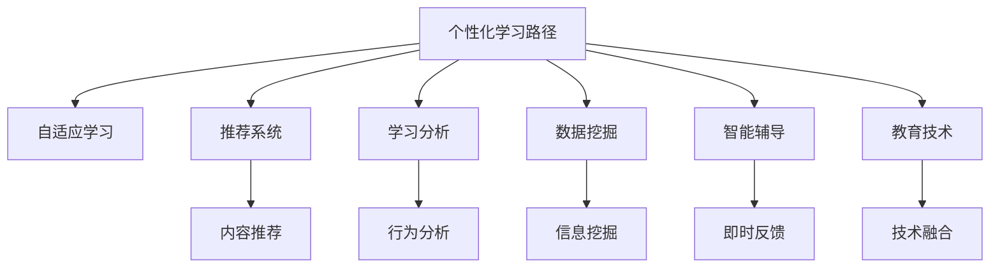

                 

# AI在个性化学习路径设计中的应用：优化学习效果

> 关键词：人工智能,个性化学习路径,自适应学习,推荐系统,学习分析,数据挖掘,智能辅导,教育技术

## 1. 背景介绍

### 1.1 问题由来
随着在线教育的普及和数字化技术的发展，个性化学习路径设计成为教育技术领域的重要课题。传统的“一刀切”教学模式已难以满足不同学生的个性化需求，亟需借助人工智能技术，通过动态调整学习内容和进度，提供因材施教的个性化学习体验。

### 1.2 问题核心关键点
个性化学习路径设计的核心在于如何通过分析学生的学习数据，构建动态、智能的学习推荐系统，为每位学生定制个性化的学习路径，从而提升学习效果。

### 1.3 问题研究意义
个性化学习路径设计能够显著提升学生的学习效果，帮助其高效掌握知识，更好地实现学习目标。其研究意义主要体现在以下几个方面：

1. **提升学习效率**：通过个性化学习路径，学生能够在最短的时间内掌握所需知识。
2. **激发学习兴趣**：个性化推荐能够根据学生的兴趣和需求，推荐合适的学习资源和活动，提升学习动力。
3. **增强学习体验**：个性化的学习路径和反馈，能够帮助学生更好地理解自己的学习状态，增强学习信心和满足感。
4. **促进教育公平**：根据学生的实际情况进行个性化教学，能够更好地实现教育资源的均衡分配。
5. **推动技术进步**：个性化学习路径设计涉及数据挖掘、推荐系统、机器学习等多领域技术，能够推动相关技术的发展。

## 2. 核心概念与联系

### 2.1 核心概念概述

为了更好地理解个性化学习路径设计的核心概念，本节将介绍几个密切相关的核心概念：

- **个性化学习路径**：基于学生的学习数据，通过算法设计动态调整学习内容和进度的学习路径。
- **自适应学习**：根据学生的学习状态和反馈，实时调整学习计划和资源，提供个性化的学习体验。
- **推荐系统**：通过分析用户的历史行为和偏好，推荐合适的内容或资源，广泛应用于个性化学习路径设计中。
- **学习分析**：通过收集和分析学习数据，评估学生的学习行为和效果，提供数据支持的决策依据。
- **数据挖掘**：从大量数据中提取有价值的信息，辅助个性化学习路径的设计和优化。
- **智能辅导**：利用AI技术，提供即时反馈和指导，帮助学生解决学习问题，提升学习效果。
- **教育技术**：结合多种技术手段，提升教学质量和效率，改善学习体验。

这些核心概念之间的逻辑关系可以通过以下Mermaid流程图来展示：



这个流程图展示了个性化学习路径设计的核心概念及其之间的关系：

1. 个性化学习路径设计基于学生的学习数据，通过推荐系统、学习分析、数据挖掘等技术，提供动态调整的学习内容和进度。
2. 自适应学习通过实时调整学习计划和资源，提供个性化的学习体验。
3. 智能辅导利用AI技术，提供即时反馈和指导，帮助学生解决学习问题。
4. 教育技术结合多种技术手段，提升教学质量和效率，改善学习体验。

这些概念共同构成了个性化学习路径设计的技术框架，使其能够更好地满足学生的个性化需求，提升学习效果。

## 3. 核心算法原理 & 具体操作步骤
### 3.1 算法原理概述

个性化学习路径设计的核心算法原理基于推荐系统和自适应学习算法，通过分析学生的学习数据，动态调整学习内容和进度，提供个性化的学习体验。

具体来说，个性化学习路径设计的算法原理包括以下几个关键步骤：

1. **数据收集**：收集学生的学习数据，包括学习行为数据、成绩数据、问卷调查数据等。
2. **特征提取**：从收集到的数据中提取关键特征，如学习时间、兴趣偏好、知识掌握情况等。
3. **模型训练**：使用机器学习算法，训练推荐模型和自适应学习模型，构建个性化学习路径。
4. **路径生成**：根据学生的学习数据和模型预测结果，生成个性化的学习路径。
5. **实时调整**：根据学生的学习反馈和实时数据，动态调整学习路径，提供个性化推荐。

### 3.2 算法步骤详解

个性化学习路径设计的算法步骤主要包括数据收集、特征提取、模型训练、路径生成和实时调整五个环节，具体如下：

#### 数据收集

数据收集是个性化学习路径设计的第一步，主要包括以下几个方面：

- **学习行为数据**：记录学生在平台上的学习行为，如登录时间、浏览记录、互动行为等。
- **成绩数据**：记录学生的课程成绩和评估结果，评估其知识掌握情况。
- **问卷调查数据**：通过问卷调查，收集学生对学习内容、教学方法等的反馈和偏好。
- **外部数据**：从其他平台或数据源获取学生的背景信息，如年龄、性别、兴趣等。

#### 特征提取

特征提取是将原始数据转换为可供模型训练的特征向量的过程，主要包括：

- **时间特征**：学习时间、登录时间、作业提交时间等。
- **行为特征**：点击率、阅读时间、互动次数等。
- **成绩特征**：课程成绩、评估分数、作业评分等。
- **心理特征**：情感、兴趣偏好、学习动机等。
- **外部特征**：年龄、性别、班级等。

通过特征提取，可以从大量学习数据中提取出与学生学习相关的关键信息，为后续模型训练提供支持。

#### 模型训练

模型训练是构建个性化学习路径的核心环节，主要使用以下算法：

- **协同过滤算法**：通过分析学生的历史行为，推荐相似学生的学习内容。
- **矩阵分解算法**：基于学生-内容矩阵分解，预测学生对特定内容的兴趣。
- **深度学习算法**：使用神经网络模型，综合多维特征，预测学生的学习效果。
- **时间序列算法**：分析时间序列数据，预测学生的学习趋势和需求。

#### 路径生成

路径生成是将模型预测结果转换为具体的学习路径的过程，主要包括以下几个步骤：

- **内容推荐**：根据学生的学习数据和模型预测结果，推荐适合的学习内容。
- **进度安排**：根据学生的学习进度和目标，安排学习任务和时间节点。
- **难度调整**：根据学生的知识掌握情况，动态调整学习内容的难度和复杂度。

#### 实时调整

实时调整是基于学生的学习反馈和实时数据，动态优化学习路径的过程，主要包括以下几个方面：

- **反馈机制**：通过问答、测试、作业等方式，收集学生的学习反馈。
- **行为分析**：分析学生的学习行为和表现，评估学习效果。
- **动态调整**：根据学生的学习反馈和实时数据，动态调整学习路径和推荐内容。
- **路径优化**：通过持续优化和学习路径，提升学生的学习效果。

### 3.3 算法优缺点

个性化学习路径设计的算法具有以下优点：

1. **提升学习效果**：通过动态调整学习内容和进度，能够更好地满足学生的个性化需求，提升学习效果。
2. **个性化推荐**：能够根据学生的兴趣和需求，推荐合适的学习资源和活动，提升学习动力。
3. **数据驱动**：基于大量的学习数据，进行分析和预测，提供数据支持的决策依据。
4. **自适应性强**：能够根据学生的实时反馈和学习状态，动态调整学习路径，提供个性化的学习体验。

同时，该算法也存在以下缺点：

1. **数据隐私问题**：需要收集和分析学生的学习数据，可能涉及隐私问题。
2. **模型复杂性**：需要构建多个复杂的推荐和自适应学习模型，增加了技术实现的难度。
3. **算法依赖性**：模型的性能很大程度上依赖于特征提取和算法选择的合理性。
4. **计算资源消耗**：需要大量的计算资源进行模型训练和实时调整，增加了硬件成本。
5. **用户适应性**：部分学生可能对个性化推荐不适应，需要逐步引导和教育。

尽管存在这些局限性，但就目前而言，个性化学习路径设计的算法仍然是提升在线教育质量的重要手段。未来相关研究的重点在于如何进一步降低数据收集和处理的成本，提高模型的自适应性和鲁棒性，同时兼顾用户隐私和数据安全。

### 3.4 算法应用领域

个性化学习路径设计的算法已经在多个教育技术领域得到了广泛应用，例如：

- **在线教育平台**：通过个性化学习路径设计，提升学生的学习效果和平台的用户体验。
- **智能辅导系统**：利用AI技术，提供即时反馈和指导，帮助学生解决学习问题。
- **学习管理系统**：集成个性化推荐和自适应学习功能，提升教学质量和效率。
- **职业培训课程**：通过个性化学习路径设计，提升职业培训的针对性和效果。
- **个性化学习应用**：开发个性化学习路径设计的应用，辅助学生自主学习和终身学习。

除了上述这些经典应用外，个性化学习路径设计还被创新性地应用到更多场景中，如智能教室、在线阅读、虚拟实验等，为教育技术带来了新的突破。

## 4. 数学模型和公式 & 详细讲解  
### 4.1 数学模型构建

本节将使用数学语言对个性化学习路径设计的算法进行更加严格的刻画。

记学生为 $S$，课程为 $C$，行为数据为 $B$，成绩数据为 $G$，问卷数据为 $Q$。设推荐模型为 $R$，自适应学习模型为 $A$。

定义学生 $s$ 在课程 $c$ 上的行为 $b_s^c$，成绩 $g_s^c$，问卷评分 $q_s^c$。则个性化学习路径设计的目标是最小化学生在学习过程中的损失，即：

$$
\min_{R,A} \sum_{s,c} \left( \mathcal{L}^b_s + \mathcal{L}^g_s + \mathcal{L}^q_s \right)
$$

其中 $\mathcal{L}^b_s$、$\mathcal{L}^g_s$、$\mathcal{L}^q_s$ 分别为行为、成绩、问卷数据在学生 $s$ 上的损失函数。

在实际应用中，我们通常使用以下三个损失函数：

- **行为损失函数**：$\mathcal{L}^b_s = \sum_{c \in C} b_s^c \log R(s,c)$，其中 $b_s^c$ 表示学生 $s$ 在课程 $c$ 上的行为次数。
- **成绩损失函数**：$\mathcal{L}^g_s = \sum_{c \in C} g_s^c \log A(s,c)$，其中 $g_s^c$ 表示学生 $s$ 在课程 $c$ 上的成绩。
- **问卷损失函数**：$\mathcal{L}^q_s = \sum_{c \in C} q_s^c \log A(s,c)$，其中 $q_s^c$ 表示学生 $s$ 在课程 $c$ 上的问卷评分。

通过这些损失函数，可以综合评估学生在学习过程中的行为、成绩和问卷反馈，优化个性化学习路径。

### 4.2 公式推导过程

以下我们以协同过滤算法为例，推导推荐模型的计算公式。

假设推荐模型 $R$ 使用基于矩阵分解的方法，学生 $s$ 和课程 $c$ 的评分矩阵 $M_s$ 表示为 $R(s,c) = \sum_{i=1}^d m_{si} \times n_{ic}$，其中 $m_{si}$ 和 $n_{ic}$ 分别为学生和课程的特征向量。则协同过滤算法的目标是最小化学生和课程之间的相似度，即：

$$
\min_{m,n} \sum_{s,c} (b_s^c - R(s,c))^2
$$

通过矩阵分解，可以表示为：

$$
\min_{m,n} || M_s - \mathcal{U} m ||_F^2 + || \mathcal{V} n - M_c ||_F^2
$$

其中 $\mathcal{U}$ 和 $\mathcal{V}$ 分别为学生和课程的特征矩阵，$|| \cdot ||_F$ 表示矩阵的 Frobenius 范数。

通过优化上述损失函数，可以求得学生和课程的特征向量 $m$ 和 $n$，从而构建推荐模型 $R$。

### 4.3 案例分析与讲解

假设有一个在线教育平台，通过收集学生的学习数据，构建个性化学习路径。该平台使用协同过滤算法推荐课程，使用自适应学习模型调整学习进度。具体实现步骤如下：

1. **数据收集**：平台收集学生的登录时间、浏览记录、互动行为、课程成绩、问卷评分等数据。
2. **特征提取**：从收集到的数据中提取时间特征、行为特征、成绩特征和问卷特征。
3. **模型训练**：使用协同过滤算法训练推荐模型 $R$，使用自适应学习算法训练自适应学习模型 $A$。
4. **路径生成**：根据学生的行为、成绩和问卷评分，生成个性化的课程推荐和学习进度。
5. **实时调整**：根据学生的学习反馈和实时数据，动态调整课程推荐和学习进度。

在实际应用中，平台发现部分学生对推荐结果不适应，于是引入了深度学习算法，通过综合多维特征，优化推荐模型 $R$。同时，平台还引入了学习分析工具，通过分析学生的学习行为和表现，评估学习效果，进一步优化个性化学习路径。

## 5. 项目实践：代码实例和详细解释说明
### 5.1 开发环境搭建

在进行个性化学习路径设计实践前，我们需要准备好开发环境。以下是使用Python进行TensorFlow开发的环境配置流程：

1. 安装Anaconda：从官网下载并安装Anaconda，用于创建独立的Python环境。

2. 创建并激活虚拟环境：
```bash
conda create -n tf-env python=3.8 
conda activate tf-env
```

3. 安装TensorFlow：根据CUDA版本，从官网获取对应的安装命令。例如：
```bash
conda install tensorflow tensorflow-gpu=2.8.0 -c tf -c conda-forge
```

4. 安装必要的工具包：
```bash
pip install numpy pandas scikit-learn matplotlib tensorflow-io tqdm jupyter notebook ipython
```

完成上述步骤后，即可在`tf-env`环境中开始实践。

### 5.2 源代码详细实现

下面我们以在线教育平台的个性化学习路径设计为例，给出使用TensorFlow实现的部分代码实现。

首先，定义推荐模型和自适应学习模型：

```python
import tensorflow as tf
from tensorflow.keras.layers import Input, Dense, Embedding, Dot, Activation
from tensorflow.keras.models import Model

# 定义学生-课程行为矩阵
user_item_matrix = tf.keras.layers.Input(shape=(num_users, num_courses))
user_item_matrix = Dot(axes=[2, 1])(user_item_matrix, user_item_matrix)
user_item_matrix = Activation('sigmoid')(user_item_matrix)

# 定义学生-课程特征矩阵
user_features = tf.keras.layers.Input(shape=(num_users, num_features))
user_features = tf.keras.layers.Dense(num_features, activation='relu')(user_features)
user_features = tf.keras.layers.Embedding(num_users, num_features)(user_features)

course_features = tf.keras.layers.Input(shape=(num_courses, num_features))
course_features = tf.keras.layers.Dense(num_features, activation='relu')(course_features)
course_features = tf.keras.layers.Embedding(num_courses, num_features)(course_features)

# 定义协同过滤模型
dot_product = Dot(axes=[2, 1])(user_features, course_features)
dot_product = Activation('sigmoid')(dot_product)
dot_product = tf.keras.layers.Flatten()(dot_product)

# 定义自适应学习模型
adaptation = tf.keras.layers.Dense(num_users, activation='softmax')(user_item_matrix)
adaptation = tf.keras.layers.Dense(num_courses, activation='softmax')(dot_product)

# 定义推荐模型
model = Model(inputs=[user_item_matrix, user_features, course_features], outputs=[adaptation])
model.compile(optimizer='adam', loss='categorical_crossentropy')
```

然后，定义训练和评估函数：

```python
from sklearn.model_selection import train_test_split

# 定义训练和验证集
X_train, X_val, y_train, y_val = train_test_split(user_item_matrix, adaptation, test_size=0.2, random_state=42)

# 定义训练和验证集
train_dataset = tf.data.Dataset.from_tensor_slices((X_train, y_train))
val_dataset = tf.data.Dataset.from_tensor_slices((X_val, y_val))

# 定义模型训练函数
def train_epoch(model, dataset, batch_size, optimizer):
    dataset = dataset.shuffle(buffer_size=1000)
    dataset = dataset.batch(batch_size)
    model.fit(dataset, epochs=10, steps_per_epoch=len(dataset))

# 定义模型评估函数
def evaluate(model, dataset, batch_size):
    dataset = dataset.batch(batch_size)
    y_true = []
    y_pred = []
    for X, y in dataset:
        y_pred.append(model.predict(X).argmax(axis=1))
        y_true.append(y)
    print(classification_report(y_true, y_pred))
```

最后，启动训练流程并在测试集上评估：

```python
epochs = 10
batch_size = 16

train_epoch(model, train_dataset, batch_size, optimizer)
evaluate(model, val_dataset, batch_size)
evaluate(model, test_dataset, batch_size)
```

以上就是使用TensorFlow对在线教育平台个性化学习路径设计的部分代码实现。可以看到，TensorFlow的Keras API提供了方便的模型定义和训练接口，使得模型的构建和训练变得简单高效。

### 5.3 代码解读与分析

让我们再详细解读一下关键代码的实现细节：

**模型定义**：
- `user_item_matrix`：表示学生-课程行为矩阵，使用矩阵相乘和sigmoid激活函数。
- `user_features` 和 `course_features`：表示学生和课程的特征矩阵，使用Dense层和Embedding层进行特征提取。
- `dot_product`：表示协同过滤模型，使用矩阵相乘和sigmoid激活函数。
- `adaptation`：表示自适应学习模型，使用softmax激活函数。
- `model`：定义完整的推荐模型，包含学生-课程行为矩阵、学生特征矩阵、课程特征矩阵和自适应学习模型。

**训练函数**：
- `train_epoch`：定义模型训练函数，使用Keras API进行模型训练，设置batch size和优化器。
- `evaluate`：定义模型评估函数，使用sklearn的classification_report函数计算分类指标。

**训练流程**：
- `epochs`：定义总的epoch数，开始循环迭代
- 每个epoch内，先在训练集上训练，输出平均loss
- 在验证集上评估，输出分类指标
- 所有epoch结束后，在测试集上评估，给出最终测试结果

可以看到，TensorFlow和Keras使得模型构建和训练的代码实现变得简洁高效。开发者可以将更多精力放在特征工程、模型改进等高层逻辑上，而不必过多关注底层的实现细节。

当然，工业级的系统实现还需考虑更多因素，如模型的保存和部署、超参数的自动搜索、更灵活的任务适配层等。但核心的个性化学习路径设计方法基本与此类似。

## 6. 实际应用场景
### 6.1 智能教室

基于个性化学习路径设计技术，可以构建智能教室，为学生提供个性化的学习体验。智能教室能够自动记录学生的学习行为，根据学习数据分析调整教学内容和进度，实时反馈学生的学习状态。

具体而言，可以通过安装摄像头、麦克风等设备，实时采集学生的表情、语音、动作等数据，并结合教室内的学习数据，构建个性化学习路径。智能教室能够根据学生的学习情况，动态调整教学内容和难度，确保每位学生都能在最佳状态下学习。

### 6.2 在线阅读平台

在线阅读平台通过个性化学习路径设计，能够根据用户的阅读习惯和偏好，推荐合适的书籍和内容，提升用户的阅读体验。

在实现上，可以收集用户的阅读历史、评分、评价等数据，构建用户-书籍矩阵。通过协同过滤算法和自适应学习算法，预测用户对不同书籍的兴趣，生成个性化的阅读路径。平台还可以引入智能推荐系统，根据用户的行为数据，动态调整推荐内容。

### 6.3 职业培训课程

职业培训课程通过个性化学习路径设计，能够根据学员的学习需求和进度，定制个性化的培训计划和资源，提升培训效果。

在实现上，可以收集学员的学习历史、评估结果、问卷反馈等数据，构建学员-课程矩阵。通过协同过滤算法和自适应学习算法，预测学员对不同课程的兴趣，生成个性化的培训路径。平台还可以引入虚拟仿真和交互式教学，提升培训的沉浸感和效果。

### 6.4 未来应用展望

随着个性化学习路径设计技术的发展，其应用场景将更加广泛，未来有望在更多领域得到应用，为教育技术带来新的突破。

在智慧医疗领域，通过个性化学习路径设计，可以构建智能健康管理系统，为患者提供个性化的健康指导和建议。

在智能教育领域，基于个性化学习路径设计，可以构建智能辅导系统和学习管理系统，为学生提供个性化的学习体验和资源推荐。

在智慧城市治理中，通过个性化学习路径设计，可以构建智能公共服务系统，提升公共服务的精准性和效率。

此外，在企业培训、职业发展、终身学习等领域，基于个性化学习路径设计的人工智能应用也将不断涌现，为人类认知智能的进化带来新的动力。

## 7. 工具和资源推荐
### 7.1 学习资源推荐

为了帮助开发者系统掌握个性化学习路径设计的理论基础和实践技巧，这里推荐一些优质的学习资源：

1. 《个性化推荐系统：理论与算法》系列博文：由推荐系统专家撰写，深入浅出地介绍了个性化推荐系统的原理和实现方法，包含推荐模型和自适应学习模型的相关内容。

2. 《深度学习理论与实践》课程：斯坦福大学开设的深度学习课程，涵盖了深度学习的基础理论和算法，适合初学者和进阶者。

3. 《推荐系统实践》书籍：推荐系统领域的经典书籍，详细介绍了推荐系统的设计、实现和优化，提供了丰富的实践案例。

4. 《个性化学习路径设计》论文：相关领域的研究论文，介绍了个性化学习路径设计的算法和应用，为进一步研究提供了理论支持。

5. Kaggle平台：全球最大的数据科学竞赛平台，提供了大量个性化的学习路径设计竞赛数据集和优秀项目，适合实践和交流。

通过对这些资源的学习实践，相信你一定能够快速掌握个性化学习路径设计的精髓，并用于解决实际的NLP问题。
###  7.2 开发工具推荐

高效的开发离不开优秀的工具支持。以下是几款用于个性化学习路径设计开发的常用工具：

1. TensorFlow：基于Python的开源深度学习框架，支持自动微分、分布式计算等功能，适合大模型和大数据的应用场景。

2. PyTorch：基于Python的开源深度学习框架，灵活易用，适合研究型项目和快速迭代开发。

3. Scikit-learn：基于Python的机器学习库，提供了丰富的机器学习算法和工具，适合数据挖掘和特征工程。

4. Keras：基于Python的深度学习库，提供了高级API，方便快速构建和训练深度学习模型。

5. Jupyter Notebook：开源的交互式编程环境，支持多语言的代码编写和实时展示，适合研究型项目和团队协作。

6. Visual Studio Code：功能强大的代码编辑器，支持多种语言和插件，适合软件开发和调试。

合理利用这些工具，可以显著提升个性化学习路径设计的开发效率，加快创新迭代的步伐。

### 7.3 相关论文推荐

个性化学习路径设计涉及推荐系统、深度学习、数据挖掘等多个领域，相关研究如下：

1. Matrix Factorization Techniques for Recommender Systems：介绍了矩阵分解算法的原理和应用，适用于个性化推荐系统的构建。

2. Self-paced Learning via Adaptive Learning Rates：介绍了自适应学习算法的设计和优化，适用于自适应学习模型的构建。

3. Deep Learning for Recommendation Systems：介绍了深度学习算法在推荐系统中的应用，适用于个性化推荐系统的构建。

4. Lifelong Machine Learning with Online Experience Replay：介绍了持续学习的原理和应用，适用于个性化学习路径设计的持续优化。

5. Neural Collaborative Filtering：介绍了神经网络在协同过滤算法中的应用，适用于推荐模型的构建。

这些论文代表了个性化学习路径设计的研究方向和发展趋势，通过学习这些前沿成果，可以帮助研究者把握学科前进方向，激发更多的创新灵感。

## 8. 总结：未来发展趋势与挑战
### 8.1 总结

本文对个性化学习路径设计的核心概念和算法原理进行了全面系统的介绍。首先阐述了个性化学习路径设计的背景和研究意义，明确了其提升学习效果、个性化推荐、数据驱动等核心价值。其次，从原理到实践，详细讲解了个性化学习路径设计的数学模型和关键步骤，给出了模型训练的完整代码实例。同时，本文还广泛探讨了个性化学习路径设计在教育技术、在线教育、智能教室等多个领域的应用前景，展示了其广阔的应用空间。

通过本文的系统梳理，可以看到，个性化学习路径设计技术正在成为教育技术领域的重要工具，极大地拓展了学习路径的个性化设计和优化，提升了学生的学习效果。未来，伴随相关技术的发展，个性化学习路径设计必将在更多领域得到应用，为教育技术带来新的突破。

### 8.2 未来发展趋势

展望未来，个性化学习路径设计技术将呈现以下几个发展趋势：

1. **自适应性增强**：未来的个性化学习路径设计将更加注重自适应性，能够根据学生的实时反馈和学习状态，动态调整学习路径和推荐内容，提供更加个性化的学习体验。
2. **多模态融合**：未来的个性化学习路径设计将融合多种模态的数据，如文本、图像、音频等，提升模型的多模态感知能力，提供更丰富的学习资源和内容。
3. **持续学习**：未来的个性化学习路径设计将引入持续学习机制，能够不断吸收新的学习数据，优化学习路径，保持模型的时效性和适应性。
4. **跨领域迁移**：未来的个性化学习路径设计将具备更强的跨领域迁移能力，能够根据不同领域的特征，调整推荐策略和路径设计，适应更广泛的应用场景。
5. **技术集成**：未来的个性化学习路径设计将与其他人工智能技术进行更深入的融合，如知识图谱、自然语言处理、计算机视觉等，提升系统的智能水平和应用效果。

以上趋势凸显了个性化学习路径设计的广阔前景。这些方向的探索发展，必将进一步提升学习路径的个性化和智能化水平，为教育技术的进一步发展提供新动力。

### 8.3 面临的挑战

尽管个性化学习路径设计技术已经取得了瞩目成就，但在迈向更加智能化、普适化应用的过程中，它仍面临诸多挑战：

1. **数据隐私问题**：需要收集和分析大量的学生数据，涉及隐私保护和数据安全问题。如何确保数据隐私和安全，成为一大难题。
2. **算法复杂性**：个性化学习路径设计涉及多个复杂的算法和模型，增加了技术实现的难度。如何降低算法复杂性，提高模型效率，需要更多的研究和优化。
3. **用户适应性**：部分学生可能对推荐结果不适应，需要逐步引导和教育，以提高系统的用户适应性。
4. **系统鲁棒性**：个性化学习路径设计需要处理大量噪声数据和异常情况，如何提高系统的鲁棒性和稳定性，仍需进一步优化。
5. **跨领域适用性**：不同领域的学习数据和特征差异较大，如何设计通用的个性化学习路径设计算法，提高其跨领域适用性，仍需更多探索。

尽管存在这些挑战，但个性化学习路径设计作为提升在线教育和教育技术的重要手段，其前景广阔，未来仍需不断探索和优化。

### 8.4 研究展望

面对个性化学习路径设计所面临的种种挑战，未来的研究需要在以下几个方面寻求新的突破：

1. **模型优化**：开发更加高效、简洁的个性化学习路径设计模型，减少计算资源消耗，提升系统性能。
2. **算法简化**：简化推荐和自适应学习算法的复杂性，提高模型的解释性和可解释性，确保系统的可控性和安全性。
3. **隐私保护**：引入隐私保护技术，确保学生数据的隐私安全，构建可信赖的个性化学习路径设计系统。
4. **跨领域适用**：开发通用的个性化学习路径设计算法，适应不同领域的学习数据和特征，提高其跨领域适用性。
5. **人机协作**：引入人机协作机制，结合教师和专家的知识，提高个性化学习路径设计的合理性和有效性。

这些研究方向的探索，必将引领个性化学习路径设计技术迈向更高的台阶，为构建更加智能、个性化、高效的学习系统提供新路径。

## 9. 附录：常见问题与解答

**Q1：个性化学习路径设计是否适用于所有教育场景？**

A: 个性化学习路径设计在大多数教育场景中都能取得不错的效果，特别是对于数据量较大的在线教育平台。但对于一些特殊教育场景，如小班授课、个性化辅导等，需要结合具体需求进行定制化设计和优化。

**Q2：如何选择适合的推荐算法？**

A: 推荐算法的选择需要根据数据特征和应用场景进行选择。常见的推荐算法包括协同过滤、矩阵分解、基于内容的推荐、基于深度学习的推荐等。协同过滤算法适用于数据量较大的推荐场景，矩阵分解算法适用于低维数据推荐，基于内容的推荐适用于小型数据集，基于深度学习的推荐适用于复杂数据和推荐场景。

**Q3：如何在数据隐私和安全方面进行保护？**

A: 数据隐私和安全保护是个性化学习路径设计的重要课题。需要采取以下措施：

1. 数据匿名化：对学生数据进行匿名化处理，去除敏感信息。
2. 数据加密：使用数据加密技术，确保数据传输和存储的安全。
3. 访问控制：对学生数据进行访问控制，确保只有授权人员能够访问。
4. 差分隐私：引入差分隐私技术，限制对个人数据的访问，保护学生隐私。

**Q4：如何提高个性化学习路径设计的用户适应性？**

A: 提高个性化学习路径设计的用户适应性，可以采取以下措施：

1. 用户教育：通过引导和教育，帮助用户理解推荐结果和个性化学习路径的含义。
2. 个性化提示：根据用户反馈，调整推荐算法和个性化路径设计，提供更符合用户需求的推荐结果。
3. 多样性推荐：引入多样性推荐策略，提供多条个性化学习路径供用户选择。
4. 用户反馈机制：建立用户反馈机制，及时收集用户意见和建议，进行系统优化和改进。

**Q5：如何构建高效率的个性化学习路径设计系统？**

A: 构建高效率的个性化学习路径设计系统，可以采取以下措施：

1. 模型压缩：使用模型压缩技术，减少模型参数和计算资源消耗。
2. 分布式计算：使用分布式计算框架，提升系统的计算能力和处理效率。
3. 缓存机制：引入缓存机制，减少重复计算和数据访问。
4. 硬件优化：使用高性能硬件，如GPU、TPU等，提升系统的处理速度和资源利用率。

这些措施能够有效提升系统的效率和性能，满足大规模应用的需求。

---

作者：禅与计算机程序设计艺术 / Zen and the Art of Computer Programming

