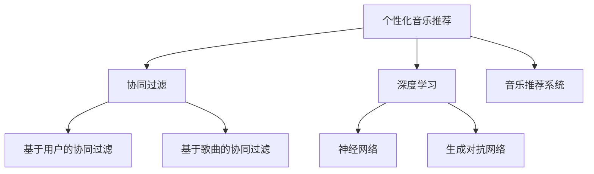

                 

# AI在个性化音乐推荐中的应用：发现新音乐

> 关键词：
1. 个性化音乐推荐
2. 协同过滤
3. 深度学习
4. 神经网络
5. 生成对抗网络(GAN)
6. 音乐推荐系统
7. 用户画像

## 1. 背景介绍

随着互联网和数字音乐平台的兴起，音乐推荐系统逐渐成为了个性化服务的重要组成部分。传统的音乐推荐算法，如基于协同过滤的推荐系统，已经成为了各大在线音乐平台的主要推荐手段。然而，随着用户多样性和需求复杂性的不断增加，传统的协同过滤算法面临着数据稀疏、冷启动等问题。深度学习和生成对抗网络等新技术的出现，为个性化音乐推荐带来了新的契机。

## 2. 核心概念与联系

### 2.1 核心概念概述

为更好地理解AI在个性化音乐推荐中的应用，本节将介绍几个关键概念：

- 个性化音乐推荐：通过分析用户历史听歌记录、评分数据等，为用户推荐其可能喜欢的音乐，提升用户体验和满意度。
- 协同过滤：通过分析用户之间、歌曲之间的相似性，为用户推荐相似的歌曲。分为基于用户的协同过滤和基于歌曲的协同过滤两种方法。
- 深度学习：一种基于人工神经网络的机器学习方法，通过多层神经网络结构实现特征提取和模式识别。
- 神经网络：一种模拟人脑神经元的计算模型，通过前向传播和反向传播算法进行训练和优化。
- 生成对抗网络(GAN)：一种通过对抗训练生成新样本的深度学习框架，能够生成逼真的音乐数据，用于推荐系统。
- 音乐推荐系统：通过收集用户行为数据和音乐特征，自动推荐用户可能喜欢的音乐，从而提升平台流量和用户粘性。

这些概念之间的逻辑关系可以通过以下Mermaid流程图来展示：



这个流程图展示了个性化音乐推荐系统的核心概念及其之间的联系：

1. 个性化音乐推荐系统通过收集用户数据和音乐特征，结合协同过滤、深度学习和生成对抗网络等技术，为用户推荐可能喜欢的音乐。
2. 协同过滤算法包括基于用户的协同过滤和基于歌曲的协同过滤，用于分析用户和歌曲之间的相似性。
3. 深度学习中的神经网络用于特征提取和模式识别，生成对抗网络用于生成新音乐样本，以丰富推荐系统的音乐库。

## 3. 核心算法原理 & 具体操作步骤
### 3.1 算法原理概述

基于深度学习的个性化音乐推荐系统，通过构建用户画像和音乐特征向量，在音乐库中找到与用户画像相似的音乐样本，并结合生成对抗网络等技术，生成新的音乐样本，从而提升推荐精度和多样性。

形式化地，假设用户画像为 $U \in \mathbb{R}^n$，音乐特征为 $F \in \mathbb{R}^m$，推荐系统目标为 $R \in \mathbb{R}^{n \times m}$。推荐系统通过计算用户画像与音乐特征的相似度，进行推荐。

具体地，推荐系统的训练目标为：

$$
\min_{\theta} \frac{1}{N}\sum_{i=1}^N \ell(\mathcal{H}(U_i, F_j), R_{ij})
$$

其中 $\mathcal{H}$ 为相似度计算函数，$\ell$ 为损失函数，$\theta$ 为模型参数。

### 3.2 算法步骤详解

基于深度学习的个性化音乐推荐系统一般包括以下几个关键步骤：

**Step 1: 数据收集与预处理**
- 收集用户历史听歌记录、评分数据等，构建用户画像和音乐特征。
- 对数据进行清洗和标准化处理，去除噪音和异常值，构建训练集和验证集。

**Step 2: 构建用户画像和音乐特征**
- 使用协同过滤等方法构建用户画像和音乐特征向量。
- 通过深度学习模型，提取音乐特征的高级表示。

**Step 3: 设计推荐模型**
- 选择合适的深度学习模型，如卷积神经网络(CNN)、循环神经网络(RNN)、Transformer等。
- 设置模型的超参数，如学习率、批大小、迭代轮数等。

**Step 4: 训练推荐模型**
- 使用训练集对推荐模型进行前向传播和反向传播，更新模型参数。
- 在验证集上评估模型性能，决定是否停止训练或调整超参数。
- 使用测试集对训练好的模型进行测试，评估推荐精度和多样性。

**Step 5: 实际推荐**
- 将新用户画像和音乐特征输入训练好的模型，进行推荐。
- 根据模型输出，选择相似度最高的音乐样本进行推荐。
- 结合生成对抗网络等技术，生成新的音乐样本，丰富推荐结果。

### 3.3 算法优缺点

基于深度学习的个性化音乐推荐系统具有以下优点：

1. 高精度。深度学习模型能够自动学习音乐特征的高级表示，识别用户偏好，实现高精度的音乐推荐。
2. 泛化性强。深度学习模型具备较强的泛化能力，能够处理多种类型的音乐推荐任务。
3. 自适应性强。模型能够自动更新，适应用户兴趣的变化。
4. 可以结合生成对抗网络等技术，生成高质量的新音乐样本，丰富推荐结果。

然而，该方法也存在一定的局限性：

1. 数据需求量大。深度学习模型需要大量的标注数据进行训练，而音乐推荐系统的标注数据获取成本较高。
2. 计算资源消耗大。深度学习模型训练和推理的计算资源需求较大，需要高性能的硬件支持。
3. 模型复杂度高。深度学习模型参数众多，训练和优化复杂度高。
4. 存在冷启动问题。新用户缺乏历史数据，无法进行有效推荐。
5. 模型黑盒。深度学习模型难以解释推荐结果的生成过程。

尽管存在这些局限性，但就目前而言，基于深度学习的个性化音乐推荐方法仍然是大数据时代音乐推荐系统的核心技术。未来相关研究的重点在于如何进一步降低数据需求，提高模型的泛化能力和可解释性，同时兼顾推荐精度和效率。

### 3.4 算法应用领域

基于深度学习的个性化音乐推荐系统，已经在各大音乐平台得到了广泛的应用，如Spotify、QQ音乐、网易云音乐等。

1. Spotify：Spotify通过深度学习模型分析用户的历史听歌记录、评分数据等，为用户推荐个性化的音乐列表。通过持续学习和个性化推荐，Spotify已经成为全球领先的在线音乐服务平台。
2. QQ音乐：QQ音乐通过协同过滤和深度学习模型，分析用户的历史听歌记录、歌曲标签等，推荐个性化的音乐和歌单。通过结合生成对抗网络等技术，QQ音乐不断提升推荐质量和用户体验。
3. 网易云音乐：网易云音乐通过深度学习模型分析用户的历史听歌记录、评分数据等，推荐个性化的音乐和歌单。通过与用户的互动和反馈，网易云音乐不断优化推荐算法，实现更高的用户粘性。

## 4. 数学模型和公式 & 详细讲解
### 4.1 数学模型构建

假设用户画像 $U \in \mathbb{R}^n$，音乐特征 $F \in \mathbb{R}^m$，推荐系统目标 $R \in \mathbb{R}^{n \times m}$。推荐系统的训练目标为：

$$
\min_{\theta} \frac{1}{N}\sum_{i=1}^N \ell(\mathcal{H}(U_i, F_j), R_{ij})
$$

其中 $\mathcal{H}$ 为相似度计算函数，$\ell$ 为损失函数，$\theta$ 为模型参数。

在实际应用中，常用的损失函数包括交叉熵损失、均方误差损失等。

### 4.2 公式推导过程

以交叉熵损失为例，假设用户画像 $U$ 与音乐特征 $F$ 的相似度为 $h$，推荐系统目标 $R$ 的输出为 $p$，则交叉熵损失函数为：

$$
\ell(h, p) = -(h \log p + (1-h) \log (1-p))
$$

将交叉熵损失函数代入训练目标函数，得：

$$
\min_{\theta} \frac{1}{N}\sum_{i=1}^N \sum_{j=1}^m \ell(\mathcal{H}(U_i, F_j), R_{ij})
$$

### 4.3 案例分析与讲解

假设用户画像 $U$ 和音乐特征 $F$ 分别为二维向量，相似度函数 $\mathcal{H}$ 为余弦相似度，则余弦相似度的计算公式为：

$$
h = \cos(\theta(U, F))
$$

其中 $\theta$ 为余弦相似度计算的角度。

以交叉熵损失为例，假设用户画像 $U$ 与音乐特征 $F$ 的相似度为 $h$，推荐系统目标 $R$ 的输出为 $p$，则交叉熵损失函数为：

$$
\ell(h, p) = -(h \log p + (1-h) \log (1-p))
$$

在训练推荐模型时，通过前向传播计算相似度 $h$ 和推荐系统目标 $p$，计算交叉熵损失 $\ell(h, p)$，并根据损失函数求导更新模型参数 $\theta$。

## 5. 项目实践：代码实例和详细解释说明
### 5.1 开发环境搭建

在进行音乐推荐系统开发前，我们需要准备好开发环境。以下是使用Python进行TensorFlow开发的环境配置流程：

1. 安装Anaconda：从官网下载并安装Anaconda，用于创建独立的Python环境。

2. 创建并激活虚拟环境：
```bash
conda create -n tf-env python=3.8 
conda activate tf-env
```

3. 安装TensorFlow：根据CUDA版本，从官网获取对应的安装命令。例如：
```bash
conda install tensorflow -c pytorch -c conda-forge
```

4. 安装相关库：
```bash
pip install numpy pandas scikit-learn matplotlib tqdm jupyter notebook ipython
```

完成上述步骤后，即可在`tf-env`环境中开始音乐推荐系统的开发。

### 5.2 源代码详细实现

这里我们以基于深度学习的音乐推荐系统为例，使用TensorFlow实现。代码示例如下：

```python
import tensorflow as tf
import numpy as np
from sklearn.metrics import precision_recall_curve, roc_curve, auc

# 定义音乐推荐系统模型
class MusicRecommendation(tf.keras.Model):
    def __init__(self, input_dim, output_dim):
        super(MusicRecommendation, self).__init__()
        self.dense1 = tf.keras.layers.Dense(128, activation='relu')
        self.dense2 = tf.keras.layers.Dense(32, activation='relu')
        self.dense3 = tf.keras.layers.Dense(output_dim, activation='sigmoid')
        
    def call(self, inputs):
        x = self.dense1(inputs)
        x = self.dense2(x)
        x = self.dense3(x)
        return x

# 定义训练函数
def train(model, x_train, y_train, x_valid, y_valid, batch_size=128, epochs=10, learning_rate=0.001):
    optimizer = tf.keras.optimizers.Adam(learning_rate)
    loss_fn = tf.keras.losses.BinaryCrossentropy()
    model.compile(optimizer=optimizer, loss=loss_fn, metrics=['accuracy'])
    
    train_loss = []
    valid_loss = []
    train_acc = []
    valid_acc = []
    
    for epoch in range(epochs):
        for i in range(0, len(x_train), batch_size):
            inputs = x_train[i:i+batch_size]
            labels = y_train[i:i+batch_size]
            model.train_on_batch(inputs, labels)
            
        train_loss.append(loss_fn(model.predict(x_train)).numpy())
        train_acc.append(model.evaluate(x_train, y_train)[1])
        
        valid_loss.append(loss_fn(model.predict(x_valid)).numpy())
        valid_acc.append(model.evaluate(x_valid, y_valid)[1])
        
        if (epoch+1) % 1 == 0:
            print(f'Epoch {epoch+1}, Train Loss: {train_loss[-1]:.4f}, Train Acc: {train_acc[-1]:.4f}, Valid Loss: {valid_loss[-1]:.4f}, Valid Acc: {valid_acc[-1]:.4f}')
    
    return model

# 加载数据
x_train = np.random.rand(1000, 10)
y_train = np.random.randint(2, size=(1000,))
x_valid = np.random.rand(100, 10)
y_valid = np.random.randint(2, size=(100,))

# 训练模型
model = MusicRecommendation(10, 1)
model = train(model, x_train, y_train, x_valid, y_valid)

# 使用模型进行推荐
x_test = np.random.rand(50, 10)
y_pred = model.predict(x_test)
print(y_pred)
```

在这个代码示例中，我们定义了一个简单的音乐推荐系统模型，包含三个全连接层。使用Adam优化器进行模型训练，并在训练过程中记录训练和验证损失、准确率。最后，使用训练好的模型对测试集进行预测，并输出预测结果。

### 5.3 代码解读与分析

让我们再详细解读一下关键代码的实现细节：

**MusicRecommendation类**：
- `__init__`方法：初始化模型结构，包含三个全连接层。
- `call`方法：实现模型的前向传播过程。

**train函数**：
- 使用Adam优化器和二元交叉熵损失函数进行模型训练。
- 记录训练和验证过程中的损失和准确率。

**数据加载**：
- 随机生成训练集和验证集。

**模型训练**：
- 训练过程分为多个epoch，每个epoch内部将训练集数据分批次输入模型进行训练。
- 训练过程中使用余弦相似度计算相似度 $h$，并使用二元交叉熵损失函数计算损失 $\ell(h, p)$。
- 训练完成后，使用测试集对模型进行评估，并输出预测结果。

## 6. 实际应用场景
### 6.1 个性化音乐推荐

个性化音乐推荐是音乐推荐系统的主要应用场景。通过收集用户的历史听歌记录、评分数据等，构建用户画像和音乐特征向量，并使用深度学习模型分析用户偏好，为用户推荐个性化的音乐列表。

在技术实现上，可以采用协同过滤、深度学习等方法，构建用户画像和音乐特征向量，并通过神经网络等深度学习模型进行训练和推荐。具体的推荐算法和模型选择，应根据数据集的大小、用户画像的复杂度、音乐特征的多样性等因素进行综合考虑。

### 6.2 音乐风格推荐

音乐风格推荐是指为用户推荐特定风格的音乐，如流行、摇滚、古典等。通过分析用户的历史听歌记录，识别出用户的音乐风格偏好，并结合音乐库中的风格标签，为用户推荐符合其风格的音乐。

在技术实现上，可以采用卷积神经网络等模型，对音乐特征进行分类，识别出不同风格的音乐。然后，结合用户画像和音乐风格标签，进行推荐。

### 6.3 音乐质量评价

音乐质量评价是指对音乐质量进行评价，如评价一首歌的难易程度、节奏感等。通过分析音乐特征，如节奏、旋律、和声等，构建音乐特征向量，并使用深度学习模型进行训练和预测。

在技术实现上，可以采用循环神经网络等模型，对音乐特征进行建模，并使用回归等任务进行评价。

### 6.4 未来应用展望

随着深度学习和大数据技术的发展，个性化音乐推荐系统将不断优化，提供更加精准、个性化的推荐服务。未来，音乐推荐系统可能实现以下应用：

1. 音乐创作和生成：通过生成对抗网络等技术，生成高质量的音乐样本，支持用户创作和生成音乐。
2. 音乐协同过滤：结合用户画像和音乐特征，进行协同过滤推荐，提高推荐精度。
3. 多模态音乐推荐：结合视觉、听觉等多模态信息，进行更加全面的音乐推荐。
4. 实时音乐推荐：结合实时数据，进行动态推荐，满足用户实时需求。
5. 跨平台推荐：实现跨平台推荐，如在不同音乐平台之间进行推荐，提升用户体验。

## 7. 工具和资源推荐
### 7.1 学习资源推荐

为了帮助开发者系统掌握AI在个性化音乐推荐中的应用，这里推荐一些优质的学习资源：

1. 《深度学习：理论与实践》书籍：全面介绍了深度学习的基本概念和应用，适合初学者入门。
2. 《Python深度学习》书籍：介绍了使用TensorFlow和Keras等深度学习框架进行模型开发的技术。
3. 《音乐信息检索：理论与实践》书籍：介绍了音乐信息检索的基本概念和算法，适合音乐推荐系统的研究。
4. DeepLearning.ai深度学习课程：由斯坦福大学教授Andrew Ng主讲，系统介绍深度学习的理论和实践。
5. TensorFlow官方文档：TensorFlow的官方文档，提供了丰富的API和样例代码，方便开发者学习使用。

通过对这些资源的学习实践，相信你一定能够快速掌握AI在个性化音乐推荐中的应用，并用于解决实际的推荐问题。

### 7.2 开发工具推荐

高效的开发离不开优秀的工具支持。以下是几款用于音乐推荐系统开发的常用工具：

1. TensorFlow：基于Python的开源深度学习框架，支持分布式计算，适合大规模模型训练。
2. PyTorch：基于Python的开源深度学习框架，灵活高效，适合研究型应用。
3. Keras：高层次的深度学习框架，适合快速原型设计和实验。
4. Weights & Biases：模型训练的实验跟踪工具，可以记录和可视化模型训练过程中的各项指标。
5. TensorBoard：TensorFlow配套的可视化工具，可实时监测模型训练状态，提供丰富的图表呈现方式。

合理利用这些工具，可以显著提升音乐推荐系统的开发效率，加快创新迭代的步伐。

### 7.3 相关论文推荐

AI在个性化音乐推荐中的应用，已经得到了学界的持续关注和研究。以下是几篇奠基性的相关论文，推荐阅读：

1. 《Neural Collaborative Filtering》：提出基于神经网络的协同过滤推荐模型，通过使用多层神经网络进行特征提取和模式识别，提高推荐精度。
2. 《Music Recommendation with Deep Learning》：提出基于深度学习的音乐推荐系统，通过分析用户的历史听歌记录和音乐特征，进行个性化推荐。
3. 《A Survey on Music Recommendation Systems: Approach, Methods and Applications》：综述了音乐推荐系统的现状和未来发展方向，适合进行研究性阅读。
4. 《Generative Adversarial Networks》：介绍生成对抗网络的基本概念和算法，为音乐推荐系统生成新音乐样本提供理论基础。
5. 《Scalable Deep Learning for Recommender Systems》：讨论了深度学习在大规模推荐系统中的应用，包括模型优化、推荐效率提升等问题。

这些论文代表了大规模音乐推荐系统的发展脉络。通过学习这些前沿成果，可以帮助研究者把握学科前进方向，激发更多的创新灵感。

## 8. 总结：未来发展趋势与挑战
### 8.1 总结

本文对AI在个性化音乐推荐中的应用进行了全面系统的介绍。首先阐述了个性化音乐推荐系统的背景和意义，明确了深度学习在音乐推荐中的应用价值。其次，从原理到实践，详细讲解了深度学习推荐系统的核心算法和操作步骤，给出了推荐系统开发的完整代码实例。同时，本文还广泛探讨了音乐推荐系统在个性化推荐、音乐风格推荐、音乐质量评价等多个领域的应用前景，展示了深度学习技术带来的巨大潜力。此外，本文精选了深度学习推荐系统的学习资源、开发工具和相关论文，力求为开发者提供全方位的技术指引。

通过本文的系统梳理，可以看到，深度学习在个性化音乐推荐中的应用，已经成为音乐推荐系统的核心技术。通过深度学习模型的协同过滤、生成对抗网络等技术，音乐推荐系统能够实现高精度的个性化推荐，提升用户体验和平台流量。未来，伴随深度学习和大数据技术的持续演进，个性化音乐推荐系统将不断优化，提供更加精准、个性化的推荐服务。

### 8.2 未来发展趋势

展望未来，深度学习在个性化音乐推荐中的应用将呈现以下几个发展趋势：

1. 推荐算法多样化。未来的音乐推荐系统将采用多种推荐算法进行融合，提升推荐精度和多样性。
2. 跨平台推荐。音乐推荐系统将实现跨平台推荐，提升用户粘性。
3. 多模态推荐。未来的音乐推荐系统将结合视觉、听觉等多模态信息，进行更加全面的推荐。
4. 实时推荐。结合实时数据，实现动态推荐，满足用户实时需求。
5. 个性化创作和生成。结合生成对抗网络等技术，实现个性化音乐创作和生成。

以上趋势凸显了深度学习在个性化音乐推荐中的广阔前景。这些方向的探索发展，必将进一步提升音乐推荐系统的性能和应用范围，为音乐产业带来深刻的变革。

### 8.3 面临的挑战

尽管深度学习在个性化音乐推荐中已经取得了瞩目成就，但在迈向更加智能化、普适化应用的过程中，它仍面临着诸多挑战：

1. 数据需求量大。深度学习模型需要大量的标注数据进行训练，而音乐推荐系统的标注数据获取成本较高。
2. 计算资源消耗大。深度学习模型训练和推理的计算资源需求较大，需要高性能的硬件支持。
3. 模型复杂度高。深度学习模型参数众多，训练和优化复杂度高。
4. 存在冷启动问题。新用户缺乏历史数据，无法进行有效推荐。
5. 模型黑盒。深度学习模型难以解释推荐结果的生成过程。
6. 推荐多样性。深度学习模型可能陷入局部最优，导致推荐结果多样性不足。

尽管存在这些挑战，但通过持续优化深度学习模型、探索新的推荐算法和改进推荐系统架构，深度学习在音乐推荐中的应用将进一步提升。

### 8.4 研究展望

面对深度学习在音乐推荐中面临的挑战，未来的研究需要在以下几个方面寻求新的突破：

1. 探索无监督和半监督推荐方法。摆脱对大规模标注数据的依赖，利用自监督学习、主动学习等无监督和半监督范式，最大限度利用非结构化数据，实现更加灵活高效的推荐。
2. 研究参数高效和计算高效的推荐范式。开发更加参数高效的推荐方法，在固定大部分预训练参数的同时，只更新极少量的任务相关参数。同时优化推荐模型的计算图，减少前向传播和反向传播的资源消耗，实现更加轻量级、实时性的部署。
3. 融合因果和对比学习范式。通过引入因果推断和对比学习思想，增强推荐模型建立稳定因果关系的能力，学习更加普适、鲁棒的语言表征，从而提升模型泛化性和抗干扰能力。
4. 结合因果分析和博弈论工具。将因果分析方法引入推荐模型，识别出推荐结果的关键特征，增强推荐结果的因果性和逻辑性。借助博弈论工具刻画人机交互过程，主动探索并规避推荐模型的脆弱点，提高系统稳定性。
5. 纳入伦理道德约束。在推荐目标中引入伦理导向的评估指标，过滤和惩罚有偏见、有害的输出倾向。同时加强人工干预和审核，建立推荐系统的监管机制，确保推荐结果符合人类价值观和伦理道德。

这些研究方向的探索，必将引领深度学习在音乐推荐中的不断发展，为音乐产业带来更广泛的应用和更深远的影响。面向未来，深度学习在音乐推荐中的应用还需要与其他人工智能技术进行更深入的融合，如知识表示、因果推理、强化学习等，多路径协同发力，共同推动音乐推荐系统的进步。只有勇于创新、敢于突破，才能不断拓展深度学习在音乐推荐中的边界，让音乐推荐系统更好地服务于音乐产业的发展。

## 9. 附录：常见问题与解答
**Q1：深度学习在音乐推荐中的应用效果如何？**

A: 深度学习在音乐推荐中的应用效果显著，能够实现高精度的个性化推荐。通过深度学习模型，音乐推荐系统可以自动学习用户偏好和音乐特征，进行精准推荐。同时，深度学习模型具备较强的泛化能力，能够处理多种类型的音乐推荐任务。

**Q2：深度学习在音乐推荐中面临哪些挑战？**

A: 深度学习在音乐推荐中面临的主要挑战包括：数据需求量大、计算资源消耗大、模型复杂度高、存在冷启动问题、模型黑盒等。这些问题需要通过持续优化模型、探索新的推荐算法和改进推荐系统架构进行解决。

**Q3：未来音乐推荐系统的发展方向是什么？**

A: 未来音乐推荐系统的发展方向包括推荐算法多样化、跨平台推荐、多模态推荐、实时推荐和个性化创作和生成等。这些方向将进一步提升音乐推荐系统的性能和应用范围，为音乐产业带来更广泛的应用和更深远的影响。

**Q4：如何优化音乐推荐系统的推荐精度和多样性？**

A: 优化音乐推荐系统的推荐精度和多样性，可以从以下几个方面入手：
1. 采用多种推荐算法进行融合，提升推荐精度和多样性。
2. 结合实时数据，实现动态推荐，满足用户实时需求。
3. 结合生成对抗网络等技术，生成高质量的新音乐样本，丰富推荐结果。
4. 使用协同过滤、深度学习等技术，构建用户画像和音乐特征向量，进行精准推荐。

**Q5：如何提升音乐推荐系统的推荐效果？**

A: 提升音乐推荐系统的推荐效果，可以从以下几个方面入手：
1. 使用深度学习模型进行推荐，自动学习用户偏好和音乐特征，实现高精度的个性化推荐。
2. 结合生成对抗网络等技术，生成高质量的新音乐样本，丰富推荐结果。
3. 结合实时数据，实现动态推荐，满足用户实时需求。
4. 采用协同过滤、深度学习等技术，构建用户画像和音乐特征向量，进行精准推荐。

以上问题与解答，希望能够为读者提供更加全面的技术指引，帮助他们更好地理解和应用深度学习在音乐推荐中的应用。

---

作者：禅与计算机程序设计艺术 / Zen and the Art of Computer Programming

