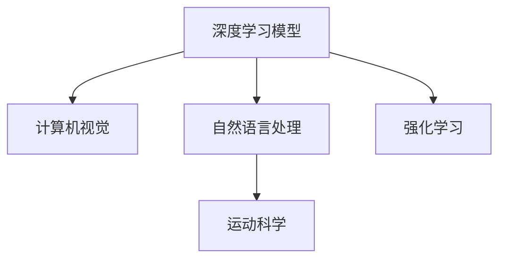

                 

# AI在体育训练中的应用：提高运动员表现

## 1. 背景介绍

### 1.1 问题由来
体育训练一直是一个高度依赖经验的领域。运动员通过反复练习和教练的指导，逐步提升技术水平和身体素质。但传统的训练方法存在不少问题：
- **主观性**：教练往往依靠经验，无法量化和标准化训练过程。
- **个体差异**：不同运动员的体能和技术基础不同，统一的训练计划难以满足个性化需求。
- **效果评估**：运动员的表现受到诸多因素影响，如心理状态、天气等，难以精确评估训练效果。

近年来，随着人工智能技术的迅猛发展，AI在体育训练中的应用逐渐显现出其巨大潜力。借助AI的强大计算能力和数据处理能力，教练员和运动员能够更加科学、精准地进行训练，大大提升训练效果和竞技水平。

### 1.2 问题核心关键点
AI在体育训练中的主要应用包括：

1. **运动员表现评估**：通过深度学习模型，对运动员的表现进行自动分析和评估，量化训练效果。
2. **训练计划制定**：根据运动员的特点和目标，自动生成个性化的训练计划。
3. **运动损伤预防**：利用机器学习预测运动员的运动损伤风险，及时调整训练方案，防止受伤。
4. **比赛策略分析**：通过数据分析和建模，制定合理的比赛策略，提高比赛胜率。
5. **数据驱动训练**：通过收集和分析训练数据，不断优化训练过程和效果，实现数据驱动的智能训练。

AI的应用不仅能提高运动员的竞技水平，还能显著提升训练的科学性和有效性，减少受伤风险，延长运动员的职业生涯。

## 2. 核心概念与联系

### 2.1 核心概念概述

为更好地理解AI在体育训练中的应用，本节将介绍几个核心概念：

- **深度学习模型**：基于多层神经网络的模型，通过反向传播算法，学习数据的内在特征和模式。在体育训练中，常用的深度学习模型包括卷积神经网络(CNN)、循环神经网络(RNN)、变压器(Transformer)等。

- **计算机视觉**：利用计算机对图像、视频等视觉信息进行分析和处理，帮助教练和运动员获取更多训练数据。在体育训练中，计算机视觉可以用于动作捕捉、姿态分析、场地识别等。

- **自然语言处理**：处理和理解人类语言的技术，帮助教练和运动员进行沟通交流和训练记录。在体育训练中，自然语言处理可以用于训练日志、战术分析、语音识别等。

- **强化学习**：通过与环境交互，智能体学习最优策略以最大化奖励的算法。在体育训练中，强化学习可以用于模拟训练、技能提升等。

- **运动科学**：结合物理学、生物力学等学科，研究运动规律和人体的生理机制。在体育训练中，运动科学知识可以指导深度学习模型的设计和训练。

这些核心概念之间的逻辑关系可以通过以下Mermaid流程图来展示：



这个流程图展示了大语言模型的核心概念及其之间的关系：

1. 深度学习模型是AI在体育训练中的主要技术手段。
2. 计算机视觉和自然语言处理为模型提供训练数据和辅助信息。
3. 强化学习提供训练策略和优化路径。
4. 运动科学为模型设计和训练提供理论和知识支撑。

这些概念共同构成了AI在体育训练中的应用框架，使得训练过程更加科学、精准、高效。

## 3. 核心算法原理 & 具体操作步骤
### 3.1 算法原理概述

AI在体育训练中的应用，本质上是通过深度学习模型对运动员的表现数据进行分析和建模，从而制定科学的训练计划和比赛策略。其核心思想是：通过数据分析和机器学习技术，提取和理解运动员的特征和行为模式，指导训练过程和战术安排。

形式化地，假设运动员的训练数据为 $D=\{(x_i, y_i)\}_{i=1}^N$，其中 $x_i$ 为训练样本（如动作视频、速度数据等），$y_i$ 为对应的标签或目标（如技术评分、速度记录等）。深度学习模型的目标是最小化损失函数 $\mathcal{L}$，以逼近最优模型 $M$：

$$
\min_{\theta} \mathcal{L}(M; D) = \frac{1}{N}\sum_{i=1}^N \ell(M(x_i), y_i)
$$

其中，$\ell$ 为损失函数（如均方误差、交叉熵等），$\theta$ 为模型参数。

通过梯度下降等优化算法，模型不断更新参数 $\theta$，最小化损失函数 $\mathcal{L}$，从而得到能够描述运动员表现和特征的模型 $M$。教练员和运动员可以通过模型分析训练数据，提取关键指标和趋势，指导训练和比赛。

### 3.2 算法步骤详解

基于深度学习的AI在体育训练中的应用一般包括以下几个关键步骤：

**Step 1: 数据收集与预处理**
- 收集运动员的训练数据和比赛数据，包括视频、动作捕捉数据、生物指标等。
- 对数据进行清洗和预处理，去除噪声和异常值，进行归一化和标准化处理。
- 数据划分，分为训练集、验证集和测试集，用于模型的训练和评估。

**Step 2: 模型选择与设计**
- 根据任务需求选择合适的深度学习模型，如CNN、RNN、Transformer等。
- 设计模型的结构和参数，确保模型具有足够的表达能力和泛化能力。
- 选择合适的优化器、损失函数和超参数，如Adam、交叉熵等。

**Step 3: 模型训练与评估**
- 将训练集数据输入模型，进行前向传播计算损失函数。
- 反向传播计算参数梯度，根据设定的优化算法和学习率更新模型参数。
- 周期性在验证集上评估模型性能，根据性能指标决定是否触发Early Stopping。
- 重复上述步骤直到满足预设的迭代轮数或Early Stopping条件。

**Step 4: 应用与优化**
- 将训练好的模型应用于实际训练和比赛中，进行性能评估和结果分析。
- 根据评估结果调整训练方案和比赛策略，优化模型和数据收集方法。
- 持续收集新数据，进行模型更新和迭代优化，确保模型性能的持续提升。

以上是AI在体育训练中常用的方法流程。在实际应用中，还需要根据具体任务和数据特点进行优化设计，如引入更多的特征、设计更好的损失函数、采用更高效的优化算法等。

### 3.3 算法优缺点

AI在体育训练中的应用具有以下优点：
1. 数据驱动：通过大量训练数据的分析和建模，能更客观、科学地指导训练和比赛。
2. 个性化训练：根据运动员的个人特点和需求，设计个性化的训练计划，提升训练效果。
3. 实时监控：利用传感器和计算机视觉技术，实时监控运动员的训练数据，及时发现和调整问题。
4. 比赛策略优化：通过数据分析和建模，制定合理的比赛策略，提高胜率。
5. 节省资源：通过自动化训练和分析，减少教练和运动员的工作量，提高效率。

同时，AI在体育训练中也存在一些局限性：
1. 数据质量要求高：高质量、多样化的训练数据是模型性能的关键，数据收集和标注成本高。
2. 模型复杂度高：深度学习模型复杂，训练和推理需要高性能设备，资源消耗大。
3. 技术门槛高：需要专业知识和技能，一般需要团队协作，对教练和运动员的技术要求较高。
4. 解释性差：深度学习模型的决策过程难以解释，难以满足某些领域对可解释性的要求。

尽管存在这些局限性，但AI在体育训练中的应用仍是大势所趋，其带来的科学化和智能化训练将显著提升运动员的表现和竞技水平。

### 3.4 算法应用领域

AI在体育训练中的应用已经覆盖了多个领域，包括但不限于：

- **动作分析**：通过计算机视觉技术，分析运动员的动作视频，提取技术指标和动作序列。
- **运动监控**：利用传感器和计算机视觉技术，实时监控运动员的生理指标和动作状态，预防运动损伤。
- **比赛分析**：通过数据分析和建模，分析比赛的战术和策略，优化比赛安排。
- **技能提升**：利用强化学习技术，模拟训练环境和场景，提升运动员的技能水平。
- **训练计划优化**：根据运动员的训练数据和目标，自动生成个性化的训练计划。

这些应用领域展示了AI在体育训练中的广泛应用前景，为运动员和教练提供了更多科学训练的手段。

## 4. 数学模型和公式 & 详细讲解  
### 4.1 数学模型构建

本节将使用数学语言对AI在体育训练中的应用进行更加严格的刻画。

假设训练数据为 $D=\{(x_i, y_i)\}_{i=1}^N$，其中 $x_i$ 为训练样本（如动作视频、速度数据等），$y_i$ 为对应的标签或目标（如技术评分、速度记录等）。设深度学习模型为 $M_{\theta}$，其中 $\theta$ 为模型参数。

定义模型 $M_{\theta}$ 在训练集 $D$ 上的损失函数为：

$$
\mathcal{L}(\theta) = \frac{1}{N}\sum_{i=1}^N \ell(M_{\theta}(x_i), y_i)
$$

其中 $\ell$ 为损失函数（如均方误差、交叉熵等）。模型的优化目标是最小化经验风险，即：

$$
\theta^* = \mathop{\arg\min}_{\theta} \mathcal{L}(\theta)
$$

在实践中，我们通常使用基于梯度的优化算法（如SGD、Adam等）来近似求解上述最优化问题。设 $\eta$ 为学习率，$\lambda$ 为正则化系数，则参数的更新公式为：

$$
\theta \leftarrow \theta - \eta \nabla_{\theta}\mathcal{L}(\theta) - \eta\lambda\theta
$$

其中 $\nabla_{\theta}\mathcal{L}(\theta)$ 为损失函数对参数 $\theta$ 的梯度，可通过反向传播算法高效计算。

### 4.2 公式推导过程

以下我们以动作分析为例，推导深度学习模型在动作捕捉数据上的损失函数及其梯度的计算公式。

假设动作捕捉数据 $x_i$ 包含多个时间序列 $(x_{i1}, x_{i2}, ..., x_{in})$，每个时间序列 $x_{ij}$ 包含运动员某个关节在时间 $t_j$ 的角度、速度等特征。假设标签 $y_i$ 包含多个动作指标 $(a_i, b_i, ..., c_i)$，其中 $a_i$ 为该动作在 $x_i$ 中的起始时间点，$b_i$ 为结束时间点，$c_i$ 为该动作的评分。

定义模型 $M_{\theta}$ 在动作捕捉数据 $x_i$ 上的输出为 $\hat{y}_i = M_{\theta}(x_i)$，表示模型对每个动作的起始时间点、结束时间点和评分进行预测。则动作分析的损失函数定义为：

$$
\ell(M_{\theta}(x_i), y_i) = \frac{1}{3}\sum_{k=1}^3 \ell_k(M_{\theta}(x_i), y_i)
$$

其中 $\ell_k$ 为针对每个动作指标的损失函数，可以是均方误差、交叉熵等。针对动作指标 $a_i$ 的损失函数定义为：

$$
\ell_a(M_{\theta}(x_i), y_i) = \frac{1}{m_i}\sum_{j=1}^{m_i} \ell_a(x_{ij}, \hat{a}_i)
$$

其中 $\ell_a$ 为均方误差损失，$\hat{a}_i$ 为模型预测的起始时间点。

在得到损失函数的梯度后，即可带入参数更新公式，完成模型的迭代优化。重复上述过程直至收敛，最终得到适应动作分析任务的最优模型参数 $\theta^*$。

## 5. 项目实践：代码实例和详细解释说明
### 5.1 开发环境搭建

在进行AI在体育训练中的应用实践前，我们需要准备好开发环境。以下是使用Python进行深度学习开发的典型环境配置流程：

1. 安装Anaconda：从官网下载并安装Anaconda，用于创建独立的Python环境。

2. 创建并激活虚拟环境：
```bash
conda create -n pytorch-env python=3.8 
conda activate pytorch-env
```

3. 安装PyTorch：根据CUDA版本，从官网获取对应的安装命令。例如：
```bash
conda install pytorch torchvision torchaudio cudatoolkit=11.1 -c pytorch -c conda-forge
```

4. 安装TensorFlow：
```bash
pip install tensorflow
```

5. 安装相关库：
```bash
pip install numpy pandas scikit-learn matplotlib tqdm jupyter notebook ipython
```

完成上述步骤后，即可在`pytorch-env`环境中开始项目实践。

### 5.2 源代码详细实现

这里我们以动作分析为例，给出使用TensorFlow进行动作捕捉数据处理的完整代码实现。

首先，定义数据处理函数：

```python
import tensorflow as tf
from tensorflow.keras import layers

def preprocess_data(data, labels):
    # 将动作捕捉数据转化为张量格式
    x = tf.convert_to_tensor(data, dtype=tf.float32)
    # 将标签转化为张量格式
    y = tf.convert_to_tensor(labels, dtype=tf.int32)
    return x, y
```

然后，定义模型和优化器：

```python
from tensorflow.keras import models, layers

# 定义多层感知器模型
model = models.Sequential()
model.add(layers.Dense(256, activation='relu', input_shape=(n_features,)))
model.add(layers.Dense(3, activation='softmax'))

# 定义优化器
optimizer = tf.keras.optimizers.Adam(learning_rate=0.001)
```

接着，定义训练和评估函数：

```python
from tensorflow.keras import losses

# 定义交叉熵损失函数
loss_fn = losses.CategoricalCrossentropy()

# 定义训练函数
def train_epoch(model, dataset, batch_size, optimizer):
    model.compile(optimizer=optimizer, loss=loss_fn, metrics=['accuracy'])
    dataset = tf.data.Dataset.from_tensor_slices(dataset)
    dataset = dataset.shuffle(buffer_size=1024).batch(batch_size).repeat()
    model.fit(dataset, epochs=10)
    return epoch_loss, epoch_accuracy

# 定义评估函数
def evaluate(model, dataset, batch_size):
    dataset = tf.data.Dataset.from_tensor_slices(dataset)
    dataset = dataset.shuffle(buffer_size=1024).batch(batch_size).repeat()
    model.evaluate(dataset)
```

最后，启动训练流程并在测试集上评估：

```python
epochs = 10
batch_size = 32

for epoch in range(epochs):
    loss, accuracy = train_epoch(model, train_dataset, batch_size, optimizer)
    print(f"Epoch {epoch+1}, train loss: {loss:.3f}, train accuracy: {accuracy:.3f}")
    
    print(f"Epoch {epoch+1}, test accuracy: {evaluate(model, test_dataset, batch_size)[1]}")
```

以上就是使用TensorFlow对动作分析任务进行深度学习模型微调的完整代码实现。可以看到，通过TensorFlow的高级API，代码实现简洁高效，适合快速迭代研究。

### 5.3 代码解读与分析

让我们再详细解读一下关键代码的实现细节：

**preprocess_data函数**：
- 将输入的数据和标签转化为TensorFlow兼容的格式，以便后续模型处理。

**模型定义**：
- 使用Sequential模型构建多层感知器，其中包含一个全连接层和三个输出层。输入层根据动作捕捉数据的特征维度设计。

**优化器和损失函数**：
- 选择Adam优化器，学习率为0.001。损失函数为交叉熵损失，适用于多分类任务。

**训练和评估函数**：
- 定义训练函数，将数据集划分为批次进行前向传播和后向传播，计算损失和准确率。
- 定义评估函数，在测试集上进行模型评估，输出准确率。

**训练流程**：
- 定义总的epoch数和batch size，开始循环迭代
- 每个epoch内，先在训练集上训练，输出平均loss和accuracy
- 在验证集上评估，输出测试集上的准确率

可以看到，TensorFlow提供了丰富的深度学习API，使得模型构建、训练和评估变得简单高效。开发者可以快速上手实现各种AI在体育训练中的应用。

当然，工业级的系统实现还需考虑更多因素，如模型的保存和部署、超参数的自动搜索、更灵活的任务适配层等。但核心的微调范式基本与此类似。

## 6. 实际应用场景
### 6.1 智能训练方案

AI在体育训练中的应用，可以显著提升训练方案的科学性和个性化。通过深度学习模型，教练可以自动分析运动员的训练数据，提取技术指标和动作序列，生成个性化的训练计划。

以田径运动员的专项训练为例，假设教练希望提升运动员的跑速。首先，收集运动员的跑速数据和动作捕捉数据，将这些数据输入到深度学习模型中。模型会自动分析每个动作的时间和位置，提取关键的技术参数，如步幅、步频、重心高度等。根据这些技术参数，模型会生成个性化的训练方案，推荐运动员进行特定的动作训练，如提高步频的专项训练。

### 6.2 运动损伤预防

运动损伤是运动员职业生涯中的大敌。AI在运动损伤预防中的应用，可以实时监控运动员的生理指标和动作状态，预测运动损伤风险，及时调整训练方案，防止受伤。

以篮球运动员为例，假设教练希望预防运动员的膝伤。首先，通过传感器收集运动员的膝部运动数据，将这些数据输入到深度学习模型中。模型会自动分析运动员的膝部运动模式，检测异常的加速度、扭矩等指标，预测膝伤风险。根据模型预测结果，教练可以调整训练方案，减少高强度的膝部训练，增加康复训练，降低膝伤风险。

### 6.3 比赛策略优化

AI在比赛策略优化中的应用，可以分析历史比赛数据，预测比赛结果，制定合理的比赛策略，提高胜率。

以足球队为例，假设教练希望优化球队的进攻策略。首先，收集球队的历史比赛数据，包括进攻次数、射门次数、进球数等。将这些数据输入到深度学习模型中，模型会自动分析进攻数据与进球之间的关系，预测未来的进攻策略。根据模型预测结果，教练可以优化进攻方式，提升进攻效率和进球率。

### 6.4 未来应用展望

随着AI技术的不断发展，AI在体育训练中的应用将更加广泛和深入。未来，AI有望在以下几个方面进一步拓展：

1. **智能训练**：通过深度学习模型，自动分析运动员的表现和动作，生成个性化的训练方案，提升训练效果。
2. **运动损伤监测**：利用传感器和机器学习技术，实时监控运动员的生理指标和动作状态，预防运动损伤。
3. **比赛策略分析**：分析历史比赛数据，预测比赛结果，制定最优的比赛策略。
4. **技能提升**：利用强化学习技术，模拟训练环境和场景，提升运动员的技能水平。
5. **数据驱动训练**：通过收集和分析训练数据，不断优化训练过程和效果，实现数据驱动的智能训练。

这些应用领域展示了AI在体育训练中的广阔前景，为运动员和教练提供了更多科学训练的手段。未来，AI有望成为体育训练的重要助手，推动训练过程的科学化和智能化。

## 7. 工具和资源推荐
### 7.1 学习资源推荐

为了帮助开发者系统掌握AI在体育训练中的应用理论基础和实践技巧，这里推荐一些优质的学习资源：

1. **《深度学习》课程**：斯坦福大学提供的深度学习课程，涵盖了深度学习的基本概念和常用模型，适合初学者入门。
2. **《TensorFlow实战》书籍**：TensorFlow官方文档，提供了丰富的代码示例和实践指南，是TensorFlow开发的必读书籍。
3. **《运动科学基础》书籍**：介绍运动科学的基本原理和训练方法，帮助开发者理解运动科学知识。
4. **Kaggle数据集**：提供大量体育训练相关的数据集，适合进行深度学习模型的训练和评估。
5. **运动训练模拟软件**：如Simulink、AnySim等，可以模拟运动场景，辅助模型训练和评估。

通过对这些资源的学习实践，相信你一定能够快速掌握AI在体育训练中的应用精髓，并用于解决实际的训练问题。

### 7.2 开发工具推荐

高效的开发离不开优秀的工具支持。以下是几款用于AI在体育训练中的应用开发的常用工具：

1. **TensorFlow**：由Google主导开发的深度学习框架，支持分布式计算和GPU加速，适合大规模深度学习项目。
2. **PyTorch**：由Facebook开发的深度学习框架，提供了灵活的动态计算图，适合快速原型开发和研究。
3. **Jupyter Notebook**：交互式的开发环境，支持Python和多种数据处理库，适合数据探索和模型评估。
4. **Simulink**：MATLAB提供的运动训练模拟软件，可以模拟复杂运动场景，辅助模型训练和评估。
5. **Python**：通用的编程语言，支持深度学习、数据分析、可视化等多种功能，是AI开发的主流工具。

合理利用这些工具，可以显著提升AI在体育训练中的应用开发效率，加快创新迭代的步伐。

### 7.3 相关论文推荐

AI在体育训练中的应用研究源于学界的持续研究。以下是几篇奠基性的相关论文，推荐阅读：

1. **《深度学习在体育训练中的应用》**：介绍深度学习在体育训练中的应用现状和前景，讨论深度学习模型的设计和优化。
2. **《利用机器学习预测运动损伤》**：研究机器学习在运动损伤预测中的应用，提出基于时间序列分析的运动损伤预测模型。
3. **《强化学习在运动训练中的应用》**：探讨强化学习在运动技能提升中的应用，提出基于模拟环境的强化学习训练方法。
4. **《基于计算机视觉的动作分析》**：研究计算机视觉在动作捕捉和姿态分析中的应用，提出基于深度学习的动作识别模型。
5. **《数据驱动的训练计划优化》**：研究数据驱动训练计划优化的算法，提出基于深度学习的训练方案生成方法。

这些论文代表了大语言模型微调技术的发展脉络。通过学习这些前沿成果，可以帮助研究者把握学科前进方向，激发更多的创新灵感。

## 8. 总结：未来发展趋势与挑战
### 8.1 总结

本文对AI在体育训练中的应用进行了全面系统的介绍。首先阐述了AI在体育训练中的研究背景和意义，明确了AI技术在训练方案生成、运动损伤预防、比赛策略优化等方面的应用前景。其次，从原理到实践，详细讲解了深度学习模型的训练流程和关键步骤，给出了AI在体育训练中的应用代码实例。同时，本文还探讨了AI在体育训练中的广泛应用场景，展示了其带来的科学化和智能化训练。

通过本文的系统梳理，可以看到，AI在体育训练中的应用正逐渐成为体育训练的重要手段，为运动员和教练提供了更多科学训练的手段。未来，伴随AI技术的不断演进，AI在体育训练中的应用将更加深入和广泛，为运动员和教练提供更智能、更科学的训练方案。

### 8.2 未来发展趋势

展望未来，AI在体育训练中的应用将呈现以下几个发展趋势：

1. **数据驱动的智能训练**：通过大量训练数据的分析和建模，能更客观、科学地指导训练和比赛。
2. **个性化训练方案**：根据运动员的个人特点和需求，设计个性化的训练计划，提升训练效果。
3. **实时监控与预测**：利用传感器和机器学习技术，实时监控运动员的生理指标和动作状态，预防运动损伤。
4. **比赛策略优化**：分析历史比赛数据，预测比赛结果，制定最优的比赛策略。
5. **技能提升与模拟训练**：利用强化学习技术，模拟训练环境和场景，提升运动员的技能水平。

这些趋势展示了AI在体育训练中的广阔前景，为运动员和教练提供了更多科学训练的手段。随着AI技术的不断发展，AI在体育训练中的应用将更加深入和广泛，为运动员和教练提供更智能、更科学的训练方案。

### 8.3 面临的挑战

尽管AI在体育训练中的应用已经取得了一定的成果，但在迈向更加智能化、普适化应用的过程中，仍面临诸多挑战：

1. **数据质量要求高**：高质量、多样化的训练数据是模型性能的关键，数据收集和标注成本高。
2. **模型复杂度高**：深度学习模型复杂，训练和推理需要高性能设备，资源消耗大。
3. **技术门槛高**：需要专业知识和技能，一般需要团队协作，对教练和运动员的技术要求较高。
4. **解释性差**：深度学习模型的决策过程难以解释，难以满足某些领域对可解释性的要求。

尽管存在这些挑战，但AI在体育训练中的应用仍是大势所趋，其带来的科学化和智能化训练将显著提升运动员的表现和竞技水平。未来，研究者需要不断攻克技术难题，提升AI在体育训练中的应用效果和可信度。

### 8.4 研究展望

面对AI在体育训练中所面临的挑战，未来的研究需要在以下几个方面寻求新的突破：

1. **数据质量提升**：探索无监督和半监督学习技术，利用未标注数据提升模型性能。
2. **模型优化**：开发更加参数高效的模型，如轻量级网络、稀疏网络等，在固定资源条件下提升模型精度。
3. **技术门槛降低**：开发更易用的API和工具，降低AI应用的门槛，使更多教练和运动员能够使用AI进行训练。
4. **解释性增强**：研究可解释性技术，提高模型的透明度，满足某些领域对可解释性的要求。
5. **跨学科融合**：将运动科学、生物力学等学科与AI结合，提升模型的科学性和实用性。

这些研究方向的探索，必将引领AI在体育训练中的进一步发展，为构建更加智能、科学的训练系统铺平道路。面向未来，AI在体育训练中的应用还需与其他人工智能技术进行更深入的融合，如知识表示、因果推理、强化学习等，多路径协同发力，共同推动体育训练的进步。

## 9. 附录：常见问题与解答

**Q1：AI在体育训练中的应用是否适用于所有运动项目？**

A: AI在体育训练中的应用可以覆盖大多数运动项目，但需要根据具体运动项目的特性进行定制。例如，不同的运动项目有不同的技术要求和训练目标，AI模型需要针对性地设计输入特征和输出标签。

**Q2：如何选择合适的深度学习模型进行训练？**

A: 选择合适的深度学习模型需要考虑多个因素，包括任务类型、数据规模、计算资源等。一般而言，复杂任务需要更强大的模型，如CNN、RNN、Transformer等，而简单任务可以使用轻量级模型，如多层感知器(MLP)等。

**Q3：AI在体育训练中如何处理数据不平衡问题？**

A: 数据不平衡是体育训练数据集常见的问题。AI模型可以通过引入数据增强、过采样和欠采样等技术，平衡训练数据集的类别分布，提升模型在少数类别的性能。

**Q4：AI在体育训练中的效果如何评价？**

A: AI在体育训练中的效果评价通常包括两个方面：一是模型性能的评价，如准确率、召回率、F1-score等指标；二是训练效果的评价，如运动员的技术提升、运动表现等。评价指标的选择需要根据具体应用场景进行设计。

**Q5：AI在体育训练中的应用是否需要大量标注数据？**

A: AI在体育训练中的应用通常需要标注数据进行训练，但可以通过迁移学习、无监督学习等技术减少对标注数据的依赖。此外，AI模型也可以通过数据增强、对抗样本训练等技术提升泛化能力。

通过对这些问题的解答，希望能帮助读者更好地理解AI在体育训练中的应用，并提供实际操作的指导。

