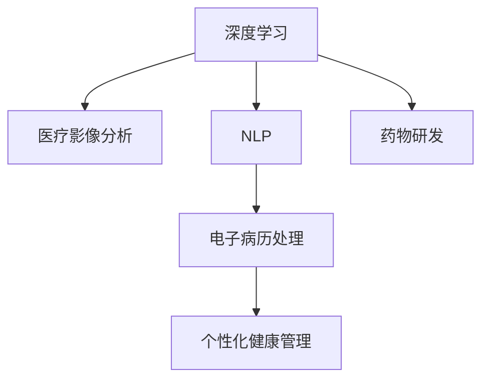

                 

# AI在医疗诊断和健康管理中的应用

## 1. 背景介绍

### 1.1 问题由来
人工智能（AI）技术的迅猛发展正在深刻改变各个行业，医疗健康领域也不例外。AI技术在医疗影像分析、电子病历处理、个性化健康管理等方面的应用，正逐步从实验室走向临床实践，为提升医疗服务质量和效率开辟了新的道路。

### 1.2 问题核心关键点
AI在医疗诊断和健康管理中的应用主要集中在以下几个方面：

1. **医疗影像分析**：利用深度学习技术对X光片、CT、MRI等医学影像进行自动分析和识别，辅助医生诊断疾病。
2. **电子病历处理**：通过自然语言处理（NLP）技术，自动分析患者电子病历中的病史、症状等信息，提取有价值的诊断信息。
3. **个性化健康管理**：基于患者历史健康数据和实时监测数据，利用机器学习模型进行健康状况预测和个性化建议。
4. **药物研发**：AI在药物分子设计、临床试验优化等方面的应用，大大加快了新药研发进程。

### 1.3 问题研究意义
AI在医疗诊断和健康管理中的应用，对提升医疗服务质量、降低医疗成本、改善患者体验等方面具有重要意义：

1. **提升诊断精度**：AI可以识别细微异常，辅助医生快速准确诊断疾病，减少误诊和漏诊率。
2. **优化诊疗流程**：通过自动化处理病历和影像数据，减少医生的工作负担，提高诊疗效率。
3. **个性化医疗**：基于患者数据，AI能够提供精准的个性化健康管理和治疗方案，提升治疗效果。
4. **加速新药研发**：AI技术在药物发现和临床试验中的广泛应用，大大缩短了新药上市周期。

## 2. 核心概念与联系

### 2.1 核心概念概述

为更好地理解AI在医疗诊断和健康管理中的应用，本节将介绍几个密切相关的核心概念：

- **深度学习**：通过构建多层神经网络，从大量数据中学习复杂映射关系，实现对复杂模式的高效识别。
- **医疗影像分析**：利用深度学习对医学影像进行自动分析和识别，辅助医生诊断和治疗。
- **自然语言处理（NLP）**：使计算机理解和处理人类语言，用于电子病历处理、智能问答等场景。
- **电子病历**：包含患者病史、检查报告、诊断结果等医疗信息的电子化记录，为AI提供了丰富的训练数据。
- **健康监测**：通过传感器、穿戴设备等手段，实时监测患者生理指标，为个性化健康管理提供数据支持。
- **机器学习**：通过训练数据学习规律，用于医疗诊断、疾病预测、健康管理等任务。

这些核心概念之间的逻辑关系可以通过以下Mermaid流程图来展示：



这个流程图展示了大语言模型的核心概念及其之间的关系：

1. 深度学习作为AI的基础技术，被广泛应用于医疗影像分析、电子病历处理和个性化健康管理等场景。
2. 医疗影像分析通过深度学习对医学影像进行自动分析和识别，辅助医生诊断和治疗。
3. NLP技术用于电子病历处理，帮助计算机理解和处理患者电子病历中的病史、症状等信息。
4. 基于患者历史健康数据和实时监测数据，机器学习模型进行健康状况预测和个性化建议，支撑个性化健康管理。
5. 深度学习在药物分子设计、临床试验优化等方面的应用，加快了新药研发进程。

这些概念共同构成了AI在医疗诊断和健康管理中的应用框架，使其能够在各种场景下发挥强大的医疗支持能力。

## 3. 核心算法原理 & 具体操作步骤
### 3.1 算法原理概述

AI在医疗诊断和健康管理中的应用，主要依赖于深度学习和机器学习算法。其核心思想是利用这些算法，从大规模医学数据中学习到疾病特征、症状关联等信息，从而辅助医生诊断、优化诊疗流程、个性化健康管理等任务。

形式化地，假设有一个疾病分类任务，训练集为 $D=\{(x_i, y_i)\}_{i=1}^N$，其中 $x_i$ 为患者病历或医学影像数据，$y_i$ 为疾病标签。我们的目标是找到一个函数 $f$，使得 $f(x_i)$ 尽可能接近 $y_i$。其中，$f$ 可以是一个深度神经网络，也可以是一个基于规则的机器学习模型。

通过梯度下降等优化算法，模型不断更新参数 $w$，最小化损失函数 $L(f, D)$，最终得到最优函数 $f^*$。在医疗诊断中，这个最优函数 $f^*$ 可以用于对新患者数据进行分类预测，辅助医生诊断。

### 3.2 算法步骤详解

AI在医疗诊断和健康管理中的应用，主要包括以下几个关键步骤：

**Step 1: 数据准备和预处理**

- 收集大量医学影像、电子病历、健康监测数据等，构建训练集 $D$。
- 对数据进行清洗和标注，去除噪声和错误信息，确保数据质量。
- 对影像数据进行预处理，如归一化、增强等，以提高模型识别能力。

**Step 2: 模型选择和训练**

- 根据任务需求选择合适的模型结构，如卷积神经网络（CNN）、递归神经网络（RNN）等。
- 使用深度学习框架（如TensorFlow、PyTorch等）搭建模型，设定合适的超参数，如学习率、批大小、迭代轮数等。
- 使用训练集 $D$ 对模型进行训练，最小化损失函数 $L(f, D)$，得到最优模型 $f^*$。

**Step 3: 模型评估和应用**

- 在验证集上对训练好的模型进行评估，计算准确率、召回率、F1分数等指标。
- 根据评估结果，调整模型参数或选择其他模型进行迭代训练。
- 将训练好的模型应用于实际医疗场景，辅助医生诊断、优化诊疗流程、个性化健康管理等任务。

### 3.3 算法优缺点

AI在医疗诊断和健康管理中的应用，具有以下优点：

1. **高效性**：通过深度学习等技术，模型可以快速处理大量数据，提高诊断和治疗效率。
2. **准确性**：AI在识别细微异常、预测疾病等方面具有较高准确性，辅助医生诊断和治疗。
3. **个性化**：基于患者数据，AI能够提供个性化的健康管理方案，提升治疗效果。
4. **成本低**：AI技术减少了人工干预，降低了医疗成本，提高了资源利用率。

同时，该方法也存在以下局限性：

1. **数据依赖**：模型的性能高度依赖于数据质量和数量，高质量的标注数据获取成本较高。
2. **解释性不足**：AI模型的决策过程缺乏可解释性，难以对其推理逻辑进行分析和调试。
3. **模型鲁棒性**：面对复杂和多样化的医疗数据，模型的泛化性能有限。
4. **伦理和安全**：AI技术在医疗应用中涉及患者隐私和数据安全问题，需要严格遵守相关法律法规。

尽管存在这些局限性，但就目前而言，AI在医疗诊断和健康管理中的应用仍是大有前途的。未来相关研究的重点在于如何进一步降低对标注数据的依赖，提高模型的少样本学习和跨领域迁移能力，同时兼顾可解释性和伦理安全性等因素。

### 3.4 算法应用领域

AI在医疗诊断和健康管理中的应用，覆盖了几乎所有常见任务，例如：

- **医疗影像分析**：如肺结节、乳腺癌等疾病的自动检测和分类。
- **电子病历处理**：通过自然语言处理技术，自动分析患者电子病历中的病史、症状等信息。
- **个性化健康管理**：基于患者历史健康数据和实时监测数据，利用机器学习模型进行健康状况预测和个性化建议。
- **药物研发**：通过深度学习技术，在药物分子设计、临床试验优化等方面的应用，大大加快了新药研发进程。
- **智能问答**：利用自然语言处理技术，构建智能问答系统，辅助医生和患者进行疾病咨询。

除了上述这些经典任务外，AI在医疗健康领域的应用还在不断拓展，如医疗数据挖掘、智能诊断、健康监测、远程医疗等，为医疗健康领域带来了新的突破。

## 4. 数学模型和公式 & 详细讲解 & 举例说明

### 4.1 数学模型构建

本节将使用数学语言对AI在医疗诊断和健康管理中的应用进行更加严格的刻画。

假设有一个二分类任务，训练集为 $D=\{(x_i, y_i)\}_{i=1}^N$，其中 $x_i$ 为患者病历或医学影像数据，$y_i$ 为疾病标签。我们的目标是找到一个函数 $f$，使得 $f(x_i)$ 尽可能接近 $y_i$。其中，$f$ 可以是一个深度神经网络，也可以是一个基于规则的机器学习模型。

定义模型 $f$ 在数据样本 $(x,y)$ 上的损失函数为 $\ell(f(x),y)$，则在数据集 $D$ 上的经验风险为：

$$
\mathcal{L}(f) = \frac{1}{N}\sum_{i=1}^N \ell(f(x_i),y_i)
$$

通过梯度下降等优化算法，模型不断更新参数 $w$，最小化损失函数 $\mathcal{L}(f)$，最终得到最优函数 $f^*$。在医疗诊断中，这个最优函数 $f^*$ 可以用于对新患者数据进行分类预测，辅助医生诊断。

### 4.2 公式推导过程

以下我们以二分类任务为例，推导交叉熵损失函数及其梯度的计算公式。

假设模型 $f$ 在输入 $x$ 上的输出为 $\hat{y}=f(x) \in [0,1]$，表示样本属于正类的概率。真实标签 $y \in \{0,1\}$。则二分类交叉熵损失函数定义为：

$$
\ell(f(x),y) = -[y\log \hat{y} + (1-y)\log (1-\hat{y})]
$$

将其代入经验风险公式，得：

$$
\mathcal{L}(f) = -\frac{1}{N}\sum_{i=1}^N [y_i\log f(x_i)+(1-y_i)\log(1-f(x_i))]
$$

根据链式法则，损失函数对参数 $w$ 的梯度为：

$$
\frac{\partial \mathcal{L}(f)}{\partial w} = -\frac{1}{N}\sum_{i=1}^N \left[ \frac{y_i}{f(x_i)}-\frac{1-y_i}{1-f(x_i)} \right] \frac{\partial f(x_i)}{\partial w}
$$

其中 $\frac{\partial f(x_i)}{\partial w}$ 可进一步递归展开，利用自动微分技术完成计算。

在得到损失函数的梯度后，即可带入参数更新公式，完成模型的迭代优化。重复上述过程直至收敛，最终得到适应二分类任务的最优模型 $f^*$。

## 5. 项目实践：代码实例和详细解释说明
### 5.1 开发环境搭建

在进行医疗诊断和健康管理应用的开发前，我们需要准备好开发环境。以下是使用Python进行TensorFlow开发的环境配置流程：

1. 安装Anaconda：从官网下载并安装Anaconda，用于创建独立的Python环境。

2. 创建并激活虚拟环境：
```bash
conda create -n tf-env python=3.8 
conda activate tf-env
```

3. 安装TensorFlow：根据CUDA版本，从官网获取对应的安装命令。例如：
```bash
conda install tensorflow -c conda-forge
```

4. 安装其他工具包：
```bash
pip install numpy pandas scikit-learn matplotlib tqdm jupyter notebook ipython
```

完成上述步骤后，即可在`tf-env`环境中开始医疗诊断和健康管理的开发实践。

### 5.2 源代码详细实现

下面我们以医疗影像分析中的肺结节检测为例，给出使用TensorFlow对深度学习模型进行训练的代码实现。

首先，定义模型结构：

```python
import tensorflow as tf
from tensorflow.keras.layers import Conv2D, MaxPooling2D, Flatten, Dense
from tensorflow.keras.models import Model

model = tf.keras.Sequential([
    Conv2D(32, 3, activation='relu', input_shape=(256, 256, 3)),
    MaxPooling2D(),
    Conv2D(64, 3, activation='relu'),
    MaxPooling2D(),
    Flatten(),
    Dense(64, activation='relu'),
    Dense(1, activation='sigmoid')
])
```

然后，定义损失函数和优化器：

```python
loss_fn = tf.keras.losses.BinaryCrossentropy()
optimizer = tf.keras.optimizers.Adam(learning_rate=0.001)
```

接着，定义训练和评估函数：

```python
from tensorflow.keras.metrics import Accuracy
import tensorflow.keras.backend as K

def train_epoch(model, dataset, batch_size, optimizer):
    dataloader = tf.data.Dataset.from_tensor_slices(dataset).shuffle(1000).batch(batch_size)
    model.compile(optimizer=optimizer, loss=loss_fn, metrics=[Accuracy()])
    model.fit(dataloader, epochs=10, steps_per_epoch=len(dataset)//batch_size)
    return model.evaluate(dataloader)

def evaluate(model, dataset, batch_size):
    dataloader = tf.data.Dataset.from_tensor_slices(dataset).shuffle(1000).batch(batch_size)
    return model.evaluate(dataloader)
```

最后，启动训练流程并在测试集上评估：

```python
epochs = 10
batch_size = 16

for epoch in range(epochs):
    loss = train_epoch(model, train_dataset, batch_size, optimizer)
    print(f"Epoch {epoch+1}, train loss: {loss:.3f}")
    
    print(f"Epoch {epoch+1}, test results:")
    evaluate(model, test_dataset, batch_size)
    
print("Final test results:")
evaluate(model, final_test_dataset, batch_size)
```

以上就是使用TensorFlow对深度学习模型进行医疗影像分析的代码实现。可以看到，TensorFlow提供的高级API使得模型搭建、训练、评估等流程变得简洁高效。

### 5.3 代码解读与分析

让我们再详细解读一下关键代码的实现细节：

**模型结构定义**：
- `Sequential`：按顺序堆叠多个层，形成一个简单的深度学习模型。
- `Conv2D`：二维卷积层，用于提取图像特征。
- `MaxPooling2D`：最大池化层，用于降维和特征提取。
- `Flatten`：将多维数据展平为一维，准备进入全连接层。
- `Dense`：全连接层，用于输出预测结果。

**损失函数和优化器**：
- `BinaryCrossentropy`：二分类交叉熵损失函数，用于二分类任务。
- `Adam`：优化器，用于更新模型参数。

**训练和评估函数**：
- `train_epoch`：对数据集进行迭代训练，计算损失和准确率。
- `evaluate`：在测试集上评估模型性能，返回损失和准确率。

**训练流程**：
- 定义总的epoch数和batch size，开始循环迭代
- 每个epoch内，先在训练集上训练，输出平均loss
- 在测试集上评估，输出loss和acc
- 所有epoch结束后，在final_test集上评估，给出最终测试结果

可以看到，TensorFlow提供的高级API使得模型搭建、训练、评估等流程变得简洁高效。开发者可以将更多精力放在数据处理、模型改进等高层逻辑上，而不必过多关注底层的实现细节。

当然，工业级的系统实现还需考虑更多因素，如模型的保存和部署、超参数的自动搜索、更灵活的任务适配层等。但核心的深度学习模型微调流程基本与此类似。

## 6. 实际应用场景
### 6.1 智能诊断系统

基于深度学习和大规模医疗影像数据的智能诊断系统，可以辅助医生进行快速准确的诊断。

在技术实现上，可以收集大量医疗影像数据，使用深度学习模型进行自动分析和识别，生成初步诊断报告。医生根据报告对病人进行进一步检查，并给出最终诊断结果。如此构建的智能诊断系统，能够提高诊断效率，减少误诊和漏诊，提升医疗服务质量。

### 6.2 电子病历分析系统

通过自然语言处理技术，构建电子病历分析系统，能够自动分析患者病历中的病史、症状等信息，提取有价值的诊断信息。

在技术实现上，可以使用基于BERT等预训练语言模型的NLP技术，对电子病历文本进行自动分析和理解。系统自动提取病历中的关键词、症状、检查结果等信息，生成初步诊断报告，辅助医生快速判断病情。

### 6.3 个性化健康管理系统

基于患者历史健康数据和实时监测数据，利用机器学习模型进行健康状况预测和个性化建议。

在技术实现上，可以收集患者的健康监测数据（如血压、血糖、心率等）和历史病历数据，构建训练集。使用机器学习模型进行训练，生成健康状况预测模型。系统根据用户的实时健康数据，预测其健康状况，并给出相应的健康建议和生活指导。

### 6.4 未来应用展望

随着深度学习、自然语言处理等技术的不断进步，基于AI的医疗诊断和健康管理将呈现以下几个发展趋势：

1. **多模态融合**：将医学影像、电子病历、健康监测等多模态数据融合，构建更加全面、准确的诊断和治疗系统。
2. **实时监测**：通过智能穿戴设备，实时监测患者健康状态，及时发现异常情况，提供紧急救助。
3. **远程医疗**：结合远程医疗技术，实时传输患者健康数据，辅助医生进行远程诊断和治疗。
4. **智能问答**：利用自然语言处理技术，构建智能问答系统，辅助医生和患者进行疾病咨询。
5. **个性化推荐**：基于患者历史健康数据和实时监测数据，推荐个性化的健康管理方案，提升治疗效果。

这些趋势展示了AI在医疗诊断和健康管理中的应用前景，相信随着技术的不断突破，AI将进一步提升医疗服务质量，改善患者体验，推动医疗健康领域的创新与发展。

## 7. 工具和资源推荐
### 7.1 学习资源推荐

为了帮助开发者系统掌握AI在医疗诊断和健康管理的应用理论基础和实践技巧，这里推荐一些优质的学习资源：

1. **Deep Learning Specialization by Andrew Ng**：由深度学习领域权威Andrew Ng开设的Coursera课程，全面介绍了深度学习的基础理论和应用。
2. **Medical Imaging with Deep Learning by Google**：Google开源的医疗影像处理课程，介绍了深度学习在医疗影像分析中的应用。
3. **Natural Language Processing with Applications in Healthcare**：Coursera上的NLP课程，介绍了NLP技术在医疗健康领域的应用。
4. **Health Analytics with Python**：DataCamp上的Python数据分析课程，介绍了如何利用Python进行健康数据分析和可视化。
5. **The Practical Guide to AI in Healthcare**：一本介绍AI在医疗健康领域应用的书籍，提供了大量的案例和实践指导。

通过对这些资源的学习实践，相信你一定能够快速掌握AI在医疗诊断和健康管理的应用精髓，并用于解决实际的医疗问题。

### 7.2 开发工具推荐

高效的开发离不开优秀的工具支持。以下是几款用于AI医疗应用开发的常用工具：

1. **TensorFlow**：Google开源的深度学习框架，生产部署方便，适合大规模工程应用。
2. **PyTorch**：Facebook开源的深度学习框架，灵活易用，适合快速迭代研究。
3. **Keras**：高层次的深度学习API，适合初学者和快速原型设计。
4. **HuggingFace Transformers**：基于TensorFlow和PyTorch的NLP库，提供多种预训练语言模型和工具。
5. **Scikit-learn**：Python机器学习库，提供了丰富的机器学习算法和工具。

合理利用这些工具，可以显著提升AI医疗应用开发的效率，加快创新迭代的步伐。

### 7.3 相关论文推荐

AI在医疗诊断和健康管理的应用源于学界的持续研究。以下是几篇奠基性的相关论文，推荐阅读：

1. **Deep Learning for Healthcare**：综述了深度学习在医疗健康领域的应用，包括医学影像分析、电子病历处理等。
2. **AI in Radiology: A Review of Recent Studies**：综述了深度学习在医学影像分析中的应用。
3. **Natural Language Processing with Transformers**：介绍了Transformer模型在NLP中的应用，包括电子病历处理。
4. **AI in Health Informatics**：综述了AI在健康信息学中的应用，包括健康监测、医疗问答等。
5. **Healthcare Applications of Deep Learning**：综述了深度学习在医疗健康领域的应用，包括个性化健康管理。

这些论文代表了大语言模型微调技术的发展脉络。通过学习这些前沿成果，可以帮助研究者把握学科前进方向，激发更多的创新灵感。

## 8. 总结：未来发展趋势与挑战
### 8.1 总结

本文对AI在医疗诊断和健康管理中的应用进行了全面系统的介绍。首先阐述了AI技术在医疗领域的应用背景和意义，明确了AI在医疗诊断和健康管理中的应用前景。其次，从原理到实践，详细讲解了深度学习模型的构建、训练、评估等关键步骤，给出了AI医疗应用的完整代码实例。同时，本文还广泛探讨了AI在智能诊断、电子病历处理、个性化健康管理等多个医疗场景的应用前景，展示了AI技术在医疗领域的巨大潜力。

通过本文的系统梳理，可以看到，AI技术正在深刻改变医疗服务模式，推动医疗健康领域的创新与发展。未来，伴随深度学习、自然语言处理等技术的不断进步，AI在医疗诊断和健康管理中的应用必将进一步深化，为人类健康事业带来深远影响。

### 8.2 未来发展趋势

展望未来，AI在医疗诊断和健康管理中的应用将呈现以下几个发展趋势：

1. **多模态融合**：将医学影像、电子病历、健康监测等多模态数据融合，构建更加全面、准确的诊断和治疗系统。
2. **实时监测**：通过智能穿戴设备，实时监测患者健康状态，及时发现异常情况，提供紧急救助。
3. **远程医疗**：结合远程医疗技术，实时传输患者健康数据，辅助医生进行远程诊断和治疗。
4. **智能问答**：利用自然语言处理技术，构建智能问答系统，辅助医生和患者进行疾病咨询。
5. **个性化推荐**：基于患者历史健康数据和实时监测数据，推荐个性化的健康管理方案，提升治疗效果。

这些趋势展示了AI在医疗诊断和健康管理中的应用前景，相信随着技术的不断突破，AI将进一步提升医疗服务质量，改善患者体验，推动医疗健康领域的创新与发展。

### 8.3 面临的挑战

尽管AI在医疗诊断和健康管理中的应用已经取得了显著成果，但在迈向更加智能化、普适化应用的过程中，仍面临诸多挑战：

1. **数据质量和安全**：AI模型的性能高度依赖于数据质量和数量，高质量的标注数据获取成本较高。此外，患者数据涉及隐私和安全问题，需要严格遵守相关法律法规。
2. **模型解释性**：AI模型的决策过程缺乏可解释性，难以对其推理逻辑进行分析和调试。这对于高风险应用如医疗诊断，尤为重要。
3. **模型鲁棒性**：面对复杂和多样化的医疗数据，模型的泛化性能有限。如何在不遗忘原有知识的同时，高效吸收新样本信息，将成为重要的研究课题。
4. **伦理和道德**：AI技术在医疗应用中涉及患者隐私和数据安全问题，需要严格遵守相关法律法规。同时，算法的可解释性和可审计性尤为重要。
5. **计算资源**：超大批次的训练和推理也可能遇到显存不足的问题。如何优化计算图，提升模型推理效率，优化资源占用，将是重要的优化方向。

正视AI在医疗诊断和健康管理中所面临的挑战，积极应对并寻求突破，将是大语言模型微调走向成熟的必由之路。相信随着学界和产业界的共同努力，这些挑战终将一一被克服，AI在医疗诊断和健康管理中的应用必将在未来取得更大的突破。

### 8.4 研究展望

面对AI在医疗诊断和健康管理中所面临的挑战，未来的研究需要在以下几个方面寻求新的突破：

1. **探索无监督和半监督学习**：摆脱对大规模标注数据的依赖，利用自监督学习、主动学习等无监督和半监督范式，最大限度利用非结构化数据，实现更加灵活高效的医疗诊断。
2. **研究参数高效和计算高效模型**：开发更加参数高效的模型，在固定大部分预训练参数的同时，只更新极少量的任务相关参数。同时优化计算图，减少前向传播和反向传播的资源消耗，实现更加轻量级、实时性的部署。
3. **融合因果和对比学习范式**：通过引入因果推断和对比学习思想，增强模型的稳定因果关系能力，学习更加普适、鲁棒的语言表征。
4. **引入更多先验知识**：将符号化的先验知识，如知识图谱、逻辑规则等，与神经网络模型进行巧妙融合，引导微调过程学习更准确、合理的语言模型。
5. **结合因果分析和博弈论工具**：将因果分析方法引入微调模型，识别出模型决策的关键特征，增强输出解释的因果性和逻辑性。

这些研究方向的探索，必将引领AI在医疗诊断和健康管理的应用迈向更高的台阶，为构建安全、可靠、可解释、可控的智能系统铺平道路。面向未来，AI在医疗诊断和健康管理技术还需要与其他人工智能技术进行更深入的融合，如知识表示、因果推理、强化学习等，多路径协同发力，共同推动自然语言理解和智能交互系统的进步。

## 9. 附录：常见问题与解答
**Q1：AI在医疗诊断中如何保证数据的质量和隐私？**

A: AI在医疗诊断中，数据的质量和隐私问题至关重要。为了保证数据质量，需要：
1. **数据清洗**：对数据进行预处理，去除噪声和错误信息，确保数据质量。
2. **数据标注**：对数据进行标注，确保标注的准确性和一致性。
3. **数据标准化**：对数据进行标准化处理，确保不同数据源的数据格式和单位一致。

为了保证数据隐私，需要：
1. **匿名化处理**：对患者数据进行匿名化处理，确保数据中无法识别个人身份信息。
2. **数据加密**：对数据进行加密处理，确保数据在传输和存储过程中的安全性。
3. **访问控制**：对数据访问进行严格控制，确保只有授权人员才能访问数据。

**Q2：AI在医疗诊断中如何提高模型的泛化性能？**

A: 提高AI在医疗诊断中的模型泛化性能，可以从以下几个方面入手：
1. **增加数据量**：收集更多的医学数据，增加模型的训练数据量，提高模型的泛化能力。
2. **多模态融合**：将医学影像、电子病历、健康监测等多模态数据融合，构建更加全面、准确的诊断和治疗系统。
3. **迁移学习**：在特定领域的数据上进行微调，提高模型对新数据的泛化能力。
4. **正则化技术**：使用L2正则、Dropout等正则化技术，防止模型过拟合。
5. **对抗训练**：引入对抗样本，提高模型的鲁棒性和泛化能力。

**Q3：AI在医疗诊断中如何处理长尾数据问题？**

A: AI在医疗诊断中，长尾数据问题是一个常见问题。长尾数据问题指的是数据分布不平衡，某些类别的数据非常少。为了处理长尾数据问题，可以：
1. **数据增强**：通过对训练样本进行扩充，生成更多的负样本，提高长尾类别的数据量。
2. **过采样**：对长尾类别进行过采样，生成更多的正样本，平衡数据分布。
3. **重采样**：对数据集进行重采样，生成更均衡的数据分布。
4. **类别权重调整**：对长尾类别的损失函数进行权重调整，赋予更高的优先级。

这些方法可以在一定程度上缓解长尾数据问题，提高模型的泛化能力。

**Q4：AI在医疗诊断中如何进行模型解释性分析？**

A: AI在医疗诊断中，模型的解释性分析至关重要。为了进行模型解释性分析，可以：
1. **LIME**：使用局部可解释模型-不可解释模型（LIME）方法，生成局部可解释的模型解释。
2. **SHAP**：使用SHapley Additive exPlanations（SHAP）方法，生成模型输出的逐元素解释。
3. **Grad-CAM**：使用梯度热力图（Grad-CAM）方法，生成模型的局部激活特征图，可视化模型在特定区域的关注点。

这些方法可以帮助开发者理解AI模型的内部工作机制，提高模型的可解释性。

**Q5：AI在医疗诊断中如何进行模型鲁棒性测试？**

A: AI在医疗诊断中，模型的鲁棒性测试至关重要。为了进行模型鲁棒性测试，可以：
1. **对抗样本攻击**：生成对抗样本，测试模型对噪声的鲁棒性。
2. **数据增强**：通过对训练样本进行扩充，生成更多的对抗样本，提高模型的鲁棒性。
3. **正则化技术**：使用L2正则、Dropout等正则化技术，防止模型过拟合，提高模型的鲁棒性。
4. **多模态融合**：将医学影像、电子病历、健康监测等多模态数据融合，提高模型的鲁棒性。

这些方法可以在一定程度上提高模型的鲁棒性，增强模型在复杂和多样化的医疗数据中的表现。

**Q6：AI在医疗诊断中如何进行模型性能优化？**

A: AI在医疗诊断中，模型的性能优化至关重要。为了进行模型性能优化，可以：
1. **超参数调优**：通过网格搜索、随机搜索等方法，对模型的超参数进行调优，提高模型性能。
2. **模型裁剪**：对模型进行裁剪，去除不必要的层和参数，减小模型尺寸，提高推理速度。
3. **量化加速**：将浮点模型转为定点模型，压缩存储空间，提高计算效率。
4. **分布式训练**：利用分布式训练技术，加速模型训练过程，提高训练效率。

这些方法可以在一定程度上提高模型的性能和效率，优化模型训练和推理过程。

**Q7：AI在医疗诊断中如何进行模型部署？**

A: AI在医疗诊断中，模型的部署也是一个重要环节。为了进行模型部署，可以：
1. **模型保存**：将训练好的模型保存为模型文件，方便后续使用。
2. **模型封装**：将模型封装为标准化服务接口，便于集成调用。
3. **服务化部署**：将模型部署到云端或本地服务器，提供实时服务。
4. **监控告警**：实时采集系统指标，设置异常告警阈值，确保服务稳定性。

这些方法可以在一定程度上提高模型的部署效率和稳定性，确保模型在实际应用中的性能和可靠性。

综上所述，AI在医疗诊断和健康管理中的应用前景广阔，但在应用过程中仍需面对数据质量、隐私保护、模型解释性、鲁棒性、性能优化等诸多挑战。只有在技术、算法、工程、业务等多个维度进行全面优化，才能充分发挥AI在医疗诊断和健康管理中的潜力，推动医疗健康领域的发展与创新。

