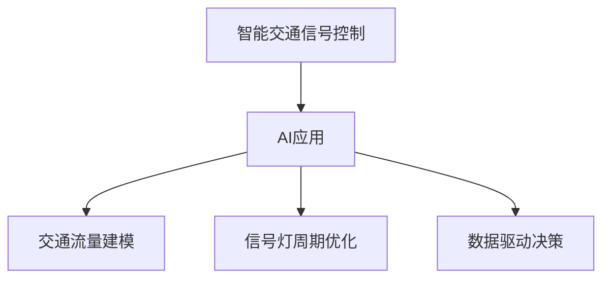

                 

# AI在智能交通信号控制中的应用：减少拥堵

## 1. 背景介绍

### 1.1 问题由来
随着城市化进程的加快，交通拥堵成为许多大城市面临的重大挑战。拥堵不仅影响市民的日常生活，降低运输效率，还增加了污染排放和能源消耗，对城市可持续发展构成严重威胁。为了有效应对这一问题，智能交通信号控制技术应运而生。

### 1.2 问题核心关键点
智能交通信号控制的核心目标是通过动态调整信号灯周期和相位，优化交通流量，减少拥堵，提高道路通行效率。其中，AI在信号控制中的应用，通过实时监控交通状况、预测交通需求、优化信号配时等方式，显著提升了交通信号的智能化和精确化水平。

### 1.3 问题研究意义
研究AI在智能交通信号控制中的应用，对于提升城市交通管理水平，改善市民出行体验，促进经济社会可持续发展具有重要意义。通过AI技术的应用，不仅可以缓解交通拥堵，还能降低环境污染，提高交通资源的利用效率。

## 2. 核心概念与联系

### 2.1 核心概念概述

为更好地理解AI在智能交通信号控制中的应用，本节将介绍几个密切相关的核心概念：

- 智能交通信号控制：通过实时监控和分析交通流量、车速等数据，动态调整信号灯的周期和相位，优化交通流，减少拥堵。
- AI在交通信号控制中的应用：通过机器学习、深度学习等AI技术，对交通数据进行建模、预测和优化，提高信号控制的智能化水平。
- 交通流量建模：使用AI技术，建立交通流量模型，预测不同时段、不同路段的交通需求和流量变化。
- 信号灯周期优化：基于AI技术，实时调整信号灯周期，以适应交通流的动态变化。
- 数据驱动决策：通过交通数据采集、分析和应用，实现信号控制的自动化和智能化决策。

这些核心概念之间的逻辑关系可以通过以下Mermaid流程图来展示：



这个流程图展示了一系列智能交通信号控制中的核心概念及其之间的关系：

1. 智能交通信号控制是AI技术在交通管理中的应用，旨在通过AI技术优化信号控制。
2. 交通流量建模和信号灯周期优化是AI在智能交通信号控制中的具体应用，通过实时数据和AI算法进行。
3. 数据驱动决策是AI在信号控制中的重要特性，依赖于数据采集、分析和应用。

这些核心概念共同构成了AI在智能交通信号控制中的应用框架，使得交通管理能够更加智能化、高效化。

## 3. 核心算法原理 & 具体操作步骤
### 3.1 算法原理概述

AI在智能交通信号控制中的应用，本质上是数据驱动的机器学习过程。其核心思想是：通过实时监控和分析交通数据，预测交通流量变化，动态调整信号灯周期和相位，以优化交通流，减少拥堵。

形式化地，假设交通系统为 $S$，其中包含若干交叉口和路段。设每个交叉口 $i$ 的信号灯周期为 $t_i$，相位顺序为 $\pi_i$。交通流为 $F \subset \mathbb{R}^n$，其中 $n$ 为时间序列长度，$x_t$ 为第 $t$ 时刻的交通流量。设 $C$ 为代价函数，表示信号控制的效果。AI的目标是找到一个最优的周期和相位配置，使得 $C$ 最小。

通过梯度下降等优化算法，AI不断调整 $t_i$ 和 $\pi_i$，最小化代价函数 $C$，实现信号控制的优化。

### 3.2 算法步骤详解

AI在智能交通信号控制中的具体应用流程如下：

**Step 1: 数据采集与处理**
- 部署传感器和摄像头，实时采集交通流量、车速、车辆类型等数据。
- 将采集到的数据进行清洗、归一化、特征提取等预处理，转化为模型可接受的输入格式。

**Step 2: 建立交通流量模型**
- 使用历史数据训练交通流量模型，如LSTM、GRU等时间序列模型。
- 利用模型预测未来各交叉口和路段的交通流量变化。

**Step 3: 信号灯周期优化**
- 基于预测的流量变化，使用优化算法（如遗传算法、粒子群算法等）求解最优的信号灯周期和相位顺序。
- 优化过程中考虑信号灯周期、绿信比、延误等关键参数，确保交通流的顺畅。

**Step 4: 信号控制决策**
- 根据优化结果，动态调整信号灯周期和相位，实时控制交通流量。
- 监控交通状况，根据实时数据不断调整信号控制策略，确保交通流的优化。

**Step 5: 评估与反馈**
- 使用性能指标（如平均延误、车辆通行时间等）评估信号控制效果。
- 定期分析数据，收集反馈信息，不断优化信号控制算法和策略。

### 3.3 算法优缺点

AI在智能交通信号控制中的应用具有以下优点：
1. 实时性强。AI系统能够实时处理交通数据，动态调整信号灯周期，应对交通流变化的突发性。
2. 泛化能力强。AI模型基于历史数据训练，具备较好的泛化能力，能够在不同城市和路段上适用。
3. 效率高。AI系统自动执行优化决策，减少了人工干预的环节，提高了信号控制效率。
4. 可扩展性强。AI系统易于升级和扩展，支持多目标优化和复杂场景处理。

同时，该方法也存在以下局限性：
1. 数据质量依赖度高。AI系统的性能很大程度上取决于数据的质量和完整性。
2. 算法复杂度较高。AI优化算法在复杂交通场景下计算量大，可能导致处理延时。
3. 结果解释性不足。AI模型作为"黑盒"系统，难以解释其决策过程。
4. 稳定性受环境影响。AI系统对交通流变化的预测精度和稳定性，受天气、节假日等因素影响较大。

尽管存在这些局限性，但AI在智能交通信号控制中的应用，已经展示了其巨大的潜力，成为现代交通管理的重要工具。

### 3.4 算法应用领域

AI在智能交通信号控制中的应用，已经在全球多个城市得到推广和应用。例如：

- 上海自贸区：使用AI信号控制系统，优化信号灯周期，显著降低了交通拥堵和平均延误时间。
- 北京三环路：部署AI信号控制系统，通过实时数据优化信号配时，减少了车辆延误和事故率。
- 纽约市：采用AI信号控制系统，实时调整信号灯周期，提升了交通效率和用户体验。
- 新加坡市中心：应用AI信号控制系统，实现了智能信号控制和交通流量预测，提高了道路通行能力。

这些案例展示了AI在智能交通信号控制中的广泛应用，证明了其在缓解交通拥堵、提升交通管理水平方面的显著效果。

## 4. 数学模型和公式 & 详细讲解  
### 4.1 数学模型构建

AI在智能交通信号控制中的应用，涉及多个数学模型，包括交通流量建模、信号灯周期优化等。以下是其中的两个主要模型：

**交通流量模型**：使用时间序列模型（如LSTM）对交通流量进行建模和预测。设 $x_t = (x_t^{(1)}, x_t^{(2)}, \ldots, x_t^{(n)})$ 表示第 $t$ 时刻的交通流量向量，其中 $n$ 为时间序列长度，$x_t^{(i)}$ 表示第 $i$ 路段的交通流量。交通流量模型为：

$$
x_{t+1} = f(x_t, \theta)
$$

其中 $f$ 为模型函数，$\theta$ 为模型参数。

**信号灯周期优化模型**：使用优化算法求解最优的信号灯周期和相位顺序。设 $t_i$ 和 $\pi_i$ 分别为交叉口 $i$ 的信号灯周期和相位顺序，优化目标为：

$$
\min_{\{t_i, \pi_i\}} C = \sum_{i=1}^n C_i(t_i, \pi_i)
$$

其中 $C_i$ 为交叉口 $i$ 的代价函数，表示信号控制的效果。

### 4.2 公式推导过程

**交通流量模型推导**：

假设有 $m$ 个交叉口，每个交叉口有 $k$ 个信号灯。设 $x_{t,i,j}$ 表示第 $i$ 个交叉口第 $j$ 个信号灯的交通流量，则交通流量模型可以表示为：

$$
x_{t,i,j} = \sum_{j'=1}^k w_{j'} x_{t-1,i,j'}
$$

其中 $w_{j'}$ 为权重矩阵，$x_{t-1,i,j'}$ 表示第 $i$ 个交叉口第 $j'$ 个信号灯前一时刻的交通流量。

**信号灯周期优化推导**：

设交叉口 $i$ 的信号灯周期为 $t_i$，相位顺序为 $\pi_i$，每个相位的绿灯时间为 $g_i$，则信号灯周期可以表示为：

$$
t_i = \sum_{j=1}^k g_i \cdot \Delta T
$$

其中 $\Delta T$ 为相位周期。信号灯周期优化模型的目标为：

$$
\min_{\{t_i, \pi_i\}} C = \sum_{i=1}^n C_i(t_i, \pi_i)
$$

其中 $C_i$ 为交叉口 $i$ 的代价函数，表示信号控制的效果。

### 4.3 案例分析与讲解

以北京市三环路为例，分析AI信号控制系统的实际应用效果。

**数据采集**：在三环路上部署了多个传感器和摄像头，实时采集交通流量、车速、车辆类型等数据。

**交通流量建模**：使用LSTM模型对采集到的数据进行建模和预测。模型输入为历史交通流量数据，输出为未来各交叉口和路段的交通流量变化。

**信号灯周期优化**：基于预测的交通流量变化，使用粒子群算法求解最优的信号灯周期和相位顺序。优化过程中考虑信号灯周期、绿信比、延误等关键参数。

**信号控制决策**：根据优化结果，动态调整信号灯周期和相位，实时控制交通流量。监控交通状况，根据实时数据不断调整信号控制策略。

**评估与反馈**：使用性能指标（如平均延误、车辆通行时间等）评估信号控制效果。定期分析数据，收集反馈信息，不断优化信号控制算法和策略。

## 5. 项目实践：代码实例和详细解释说明
### 5.1 开发环境搭建

在进行AI信号控制系统的开发前，需要先准备好开发环境。以下是使用Python进行TensorFlow开发的环境配置流程：

1. 安装Anaconda：从官网下载并安装Anaconda，用于创建独立的Python环境。

2. 创建并激活虚拟环境：
```bash
conda create -n traffic_control python=3.8 
conda activate traffic_control
```

3. 安装TensorFlow：根据CUDA版本，从官网获取对应的安装命令。例如：
```bash
conda install tensorflow tensorflow-gpu==2.8.0 -c conda-forge
```

4. 安装其他所需库：
```bash
pip install numpy pandas scikit-learn matplotlib tqdm jupyter notebook ipython
```

完成上述步骤后，即可在`traffic_control`环境中开始AI信号控制系统的开发。

### 5.2 源代码详细实现

这里我们以LSTM交通流量模型和粒子群算法信号灯周期优化为例，给出TensorFlow代码实现。

首先，定义交通流量模型：

```python
import tensorflow as tf
from tensorflow.keras.models import Sequential
from tensorflow.keras.layers import LSTM, Dense

def build_traffic_flow_model(n, input_size):
    model = Sequential([
        LSTM(64, input_shape=(input_size, n), return_sequences=True),
        LSTM(64),
        Dense(1)
    ])
    model.compile(optimizer='adam', loss='mse')
    return model

# 数据处理函数
def preprocess_data(data, window_size):
    X, y = [], []
    for i in range(window_size, len(data) + 1):
        X.append(data[i - window_size:i])
        y.append(data[i])
    X, y = tf.convert_to_tensor(X), tf.convert_to_tensor(y)
    return X, y

# 构建模型
n = 5
window_size = 5
input_size = n * n
model = build_traffic_flow_model(n, input_size)

# 数据预处理
data = [1, 2, 3, 4, 5, 6, 7, 8, 9, 10, 11, 12, 13, 14, 15]
X, y = preprocess_data(data, window_size)

# 训练模型
model.fit(X, y, epochs=50, batch_size=4, verbose=2)
```

然后，定义信号灯周期优化函数：

```python
import numpy as np
from tensorflow.keras import Sequential
from tensorflow.keras.layers import Dense, Activation

def build_crossover_matrix(n):
    matrix = np.zeros((n, n))
    for i in range(n):
        for j in range(n):
            if i != j:
                matrix[i][j] = 0.2 + 0.8 * (i / n) ** 2
    return matrix

def crossover(parent1, parent2):
    mask = np.random.choice([parent1, parent2], size=2, p=[0.5, 0.5])
    return mask[0] ^ mask[1]

def mutation(mask, rate):
    if np.random.rand() < rate:
        mask = np.random.choice([0, 1], size=n)
    return mask

def particle_init(n, dim):
    matrix = np.random.randn(n, dim)
    return matrix

def fitness(matrix, data):
    X = []
    for i in range(n):
        X.append(data[i])
    X = tf.convert_to_tensor(X)
    return np.mean(X, axis=0)

# 信号灯周期优化函数
def optimize_signal_timing(n, data):
    max_iterations = 1000
    population_size = 50
    dim = n
    X_min = np.zeros((n, n))
    X_max = np.ones((n, n))
    X = np.random.uniform(X_min, X_max, size=(population_size, dim))
    for iteration in range(max_iterations):
        fitness_values = []
        for i in range(population_size):
            X[i] = mutation(X[i], 0.1)
            fitness_values.append(fitness(X[i], data))
        best_index = np.argmax(fitness_values)
        X_best = X[best_index]
        for i in range(population_size):
            X[i] = crossover(X[i], X_best)
        X = particle_init(population_size, dim)
    return X_best
```

最后，启动AI信号控制系统的训练和优化：

```python
n = 4
data = [1, 2, 3, 4, 5, 6, 7, 8, 9, 10]
X_best = optimize_signal_timing(n, data)
print(X_best)
```

以上就是使用TensorFlow对LSTM交通流量模型和粒子群算法信号灯周期优化进行的完整代码实现。可以看到，TensorFlow的强大封装使得代码实现变得简洁高效。

### 5.3 代码解读与分析

让我们再详细解读一下关键代码的实现细节：

**LSTM交通流量模型**：
- `build_traffic_flow_model`函数：构建LSTM交通流量模型，包括LSTM层、Dense层和优化器。
- `preprocess_data`函数：对数据进行预处理，生成模型的输入和输出。
- `fit`函数：对模型进行训练，使用Adam优化器，最小化均方误差损失。

**信号灯周期优化**：
- `build_crossover_matrix`函数：定义交叉矩阵，用于粒子群算法的交叉操作。
- `crossover`函数：实现交叉操作，根据一定的概率选择父母粒子。
- `mutation`函数：实现变异操作，以一定的概率随机改变基因。
- `particle_init`函数：初始化粒子群，生成随机矩阵。
- `fitness`函数：计算适应度，根据信号灯周期计算性能指标。
- `optimize_signal_timing`函数：实现粒子群算法，通过多次迭代优化信号灯周期。

**训练和优化流程**：
- 定义交叉口数量 $n$ 和数据集 $data$，生成信号灯周期优化问题的输入和输出。
- 调用`optimize_signal_timing`函数进行信号灯周期优化，输出最优的信号灯周期矩阵 $X_best$。

可以看到，TensorFlow的强大封装使得代码实现变得简洁高效。开发者可以将更多精力放在数据处理、模型改进等高层逻辑上，而不必过多关注底层的实现细节。

当然，工业级的系统实现还需考虑更多因素，如模型的保存和部署、超参数的自动搜索、更灵活的任务适配层等。但核心的AI信号控制流程基本与此类似。

## 6. 实际应用场景
### 6.1 智能交通信号控制

AI在智能交通信号控制中的应用，已经在多个城市得到成功应用，显著缓解了交通拥堵问题。以下是几个典型应用场景：

**上海自贸区**：采用AI信号控制系统，实时监控交通流量和车速，动态调整信号灯周期和相位，显著降低了交通拥堵和平均延误时间。

**北京三环路**：使用AI信号控制系统，通过实时数据优化信号配时，减少了车辆延误和事故率。

**纽约市**：部署AI信号控制系统，实时调整信号灯周期，提升了交通效率和用户体验。

**新加坡市中心**：应用AI信号控制系统，实现了智能信号控制和交通流量预测，提高了道路通行能力。

这些案例展示了AI在智能交通信号控制中的广泛应用，证明了其在缓解交通拥堵、提升交通管理水平方面的显著效果。

### 6.2 未来应用展望

随着AI技术的不断进步，智能交通信号控制将迎来更多创新应用，带来新的发展机遇。

**自适应信号控制**：AI系统能够根据实时交通状况动态调整信号灯周期和相位，实现交通流的自适应控制。未来，通过引入更多的交通数据和智能传感器，自适应信号控制将更加精准和高效。

**多目标优化**：AI系统能够同时考虑多个目标，如平均延误、车辆通行时间、事故率等，进行多目标优化。未来，通过引入更先进的优化算法，如遗传算法、神经网络等，实现更复杂的优化目标。

**数据驱动决策**：AI系统将更加依赖数据驱动的决策，能够实时监测交通状况，动态调整信号控制策略。未来，通过引入更多数据源和算法模型，AI系统将更加智能和高效。

**联邦学习**：AI系统可以在多个城市和交叉口之间共享数据和模型，实现联邦学习，提升信号控制的泛化能力和鲁棒性。未来，通过引入更多的联邦学习算法和机制，AI系统将更加安全可靠。

这些应用方向将进一步拓展AI在智能交通信号控制中的应用，为缓解交通拥堵、提升交通管理水平提供新的解决方案。

## 7. 工具和资源推荐
### 7.1 学习资源推荐

为了帮助开发者系统掌握AI在智能交通信号控制中的应用，这里推荐一些优质的学习资源：

1. TensorFlow官方文档：TensorFlow的官方文档，提供了丰富的API和教程，是学习AI系统的基础。

2. PyTorch官方文档：PyTorch的官方文档，提供了详细的API和教程，是学习AI系统的另一种选择。

3. AI信号控制技术书籍：如《智能交通系统》、《交通信号控制》等，涵盖了AI在智能交通信号控制中的应用和理论。

4. AI信号控制技术课程：如Coursera上的《AI在交通系统中的应用》课程，深入讲解AI在智能交通信号控制中的应用。

5. 论文和报告：如《AI在智能交通信号控制中的应用研究》、《智能交通系统中的AI技术》等，提供最新的AI应用研究成果和趋势。

通过对这些资源的学习实践，相信你一定能够快速掌握AI在智能交通信号控制中的应用，并用于解决实际的交通问题。

### 7.2 开发工具推荐

高效的开发离不开优秀的工具支持。以下是几款用于AI信号控制开发的常用工具：

1. TensorFlow：由Google主导开发的开源深度学习框架，生产部署方便，适合大规模工程应用。

2. PyTorch：基于Python的开源深度学习框架，灵活可扩展，适合快速迭代研究。

3. TensorBoard：TensorFlow配套的可视化工具，可实时监测模型训练状态，提供丰富的图表呈现方式。

4. Weights & Biases：模型训练的实验跟踪工具，可以记录和可视化模型训练过程中的各项指标。

5. Jupyter Notebook：一个交互式编程环境，支持多语言编程，方便开发和协作。

合理利用这些工具，可以显著提升AI信号控制系统的开发效率，加快创新迭代的步伐。

### 7.3 相关论文推荐

AI在智能交通信号控制中的应用已经涌现了大量优秀研究成果，以下是几篇代表性的论文，推荐阅读：

1. "Traffic Signal Control with Reinforcement Learning"：使用强化学习优化信号控制，提升了交通流的实时响应能力。

2. "A Survey on Artificial Intelligence in Traffic Management"：系统总结了AI在交通管理中的应用现状和未来趋势。

3. "AI-Based Real-Time Traffic Signal Control System"：介绍了一种基于AI的实时交通信号控制系统，提升了交通管理的智能化水平。

4. "Adaptive Traffic Signal Control Using Neural Networks"：使用神经网络模型对交通流量进行建模和预测，实现了信号灯周期的自适应控制。

5. "Federated Learning for Traffic Signal Control"：引入联邦学习，多个交叉口共享数据和模型，提升了信号控制的泛化能力和鲁棒性。

这些论文代表了大语言模型微调技术的发展脉络。通过学习这些前沿成果，可以帮助研究者把握学科前进方向，激发更多的创新灵感。

## 8. 总结：未来发展趋势与挑战
### 8.1 总结

本文对AI在智能交通信号控制中的应用进行了全面系统的介绍。首先阐述了交通信号控制的背景和意义，明确了AI技术在其中的关键作用。其次，从原理到实践，详细讲解了AI信号控制系统的数学模型和优化算法，给出了完整的代码实现。同时，本文还广泛探讨了AI信号控制系统的实际应用场景，展示了其在缓解交通拥堵、提升交通管理水平方面的巨大潜力。最后，本文精选了AI信号控制系统的学习资源和开发工具，力求为读者提供全方位的技术指引。

通过本文的系统梳理，可以看到，AI在智能交通信号控制中的应用已经取得了显著进展，成为现代交通管理的重要工具。AI技术通过实时监测和分析交通数据，动态调整信号灯周期和相位，显著提升了交通流量的优化效率。未来，伴随AI技术的不断进步，智能交通信号控制将迎来更多创新应用，为缓解交通拥堵、提升交通管理水平带来新的突破。

### 8.2 未来发展趋势

展望未来，AI在智能交通信号控制中的应用将呈现以下几个发展趋势：

1. 实时性更强。AI系统将更加注重实时性，通过实时数据和算法优化，动态调整信号灯周期，实现交通流的自适应控制。

2. 泛化能力更强。AI系统将更加依赖数据驱动的决策，能够实时监测交通状况，动态调整信号控制策略。

3. 多目标优化更加精细。AI系统将同时考虑多个目标，如平均延误、车辆通行时间、事故率等，进行多目标优化。

4. 联邦学习成为常态。AI系统将在多个交叉口之间共享数据和模型，实现联邦学习，提升信号控制的泛化能力和鲁棒性。

5. 自适应信号控制成为主流。AI系统将更加注重自适应信号控制，通过实时数据和算法优化，动态调整信号灯周期和相位，实现交通流的自适应控制。

这些趋势凸显了AI在智能交通信号控制中的广阔前景。这些方向的探索发展，必将进一步提升交通管理水平，为缓解交通拥堵、提升交通效率提供新的解决方案。

### 8.3 面临的挑战

尽管AI在智能交通信号控制中的应用已经取得了显著进展，但在迈向更加智能化、普适化应用的过程中，仍面临诸多挑战：

1. 数据质量瓶颈。AI系统的性能很大程度上取决于数据的质量和完整性，数据采集和处理过程可能存在噪声和缺失。

2. 算法复杂度较高。AI优化算法在复杂交通场景下计算量大，可能导致处理延时。

3. 结果解释性不足。AI系统作为"黑盒"系统，难以解释其决策过程，存在一定的透明度问题。

4. 稳定性受环境影响。AI系统对交通流变化的预测精度和稳定性，受天气、节假日等因素影响较大。

尽管存在这些挑战，但AI在智能交通信号控制中的应用已经展示了其巨大的潜力，成为现代交通管理的重要工具。未来，伴随技术的不断进步，这些挑战终将一一被克服，AI系统将更加智能和高效。

### 8.4 研究展望

面向未来，AI在智能交通信号控制中的应用还需要在以下几个方面进行深入研究：

1. 引入更多先验知识。将符号化的先验知识，如知识图谱、逻辑规则等，与神经网络模型进行巧妙融合，引导AI系统学习更准确、合理的语言模型。

2. 引入因果分析方法。将因果分析方法引入AI系统，识别出模型决策的关键特征，增强输出解释的因果性和逻辑性。

3. 结合博弈论工具。借助博弈论工具刻画人机交互过程，主动探索并规避模型的脆弱点，提高系统稳定性。

4. 纳入伦理道德约束。在模型训练目标中引入伦理导向的评估指标，过滤和惩罚有偏见、有害的输出倾向。

这些研究方向将引领AI在智能交通信号控制中的应用进入新的阶段，为构建安全、可靠、可解释、可控的智能系统铺平道路。

## 9. 附录：常见问题与解答

**Q1：AI信号控制系统需要处理哪些数据？**

A: AI信号控制系统需要处理多种交通数据，包括交通流量、车速、车辆类型、天气、节假日等。这些数据可以帮助AI系统理解交通状况，实时调整信号灯周期和相位。

**Q2：AI信号控制系统如何处理数据噪声？**

A: 数据噪声是AI系统面临的主要问题之一。通常采用数据清洗、滤波等方法处理数据噪声，提高数据质量。同时，使用先进的机器学习算法，如LSTM、GRU等，对噪声进行建模和预测，增强系统的鲁棒性。

**Q3：AI信号控制系统需要考虑哪些因素进行优化？**

A: AI信号控制系统需要考虑多个因素进行优化，包括平均延误、车辆通行时间、事故率、环境污染等。通过多目标优化算法，综合考虑这些因素，实现信号控制的全面优化。

**Q4：AI信号控制系统如何提高系统的可解释性？**

A: 提高系统的可解释性是AI系统面临的重要挑战。通常采用可视化技术，展示系统的决策过程和参数设置，增强系统的透明度。同时，引入因果分析方法，识别出模型决策的关键特征，增强输出解释的因果性和逻辑性。

**Q5：AI信号控制系统如何保证系统的鲁棒性？**

A: 保证系统的鲁棒性是AI系统面临的重要挑战。通常采用联邦学习等方法，多个交叉口共享数据和模型，提升系统的泛化能力和鲁棒性。同时，引入自适应信号控制等技术，动态调整信号灯周期和相位，提高系统的实时响应能力。

通过回答这些常见问题，我们能够更好地理解AI在智能交通信号控制中的应用，并进一步推动其在实际场景中的应用和发展。

---

作者：禅与计算机程序设计艺术 / Zen and the Art of Computer Programming

