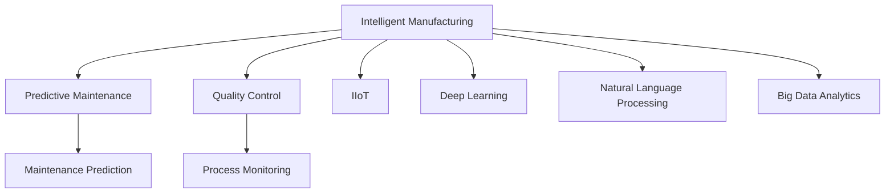

                 

# AI在智能制造中的应用：预测性维护与质量控制

> 关键词：
- 智能制造
- 预测性维护
- 质量控制
- 机器学习
- 深度学习
- 大数据分析
- 工业物联网(IIoT)
- 工业4.0

## 1. 背景介绍

### 1.1 问题由来

随着全球制造业的数字化转型进程加速，智能制造成为推动经济高质量发展的重要引擎。然而，传统的制造系统面临高维护成本、低生产效率、品质不稳定等挑战，严重制约了企业的竞争力。为此，预测性维护与质量控制成为智能制造不可或缺的核心技术。

预测性维护通过实时监测设备状态，及时发现潜在故障，并采取预防性维修措施，有效减少了非计划停机和维护成本。质量控制通过对制造流程的精细管理，提高了产品质量的一致性和稳定性，降低了产品缺陷率。

AI技术在预测性维护与质量控制中的广泛应用，将工业数据转化为有价值的洞察力，推动了制造业向智能化、高效化、柔性化方向发展。

### 1.2 问题核心关键点

AI在智能制造中的应用集中在两个主要方向：

- 预测性维护：通过机器学习和深度学习模型，分析设备传感器数据，预测故障发生，及时维修。
- 质量控制：利用图像识别、自然语言处理、数据分析等技术，对生产流程进行监控，确保产品质量达标。

这两个方向共同构成了智能制造的智能化管理体系，是未来制造企业转型升级的关键。

## 2. 核心概念与联系

### 2.1 核心概念概述

为更好地理解AI在智能制造中的应用，本节将介绍几个密切相关的核心概念：

- 智能制造：将AI、物联网、大数据等先进技术应用于制造全过程，实现生产过程的智能化、高效化和柔性化。
- 预测性维护：基于设备传感器数据，通过AI模型预测设备故障，提前采取维修措施，减少非计划停机。
- 质量控制：通过AI技术，对生产流程进行实时监控，确保产品质量一致性和稳定性。
- 工业物联网(IIoT)：通过传感器、标签、RFID等技术，实现设备、生产线、产品的全生命周期管理。
- 深度学习：基于多层神经网络结构，通过大量数据训练，实现复杂任务处理。
- 自然语言处理(NLP)：使计算机能够理解、处理和生成人类语言。
- 大数据分析：从海量数据中提取有用信息，支持决策制定。

这些概念之间的逻辑关系可以通过以下Mermaid流程图来展示：



这个流程图展示了智能制造中AI技术的主要应用场景和关键技术：

1. 智能制造通过AI、IIoT等技术实现全过程智能化。
2. 预测性维护通过机器学习和深度学习模型，对设备状态进行预测和故障诊断。
3. 质量控制利用图像识别和自然语言处理技术，对生产流程进行监控和管理。
4. IIoT实现设备的实时监测和数据采集。
5. 深度学习和大数据分析支持AI模型的训练和优化。

这些核心概念共同构成了智能制造的智能化管理体系，使得企业能够以更高的效率、更低的成本、更稳定的质量，实现可持续发展。

## 3. 核心算法原理 & 具体操作步骤
### 3.1 算法原理概述

AI在智能制造中的应用，主要基于机器学习、深度学习和自然语言处理等技术。以预测性维护为例，算法原理如下：

1. **数据收集与预处理**：从设备传感器中收集数据，如振动、温度、压力、电流等，并进行清洗、归一化等预处理操作。
2. **特征提取**：使用统计、时序分析等方法，提取设备运行状态的关键特征。
3. **模型训练**：基于历史数据，训练预测模型。常见模型包括随机森林、神经网络等。
4. **故障预测**：将实时数据输入模型，预测设备故障概率，并根据设定的阈值采取维护措施。

以质量控制为例，算法原理如下：

1. **图像采集**：利用相机或传感器，采集产品表面图像。
2. **图像处理**：使用图像识别算法，如CNN，提取产品缺陷信息。
3. **自然语言处理**：通过文本分析，如NLP，理解生产流程描述，提取关键控制点。
4. **数据分析**：使用大数据分析技术，对生产数据进行聚合和分析，找出质量变异点。

### 3.2 算法步骤详解

以预测性维护为例，具体算法步骤如下：

1. **数据收集与清洗**：从设备传感器收集数据，并进行清洗、缺失值处理等预处理。
2. **特征工程**：提取设备运行状态的关键特征，如振动频率、温度变化率等。
3. **模型选择与训练**：选择合适的机器学习或深度学习模型，如随机森林、LSTM、CNN等，使用历史数据进行模型训练。
4. **模型验证与调优**：在验证集上评估模型性能，调整模型超参数，如学习率、正则化系数等。
5. **实时预测与维护**：在生产线上实时收集设备数据，输入模型进行预测，根据故障概率采取维护措施。

以质量控制为例，具体算法步骤如下：

1. **图像采集与处理**：从相机或传感器采集产品图像，并进行图像增强、去噪等预处理。
2. **图像识别与缺陷检测**：使用CNN等深度学习模型，对图像进行分类和分割，检测产品缺陷。
3. **自然语言处理与控制点提取**：通过NLP技术，分析生产流程描述，提取关键控制点。
4. **数据分析与质量控制**：利用大数据分析技术，对生产数据进行聚合和分析，找出质量变异点。

### 3.3 算法优缺点

AI在智能制造中的应用，具有以下优点：

- **高效准确**：通过深度学习等技术，AI模型能够快速准确地预测设备故障和检测产品质量，减少人工干预。
- **实时响应**：利用IIoT技术，AI系统能够实时监测设备状态和产品质量，及时采取维护和控制措施。
- **数据驱动**：基于大量历史数据和实时数据，AI模型能够不断优化和升级，提高预测和控制精度。

然而，也存在一些缺点：

- **数据质量要求高**：AI模型对数据质量要求较高，需要收集和处理大量高质量的传感器数据和图像数据。
- **模型复杂度高**：深度学习等技术需要大量计算资源进行训练和推理，对算力要求较高。
- **技术门槛高**：AI技术涉及多个领域知识，需要跨学科团队协作，对技术门槛较高。
- **系统安全性**：AI系统需要保障数据和模型安全，防止数据泄露和模型攻击。

### 3.4 算法应用领域

AI在智能制造中的应用，已经覆盖了多个关键领域，具体如下：

1. **预测性维护**：在工业生产中，利用AI模型对设备状态进行实时监测和预测，减少非计划停机，降低维护成本。
2. **质量控制**：在生产过程中，利用AI技术对产品进行检测和控制，确保产品质量一致性和稳定性。
3. **生产调度与优化**：利用AI技术优化生产计划，平衡生产线和设备资源，提高生产效率。
4. **供应链管理**：利用AI技术优化供应链管理，预测需求变化，提高库存管理效率。
5. **人力资源管理**：利用AI技术优化人力资源配置，提高员工生产效率和工作满意度。

除了上述这些领域外，AI技术还在物流管理、环境监测、能源管理等多个方面得到广泛应用，为智能制造提供了强有力的技术支持。

## 4. 数学模型和公式 & 详细讲解
### 4.1 数学模型构建

以预测性维护为例，假设设备的状态序列为 $X=(x_1,x_2,\dots,x_t)$，每个状态 $x_t$ 包含若干传感器数据 $s_t=(s_{t1},s_{t2},\dots,s_{tk})$。模型的目标是基于历史数据 $D$，预测未来时间 $t+1$ 的状态 $x_{t+1}$。

预测模型可表示为：

$$
P(x_{t+1}|x_t,s_t)=f(x_t,s_t;\theta)
$$

其中 $\theta$ 为模型参数，$f(\cdot)$ 为预测函数。

### 4.2 公式推导过程

以LSTM模型为例，推导预测模型的数学公式。

LSTM模型的预测函数可以表示为：

$$
f(x_t,s_t;\theta)=\sigma(W_L\odot[tanh(W_H\odot x_t+U_H\odot s_t+b_L]+b_H)
$$

其中 $\sigma$ 为激活函数，$W_L, W_H, U_H, b_L, b_H$ 为模型参数。

通过大量历史数据训练，可以得到模型参数 $\theta$。然后，使用实时数据 $s_{t+1}$ 输入模型，即可预测未来时间 $t+1$ 的状态 $x_{t+1}$。

以质量控制为例，假设产品图像序列为 $I=(i_1,i_2,\dots,i_t)$，每个图像 $i_t$ 包含若干像素点 $p_t=(p_{t1},p_{t2},\dots,p_{tk})$。模型的目标是基于历史数据 $D$，预测产品缺陷情况。

图像识别模型可表示为：

$$
P(d_{t+1}|i_t;p_t)=g(i_t,p_t;\theta')
$$

其中 $\theta'$ 为模型参数，$g(\cdot)$ 为识别函数。

通过大量历史图像数据训练，可以得到模型参数 $\theta'$。然后，使用实时图像 $i_{t+1}$ 输入模型，即可检测产品缺陷情况。

### 4.3 案例分析与讲解

以某制造业企业为例，分析AI在预测性维护中的应用。

该企业共有500台设备，其中100台需要进行预测性维护。设备状态序列为振动频率、温度变化率等传感器数据。通过AI模型，企业能够实时监测设备状态，预测故障发生，并采取预防性维修措施。

具体步骤如下：

1. **数据收集与预处理**：从设备传感器收集振动频率、温度变化率等数据，并进行清洗、归一化等预处理。
2. **特征工程**：提取设备运行状态的关键特征，如振动频率、温度变化率等。
3. **模型训练与调优**：选择LSTM模型，使用历史数据进行模型训练，并在验证集上调优模型超参数。
4. **实时预测与维护**：在生产线上实时收集设备数据，输入模型进行预测，根据故障概率采取维护措施。

通过以上步骤，企业能够在设备故障发生前进行预防性维修，减少了非计划停机和维护成本，提高了生产效率。

## 5. 项目实践：代码实例和详细解释说明
### 5.1 开发环境搭建

在进行AI项目实践前，我们需要准备好开发环境。以下是使用Python进行TensorFlow开发的环境配置流程：

1. 安装Anaconda：从官网下载并安装Anaconda，用于创建独立的Python环境。

2. 创建并激活虚拟环境：
```bash
conda create -n ai-env python=3.8 
conda activate ai-env
```

3. 安装TensorFlow：根据CUDA版本，从官网获取对应的安装命令。例如：
```bash
conda install tensorflow -c tensorflow
```

4. 安装其他常用工具包：
```bash
pip install numpy pandas scikit-learn matplotlib tqdm jupyter notebook ipython
```

完成上述步骤后，即可在`ai-env`环境中开始AI项目实践。

### 5.2 源代码详细实现

下面我们以预测性维护为例，给出使用TensorFlow实现LSTM模型的Python代码实现。

首先，定义数据处理函数：

```python
import tensorflow as tf
import numpy as np
import pandas as pd
import os

def load_data(file_path, batch_size=32):
    data = pd.read_csv(file_path)
    x = data.iloc[:, 0:-1].values
    y = data.iloc[:, -1].values
    
    x = np.array(x, dtype=np.float32) / 255.0
    y = np.array(y, dtype=np.float32)
    
    x = x.reshape(-1, 1, 1, 28)
    y = tf.keras.utils.to_categorical(y, num_classes=2)
    
    dataset = tf.data.Dataset.from_tensor_slices((x, y))
    dataset = dataset.shuffle(buffer_size=1024).batch(batch_size)
    
    return dataset
```

然后，定义LSTM模型：

```python
def build_model(input_shape, num_classes):
    model = tf.keras.Sequential([
        tf.keras.layers.Conv2D(32, (3, 3), activation='relu', input_shape=input_shape),
        tf.keras.layers.MaxPooling2D((2, 2)),
        tf.keras.layers.Flatten(),
        tf.keras.layers.Dense(128, activation='relu'),
        tf.keras.layers.Dropout(0.5),
        tf.keras.layers.Dense(num_classes, activation='softmax')
    ])
    
    return model
```

接着，定义训练和评估函数：

```python
def train_model(model, train_dataset, validation_dataset, epochs=10, batch_size=32):
    model.compile(optimizer='adam', loss='categorical_crossentropy', metrics=['accuracy'])
    
    model.fit(train_dataset, epochs=epochs, batch_size=batch_size, validation_data=validation_dataset)
```

最后，启动训练流程：

```python
file_path = 'data/train.csv'
test_file_path = 'data/test.csv'

train_dataset = load_data(file_path, batch_size=32)
validation_dataset = load_data(file_path, batch_size=32)
test_dataset = load_data(test_file_path, batch_size=32)

model = build_model((28, 28, 1), num_classes=2)
train_model(model, train_dataset, validation_dataset, epochs=10, batch_size=32)
```

以上就是使用TensorFlow对LSTM模型进行预测性维护的完整代码实现。可以看到，TensorFlow提供了强大的API，使得模型构建和训练过程变得非常简单。

### 5.3 代码解读与分析

让我们再详细解读一下关键代码的实现细节：

**load_data函数**：
- 加载CSV文件，处理输入和输出数据，并进行数据标准化。
- 将输入数据转换为TensorFlow的Dataset对象，进行随机打乱和批量处理。

**build_model函数**：
- 使用Sequential模型，搭建一个包含卷积、池化、全连接等层的LSTM网络。
- 最后一层输出softmax激活函数，用于分类预测。

**train_model函数**：
- 编译模型，指定优化器和损失函数。
- 使用fit方法进行模型训练，指定训练数据、验证数据、迭代轮数和批量大小。

**训练流程**：
- 加载训练数据和测试数据。
- 定义模型架构。
- 调用训练函数进行模型训练。

可以看到，TensorFlow的API使得模型构建和训练过程非常简单，开发者可以专注于算法和数据处理，而不必过多关注底层的实现细节。

当然，工业级的系统实现还需考虑更多因素，如模型的保存和部署、超参数的自动搜索、更灵活的任务适配层等。但核心的预测性维护流程基本与此类似。

## 6. 实际应用场景
### 6.1 智能制造系统

AI在智能制造中的应用，已经在多个企业得到了成功实施。以某智能制造系统为例，该系统通过AI技术对设备状态进行实时监测和预测，显著减少了非计划停机和维护成本，提高了生产效率。

具体实施步骤如下：

1. **数据采集与预处理**：从设备传感器收集振动频率、温度变化率等数据，并进行清洗、归一化等预处理。
2. **特征提取与选择**：提取设备运行状态的关键特征，如振动频率、温度变化率等。
3. **模型训练与调优**：选择LSTM模型，使用历史数据进行模型训练，并在验证集上调优模型超参数。
4. **实时预测与维护**：在生产线上实时收集设备数据，输入模型进行预测，根据故障概率采取维护措施。

通过以上步骤，企业能够在设备故障发生前进行预防性维修，减少了非计划停机和维护成本，提高了生产效率。

### 6.2 质量控制系统

AI在质量控制中的应用，已经在多个制造企业得到了成功实施。以某制造企业为例，该企业通过AI技术对产品图像进行实时检测，显著提高了产品质量的一致性和稳定性。

具体实施步骤如下：

1. **图像采集与预处理**：从相机或传感器采集产品图像，并进行图像增强、去噪等预处理。
2. **图像识别与缺陷检测**：使用CNN模型，对图像进行分类和分割，检测产品缺陷。
3. **质量控制与反馈**：根据检测结果，进行质量控制和反馈，优化生产流程。

通过以上步骤，企业能够实时检测产品缺陷，及时采取控制措施，确保产品质量一致性和稳定性。

### 6.3 供应链管理系统

AI在供应链管理中的应用，已经在多个制造企业得到了成功实施。以某制造企业为例，该企业通过AI技术优化供应链管理，显著提高了库存管理效率和物流配送效率。

具体实施步骤如下：

1. **数据采集与预处理**：从供应链系统采集订单、库存、物流等数据，并进行清洗、归一化等预处理。
2. **需求预测与优化**：使用时间序列分析等模型，对需求进行预测和优化。
3. **库存管理与调度**：根据预测结果，优化库存管理和物流调度，提高供应链效率。

通过以上步骤，企业能够实时预测需求变化，优化库存管理和物流调度，提高供应链效率。

## 7. 工具和资源推荐
### 7.1 学习资源推荐

为了帮助开发者系统掌握AI在智能制造中的应用，这里推荐一些优质的学习资源：

1. 《深度学习入门》系列书籍：由李沐、李航等大牛合著，全面介绍了深度学习的基础知识和应用实践。
2. CS231n《深度学习计算机视觉》课程：斯坦福大学开设的计算机视觉课程，有Lecture视频和配套作业，涵盖图像识别、自然语言处理等多个领域。
3. 《自然语言处理综论》书籍：李宏毅、吴宗杰等专家合著，全面介绍了自然语言处理的基础知识和前沿技术。
4. Kaggle竞赛平台：提供了丰富的NLP和机器学习竞赛数据集，助力数据科学爱好者提升实战能力。
5. GitHub开源项目：提供了大量AI项目代码和文档，方便开发者学习和借鉴。

通过对这些资源的学习实践，相信你一定能够快速掌握AI在智能制造中的应用，并用于解决实际的AI问题。

### 7.2 开发工具推荐

高效的开发离不开优秀的工具支持。以下是几款用于AI项目开发的常用工具：

1. TensorFlow：由Google主导开发的开源深度学习框架，生产部署方便，适合大规模工程应用。
2. PyTorch：基于Python的开源深度学习框架，灵活动态的计算图，适合快速迭代研究。
3. Keras：高层次API，易于使用，适合快速构建和训练深度学习模型。
4. TensorBoard：TensorFlow配套的可视化工具，可实时监测模型训练状态，并提供丰富的图表呈现方式。
5. Weights & Biases：模型训练的实验跟踪工具，可以记录和可视化模型训练过程中的各项指标。

合理利用这些工具，可以显著提升AI项目的开发效率，加快创新迭代的步伐。

### 7.3 相关论文推荐

AI在智能制造中的应用，源于学界的持续研究。以下是几篇奠基性的相关论文，推荐阅读：

1. Predictive Maintenance with Deep Learning and IoT for Industry 4.0: A Survey：回顾了深度学习在预测性维护中的应用，并展望了未来的研究方向。
2. An Overview of AI-Based Quality Control Systems in Manufacturing：介绍了AI在质量控制中的应用，并分析了各种模型的性能。
3. Manufacturing 4.0: A Survey of Internet of Things Technologies for Smart Manufacturing：综述了IIoT在智能制造中的应用，并展望了未来的发展方向。
4. Industrial IoT: A Survey on Design, Security and Deployment：综述了IIoT的设计、安全性和部署技术，为智能制造提供了理论基础。

这些论文代表了大语言模型微调技术的发展脉络。通过学习这些前沿成果，可以帮助研究者把握学科前进方向，激发更多的创新灵感。

## 8. 总结：未来发展趋势与挑战
### 8.1 总结

本文对AI在智能制造中的应用，特别是预测性维护和质量控制进行了全面系统的介绍。首先阐述了AI技术在智能制造中的重要地位，明确了预测性维护和质量控制在提升制造效率和产品质量方面的独特价值。其次，从原理到实践，详细讲解了预测性维护和质量控制的数学原理和关键步骤，给出了模型实现的完整代码实例。同时，本文还广泛探讨了AI技术在智能制造中的广泛应用，展示了AI技术的巨大潜力。

通过本文的系统梳理，可以看到，AI技术在智能制造中的应用，已经成为推动制造业智能化、高效化和柔性化的重要手段。AI模型的预测和控制能力，使得制造系统能够更加智能化、高效化和柔性化。未来，伴随AI技术的发展和应用，智能制造必将成为制造业的主流发展方向。

### 8.2 未来发展趋势

展望未来，AI在智能制造中的应用将呈现以下几个发展趋势：

1. **智能制造普及**：随着AI技术的普及和应用，智能制造将成为制造业的主流发展方向。
2. **预测性维护精准化**：通过更精准的模型和更丰富的数据，预测性维护能够更早地发现设备故障，减少非计划停机。
3. **质量控制实时化**：利用AI技术，实时监控生产流程，确保产品质量一致性和稳定性。
4. **供应链管理优化**：通过AI技术，优化供应链管理，提高库存管理和物流配送效率。
5. **智能装备集成化**：将AI技术与智能装备深度融合，提升生产过程的智能化和自动化水平。
6. **多模态融合化**：将视觉、听觉、触觉等多模态数据融合，提升AI系统的感知和决策能力。

以上趋势凸显了AI技术在智能制造中的广阔前景。这些方向的探索发展，必将进一步提升智能制造系统的性能和应用范围，为制造业带来更加智能化的生产模式。

### 8.3 面临的挑战

尽管AI在智能制造中的应用已经取得了瞩目成就，但在迈向更加智能化、普适化应用的过程中，它仍面临着诸多挑战：

1. **数据质量瓶颈**：AI模型对数据质量要求较高，需要收集和处理大量高质量的传感器数据和图像数据。
2. **模型复杂度高**：深度学习等技术需要大量计算资源进行训练和推理，对算力要求较高。
3. **技术门槛高**：AI技术涉及多个领域知识，需要跨学科团队协作，对技术门槛较高。
4. **系统安全性**：AI系统需要保障数据和模型安全，防止数据泄露和模型攻击。
5. **成本高昂**：AI技术的应用需要大量的硬件和软件投入，对企业成本提出了较高的要求。

正视AI面临的这些挑战，积极应对并寻求突破，将是大语言模型微调走向成熟的必由之路。相信随着学界和产业界的共同努力，这些挑战终将一一被克服，AI技术必将在智能制造中发挥更加重要的作用。

### 8.4 研究展望

面对AI在智能制造中面临的挑战，未来的研究需要在以下几个方面寻求新的突破：

1. **数据采集与处理**：探索更高效的数据采集和处理技术，提高数据质量，降低数据成本。
2. **模型优化与压缩**：开发更高效的模型架构和压缩方法，降低模型复杂度，提高模型效率。
3. **跨学科融合**：加强与机械工程、电子工程、物流管理等学科的深度融合，提升AI系统在实际应用中的表现。
4. **边缘计算与物联网**：将AI技术与边缘计算和物联网技术深度融合，提升系统的实时性和可靠性。
5. **人机协作**：探索人机协作技术，提升AI系统在制造系统中的应用效果。
6. **可解释性与可信性**：提升AI系统的可解释性和可信性，确保决策过程透明、公正。

这些研究方向的探索，必将引领AI技术在智能制造中的持续演进，为制造业带来更加智能化的生产模式。面向未来，AI技术还需要与其他技术进行更深入的融合，如知识表示、因果推理、强化学习等，多路径协同发力，共同推动智能制造技术的进步。只有勇于创新、敢于突破，才能不断拓展AI技术的边界，让智能制造技术更好地服务于人类社会。

## 9. 附录：常见问题与解答

**Q1：预测性维护和质量控制有什么区别？**

A: 预测性维护和质量控制是智能制造中两个重要的应用场景，具体区别如下：

- 预测性维护：通过对设备传感器数据的实时监测和分析，预测设备故障，及时采取预防性维修措施。
- 质量控制：通过对产品图像、文本等数据的实时检测和分析，确保产品质量一致性和稳定性。

两者共同构成了智能制造的智能化管理体系，使得企业能够以更高的效率、更低的成本、更稳定的质量，实现可持续发展。

**Q2：AI在预测性维护中常用的模型有哪些？**

A: AI在预测性维护中常用的模型包括：

- 随机森林（Random Forest）：基于决策树的集成学习模型，适用于多分类和回归问题。
- 支持向量机（Support Vector Machine）：基于边界的分类模型，适用于小样本数据集。
- 长短期记忆网络（Long Short-Term Memory, LSTM）：基于循环神经网络的序列建模模型，适用于时间序列数据的预测。
- 卷积神经网络（Convolutional Neural Network, CNN）：基于卷积操作的图像识别模型，适用于图像数据的预测。

以上模型可以根据具体任务需求选择使用。

**Q3：AI在质量控制中常用的模型有哪些？**

A: AI在质量控制中常用的模型包括：

- 卷积神经网络（Convolutional Neural Network, CNN）：基于卷积操作的图像识别模型，适用于图像数据的分类和分割。
- 支持向量机（Support Vector Machine）：基于边界的分类模型，适用于小样本数据集。
- 循环神经网络（Recurrent Neural Network, RNN）：基于序列的建模模型，适用于时间序列数据的预测。
- 自然语言处理（Natural Language Processing, NLP）：使计算机能够理解、处理和生成人类语言，适用于文本数据的分析。

以上模型可以根据具体任务需求选择使用。

**Q4：AI在智能制造中如何实现高可靠性？**

A: 实现AI在智能制造中的高可靠性，需要从以下几个方面进行考虑：

- **数据质量**：收集和处理高质量的数据，确保模型的训练数据准确可靠。
- **模型鲁棒性**：使用鲁棒性较强的模型，如随机森林、深度学习等，防止模型过拟合。
- **系统冗余**：采用冗余系统设计，确保系统在单点故障的情况下仍然能够正常运行。
- **定期维护**：定期对AI系统进行维护和升级，确保系统的持续稳定运行。
- **人机协作**：加强人机协作，确保AI系统的决策过程透明、公正。

通过以上措施，可以实现AI在智能制造中的高可靠性，确保系统的稳定性和安全性。

**Q5：AI在智能制造中如何实现高效能？**

A: 实现AI在智能制造中的高效能，需要从以下几个方面进行考虑：

- **模型优化**：使用高效的模型架构和压缩方法，降低模型复杂度，提高模型效率。
- **边缘计算**：将AI技术与边缘计算技术深度融合，提升系统的实时性和可靠性。
- **分布式计算**：采用分布式计算技术，提高系统的处理能力和并行性。
- **硬件加速**：使用GPU、TPU等硬件加速技术，提高系统的计算效率。

通过以上措施，可以实现AI在智能制造中的高效能，确保系统的快速响应和高处理能力。

---

作者：禅与计算机程序设计艺术 / Zen and the Art of Computer Programming

