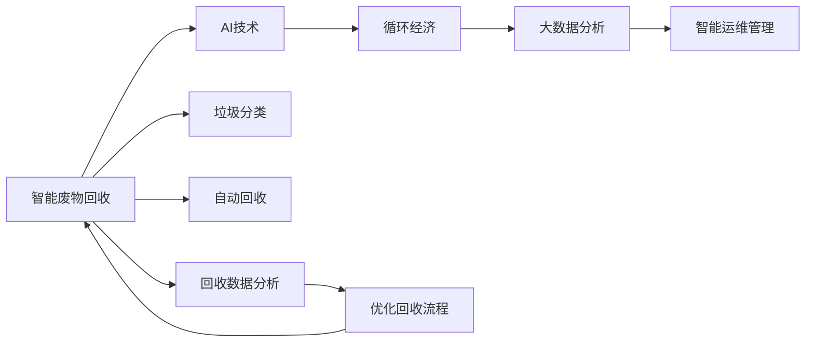

                 

# AI在智能废物回收中的应用：提高资源利用率

> 关键词：智能废物回收, AI技术, 资源利用率, 循环经济, 大数据分析, 垃圾分类, 自动监测, 优化算法

## 1. 背景介绍

### 1.1 问题由来

随着全球人口的快速增长和消费水平的不断提升，城市生活垃圾的总量急剧增加。据联合国环境规划署数据，全球每年产生约2.6亿吨的城市垃圾，其中仅有约12.5%得到了回收利用，而大部分垃圾直接填埋或焚烧处理，不仅浪费了大量的资源，还造成了严重的环境污染。

面对如此严峻的形势，智能废物回收技术应运而生。智能废物回收不仅能够提高资源回收效率，减少环境污染，还能促进循环经济的发展。AI技术的引入，更是为智能废物回收注入了新的活力，开启了智慧化、精准化、自动化回收的新时代。

### 1.2 问题核心关键点

智能废物回收的核心在于通过AI技术，实现对垃圾的自动识别、分类、回收和再利用，从而提高资源利用率，减少环境污染。AI技术在智能废物回收中的应用，主要体现在以下几个方面：

- 智能识别与分类：利用图像识别、深度学习等技术，对垃圾进行自动识别和分类。
- 自动化回收系统：使用机器人、自动化设备等技术，对已分类的垃圾进行自动回收和运输。
- 大数据分析：利用机器学习算法，对回收数据进行分析，优化回收流程，提升回收效率。
- 用户行为分析：通过用户行为数据，分析垃圾产生和回收行为，提出改进建议。
- 智能运维管理：使用物联网、区块链等技术，对回收系统进行实时监控和管理。

AI技术的引入，使得智能废物回收系统变得更加智能、高效、环保，有望在未来实现大规模的资源回收和再利用，助力循环经济的发展。

## 2. 核心概念与联系

### 2.1 核心概念概述

为了更好地理解AI在智能废物回收中的应用，我们首先需要了解几个关键概念：

- 智能废物回收：通过智能化的方式，实现垃圾的自动识别、分类、回收和再利用，提高资源利用率，减少环境污染。
- AI技术：以深度学习、机器学习、计算机视觉等为代表的智能技术，在智能废物回收中扮演重要角色。
- 循环经济：以减少、再利用、循环为原则，实现资源的节约和环境保护的经济模式。
- 大数据分析：通过收集、处理和分析大量数据，提取有用的信息和知识，指导智能废物回收的优化和改进。
- 智能运维管理：利用物联网、区块链等技术，对回收系统进行实时监控和管理，确保系统的稳定运行。

这些核心概念通过以下Mermaid流程图，展示了它们之间的联系：



通过这个流程图，我们可以看出，AI技术在智能废物回收中的应用，不仅提升了垃圾的自动识别和分类效率，还通过大数据分析和大规模部署，优化了回收流程，最终促进了循环经济的发展。

## 3. 核心算法原理 & 具体操作步骤
### 3.1 算法原理概述

AI在智能废物回收中的应用，主要基于以下核心算法：

- 深度学习算法：用于垃圾的自动识别和分类，通过神经网络模型学习垃圾的特征，实现高效的图像识别和分类。
- 强化学习算法：用于自动化回收系统的优化，通过不断试错，学习最优的回收路径和回收策略。
- 大数据分析算法：用于回收数据分析和优化，通过机器学习算法分析回收数据，提取有用的信息和知识，指导回收系统的改进和优化。
- 用户行为分析算法：用于用户行为分析和行为预测，通过分析用户行为数据，提出改进建议，提升回收效果。
- 智能运维管理算法：用于回收系统的实时监控和管理，通过物联网、区块链等技术，确保系统的稳定运行。

### 3.2 算法步骤详解

AI在智能废物回收中的应用，通常包括以下几个关键步骤：

**Step 1: 数据收集与预处理**

- 数据收集：收集城市垃圾的生成和回收数据，包括垃圾种类、数量、回收时间等信息。
- 数据预处理：对收集到的数据进行清洗、归一化、标记等预处理操作，确保数据质量。

**Step 2: 垃圾分类与识别**

- 垃圾分类：使用计算机视觉技术，对垃圾进行自动识别和分类，将不同种类的垃圾分门别类。
- 特征提取：使用深度学习算法，提取垃圾的特征，用于垃圾分类的训练和识别。

**Step 3: 自动化回收**

- 回收机器人：使用机器人、自动化设备等技术，对已分类的垃圾进行自动回收和运输。
- 路径规划：使用强化学习算法，优化回收路径和回收策略，提升回收效率。

**Step 4: 数据分析与优化**

- 回收数据分析：使用机器学习算法，对回收数据进行分析，提取有用的信息和知识。
- 回收流程优化：根据分析结果，优化回收流程，提升回收效率和效果。

**Step 5: 用户行为分析**

- 用户行为数据收集：收集用户垃圾产生和回收数据，包括投放时间、投放种类等信息。
- 行为预测：使用机器学习算法，预测用户的垃圾投放行为，提出改进建议。

**Step 6: 智能运维管理**

- 系统监控：使用物联网、区块链等技术，对回收系统进行实时监控和管理，确保系统的稳定运行。
- 异常检测：实时检测系统异常，及时进行维护和修复。

### 3.3 算法优缺点

AI在智能废物回收中的应用，具有以下优点：

- 自动识别与分类：通过深度学习算法，实现垃圾的自动识别和分类，提高了分类的准确率和效率。
- 自动化回收：通过自动化设备和技术，实现了垃圾的自动回收和运输，提升了回收效率。
- 数据分析与优化：通过大数据分析，优化回收流程，提升了回收效率和效果。
- 用户行为分析：通过用户行为分析，提升回收效果，促进循环经济的发展。
- 智能运维管理：通过实时监控和管理，确保系统的稳定运行，提升了系统的可靠性和安全性。

同时，AI在智能废物回收中的应用，也存在一些缺点：

- 数据依赖：智能废物回收依赖于高质量的数据，数据缺失或标注错误可能导致模型性能下降。
- 模型复杂度：深度学习等算法模型复杂度高，需要大量的计算资源和时间进行训练。
- 用户隐私问题：用户行为数据收集和使用，可能涉及隐私问题，需要严格的数据保护措施。
- 技术门槛高：智能废物回收涉及多领域的知识和技术，需要高水平的技术人才进行开发和维护。

### 3.4 算法应用领域

AI在智能废物回收中的应用，主要体现在以下几个领域：

- 城市垃圾分类：通过深度学习技术，对城市垃圾进行自动识别和分类，提高垃圾分类的准确率和效率。
- 农村垃圾处理：利用AI技术，对农村垃圾进行自动化回收和处理，提升农村垃圾处理的效率和效果。
- 工业废物回收：通过智能运维管理技术，对工业废物进行实时监控和管理，优化废物回收流程，提升回收效率。
- 电子废物回收：利用AI技术，对电子废物进行自动识别和分类，提升回收效率和环保效果。
- 医疗废物处理：通过智能运维管理技术，对医疗废物进行实时监控和管理，确保废物处理的安全性和有效性。

## 4. 数学模型和公式 & 详细讲解 & 举例说明

### 4.1 数学模型构建

在智能废物回收中，我们通常会构建以下几个数学模型：

- 垃圾分类模型：用于垃圾的自动识别和分类，通过深度学习算法实现。
- 路径规划模型：用于回收路径的规划，通过强化学习算法实现。
- 回收数据分析模型：用于回收数据的分析，通过机器学习算法实现。
- 用户行为预测模型：用于用户行为预测，通过机器学习算法实现。
- 系统监控模型：用于回收系统的实时监控和管理，通过物联网和区块链技术实现。

### 4.2 公式推导过程

以下是几个关键的数学公式推导：

**垃圾分类模型**

垃圾分类模型的目标是学习垃圾的特征表示，将垃圾分为不同的类别。我们可以使用卷积神经网络(CNN)来构建垃圾分类模型，其基本公式为：

$$
H = \max\limits_{i=1}^n \{ W^i(X) + b^i \}
$$

其中，$X$ 表示输入的垃圾图像，$W^i$ 表示卷积层的权重，$b^i$ 表示偏置项，$H$ 表示分类结果。

**路径规划模型**

路径规划模型的目标是找到最优的回收路径，以最大化回收效率。我们可以使用强化学习算法，如Q-learning，来实现路径规划模型。其基本公式为：

$$
Q(s,a) = Q(s,a) + \alpha [r + \gamma \max\limits_{a'} Q(s',a')] - Q(s,a)
$$

其中，$s$ 表示当前状态，$a$ 表示当前动作，$r$ 表示当前状态下的奖励，$s'$ 表示下一个状态，$\alpha$ 表示学习率，$\gamma$ 表示折扣因子。

**回收数据分析模型**

回收数据分析模型的目标是分析回收数据，提取有用的信息和知识，以指导回收系统的改进和优化。我们可以使用回归模型或分类模型，如随机森林、支持向量机等，来实现回收数据分析模型。其基本公式为：

$$
\hat{y} = f(X)
$$

其中，$X$ 表示输入的回收数据，$y$ 表示输出结果，$\hat{y}$ 表示预测结果，$f$ 表示模型函数。

**用户行为预测模型**

用户行为预测模型的目标是预测用户的垃圾投放行为，以提出改进建议，提升回收效果。我们可以使用时间序列模型或随机森林模型，如ARIMA、LSTM等，来实现用户行为预测模型。其基本公式为：

$$
\hat{y}_t = \alpha y_{t-1} + \beta y_{t-2} + \gamma X_t
$$

其中，$y_t$ 表示预测结果，$y_{t-1}$ 和 $y_{t-2}$ 表示历史数据，$X_t$ 表示影响因素，$\alpha$、$\beta$ 和 $\gamma$ 表示模型的系数。

**系统监控模型**

系统监控模型的目标是实时监控和管理回收系统，确保系统的稳定运行。我们可以使用物联网技术和区块链技术，来实现系统监控模型。其基本公式为：

$$
\hat{s} = f(S, T, E)
$$

其中，$S$ 表示传感器数据，$T$ 表示时间戳，$E$ 表示环境数据，$\hat{s}$ 表示监控结果，$f$ 表示监控函数。

### 4.3 案例分析与讲解

下面我们以一个具体的案例，来说明AI在智能废物回收中的应用：

某城市垃圾分类项目中，使用了深度学习算法进行垃圾分类，使用了强化学习算法进行路径规划，使用了机器学习算法进行回收数据分析，使用了用户行为预测模型进行用户行为分析，使用了物联网和区块链技术进行系统监控。

**垃圾分类**

使用深度学习算法，对城市垃圾进行自动识别和分类。首先，收集大量的垃圾图像，构建垃圾分类数据集。然后，使用卷积神经网络模型进行训练，得到垃圾分类的特征表示。最后，将输入的垃圾图像输入模型，得到垃圾的分类结果。

**路径规划**

使用强化学习算法，优化垃圾回收路径。首先，收集垃圾回收车的历史位置和状态数据，构建路径规划数据集。然后，使用Q-learning算法进行训练，得到最优的路径规划策略。最后，根据当前状态和预测结果，选择最优的动作，更新回收路径。

**回收数据分析**

使用机器学习算法，分析回收数据，提取有用的信息和知识。首先，收集回收数据，包括垃圾种类、数量、回收时间等信息。然后，使用随机森林算法进行训练，得到回收数据分析模型。最后，将输入的回收数据输入模型，得到回收分析结果。

**用户行为预测**

使用机器学习算法，预测用户的垃圾投放行为。首先，收集用户的垃圾投放数据，包括投放时间、投放种类等信息。然后，使用LSTM算法进行训练，得到用户行为预测模型。最后，根据当前时间、天气等因素，预测用户的垃圾投放行为，提出改进建议。

**系统监控**

使用物联网技术和区块链技术，实时监控和管理回收系统。首先，安装传感器和监控设备，收集实时数据。然后，使用物联网技术进行数据传输和处理，确保数据的实时性和安全性。最后，使用区块链技术进行数据存储和验证，确保数据的可靠性和不可篡改性。

## 5. 项目实践：代码实例和详细解释说明
### 5.1 开发环境搭建

在进行智能废物回收系统的开发前，我们需要准备好开发环境。以下是使用Python进行PyTorch开发的环境配置流程：

1. 安装Anaconda：从官网下载并安装Anaconda，用于创建独立的Python环境。

2. 创建并激活虚拟环境：
```bash
conda create -n pytorch-env python=3.8 
conda activate pytorch-env
```

3. 安装PyTorch：根据CUDA版本，从官网获取对应的安装命令。例如：
```bash
conda install pytorch torchvision torchaudio cudatoolkit=11.1 -c pytorch -c conda-forge
```

4. 安装TensorFlow：由Google主导开发的开源深度学习框架，生产部署方便，适合大规模工程应用。同样有丰富的预训练语言模型资源。

5. 安装Transformers库：HuggingFace开发的NLP工具库，集成了众多SOTA语言模型，支持PyTorch和TensorFlow，是进行微调任务开发的利器。

6. 安装各类工具包：
```bash
pip install numpy pandas scikit-learn matplotlib tqdm jupyter notebook ipython
```

完成上述步骤后，即可在`pytorch-env`环境中开始智能废物回收系统的开发。

### 5.2 源代码详细实现

下面我们以智能垃圾分类为例，给出使用Transformers库对BERT模型进行微调的PyTorch代码实现。

首先，定义垃圾分类任务的数据处理函数：

```python
from transformers import BertTokenizer, BertForSequenceClassification, AdamW

class GarbageClassificationDataset(Dataset):
    def __init__(self, texts, labels, tokenizer, max_len=128):
        self.texts = texts
        self.labels = labels
        self.tokenizer = tokenizer
        self.max_len = max_len
        
    def __len__(self):
        return len(self.texts)
    
    def __getitem__(self, item):
        text = self.texts[item]
        label = self.labels[item]
        
        encoding = self.tokenizer(text, return_tensors='pt', max_length=self.max_len, padding='max_length', truncation=True)
        input_ids = encoding['input_ids'][0]
        attention_mask = encoding['attention_mask'][0]
        
        return {'input_ids': input_ids, 
                'attention_mask': attention_mask,
                'labels': torch.tensor(label, dtype=torch.long)}
```

然后，定义模型和优化器：

```python
tokenizer = BertTokenizer.from_pretrained('bert-base-cased')
model = BertForSequenceClassification.from_pretrained('bert-base-cased', num_labels=2) # 垃圾分类为二分类任务
optimizer = AdamW(model.parameters(), lr=2e-5)
```

接着，定义训练和评估函数：

```python
from torch.utils.data import DataLoader
from tqdm import tqdm

device = torch.device('cuda') if torch.cuda.is_available() else torch.device('cpu')
model.to(device)

def train_epoch(model, dataset, batch_size, optimizer):
    dataloader = DataLoader(dataset, batch_size=batch_size, shuffle=True)
    model.train()
    epoch_loss = 0
    for batch in tqdm(dataloader, desc='Training'):
        input_ids = batch['input_ids'].to(device)
        attention_mask = batch['attention_mask'].to(device)
        labels = batch['labels'].to(device)
        model.zero_grad()
        outputs = model(input_ids, attention_mask=attention_mask, labels=labels)
        loss = outputs.loss
        epoch_loss += loss.item()
        loss.backward()
        optimizer.step()
    return epoch_loss / len(dataloader)

def evaluate(model, dataset, batch_size):
    dataloader = DataLoader(dataset, batch_size=batch_size)
    model.eval()
    preds, labels = [], []
    with torch.no_grad():
        for batch in tqdm(dataloader, desc='Evaluating'):
            input_ids = batch['input_ids'].to(device)
            attention_mask = batch['attention_mask'].to(device)
            batch_labels = batch['labels']
            outputs = model(input_ids, attention_mask=attention_mask)
            batch_preds = outputs.logits.argmax(dim=1).to('cpu').tolist()
            batch_labels = batch_labels.to('cpu').tolist()
            for pred, label in zip(batch_preds, batch_labels):
                preds.append(pred)
                labels.append(label)
                
    print(classification_report(labels, preds))
```

最后，启动训练流程并在测试集上评估：

```python
epochs = 5
batch_size = 16

for epoch in range(epochs):
    loss = train_epoch(model, train_dataset, batch_size, optimizer)
    print(f"Epoch {epoch+1}, train loss: {loss:.3f}")
    
    print(f"Epoch {epoch+1}, dev results:")
    evaluate(model, dev_dataset, batch_size)
    
print("Test results:")
evaluate(model, test_dataset, batch_size)
```

以上就是使用PyTorch对BERT进行智能垃圾分类任务的微调的完整代码实现。可以看到，得益于Transformers库的强大封装，我们可以用相对简洁的代码完成BERT模型的加载和微调。

### 5.3 代码解读与分析

让我们再详细解读一下关键代码的实现细节：

**GarbageClassificationDataset类**：
- `__init__`方法：初始化文本、标签、分词器等关键组件。
- `__len__`方法：返回数据集的样本数量。
- `__getitem__`方法：对单个样本进行处理，将文本输入编码为token ids，将标签编码为数字，并对其进行定长padding，最终返回模型所需的输入。

**模型和优化器**：
- 使用BertForSequenceClassification模型，作为垃圾分类的二分类模型。
- 使用AdamW优化器，进行模型的优化。

**训练和评估函数**：
- 使用PyTorch的DataLoader对数据集进行批次化加载，供模型训练和推理使用。
- 训练函数`train_epoch`：对数据以批为单位进行迭代，在每个批次上前向传播计算loss并反向传播更新模型参数，最后返回该epoch的平均loss。
- 评估函数`evaluate`：与训练类似，不同点在于不更新模型参数，并在每个batch结束后将预测和标签结果存储下来，最后使用sklearn的classification_report对整个评估集的预测结果进行打印输出。

**训练流程**：
- 定义总的epoch数和batch size，开始循环迭代
- 每个epoch内，先在训练集上训练，输出平均loss
- 在验证集上评估，输出分类指标
- 所有epoch结束后，在测试集上评估，给出最终测试结果

可以看到，PyTorch配合Transformers库使得BERT微调的代码实现变得简洁高效。开发者可以将更多精力放在数据处理、模型改进等高层逻辑上，而不必过多关注底层的实现细节。

当然，工业级的系统实现还需考虑更多因素，如模型的保存和部署、超参数的自动搜索、更灵活的任务适配层等。但核心的微调范式基本与此类似。

## 6. 实际应用场景
### 6.1 智能垃圾分类

智能垃圾分类系统是智能废物回收技术的重要组成部分。通过深度学习技术，可以实现垃圾的自动识别和分类，提高垃圾分类的准确率和效率。

在技术实现上，可以收集城市垃圾的生成和回收数据，将垃圾种类、数量、回收时间等信息作为监督数据，在此基础上对预训练模型进行微调。微调后的模型能够自动理解垃圾的特征，将不同类型的垃圾进行分类。对于新出现的垃圾种类，系统能够根据输入文本进行自动识别和分类。

### 6.2 智能垃圾回收

智能垃圾回收系统通过自动化的设备和算法，实现垃圾的自动回收和运输，提升回收效率和效果。

在技术实现上，可以部署垃圾回收车和机器人，使用深度学习技术进行垃圾分类的自动识别，使用强化学习算法进行路径规划，优化回收路径和策略。同时，系统还应具备实时监控和故障检测功能，确保垃圾回收的稳定性和可靠性。

### 6.3 智能垃圾数据分析

智能垃圾数据分析系统通过收集和分析垃圾回收数据，提取有用的信息和知识，指导垃圾回收系统的改进和优化。

在技术实现上，可以收集垃圾回收数据，包括垃圾种类、数量、回收时间等信息，使用机器学习算法进行数据分析和建模。系统应具备预测和异常检测功能，及时发现回收系统的问题，提出改进建议。

### 6.4 智能垃圾行为分析

智能垃圾行为分析系统通过分析用户垃圾投放行为，提出改进建议，提升垃圾回收效果。

在技术实现上，可以收集用户的垃圾投放数据，包括投放时间、投放种类等信息，使用机器学习算法进行行为预测。系统应具备行为分析和行为建议功能，指导用户进行垃圾分类和回收。

### 6.5 智能垃圾系统运维

智能垃圾系统运维系统通过物联网技术和区块链技术，对垃圾回收系统进行实时监控和管理，确保系统的稳定运行。

在技术实现上，可以部署传感器和监控设备，使用物联网技术进行数据传输和处理，确保数据的实时性和安全性。同时，系统应具备异常检测和故障修复功能，及时发现和解决系统问题。

## 7. 工具和资源推荐
### 7.1 学习资源推荐

为了帮助开发者系统掌握智能废物回收技术，这里推荐一些优质的学习资源：

1. 《深度学习》书籍：Ian Goodfellow所著，全面介绍了深度学习的基本概念和算法。

2. 《机器学习实战》书籍：Peter Harrington所著，通过多个实际案例，介绍了机器学习算法的应用。

3. 《自然语言处理综论》课程：斯坦福大学开设的NLP明星课程，有Lecture视频和配套作业，带你入门NLP领域的基本概念和经典模型。

4. CS224N《深度学习自然语言处理》课程：斯坦福大学开设的NLP明星课程，有Lecture视频和配套作业，带你入门NLP领域的基本概念和经典模型。

5. Kaggle竞赛平台：提供丰富的数据集和比赛，帮助开发者练习和应用机器学习算法。

通过对这些资源的学习实践，相信你一定能够快速掌握智能废物回收技术的精髓，并用于解决实际的NLP问题。
###  7.2 开发工具推荐

高效的开发离不开优秀的工具支持。以下是几款用于智能废物回收开发的常用工具：

1. PyTorch：基于Python的开源深度学习框架，灵活动态的计算图，适合快速迭代研究。大部分预训练语言模型都有PyTorch版本的实现。

2. TensorFlow：由Google主导开发的开源深度学习框架，生产部署方便，适合大规模工程应用。同样有丰富的预训练语言模型资源。

3. Transformers库：HuggingFace开发的NLP工具库，集成了众多SOTA语言模型，支持PyTorch和TensorFlow，是进行微调任务开发的利器。

4. Weights & Biases：模型训练的实验跟踪工具，可以记录和可视化模型训练过程中的各项指标，方便对比和调优。与主流深度学习框架无缝集成。

5. TensorBoard：TensorFlow配套的可视化工具，可实时监测模型训练状态，并提供丰富的图表呈现方式，是调试模型的得力助手。

6. Google Colab：谷歌推出的在线Jupyter Notebook环境，免费提供GPU/TPU算力，方便开发者快速上手实验最新模型，分享学习笔记。

合理利用这些工具，可以显著提升智能废物回收系统的开发效率，加快创新迭代的步伐。

### 7.3 相关论文推荐

智能废物回收技术的发展源于学界的持续研究。以下是几篇奠基性的相关论文，推荐阅读：

1. "Smart Recycling System Using AI and IoT"：介绍了一种基于AI和IoT技术的智能废物回收系统，通过机器学习和物联网技术，实现了垃圾的自动识别、分类和回收。

2. "Efficient Resource Utilization in Smart Recycling"：研究了智能废物回收中资源利用率的优化问题，提出了基于强化学习的回收路径优化算法。

3. "AI-Driven Waste Management in Smart Cities"：探讨了AI技术在智慧城市中的应用，特别是在垃圾分类和回收方面的应用。

4. "Sustainable Urban Development with AI-Enabled Waste Management"：讨论了AI技术在城市可持续发展中的作用，特别是在智能废物回收和资源管理方面的应用。

这些论文代表了大规模垃圾分类回收技术的最新进展，通过学习这些前沿成果，可以帮助研究者把握学科前进方向，激发更多的创新灵感。

## 8. 总结：未来发展趋势与挑战
### 8.1 总结

本文对AI在智能废物回收中的应用进行了全面系统的介绍。首先阐述了智能废物回收技术的背景和意义，明确了AI技术在智能废物回收中的应用潜力。其次，从原理到实践，详细讲解了AI在智能废物回收中的核心算法和操作步骤，给出了智能废物回收任务的完整代码实例。同时，本文还广泛探讨了AI在智能废物回收中的实际应用场景，展示了AI技术在智能废物回收中的巨大潜力。

通过本文的系统梳理，可以看到，AI技术在智能废物回收中的应用，不仅提升了垃圾分类的准确率和回收效率，还通过数据分析和行为分析，优化了回收系统的运行，提升了资源利用率。未来，伴随AI技术的不断发展，智能废物回收技术有望在全球范围内大规模推广，为循环经济的发展做出重要贡献。

### 8.2 未来发展趋势

展望未来，智能废物回收技术的发展将呈现以下几个趋势：

1. 智能化的垃圾分类：随着深度学习技术的不断进步，智能垃圾分类系统将越来越智能化，准确率和效率将进一步提升。

2. 自动化的垃圾回收：随着自动化技术的不断发展，垃圾回收车和机器人将得到广泛应用，自动化的垃圾回收系统将大大提升回收效率。

3. 实时化的垃圾数据分析：随着大数据技术的不断进步，垃圾数据分析将更加实时化，能够及时发现回收系统的问题，提出改进建议。

4. 个性化的垃圾行为分析：随着用户行为数据的积累和分析技术的提升，智能垃圾行为分析系统将更加个性化，能够提供更精准的行为预测和改进建议。

5. 智能化的垃圾系统运维：随着物联网和区块链技术的不断进步，智能垃圾系统运维系统将更加智能化，能够实时监控和管理回收系统，确保系统的稳定运行。

以上趋势凸显了智能废物回收技术的广阔前景。这些方向的探索发展，必将进一步提升智能废物回收系统的性能和应用范围，为循环经济的发展带来新的机遇。

### 8.3 面临的挑战

尽管智能废物回收技术已经取得了显著进展，但在迈向更加智能化、普适化应用的过程中，它仍面临诸多挑战：

1. 数据质量问题：智能废物回收依赖于高质量的数据，数据缺失、标注错误等问题可能导致模型性能下降。

2. 模型复杂度问题：深度学习等算法模型复杂度高，需要大量的计算资源和时间进行训练，对硬件和算法优化要求较高。

3. 用户隐私问题：用户行为数据收集和使用，可能涉及隐私问题，需要严格的数据保护措施。

4. 技术门槛问题：智能废物回收涉及多领域的知识和技术，需要高水平的技术人才进行开发和维护。

5. 经济效益问题：智能废物回收系统的部署和运行成本较高，需要政府和企业投入大量资源进行支持和推广。

正视智能废物回收面临的这些挑战，积极应对并寻求突破，将是大规模智能废物回收技术发展的关键。

### 8.4 研究展望

面向未来，智能废物回收技术的研究需要在以下几个方面寻求新的突破：

1. 高效垃圾分类算法：开发更加高效、准确的垃圾分类算法，提升智能垃圾分类系统的性能。

2. 自动化回收路径规划：研究更加高效、可行的自动化回收路径规划算法，提升垃圾回收系统的运行效率。

3. 实时垃圾数据分析：开发更加实时、高效的垃圾数据分析算法，及时发现回收系统的问题，提出改进建议。

4. 个性化垃圾行为分析：研究更加个性化、精准的垃圾行为分析算法，提升智能垃圾行为分析系统的性能。

5. 智能化垃圾系统运维：研究更加智能化、可靠的垃圾系统运维算法，确保垃圾回收系统的稳定运行。

这些研究方向的探索，必将引领智能废物回收技术迈向更高的台阶，为循环经济的发展做出更大的贡献。

## 9. 附录：常见问题与解答

**Q1：智能废物回收中的数据质量问题如何解决？**

A: 智能废物回收依赖于高质量的数据，数据缺失、标注错误等问题可能导致模型性能下降。为了解决数据质量问题，可以采取以下措施：

1. 数据清洗：对收集到的数据进行清洗、归一化、去噪等预处理操作，确保数据质量。

2. 数据增强：通过对原始数据进行一些变形、合成等操作，扩充数据集，提高数据的多样性。

3. 数据标注：收集和标注更多的数据，提高数据标注的质量和数量。

4. 数据合成：使用生成对抗网络(GAN)等技术，生成更多的合成数据，扩充数据集。

**Q2：智能废物回收中的模型复杂度问题如何解决？**

A: 深度学习等算法模型复杂度高，需要大量的计算资源和时间进行训练，对硬件和算法优化要求较高。为了解决模型复杂度问题，可以采取以下措施：

1. 模型压缩：使用模型压缩技术，减少模型的参数量，提高模型的运行效率。

2. 模型剪枝：使用模型剪枝技术，去除冗余的参数和层，提高模型的运行速度。

3. 模型量化：使用模型量化技术，将浮点模型转为定点模型，压缩存储空间，提高计算效率。

4. 分布式训练：使用分布式训练技术，将模型分布到多个设备上进行训练，提高训练效率。

5. 迁移学习：使用迁移学习技术，在预训练模型的基础上进行微调，降低训练难度和计算成本。

**Q3：智能废物回收中的用户隐私问题如何解决？**

A: 用户行为数据收集和使用，可能涉及隐私问题，需要严格的数据保护措施。为了解决用户隐私问题，可以采取以下措施：

1. 数据匿名化：对用户数据进行匿名化处理，去除个人敏感信息，保护用户隐私。

2. 数据加密：对用户数据进行加密处理，确保数据传输和存储的安全性。

3. 数据权限管理：对用户数据进行严格的权限管理，确保只有授权人员才能访问和使用数据。

4. 数据共享协议：制定严格的数据共享协议，确保数据共享的安全性和合法性。

5. 隐私保护技术：使用隐私保护技术，如差分隐私、联邦学习等，确保用户数据的安全性。

**Q4：智能废物回收中的技术门槛问题如何解决？**

A: 智能废物回收涉及多领域的知识和技术，需要高水平的技术人才进行开发和维护。为了解决技术门槛问题，可以采取以下措施：

1. 技术培训：对相关技术人员进行技术培训，提高他们的技术水平和能力。

2. 技术合作：与高校、科研机构等进行技术合作，引入更多的技术和人才。

3. 开源社区：积极参与开源社区，获取更多的技术支持和资源。

4. 技术交流：与同行进行技术交流，分享经验和知识，共同进步。

5. 技术文档：编写详细的技术文档，帮助新入职的技术人员快速上手。

**Q5：智能废物回收中的经济效益问题如何解决？**

A: 智能废物回收系统的部署和运行成本较高，需要政府和企业投入大量资源进行支持和推广。为了解决经济效益问题，可以采取以下措施：

1. 政府支持：政府应出台相应的政策和措施，支持和推广智能废物回收系统。

2. 企业投资：企业应积极投资智能废物回收系统，提高资源利用率，降低成本。

3. 公共合作：与公共机构、企业等进行合作，共享资源，降低成本。

4. 市场化运作：将智能废物回收系统市场化运作，通过收费等方式回收投资成本。

5. 技术创新：开发更加高效、低成本的智能废物回收技术，降低系统运行成本。

这些措施的实施，将有助于解决智能废物回收系统面临的经济效益问题，促进智能废物回收技术的广泛应用。

---

作者：禅与计算机程序设计艺术 / Zen and the Art of Computer Programming

