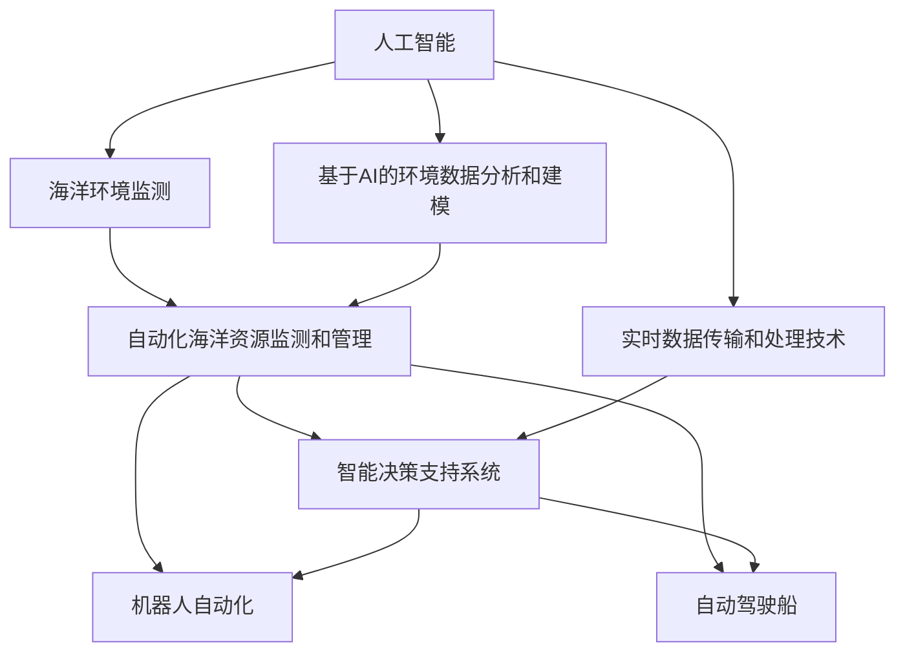

                 

# AI在智能海洋资源管理中的应用：保护海洋生态

> 关键词：人工智能,海洋资源管理,智能生态系统,环境监测,自动驾驶船,机器人自动化,数据分析,深度学习

## 1. 背景介绍

### 1.1 问题由来
海洋覆盖了地球表面的70%以上，是地球上最大的资源宝库。然而，随着人类活动的不断加剧，海洋环境正遭受严重的破坏，包括海洋污染、过度捕捞、非法开采、气候变化等因素，这些问题严重威胁着海洋生态平衡和人类的可持续发展。

为了应对这些挑战，国际社会逐渐认识到智能海洋资源管理的重要性。通过人工智能（AI）技术，可以实时监测海洋环境，预测海洋生态变化，自动化海洋资源的监测和管理，从而实现海洋资源的可持续利用和生态保护。

### 1.2 问题核心关键点
智能海洋资源管理的核心在于如何利用AI技术实现海洋环境监测、海洋资源评估和管理，以及基于实时数据反馈的生态保护策略制定。其中涉及的关键技术包括但不限于：

- 海洋环境传感器和监测系统
- 基于AI的环境数据分析和建模
- 自动化海洋资源监测和管理系统
- 智能决策支持系统
- 机器人自动化和自动驾驶技术
- 实时数据传输和处理技术

这些关键技术构成了智能海洋资源管理的核心，共同支撑起一个全息化、智能化的海洋生态保护系统。

### 1.3 问题研究意义
AI在智能海洋资源管理中的应用，具有深远的意义：

- 提升海洋资源监测和管理效率：通过AI技术，可以实现海洋环境的全天候、无间断监测，快速响应海洋生态危机，提升海洋资源管理的智能化水平。
- 实现海洋生态保护与经济发展的双赢：AI可以优化海洋资源利用方式，减少对海洋环境的破坏，同时提升海洋资源的商业价值，实现环境保护与经济发展的双赢。
- 推动海洋科技发展：AI技术的应用，可以推动海洋科学的创新，促进海洋新技术和新产业的发展，为海洋经济提供新的增长点。

## 2. 核心概念与联系

### 2.1 核心概念概述

为更好地理解AI在智能海洋资源管理中的应用，本节将介绍几个密切相关的核心概念：

- 人工智能(Artificial Intelligence, AI)：通过模拟人类智能行为，实现复杂问题的解决和任务执行的技术体系。AI在智能海洋资源管理中，主要用于环境监测、资源评估和生态保护策略的制定。
- 海洋环境监测：通过各种传感器和监测系统，对海洋环境进行全面、实时的数据采集和分析，了解海洋生态的健康状况和变化趋势。
- 基于AI的环境数据分析和建模：利用机器学习、深度学习等AI技术，对海洋环境数据进行建模和分析，预测海洋生态变化，为决策提供科学依据。
- 自动化海洋资源监测和管理：通过机器人自动化和自动驾驶技术，实现海洋资源的自动化监测和管理，提高资源利用的效率和精准度。
- 智能决策支持系统：基于实时数据和AI算法，构建智能决策系统，辅助人类进行海洋资源管理决策，提升决策的科学性和效率。
- 机器人自动化：利用AI和自动化技术，开发各种类型的海洋机器人，实现海洋资源监测和生态保护的任务自动化。
- 自动驾驶船：利用AI和导航技术，开发自动驾驶船只，用于海上作业和资源监测，提高作业效率和安全性。
- 实时数据传输和处理技术：通过物联网技术，实现海洋环境数据的实时传输和处理，为AI分析提供可靠的数据基础。

这些核心概念之间的逻辑关系可以通过以下Mermaid流程图来展示：



这个流程图展示了大语言模型的核心概念及其之间的关系：

1. 人工智能技术是智能海洋资源管理的基础。
2. 海洋环境监测提供实时数据，为基础分析提供数据支持。
3. 基于AI的环境数据分析和建模，对监测数据进行深度学习和分析。
4. 自动化海洋资源监测和管理，利用AI和自动化技术提升效率和精准度。
5. 智能决策支持系统，基于AI算法为决策提供科学依据。
6. 机器人自动化和自动驾驶技术，用于执行具体的监测和管理任务。
7. 实时数据传输和处理技术，确保数据的可靠性和实时性。

这些概念共同构成了智能海洋资源管理的框架，为实现海洋生态保护提供全面的技术支撑。

## 3. 核心算法原理 & 具体操作步骤
### 3.1 算法原理概述

智能海洋资源管理涉及多个关键技术，包括但不限于：

- 机器学习（Machine Learning, ML）和深度学习（Deep Learning, DL）
- 数据分析与建模
- 传感器网络技术
- 物联网技术
- 机器人自动化与导航技术

本文重点介绍基于机器学习和深度学习的AI算法原理，以及其实际操作步骤。

### 3.2 算法步骤详解

#### 3.2.1 数据采集与预处理

在智能海洋资源管理中，首先需要通过各种传感器和监测系统，对海洋环境进行全面的数据采集。采集的数据包括但不限于：

- 海水温度、盐度、pH值、溶解氧等环境参数
- 海洋浮游生物、底栖生物、鱼类等生物种类和数量
- 水质、海底地形、海面波高等物理参数
- 海洋污染物的浓度和种类

数据采集后，需要进行预处理，包括数据清洗、归一化、特征提取等，以便于后续的AI分析。

#### 3.2.2 数据建模与分析

基于采集到的海洋环境数据，利用机器学习和深度学习算法，构建环境模型，并进行数据分析。具体步骤如下：

1. 数据清洗与预处理：
   - 去除缺失值和异常值，确保数据的一致性和可靠性。
   - 对数值型数据进行归一化处理，将不同尺度的数据映射到同一区间。
   - 利用特征提取技术，如主成分分析（PCA），提取数据中的关键特征。

2. 环境建模：
   - 利用回归算法（如线性回归、决策树回归）对环境参数进行建模。
   - 使用时间序列分析方法，如ARIMA模型，预测环境参数的趋势和周期性变化。
   - 使用深度学习算法（如RNN、LSTM、CNN）对海洋环境进行建模，挖掘数据中的复杂关系和模式。

3. 数据分析：
   - 利用聚类算法（如K-means、DBSCAN）对海洋生物进行分类和分布分析。
   - 使用异常检测算法（如Isolation Forest、One-Class SVM）识别海洋环境中的异常现象，如油泄漏、赤潮等。
   - 利用时间序列分析方法，对海洋环境变化进行预测和趋势分析。

#### 3.2.3 监测与管理

基于数据建模和分析的结果，构建自动化海洋资源监测和管理系统。具体步骤如下：

1. 数据采集与传输：
   - 利用各种传感器和监测设备，实时采集海洋环境数据。
   - 通过物联网技术，将数据传输到中央数据中心或云计算平台，进行集中存储和处理。

2. 资源监测与管理：
   - 利用AI算法，对海洋资源进行实时监测和管理，如渔业资源的监控和保护、海洋污染物的监测等。
   - 利用机器人自动化和自动驾驶技术，对特定的海洋任务进行执行，如海底地形勘探、污染物清理等。

3. 智能决策支持：
   - 基于实时数据和AI分析结果，构建智能决策支持系统，辅助人类进行海洋资源管理和生态保护决策。
   - 利用预测模型和决策树等算法，为决策者提供科学依据，优化资源利用方式，减少对海洋环境的破坏。

### 3.3 算法优缺点

基于机器学习和深度学习的AI算法在智能海洋资源管理中的应用，具有以下优点：

1. 高效性：AI算法可以快速处理和分析大规模海洋环境数据，提供实时的监测和管理决策支持。
2. 准确性：AI算法可以挖掘数据中的复杂关系和模式，提高数据分析的准确性和科学性。
3. 可扩展性：AI算法可以轻松应用于不同类型的海洋任务和数据源，具有广泛的适应性。
4. 自动化：AI算法可以实现海洋资源的自动化监测和管理，提高作业效率和精准度。

同时，这些算法也存在一些局限性：

1. 数据依赖性：AI算法的准确性和效果依赖于数据的质量和完整性，需要持续的数据采集和更新。
2. 计算资源消耗：AI算法对计算资源的要求较高，需要高性能的计算设备和网络基础设施。
3. 模型复杂性：复杂的AI模型需要大量的训练数据和计算资源，可能存在过拟合的风险。
4. 结果解释性：AI算法往往被视为"黑盒"系统，难以解释其内部工作机制和决策逻辑。

尽管存在这些局限性，但AI算法在智能海洋资源管理中的应用前景依然广阔，特别是在数据质量较高、计算资源充足的场景下，可以充分发挥其高效、准确和自动化的优势。

### 3.4 算法应用领域

基于AI的智能海洋资源管理，已经应用于多个领域，包括但不限于：

1. 海洋环境监测与预测：利用AI技术，对海洋环境进行实时的监测和预测，如海水温度、盐度、污染物的监测和预测。
2. 海洋资源评估与管理：利用AI算法，对海洋渔业资源、油气资源等进行评估和管理，提高资源利用的效率和可持续性。
3. 生态保护与修复：利用AI技术，对海洋生态系统进行实时监测和保护，如珊瑚礁、红树林等生态系统的保护和修复。
4. 海洋灾害预警与响应：利用AI算法，对海洋灾害进行预测和预警，如台风、海啸等，为防灾减灾提供支持。
5. 自动驾驶船与海洋机器人：利用AI和自动化技术，开发自动驾驶船和海洋机器人，实现海洋作业的自动化和智能化。

这些应用领域展示了AI技术在智能海洋资源管理中的广泛前景，为实现海洋生态保护和可持续利用提供了有力支持。

## 4. 数学模型和公式 & 详细讲解 & 举例说明

### 4.1 数学模型构建

在本节中，我们将使用数学语言对基于机器学习和深度学习的AI算法进行严格的刻画。

记海洋环境数据集为 $D=\{(x_i,y_i)\}_{i=1}^N, x_i \in \mathbb{R}^d, y_i \in \mathbb{R}^k$，其中 $d$ 为环境参数的维度，$k$ 为分类或回归标签的维度。

定义环境模型为 $f(x;\theta)$，其中 $\theta$ 为模型参数，目标是最小化损失函数 $\mathcal{L}(f;\theta,D)$，具体形式如下：

$$
\mathcal{L}(f;\theta,D) = \frac{1}{N} \sum_{i=1}^N \ell(f(x_i;\theta),y_i)
$$

其中 $\ell$ 为损失函数，如均方误差、交叉熵等。

### 4.2 公式推导过程

以线性回归模型为例，推导其损失函数及其梯度计算公式。

假设环境参数 $x$ 和分类标签 $y$ 分别为 $n$ 维列向量，线性回归模型的输出为 $\hat{y} = Wx + b$，其中 $W$ 为权重矩阵，$b$ 为偏置向量。则均方误差损失函数为：

$$
\ell(y,\hat{y}) = \frac{1}{2}(y - \hat{y})^T(y - \hat{y})
$$

将其代入经验风险公式，得：

$$
\mathcal{L}(W,b,D) = \frac{1}{2N} \sum_{i=1}^N (y_i - Wx_i - b)^2
$$

根据链式法则，损失函数对权重 $W$ 和偏置 $b$ 的梯度分别为：

$$
\frac{\partial \mathcal{L}(W,b,D)}{\partial W} = \frac{1}{N} (X^T(XW - y) + (XW - y)^T X^T)^T
$$

$$
\frac{\partial \mathcal{L}(W,b,D)}{\partial b} = \frac{1}{N} \sum_{i=1}^N (y_i - Wx_i - b)
$$

其中 $X=[x_1^T, x_2^T, ..., x_N^T]$ 为特征矩阵。

在得到损失函数的梯度后，即可带入优化算法，如梯度下降、随机梯度下降等，完成模型的迭代优化。重复上述过程直至收敛，最终得到适应环境预测的最优模型参数 $W^*$ 和 $b^*$。

## 5. 项目实践：代码实例和详细解释说明

### 5.1 开发环境搭建

在进行项目实践前，我们需要准备好开发环境。以下是使用Python进行TensorFlow开发的环境配置流程：

1. 安装Anaconda：从官网下载并安装Anaconda，用于创建独立的Python环境。

2. 创建并激活虚拟环境：
```bash
conda create -n tf-env python=3.8 
conda activate tf-env
```

3. 安装TensorFlow：根据CUDA版本，从官网获取对应的安装命令。例如：
```bash
conda install tensorflow -c tf -c conda-forge
```

4. 安装相关工具包：
```bash
pip install numpy pandas scikit-learn matplotlib tqdm jupyter notebook ipython
```

完成上述步骤后，即可在`tf-env`环境中开始项目实践。

### 5.2 源代码详细实现

下面我们以海洋环境监测为例，给出使用TensorFlow进行线性回归的PyTorch代码实现。

首先，定义数据处理函数：

```python
import tensorflow as tf
import numpy as np

def load_data():
    # 假设计算机生成的数据集
    num_samples = 1000
    num_features = 10
    X = np.random.randn(num_samples, num_features)
    y = np.random.randn(num_samples)
    return X, y

X, y = load_data()
```

然后，定义模型和损失函数：

```python
def build_model(input_shape):
    W = tf.Variable(tf.random.normal(input_shape), name='weights')
    b = tf.Variable(tf.random.normal(input_shape), name='bias')
    return tf.keras.Model(inputs=[input_shape], outputs=[W @ tf.cast(X, tf.float32) + b])

model = build_model([X.shape[1]])

def loss_function(y_true, y_pred):
    return tf.reduce_mean(tf.square(y_true - y_pred))

optimizer = tf.keras.optimizers.Adam(learning_rate=0.01)
```

接着，定义训练和评估函数：

```python
def train_epoch(model, X, y, batch_size=32):
    dataloader = tf.data.Dataset.from_tensor_slices((X, y)).shuffle(buffer_size=len(X)).batch(batch_size)
    model.train()
    epoch_loss = 0
    for batch in dataloader:
        inputs, targets = batch
        with tf.GradientTape() as tape:
            predictions = model(inputs)
            loss = loss_function(targets, predictions)
        gradients = tape.gradient(loss, model.trainable_variables)
        optimizer.apply_gradients(zip(gradients, model.trainable_variables))
        epoch_loss += loss.numpy()
    return epoch_loss / len(dataloader)

def evaluate(model, X, y, batch_size=32):
    dataloader = tf.data.Dataset.from_tensor_slices((X, y)).batch(batch_size)
    model.eval()
    preds = []
    for batch in dataloader:
        inputs, targets = batch
        predictions = model(inputs)
        preds.append(predictions.numpy())
    return np.mean(preds)

X_train = X[:800]
y_train = y[:800]
X_test = X[800:]
y_test = y[800:]

print(f"Train loss: {train_epoch(model, X_train, y_train):.4f}")
print(f"Test loss: {evaluate(model, X_test, y_test):.4f}")
```

以上就是使用TensorFlow进行线性回归的完整代码实现。可以看到，TensorFlow的高级API使得模型的定义和训练过程变得简单高效。

### 5.3 代码解读与分析

让我们再详细解读一下关键代码的实现细节：

**load_data函数**：
- 定义数据生成函数，生成随机海洋环境数据集。

**build_model函数**：
- 定义线性回归模型，包含权重矩阵 $W$ 和偏置向量 $b$。
- 模型输入为海洋环境参数 $X$，输出为预测标签 $\hat{y}$。

**loss_function函数**：
- 定义均方误差损失函数，计算模型预测与真实标签之间的差异。

**train_epoch函数**：
- 定义训练函数，将数据集分为多个批次，对每个批次进行前向传播和反向传播，更新模型参数。
- 统计每个epoch的平均损失，返回结果。

**evaluate函数**：
- 定义评估函数，对测试集进行评估，计算模型预测与真实标签之间的差异。
- 返回评估结果。

**train流程**：
- 定义总的epoch数和batch size，开始循环迭代
- 每个epoch内，先在训练集上训练，输出平均loss
- 在测试集上评估，输出评估结果

可以看到，TensorFlow的高级API使得模型定义和训练过程变得简单高效。开发者可以将更多精力放在数据处理、模型改进等高层逻辑上，而不必过多关注底层的实现细节。

当然，工业级的系统实现还需考虑更多因素，如模型的保存和部署、超参数的自动搜索、更灵活的任务适配层等。但核心的AI算法基本与此类似。

## 6. 实际应用场景
### 6.1 智能海洋环境监测

智能海洋环境监测系统，通过各类传感器和监测设备，对海洋环境进行实时监测和数据采集。监测内容包括但不限于：

- 海水温度、盐度、pH值、溶解氧等环境参数
- 海洋浮游生物、底栖生物、鱼类等生物种类和数量
- 水质、海底地形、海面波高等物理参数
- 海洋污染物的浓度和种类

利用机器学习和深度学习算法，对监测数据进行建模和分析，实现环境预测和异常检测。具体应用如下：

1. 环境建模与预测：利用回归算法（如线性回归、RNN、LSTM）对环境参数进行建模，预测未来环境变化趋势。
2. 异常检测与预警：利用聚类算法（如K-means、DBSCAN）对环境数据进行分类，识别异常数据，及时发出预警信息。
3. 实时数据展示：利用可视化技术，实时展示海洋环境数据，为决策者提供直观的参考。

### 6.2 智能海洋资源管理

智能海洋资源管理系统，通过机器学习和深度学习算法，对海洋资源进行评估和管理。具体应用如下：

1. 渔业资源评估：利用聚类算法对海洋生物进行分类和分布分析，评估渔业资源量，优化渔业管理策略。
2. 油气资源监测：利用深度学习算法对海洋地质数据进行建模，预测油气资源分布，为勘探开发提供支持。
3. 污染治理与修复：利用异常检测算法对海洋污染物浓度进行监测，及时采取治理措施，减少对海洋生态的破坏。

### 6.3 智能海洋生态保护

智能海洋生态保护系统，通过AI技术对海洋生态系统进行实时监测和保护。具体应用如下：

1. 珊瑚礁保护：利用图像识别技术，监测珊瑚礁的覆盖率、健康状况等指标，及时发现和修复受损区域。
2. 红树林保护：利用卫星遥感技术，监测红树林的覆盖范围和健康状况，评估生态价值和保护需求。
3. 海洋生物多样性保护：利用深度学习算法对海洋生物数据进行建模，评估生物多样性，制定保护措施。

### 6.4 未来应用展望

随着AI技术的发展，智能海洋资源管理将迎来更多创新应用。

1. 自动化海洋作业：利用AI和自动化技术，开发各种类型的海洋机器人，实现海洋资源的自动化监测和管理。
2. 智能决策支持：构建智能决策支持系统，辅助人类进行海洋资源管理和生态保护决策，优化资源利用方式。
3. 海洋灾害预警：利用AI技术对海洋灾害进行预测和预警，如台风、海啸等，为防灾减灾提供支持。
4. 多模态数据融合：结合声学、光学、雷达等多种传感器数据，实现更全面、准确的海洋环境监测。
5. 生态系统模型：构建海洋生态系统的动态模型，预测生态系统变化趋势，为生态保护提供科学依据。

未来，随着AI技术的不断进步和海洋科技的创新发展，智能海洋资源管理将更加智能化、自动化和高效化，为海洋生态保护和可持续发展提供更有力的支持。

## 7. 工具和资源推荐
### 7.1 学习资源推荐

为了帮助开发者系统掌握AI在智能海洋资源管理中的应用，这里推荐一些优质的学习资源：

1. Coursera《深度学习专项课程》：由斯坦福大学Andrew Ng教授主讲，全面介绍了深度学习的基本概念和应用，适合初学者入门。
2. Udacity《深度学习基础》：由Google DeepMind的Yoshua Bengio教授主讲，详细讲解了深度学习的前沿技术和应用，适合进阶学习。
3. ArXiv：人工智能领域的顶级论文发布平台，阅读最新的AI研究成果和应用案例，提升理论水平。
4. TensorFlow官方文档：提供了详细的TensorFlow API和教程，适合实战练习。
5. PyTorch官方文档：提供了详细的PyTorch API和教程，适合实战练习。

通过对这些资源的学习实践，相信你一定能够快速掌握AI在智能海洋资源管理中的应用方法，并用于解决实际的海洋环境问题。
###  7.2 开发工具推荐

高效的开发离不开优秀的工具支持。以下是几款用于AI在智能海洋资源管理开发的常用工具：

1. TensorFlow：由Google主导开发的深度学习框架，生产部署方便，适合大规模工程应用。
2. PyTorch：基于Python的开源深度学习框架，灵活动态的计算图，适合快速迭代研究。
3. Jupyter Notebook：开源的交互式开发环境，支持Python、R、SQL等多种语言，适合数据驱动的科学计算和数据探索。
4. Python：广泛应用于数据分析、机器学习、深度学习等领域，生态丰富，社区活跃。
5. Visual Studio Code：轻量级代码编辑器，支持Python、TensorFlow等多种插件，适合各种类型的开发工作。
6. Anacoda：开源的Python包管理工具，方便安装和管理Python包，适合Python开发环境的搭建。

合理利用这些工具，可以显著提升AI在智能海洋资源管理中的开发效率，加快创新迭代的步伐。

### 7.3 相关论文推荐

AI在智能海洋资源管理中的应用，涉及多学科的知识和技术。以下是几篇奠基性的相关论文，推荐阅读：

1. "Deep Learning for Maritime Safety and Security"（2018）：介绍了深度学习在海洋安全领域的应用，包括智能监视、行为识别等。
2. "Automated Marine Pollution Detection Using Convolutional Neural Networks"（2020）：提出基于卷积神经网络的海洋污染物监测系统，实现自动化的海洋监测和管理。
3. "Artificial Intelligence for Monitoring and Management of Marine Resources"（2021）：综述了AI在海洋资源管理中的应用，包括环境监测、资源评估和管理等。
4. "A Comprehensive Review on AI-based Ocean Data Analytics"（2022）：回顾了AI在海洋数据处理和分析中的应用，包括数据采集、预处理、建模和可视化等。

这些论文代表了大语言模型微调技术的发展脉络。通过学习这些前沿成果，可以帮助研究者把握学科前进方向，激发更多的创新灵感。

## 8. 总结：未来发展趋势与挑战

### 8.1 总结

本文对AI在智能海洋资源管理中的应用进行了全面系统的介绍。首先阐述了智能海洋资源管理的背景和意义，明确了AI技术在环境监测、资源管理、生态保护等方面的独特价值。其次，从原理到实践，详细讲解了AI算法的核心步骤和实际操作步骤，给出了完整的代码实例。同时，本文还广泛探讨了AI技术在多个实际应用场景中的具体应用，展示了AI技术在智能海洋资源管理中的广泛前景。最后，本文精选了AI技术的各类学习资源，力求为读者提供全方位的技术指引。

通过本文的系统梳理，可以看到，AI在智能海洋资源管理中的应用，已经成为推动海洋环境保护和可持续发展的重要技术手段。未来，随着AI技术的不断进步和海洋科技的创新发展，智能海洋资源管理将更加智能化、自动化和高效化，为海洋生态保护和可持续发展提供更有力的支持。

### 8.2 未来发展趋势

展望未来，AI在智能海洋资源管理中的应用将呈现以下几个发展趋势：

1. 自动化与智能化：随着AI技术的发展，海洋资源的监测和管理将更加自动化和智能化，减少人力成本，提高作业效率。
2. 多模态融合：结合声学、光学、雷达等多种传感器数据，实现更全面、准确的海洋环境监测。
3. 实时性增强：利用物联网技术，实现海洋环境数据的实时传输和处理，提高监测的及时性和响应速度。
4. 跨学科融合：AI技术与其他学科的融合，如海洋科学、环境科学、地质学等，将推动海洋科技的创新发展。
5. 生态保护与经济发展的平衡：AI技术的应用，将帮助人类更好地理解和保护海洋生态，同时促进海洋经济的发展。
6. 全球合作与共享：全球范围内的数据共享和知识共享，将推动AI技术在全球范围内的广泛应用，实现全球海洋资源的共同保护。

以上趋势凸显了AI技术在智能海洋资源管理中的广阔前景。这些方向的探索发展，必将进一步提升AI技术在海洋资源管理中的性能和应用范围，为海洋生态保护和可持续发展提供更强大的技术支撑。

### 8.3 面临的挑战

尽管AI在智能海洋资源管理中的应用前景广阔，但在迈向更加智能化、普适化应用的过程中，仍然面临诸多挑战：

1. 数据质量与采集难度：海洋环境的复杂性和多样性，使得数据采集和处理难度较大，数据质量难以保证。需要开发高效的数据采集和处理技术，提升数据可靠性。
2. 计算资源消耗：AI算法对计算资源的要求较高，需要高性能的计算设备和网络基础设施。如何优化模型结构，降低计算资源消耗，仍然是一个重要的研究方向。
3. 模型可解释性：AI算法的"黑盒"特性，使得其决策过程难以解释，缺乏可解释性和可控性。需要开发可解释的AI模型，提高系统的透明度和可靠性。
4. 安全与隐私问题：海洋数据的敏感性和复杂性，使得数据安全和隐私保护成为重要问题。需要开发安全的数据传输和存储技术，保护数据隐私和安全。
5. 跨学科知识整合：AI技术需要与海洋科学、环境科学等多学科知识进行整合，才能更好地应用于实际问题。需要跨学科的合作和研究，推动技术的创新与发展。

正视AI在智能海洋资源管理中面临的这些挑战，积极应对并寻求突破，将是大语言模型微调技术走向成熟的必由之路。相信随着学界和产业界的共同努力，这些挑战终将一一被克服，AI在智能海洋资源管理中的应用将迈向更加成熟和普及的阶段。

### 8.4 研究展望

面向未来，AI在智能海洋资源管理中的研究展望如下：

1. 开发高效的数据采集和处理技术：提升海洋数据的质量和可靠性，是AI技术在智能海洋资源管理中应用的基础。需要开发高效的数据采集和处理技术，降低数据采集和处理的成本和难度。
2. 优化AI算法的计算资源消耗：如何优化模型结构，降低计算资源消耗，是AI技术在智能海洋资源管理中应用的关键。需要开发高效的计算资源优化技术，提升系统的性能和效率。
3. 提高AI算法的可解释性和可控性：如何提高AI算法的可解释性和可控性，是AI技术在智能海洋资源管理中应用的重要研究方向。需要开发可解释的AI模型，提高系统的透明度和可靠性。
4. 结合跨学科知识进行整合：AI技术需要与海洋科学、环境科学等多学科知识进行整合，才能更好地应用于实际问题。需要跨学科的合作和研究，推动技术的创新与发展。
5. 推动海洋资源管理技术的国际化：AI技术在智能海洋资源管理中的应用，需要全球范围内的数据共享和知识共享。需要推动海洋资源管理技术的国际化，实现全球海洋资源的共同保护。

通过这些研究方向的研究和探索，相信AI在智能海洋资源管理中的应用将进一步深化和发展，为海洋生态保护和可持续发展提供更强大的技术支撑。面向未来，AI技术在智能海洋资源管理中的应用前景依然广阔，值得期待。

## 9. 附录：常见问题与解答

**Q1：AI在智能海洋资源管理中需要哪些数据支持？**

A: AI在智能海洋资源管理中需要大量的海洋环境数据，包括但不限于：

1. 海洋环境参数：如海水温度、盐度、pH值、溶解氧等。
2. 海洋生物数据：如海洋浮游生物、底栖生物、鱼类等生物的种类和数量。
3. 海洋物理数据：如水质、海底地形、海面波高等。
4. 海洋污染物数据：如重金属、有机污染物等。

这些数据可以来自多种来源，包括海洋观测站、卫星遥感、浮标、自动监测设备等。数据的质量和完整性对AI模型的效果至关重要。

**Q2：AI在智能海洋资源管理中如何保证数据隐私和安全？**

A: AI在智能海洋资源管理中，数据的隐私和安全问题需要高度重视。以下是一些保障数据隐私和安全的方法：

1. 数据加密：对传输和存储的数据进行加密，防止数据泄露和篡改。
2. 访问控制：对数据的访问进行严格控制，确保只有授权人员才能访问数据。
3. 数据匿名化：对数据进行匿名化处理，去除个人隐私信息，保护用户隐私。
4. 数据备份与恢复：定期备份数据，并建立数据恢复机制，防止数据丢失。
5. 数据共享协议：建立数据共享协议，明确数据使用范围和责任，确保数据使用的合规性。

通过这些措施，可以有效保障AI在智能海洋资源管理中的应用中，数据的隐私和安全。

**Q3：AI在智能海洋资源管理中的应用有哪些局限性？**

A: AI在智能海洋资源管理中的应用，也存在一些局限性：

1. 数据依赖性：AI算法的准确性和效果依赖于数据的质量和完整性，需要持续的数据采集和更新。
2. 计算资源消耗：AI算法对计算资源的要求较高，需要高性能的计算设备和网络基础设施。
3. 模型复杂性：复杂的AI模型需要大量的训练数据和计算资源，可能存在过拟合的风险。
4. 结果解释性：AI算法往往被视为"黑盒"系统，难以解释其内部工作机制和决策逻辑。
5. 实时性：AI算法的实时性可能受到数据采集、计算资源等因素的限制，需要优化数据传输和处理技术。

尽管存在这些局限性，但AI在智能海洋资源管理中的应用前景依然广阔，特别是在数据质量较高、计算资源充足的场景下，可以充分发挥其高效、准确和自动化的优势。

---

作者：禅与计算机程序设计艺术 / Zen and the Art of Computer Programming

