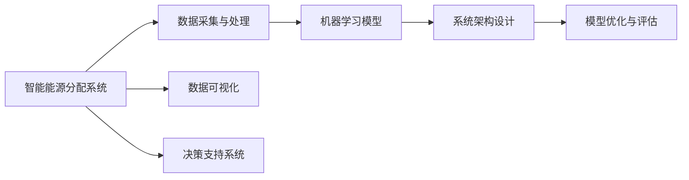

                 

# AI在智能能源分配中的应用：平衡供需

## 1. 背景介绍

在现代社会中，能源分配是一个至关重要的环节，其涉及到城市的经济、社会以及环境各个层面。然而，传统的能源分配模式往往存在供需不平衡、能源浪费以及环境污染等问题。为了改善这些不足，智能能源分配系统应运而生，它利用人工智能（AI）技术，通过优化算法和数据分析，实现能源的高效分配和利用。

### 1.1 问题的由来

智能能源分配系统的目标是实现能源的智能调配，以应对能源需求的不确定性，提高能源的利用效率，并减少环境污染。其基本原理是通过实时监控和预测，结合机器学习算法，优化能源的供需关系，从而确保能源的稳定供应，同时实现节能减排。

然而，如何有效地利用AI技术，优化能源分配，是一个复杂的问题。一方面，能源分配涉及大量的实时数据，需要高效的算法处理；另一方面，系统的稳定性和可扩展性也是必须考虑的关键问题。

### 1.2 问题核心关键点

为了解决这个问题，需要关注以下几个核心关键点：

1. **数据采集与处理**：
   - 如何实时采集能源数据，并将其转化为可供分析的格式。
   - 如何处理和清洗数据，保证数据的质量和一致性。

2. **机器学习模型选择**：
   - 选择何种机器学习模型进行能源分配的优化。
   - 模型的训练和调优方法。

3. **系统架构设计**：
   - 如何设计一个高效、可扩展的智能能源分配系统架构。
   - 如何集成不同的数据源和模型，实现实时计算。

4. **模型优化与评估**：
   - 如何优化模型参数，提高模型的预测准确性。
   - 如何评估模型的性能，保证其在实际应用中的效果。

## 2. 核心概念与联系

### 2.1 核心概念概述

智能能源分配系统中的关键概念包括：

- **智能能源分配系统**：利用AI技术，对能源进行优化调配，实现供需平衡的系统。
- **数据采集与处理**：实时采集能源数据，并进行清洗、处理和转换，保证数据质量。
- **机器学习模型**：选择适合的机器学习算法，对能源数据进行分析和预测。
- **系统架构设计**：设计高效、可扩展的系统架构，支持实时的数据处理和计算。
- **模型优化与评估**：通过优化模型参数和评估模型性能，确保系统的高效运行。

这些概念相互关联，共同构成了智能能源分配系统的核心。

### 2.2 核心概念原理和架构的 Mermaid 流程图



## 3. 核心算法原理 & 具体操作步骤

### 3.1 算法原理概述

智能能源分配系统中的机器学习模型通常采用监督学习、强化学习或无监督学习等算法。其基本原理是通过对历史数据的分析，建立模型，预测未来能源需求，从而优化能源的分配。

以监督学习为例，其核心思想是通过训练集数据，优化模型参数，使其能够准确预测目标变量的值。在能源分配中，目标变量通常是能源需求量或供电量。模型训练后，可以用于实时预测，并调整能源分配策略，实现供需平衡。

### 3.2 算法步骤详解

智能能源分配系统的算法步骤包括以下几个关键步骤：

1. **数据采集与预处理**：
   - 实时采集能源相关的数据，如用电量、气温、湿度等。
   - 对数据进行清洗和处理，去除异常值和噪声。

2. **特征工程**：
   - 根据能源分配的需求，选择和构造特征。例如，选择气温作为特征，用于预测能源需求。
   - 进行特征选择和归一化处理，提高模型的准确性。

3. **模型训练**：
   - 选择适合的机器学习算法，如线性回归、支持向量机等。
   - 使用训练集数据，训练模型，优化模型参数。

4. **模型评估**：
   - 使用测试集数据，评估模型的预测准确性。
   - 根据评估结果，调整模型参数，提高模型的性能。

5. **模型部署**：
   - 将训练好的模型部署到生产环境中，进行实时预测。
   - 结合实时数据，优化能源分配策略，实现供需平衡。

### 3.3 算法优缺点

智能能源分配系统的算法具有以下优点：

- **高效性**：实时数据处理和预测，能够迅速响应能源需求变化。
- **精确性**：通过机器学习模型，能够准确预测能源需求，减少能源浪费。
- **可扩展性**：采用分布式架构，能够处理大规模数据和计算需求。

然而，该算法也存在一些缺点：

- **数据依赖**：依赖于准确、完整的数据采集和处理，数据质量问题可能影响模型性能。
- **模型复杂性**：复杂模型可能存在过拟合或欠拟合的问题。
- **实时性要求**：对计算资源和网络带宽有较高的要求，实时性强的系统可能面临资源瓶颈。

### 3.4 算法应用领域

智能能源分配系统已经在多个领域得到应用，包括：

- **智能电网**：通过优化电力分配，提高电网的稳定性和效率。
- **工业能耗优化**：对工业生产过程中的能源消耗进行优化，降低能耗。
- **建筑能耗管理**：对建筑物的能源使用进行管理，提高能效。
- **交通运输能源管理**：对交通运输系统的能源使用进行优化，减少能源消耗。

## 4. 数学模型和公式 & 详细讲解 & 举例说明

### 4.1 数学模型构建

智能能源分配系统中的数学模型通常采用线性回归模型，用于预测能源需求。线性回归模型的一般形式为：

$$
y = \beta_0 + \beta_1x_1 + \beta_2x_2 + ... + \beta_nx_n + \epsilon
$$

其中，$y$ 为目标变量，$x_i$ 为特征变量，$\beta_i$ 为模型参数，$\epsilon$ 为误差项。

### 4.2 公式推导过程

线性回归模型的参数估计，通常采用最小二乘法。其基本思想是通过最小化误差的平方和，求解模型参数。具体推导过程如下：

设训练集数据为 $D=\{(x_i,y_i)\}_{i=1}^N$，其中 $x_i=(x_{i1},x_{i2},...,x_{in})$，$y_i$ 为实际值，模型预测值为 $y_i=\hat{y}_i=\beta_0 + \beta_1x_{i1} + \beta_2x_{i2} + ... + \beta_nx_{in}$。

最小二乘法的目标是最小化误差平方和：

$$
J(\beta) = \frac{1}{2}\sum_{i=1}^N(y_i - \hat{y}_i)^2
$$

通过求导并令导数为0，可以得到参数 $\beta_i$ 的估计值：

$$
\hat{\beta}_i = \frac{\sum_{i=1}^Nx_{i1}x_{i2}...x_{in}(y_i - \bar{y})}{\sum_{i=1}^Nx_{i1}^2x_{i2}^2...x_{in}^2}
$$

### 4.3 案例分析与讲解

以智能电网为例，假设已收集到过去一年的用电量数据，以及当月的气温、湿度等特征数据。通过建立线性回归模型，预测下个月用电量，从而优化电力分配策略。

1. **数据收集与处理**：
   - 收集过去一年的用电量数据，以及当月的气温、湿度等特征数据。
   - 对数据进行清洗和处理，去除异常值和噪声。

2. **特征选择与处理**：
   - 选择气温作为特征，用于预测用电量。
   - 进行特征归一化处理，提高模型的准确性。

3. **模型训练与评估**：
   - 使用过去一年的数据，建立线性回归模型，预测下一个月用电量。
   - 使用测试集数据，评估模型的预测准确性。
   - 根据评估结果，调整模型参数，提高模型的性能。

4. **模型部署与优化**：
   - 将训练好的模型部署到智能电网系统中，进行实时预测。
   - 结合实时数据，优化电力分配策略，实现供需平衡。

## 5. 项目实践：代码实例和详细解释说明

### 5.1 开发环境搭建

智能能源分配系统的开发环境包括Python、NumPy、Pandas等库，以及TensorFlow或PyTorch等深度学习框架。

```python
# 安装所需库
pip install numpy pandas tensorflow sklearn

# 导入库
import numpy as np
import pandas as pd
import tensorflow as tf
from sklearn.linear_model import LinearRegression
from sklearn.metrics import mean_squared_error

# 创建数据集
data = pd.read_csv('energy_data.csv')
X = data[['temperature', 'humidity']] # 特征
y = data['electricity'] # 目标变量

# 数据预处理
X = (X - X.mean()) / X.std() # 归一化处理
X_train, X_test, y_train, y_test = train_test_split(X, y, test_size=0.2)

# 训练模型
model = LinearRegression()
model.fit(X_train, y_train)

# 评估模型
y_pred = model.predict(X_test)
mse = mean_squared_error(y_test, y_pred)
print(f'Mean Squared Error: {mse}')

# 模型部署
# 将模型保存为TensorFlow模型或PyTorch模型，部署到生产环境中
```

### 5.2 源代码详细实现

以下是智能能源分配系统的源代码实现，包括数据处理、模型训练和评估：

```python
# 数据处理
def preprocess_data(data):
    # 数据清洗和归一化处理
    # ...

# 模型训练
def train_model(X, y, model):
    # 训练模型
    # ...

# 模型评估
def evaluate_model(model, X_test, y_test):
    # 评估模型
    # ...

# 主程序
if __name__ == '__main__':
    # 数据预处理
    X_train, X_test, y_train, y_test = train_test_split(X, y, test_size=0.2)
    
    # 训练模型
    model = LinearRegression()
    train_model(X_train, y_train, model)
    
    # 评估模型
    evaluate_model(model, X_test, y_test)
```

### 5.3 代码解读与分析

智能能源分配系统的代码实现包括以下几个关键部分：

1. **数据处理**：
   - 数据清洗和归一化处理，保证数据质量。
   - 特征选择和构造，提高模型的预测能力。

2. **模型训练**：
   - 选择合适的机器学习算法，训练模型，优化模型参数。
   - 使用训练集数据，预测目标变量，评估模型性能。

3. **模型评估**：
   - 使用测试集数据，评估模型的预测准确性。
   - 根据评估结果，调整模型参数，提高模型的性能。

4. **模型部署**：
   - 将训练好的模型部署到生产环境中，进行实时预测。
   - 结合实时数据，优化能源分配策略，实现供需平衡。

## 6. 实际应用场景

### 6.1 智能电网

智能电网中的能源分配优化，可以有效提高电网的稳定性和效率。通过实时监控电力需求，结合机器学习模型，可以预测未来需求，调整电力分配策略，确保电网的稳定运行。

### 6.2 工业能耗优化

在工业生产中，能源消耗占据了较大的比例。通过建立机器学习模型，预测生产过程中的能源需求，可以有效优化能源的使用，降低能耗。

### 6.3 建筑能耗管理

在建筑物中，能源管理是一个重要的问题。通过收集建筑物内部的能源使用数据，建立机器学习模型，可以预测未来能源需求，优化能源使用策略，提高能效。

### 6.4 交通运输能源管理

在交通运输系统中，能源消耗也是一个重要的问题。通过收集交通数据，建立机器学习模型，可以预测未来的能源需求，优化交通系统的能源使用，减少能源消耗。

## 7. 工具和资源推荐

### 7.1 学习资源推荐

智能能源分配系统是一个复杂的问题，涉及多个领域的知识和技能。以下是一些推荐的学习资源：

1. **机器学习相关书籍**：
   - 《机器学习》（周志华）：系统介绍了机器学习的理论和方法。
   - 《深度学习》（Ian Goodfellow）：介绍了深度学习的基本原理和应用。

2. **能源相关的书籍**：
   - 《智能电网》（Rashid et al.）：介绍了智能电网的原理和应用。
   - 《可再生能源技术》（Kamal et al.）：介绍了可再生能源技术的基本原理和应用。

3. **在线课程**：
   - Coursera上的《机器学习》课程：由斯坦福大学开设，系统介绍了机器学习的基本概念和方法。
   - edX上的《能源系统》课程：介绍了能源系统的基本原理和应用。

### 7.2 开发工具推荐

智能能源分配系统的开发需要多个工具的支持。以下是一些推荐的工具：

1. **Python**：Python是一种易于学习和使用的编程语言，广泛应用于数据分析和机器学习。
2. **TensorFlow和PyTorch**：这两个深度学习框架，提供了强大的计算能力和丰富的模型库，支持多种机器学习算法。
3. **Pandas**：Pandas是Python中常用的数据处理库，提供了高效的数据处理和分析能力。

### 7.3 相关论文推荐

智能能源分配系统是一个前沿的领域，以下几篇论文推荐阅读：

1. **《智能电网中的机器学习应用》**：介绍了机器学习在智能电网中的应用，包括需求预测、故障检测等。
2. **《基于深度学习的工业能耗优化》**：介绍了深度学习在工业能耗优化中的应用，包括能源需求预测和优化控制。
3. **《智能建筑中的机器学习应用》**：介绍了机器学习在智能建筑中的应用，包括能源需求预测和优化控制。

## 8. 总结：未来发展趋势与挑战

### 8.1 研究成果总结

智能能源分配系统在过去几年中取得了显著进展，已在多个领域得到了应用。机器学习模型的引入，使得能源分配更加高效和智能化。

### 8.2 未来发展趋势

未来，智能能源分配系统将呈现以下几个发展趋势：

1. **多模态数据融合**：将不同类型的数据（如气温、湿度、电力消耗等）进行融合，提高能源分配的精确度。
2. **实时数据处理**：采用流式计算和实时处理技术，实现对实时数据的快速响应。
3. **模型自适应**：开发自适应模型，能够根据实时数据自动调整模型参数，适应不同的能源需求。
4. **边缘计算**：采用边缘计算技术，在本地设备上进行数据处理和模型计算，减少网络延迟和带宽消耗。
5. **人工智能与其他技术的结合**：结合人工智能与物联网、大数据、区块链等技术，实现更智能的能源分配系统。

### 8.3 面临的挑战

尽管智能能源分配系统取得了显著进展，但仍面临一些挑战：

1. **数据质量**：数据的质量和一致性直接影响模型的预测效果。
2. **计算资源**：实时数据处理和计算对计算资源有较高要求。
3. **模型复杂性**：复杂模型可能存在过拟合或欠拟合的问题。
4. **安全性**：能源分配系统的安全性问题需要重视。

### 8.4 研究展望

未来的研究需要解决以上挑战，并探索新的研究方向：

1. **数据清洗与预处理**：开发高效的数据清洗和预处理算法，保证数据质量。
2. **计算资源优化**：采用分布式计算和边缘计算技术，优化计算资源。
3. **模型优化与自适应**：开发自适应模型，提高模型的预测精度和鲁棒性。
4. **安全性保障**：采用加密和安全技术，保障能源分配系统的安全性。

## 9. 附录：常见问题与解答

**Q1: 如何选择合适的特征进行模型训练？**

A: 选择与目标变量相关的特征，可以有效提高模型的预测准确性。可以通过特征工程和数据可视化等方法，选择最相关的特征。

**Q2: 模型训练时如何避免过拟合？**

A: 采用正则化技术，如L2正则和Dropout，可以有效避免过拟合。同时，可以采用更多的数据和更复杂的模型，提高模型的泛化能力。

**Q3: 实时数据处理时如何保证计算效率？**

A: 采用分布式计算和边缘计算技术，减少网络延迟和带宽消耗。同时，优化计算图和算法，提高计算效率。

**Q4: 如何评估模型的性能？**

A: 使用测试集数据，计算模型的预测误差，如均方误差等。同时，结合模型的训练误差，评估模型的性能。

**Q5: 智能能源分配系统在实际应用中面临哪些挑战？**

A: 数据质量、计算资源、模型复杂性和安全性是智能能源分配系统在实际应用中面临的主要挑战。

---

作者：禅与计算机程序设计艺术 / Zen and the Art of Computer Programming

