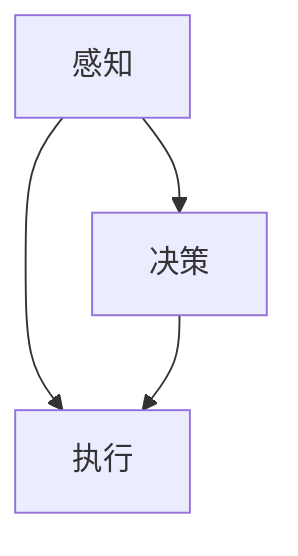

                 

# AI在智能驾驶中的应用：提高道路安全

> 关键词：AI, 智能驾驶, 道路安全, 自动驾驶, 算法优化

## 1. 背景介绍

随着科技的迅猛发展，智能驾驶技术已逐渐从科幻进入现实，成为未来汽车行业的重要发展方向。而AI在其中扮演着至关重要的角色，推动了自动驾驶技术的实现，并提升了道路安全水平。智能驾驶旨在通过先进的AI算法，使汽车能够自动感知、决策和执行，从而减少人为驾驶的错误，提高驾驶效率和安全性。

智能驾驶涵盖了感知、决策和执行三个核心环节，每个环节都需要AI的深度参与：

1. **感知**：通过摄像头、雷达、激光雷达等传感器收集周边环境信息，生成高精度的环境地图。
2. **决策**：基于感知到的信息，通过AI算法进行路径规划和行为决策，确保车辆安全、高效地运行。
3. **执行**：将决策转换为车辆的转向、加速等具体行动，实现车辆的自主行驶。

本文将详细探讨AI在智能驾驶中的应用，重点讨论如何通过AI算法提升道路安全，助力实现更智能、更安全的驾驶环境。

## 2. 核心概念与联系

### 2.1 核心概念概述

智能驾驶涉及众多AI核心概念，主要包括：

1. **感知(Sensing)**：使用传感器（如摄像头、雷达、激光雷达等）感知周围环境，生成高精度的环境地图。
2. **决策(Decision)**：基于感知数据，通过AI算法进行路径规划和行为决策，确保车辆安全、高效地运行。
3. **执行(Actuation)**：将决策转换为车辆的转向、加速等具体行动，实现车辆的自主行驶。

这些概念之间的逻辑关系可以通过以下Mermaid流程图来展示：



这个流程图展示了三者的逻辑关系：感知模块获取环境数据，决策模块基于数据生成行驶决策，执行模块执行决策进行驾驶。

## 3. 核心算法原理 & 具体操作步骤

### 3.1 算法原理概述

智能驾驶的核心算法包括计算机视觉、机器学习、深度学习等。其基本原理是通过训练AI模型，使其能够识别环境中的物体，进行路径规划和决策，最终实现自主驾驶。

以计算机视觉为例，智能驾驶中的视觉算法通常使用卷积神经网络(CNN)对图像进行特征提取和物体检测。

### 3.2 算法步骤详解

以下是智能驾驶中计算机视觉算法的详细步骤：

**Step 1: 数据收集和预处理**
- 收集大量的车辆行驶数据，包括摄像头拍摄的图像和雷达数据。
- 对数据进行预处理，如调整大小、灰度化、归一化等，以便于后续的训练和处理。

**Step 2: 特征提取**
- 使用卷积神经网络对图像进行特征提取，得到高层次的特征表示。
- 常用的卷积神经网络包括VGG、ResNet、Inception等。

**Step 3: 物体检测**
- 使用目标检测算法（如Faster R-CNN、YOLO、SSD等）对提取的特征进行物体检测。
- 生成边界框和置信度，标记物体的位置和类别。

**Step 4: 路径规划**
- 根据检测到的物体，使用路径规划算法（如A*、D*、RRT等）生成最优路径。
- 考虑到安全性和高效性，路径规划算法需要考虑环境复杂性、车辆性能和交通法规等因素。

**Step 5: 行为决策**
- 基于路径规划结果和当前车辆状态，使用决策算法（如DQN、PPO等）生成驾驶行为决策。
- 决策算法需要综合考虑车辆速度、周围环境、交通规则等因素。

**Step 6: 控制执行**
- 将决策转换为车辆的转向、加速等具体行动，使用车辆控制算法（如PID、LQR等）进行执行。
- 车辆控制算法需要保证车辆稳定性和安全性，避免因失控导致的交通事故。

### 3.3 算法优缺点

智能驾驶中的AI算法具有以下优点：

1. 提高驾驶安全性：AI算法能够实时感知环境，做出快速决策，避免因人类驾驶失误导致的交通事故。
2. 提升驾驶效率：AI算法可以24小时不间断工作，避免疲劳驾驶，提高驾驶效率。
3. 适应性强：AI算法可以通过在线学习不断更新，适应复杂多变的驾驶环境。

但同时，AI算法也存在一些缺点：

1. 技术成本高：AI算法的开发和训练需要大量的硬件和数据资源，技术门槛较高。
2. 可解释性差：AI算法的决策过程缺乏可解释性，难以理解其内部工作机制。
3. 依赖环境质量：AI算法的效果依赖于传感器和环境数据的质量，恶劣天气和复杂环境可能导致误判。
4. 法规政策风险：智能驾驶的广泛应用可能涉及复杂的法规政策，需注意合规性。

### 3.4 算法应用领域

AI在智能驾驶中的应用领域非常广泛，涵盖以下几个主要方面：

1. **环境感知**：使用传感器和AI算法进行物体检测、车道识别、交通信号识别等。
2. **路径规划**：基于环境感知数据，使用AI算法进行最优路径规划。
3. **行为决策**：通过AI算法进行交通信号识别、障碍物避让、自适应巡航控制等。
4. **车辆控制**：使用AI算法进行车辆转向、加速、制动等动作的控制。

## 4. 数学模型和公式 & 详细讲解 & 举例说明

### 4.1 数学模型构建

智能驾驶中的AI算法通常基于深度学习框架，如TensorFlow、PyTorch等。以计算机视觉中的目标检测算法YOLO为例，其基本数学模型可以表示为：

$$
y = f(x) = \sum_{i=1}^n w_i \sigma(z_i) + b
$$

其中，$x$为输入图像，$y$为输出预测结果，$w_i$和$b$为可学习参数，$\sigma$为激活函数，$z_i$为线性变换结果。

### 4.2 公式推导过程

以目标检测算法Faster R-CNN为例，其核心公式推导如下：

1. 使用RPN（Region Proposal Network）生成候选区域。
2. 对每个候选区域进行RoI Pooling操作，生成固定大小的特征图。
3. 将特征图输入全连接层，输出类别概率和边界框回归值。
4. 使用NMS（Non-Maximum Suppression）算法对重叠区域进行筛选，得到最终检测结果。

### 4.3 案例分析与讲解

以智能驾驶中的行为决策算法DQN（Deep Q-Network）为例，其基本公式推导如下：

1. 定义状态$S_t$、动作$A_t$、奖励$R_t$和下一状态$S_{t+1}$。
2. 定义Q值函数$Q(s,a)$，表示在状态$s$下，执行动作$a$的Q值。
3. 使用DQN算法更新Q值函数，优化决策行为。

具体实现过程如下：

1. 初始化Q值函数$Q(s,a)$。
2. 在每个时间步$t$，选择动作$a_t$，观察状态$S_{t+1}$。
3. 计算奖励$R_t$，更新Q值函数。
4. 使用经验回放和目标网络更新Q值函数。
5. 重复执行，直到达到预设的迭代次数。

## 5. 项目实践：代码实例和详细解释说明

### 5.1 开发环境搭建

为了进行智能驾驶AI算法的开发，我们需要搭建以下开发环境：

1. 安装Python：下载并安装Python，安装Python库pip。
2. 安装深度学习框架：如TensorFlow、PyTorch等，使用pip安装。
3. 安装传感器驱动：根据所选传感器类型，安装相应的驱动程序。
4. 安装ROS（Robot Operating System）：使用ROS搭建智能驾驶仿真环境。

### 5.2 源代码详细实现

以下是一个基于PyTorch的简单目标检测模型实现：

```python
import torch
import torch.nn as nn
import torchvision.transforms as transforms
import torchvision.datasets as datasets

class Net(nn.Module):
    def __init__(self):
        super(Net, self).__init__()
        self.conv1 = nn.Conv2d(3, 64, kernel_size=3, stride=1, padding=1)
        self.pool = nn.MaxPool2d(kernel_size=2, stride=2)
        self.conv2 = nn.Conv2d(64, 128, kernel_size=3, stride=1, padding=1)
        self.fc1 = nn.Linear(128 * 28 * 28, 1024)
        self.fc2 = nn.Linear(1024, 10)

    def forward(self, x):
        x = self.pool(F.relu(self.conv1(x)))
        x = self.pool(F.relu(self.conv2(x)))
        x = x.view(-1, 128 * 28 * 28)
        x = F.relu(self.fc1(x))
        x = self.fc2(x)
        return x

# 加载数据集
train_dataset = datasets.CIFAR10(root='./data', train=True, transform=transforms.ToTensor(), download=True)
test_dataset = datasets.CIFAR10(root='./data', train=False, transform=transforms.ToTensor())

# 定义模型和优化器
model = Net()
optimizer = torch.optim.Adam(model.parameters(), lr=0.001)
criterion = nn.CrossEntropyLoss()

# 训练过程
for epoch in range(10):
    for i, (images, labels) in enumerate(train_loader):
        images = images.to(device)
        labels = labels.to(device)
        optimizer.zero_grad()
        outputs = model(images)
        loss = criterion(outputs, labels)
        loss.backward()
        optimizer.step()

# 评估过程
test_loss = 0
correct = 0
total = 0
with torch.no_grad():
    for images, labels in test_loader:
        images = images.to(device)
        labels = labels.to(device)
        outputs = model(images)
        _, predicted = torch.max(outputs.data, 1)
        total += labels.size(0)
        correct += (predicted == labels).sum().item()
        test_loss += criterion(outputs, labels).item()
print('Test Loss: {:.4f}\nAccuracy: {:.2f}%'.format(test_loss / (len(test_loader)), 100 * correct / total))
```

### 5.3 代码解读与分析

上述代码展示了使用PyTorch进行目标检测模型的基本流程。主要包含以下几个步骤：

1. 定义模型结构：使用卷积神经网络进行特征提取和分类。
2. 加载数据集：使用CIFAR-10数据集进行模型训练和测试。
3. 定义优化器和损失函数：使用Adam优化器进行梯度更新，使用交叉熵损失函数进行损失计算。
4. 训练过程：循环遍历训练数据，前向传播、反向传播和梯度更新。
5. 评估过程：计算测试集上的损失和准确率。

## 6. 实际应用场景

### 6.1 智能导航系统

智能导航系统基于AI算法，能够实时感知环境信息，规划最优路径，辅助驾驶员进行驾驶。该系统可以集成在车载导航仪或手机APP中，为用户提供实时导航和路况信息。

在实际应用中，智能导航系统可以通过摄像头、雷达、GPS等传感器获取环境数据，然后使用AI算法进行路径规划和决策。系统能够实时感知交通信号、行人、车辆等，生成最优路径，并提示驾驶员。

### 6.2 自动驾驶出租车

自动驾驶出租车是智能驾驶技术的重要应用场景之一。通过AI算法和传感器，自动驾驶出租车可以自主感知环境，进行路径规划和决策，实现无人驾驶。

在实际应用中，自动驾驶出租车需要搭载多颗传感器（如摄像头、雷达、激光雷达等），实时获取环境数据。然后通过AI算法进行物体检测、路径规划和行为决策，控制车辆转向、加速和制动。系统能够自动规避障碍物，遵循交通规则，确保安全行驶。

### 6.3 智能交通管理

智能交通管理系统通过AI算法，实时监控交通流量和道路状况，优化交通信号控制，提高道路通行效率。

在实际应用中，智能交通管理系统可以通过摄像头、雷达等传感器获取实时交通数据。然后通过AI算法进行交通流量分析和预测，生成最优信号控制方案。系统能够动态调整交通信号，减少拥堵，提高道路通行效率。

## 7. 工具和资源推荐

### 7.1 学习资源推荐

1. Udacity《自动驾驶纳米学位》：提供系统性的自动驾驶课程，涵盖感知、决策和执行等核心环节。
2. Coursera《深度学习专项课程》：提供深度学习基础知识和实践技能，有助于理解智能驾驶中的AI算法。
3. ROS官方文档：提供ROS操作和智能驾驶仿真环境的详细指南。
4. NVIDIA官方文档：提供自动驾驶和智能驾驶相关的深度学习框架和工具。

### 7.2 开发工具推荐

1. PyTorch：深度学习框架，易于使用和扩展，适合研究和实验。
2. TensorFlow：深度学习框架，支持分布式训练和部署，适合大规模应用。
3. ROS：机器人操作系统，提供丰富的智能驾驶仿真环境和工具。
4. NVIDIA AI SDK：提供自动驾驶和智能驾驶相关的AI工具和资源。

### 7.3 相关论文推荐

1. "End-to-End Learning for Self-Driving Cars"（Bengio等，2016）：提出端到端深度学习模型，实现自动驾驶。
2. "Towards Fast and Reliable Deep Multi-Object Tracking"（Li等，2019）：提出多目标跟踪算法，提升智能驾驶中的环境感知能力。
3. "Playing Atari with Deep Reinforcement Learning"（Mnih等，2013）：提出深度强化学习算法，用于智能驾驶中的行为决策。

## 8. 总结：未来发展趋势与挑战

### 8.1 总结

本文详细探讨了AI在智能驾驶中的应用，重点讨论了如何通过AI算法提升道路安全。AI算法通过感知、决策和执行三个核心环节，实现了自动驾驶，提升了驾驶效率和安全性。

通过本文的系统梳理，可以看到，智能驾驶技术正在成为未来汽车行业的重要发展方向，AI算法在其中扮演着至关重要的角色。未来，随着AI算法的不断进步，智能驾驶将能够更好地适应复杂多变的驾驶环境，实现更加安全、高效、智能的驾驶体验。

### 8.2 未来发展趋势

未来智能驾驶技术的发展趋势包括：

1. **更智能的感知能力**：通过引入更先进的传感器和AI算法，实现更精准的环境感知和物体检测。
2. **更高效的决策能力**：通过改进决策算法，提升决策的准确性和鲁棒性，实现更智能的路径规划和行为决策。
3. **更安全的执行能力**：通过优化车辆控制算法，提高车辆稳定性和安全性，避免因失控导致的交通事故。
4. **更广泛的应用场景**：智能驾驶技术将逐步扩展到更多应用场景，如自动驾驶出租车、智能交通管理等。

### 8.3 面临的挑战

尽管智能驾驶技术取得了显著进展，但在实现大规模应用过程中，仍面临诸多挑战：

1. **技术成本高**：智能驾驶技术的开发和部署需要大量的硬件和软件资源，技术门槛较高。
2. **法规政策风险**：智能驾驶的广泛应用可能涉及复杂的法规政策，需注意合规性。
3. **数据隐私问题**：智能驾驶系统需要大量数据进行训练和优化，需注意数据隐私保护。
4. **安全性问题**：智能驾驶系统需要考虑多种安全和风险因素，避免因算法缺陷导致的安全事故。

### 8.4 研究展望

未来智能驾驶技术的研究方向包括：

1. **多模态感知**：通过引入多模态感知技术，提升环境感知能力，实现更精准的物体检测和环境建模。
2. **强化学习**：通过强化学习算法，提升决策和执行能力，实现更智能的路径规划和行为决策。
3. **联邦学习**：通过联邦学习技术，保护数据隐私，提升智能驾驶系统的安全性。
4. **自动化驾驶测试**：通过自动化驾驶测试，提升智能驾驶系统的可靠性和稳定性，加速大规模部署。

这些研究方向将进一步推动智能驾驶技术的进步，实现更安全、高效、智能的驾驶体验。

## 9. 附录：常见问题与解答

### Q1: 智能驾驶系统如何保证安全性？

A: 智能驾驶系统通过多层次的安全保障机制，确保驾驶安全。主要包括：

1. 传感器融合：通过融合摄像头、雷达、激光雷达等传感器数据，实现更精准的环境感知。
2. 冗余设计：系统设计多个感知和决策路径，当某一路径失效时，能够自动切换到其他路径，确保系统稳定性。
3. 实时监控：通过实时监控系统状态和环境数据，及时发现异常情况并做出反应。
4. 紧急避障：在系统检测到异常情况时，能够自动采取紧急避障措施，避免碰撞事故。

### Q2: 智能驾驶技术面临哪些技术挑战？

A: 智能驾驶技术面临以下主要技术挑战：

1. 环境感知：复杂多变的驾驶环境可能导致传感器数据不准确，影响感知效果。
2. 行为决策：道路交通规则复杂多变，需设计鲁棒的决策算法，避免误判。
3. 车辆控制：车辆控制算法需保证稳定性，避免因失控导致交通事故。

### Q3: 智能驾驶系统的数据来源有哪些？

A: 智能驾驶系统的数据来源主要包括：

1. 传感器数据：如摄像头、雷达、激光雷达等传感器获取的图像和环境数据。
2. 实时交通数据：如GPS、交通信号、行人信息等。
3. 历史事故数据：如车辆事故、交通规则等历史数据。

### Q4: 智能驾驶技术如何保护用户隐私？

A: 智能驾驶系统通过以下方式保护用户隐私：

1. 数据匿名化：对用户数据进行匿名化处理，确保数据不可识别。
2. 数据加密：对敏感数据进行加密存储和传输，防止数据泄露。
3. 访问控制：对数据访问进行严格控制，确保数据仅用于授权范围。
4. 用户同意：在使用数据前，获取用户同意，确保数据使用透明。

### Q5: 智能驾驶技术对环境有何影响？

A: 智能驾驶技术对环境有以下影响：

1. 减少交通事故：智能驾驶系统能够减少因人为驾驶失误导致的交通事故，提高道路安全性。
2. 降低能耗：智能驾驶系统能够优化行驶路径和速度，减少车辆能耗。
3. 提升交通效率：智能驾驶系统能够优化交通信号和道路管理，提高交通效率。

综上所述，智能驾驶技术通过AI算法实现了更智能、更安全的驾驶体验，但其发展仍面临诸多技术挑战。未来，随着AI算法的不断进步和政策法规的完善，智能驾驶技术将有望在更广泛的场景中得到应用，提升道路交通安全和效率。

