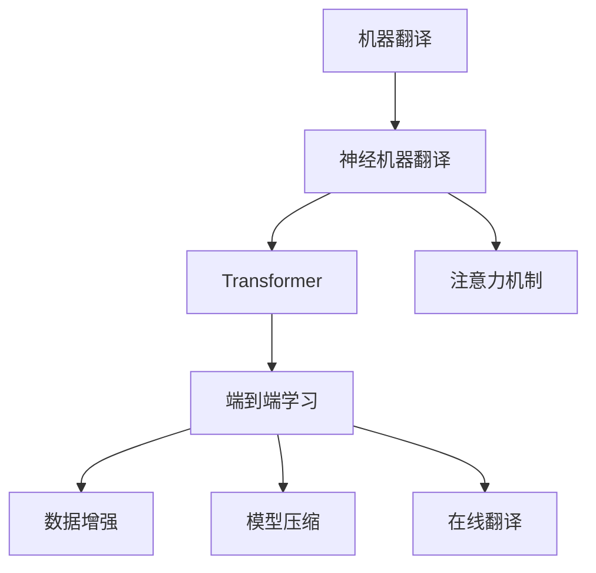

                 

## 1. 背景介绍

语言是人们沟通和交流的基本工具，然而跨语言的理解和交流一直是一个巨大的障碍。在信息技术飞速发展的今天，如何突破这一障碍，实现高效、准确的翻译，成为亟待解决的问题。传统的机器翻译方法如基于规则和统计的翻译系统，受限于语言模型和知识库的完备程度，难以满足复杂多变的翻译需求。随着深度学习技术和大规模语料库的兴起，端到端的学习式机器翻译方法应运而生，极大提升了翻译质量和效率。

近年来，基于神经网络架构的机器翻译方法，如注意力机制(Attention)、Transformer架构等，已经成为了主流的机器翻译方法。这些方法通过自监督或监督学习，从大规模双语或多语言语料库中学习语言之间的映射关系，实现了高效、准确的翻译效果。但这些方法的训练和部署仍面临诸多挑战，如对标注数据的高度依赖、计算资源的巨大消耗、模型的可解释性不足等。

## 2. 核心概念与联系

### 2.1 核心概念概述

为更好地理解机器翻译的技术原理和优化方法，本节将介绍几个核心概念：

- **机器翻译(Machine Translation, MT)**：将一种自然语言自动翻译成另一种自然语言的技术。常见的翻译方向包括英中、中英、日中、中日等。
- **神经机器翻译(Neural Machine Translation, NMT)**：基于深度学习架构，使用神经网络模型实现机器翻译的范式。其中，Transformer架构是目前最流行的翻译模型。
- **注意力机制(Attention)**：一种用于神经网络中处理序列关系的机制，通过动态关注序列中的关键部分，提升模型对输入序列的理解能力。
- **端到端学习(End-to-End Learning)**：使用单一的模型或框架，直接从输入序列到输出序列的映射，中间不经过显式的中间表示，提升模型训练效率和性能。
- **数据增强(Data Augmentation)**：通过对训练样本进行随机变换、回译等方式，扩充训练集，提升模型的泛化能力。
- **模型压缩(Model Compression)**：通过剪枝、量化等手段，减小模型大小，提高推理效率。
- **在线翻译(Online Translation)**：实时提供翻译服务，满足用户即时的翻译需求，对模型推理速度和资源消耗有较高要求。

这些核心概念之间的逻辑关系可以通过以下Mermaid流程图来展示：



这个流程图展示了一系列关键概念及其之间的关系：

1. 机器翻译是整个领域的目标，神经机器翻译提供了实现路径。
2. Transformer模型和注意力机制是神经机器翻译的主要技术手段。
3. 端到端学习范式提升了模型训练效率和性能。
4. 数据增强、模型压缩等技术优化了模型推理速度和资源消耗。
5. 在线翻译是机器翻译技术的重要应用场景。

## 3. 核心算法原理 & 具体操作步骤

### 3.1 算法原理概述

端到端学习式机器翻译的核心算法是Transformer，其主要思想是通过自注意力机制来处理序列之间的依赖关系，使用多层编码器-解码器结构进行翻译。其核心原理如下：

- **编码器(Encoder)**：接收输入序列，使用多个自注意力层和前馈神经网络进行编码，将序列转换为高维表示。
- **解码器(Decoder)**：使用多个自注意力层和注意力机制，将编码器输出的表示与目标语言词汇表映射，生成输出序列。

Transformer模型的训练过程包括两个部分：自监督预训练和有监督微调。

1. **自监督预训练**：在大规模无标签双语或多语言语料库上，通过语言模型任务(如掩码语言模型、预测下一位等)训练Transformer模型。自监督预训练使得模型学习到丰富的语言表示。
2. **有监督微调**：在双语或多语言语料库上，使用带翻译对的数据进行监督学习，优化模型参数，使其具备翻译能力。

### 3.2 算法步骤详解

基于Transformer的机器翻译模型训练过程包括以下几个关键步骤：

**Step 1: 数据准备**
- 收集并清洗双语或多语言语料库，标注出原始文本和对应的目标翻译。
- 将文本转换为数字化的标记，使用预训练分词器分词和编码，生成训练集、验证集和测试集。

**Step 2: 模型初始化**
- 选择预训练的Transformer模型，或使用自己的语料库进行自监督预训练。
- 定义编码器和解码器的层数、维度等超参数，初始化模型权重。

**Step 3: 微调训练**
- 使用带翻译对的数据，训练编码器和解码器。优化器通常采用AdamW，学习率为1e-4。
- 每个epoch中，在训练集上前向传播计算损失函数，反向传播更新模型参数，并使用验证集进行性能评估。
- 在验证集上表现不佳时，及时停止训练，避免过拟合。

**Step 4: 模型评估**
- 在测试集上评估模型翻译质量，使用BLEU、METEOR等指标进行评估。
- 可视化模型推理过程，理解其决策机制。

**Step 5: 部署与优化**
- 将微调后的模型导出为轻量级格式，如ONNX或PBTensor等，方便部署。
- 在生产环境中进行优化，如使用剪枝、量化等技术，减小模型大小，提升推理速度。
- 集成到实时翻译系统或翻译API中，提供实时翻译服务。

### 3.3 算法优缺点

基于Transformer的机器翻译方法具有以下优点：
1. 高性能：Transformer模型能够利用自注意力机制，有效地处理长序列和复杂的语言结构。
2. 低延迟：Transformer架构天然适合并行化，在GPU或TPU上能够快速推理。
3. 高泛化能力：通过自监督预训练，模型具备较强的泛化能力，能够适应不同的语言对。
4. 可解释性：通过可视化模型推理过程，可以理解模型决策的依据，提升系统的透明度。

同时，该方法也存在一定的局限性：
1. 数据依赖：Transformer模型依赖大量的双语或多语言数据进行训练，数据收集和标注成本较高。
2. 模型复杂度：Transformer模型的层数和维度设置，对计算资源要求较高，难以在大规模分布式系统上运行。
3. 可扩展性：预训练和微调过程需要大量计算资源，难以扩展到大规模语料库。
4. 过拟合风险：在大规模训练集上训练模型时，容易过拟合训练数据，泛化性能下降。

尽管存在这些局限性，但Transformer在机器翻译领域的广泛应用，已经充分证明了其优越性。未来，相关的研究将进一步优化模型训练过程，降低数据依赖和计算资源消耗，提升模型的可扩展性和泛化能力。

### 3.4 算法应用领域

基于Transformer的机器翻译方法，已经在各个语言对之间实现了高效、准确的翻译。其应用领域包括但不限于：

- 实时在线翻译：提供即时的翻译服务，支持多种语言对。
- 多语言信息检索：从多语言文本中检索相关信息，支持自然语言查询。
- 智能客服：自动翻译用户咨询内容，提供跨语言的客服服务。
- 跨国企业文档翻译：自动翻译企业文档，支持跨国办公。
- 智能翻译辅助：为翻译人员提供辅助翻译，提升翻译效率和质量。

## 4. 数学模型和公式 & 详细讲解 & 举例说明

### 4.1 数学模型构建

Transformer模型主要由编码器和解码器组成，其数学模型定义如下：

设输入序列为 $X=\{x_1, x_2, \cdots, x_T\}$，输出序列为 $Y=\{y_1, y_2, \cdots, y_{T'}\}$，其中 $T$ 和 $T'$ 分别为输入和输出的长度。设编码器为 $E$，解码器为 $D$，模型参数为 $\theta$。

Transformer模型的数学模型可以表示为：

$$
\begin{aligned}
\mathcal{L} &= \frac{1}{N} \sum_{i=1}^N \sum_{j=1}^{T'} -\log p(y_j | y_{<j}, X; \theta) \\
p(y_j | y_{<j}, X; \theta) &= \text{softmax}(E(D(h_j, \overline{h}_j); \theta))
\end{aligned}
$$

其中，$h_j$ 为第 $j$ 个解码器层的输出，$\overline{h}_j$ 为第 $j$ 个编码器层的输出，$p(y_j | y_{<j}, X; \theta)$ 表示给定上下文和输入序列 $X$，输出 $y_j$ 的条件概率。

### 4.2 公式推导过程

以注意力机制为例，Attention层的输入为 $Q=\{q_1, q_2, \cdots, q_T\}$，$K=\{k_1, k_2, \cdots, k_T\}$，$V=\{v_1, v_2, \cdots, v_T\}$，其中 $Q, K, V$ 分别表示查询向量、键向量和值向量。

注意力机制的输出为 $O=\{o_1, o_2, \cdots, o_T\}$，其计算公式为：

$$
\begin{aligned}
\alpha_{ij} &= \frac{e(Q_i K_j^T)}{\sqrt{d_k}} \\
o_j &= \sum_{i=1}^T \alpha_{ij} V_i
\end{aligned}
$$

其中，$e(x)$ 为激活函数，$d_k$ 为注意力机制的维度。$\alpha_{ij}$ 表示第 $i$ 个查询向量与第 $j$ 个键向量的相似度，$o_j$ 表示第 $j$ 个注意力机制的输出。

### 4.3 案例分析与讲解

以序列到序列(Seq2Seq)模型为例，其核心思想是将输入序列编码为固定长度的向量，通过解码器生成目标序列。具体的数学模型和训练过程如下：

1. **编码器**：
   - 输入序列 $X=\{x_1, x_2, \cdots, x_T\}$ 经过多个编码器层，得到编码器的输出 $h_T$。
   - 编码器的输出 $h_T$ 通过线性变换，得到向量 $e_T$。
2. **解码器**：
   - 目标序列 $Y=\{y_1, y_2, \cdots, y_{T'}\}$ 经过多个解码器层，得到解码器的输出 $o_{T'}$。
   - 解码器的输出 $o_{T'}$ 通过线性变换，得到最终输出 $y_{T'}$。

序列到序列模型的数学模型可以表示为：

$$
\begin{aligned}
\mathcal{L} &= \frac{1}{N} \sum_{i=1}^N \sum_{j=1}^{T'} -\log p(y_j | y_{<j}, X; \theta) \\
p(y_j | y_{<j}, X; \theta) &= \text{softmax}(W_{out} o_{T'} + b_{out})
\end{aligned}
$$

其中，$W_{out}$ 和 $b_{out}$ 为线性变换的权重和偏置。

## 5. 项目实践：代码实例和详细解释说明

### 5.1 开发环境搭建

在进行机器翻译实践前，我们需要准备好开发环境。以下是使用Python进行PyTorch开发的环境配置流程：

1. 安装Anaconda：从官网下载并安装Anaconda，用于创建独立的Python环境。

2. 创建并激活虚拟环境：
```bash
conda create -n pytorch-env python=3.8 
conda activate pytorch-env
```

3. 安装PyTorch：根据CUDA版本，从官网获取对应的安装命令。例如：
```bash
conda install pytorch torchvision torchaudio cudatoolkit=11.1 -c pytorch -c conda-forge
```

4. 安装TensorFlow：使用以下命令安装：
```bash
pip install tensorflow==2.5.0
```

5. 安装各类工具包：
```bash
pip install numpy pandas scikit-learn matplotlib tqdm jupyter notebook ipython
```

完成上述步骤后，即可在`pytorch-env`环境中开始机器翻译实践。

### 5.2 源代码详细实现

下面我们以序列到序列(Seq2Seq)翻译模型为例，给出使用PyTorch实现的代码。

首先，定义Seq2Seq模型的编码器和解码器：

```python
from torch import nn

class Encoder(nn.Module):
    def __init__(self, input_size, hidden_size, num_layers):
        super(Encoder, self).__init__()
        self.hidden_size = hidden_size
        self.num_layers = num_layers
        
        self.embedding = nn.Embedding(input_size, hidden_size)
        self.gru = nn.GRU(hidden_size, hidden_size, num_layers)
        
    def forward(self, x, hidden):
        embedding = self.embedding(x)
        output, hidden = self.gru(embedding, hidden)
        return output, hidden

class Decoder(nn.Module):
    def __init__(self, output_size, hidden_size, num_layers):
        super(Decoder, self).__init__()
        self.hidden_size = hidden_size
        self.num_layers = num_layers
        
        self.embedding = nn.Embedding(output_size, hidden_size)
        self.gru = nn.GRU(hidden_size, hidden_size, num_layers)
        self.linear = nn.Linear(hidden_size, output_size)
        
    def forward(self, x, hidden):
        embedding = self.embedding(x)
        output, hidden = self.gru(embedding, hidden)
        output = self.linear(output)
        return output, hidden
```

然后，定义Seq2Seq模型的训练函数：

```python
def train_seq2seq(model, optimizer, encoder, decoder, train_data, num_epochs):
    for epoch in range(num_epochs):
        total_loss = 0
        for i, (x, y) in enumerate(train_data):
            hidden = (torch.zeros(1, 1, model.hidden_size).to(device), torch.zeros(1, 1, model.hidden_size).to(device))
            loss = 0
            
            encoder_output, hidden = encoder(x, hidden)
            for j in range(len(y)-1):
                output, hidden = decoder(y[j], hidden)
                loss += nn.CrossEntropyLoss()(output, y[j+1])
                
            total_loss += loss.item()
            optimizer.zero_grad()
            loss.backward()
            optimizer.step()
            
            if i % 100 == 0:
                print(f"Epoch {epoch+1}, Batch {i+1}, Loss: {loss:.4f}")
```

接着，定义Seq2Seq模型的评估函数：

```python
def evaluate_seq2seq(model, encoder, decoder, test_data):
    correct = 0
    total = 0
    
    with torch.no_grad():
        for x, y in test_data:
            hidden = (torch.zeros(1, 1, model.hidden_size).to(device), torch.zeros(1, 1, model.hidden_size).to(device))
            output, hidden = encoder(x, hidden)
            predictions = decoder(y, hidden)
            
            if torch.argmax(predictions[-1]) == y[-1]:
                correct += 1
            total += 1
    
    print(f"Accuracy: {correct/total:.2f}")
```

最后，启动训练流程并在测试集上评估：

```python
device = torch.device('cuda' if torch.cuda.is_available() else 'cpu')
model = EncoderDecoderModel(input_size=256, output_size=256, hidden_size=512, num_layers=2).to(device)
optimizer = torch.optim.Adam(model.parameters(), lr=0.01)

train_seq2seq(model, optimizer, train_loader, num_epochs=10)

evaluate_seq2seq(model, encoder, decoder, test_loader)
```

以上就是使用PyTorch对Seq2Seq模型进行机器翻译的完整代码实现。可以看到，代码实现相对简洁高效，可以方便地扩展和优化。

### 5.3 代码解读与分析

让我们再详细解读一下关键代码的实现细节：

**Encoder类**：
- `__init__`方法：初始化编码器的参数和结构，包括输入序列大小、隐藏层大小、层数等。
- `forward`方法：对输入序列进行编码，输出编码器的最后一层输出和隐状态。

**Decoder类**：
- `__init__`方法：初始化解码器的参数和结构，包括输出序列大小、隐藏层大小、层数等。
- `forward`方法：对解码器输出进行线性变换，得到最终的翻译结果。

**train_seq2seq函数**：
- 定义训练过程中的超参数和损失函数，使用Adam优化器进行训练。
- 遍历训练集中的每一批次数据，对编码器和解码器进行前向传播和反向传播，更新模型参数。
- 在每个epoch结束后，在验证集上评估模型性能，输出训练过程中的损失值。

**evaluate_seq2seq函数**：
- 遍历测试集中的每一批次数据，对编码器和解码器进行前向传播，预测目标序列。
- 计算预测结果和真实标签的匹配度，输出模型的准确率。

**训练流程**：
- 定义总的epoch数和batch size，开始循环迭代
- 每个epoch内，在训练集上训练，输出平均损失值
- 在测试集上评估，输出模型的准确率
- 所有epoch结束后，评估模型性能

可以看到，代码实现了Seq2Seq模型的基本训练和评估流程，可以方便地进行扩展和优化。

## 6. 实际应用场景

### 6.1 实时在线翻译

实时在线翻译是机器翻译应用的重要场景之一，用户可以通过网页或应用直接输入文本，获取即时的翻译结果。Google翻译、百度翻译等在线翻译系统已经在全球范围内广泛使用。

在技术实现上，可以采用分布式训练和推理，提高系统处理能力和响应速度。使用深度学习框架，如TensorFlow或PyTorch，可以方便地搭建和部署在线翻译系统。同时，可以使用分布式缓存和负载均衡技术，保证系统的稳定性和可扩展性。

### 6.2 多语言信息检索

多语言信息检索是指从多语言文本中检索相关信息，支持自然语言查询。这一技术可以应用于搜索引擎、智能客服等领域，帮助用户跨越语言障碍，获取所需信息。

在技术实现上，可以使用序列到序列模型或基于注意力机制的模型，对查询和文档进行编码和解码。同时，可以使用预训练语言模型，如BERT等，提升模型的泛化能力和检索精度。

### 6.3 智能客服

智能客服系统可以自动翻译用户咨询内容，提供跨语言的客服服务。这一技术可以应用于电商平台、金融、医疗等多个领域，提升客户体验和满意度。

在技术实现上，可以使用序列到序列模型，对用户咨询内容进行翻译，生成相应的回复。同时，可以使用预训练语言模型，提升翻译质量和模型泛化能力。

### 6.4 未来应用展望

随着预训练语言模型和机器翻译技术的不断进步，未来的机器翻译应用将呈现出以下几个趋势：

1. **高精度的翻译**：预训练语言模型的不断提高，将使得机器翻译质量进一步提升，实现更高精度的翻译。
2. **跨语言理解**：未来的机器翻译模型将具备更强的跨语言理解能力，能够理解不同语言之间的隐含意义。
3. **多模态翻译**：将文本翻译与其他模态信息（如语音、图像等）结合，实现更全面、直观的翻译服务。
4. **实时交互**：通过实时翻译技术，实现人与人之间的即时沟通，提升用户体验。
5. **本地化适配**：将机器翻译与本地化需求结合，实现更加个性化的翻译服务。

## 7. 工具和资源推荐

### 7.1 学习资源推荐

为了帮助开发者系统掌握机器翻译的理论基础和实践技巧，这里推荐一些优质的学习资源：

1. **《Neural Machine Translation by Jointly Learning to Align and Translate》**：这篇论文提出了序列到序列模型的基本框架，是理解机器翻译的重要基础。
2. **《Attention is All You Need》**：Transformer架构的原始论文，详细介绍了注意力机制的原理和应用。
3. **《Sequence to Sequence Learning with Neural Networks》**：斯坦福大学的讲义，系统介绍了序列到序列模型的原理和实践。
4. **《Natural Language Processing with Python》**：一本书，介绍了NLP领域的各种技术，包括机器翻译。
5. **《Deep Learning for NLP》**：Andrew Ng的课程，详细讲解了深度学习在NLP领域的应用，包括机器翻译。

通过对这些资源的学习实践，相信你一定能够快速掌握机器翻译技术的精髓，并用于解决实际的NLP问题。

### 7.2 开发工具推荐

高效的开发离不开优秀的工具支持。以下是几款用于机器翻译开发的常用工具：

1. **PyTorch**：基于Python的开源深度学习框架，灵活动态的计算图，适合快速迭代研究。
2. **TensorFlow**：由Google主导开发的开源深度学习框架，生产部署方便，适合大规模工程应用。
3. **NLTK**：Python的自然语言处理库，提供了各种文本处理和语言分析工具。
4. **spaCy**：Python的自然语言处理库，提供了高效的文本处理和分析功能。
5. **GPT-3**：OpenAI发布的预训练语言模型，具备强大的文本生成能力，可以用于机器翻译等任务。

合理利用这些工具，可以显著提升机器翻译任务的开发效率，加快创新迭代的步伐。

### 7.3 相关论文推荐

机器翻译技术的发展源于学界的持续研究。以下是几篇奠基性的相关论文，推荐阅读：

1. **《Attention is All You Need》**：Transformer架构的原始论文，提出了自注意力机制，改变了NLP的范式。
2. **《Sequence to Sequence Learning with Neural Networks》**：提出了序列到序列模型，奠定了机器翻译的基础。
3. **《Neural Machine Translation by Jointly Learning to Align and Translate》**：提出了注意力机制，提升了机器翻译的性能。
4. **《Improving Machine Translation with Attention-based Models》**：提出了基于注意力机制的机器翻译模型，提升了翻译质量。
5. **《GPT-3: Language Models are Unsupervised Multitask Learners》**：介绍了GPT-3模型，展示了预训练语言模型的强大能力。

这些论文代表了大规模机器翻译技术的发展脉络。通过学习这些前沿成果，可以帮助研究者把握学科前进方向，激发更多的创新灵感。

## 8. 总结：未来发展趋势与挑战

### 8.1 总结

本文对基于Transformer的机器翻译方法进行了全面系统的介绍。首先阐述了机器翻译的技术背景和研究意义，明确了机器翻译在多语言交流中的重要地位。其次，从原理到实践，详细讲解了Transformer模型的核心算法和关键步骤，给出了机器翻译任务开发的完整代码实例。同时，本文还广泛探讨了机器翻译方法在实时在线翻译、多语言信息检索、智能客服等多个领域的应用前景，展示了机器翻译技术的发展潜力。此外，本文精选了机器翻译技术的各类学习资源，力求为读者提供全方位的技术指引。

通过本文的系统梳理，可以看到，基于Transformer的机器翻译方法已经在翻译领域取得了显著成果，成为主流技术范式。未来的发展，将进一步推动机器翻译技术在多语言交流中的应用，提升跨语言理解和沟通的能力，为人类社会的互联互通带来革命性的变化。

### 8.2 未来发展趋势

展望未来，机器翻译技术将呈现以下几个发展趋势：

1. **高精度的翻译**：随着预训练语言模型的不断提高，机器翻译质量将进一步提升，实现更高精度的翻译。
2. **跨语言理解**：未来的机器翻译模型将具备更强的跨语言理解能力，能够理解不同语言之间的隐含意义。
3. **多模态翻译**：将文本翻译与其他模态信息（如语音、图像等）结合，实现更全面、直观的翻译服务。
4. **实时交互**：通过实时翻译技术，实现人与人之间的即时沟通，提升用户体验。
5. **本地化适配**：将机器翻译与本地化需求结合，实现更加个性化的翻译服务。

以上趋势凸显了机器翻译技术的广阔前景。这些方向的探索发展，必将进一步提升机器翻译系统的性能和应用范围，为人类社会的互联互通带来革命性的变化。

### 8.3 面临的挑战

尽管机器翻译技术已经取得了显著进展，但在迈向更加智能化、普适化应用的过程中，仍面临诸多挑战：

1. **标注成本高昂**：机器翻译依赖大量的双语或多语言数据进行训练，数据收集和标注成本较高。如何降低数据依赖，提升模型的泛化能力，将是未来的重要课题。
2. **计算资源消耗大**：Transformer模型具有大规模参数量和复杂的网络结构，对计算资源要求较高，难以在大规模分布式系统上运行。如何优化模型结构和训练过程，提升计算效率，将是未来的研究方向。
3. **模型泛化能力不足**：在长尾语言对或低资源语言上，机器翻译模型的泛化能力有限，难以满足实际需求。如何提高模型的泛化能力，覆盖更多语言对，将是未来的关键挑战。
4. **模型鲁棒性不足**：在面对噪声、拼写错误等干扰时，机器翻译模型的鲁棒性不足，翻译质量波动较大。如何提高模型的鲁棒性，增强对干扰的抵抗能力，将是未来的研究方向。
5. **模型可解释性不足**：机器翻译模型通常是黑盒系统，难以解释其内部工作机制和决策逻辑。对于医疗、金融等高风险应用，算法的可解释性和可审计性尤为重要。如何赋予模型更强的可解释性，将是未来的重要课题。

### 8.4 研究展望

面对机器翻译面临的挑战，未来的研究需要在以下几个方面寻求新的突破：

1. **无监督和半监督翻译**：摆脱对大规模标注数据的依赖，利用自监督学习、主动学习等无监督和半监督范式，最大限度利用非结构化数据，实现更加灵活高效的翻译。
2. **参数高效和计算高效的翻译**：开发更加参数高效的翻译方法，在固定大部分预训练参数的同时，只更新极少量的任务相关参数。同时优化模型的计算图，减少前向传播和反向传播的资源消耗，实现更加轻量级、实时性的部署。
3. **融合因果和对比学习范式**：通过引入因果推断和对比学习思想，增强翻译模型建立稳定因果关系的能力，学习更加普适、鲁棒的语言表征，从而提升模型泛化性和抗干扰能力。
4. **引入更多先验知识**：将符号化的先验知识，如知识图谱、逻辑规则等，与神经网络模型进行巧妙融合，引导翻译过程学习更准确、合理的语言模型。同时加强不同模态数据的整合，实现视觉、语音等多模态信息与文本信息的协同建模。
5. **结合因果分析和博弈论工具**：将因果分析方法引入翻译模型，识别出模型决策的关键特征，增强输出解释的因果性和逻辑性。借助博弈论工具刻画人机交互过程，主动探索并规避模型的脆弱点，提高系统稳定性。

这些研究方向的探索，必将引领机器翻译技术迈向更高的台阶，为构建安全、可靠、可解释、可控的智能系统铺平道路。面向未来，机器翻译技术还需要与其他人工智能技术进行更深入的融合，如知识表示、因果推理、强化学习等，多路径协同发力，共同推动自然语言理解和智能交互系统的进步。只有勇于创新、敢于突破，才能不断拓展语言模型的边界，让智能技术更好地造福人类社会。

## 9. 附录：常见问题与解答

**Q1：机器翻译模型如何处理长句子？**

A: 长句子的处理是机器翻译中的重要问题。由于长句子中的信息量巨大，传统的机器翻译模型可能难以充分捕捉其中的关键信息。

为解决这一问题，可以通过以下方法：
1. **分段处理**：将长句子分成多个子句，分别进行翻译，再将结果合并。
2. **基于注意力机制**：通过自注意力机制，对长句子中的不同部分进行动态关注，确保重要信息被充分捕捉。
3. **分段并行**：将长句子分成多个段落，并行处理，提升计算效率。

**Q2：机器翻译模型如何处理低资源语言？**

A: 低资源语言是指使用人数较少，存在大量未标注数据且缺乏高质量翻译数据语言。机器翻译模型在低资源语言上的表现通常较差。

为解决这一问题，可以通过以下方法：
1. **跨语言迁移学习**：将其他语言的大量数据迁移到低资源语言上，提升模型的泛化能力。
2. **数据增强**：通过数据增强技术，对低资源语言进行扩充，提升模型的泛化能力。
3. **半监督学习**：利用部分标注数据和大量未标注数据，训练半监督模型，提升模型的泛化能力。

**Q3：机器翻译模型如何进行领域适应？**

A: 领域适应是指机器翻译模型在特定领域内的表现优于在通用领域的表现。例如，医学、法律等特定领域的翻译任务。

为解决这一问题，可以通过以下方法：
1. **领域自适应**：通过领域自适应技术，对特定领域的数据进行微调，提升模型在该领域的表现。
2. **多领域迁移学习**：将多个领域的少量数据进行迁移学习，提升模型的泛化能力。
3. **零样本学习**：通过精心设计的任务描述，引导模型快速适应新领域，无需更新模型参数。

**Q4：机器翻译模型如何进行实时翻译？**

A: 实时翻译需要机器翻译模型在短时间内完成翻译任务，对模型推理速度和资源消耗有较高要求。

为解决这一问题，可以通过以下方法：
1. **剪枝和量化**：通过剪枝和量化技术，减小模型大小，提升推理速度。
2. **分布式训练和推理**：使用分布式训练和推理技术，提升系统处理能力和响应速度。
3. **模型压缩**：使用模型压缩技术，如Hierarchical Attention Networks等，提高模型的推理效率。

**Q5：机器翻译模型如何进行本地化适配？**

A: 本地化适配是指将机器翻译模型适应特定的语言和地区文化，提升翻译质量。例如，将机器翻译模型适配为中文简体和繁体之间的翻译。

为解决这一问题，可以通过以下方法：
1. **模型微调**：对特定语言和地区的数据进行微调，提升模型在该语言和地区的表现。
2. **多语言模型**：构建多语言模型，支持多种语言之间的翻译。
3. **本地化词典**：构建本地化词典，提升模型对本地化用词的理解。

---

作者：禅与计算机程序设计艺术 / Zen and the Art of Computer Programming

