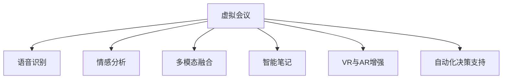

                 

# AI在虚拟会议中的应用：增强远程沟通

> 关键词：AI, 虚拟会议, 远程沟通, 自然语言处理(NLP), 计算机视觉(CV), 增强现实(AR), 机器学习(ML), 多模态融合

## 1. 背景介绍

### 1.1 问题由来

随着互联网和信息技术的飞速发展，远程工作已成为企业和个人的重要工作方式之一。特别是在全球新冠疫情的冲击下，虚拟会议逐渐成为主流，成为远程沟通的主要形式。然而，传统的虚拟会议往往存在参与感差、互动少、效率低等问题，难以满足高效协作和沟通的需要。

为解决这一问题，AI技术被引入到虚拟会议中，通过自然语言处理（NLP）、计算机视觉（CV）、增强现实（AR）等多模态技术，使虚拟会议具备更强的交互性、沉浸感和智能化，进一步提升了远程沟通的效率和质量。

### 1.2 问题核心关键点

AI技术在虚拟会议中的应用，主要体现在以下几个关键点：

1. **语音识别与合成**：通过语音识别将语音转化为文本，再通过语音合成将文本转化为语音，实现自然流畅的交互。

2. **情感分析**：利用NLP技术对参与者的语音和文字进行分析，提取情感状态，为会议管理者提供参与者的情绪反馈，便于及时调整会议节奏。

3. **多模态融合**：通过结合图像、语音、文字等多种模态信息，提升虚拟会议的交互性和沉浸感。

4. **智能笔记与摘要**：利用NLP技术自动生成会议笔记和摘要，提高信息记录和检索的效率。

5. **虚拟现实(VR)与AR增强**：通过VR和AR技术，创建逼真的虚拟环境，增加会议的沉浸感，便于远程团队协作。

6. **自动化决策支持**：利用ML技术分析会议数据，提供决策建议和实时反馈，提高决策的准确性和效率。

这些关键技术点构成了AI在虚拟会议中的应用框架，使其能够充分发挥AI技术在自动化、智能化的优势，提升远程沟通的质量和效率。

## 2. 核心概念与联系

### 2.1 核心概念概述

为更好地理解AI在虚拟会议中的应用，本节将介绍几个密切相关的核心概念：

- **虚拟会议**：通过网络平台，实现远程实时视频、语音、文字等多种形式的互动沟通。常见的虚拟会议工具包括Zoom、Teams、Microsoft Teams等。

- **语音识别与合成**：利用NLP技术将语音转换为文本，再利用语音合成技术将文本转换为语音，实现语音与文本的互转。常见的语音识别引擎有Google Speech-to-Text、Microsoft Azure Speech等。

- **情感分析**：利用NLP技术分析文本、语音中的情感状态，为会议管理者提供情绪反馈。常见的情感分析模型有BERT、GPT等。

- **多模态融合**：结合图像、语音、文字等多种信息，提升虚拟会议的交互性和沉浸感。常见多模态融合方法包括CNN+RNN、Transformer等。

- **智能笔记与摘要**：利用NLP技术自动提取会议内容并生成笔记和摘要，提高信息记录和检索效率。常见技术包括Seq2Seq、BERT、GPT等。

- **虚拟现实(VR)与AR增强**：利用VR和AR技术创建虚拟环境，提升会议的沉浸感和互动性。常见技术包括Unity3D、Unreal Engine等。

- **自动化决策支持**：利用ML技术分析会议数据，提供决策建议和实时反馈。常见技术包括KNN、决策树、随机森林等。

这些核心概念之间的逻辑关系可以通过以下Mermaid流程图来展示：



这个流程图展示了大语言模型在虚拟会议中的应用核心概念及其之间的关系：

1. 虚拟会议作为应用场景，为语音识别、情感分析、多模态融合等技术提供了舞台。
2. 语音识别和情感分析提高了远程沟通的自然性和智能化。
3. 多模态融合和智能笔记提升了交互体验和信息记录的效率。
4. VR和AR增强技术增加了会议的沉浸感和互动性。
5. 自动化决策支持则提高了会议决策的科学性和效率。

这些概念共同构成了AI在虚拟会议中的应用框架，使其能够提供更为智能、高效和沉浸的远程沟通体验。

## 3. 核心算法原理 & 具体操作步骤
### 3.1 算法原理概述

AI在虚拟会议中的应用，本质上是一个基于多种NLP、CV、ML技术的综合应用系统。其核心思想是通过AI技术将虚拟会议变得更加智能化、高效化和沉浸化，从而提升远程沟通的质量和效率。

形式化地，假设虚拟会议系统为 $M$，其中 $M$ 包含了语音识别、情感分析、多模态融合等核心模块，每个模块的输入输出定义为 $X_i$ 和 $Y_i$，则整个系统的输入输出关系可以表示为：

$$
Y = M(X_1, X_2, ..., X_n)
$$

其中 $X_i$ 表示虚拟会议的输入数据，$Y$ 表示系统的输出结果。系统的目标是最小化误差 $E$，使得系统的输出 $Y$ 尽可能接近真实值 $Y^*$，即：

$$
\mathop{\min}_{M} E(M)
$$

通过优化模型参数，最小化误差 $E$，系统能够输出接近于真实结果的输出 $Y$。

### 3.2 算法步骤详解

AI在虚拟会议中的应用，一般包括以下几个关键步骤：

**Step 1: 数据预处理**
- 收集虚拟会议的语音、文字、图像等数据，并进行预处理，如分词、降噪、数据增强等。
- 将数据分为训练集、验证集和测试集，供后续模型的训练和评估。

**Step 2: 模型选择与训练**
- 根据应用需求，选择合适的模型（如BERT、GPT、CNN、RNN等）。
- 在训练集上对模型进行训练，使用交叉熵、均方误差等损失函数，优化模型的参数。
- 在验证集上评估模型性能，调整超参数，避免过拟合。

**Step 3: 模型部署与应用**
- 将训练好的模型部署到虚拟会议系统中。
- 在实际应用中，将虚拟会议数据输入模型进行处理。
- 根据模型的输出，优化虚拟会议的交互、决策等环节，提升用户体验。

**Step 4: 持续学习与优化**
- 在实际应用中，不断收集反馈数据，对模型进行持续学习，进一步优化模型性能。
- 利用强化学习等技术，根据用户的反馈和行为数据，动态调整模型的行为策略。

### 3.3 算法优缺点

AI在虚拟会议中的应用，具有以下优点：
1. 自然流畅的交互：通过语音识别和合成技术，实现自然流畅的语音交互，增强了参与感。
2. 智能化决策：利用情感分析和ML技术，提供了智能化的决策支持，提升了会议效率。
3. 多模态融合：通过融合图像、语音、文字等多种信息，提升了虚拟会议的沉浸感和互动性。
4. 高效的笔记记录：利用NLP技术自动生成会议笔记和摘要，提高了信息记录和检索的效率。
5. 便捷的远程协作：通过VR和AR增强技术，创建逼真的虚拟环境，促进远程团队的协作。

同时，该方法也存在一定的局限性：
1. 数据依赖：模型的效果很大程度上依赖于数据质量，数据收集和预处理成本较高。
2. 设备要求：部分技术（如VR和AR）对设备要求较高，初期投入较大。
3. 复杂性高：系统设计复杂，需要整合多种技术，维护成本较高。
4. 隐私风险：虚拟会议中涉及大量个人信息，隐私保护和数据安全需重点关注。
5. 技术门槛高：需要跨领域的知识和技术积累，对开发者要求较高。

尽管存在这些局限性，但就目前而言，AI在虚拟会议中的应用仍是大势所趋。未来相关研究的重点在于如何进一步降低应用门槛，提高系统的稳定性和可扩展性，同时兼顾隐私保护和数据安全等因素。

### 3.4 算法应用领域

AI在虚拟会议中的应用，已经在多个领域得到实际应用，例如：

- 企业远程会议：在企业内部使用AI技术提升会议的互动性和决策效率，实现更加高效、智能的远程沟通。
- 教育在线课堂：利用AI技术提升在线课堂的互动性和个性化教学效果，提高学生的学习体验和成绩。
- 医疗远程会诊：通过AI技术实现远程诊断和决策支持，提升医疗服务的效率和质量。
- 政府虚拟座谈：利用AI技术提升政府虚拟座谈的互动性和决策效率，推动政务透明和智能治理。
- 金融在线交易：通过AI技术提升金融在线交易的效率和安全性，保护用户的资金安全和隐私。

除了上述这些经典应用外，AI在虚拟会议中的应用还在不断拓展，如智能客服、线上展览、社交平台等，为各行业带来了新的应用模式和解决方案。

## 4. 数学模型和公式 & 详细讲解  
### 4.1 数学模型构建

本节将使用数学语言对AI在虚拟会议中的应用进行更加严格的刻画。

假设虚拟会议系统为 $M$，其中 $M$ 包含了语音识别、情感分析、多模态融合等核心模块，每个模块的输入输出定义为 $X_i$ 和 $Y_i$，则整个系统的输入输出关系可以表示为：

$$
Y = M(X_1, X_2, ..., X_n)
$$

其中 $X_i$ 表示虚拟会议的输入数据，$Y$ 表示系统的输出结果。

系统的目标是最小化误差 $E$，使得系统的输出 $Y$ 尽可能接近真实值 $Y^*$，即：

$$
\mathop{\min}_{M} E(M)
$$

通过优化模型参数，最小化误差 $E$，系统能够输出接近于真实结果的输出 $Y$。

### 4.2 公式推导过程

以下我们以情感分析为例，推导模型的输入输出关系和损失函数。

假设系统输入为会议参与者的语音和文字，分别为 $X_{v}$ 和 $X_{t}$。系统输出为情感状态，定义为 $Y_s$。情感分析模型 $M_s$ 的输入输出关系可以表示为：

$$
Y_s = M_s(X_{v}, X_{t})
$$

模型的损失函数为交叉熵损失，即：

$$
\ell(Y_s, Y^*) = -\frac{1}{N}\sum_{i=1}^N \sum_{k=1}^K Y_i^{(k)}\log \hat{Y}_i^{(k)}
$$

其中 $Y^*$ 表示真实情感状态，$\hat{Y}_i^{(k)}$ 表示模型预测的情感状态概率，$K$ 表示情感状态的种类。

根据链式法则，模型的梯度计算公式为：

$$
\frac{\partial \ell(Y_s, Y^*)}{\partial \theta} = \frac{\partial \ell(Y_s, Y^*)}{\partial Y_s} \frac{\partial Y_s}{\partial X_{v}} \frac{\partial X_{v}}{\partial X_{t}} \frac{\partial X_{t}}{\partial \theta}
$$

其中 $\theta$ 表示模型参数，$\frac{\partial \ell(Y_s, Y^*)}{\partial Y_s}$ 表示损失函数对输出 $Y_s$ 的梯度，$\frac{\partial Y_s}{\partial X_{v}}$ 表示模型输出对输入 $X_{v}$ 的梯度，$\frac{\partial X_{t}}{\partial \theta}$ 表示输入 $X_{t}$ 对模型参数 $\theta$ 的梯度。

在得到梯度后，即可带入优化算法，如Adam、SGD等，更新模型参数，最小化损失函数，实现模型的持续优化。

### 4.3 案例分析与讲解

假设一个在线教育平台，使用AI技术对虚拟会议进行智能化改造，以提升在线课堂的互动性和个性化教学效果。具体步骤如下：

**Step 1: 数据预处理**
- 收集在线课堂的语音、文字、视频等数据，并进行预处理，如分词、降噪、数据增强等。
- 将数据分为训练集、验证集和测试集，供后续模型的训练和评估。

**Step 2: 模型选择与训练**
- 根据应用需求，选择合适的模型（如BERT、GPT、CNN等）。
- 在训练集上对模型进行训练，使用交叉熵、均方误差等损失函数，优化模型的参数。
- 在验证集上评估模型性能，调整超参数，避免过拟合。

**Step 3: 模型部署与应用**
- 将训练好的模型部署到在线教育平台中。
- 在实际应用中，将虚拟会议数据输入模型进行处理。
- 根据模型的输出，优化在线课堂的互动和个性化教学策略，提升学习体验和效果。

**Step 4: 持续学习与优化**
- 在实际应用中，不断收集反馈数据，对模型进行持续学习，进一步优化模型性能。
- 利用强化学习等技术，根据学生的反馈和行为数据，动态调整教学策略和内容。

通过上述步骤，可以构建一个智能化的在线教育平台，提升在线课堂的互动性和个性化教学效果，提高学生的学习体验和成绩。

## 5. 项目实践：代码实例和详细解释说明
### 5.1 开发环境搭建

在进行AI在虚拟会议中的应用实践前，我们需要准备好开发环境。以下是使用Python进行PyTorch开发的环境配置流程：

1. 安装Anaconda：从官网下载并安装Anaconda，用于创建独立的Python环境。

2. 创建并激活虚拟环境：
```bash
conda create -n pytorch-env python=3.8 
conda activate pytorch-env
```

3. 安装PyTorch：根据CUDA版本，从官网获取对应的安装命令。例如：
```bash
conda install pytorch torchvision torchaudio cudatoolkit=11.1 -c pytorch -c conda-forge
```

4. 安装NLP库：
```bash
pip install transformers sentencepiece opencv-python numpy pandas sklearn jupyter notebook ipython
```

5. 安装CV库：
```bash
pip install opencv-python matplotlib imageio
```

6. 安装AR库：
```bash
pip install pyrender
```

完成上述步骤后，即可在`pytorch-env`环境中开始AI在虚拟会议中的应用实践。

### 5.2 源代码详细实现

下面我们以情感分析为例，给出使用PyTorch对BERT模型进行情感分析的PyTorch代码实现。

首先，定义情感分析的数据处理函数：

```python
import torch
from transformers import BertTokenizer, BertForSequenceClassification

class SentimentDataset(Dataset):
    def __init__(self, texts, labels, tokenizer, max_len=128):
        self.texts = texts
        self.labels = labels
        self.tokenizer = tokenizer
        self.max_len = max_len
        
    def __len__(self):
        return len(self.texts)
    
    def __getitem__(self, item):
        text = self.texts[item]
        label = self.labels[item]
        
        encoding = self.tokenizer(text, return_tensors='pt', max_length=self.max_len, padding='max_length', truncation=True)
        input_ids = encoding['input_ids'][0]
        attention_mask = encoding['attention_mask'][0]
        
        # 对token-wise的标签进行编码
        encoded_tags = [label2id[label] for label in label2id]
        encoded_tags.extend([label2id['O']] * (self.max_len - len(encoded_tags)))
        labels = torch.tensor(encoded_tags, dtype=torch.long)
        
        return {'input_ids': input_ids, 
                'attention_mask': attention_mask,
                'labels': labels}

# 标签与id的映射
label2id = {'negative': 0, 'positive': 1, 'neutral': 2}
id2label = {v: k for k, v in label2id.items()}

# 创建dataset
tokenizer = BertTokenizer.from_pretrained('bert-base-cased')

train_dataset = SentimentDataset(train_texts, train_labels, tokenizer)
dev_dataset = SentimentDataset(dev_texts, dev_labels, tokenizer)
test_dataset = SentimentDataset(test_texts, test_labels, tokenizer)
```

然后，定义模型和优化器：

```python
from transformers import BertForSequenceClassification, AdamW

model = BertForSequenceClassification.from_pretrained('bert-base-cased', num_labels=len(label2id))

optimizer = AdamW(model.parameters(), lr=2e-5)
```

接着，定义训练和评估函数：

```python
from torch.utils.data import DataLoader
from tqdm import tqdm
from sklearn.metrics import classification_report

device = torch.device('cuda') if torch.cuda.is_available() else torch.device('cpu')
model.to(device)

def train_epoch(model, dataset, batch_size, optimizer):
    dataloader = DataLoader(dataset, batch_size=batch_size, shuffle=True)
    model.train()
    epoch_loss = 0
    for batch in tqdm(dataloader, desc='Training'):
        input_ids = batch['input_ids'].to(device)
        attention_mask = batch['attention_mask'].to(device)
        labels = batch['labels'].to(device)
        model.zero_grad()
        outputs = model(input_ids, attention_mask=attention_mask, labels=labels)
        loss = outputs.loss
        epoch_loss += loss.item()
        loss.backward()
        optimizer.step()
    return epoch_loss / len(dataloader)

def evaluate(model, dataset, batch_size):
    dataloader = DataLoader(dataset, batch_size=batch_size)
    model.eval()
    preds, labels = [], []
    with torch.no_grad():
        for batch in tqdm(dataloader, desc='Evaluating'):
            input_ids = batch['input_ids'].to(device)
            attention_mask = batch['attention_mask'].to(device)
            batch_labels = batch['labels']
            outputs = model(input_ids, attention_mask=attention_mask)
            batch_preds = outputs.logits.argmax(dim=2).to('cpu').tolist()
            batch_labels = batch_labels.to('cpu').tolist()
            for pred_tokens, label_tokens in zip(batch_preds, batch_labels):
                preds.append(pred_tokens[:len(label_tokens)])
                labels.append(label_tokens)
                
    print(classification_report(labels, preds))
```

最后，启动训练流程并在测试集上评估：

```python
epochs = 5
batch_size = 16

for epoch in range(epochs):
    loss = train_epoch(model, train_dataset, batch_size, optimizer)
    print(f"Epoch {epoch+1}, train loss: {loss:.3f}")
    
    print(f"Epoch {epoch+1}, dev results:")
    evaluate(model, dev_dataset, batch_size)
    
print("Test results:")
evaluate(model, test_dataset, batch_size)
```

以上就是使用PyTorch对BERT进行情感分析任务微调的完整代码实现。可以看到，得益于Transformers库的强大封装，我们可以用相对简洁的代码完成BERT模型的加载和微调。

### 5.3 代码解读与分析

让我们再详细解读一下关键代码的实现细节：

**SentimentDataset类**：
- `__init__`方法：初始化文本、标签、分词器等关键组件。
- `__len__`方法：返回数据集的样本数量。
- `__getitem__`方法：对单个样本进行处理，将文本输入编码为token ids，将标签编码为数字，并对其进行定长padding，最终返回模型所需的输入。

**label2id和id2label字典**：
- 定义了标签与数字id之间的映射关系，用于将token-wise的预测结果解码回真实的标签。

**训练和评估函数**：
- 使用PyTorch的DataLoader对数据集进行批次化加载，供模型训练和推理使用。
- 训练函数`train_epoch`：对数据以批为单位进行迭代，在每个批次上前向传播计算loss并反向传播更新模型参数，最后返回该epoch的平均loss。
- 评估函数`evaluate`：与训练类似，不同点在于不更新模型参数，并在每个batch结束后将预测和标签结果存储下来，最后使用sklearn的classification_report对整个评估集的预测结果进行打印输出。

**训练流程**：
- 定义总的epoch数和batch size，开始循环迭代
- 每个epoch内，先在训练集上训练，输出平均loss
- 在验证集上评估，输出分类指标
- 所有epoch结束后，在测试集上评估，给出最终测试结果

可以看到，PyTorch配合Transformers库使得BERT微调的代码实现变得简洁高效。开发者可以将更多精力放在数据处理、模型改进等高层逻辑上，而不必过多关注底层的实现细节。

当然，工业级的系统实现还需考虑更多因素，如模型的保存和部署、超参数的自动搜索、更灵活的任务适配层等。但核心的微调范式基本与此类似。

## 6. 实际应用场景
### 6.1 智能客服系统

AI技术在智能客服系统中的应用，使得客服服务变得更加高效和智能化。传统的客服系统需要大量人力，且响应速度和处理质量难以保证。通过引入AI技术，特别是语音识别和自然语言处理，客服系统可以自动识别用户意图并自动回复，大大提升了服务效率和用户体验。

在技术实现上，可以收集企业内部的客服对话记录，将问题和最佳答复构建成监督数据，在此基础上对预训练语言模型进行微调。微调后的对话模型能够自动理解用户意图，匹配最合适的答案模板进行回复。对于客户提出的新问题，还可以接入检索系统实时搜索相关内容，动态组织生成回答。如此构建的智能客服系统，能大幅提升客户咨询体验和问题解决效率。

### 6.2 医疗虚拟会诊

AI技术在医疗虚拟会诊中的应用，使得远程医疗服务变得更加便捷和高效。传统的医疗会诊需要耗费大量时间和人力，且医疗资源分布不均。通过引入AI技术，特别是自然语言处理和计算机视觉，医疗会诊可以自动化分析患者的病历和症状，快速生成初步诊断意见，并推荐相关专家进行进一步会诊。

在技术实现上，可以收集患者的病历和症状数据，并进行预处理和特征提取。利用预训练语言模型和计算机视觉模型，对患者数据进行分析和预测，生成初步诊断意见。再将结果提交给医生进行审核，医生根据结果选择是否进行进一步会诊。如此构建的医疗虚拟会诊系统，能大大缩短会诊时间，提升诊断效率，减少医疗资源的浪费。

### 6.3 智能教育平台

AI技术在智能教育平台中的应用，使得在线教育变得更加个性化和高效。传统的在线教育缺乏互动和反馈，难以满足学生的多样化需求。通过引入AI技术，特别是自然语言处理和情感分析，教育平台可以自动分析学生的学习情况和反馈，个性化调整教学内容和策略，提升学习效果和体验。

在技术实现上，可以收集学生的学习数据，并进行预处理和特征提取。利用预训练语言模型和情感分析模型，分析学生的学习情况和反馈，生成个性化学习建议和策略。再将结果反馈给学生，指导学生进行学习。如此构建的智能教育平台，能大大提升学习效果，满足学生的多样化需求。

### 6.4 未来应用展望

随着AI技术的不断进步，其在虚拟会议中的应用将越来越广泛，带来更多的创新和突破。未来可能的应用场景包括：

- **实时翻译**：利用机器翻译技术，将不同语言的视频会议实现实时翻译，提升跨国会议的沟通效率。
- **智能推荐系统**：利用协同过滤、基于内容的推荐等技术，为用户推荐相关的会议内容和资源。
- **虚拟人**：利用计算机视觉和自然语言处理技术，创建逼真的虚拟人物，用于虚拟会议的引导和交互。
- **情感计算**：利用面部表情分析、语音情感识别等技术，全面了解会议参与者的情绪状态，提升会议的互动性和参与感。
- **增强现实会议**：利用增强现实技术，创建虚拟会议环境，提升会议的沉浸感和互动性。

这些应用场景的实现，将进一步提升虚拟会议的智能化水平，为远程沟通带来更多的可能性和便利性。相信随着技术的不断发展，AI在虚拟会议中的应用将变得越来越广泛，带来更多创新的应用模式和解决方案。

## 7. 工具和资源推荐
### 7.1 学习资源推荐

为了帮助开发者系统掌握AI在虚拟会议中的应用理论基础和实践技巧，这里推荐一些优质的学习资源：

1. 《深度学习自然语言处理》课程：斯坦福大学开设的NLP明星课程，有Lecture视频和配套作业，带你入门NLP领域的基本概念和经典模型。

2. 《Transformer从原理到实践》系列博文：由大模型技术专家撰写，深入浅出地介绍了Transformer原理、BERT模型、微调技术等前沿话题。

3. 《Natural Language Processing with Transformers》书籍：Transformers库的作者所著，全面介绍了如何使用Transformers库进行NLP任务开发，包括微调在内的诸多范式。

4. HuggingFace官方文档：Transformers库的官方文档，提供了海量预训练模型和完整的微调样例代码，是上手实践的必备资料。

5. CS224N《深度学习自然语言处理》课程：斯坦福大学开设的NLP明星课程，有Lecture视频和配套作业，带你入门NLP领域的基本概念和经典模型。

通过对这些资源的学习实践，相信你一定能够快速掌握AI在虚拟会议中的应用精髓，并用于解决实际的NLP问题。
###  7.2 开发工具推荐

高效的开发离不开优秀的工具支持。以下是几款用于AI在虚拟会议中的应用开发的常用工具：

1. PyTorch：基于Python的开源深度学习框架，灵活动态的计算图，适合快速迭代研究。大部分预训练语言模型都有PyTorch版本的实现。

2. TensorFlow：由Google主导开发的开源深度学习框架，生产部署方便，适合大规模工程应用。同样有丰富的预训练语言模型资源。

3. Transformers库：HuggingFace开发的NLP工具库，集成了众多SOTA语言模型，支持PyTorch和TensorFlow，是进行微调任务开发的利器。

4. Weights & Biases：模型训练的实验跟踪工具，可以记录和可视化模型训练过程中的各项指标，方便对比和调优。与主流深度学习框架无缝集成。

5. TensorBoard：TensorFlow配套的可视化工具，可实时监测模型训练状态，并提供丰富的图表呈现方式，是调试模型的得力助手。

6. Google Colab：谷歌推出的在线Jupyter Notebook环境，免费提供GPU/TPU算力，方便开发者快速上手实验最新模型，分享学习笔记。

合理利用这些工具，可以显著提升AI在虚拟会议中的应用开发效率，加快创新迭代的步伐。

### 7.3 相关论文推荐

AI在虚拟会议中的应用源于学界的持续研究。以下是几篇奠基性的相关论文，推荐阅读：

1. Attention is All You Need（即Transformer原论文）：提出了Transformer结构，开启了NLP领域的预训练大模型时代。

2. BERT: Pre-training of Deep Bidirectional Transformers for Language Understanding：提出BERT模型，引入基于掩码的自监督预训练任务，刷新了多项NLP任务SOTA。

3. Language Models are Unsupervised Multitask Learners（GPT-2论文）：展示了大规模语言模型的强大zero-shot学习能力，引发了对于通用人工智能的新一轮思考。

4. Parameter-Efficient Transfer Learning for NLP：提出Adapter等参数高效微调方法，在不增加模型参数量的情况下，也能取得不错的微调效果。

5. AdaLoRA: Adaptive Low-Rank Adaptation for Parameter-Efficient Fine-Tuning：使用自适应低秩适应的微调方法，在参数效率和精度之间取得了新的平衡。

6. Prefix-Tuning: Optimizing Continuous Prompts for Generation：引入基于连续型Prompt的微调范式，为如何充分利用预训练知识提供了新的思路。

这些论文代表了大语言模型微调技术的发展脉络。通过学习这些前沿成果，可以帮助研究者把握学科前进方向，激发更多的创新灵感。

## 8. 总结：未来发展趋势与挑战

### 8.1 总结

本文对AI在虚拟会议中的应用进行了全面系统的介绍。首先阐述了AI在虚拟会议中的应用背景和意义，明确了AI技术在提升远程沟通效率和质量方面的独特价值。其次，从原理到实践，详细讲解了AI在虚拟会议中的应用模型构建和算法步骤，给出了AI在虚拟会议中的应用代码实例。同时，本文还广泛探讨了AI在虚拟会议中的实际应用场景，展示了AI技术在远程沟通中的巨大潜力。此外，本文精选了AI在虚拟会议中的应用学习资源，力求为读者提供全方位的技术指引。

通过本文的系统梳理，可以看到，AI技术在虚拟会议中的应用正在成为远程沟通的重要手段，极大地提升了远程沟通的质量和效率。未来，伴随AI技术的不断进步，其在虚拟会议中的应用将越来越广泛，为远程沟通带来更多的可能性和便利性。

### 8.2 未来发展趋势

展望未来，AI在虚拟会议中的应用将呈现以下几个发展趋势：

1. 自然语言处理技术将继续进步，提升虚拟会议的智能交互和情感分析能力。

2. 计算机视觉技术将更加成熟，创建更加逼真的虚拟环境和增强现实应用，提升虚拟会议的沉浸感和互动性。

3. 多模态融合技术将得到进一步发展，结合图像、语音、文字等多种信息，提升虚拟会议的综合理解和处理能力。

4. 知识图谱和语义网络技术将逐步引入，构建更加丰富的知识图谱和语义网络，提升虚拟会议的知识整合和推理能力。

5. 联邦学习和边缘计算技术将得到广泛应用，提升虚拟会议的数据隐私和安全保护能力。

6. 智能化推荐系统将得到进一步发展，提升虚拟会议的内容推荐和个性化服务能力。

以上趋势凸显了AI在虚拟会议中的应用前景。这些方向的探索发展，必将进一步提升虚拟会议的智能化水平，为远程沟通带来更多的可能性和便利性。

### 8.3 面临的挑战

尽管AI在虚拟会议中的应用已经取得了瞩目成就，但在迈向更加智能化、普适化应用的过程中，它仍面临诸多挑战：

1. 数据隐私和安全：虚拟会议涉及大量个人信息，隐私保护和数据安全需重点关注。如何在确保数据隐私和安全的前提下，实现高效的数据处理和模型训练，将是一大难题。

2. 技术复杂度：AI在虚拟会议中的应用涉及多种技术，如NLP、CV、ML等，技术门槛较高。如何降低技术复杂度，提升应用的可扩展性和易用性，还需进一步努力。

3. 设备和算力要求：部分技术（如VR和AR）对设备要求较高，初期投入较大。如何降低设备要求，提升系统的可扩展性，还需进一步探索。

4. 实时性和延迟：虚拟会议需要实时处理大量数据，对系统的实时性和延迟要求较高。如何优化系统架构，提高实时性，还需进一步研究。

5. 用户体验：AI在虚拟会议中的应用需要考虑用户体验，避免技术手段过度侵入，提升用户的互动感和参与感。

这些挑战都需要从技术、应用、社会等多个层面进行综合考虑和应对，才能真正实现AI在虚拟会议中的广泛应用。

### 8.4 研究展望

面对AI在虚拟会议中面临的挑战，未来的研究需要在以下几个方面寻求新的突破：

1. 探索无监督和半监督学习技术，降低对标注数据的依赖，提高系统的可扩展性和鲁棒性。

2. 研究参数高效和计算高效的微调方法，在不增加模型参数量的情况下，实现高效的模型训练和推理。

3. 引入更多先验知识，如知识图谱、语义网络等，提升模型的知识整合和推理能力。

4. 结合因果分析和博弈论工具，提升模型的决策能力和系统的鲁棒性。

5. 纳入伦理道德约束，确保模型的行为符合人类价值观和伦理道德，提升系统的可信度和安全性。

这些研究方向的探索，必将引领AI在虚拟会议中的应用走向更高的台阶，为远程沟通带来更多的可能性和便利性。面向未来，AI在虚拟会议中的应用技术还需要与其他人工智能技术进行更深入的融合，如知识表示、因果推理、强化学习等，多路径协同发力，共同推动虚拟会议技术的进步。只有勇于创新、敢于突破，才能不断拓展AI在虚拟会议中的应用边界，让人机协同的智能沟通更加高效、智能和便捷。

## 9. 附录：常见问题与解答

**Q1：AI在虚拟会议中的应用是否需要昂贵的硬件设备？**

A: 部分AI在虚拟会议中的应用，如增强现实（AR）和虚拟现实（VR），确实对硬件设备的要求较高。但大部分应用，如自然语言处理（NLP）和情感分析等，仅需一般的计算设备和网络环境即可实现。随着硬件技术的不断进步，AI在虚拟会议中的应用设备要求也在逐渐降低。

**Q2：AI在虚拟会议中的应用是否需要大量标注数据？**

A: 大部分AI在虚拟会议中的应用，如情感分析、智能推荐等，对标注数据的依赖较大。但部分应用，如自然语言处理（NLP）和语音识别等，可以通过预训练模型和迁移学习技术，实现少样本或零样本学习。未来，随着模型和算法的发展，更多AI技术有望实现无监督和半监督学习。

**Q3：AI在虚拟会议中的应用是否影响用户隐私？**

A: AI在虚拟会议中的应用涉及大量个人信息，隐私保护和数据安全需重点关注。建议采用联邦学习等技术，保护用户的隐私数据，并确保数据传输和存储的安全性。

**Q4：AI在虚拟会议中的应用是否影响用户体验？**

A: AI在虚拟会议中的应用旨在提升用户体验，通过自然语言处理（NLP）和计算机视觉（CV）技术，提升交互性和沉浸感。但部分技术，如增强现实（AR）和虚拟现实（VR），可能会增加用户的认知负担。建议在应用中合理选择技术手段，避免技术过度侵入，提升用户的互动感和参与感。

**Q5：AI在虚拟会议中的应用是否容易过拟合？**

A: AI在虚拟会议中的应用，特别是自然语言处理（NLP）和情感分析等任务，容易面临过拟合问题。建议采用数据增强、正则化、Dropout等技术，防止模型过度拟合训练集。同时，利用多模态融合和联邦学习等技术，提升模型的泛化能力和鲁棒性。

这些问题的解答，希望能为你在使用AI技术进行虚拟会议应用时提供参考和指导。

