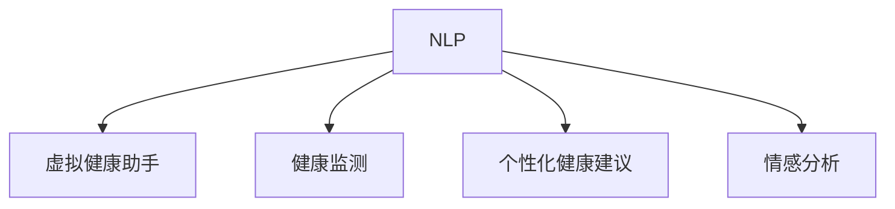

                 

## 1. 背景介绍

### 1.1 问题由来

在全球范围内，尤其是疫情带来的公共卫生危机背景下，提高大众健康意识，预防疾病，成为各国的首要任务。传统的健康教育方法依赖于社区医生、学校健康教育课程、媒体传播等渠道，往往覆盖面有限，时效性差，且难以实现个性化健康教育。

随着人工智能技术的迅猛发展，虚拟健康教育成为一种新兴的教育方式。AI不仅能够提供即时、个性化的健康信息，还能通过虚拟形象与用户互动，使用户在沉浸式体验中获取健康知识。

虚拟健康教育的关键在于人工智能技术的深度应用，包括自然语言处理、机器学习、计算机视觉等。其中，自然语言处理(NLP)技术在虚拟健康教育中扮演着重要角色。它不仅能够解析和理解用户的输入，还能生成符合用户期望的回复。

### 1.2 问题核心关键点

虚拟健康教育的核心在于使用自然语言处理(NLP)技术，与用户进行互动，提供健康建议和行为指导。这种基于文本的交流方式，能够覆盖广泛的人群，提供个性化的健康教育内容，具有以下优势：

- **即时性**：用户可以随时获取健康信息，无需等待专家咨询。
- **个性化**：通过分析用户的历史数据和行为模式，提供定制化的健康建议。
- **可扩展性**：覆盖多种语言和不同地区，服务于全球用户。
- **成本效益**：虚拟健康教育的部署和维护成本相对较低。

### 1.3 问题研究意义

虚拟健康教育的普及，不仅有助于提高大众健康意识，预防疾病，还能够在疫情等公共卫生危机时期，提供有效的健康教育服务。对虚拟健康教育的研究和实践，对社会健康福利和公共卫生事业的长期发展具有重要意义。

## 2. 核心概念与联系

### 2.1 核心概念概述

为更好地理解虚拟健康教育中AI的应用，本节将介绍几个核心概念：

- **自然语言处理(NLP)**：通过计算机处理、理解、生成人类语言的技术，使计算机能够执行诸如语言翻译、情感分析、文本生成等任务。
- **虚拟健康助手**：基于NLP技术的智能健康教育系统，能够与用户互动，提供健康建议和行为指导。
- **健康监测**：通过连续监测用户的生理指标，分析健康状况，提供及时的健康建议。
- **个性化健康建议**：根据用户的年龄、性别、健康历史等个性化信息，提供定制化的健康管理方案。
- **情感分析**：分析用户输入的语言和情绪，及时调整互动策略，提供更符合用户心理状态的健康建议。

这些核心概念之间的逻辑关系可以通过以下Mermaid流程图来展示：



这个流程图展示了大语言模型在虚拟健康教育中的关键作用：

1. **NLP**：是虚拟健康助手的核心技术，使系统能够理解和生成自然语言，实现与用户的交互。
2. **虚拟健康助手**：是AI技术在虚拟健康教育中的具体应用，负责与用户互动，提供健康建议。
3. **健康监测**：通过传感器等设备获取用户的生理指标，提供即时反馈。
4. **个性化健康建议**：根据用户的具体情况，生成个性化的健康管理方案。
5. **情感分析**：通过分析用户的语言和情绪，及时调整互动策略，提升用户体验。

这些概念共同构成了虚拟健康教育的技术框架，使得AI技术能够在大规模、个性化、即时性健康教育中发挥重要作用。

## 3. 核心算法原理 & 具体操作步骤
### 3.1 算法原理概述

虚拟健康教育中AI的应用，主要基于自然语言处理(NLP)技术的深度学习模型。其核心思想是：通过预训练模型解析用户的输入，并生成符合用户期望的回复，同时结合健康监测数据，提供个性化的健康建议。

形式化地，假设虚拟健康助手的输入为用户的健康咨询文本 $x$，输出为系统的回复文本 $y$。在健康监测数据为 $\{(\mathbf{x}, \mathbf{y})\}_{i=1}^N$ 的情况下，虚拟健康助手的优化目标为最小化损失函数 $\mathcal{L}$：

$$
\mathcal{L} = \frac{1}{N} \sum_{i=1}^N \ell(x_i, y_i)
$$

其中 $\ell(x_i, y_i)$ 为NLP模型的损失函数，通常是交叉熵损失。通过反向传播算法更新模型参数，最小化损失函数，即可实现虚拟健康助手的训练。

### 3.2 算法步骤详解

虚拟健康教育中AI的算法步骤如下：

**Step 1: 准备预训练模型和数据集**
- 选择合适的NLP预训练模型，如BERT、GPT等。
- 收集健康教育相关的文本数据，如医学知识、疾病预防、健康生活方式等。
- 使用已标注的健康咨询和回复数据集进行模型微调。

**Step 2: 添加任务适配层**
- 在预训练模型的顶部添加一个任务适配层，根据具体任务设计输出层和损失函数。
- 对于健康咨询和回复任务，通常使用双向LSTM或Transformer模型，并添加Softmax层输出回复概率。
- 对于健康监测数据，可以设计一个多输出层模型，分别处理生理指标、健康建议等。

**Step 3: 设置微调超参数**
- 选择合适的优化算法及其参数，如AdamW、SGD等，设置学习率、批大小、迭代轮数等。
- 设置正则化技术及强度，包括权重衰减、Dropout、Early Stopping等。
- 确定冻结预训练参数的策略，如仅微调顶层，或全部参数都参与微调。

**Step 4: 执行梯度训练**
- 将训练集数据分批次输入模型，前向传播计算损失函数。
- 反向传播计算参数梯度，根据设定的优化算法和学习率更新模型参数。
- 周期性在验证集上评估模型性能，根据性能指标决定是否触发 Early Stopping。
- 重复上述步骤直到满足预设的迭代轮数或 Early Stopping 条件。

**Step 5: 测试和部署**
- 在测试集上评估虚拟健康助手的性能，对比微调前后的精度提升。
- 使用虚拟健康助手对新样本进行推理预测，集成到实际的应用系统中。
- 持续收集新的数据，定期重新微调模型，以适应数据分布的变化。

以上是虚拟健康教育中AI应用的算法步骤。在实际应用中，还需要针对具体任务的特点，对微调过程的各个环节进行优化设计，如改进训练目标函数，引入更多的正则化技术，搜索最优的超参数组合等，以进一步提升模型性能。

### 3.3 算法优缺点

虚拟健康教育中AI的应用具有以下优点：
1. **即时性**：用户可以随时获取健康信息，无需等待专家咨询。
2. **个性化**：通过分析用户的历史数据和行为模式，提供定制化的健康建议。
3. **可扩展性**：覆盖多种语言和不同地区，服务于全球用户。
4. **成本效益**：虚拟健康教育的部署和维护成本相对较低。

同时，该方法也存在一定的局限性：
1. **数据质量依赖**：虚拟健康助手的性能很大程度上取决于标注数据的质量和数量，获取高质量标注数据的成本较高。
2. **隐私和伦理问题**：用户健康数据的隐私和安全问题需要特别注意，须符合相关法律法规。
3. **模型泛化能力**：当目标任务与预训练数据的分布差异较大时，虚拟健康助手的性能提升有限。
4. **复杂互动场景处理**：在处理复杂场景时，虚拟健康助手可能无法提供准确的建议。

尽管存在这些局限性，但就目前而言，基于NLP的虚拟健康教育仍是一种高效的、可行的健康教育方式。未来相关研究的重点在于如何进一步降低数据标注的依赖，提高模型的少样本学习和跨领域迁移能力，同时兼顾隐私保护和伦理安全性等因素。

### 3.4 算法应用领域

虚拟健康教育中AI的应用领域非常广泛，涵盖了以下多个方面：

- **疾病预防与健康教育**：通过虚拟健康助手向用户提供预防疾病的知识，推广健康生活方式。
- **慢性病管理**：为慢性病患者提供个性化的健康管理方案，如糖尿病、高血压等。
- **心理健康支持**：通过虚拟健康助手与用户互动，提供心理健康支持，缓解压力和焦虑。
- **远程医疗咨询**：在医疗资源匮乏的地区，通过虚拟健康助手提供远程医疗服务。
- **家庭健康管理**：帮助家庭用户监测和管理家庭成员的健康状况，提供个性化建议。
- **学校健康教育**：在学校环境中，通过虚拟健康助手向学生传授健康知识，提高健康意识。

除了上述这些经典应用外，虚拟健康教育还被创新性地应用于更多场景中，如医院导诊、健康数据记录与分析、智能健康机器人等，为公众健康事业带来新的突破。

## 4. 数学模型和公式 & 详细讲解 & 举例说明

### 4.1 数学模型构建

本节将使用数学语言对虚拟健康教育中AI的应用过程进行更加严格的刻画。

记虚拟健康助手的输入为用户的健康咨询文本 $x$，输出为系统的回复文本 $y$。假设虚拟健康助手的训练集为 $\{(x_i, y_i)\}_{i=1}^N$，其中 $x_i$ 为第 $i$ 个用户的健康咨询文本，$y_i$ 为对应的回复文本。

定义模型 $M_{\theta}$ 在输入 $x$ 上的损失函数为 $\ell(x_i, y_i)$，则在训练集 $D$ 上的经验风险为：

$$
\mathcal{L}(\theta) = \frac{1}{N} \sum_{i=1}^N \ell(x_i, y_i)
$$

其中 $\ell(x_i, y_i)$ 为NLP模型的损失函数，通常是交叉熵损失。通过梯度下降等优化算法更新模型参数 $\theta$，最小化损失函数 $\mathcal{L}$，使得模型输出逼近真实回复。

### 4.2 公式推导过程

以下我们以健康咨询和回复任务为例，推导交叉熵损失函数及其梯度的计算公式。

假设虚拟健康助手在输入 $x$ 上的输出为 $\hat{y}=M_{\theta}(x) \in [0,1]$，表示系统生成的回复概率。真实标签 $y \in \{0,1\}$。则二分类交叉熵损失函数定义为：

$$
\ell(x_i, y_i) = -[y_i\log \hat{y}_i + (1-y_i)\log (1-\hat{y}_i)]
$$

将其代入经验风险公式，得：

$$
\mathcal{L}(\theta) = -\frac{1}{N}\sum_{i=1}^N [y_i\log M_{\theta}(x_i)+(1-y_i)\log(1-M_{\theta}(x_i))]
$$

根据链式法则，损失函数对参数 $\theta_k$ 的梯度为：

$$
\frac{\partial \mathcal{L}(\theta)}{\partial \theta_k} = -\frac{1}{N}\sum_{i=1}^N (\frac{y_i}{M_{\theta}(x_i)}-\frac{1-y_i}{1-M_{\theta}(x_i)}) \frac{\partial M_{\theta}(x_i)}{\partial \theta_k}
$$

其中 $\frac{\partial M_{\theta}(x_i)}{\partial \theta_k}$ 可进一步递归展开，利用自动微分技术完成计算。

在得到损失函数的梯度后，即可带入参数更新公式，完成模型的迭代优化。重复上述过程直至收敛，最终得到适应虚拟健康教育任务的最优模型参数 $\theta^*$。

## 5. 项目实践：代码实例和详细解释说明

### 5.1 开发环境搭建

在进行虚拟健康教育AI的实践前，我们需要准备好开发环境。以下是使用Python进行PyTorch开发的环境配置流程：

1. 安装Anaconda：从官网下载并安装Anaconda，用于创建独立的Python环境。

2. 创建并激活虚拟环境：
```bash
conda create -n pytorch-env python=3.8 
conda activate pytorch-env
```

3. 安装PyTorch：根据CUDA版本，从官网获取对应的安装命令。例如：
```bash
conda install pytorch torchvision torchaudio cudatoolkit=11.1 -c pytorch -c conda-forge
```

4. 安装各类工具包：
```bash
pip install numpy pandas scikit-learn matplotlib tqdm jupyter notebook ipython
```

完成上述步骤后，即可在`pytorch-env`环境中开始AI的实践。

### 5.2 源代码详细实现

下面我们以虚拟健康助手为例，给出使用Transformers库进行BERT模型微调的PyTorch代码实现。

首先，定义虚拟健康助手的任务适配层：

```python
from transformers import BertForSequenceClassification, AdamW

# 假设健康咨询和回复任务的数据格式为 (健康咨询文本, 回复文本)
model = BertForSequenceClassification.from_pretrained('bert-base-cased', num_labels=2)

optimizer = AdamW(model.parameters(), lr=2e-5)
```

然后，定义训练和评估函数：

```python
from torch.utils.data import DataLoader
from tqdm import tqdm
from sklearn.metrics import classification_report

device = torch.device('cuda') if torch.cuda.is_available() else torch.device('cpu')
model.to(device)

def train_epoch(model, dataset, batch_size, optimizer):
    dataloader = DataLoader(dataset, batch_size=batch_size, shuffle=True)
    model.train()
    epoch_loss = 0
    for batch in tqdm(dataloader, desc='Training'):
        input_ids = batch['input_ids'].to(device)
        attention_mask = batch['attention_mask'].to(device)
        labels = batch['labels'].to(device)
        model.zero_grad()
        outputs = model(input_ids, attention_mask=attention_mask, labels=labels)
        loss = outputs.loss
        epoch_loss += loss.item()
        loss.backward()
        optimizer.step()
    return epoch_loss / len(dataloader)

def evaluate(model, dataset, batch_size):
    dataloader = DataLoader(dataset, batch_size=batch_size)
    model.eval()
    preds, labels = [], []
    with torch.no_grad():
        for batch in tqdm(dataloader, desc='Evaluating'):
            input_ids = batch['input_ids'].to(device)
            attention_mask = batch['attention_mask'].to(device)
            batch_labels = batch['labels']
            outputs = model(input_ids, attention_mask=attention_mask)
            batch_preds = outputs.logits.argmax(dim=2).to('cpu').tolist()
            batch_labels = batch_labels.to('cpu').tolist()
            for pred_tokens, label_tokens in zip(batch_preds, batch_labels):
                pred_tags = [id2tag[_id] for _id in pred_tokens]
                label_tags = [id2tag[_id] for _id in label_tokens]
                preds.append(pred_tags[:len(label_tokens)])
                labels.append(label_tags)
                
    print(classification_report(labels, preds))
```

最后，启动训练流程并在测试集上评估：

```python
epochs = 5
batch_size = 16

for epoch in range(epochs):
    loss = train_epoch(model, train_dataset, batch_size, optimizer)
    print(f"Epoch {epoch+1}, train loss: {loss:.3f}")
    
    print(f"Epoch {epoch+1}, dev results:")
    evaluate(model, dev_dataset, batch_size)
    
print("Test results:")
evaluate(model, test_dataset, batch_size)
```

以上就是使用PyTorch对BERT进行虚拟健康教育中健康咨询和回复任务微调的完整代码实现。可以看到，得益于Transformers库的强大封装，我们可以用相对简洁的代码完成BERT模型的加载和微调。

### 5.3 代码解读与分析

让我们再详细解读一下关键代码的实现细节：

**BertForSequenceClassification类**：
- `from_pretrained`方法：使用预训练的BERT模型进行初始化。
- `num_labels`参数：指定模型输出分类数，用于生成回复概率。

**train_epoch函数**：
- 使用PyTorch的DataLoader对数据集进行批次化加载，供模型训练使用。
- 在每个epoch内，循环迭代训练集，计算损失函数并更新模型参数。

**evaluate函数**：
- 同样使用PyTorch的DataLoader对数据集进行批次化加载，供模型评估使用。
- 在每个epoch结束时，评估模型在验证集上的表现，打印分类报告。

**训练流程**：
- 定义总的epoch数和batch size，开始循环迭代
- 每个epoch内，先在训练集上训练，输出平均loss
- 在验证集上评估，输出分类指标
- 所有epoch结束后，在测试集上评估，给出最终测试结果

可以看到，PyTorch配合Transformers库使得BERT微调的代码实现变得简洁高效。开发者可以将更多精力放在数据处理、模型改进等高层逻辑上，而不必过多关注底层的实现细节。

当然，工业级的系统实现还需考虑更多因素，如模型的保存和部署、超参数的自动搜索、更灵活的任务适配层等。但核心的微调范式基本与此类似。

## 6. 实际应用场景
### 6.1 智能健康管理系统

智能健康管理系统利用AI技术，提供个性化的健康监测和管理服务，帮助用户实时掌握自身健康状况，提高生活质量。

在技术实现上，可以集成虚拟健康助手和健康监测设备，收集用户的生理指标数据。通过虚拟健康助手，用户可以随时进行健康咨询，获取个性化的健康建议和行为指导。系统还可以分析用户的健康数据，提供健康报告和风险评估，帮助用户制定合理的健康管理计划。

### 6.2 远程医疗服务

远程医疗服务通过虚拟健康助手与医生、患者的互动，提供远程诊疗、健康咨询等服务。在疫情期间，远程医疗尤为重要，能够有效缓解医疗资源不足的问题。

在具体应用中，虚拟健康助手可以集成医生知识库，提供疾病诊断和健康建议。患者可以通过虚拟健康助手描述症状，系统将根据其健康数据和症状，推荐合适的医生进行远程诊疗。医生可以通过虚拟健康助手与患者互动，提供详细健康建议和用药指导。

### 6.3 心理健康支持系统

心理健康支持系统利用虚拟健康助手，提供心理援助和情感支持。系统可以分析用户的情绪变化，提供针对性的心理建议和自我调节方法。

在具体实现上，虚拟健康助手可以集成情感分析算法，实时监测用户的情绪状态。系统根据用户的情绪变化，推荐合适的心理健康资源，如心理医生、在线课程等。此外，系统还可以提供自我调节的方法，如冥想、呼吸练习等，帮助用户缓解压力和焦虑。

### 6.4 学校健康教育平台

学校健康教育平台利用虚拟健康助手，提供健康教育课程和互动学习。在课堂教学中，教师可以通过虚拟健康助手布置作业、评估学生表现。学生可以通过虚拟健康助手进行在线学习，获取个性化的健康教育内容。

在具体实现上，虚拟健康助手可以集成自然语言生成技术，自动生成健康教育内容。教师可以根据教学目标，生成不同主题的健康教育视频和练习题。学生可以通过虚拟健康助手进行在线问答和互动学习，提升健康意识和健康管理能力。

### 6.5 未来应用展望

随着AI技术的不断发展，虚拟健康教育将进一步普及和深化。未来，虚拟健康教育有望在更多领域得到应用，如：

- **家庭健康管理**：通过虚拟健康助手，为家庭成员提供健康监测和管理服务，提高家庭健康水平。
- **智能健康数据记录**：利用可穿戴设备采集用户的健康数据，结合虚拟健康助手进行分析和反馈，提升健康管理效果。
- **智能健康提醒**：通过虚拟健康助手，定期提醒用户进行健康检查和健康习惯养成。
- **智能健康互动**：利用自然语言处理技术，与用户进行更加自然、流畅的互动，提升用户体验。

未来，虚拟健康教育将结合更多前沿技术，如人工智能、物联网、大数据等，提供更加个性化、智能化的健康管理服务，为公众健康事业带来新的突破。

## 7. 工具和资源推荐
### 7.1 学习资源推荐

为了帮助开发者系统掌握虚拟健康教育中AI的应用，这里推荐一些优质的学习资源：

1. **自然语言处理(NLP)**：
   - 《Speech and Language Processing》（Jurafsky & Martin）：NLP领域的经典教材，全面介绍了NLP的基本概念和核心技术。
   - 《Deep Learning for Natural Language Processing》（Goodfellow et al.）：深度学习在NLP中的应用，涵盖预训练模型、微调技术等前沿内容。

2. **人工智能与健康**：
   - 《Artificial Intelligence in Medicine》（Malhotra & Misra）：介绍AI在医疗中的应用，涵盖诊断、治疗、健康管理等多个方面。
   - 《Health Data Science》（Lakshmanan et al.）：介绍健康数据科学的基本概念和技术，涵盖数据挖掘、机器学习、自然语言处理等。

3. **虚拟健康教育**：
   - 《Virtual Health Education》（Barnes et al.）：介绍虚拟健康教育的最新进展和应用案例，涵盖技术实现、用户体验等多个方面。
   - 《Health Education Technology》（McGwin et al.）：介绍健康教育技术的应用，涵盖虚拟健康助手、远程医疗等多个方面。

通过对这些资源的学习实践，相信你一定能够快速掌握虚拟健康教育中AI的应用，并用于解决实际的公共健康问题。

### 7.2 开发工具推荐

高效的开发离不开优秀的工具支持。以下是几款用于虚拟健康教育中AI开发的常用工具：

1. **PyTorch**：基于Python的开源深度学习框架，灵活动态的计算图，适合快速迭代研究。
2. **TensorFlow**：由Google主导开发的开源深度学习框架，生产部署方便，适合大规模工程应用。
3. **Transformers库**：HuggingFace开发的NLP工具库，集成了众多SOTA语言模型，支持PyTorch和TensorFlow，是进行AI开发的重要工具。
4. **Jupyter Notebook**：免费的开源笔记本环境，支持Python、R等多种语言，方便进行数据处理、模型训练等任务。
5. **Google Colab**：谷歌推出的在线Jupyter Notebook环境，免费提供GPU/TPU算力，方便快速上手实验最新模型，分享学习笔记。

合理利用这些工具，可以显著提升虚拟健康教育中AI的开发效率，加快创新迭代的步伐。

### 7.3 相关论文推荐

虚拟健康教育中AI的研究源于学界的持续研究。以下是几篇奠基性的相关论文，推荐阅读：

1. **Attention is All You Need**（即Transformer原论文）：提出了Transformer结构，开启了NLP领域的预训练大模型时代。
2. **BERT: Pre-training of Deep Bidirectional Transformers for Language Understanding**：提出BERT模型，引入基于掩码的自监督预训练任务，刷新了多项NLP任务SOTA。
3. **Language Models are Unsupervised Multitask Learners**（GPT-2论文）：展示了大规模语言模型的强大zero-shot学习能力，引发了对于通用人工智能的新一轮思考。
4. **Healthcare Big Data: Concepts, Trends, and Techniques**：综述了健康大数据的最新进展，涵盖数据收集、处理、分析等多个方面。
5. **Artificial Intelligence in Healthcare: Data, Models, and Applications**：介绍了AI在医疗领域的应用，涵盖诊断、治疗、健康管理等多个方面。
6. **Natural Language Processing in Healthcare: A Survey**：综述了NLP在医疗领域的应用，涵盖文本分类、信息抽取、问答系统等多个方面。

这些论文代表了大语言模型在虚拟健康教育中的发展脉络。通过学习这些前沿成果，可以帮助研究者把握学科前进方向，激发更多的创新灵感。

## 8. 总结：未来发展趋势与挑战

### 8.1 总结

本文对虚拟健康教育中AI的应用进行了全面系统的介绍。首先阐述了虚拟健康教育的研究背景和意义，明确了AI技术在虚拟健康教育中的独特价值。其次，从原理到实践，详细讲解了虚拟健康教育中AI的应用过程，包括模型构建、训练流程、评估指标等。最后，探讨了虚拟健康教育中AI的未来发展趋势和面临的挑战，对未来的研究提供了方向性的指导。

通过本文的系统梳理，可以看到，虚拟健康教育中AI的应用不仅能够提升公众健康意识，预防疾病，还能在疫情等公共卫生危机时期，提供有效的健康教育服务。未来，随着AI技术的不断发展，虚拟健康教育将进一步普及和深化，为公众健康事业带来新的突破。

### 8.2 未来发展趋势

展望未来，虚拟健康教育中AI的应用将呈现以下几个发展趋势：

1. **多模态融合**：未来的虚拟健康教育将结合多种数据源，如文本、语音、图像等，提供更全面的健康监测和管理服务。
2. **个性化推荐**：利用AI技术，分析用户的健康数据和行为模式，提供个性化的健康建议和行为指导。
3. **实时互动**：通过自然语言处理技术，与用户进行更加自然、流畅的互动，提升用户体验。
4. **数据驱动**：结合大数据分析和AI技术，提供更加精准、科学的健康管理方案。
5. **伦理和安全**：在虚拟健康教育中，注重数据隐私和安全，保护用户的个人信息和健康数据。
6. **可解释性**：提升虚拟健康助手的可解释性，使系统决策过程透明化，增强用户信任。

这些趋势凸显了虚拟健康教育中AI应用的广阔前景。这些方向的探索发展，必将进一步提升虚拟健康教育系统的性能和用户体验，为公众健康事业带来新的突破。

### 8.3 面临的挑战

尽管虚拟健康教育中AI的应用已经取得了显著进展，但在迈向更加智能化、普适化应用的过程中，它仍面临着诸多挑战：

1. **数据质量**：虚拟健康助手的性能很大程度上取决于标注数据的质量和数量，获取高质量标注数据的成本较高。
2. **模型鲁棒性**：虚拟健康助手面对域外数据时，泛化性能往往大打折扣。
3. **隐私和伦理**：用户健康数据的隐私和安全问题需要特别注意，须符合相关法律法规。
4. **复杂场景处理**：在处理复杂场景时，虚拟健康助手可能无法提供准确的建议。
5. **技术成熟度**：虚拟健康教育中AI的应用仍然处于初级阶段，技术成熟度有待提高。
6. **用户接受度**：用户对虚拟健康助手的接受度仍需进一步提高，需加强宣传和教育。

这些挑战需要研究者和开发者共同努力，通过技术创新和政策制定，解决存在的问题，推动虚拟健康教育的普及和应用。

### 8.4 研究展望

面对虚拟健康教育中AI应用所面临的挑战，未来的研究需要在以下几个方面寻求新的突破：

1. **数据增强**：通过数据增强技术，扩充训练集，提高虚拟健康助手的泛化能力。
2. **迁移学习**：结合预训练和微调技术，利用已有知识，加速新任务的训练。
3. **多任务学习**：结合多个健康监测和行为指导任务，提升虚拟健康助手的整体性能。
4. **情感分析**：结合情感分析技术，提升虚拟健康助手与用户的互动效果。
5. **知识图谱**：结合知识图谱，提供更全面的健康知识支持。
6. **交互设计**：结合交互设计技术，提升虚拟健康助手的用户体验。

这些研究方向将进一步推动虚拟健康教育中AI的应用，使其在提升公众健康意识和预防疾病方面发挥更大的作用。

## 9. 附录：常见问题与解答

**Q1：虚拟健康教育中的AI如何处理数据隐私和安全问题？**

A: 数据隐私和安全是虚拟健康教育中AI应用的重要考虑因素。为保护用户数据隐私，可以采用以下措施：
1. 数据匿名化：通过数据脱敏、去标识化等手段，保护用户隐私。
2. 访问控制：严格控制数据访问权限，确保只有授权用户可以访问健康数据。
3. 数据加密：采用加密技术，保护数据在传输和存储过程中的安全。
4. 合规性：确保虚拟健康教育中的AI应用符合相关法律法规，如GDPR、HIPAA等。

**Q2：虚拟健康教育中的AI如何提升模型泛化能力？**

A: 提升虚拟健康教育中AI模型的泛化能力，可以采用以下措施：
1. 数据增强：通过数据增强技术，扩充训练集，提高模型的泛化能力。
2. 迁移学习：结合预训练和微调技术，利用已有知识，加速新任务的训练。
3. 多任务学习：结合多个健康监测和行为指导任务，提升模型的整体性能。
4. 对抗训练：引入对抗样本，提高模型的鲁棒性。

**Q3：虚拟健康教育中的AI如何处理复杂场景？**

A: 处理复杂场景是虚拟健康教育中AI应用的一大挑战。可以采用以下措施：
1. 多轮对话设计：通过多轮对话设计，逐步深入了解用户需求和健康问题。
2. 专家知识库：结合专家知识库，提供更全面、准确的健康建议。
3. 交互设计：结合交互设计技术，提升虚拟健康助手与用户的互动效果。

**Q4：虚拟健康教育中的AI如何提高用户接受度？**

A: 提高虚拟健康教育中AI应用的接受度，可以采用以下措施：
1. 用户界面设计：通过友好的用户界面设计，提升用户体验。
2. 交互设计：结合交互设计技术，提升虚拟健康助手与用户的互动效果。
3. 宣传教育：通过宣传和教育，提高用户对虚拟健康助手的认知和接受度。

通过本文的系统梳理，可以看到，虚拟健康教育中AI的应用不仅能够提升公众健康意识，预防疾病，还能在疫情等公共卫生危机时期，提供有效的健康教育服务。未来，随着AI技术的不断发展，虚拟健康教育将进一步普及和深化，为公众健康事业带来新的突破。

