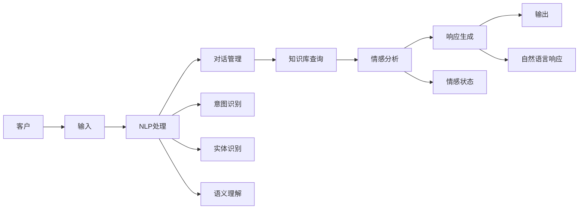

                 

# AI在虚拟客户服务中的应用：提供24/7支持

> 关键词：虚拟客户服务,人工智能,自然语言处理,对话系统,情感分析,意图识别,客户体验优化,自动化流程,实时响应

## 1. 背景介绍

### 1.1 问题由来

随着电子商务和互联网服务的日益普及，客户服务的质量和效率变得越来越重要。传统的客户服务方式，如电话客服、邮件和在线聊天等，往往面临人力成本高、响应速度慢、人工效率低等诸多挑战。据统计，客服部门通常占据企业总成本的20%以上，而客户满意度和忠诚度却难以得到显著提升。

为应对这些挑战，企业纷纷探索利用人工智能(AI)技术构建虚拟客户服务系统。通过虚拟客服，企业能够实现全天候24/7不间断服务，快速响应客户咨询，降低人力成本，提升客户满意度，从而大幅提升企业的竞争力和市场占有率。

### 1.2 问题核心关键点

虚拟客户服务的核心目标是通过智能化的AI技术，构建一个能够理解客户需求、提供实时响应、维护客户体验的自动化服务系统。其中，对话系统作为虚拟客户服务的中枢环节，扮演着至关重要的角色。对话系统不仅需要能够理解客户的自然语言输入，还需要具备生成自然语言响应的能力，实现双向交互。

虚拟客户服务的成功实施，取决于以下关键要素：
1. **自然语言处理(NLP)**：能够理解客户的自然语言输入，并进行语言预处理、分词、实体识别、意图识别等操作。
2. **对话管理**：根据客户输入和上下文信息，选择合适的回答，保持对话连贯。
3. **知识库**：提供丰富的知识信息，帮助对话系统生成更准确、更有用的回复。
4. **情感分析**：识别客户的情感状态，优化客户体验。
5. **多模态交互**：结合语音、图像等多模态信息，提升服务质量。

## 2. 核心概念与联系

### 2.1 核心概念概述

为更好地理解虚拟客户服务的核心技术和算法，本节将介绍几个关键概念：

- **自然语言处理(NLP)**：涉及文本预处理、语言模型、分词、词性标注、命名实体识别、语义理解、对话生成等任务。
- **对话系统**：基于NLP技术的智能对话系统，能够理解自然语言输入并生成自然语言响应。
- **情感分析**：识别客户输入中的情感信息，以优化客服策略和客户体验。
- **知识库**：存储与产品、服务、操作流程等相关的信息，供客服系统查询使用。
- **多模态交互**：结合语音、图像等多模态信息，提升客户服务质量。

这些核心概念之间通过数据流和信息流紧密联系，共同构成了虚拟客户服务系统的基本架构。

### 2.2 核心概念原理和架构的 Mermaid 流程图



这个流程图展示了虚拟客户服务系统的基本架构和工作流程。

1. **客户输入**：客户通过各种渠道（如网站、APP、语音助手等）提交问题或请求。
2. **NLP处理**：对客户输入进行预处理、分词、命名实体识别、意图识别、语义理解等操作，生成结构化的输入数据。
3. **对话管理**：根据输入数据和上下文信息，选择合适的回答，并通过对话管理策略保持对话连贯。
4. **知识库查询**：根据客户问题和上下文信息，查询知识库中的相关知识，辅助生成更准确的回复。
5. **情感分析**：识别客户输入中的情感信息，以优化客服策略和客户体验。
6. **响应生成**：生成结构化的自然语言响应，经过进一步的优化处理，最终输出给客户。

## 3. 核心算法原理 & 具体操作步骤

### 3.1 算法原理概述

虚拟客户服务系统中的对话生成过程，本质上是一种基于自然语言处理和深度学习的技术。其核心算法包括：

1. **序列到序列模型(Sequence-to-Sequence Modeling)**：用于将客户输入序列映射到自然语言响应序列。
2. **注意力机制(Attention Mechanism)**：帮助模型关注输入序列中的关键信息，提升生成质量。
3. **预训练语言模型(Pre-training Language Models)**：如BERT、GPT等，用于获取语言表示和上下文信息。
4. **多模态融合(Multimodal Fusion)**：结合语音、图像等多模态信息，提升客户体验。
5. **知识增强(Knowledge Enrichment)**：通过构建知识库，增强对话系统的知识储备。

### 3.2 算法步骤详解

虚拟客户服务系统的实现涉及多个关键步骤，包括数据准备、模型训练、对话生成等。以下是详细的步骤说明：

**Step 1: 数据准备**

1. **数据收集**：收集客户历史交流数据、常见问题及答案、行业术语等，构建训练数据集。
2. **数据清洗**：去除无关信息、纠正错误数据，确保数据质量。
3. **数据标注**：对数据进行意图识别、实体识别、情感分析等标注，便于模型训练。

**Step 2: 模型训练**

1. **模型选择**：选择合适的序列到序列模型，如Seq2Seq、Transformer等。
2. **模型配置**：设置模型的超参数，如学习率、批次大小、优化器等。
3. **模型训练**：使用标注好的数据集，对模型进行训练，不断调整参数以优化生成效果。

**Step 3: 对话生成**

1. **上下文管理**：记录客户对话历史，供当前对话参考。
2. **意图识别**：识别客户输入的意图，决定生成回复的类型。
3. **实体识别**：从客户输入中提取关键实体，辅助生成回复。
4. **语义理解**：理解客户输入的语义，提升回复的相关性和准确性。
5. **情感分析**：识别客户输入中的情感信息，优化客服策略。
6. **响应生成**：生成自然语言响应，结合知识库和上下文信息，优化回复内容。

**Step 4: 模型优化**

1. **评估和测试**：在测试集上评估模型性能，识别模型的弱点。
2. **模型调优**：调整模型结构和参数，改进对话生成效果。
3. **部署和监控**：将优化后的模型部署到生产环境中，实时监控模型表现，进行持续优化。

### 3.3 算法优缺点

虚拟客户服务系统中的对话生成算法具有以下优点：

1. **全天候服务**：不受人工工作时间的限制，能够24/7提供服务。
2. **高效率**：自动化处理客户请求，响应速度快，减轻人工客服压力。
3. **一致性**：回答规范、逻辑清晰，客户体验一致。
4. **多模态支持**：结合语音、图像等多模态信息，提升服务质量。

同时，这些算法也存在一些缺点：

1. **语境理解限制**：当前技术仍难以完美理解复杂语境和隐含意图，需要不断优化。
2. **数据依赖性**：依赖于大量的标注数据进行训练，标注成本较高。
3. **知识局限性**：知识库更新速度较慢，难以实时反映最新的产品和服务信息。
4. **复杂交互处理**：面对复杂问题，对话系统可能需要多次迭代才能给出准确回答。

### 3.4 算法应用领域

虚拟客户服务系统已经在多个行业得到了广泛应用，例如：

1. **电商领域**：构建智能客服系统，帮助消费者解答产品咨询、处理售后投诉等。
2. **金融服务**：提供24/7金融咨询、账户管理、理财建议等服务。
3. **医疗健康**：提供在线问诊、健康咨询、预约挂号等服务。
4. **旅游服务**：提供预订查询、行程规划、问题解答等服务。
5. **教育培训**：提供在线答疑、课程推荐、学习进度跟踪等服务。

## 4. 数学模型和公式 & 详细讲解 & 举例说明

### 4.1 数学模型构建

虚拟客户服务系统中的对话生成过程，可以通过序列到序列模型来建模。假设客户输入为 $x=\{x_1, x_2, \dots, x_n\}$，自然语言响应为 $y=\{y_1, y_2, \dots, y_m\}$，其中 $n$ 和 $m$ 分别为输入和输出的长度。

**模型结构**：

1. **编码器(Encoder)**：将客户输入 $x$ 转化为高维语义表示 $h$。
2. **解码器(Decoder)**：接收语义表示 $h$，生成自然语言响应 $y$。

**目标函数**：

1. **交叉熵损失(Cross-Entropy Loss)**：衡量模型预测的响应与真实响应之间的差异。
2. **BLEU分数(BLEU Score)**：评估生成的响应与人工响应之间的相似度。

### 4.2 公式推导过程

序列到序列模型的目标函数为：

$$
\mathcal{L} = -\sum_{i=1}^m \log P(y_i|y_{<i}, h)
$$

其中 $P(y_i|y_{<i}, h)$ 为模型在给定上下文 $y_{<i}$ 和语义表示 $h$ 条件下生成 $y_i$ 的概率。

使用最大化似然估计的方法，对模型进行训练。设 $p_{\theta}(y_i|y_{<i}, h)$ 为参数为 $\theta$ 的模型在给定上下文 $y_{<i}$ 和语义表示 $h$ 条件下生成 $y_i$ 的概率。则训练目标为：

$$
\theta^* = \mathop{\arg\min}_{\theta} \frac{1}{N} \sum_{i=1}^N -\log p_{\theta}(y_i|y_{<i}, h)
$$

在实际应用中，通常使用序列到序列模型和注意力机制来构建对话生成模型。注意力机制可以帮助模型关注输入序列中的关键信息，提升生成质量。

### 4.3 案例分析与讲解

假设某电商平台的客服系统，收集到以下客户咨询数据：

1. **客户咨询**：“请问如何设置收货地址？”
2. **人工回复**：“您可以在订单页面上填写收货地址，提交后系统会自动配送。”

将客户咨询和人工回复标注为训练数据，使用Seq2Seq模型进行训练。假设模型输出为：

$$
y = \{是，请，在，订单，页面，上，填写，收，货，址，提交，系统，自动，配，送\}
$$

模型训练后，对新的客户咨询“我想修改收货地址”进行回复：

$$
\hat{y} = \{想，修，改，收，货，址\}
$$

## 5. 项目实践：代码实例和详细解释说明

### 5.1 开发环境搭建

在进行虚拟客户服务系统的开发前，我们需要准备好开发环境。以下是使用Python进行TensorFlow和PyTorch开发的环境配置流程：

1. 安装Anaconda：从官网下载并安装Anaconda，用于创建独立的Python环境。

2. 创建并激活虚拟环境：
```bash
conda create -n pytorch-env python=3.8 
conda activate pytorch-env
```

3. 安装PyTorch和TensorFlow：根据CUDA版本，从官网获取对应的安装命令。例如：
```bash
conda install pytorch torchvision torchaudio cudatoolkit=11.1 -c pytorch -c conda-forge
```

4. 安装TensorFlow：
```bash
pip install tensorflow
```

5. 安装各类工具包：
```bash
pip install numpy pandas scikit-learn matplotlib tqdm jupyter notebook ipython
```

完成上述步骤后，即可在`pytorch-env`环境中开始虚拟客户服务系统的开发。

### 5.2 源代码详细实现

下面我们以电商客服系统为例，给出使用TensorFlow和PyTorch进行对话生成的代码实现。

首先，定义对话系统的模型结构：

```python
import tensorflow as tf
from tensorflow.keras.layers import Input, LSTM, Dense, Attention, Embedding

# 定义模型
class Seq2SeqModel(tf.keras.Model):
    def __init__(self, vocab_size, embedding_dim, hidden_dim):
        super(Seq2SeqModel, self).__init__()
        self.encoder = LSTM(hidden_dim, return_sequences=True, return_state=True)
        self.attention = Attention()
        self.decoder = LSTM(hidden_dim, return_sequences=True, return_state=True)
        self.fc = Dense(vocab_size)
        
    def call(self, x, enc_state):
        h, c = enc_state
        x = tf.reshape(x, (-1, 1, 1))
        y = self.encoder(x)
        y, h, c = self.encoder(x, initial_state=[h, c])
        y = tf.reshape(y, (-1, 1, hidden_dim))
        y = tf.concat([y, self.attention(x, y, h)], axis=2)
        y = self.decoder(y)
        y = self.fc(y[:, -1, :])
        return y
```

然后，定义数据生成和模型训练函数：

```python
from tensorflow.keras.preprocessing.text import Tokenizer
from tensorflow.keras.preprocessing.sequence import pad_sequences

# 数据生成
tokenizer = Tokenizer(num_words=10000, oov_token='<OOV>')
tokenizer.fit_on_texts(train_texts)
train_sequences = tokenizer.texts_to_sequences(train_texts)
train_sequences = pad_sequences(train_sequences, maxlen=max_len, padding='post', truncating='post')
train_X = train_sequences[:, :-1]
train_y = train_sequences[:, 1:]

# 模型训练
model = Seq2SeqModel(vocab_size, embedding_dim, hidden_dim)
model.compile(optimizer='adam', loss='categorical_crossentropy', metrics=['accuracy'])
model.fit(train_X, train_y, epochs=num_epochs, batch_size=batch_size)
```

最后，使用训练好的模型对新的客户咨询进行回复：

```python
# 模型预测
test_text = ["请问如何设置收货地址？"]
test_sequences = tokenizer.texts_to_sequences(test_text)
test_sequences = pad_sequences(test_sequences, maxlen=max_len, padding='post', truncating='post')
y_hat = model.predict(test_sequences)
```

### 5.3 代码解读与分析

让我们再详细解读一下关键代码的实现细节：

**Seq2SeqModel类**：
- `__init__`方法：初始化模型的基本组件，包括编码器、注意力机制、解码器、全连接层。
- `call`方法：定义模型的前向传播过程。先对输入进行编码，然后通过注意力机制进行交互，最后解码并输出预测结果。

**数据生成**：
- `Tokenizer`：将文本转换为数字序列，便于模型训练。
- `pad_sequences`：对数据进行填充和截断，确保输入序列和输出序列的长度一致。
- `train_X`和`train_y`：将输入序列和输出序列切分为训练集和测试集。

**模型训练**：
- `compile`方法：定义优化器、损失函数和评估指标。
- `fit`方法：对模型进行训练，不断调整参数以优化生成效果。

**模型预测**：
- `predict`方法：使用训练好的模型对新的输入进行预测，输出自然语言响应。

通过以上代码实现，我们可以看到，虚拟客户服务系统中的对话生成，可以通过序列到序列模型和注意力机制来实现。

## 6. 实际应用场景

### 6.1 智能客服系统

智能客服系统作为虚拟客户服务的重要组成部分，已经广泛应用于各个行业。通过智能客服系统，企业可以大幅提升客户服务的效率和质量，降低人力成本，提升客户满意度。智能客服系统可以分为语音客服和文本客服两种形式，分别应用在电话客服和在线客服中。

以某电商平台为例，其智能客服系统可以通过以下方式构建：

1. **数据准备**：收集客户咨询记录和人工回复，构建训练数据集。
2. **模型训练**：使用Seq2Seq模型和注意力机制，对数据进行训练。
3. **对话生成**：在客户咨询时，智能客服系统自动生成自然语言回复，并提供语音、图像等多模态支持。
4. **客户反馈**：收集客户反馈，不断优化智能客服系统。

### 6.2 金融服务

金融领域对客户服务的实时性和准确性要求很高。传统的金融客服往往面临人力成本高、响应速度慢等问题，难以满足客户需求。通过智能客服系统，金融机构可以24/7提供金融咨询、账户管理、理财建议等服务，提升客户体验和满意度。

智能客服系统的实现可以包括以下步骤：

1. **数据准备**：收集金融咨询、账户管理、理财建议等常见问题及答案。
2. **模型训练**：使用Seq2Seq模型和注意力机制，对数据进行训练。
3. **对话生成**：在客户咨询时，智能客服系统自动生成自然语言回复，并提供语音、图像等多模态支持。
4. **客户反馈**：收集客户反馈，不断优化智能客服系统。

### 6.3 医疗健康

医疗健康领域的客户服务对准确性和专业性要求很高。通过智能客服系统，医疗机构可以24/7提供在线问诊、健康咨询、预约挂号等服务，提升患者体验和满意度。

智能客服系统的实现可以包括以下步骤：

1. **数据准备**：收集常见问题及答案、疾病诊断、医疗咨询等。
2. **模型训练**：使用Seq2Seq模型和注意力机制，对数据进行训练。
3. **对话生成**：在客户咨询时，智能客服系统自动生成自然语言回复，并提供语音、图像等多模态支持。
4. **客户反馈**：收集客户反馈，不断优化智能客服系统。

## 7. 工具和资源推荐

### 7.1 学习资源推荐

为了帮助开发者系统掌握虚拟客户服务系统的理论基础和实践技巧，这里推荐一些优质的学习资源：

1. **《深度学习入门》**：李沐老师的深度学习入门课程，涵盖深度学习基础、自然语言处理、计算机视觉等内容。
2. **《自然语言处理入门》**：斯坦福大学开设的自然语言处理课程，涵盖NLP基础和经典模型。
3. **《TensorFlow 2.0实战》**：李沐老师的TensorFlow实战课程，涵盖TensorFlow基础和应用。
4. **《TensorFlow教程》**：官方TensorFlow教程，提供丰富的学习资源和样例代码。
5. **《PyTorch实战》**：官方PyTorch教程，涵盖PyTorch基础和应用。

通过对这些资源的学习实践，相信你一定能够快速掌握虚拟客户服务系统的构建方法，并用于解决实际的客户服务问题。

### 7.2 开发工具推荐

高效的开发离不开优秀的工具支持。以下是几款用于虚拟客户服务系统开发的常用工具：

1. **PyTorch**：基于Python的开源深度学习框架，灵活动态的计算图，适合快速迭代研究。
2. **TensorFlow**：由Google主导开发的开源深度学习框架，生产部署方便，适合大规模工程应用。
3. **HuggingFace Transformers库**：提供预训练语言模型的封装，支持PyTorch和TensorFlow。
4. **NLTK**：自然语言处理工具包，提供丰富的NLP库和样例代码。
5. **TensorBoard**：TensorFlow配套的可视化工具，可实时监测模型训练状态。

合理利用这些工具，可以显著提升虚拟客户服务系统的开发效率，加快创新迭代的步伐。

### 7.3 相关论文推荐

虚拟客户服务系统的发展源于学界的持续研究。以下是几篇奠基性的相关论文，推荐阅读：

1. **Attention is All You Need**：提出Transformer结构，开启了NLP领域的预训练大模型时代。
2. **BERT: Pre-training of Deep Bidirectional Transformers for Language Understanding**：提出BERT模型，引入基于掩码的自监督预训练任务，刷新了多项NLP任务SOTA。
3. **Sequence to Sequence Learning with Neural Networks**：提出Seq2Seq模型，用于将客户输入序列映射到自然语言响应序列。
4. **Learning Phrase Representations using RNN Encoder-Decoder for Statistical Machine Translation**：提出Seq2Seq模型，用于机器翻译任务。
5. **Multimodal Speech and Text Representation Learning for Customer Service**：研究结合语音、图像等多模态信息的客户服务系统。

这些论文代表了大语言模型微调技术的发展脉络。通过学习这些前沿成果，可以帮助研究者把握学科前进方向，激发更多的创新灵感。

## 8. 总结：未来发展趋势与挑战

### 8.1 总结

本文对虚拟客户服务系统中的对话生成算法进行了全面系统的介绍。首先阐述了虚拟客户服务的背景和意义，明确了对话系统在构建智能客服系统中的核心作用。其次，从原理到实践，详细讲解了序列到序列模型和注意力机制的基本原理和关键步骤，给出了虚拟客户服务系统的完整代码实现。同时，本文还广泛探讨了智能客服系统在电商、金融、医疗等多个行业领域的应用前景，展示了虚拟客户服务系统的广阔应用空间。

通过本文的系统梳理，可以看到，虚拟客户服务系统已经广泛应用于各个行业，并通过智能客服系统大幅提升了客户服务的效率和质量。未来，伴随预训练语言模型和微调方法的持续演进，虚拟客户服务系统必将在更多领域得到应用，为传统行业带来变革性影响。

### 8.2 未来发展趋势

展望未来，虚拟客户服务系统将呈现以下几个发展趋势：

1. **多模态融合**：结合语音、图像、视频等多模态信息，提升客户体验。
2. **个性化推荐**：结合客户历史行为数据，提供个性化推荐服务。
3. **实时对话分析**：通过分析客户对话数据，优化客服策略和客户体验。
4. **情感分析**：识别客户情感状态，提升客服响应质量。
5. **知识增强**：结合知识图谱、专家知识库，增强对话系统的知识储备。
6. **联邦学习**：在保护客户隐私的前提下，实现跨机构的知识共享和模型优化。

这些趋势将推动虚拟客户服务系统向更加智能化、个性化、实时化的方向发展，提升客户服务的效率和质量。

### 8.3 面临的挑战

尽管虚拟客户服务系统已经取得了瞩目成就，但在迈向更加智能化、普适化应用的过程中，它仍面临着诸多挑战：

1. **数据隐私和安全**：客户数据的隐私和安全问题需要得到充分保障，防止数据泄露和滥用。
2. **语言理解**：复杂语境和隐含意图仍然是当前技术难以完美处理的问题，需要不断优化。
3. **多模态融合**：多模态数据的融合和处理仍存在技术瓶颈，需要进一步探索。
4. **知识更新**：知识库的更新和维护需要跟上业务变化，确保知识的时效性和准确性。
5. **系统可解释性**：虚拟客服系统的决策过程需要更加透明，增强系统的可解释性和可解释性。
6. **跨领域适应性**：虚拟客服系统需要具备跨领域适应性，能够在不同业务场景中提供一致的客户服务。

这些挑战需要在未来的研究中不断探索和突破，才能真正实现虚拟客户服务系统的普适化和智能化。

### 8.4 研究展望

面对虚拟客服系统面临的种种挑战，未来的研究需要在以下几个方面寻求新的突破：

1. **深度学习与符号学习的融合**：结合深度学习模型的强大表达能力和符号学习的精确推理，提升系统的理解和生成能力。
2. **跨模态信息融合**：结合语音、图像、视频等多种模态信息，提升客户服务的综合体验。
3. **知识图谱与自然语言处理结合**：将知识图谱与自然语言处理技术结合，增强对话系统的知识储备和推理能力。
4. **联邦学习与本地推理结合**：通过联邦学习技术，实现跨机构的知识共享和模型优化，同时保留本地推理能力，保障数据隐私。
5. **实时对话分析与主动服务结合**：通过实时对话分析技术，预测客户需求，提供主动服务，提升客户满意度。

这些研究方向将推动虚拟客服系统向更加智能化、普适化、实时化的方向发展，为构建人机协同的智能系统铺平道路。

## 9. 附录：常见问题与解答

**Q1：虚拟客户服务系统是否适用于所有业务场景？**

A: 虚拟客户服务系统适用于大多数业务场景，但需要根据具体需求进行定制和优化。例如，对于客户需求变化较大、个性化要求高的场景，需要结合个性化推荐、实时对话分析等技术进行优化。

**Q2：如何选择虚拟客户服务系统的技术架构？**

A: 选择虚拟客户服务系统的技术架构需要考虑业务需求、技术成熟度、硬件资源等因素。通常可以选择TensorFlow、PyTorch等深度学习框架，或使用预训练模型如BERT、GPT等进行微调。

**Q3：如何优化虚拟客户服务系统的性能？**

A: 优化虚拟客户服务系统的性能可以从多个方面入手，包括数据预处理、模型选择、超参数调优、正则化技术等。同时，可以结合多模态融合、知识增强、情感分析等技术提升系统性能。

**Q4：虚拟客户服务系统的数据隐私和安全问题如何解决？**

A: 虚拟客户服务系统的数据隐私和安全问题需要通过技术手段和制度保障相结合的方式解决。例如，可以采用数据加密、差分隐私、联邦学习等技术保障数据隐私，同时建立数据使用的透明性和可控性。

**Q5：虚拟客户服务系统的知识库构建和管理如何实现？**

A: 知识库的构建和管理需要结合领域专家和数据挖掘技术，构建全面的知识图谱，并定期更新和维护。同时，可以结合知识图谱与自然语言处理技术，提升系统的知识推理能力。

通过本文的系统梳理，可以看到，虚拟客户服务系统已经广泛应用于各个行业，并通过智能客服系统大幅提升了客户服务的效率和质量。未来，伴随预训练语言模型和微调方法的持续演进，虚拟客户服务系统必将在更多领域得到应用，为传统行业带来变革性影响。

