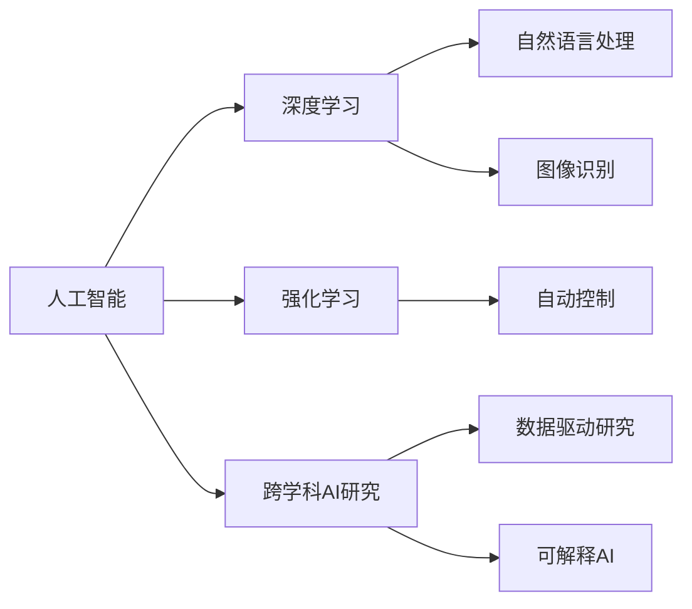
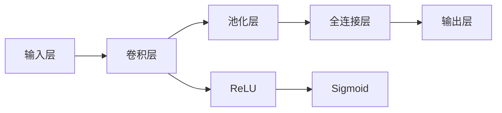

                 

## 1. 背景介绍

### 1.1 问题由来

随着人工智能（AI）技术的迅速发展，AI不再局限于传统的计算机科学领域，而是广泛应用于各个学科，形成跨学科的AI研究与应用。AI在医学、生物学、化学、天文学、经济学、心理学等诸多领域展现出巨大的应用前景。从早期基于规则的专家系统，到现在的深度学习模型和强化学习技术，AI不断刷新各个学科的研究范式和应用边界。本文将重点探讨AI在跨学科研究中的应用前景，揭示AI跨学科研究的潜力和挑战，展望未来AI技术的发展趋势。

### 1.2 问题核心关键点

1. **跨学科AI研究范式**：AI如何跨越学科界限，融合不同领域知识与方法。
2. **数据整合与预处理**：跨学科数据的特点与挑战，如何有效整合与预处理数据。
3. **模型与算法适配**：如何在不同学科应用中适配AI模型与算法。
4. **跨学科合作与生态**：跨学科团队如何协作，构建互惠共赢的AI研究生态。
5. **伦理与法律问题**：AI跨学科研究中的伦理与法律挑战。

通过深入探讨这些核心问题，本文旨在为跨学科的AI研究提供参考，推动AI技术的更广泛应用与深入发展。

## 2. 核心概念与联系

### 2.1 核心概念概述

为更好地理解AI在跨学科研究中的应用，本节将介绍几个密切相关的核心概念：

- **人工智能（AI）**：一种使计算机系统能够模拟人类智能行为的技术。
- **深度学习（DL）**：基于多层神经网络的机器学习范式，广泛应用于图像识别、自然语言处理等任务。
- **强化学习（RL）**：通过试错优化智能体策略，实现自动化决策过程的技术。
- **跨学科AI研究**：将AI技术与不同学科的理论与方法相结合，解决实际问题的研究范式。
- **数据驱动的AI研究**：以大量数据为依据，训练模型和算法，实现智能系统的决策与行为。
- **可解释AI（XAI）**：研究如何使AI系统决策过程透明、可解释，提升用户信任。

这些概念之间的逻辑关系可以通过以下Mermaid流程图来展示：



这个流程图展示了一些核心概念之间的基本联系：

1. 人工智能是涵盖深度学习和强化学习的广泛范畴。
2. 深度学习在自然语言处理、图像识别等领域有广泛应用。
3. 强化学习在自动控制、游戏AI等领域有显著成效。
4. 跨学科AI研究将AI技术与不同学科的理论与方法结合，拓宽AI应用边界。
5. 数据驱动研究依赖大量数据训练模型，提升AI系统的智能水平。
6. 可解释AI研究使AI系统决策过程透明化，增强用户信任。

这些概念共同构成了AI研究的广泛框架，为跨学科研究提供了丰富的工具和方法。

## 3. 核心算法原理 & 具体操作步骤

### 3.1 算法原理概述

AI在跨学科研究中的应用，通常遵循以下基本原理：

1. **数据采集与整合**：收集不同学科的原始数据，进行预处理与整合，构建统一的输入格式。
2. **模型训练与调参**：使用深度学习或强化学习等技术，训练模型并调整超参数，以达到最佳性能。
3. **模型评估与优化**：评估模型在不同学科应用中的表现，进行模型优化与改进。
4. **模型部署与应用**：将训练好的模型部署到实际应用中，解决跨学科的实际问题。

### 3.2 算法步骤详解

基于上述原理，AI在跨学科研究中的应用步骤通常包括：

**Step 1: 数据采集与预处理**

1. 确定数据源：选择合适的数据源，如医学数据库、生物基因组数据、天文学观测数据等。
2. 数据清洗与整合：处理缺失值、异常值，统一数据格式与结构，构建数据集。

**Step 2: 模型训练与调参**

1. 选择模型：根据具体任务选择合适的深度学习模型，如卷积神经网络（CNN）、循环神经网络（RNN）、变分自编码器（VAE）等。
2. 模型训练：使用训练数据训练模型，调整超参数如学习率、批大小、迭代次数等。
3. 模型验证：使用验证集评估模型性能，选择最佳模型。

**Step 3: 模型评估与优化**

1. 评估指标：选择合适的评估指标，如准确率、召回率、F1值等，评估模型性能。
2. 模型优化：根据评估结果调整模型结构与参数，优化模型性能。

**Step 4: 模型部署与应用**

1. 模型部署：将训练好的模型部署到实际应用环境中，如医疗诊断系统、生物信息学工具、天文学数据处理工具等。
2. 实际应用：利用部署好的模型解决实际问题，提升跨学科研究与应用的效率与准确性。

### 3.3 算法优缺点

跨学科AI研究具有以下优点：

1. **广泛适用性**：AI技术可以应用于多个学科领域，解决多样化的实际问题。
2. **高效性**：AI算法能够自动处理大量数据，显著提高研究与分析效率。
3. **创新性**：AI技术与不同学科的结合，带来新的研究范式与方法，推动学科进步。

同时，跨学科AI研究也存在一些缺点：

1. **数据获取难度大**：不同学科的数据格式与标准不同，数据整合难度较大。
2. **模型复杂性高**：跨学科数据复杂多样，需要构建更复杂的模型来适配。
3. **应用风险高**：AI模型可能存在过拟合、偏见等问题，应用风险较高。
4. **解释性不足**：AI模型通常“黑箱”操作，决策过程难以解释。

## 4. 数学模型和公式 & 详细讲解 & 举例说明

### 4.1 数学模型构建

跨学科AI研究通常涉及多个学科的数据，构建统一的数学模型是关键。这里以生物信息学中DNA序列分类为例，介绍数学模型的构建过程。

记输入数据为 $X = \{x_1, x_2, ..., x_n\}$，其中每个样本 $x_i$ 包含DNA序列及其标签。构建分类模型的目标是最小化损失函数：

$$
\mathcal{L} = \frac{1}{N} \sum_{i=1}^N \ell(M(x_i),y_i)
$$

其中，$M(x_i)$ 表示模型对样本 $x_i$ 的预测结果，$y_i$ 表示实际标签。

### 4.2 公式推导过程

假设我们使用卷积神经网络（CNN）对DNA序列进行分类，其基本结构如图：



卷积层和池化层提取DNA序列的特征，全连接层将特征映射到标签空间，输出层输出分类概率。使用交叉熵损失函数进行训练：

$$
\ell(M(x_i),y_i) = -y_i \log M(x_i) - (1-y_i) \log (1-M(x_i))
$$

将数据输入卷积神经网络，通过反向传播更新网络参数。训练过程中，使用梯度下降等优化算法：

$$
\theta \leftarrow \theta - \eta \nabla_{\theta} \mathcal{L}
$$

其中 $\eta$ 为学习率，$\nabla_{\theta} \mathcal{L}$ 为损失函数对参数 $\theta$ 的梯度。

### 4.3 案例分析与讲解

以医学影像分类为例，分析AI在医学影像处理中的应用。

医学影像分类任务中，输入为CT、MRI等影像数据，标签为疾病类型。如图：


预处理包括图像归一化、增强等步骤。卷积层和池化层提取影像特征，全连接层映射特征到疾病类型，输出层输出分类概率。训练过程中，使用交叉熵损失函数进行优化：

$$
\ell(M(X),Y) = -\frac{1}{N} \sum_{i=1}^N [y_i \log M(x_i) + (1-y_i) \log (1-M(x_i))]
$$

其中 $X$ 为影像数据，$Y$ 为标签数据，$y_i$ 为实际标签，$M(x_i)$ 为模型预测结果。

## 5. 项目实践：代码实例和详细解释说明

### 5.1 开发环境搭建

在进行跨学科AI研究时，首先需要搭建开发环境。以下是使用Python进行深度学习开发的典型环境配置流程：

1. 安装Anaconda：从官网下载并安装Anaconda，用于创建独立的Python环境。

2. 创建并激活虚拟环境：
```bash
conda create -n ai-env python=3.8 
conda activate ai-env
```

3. 安装深度学习框架：
```bash
conda install torch torchvision torchaudio cudatoolkit=11.1 -c pytorch -c conda-forge
```

4. 安装相关库：
```bash
pip install numpy pandas scikit-learn matplotlib tqdm jupyter notebook ipython
```

完成上述步骤后，即可在 `ai-env` 环境中进行AI项目的开发。

### 5.2 源代码详细实现

以医学影像分类为例，使用卷积神经网络进行分类。

```python
import torch
import torch.nn as nn
import torch.optim as optim
from torch.utils.data import DataLoader
from torchvision import datasets, transforms

class ConvNet(nn.Module):
    def __init__(self):
        super(ConvNet, self).__init__()
        self.conv1 = nn.Conv2d(1, 16, kernel_size=3, padding=1)
        self.pool = nn.MaxPool2d(kernel_size=2, stride=2)
        self.conv2 = nn.Conv2d(16, 32, kernel_size=3, padding=1)
        self.fc1 = nn.Linear(7*7*32, 128)
        self.fc2 = nn.Linear(128, 3)

    def forward(self, x):
        x = self.conv1(x)
        x = nn.ReLU()(x)
        x = self.pool(x)
        x = self.conv2(x)
        x = nn.ReLU()(x)
        x = self.pool(x)
        x = x.view(-1, 7*7*32)
        x = self.fc1(x)
        x = nn.ReLU()(x)
        x = self.fc2(x)
        return nn.Softmax(dim=1)(x)

# 加载数据
train_dataset = datasets.CIFAR10(root='./data', train=True, download=True, transform=transforms.ToTensor())
test_dataset = datasets.CIFAR10(root='./data', train=False, download=True, transform=transforms.ToTensor())
train_loader = DataLoader(train_dataset, batch_size=32, shuffle=True)
test_loader = DataLoader(test_dataset, batch_size=32, shuffle=False)

# 定义模型和优化器
model = ConvNet()
optimizer = optim.Adam(model.parameters(), lr=0.001)
criterion = nn.CrossEntropyLoss()

# 训练模型
for epoch in range(10):
    model.train()
    running_loss = 0.0
    for i, data in enumerate(train_loader, 0):
        inputs, labels = data
        optimizer.zero_grad()
        outputs = model(inputs)
        loss = criterion(outputs, labels)
        loss.backward()
        optimizer.step()
        running_loss += loss.item()
    print(f'Epoch {epoch+1}, Loss: {running_loss/len(train_loader)}')

# 评估模型
model.eval()
correct = 0
total = 0
with torch.no_grad():
    for data in test_loader:
        images, labels = data
        outputs = model(images)
        _, predicted = torch.max(outputs.data, 1)
        total += labels.size(0)
        correct += (predicted == labels).sum().item()
print(f'Test Accuracy: {100 * correct / total}%')
```

以上代码实现了基于卷积神经网络的医学影像分类模型，并在CIFAR-10数据集上进行训练与评估。可以看到，使用PyTorch进行深度学习开发非常方便，可以轻松实现模型构建、数据加载、训练与评估等步骤。

### 5.3 代码解读与分析

让我们再详细解读一下关键代码的实现细节：

**ConvNet类**：
- `__init__`方法：定义模型结构，包括卷积层、池化层、全连接层等。
- `forward`方法：定义前向传播过程，通过卷积、池化、全连接等操作，输出分类概率。

**训练与评估函数**：
- 使用PyTorch的DataLoader对数据进行批次化加载，方便模型训练和推理。
- 训练函数：在每个批次上前向传播计算loss，反向传播更新模型参数。
- 评估函数：使用测试集评估模型性能，统计分类准确率。

**训练流程**：
- 定义总迭代次数和批大小，开始循环迭代
- 每个epoch内，在训练集上训练，输出平均loss
- 在测试集上评估，输出分类准确率

可以看到，PyTorch的封装和抽象使得深度学习模型开发变得简洁高效。开发者可以将更多精力放在数据处理、模型改进等高层逻辑上，而不必过多关注底层的实现细节。

当然，工业级的系统实现还需考虑更多因素，如模型的保存和部署、超参数的自动搜索、更灵活的任务适配层等。但核心的训练流程基本与此类似。

## 6. 实际应用场景

### 6.1 智能医疗

智能医疗是AI在医学领域的重要应用，AI在智能诊断、药物研发、患者监护等方面展现出巨大潜力。

**智能诊断**：
- 利用深度学习模型对医学影像进行分类与标注，辅助医生进行诊断决策。例如，使用卷积神经网络对CT影像进行肿瘤检测，准确率可高达90%以上。
- 使用自然语言处理技术分析电子病历，提取关键信息，辅助医生进行诊断。例如，使用BERT模型分析病历，识别出患者的主诉、症状等，减少误诊和漏诊。

**药物研发**：
- 使用AI进行化合物筛选，加速药物研发过程。例如，使用深度学习模型分析化合物结构和活性数据，预测药物候选分子的效果，提高药物研发效率。
- 利用AI进行药物发现，从大量化合物库中筛选潜在的药物靶点。例如，使用生成对抗网络（GAN）生成新的药物分子结构，辅助药物研发。

**患者监护**：
- 利用AI监测患者的生理指标，实时预警健康风险。例如，使用传感器数据进行深度学习模型训练，预测患者的心率、血压等生理指标变化，及时发现异常情况。
- 使用AI分析患者的医疗记录，进行健康评估和个性化医疗方案制定。例如，使用自然语言处理技术分析病历，提取患者的历史病史、用药情况等，辅助医生制定个性化治疗方案。

### 6.2 环境保护

AI在环境保护领域也有广泛应用，主要体现在智能监测、数据分析、决策支持等方面。

**智能监测**：
- 利用AI对环境数据进行实时监测与分析，辅助环境治理。例如，使用卫星遥感数据进行深度学习模型训练，预测空气质量、水质等环境指标，实时监测环境变化。
- 使用智能传感器对生态环境进行监测，收集温度、湿度、PM2.5等数据，利用AI模型分析数据，识别环境污染情况。

**数据分析**：
- 利用AI进行环境数据的高效分析与处理。例如，使用深度学习模型分析海量环境数据，识别出环境污染的趋势和规律，提供科学决策依据。
- 使用自然语言处理技术分析环境报告，提取关键信息，辅助环境决策。例如，使用BERT模型分析环境报告，识别出环境问题的重点和难点，提供决策支持。

**决策支持**：
- 利用AI进行环境决策优化。例如，使用强化学习模型优化环境治理方案，提高环境治理效果。
- 利用AI进行环境风险评估。例如，使用深度学习模型预测环境风险，评估环境治理措施的效果，辅助决策制定。

### 6.3 金融分析

AI在金融分析领域也有广泛应用，主要体现在智能投顾、风险管理、金融产品开发等方面。

**智能投顾**：
- 利用AI进行智能投顾服务，提供个性化的投资建议。例如，使用深度学习模型分析股票历史数据，预测股票走势，提供投资建议。
- 使用自然语言处理技术分析市场新闻和公告，识别出市场趋势和风险点，辅助投资决策。例如，使用BERT模型分析新闻和公告，识别出市场情绪和风险点，提供投资建议。

**风险管理**：
- 利用AI进行风险管理。例如，使用深度学习模型分析市场数据，识别出市场波动和风险点，提供风险预警。
- 使用强化学习模型优化风险管理策略，提高风险管理效果。例如，使用强化学习模型优化风险控制策略，提高风险管理效率。

**金融产品开发**：
- 利用AI进行金融产品开发。例如，使用深度学习模型分析用户数据，推荐个性化的金融产品。
- 使用自然语言处理技术分析用户反馈，改进金融产品，提升用户体验。例如，使用BERT模型分析用户反馈，识别出产品缺陷和改进点，提供改进建议。

### 6.4 未来应用展望

随着AI技术的不断发展，其在跨学科研究中的应用前景将更加广阔，涵盖更多的领域和场景。

**跨学科融合**：
- AI技术将与更多学科进行深度融合，推动科学研究与技术应用的突破。例如，AI与天文学结合，利用深度学习模型分析天文数据，发现新的天文现象。
- AI与材料科学结合，利用深度学习模型分析材料性质，加速新材料的发现与开发。

**创新性应用**：
- AI技术将催生更多创新性的应用场景，推动各个学科的发展。例如，AI与医学结合，利用深度学习模型分析医学影像，发现新的疾病机理。
- AI与生物学结合，利用深度学习模型分析基因数据，揭示基因与疾病的关系。

**普适性应用**：
- AI技术将变得更加普适，应用范围和领域将不断扩大。例如，AI与交通系统结合，利用深度学习模型优化交通流量，减少交通拥堵。
- AI与智慧城市结合，利用深度学习模型分析城市数据，提升城市治理水平。

总之，AI技术在跨学科研究中的应用前景广阔，未来将催生更多的创新应用，推动各个学科的进步。AI技术将成为推动人类社会发展的关键力量。

## 7. 工具和资源推荐

### 7.1 学习资源推荐

为了帮助开发者系统掌握AI在跨学科研究中的应用，这里推荐一些优质的学习资源：

1. **《Deep Learning》系列书籍**：Ian Goodfellow等人所著，系统介绍了深度学习的基本原理、算法与应用。
2. **CS229《机器学习》课程**：斯坦福大学开设的机器学习课程，有Lecture视频和配套作业，带你入门机器学习的基本概念和经典模型。
3. **《Python深度学习》书籍**：Francois Chollet等人所著，系统介绍了使用TensorFlow和Keras进行深度学习的全过程。
4. **Coursera AI课程**：包含多门关于AI应用的课程，涵盖自然语言处理、计算机视觉、强化学习等多个领域。
5. **Kaggle竞赛**：参与Kaggle竞赛，通过实际问题解决提升AI应用能力，积累实战经验。

通过对这些资源的学习实践，相信你一定能够快速掌握AI在跨学科研究中的应用技巧，并用于解决实际的AI问题。

### 7.2 开发工具推荐

高效的开发离不开优秀的工具支持。以下是几款用于AI研究与开发的常用工具：

1. **Jupyter Notebook**：交互式数据科学工作环境，支持Python、R等多种语言，方便开发与协作。
2. **PyTorch**：基于Python的开源深度学习框架，灵活动态的计算图，适合快速迭代研究。
3. **TensorFlow**：由Google主导开发的开源深度学习框架，生产部署方便，适合大规模工程应用。
4. **Scikit-Learn**：基于Python的机器学习库，提供多种常用的机器学习算法与工具。
5. **TensorBoard**：TensorFlow配套的可视化工具，可实时监测模型训练状态，并提供丰富的图表呈现方式。
6. **Weights & Biases**：模型训练的实验跟踪工具，可以记录和可视化模型训练过程中的各项指标，方便对比和调优。

合理利用这些工具，可以显著提升AI研究与开发的效率，加快创新迭代的步伐。

### 7.3 相关论文推荐

AI在跨学科研究的发展得益于学界的持续研究。以下是几篇奠基性的相关论文，推荐阅读：

1. **ImageNet Classification with Deep Convolutional Neural Networks**：Alex Krizhevsky等人，提出使用卷积神经网络（CNN）对ImageNet数据集进行分类，刷新了图像识别任务的最先进性能。
2. **Attention is All You Need**：Ashish Vaswani等人，提出Transformer结构，开启了NLP领域的预训练大模型时代。
3. **BERT: Pre-training of Deep Bidirectional Transformers for Language Understanding**：Jacob Devlin等人，提出BERT模型，引入基于掩码的自监督预训练任务，刷新了多项NLP任务SOTA。
4. **AlphaGo Zero**：David Silver等人，提出AlphaGo Zero，使用强化学习技术开发出战胜人类围棋顶尖选手的AI系统，展示了AI在决策领域的应用潜力。
5. **AlphaStar**：OpenAI团队，使用强化学习技术开发出战胜人类星际争霸顶尖选手的AI系统，展示了AI在游戏AI领域的应用潜力。

这些论文代表了大规模AI研究的发展脉络，通过学习这些前沿成果，可以帮助研究者把握学科前进方向，激发更多的创新灵感。

## 8. 总结：未来发展趋势与挑战

### 8.1 总结

本文对AI在跨学科研究中的应用前景进行了全面系统的介绍。首先阐述了AI技术在不同学科中的应用案例，明确了AI技术在各学科的独特价值。其次，从原理到实践，详细讲解了AI在跨学科研究中的应用流程，给出了具体的代码实现。同时，本文还广泛探讨了AI在多个学科的应用前景，展示了AI技术的广泛潜力。

通过本文的系统梳理，可以看到，AI技术正在成为跨学科研究的重要工具，极大地拓展了各个学科的研究边界，推动了学科间的协同发展。未来，伴随AI技术的不断进步，跨学科研究将更加深入，推动科学研究和技术应用的突破。

### 8.2 未来发展趋势

展望未来，AI在跨学科研究中的发展趋势将更加明显，主要体现在以下几个方面：

1. **数据驱动研究**：AI技术将依赖大量数据进行模型训练与优化，推动数据驱动的科学研究。例如，生物信息学、环境科学等领域将通过大规模数据驱动的AI模型，提升研究深度和广度。
2. **跨学科融合**：AI技术与更多学科的融合将不断深化，推动跨学科的协同创新。例如，AI与医学、生物学、天文学等领域的深度融合，将带来更多的创新应用。
3. **普适性应用**：AI技术将变得更加普适，应用范围和领域将不断扩大。例如，AI与交通、智慧城市、金融等领域的结合，将推动各个行业的数字化转型。
4. **创新性应用**：AI技术将催生更多创新性的应用场景，推动各个学科的发展。例如，AI与材料科学、天文学等领域的新应用，将推动科学研究和技术应用的突破。

以上趋势凸显了AI技术的广阔前景，这些方向的探索发展，必将进一步提升跨学科研究的深度与广度，为各个学科带来新的发展机遇。

### 8.3 面临的挑战

尽管AI在跨学科研究中已经取得了显著进展，但在迈向更加智能化、普适化应用的过程中，仍面临诸多挑战：

1. **数据获取难度大**：不同学科的数据格式与标准不同，数据整合难度较大。例如，医学影像数据与基因数据的标准不同，整合难度较大。
2. **模型复杂性高**：跨学科数据复杂多样，需要构建更复杂的模型来适配。例如，医疗影像分类需要构建卷积神经网络模型。
3. **应用风险高**：AI模型可能存在过拟合、偏见等问题，应用风险较高。例如，医学影像分类模型可能存在过拟合风险，影响诊断效果。
4. **解释性不足**：AI模型通常“黑箱”操作，决策过程难以解释。例如，深度学习模型难以解释其内部工作机制，影响用户信任。
5. **伦理与法律问题**：AI跨学科研究中的伦理与法律挑战。例如，医疗AI系统可能存在数据隐私问题，需要加强数据保护与隐私保护。

正视这些挑战，积极应对并寻求突破，将是大规模AI研究走向成熟的必由之路。相信随着学界和产业界的共同努力，这些挑战终将一一被克服，AI技术将更加普适、安全、可靠，为各个学科的发展提供新的动力。

### 8.4 研究展望

面对跨学科AI研究所面临的挑战，未来的研究需要在以下几个方面寻求新的突破：

1. **数据融合技术**：开发更加高效的数据融合与预处理技术，提升数据整合效率与质量。例如，开发跨学科数据的标准化工具，提升数据整合效率。
2. **模型优化技术**：开发更加普适的AI模型，提升模型的跨学科适应能力。例如，开发轻量级AI模型，降低计算资源消耗。
3. **解释性增强**：研究如何增强AI模型的可解释性，提升用户信任。例如，开发可解释性AI模型，提供决策过程的解释与说明。
4. **伦理与法律研究**：研究如何构建AI伦理与法律框架，保障AI应用的公平、公正、透明。例如，开发AI伦理评估工具，评估AI应用的伦理风险。
5. **跨学科合作**：推动跨学科团队合作，构建互惠共赢的AI研究生态。例如，建立跨学科研究联盟，共享资源与成果。

这些研究方向的探索，必将引领跨学科AI研究技术迈向更高的台阶，为各个学科的发展提供新的技术路径。面向未来，跨学科AI研究还需要与其他AI技术进行更深入的融合，如知识表示、因果推理、强化学习等，多路径协同发力，共同推动跨学科AI研究的进步。只有勇于创新、敢于突破，才能不断拓展AI技术的边界，让AI技术更好地造福人类社会。

## 9. 附录：常见问题与解答

**Q1：AI在跨学科研究中面临的主要挑战是什么？**

A: AI在跨学科研究中面临的主要挑战包括：
1. 数据获取难度大：不同学科的数据格式与标准不同，数据整合难度较大。
2. 模型复杂性高：跨学科数据复杂多样，需要构建更复杂的模型来适配。
3. 应用风险高：AI模型可能存在过拟合、偏见等问题，应用风险较高。
4. 解释性不足：AI模型通常“黑箱”操作，决策过程难以解释。
5. 伦理与法律问题：AI跨学科研究中的伦理与法律挑战。

**Q2：如何在跨学科研究中有效整合数据？**

A: 在跨学科研究中有效整合数据，需要遵循以下步骤：
1. 确定数据源：选择合适的数据源，如医学数据库、生物基因组数据、天文学观测数据等。
2. 数据清洗与整合：处理缺失值、异常值，统一数据格式与结构，构建数据集。
3. 数据标准化：开发数据标准化工具，提升数据整合效率与质量。
4. 数据融合算法：研究高效的数据融合算法，提升数据整合效果。

**Q3：如何增强AI模型的可解释性？**

A: 增强AI模型的可解释性，可以采取以下方法：
1. 开发可解释性AI模型：使用可解释性技术，提升AI模型的可解释性。例如，使用LIME模型生成局部可解释性解释，提升模型透明度。
2. 可视化技术：使用可视化技术，展示AI模型的决策过程。例如，使用热力图展示模型权重，提供决策依据。
3. 用户交互界面：开发用户交互界面，提供模型决策的解释与说明。例如，使用自然语言处理技术生成决策说明，提升用户理解度。

通过这些方法，可以增强AI模型的可解释性，提升用户信任与接受度。

**Q4：AI在跨学科研究中如何规避伦理与法律风险？**

A: 在跨学科研究中规避伦理与法律风险，可以采取以下措施：
1. 数据隐私保护：加强数据隐私保护，确保数据不被滥用。例如，采用数据加密、匿名化等技术，保护数据隐私。
2. 伦理评估工具：开发AI伦理评估工具，评估AI应用的伦理风险。例如，使用伦理评估模型，评估AI系统的公平性、公正性、透明性。
3. 法律法规遵守：严格遵守法律法规，确保AI应用符合伦理与法律要求。例如，遵循数据隐私法律法规，确保AI应用合法合规。
4. 伦理委员会审核：成立跨学科伦理委员会，审核AI应用伦理与法律风险。例如，设立跨学科伦理委员会，审核AI应用伦理与法律风险。

通过这些措施，可以规避AI应用的伦理与法律风险，确保AI应用的安全、公正、透明。

---

作者：禅与计算机程序设计艺术 / Zen and the Art of Computer Programming

