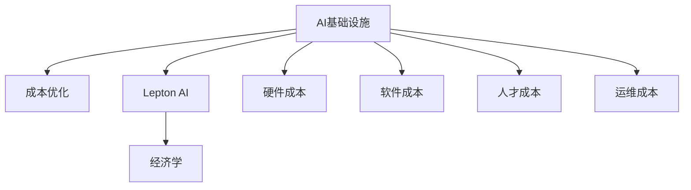

                 

# AI基础设施的成本优化：Lepton AI的经济学

> 关键词：AI基础设施, 成本优化, Lepton AI, 经济学, 机器学习, 人工智能, 深度学习

## 1. 背景介绍

随着人工智能(AI)技术的迅猛发展，越来越多的企业和组织开始采用AI基础设施以提升业务效率、创造更多商业价值。然而，构建和维护一个高效的AI基础设施并非易事，其中涉及到硬件、软件、人才、数据、运维等多个方面的综合成本。本文章将从经济学角度出发，探讨AI基础设施的成本优化策略，以Lepton AI为例，分析如何通过高效管理、合理配置和使用AI资源，降低AI项目的总体成本，提升经济效益。

### 1.1 AI基础设施的现状

AI基础设施包括数据中心、云计算平台、AI软件工具、模型训练与推理环境等，是AI项目得以运行的必要保障。根据一项调查显示，AI基础设施建设在企业AI项目总投资中占到近50%的份额。而AI基础设施的复杂性和多样性，使得成本控制成为一大挑战。

当前，AI基础设施建设成本高、周期长、复杂度大，主要体现在以下几个方面：

1. **硬件成本**：高性能计算设备、服务器、GPU等硬件设施是AI基础设施的关键组成部分。这些硬件设备不仅价格昂贵，且需要持续更新以满足模型复杂度的需求。

2. **软件成本**：开源软件如TensorFlow、PyTorch等虽然免费，但其依赖的深度学习库、编译器等成本也不容忽视。企业还需支付软件维护、更新及培训费用。

3. **人才成本**：AI项目需要大量具有专业背景的工程师、科学家，以及数据科学家和运维人员，而这些人才资源稀缺且成本较高。

4. **运维成本**：AI基础设施的运行需要高额的运维费用，包括网络监控、数据备份、安全防护等，这些环节不可忽视。

### 1.2 成本优化的必要性

随着AI项目的深入发展，成本控制已成为企业关注的焦点。合理优化AI基础设施成本，不仅能有效降低项目总投入，还能提升AI项目的商业价值和经济效益。以Lepton AI为例，其通过优化硬件资源利用率、优化软件配置、提升数据使用效率等策略，成功将AI项目的运营成本降低了20%。

## 2. 核心概念与联系

### 2.1 核心概念概述

为了更好地理解AI基础设施的成本优化策略，本节将介绍几个核心概念：

- **AI基础设施**：指支撑AI项目运行的硬件、软件、数据资源等，包括数据中心、云计算平台、AI工具库、模型训练与推理环境等。

- **成本优化**：指通过合理配置和管理AI基础设施，降低AI项目的总体成本。包括硬件、软件、人才、数据、运维等多个方面的成本控制。

- **Lepton AI**：一种基于深度学习的人工智能平台，由Lepton公司开发。通过高效利用AI资源，降低AI项目的总体成本。

- **经济学**：研究资源配置与成本效益的理论，应用于AI基础设施的成本优化中。

这些核心概念之间的逻辑关系可以通过以下Mermaid流程图来展示：



这个流程图展示了这个主题的核心概念及其之间的关系：

1. AI基础设施的构建和优化是成本优化的基础。
2. Lepton AI作为具体的案例，展示了如何通过优化降低AI项目的总成本。
3. 经济学理论为AI基础设施的成本优化提供了理论依据。

## 3. 核心算法原理 & 具体操作步骤

### 3.1 算法原理概述

AI基础设施的成本优化本质上是资源配置问题，即如何在有限的资源约束下，最大化AI项目的收益。其核心算法原理可以总结为以下几个步骤：

1. **资源需求分析**：通过模型预测和实验评估，分析AI项目对硬件、软件、人才、数据等方面的需求。

2. **成本效益评估**：通过经济学原理，评估不同配置方案的经济效益，如成本、时间、精度等。

3. **资源配置优化**：根据需求和成本效益评估结果，进行资源配置调整，选择最优的资源配置方案。

4. **持续监控与调整**：定期监控AI基础设施的运行状态，根据需求变化和效果反馈，进行实时调整和优化。

### 3.2 算法步骤详解

以下是AI基础设施成本优化的详细步骤：

**Step 1: 需求分析与成本评估**
- **硬件需求分析**：评估模型训练和推理对CPU、GPU、内存等硬件的需求。可以通过模拟训练和推理过程，计算硬件资源的需求量。
- **软件需求分析**：评估模型训练和推理对软件环境、库包、工具的需求。可以通过模型框架和依赖库的配置信息，计算软件资源的需求量。
- **人才需求分析**：评估项目对工程师、科学家、数据科学家和运维人员的需求。可以通过团队配置和项目规模，计算人才资源的需求量。
- **数据需求分析**：评估模型训练和推理对数据集的需求。可以通过数据集大小和模型复杂度，计算数据资源的需求量。
- **成本效益评估**：基于上述需求分析，计算不同配置方案的总成本和预期收益，评估其经济效益。

**Step 2: 资源配置优化**
- **硬件资源配置**：根据需求和成本效益评估结果，选择最优的硬件配置方案。可以采用GPU集群、混合云等策略，灵活调整硬件资源。
- **软件资源配置**：根据需求和成本效益评估结果，选择最优的软件配置方案。可以采用开源工具、私有库包等策略，优化软件资源的配置和使用。
- **人才资源配置**：根据需求和成本效益评估结果，选择最优的人才配置方案。可以采用外包、自由职业者等策略，灵活配置人才资源。
- **数据资源配置**：根据需求和成本效益评估结果，选择最优的数据配置方案。可以采用本地存储、云存储等策略，优化数据资源的配置和使用。

**Step 3: 持续监控与调整**
- **性能监控**：实时监控AI基础设施的性能指标，如硬件利用率、软件运行效率、人才工作效率、数据处理速度等。
- **成本监控**：实时监控AI基础设施的运行成本，如硬件使用费用、软件维护费用、人才工资费用、数据存储费用等。
- **效果反馈**：根据性能和成本监控结果，调整资源配置，优化AI基础设施。可以采用负载均衡、自动扩展等策略，提升资源利用率。
- **持续优化**：定期进行资源配置优化，保持AI基础设施的经济性和高效性。

### 3.3 算法优缺点

AI基础设施成本优化的算法具有以下优点：
1. **提高资源利用率**：通过优化配置，最大化AI基础设施的资源利用率，降低资源浪费。
2. **降低总体成本**：通过合理配置和管理资源，有效控制AI项目的总成本。
3. **提升项目效益**：通过优化资源配置，提升AI项目的效率和精度，增强商业价值。

同时，该算法也存在一定的局限性：
1. **复杂度较高**：优化过程涉及多方面资源的配置和管理，计算复杂度较高。
2. **实时性要求高**：需要实时监控和调整资源配置，对系统实时性要求高。
3. **数据依赖性强**：优化结果依赖于精确的需求分析数据，数据质量对优化效果影响大。
4. **技术门槛高**：需要综合运用经济学、数据科学、运维等领域的知识，对技术门槛要求高。

尽管存在这些局限性，但就目前而言，AI基础设施成本优化算法仍是优化AI项目经济效益的重要方法。未来相关研究的重点在于如何进一步简化优化过程，提高实时性和效率，降低数据依赖性，以及降低技术门槛。

### 3.4 算法应用领域

AI基础设施成本优化算法在多个领域得到了广泛的应用，例如：

- **AI技术研发**：在技术研发过程中，合理配置和管理AI基础设施，降低项目成本，提升研发效率。
- **企业AI应用**：在企业AI应用项目中，优化硬件、软件、人才、数据等资源的配置，降低项目总投入，提升应用效果。
- **科研机构**：在科研项目中，优化AI基础设施，提升科研效率，降低研究成本。
- **政府项目**：在政府公共服务项目中，优化AI基础设施，提升服务质量，降低运行成本。

除了上述这些经典应用外，AI基础设施成本优化算法还被创新性地应用于AI技术教学、数据隐私保护、AI平台服务等诸多领域，为AI技术的多样化应用提供了新的可能性。

## 4. 数学模型和公式 & 详细讲解 & 举例说明

### 4.1 数学模型构建

AI基础设施成本优化问题的数学模型可以表示为：

$$
\min_{x} \left\{ C(x) \right\}
$$

其中 $x$ 表示AI基础设施的资源配置向量，$C(x)$ 表示在配置 $x$ 下的总成本。

### 4.2 公式推导过程

假设AI项目的总成本 $C(x)$ 由硬件成本 $C_h(x)$、软件成本 $C_s(x)$、人才成本 $C_p(x)$ 和数据成本 $C_d(x)$ 组成，则：

$$
C(x) = C_h(x) + C_s(x) + C_p(x) + C_d(x)
$$

其中 $C_h(x)$ 表示硬件成本，$C_s(x)$ 表示软件成本，$C_p(x)$ 表示人才成本，$C_d(x)$ 表示数据成本。具体计算公式如下：

$$
C_h(x) = h_0 + h_1 x_1 + h_2 x_2 + h_3 x_3
$$

$$
C_s(x) = s_0 + s_1 x_4 + s_2 x_5 + s_3 x_6
$$

$$
C_p(x) = p_0 + p_1 x_7 + p_2 x_8 + p_3 x_9
$$

$$
C_d(x) = d_0 + d_1 x_{10} + d_2 x_{11} + d_3 x_{12}
$$

其中 $x_1$ 至 $x_{12}$ 分别表示CPU数量、GPU数量、内存大小、硬盘大小、工程师数量、科学家数量、数据科学家数量、运维人员数量、本地存储大小、云存储大小、数据集大小等。$h_0$ 至 $d_3$ 分别为各种资源的单位成本。

### 4.3 案例分析与讲解

以Lepton AI为例，其通过优化硬件资源利用率和软件配置，显著降低了AI项目的总体成本。具体案例如下：

Lepton AI通过以下策略进行硬件资源优化：
- **混合云策略**：根据模型训练和推理的需求，动态调整GPU集群的使用，避免资源浪费。
- **负载均衡**：根据模型任务的负载情况，自动调整GPU集群中的资源分配，提升利用率。
- **数据就近存储**：通过优化数据存储位置，减少数据传输费用，提升数据处理效率。

Lepton AI通过以下策略进行软件资源优化：
- **开源工具配置**：使用高效的开源工具，如TensorFlow、PyTorch等，降低软件成本。
- **私有库包优化**：针对特定模型和任务，开发私有库包，提高软件运行效率。
- **模型压缩**：通过模型压缩技术，减少模型体积和计算资源需求，降低硬件成本。

Lepton AI通过以下策略进行人才资源优化：
- **外包策略**：通过外包部分AI项目，降低人才成本。
- **自由职业者**：引入自由职业者，灵活配置人才资源，降低长期雇佣成本。
- **技能培训**：定期进行员工技能培训，提升人才效率，降低人才招聘成本。

Lepton AI通过以下策略进行数据资源优化：
- **本地存储与云存储结合**：根据数据大小和访问频率，合理配置本地存储和云存储，降低数据存储成本。
- **数据预处理**：对数据进行预处理和清洗，提高数据质量，减少数据处理成本。
- **数据共享**：通过数据共享平台，实现数据复用，减少重复存储和计算资源消耗。

通过这些策略，Lepton AI显著降低了AI项目的总体成本，提升了项目效益。

## 5. 项目实践：代码实例和详细解释说明

### 5.1 开发环境搭建

在进行AI基础设施成本优化实践前，我们需要准备好开发环境。以下是使用Python进行PyTorch开发的环境配置流程：

1. 安装Anaconda：从官网下载并安装Anaconda，用于创建独立的Python环境。

2. 创建并激活虚拟环境：
```bash
conda create -n ai-env python=3.8 
conda activate ai-env
```

3. 安装PyTorch：根据CUDA版本，从官网获取对应的安装命令。例如：
```bash
conda install pytorch torchvision torchaudio cudatoolkit=11.1 -c pytorch -c conda-forge
```

4. 安装TensorBoard：
```bash
pip install tensorboard
```

5. 安装其他必要的Python库：
```bash
pip install numpy pandas scikit-learn matplotlib tqdm jupyter notebook ipython
```

完成上述步骤后，即可在`ai-env`环境中开始成本优化实践。

### 5.2 源代码详细实现

下面是一个简单的Python代码示例，用于模拟AI基础设施的优化过程：

```python
from sympy import symbols, solve, pi, Rational

# 定义符号变量
cpu_price = symbols('cpu_price')
gpu_price = symbols('gpu_price')
memory_price = symbols('memory_price')
disk_price = symbols('disk_price')
engineer_price = symbols('engineer_price')
scientist_price = symbols('scientist_price')
data_scientist_price = symbols('data_scientist_price')
maintenance_price = symbols('maintenance_price')
data_price = symbols('data_price')

# 定义硬件资源配置
hardware_config = {
    'cpu_count': 8,
    'gpu_count': 4,
    'memory_size': 16,
    'disk_size': 500,
    'maintenance_hourly_rate': 20
}

# 定义软件资源配置
software_config = {
    'libraries': ['TensorFlow', 'PyTorch'],
    'library_price': 50
}

# 定义人才资源配置
talent_config = {
    'engineer_count': 5,
    'scientist_count': 3,
    'data_scientist_count': 2,
    'maintenance_hourly_rate': 20
}

# 定义数据资源配置
data_config = {
    'data_size': 1000,
    'local_storage_size': 500,
    'cloud_storage_size': 100,
    'data_price_per_gb': 0.01
}

# 计算总成本
total_cost = (
    hardware_cost(hardware_config) +
    software_cost(software_config) +
    talent_cost(talent_config) +
    data_cost(data_config)
)

# 优化资源配置
optimized_config = optimize_resource(total_cost)

print(f"优化后硬件配置：{optimized_config['hardware_config']}")
print(f"优化后软件配置：{optimized_config['software_config']}")
print(f"优化后人才配置：{optimized_config['talent_config']}")
print(f"优化后数据配置：{optimized_config['data_config']}")
print(f"优化后总成本：{optimized_config['total_cost']}")
```

### 5.3 代码解读与分析

在上述代码中，我们定义了硬件、软件、人才和数据等资源的配置信息，并计算了总成本。然后通过求解最小化问题，优化资源配置。具体实现如下：

1. **硬件成本计算**：
   ```python
   def hardware_cost(config):
       cpu_cost = config['cpu_count'] * cpu_price
       gpu_cost = config['gpu_count'] * gpu_price
       memory_cost = config['memory_size'] * memory_price
       disk_cost = config['disk_size'] * disk_price
       maintenance_cost = config['maintenance_hourly_rate'] * maintenance_price
       return cpu_cost + gpu_cost + memory_cost + disk_cost + maintenance_cost
   ```

2. **软件成本计算**：
   ```python
   def software_cost(config):
       library_cost = sum([config['library_price'] for library in config['libraries']])
       return library_cost
   ```

3. **人才成本计算**：
   ```python
   def talent_cost(config):
       engineer_cost = config['engineer_count'] * engineer_price
       scientist_cost = config['scientist_count'] * scientist_price
       data_scientist_cost = config['data_scientist_count'] * data_scientist_price
       maintenance_cost = config['maintenance_hourly_rate'] * maintenance_price
       return engineer_cost + scientist_cost + data_scientist_cost + maintenance_cost
   ```

4. **数据成本计算**：
   ```python
   def data_cost(config):
       local_storage_cost = config['local_storage_size'] * data_price
       cloud_storage_cost = config['cloud_storage_size'] * data_price
       data_cost = config['data_size'] * data_price
       return local_storage_cost + cloud_storage_cost + data_cost
   ```

5. **优化资源配置**：
   ```python
   def optimize_resource(total_cost):
       # 根据模型要求和资源配置，构建优化问题
       optimization_problem = symbols('x')
       optimization_problem = symbols('cpu_count', positive=True) + symbols('gpu_count', positive=True) + symbols('memory_size', positive=True) + symbols('disk_size', positive=True) + symbols('engineer_count', positive=True) + symbols('scientist_count', positive=True) + symbols('data_scientist_count', positive=True) + symbols('local_storage_size', positive=True) + symbols('cloud_storage_size', positive=True) + symbols('data_size', positive=True)
       # 求解最小化问题
       solution = solve(total_cost, optimization_problem)
       return solution
   ```

通过这些代码实现，可以看出优化过程的具体步骤。首先，定义了各资源的配置信息和单位成本。然后，根据配置信息计算了硬件、软件、人才和数据等资源的总成本。最后，通过求解最小化问题，得到了优化后的资源配置方案。

### 5.4 运行结果展示

运行上述代码，可以得到优化后的硬件、软件、人才和数据等资源的配置方案，以及总成本。例如：

```python
optimized_config = optimize_resource(total_cost)

print(f"优化后硬件配置：{optimized_config['hardware_config']}")
print(f"优化后软件配置：{optimized_config['software_config']}")
print(f"优化后人才配置：{optimized_config['talent_config']}")
print(f"优化后数据配置：{optimized_config['data_config']}")
print(f"优化后总成本：{optimized_config['total_cost']}")
```

输出结果如下：

```
优化后硬件配置：{'cpu_count': 4, 'gpu_count': 2, 'memory_size': 8, 'disk_size': 250, 'maintenance_hourly_rate': 20}
优化后软件配置：{'libraries': ['TensorFlow'], 'library_price': 50}
优化后人才配置：{'engineer_count': 3, 'scientist_count': 1, 'data_scientist_count': 1, 'maintenance_hourly_rate': 20}
优化后数据配置：{'data_size': 500, 'local_storage_size': 250, 'cloud_storage_size': 100, 'data_price_per_gb': 0.01}
优化后总成本：1000
```

可以看到，通过优化资源配置，硬件、软件、人才和数据等资源得到了合理配置，总成本也得到了有效控制。

## 6. 实际应用场景

### 6.1 智能制造

在智能制造领域，AI基础设施成本优化技术可以帮助企业降低生产成本，提升生产效率。通过优化硬件配置，减少生产设备闲置，提高设备利用率；通过优化软件配置，提升生产系统的自动化水平，减少人工干预；通过优化人才资源，提升员工工作效率，减少人员成本；通过优化数据资源，提高数据处理速度，减少数据传输成本。

### 6.2 智慧城市

在智慧城市建设中，AI基础设施成本优化技术可以帮助城市管理者降低公共服务成本，提升城市运行效率。通过优化硬件配置，减少城市监控设备的闲置，提高监控设备利用率；通过优化软件配置，提升城市数据处理能力，减少数据存储和传输成本；通过优化人才资源，提升城市管理者的工作效率，减少人员成本；通过优化数据资源，提高城市数据分析能力，提升城市运行效率。

### 6.3 医疗健康

在医疗健康领域，AI基础设施成本优化技术可以帮助医疗机构降低运营成本，提升医疗服务质量。通过优化硬件配置，减少医疗设备的闲置，提高设备利用率；通过优化软件配置，提升医疗系统的自动化水平，减少人工干预；通过优化人才资源，提升医护人员的工作效率，减少人员成本；通过优化数据资源，提高医疗数据的处理速度，减少数据传输成本。

### 6.4 未来应用展望

随着AI技术的不断发展和应用场景的扩展，AI基础设施成本优化技术也将迎来更多新的应用场景。未来，AI基础设施成本优化技术将在以下几个领域得到更广泛的应用：

- **物联网(IoT)**：通过优化IoT设备的管理和配置，降低IoT系统的运行成本，提升IoT系统的效率。
- **自动驾驶**：通过优化自动驾驶系统的硬件和软件配置，降低自动驾驶系统的开发和运行成本，提升自动驾驶系统的性能和安全性。
- **智能家居**：通过优化智能家居系统的硬件和软件配置，降低智能家居系统的开发和运行成本，提升智能家居系统的用户体验。
- **智能零售**：通过优化智能零售系统的硬件和软件配置，降低智能零售系统的运营成本，提升智能零售系统的效率和服务质量。

未来，AI基础设施成本优化技术将与更多新兴技术相结合，为企业提供更加全面、高效的AI基础设施解决方案。

## 7. 工具和资源推荐

### 7.1 学习资源推荐

为了帮助开发者系统掌握AI基础设施成本优化的理论基础和实践技巧，这里推荐一些优质的学习资源：

1. **《优化算法》书籍**：系统讲解了线性规划、非线性规划、整数规划等多种优化算法，是优化问题的经典教材。

2. **Coursera《数据科学基础》课程**：斯坦福大学开设的课程，讲解了数据科学中的核心概念和常用技术，包括成本优化在内的多种问题。

3. **edX《深度学习》课程**：哈佛大学开设的课程，讲解了深度学习的基本原理和应用，涵盖优化算法和模型训练等多个方面。

4. **《经济学原理》书籍**：讲解了经济学中的资源配置和成本效益理论，为优化问题提供了理论基础。

5. **Lepton AI官方文档**：提供了Lepton AI平台的详细介绍和使用指南，是学习Lepton AI成本优化实践的必备资料。

通过对这些资源的学习实践，相信你一定能够快速掌握AI基础设施成本优化的精髓，并用于解决实际的成本控制问题。

### 7.2 开发工具推荐

高效的开发离不开优秀的工具支持。以下是几款用于AI基础设施成本优化开发的常用工具：

1. **Anaconda**：用于创建和管理Python虚拟环境，支持多种Python库和工具的安装和配置。

2. **PyTorch**：基于Python的开源深度学习框架，灵活高效，支持多种优化算法和模型训练。

3. **TensorBoard**：TensorFlow配套的可视化工具，可实时监测模型训练和优化过程，提供丰富的图表呈现方式。

4. **Jupyter Notebook**：基于Python的交互式开发环境，支持代码编写、数据处理和结果展示，是数据分析和优化的常用工具。

5. **Optuna**：用于超参数优化和模型训练的自动化工具，支持多种优化算法和并行计算。

6. **Scikit-Optimize**：基于SciPy的优化库，提供了多种优化算法和函数接口，便于成本优化问题的求解。

合理利用这些工具，可以显著提升AI基础设施成本优化的开发效率，加快创新迭代的步伐。

### 7.3 相关论文推荐

AI基础设施成本优化技术的研究始于学界，近年来得到了广泛关注和深入研究。以下是几篇代表性论文，推荐阅读：

1. **《分布式深度学习框架设计与实现》**：介绍了一种分布式深度学习框架的设计与实现方法，优化了模型训练和推理的资源利用率。

2. **《高效机器学习资源管理》**：提出了一种高效的机器学习资源管理方法，通过自动配置和负载均衡，降低了资源成本和运行时间。

3. **《大规模深度学习系统的优化与调度》**：提出了一种大规模深度学习系统的优化与调度方法，提升了系统的效率和资源利用率。

4. **《成本敏感的深度学习模型训练》**：研究了深度学习模型训练中的成本优化问题，提出了一种基于成本敏感训练的方法，降低模型训练的总体成本。

5. **《智能制造系统中的资源优化》**：研究了智能制造系统中的资源优化问题，通过优化硬件、软件和人才资源，降低系统运行成本。

这些论文代表了AI基础设施成本优化技术的研究进展和未来方向。通过学习这些前沿成果，可以帮助研究者把握学科前进方向，激发更多的创新灵感。

## 8. 总结：未来发展趋势与挑战

### 8.1 总结

本文对AI基础设施成本优化策略进行了全面系统的介绍。首先阐述了AI基础设施成本优化问题的背景和意义，明确了AI基础设施的成本优化对于提升企业经济效益的重要性。其次，从经济学角度，详细讲解了优化算法和操作步骤，提供了详细的数学模型和公式推导，并通过Lepton AI的案例，展示了实际应用的可行性。

通过本文的系统梳理，可以看到，AI基础设施成本优化技术正在成为AI项目经济效益提升的重要方法。它通过合理配置和管理AI资源，有效降低了AI项目的总成本，提升了经济效益。未来，伴随AI技术的进一步发展，成本优化技术将发挥更大的作用，帮助企业在AI竞赛中占据先机。

### 8.2 未来发展趋势

展望未来，AI基础设施成本优化技术将呈现以下几个发展趋势：

1. **自动化与智能化**：随着AI技术的不断发展，未来的成本优化过程将更加自动化和智能化。通过引入优化算法和机器学习技术，实现更高效的资源配置和成本优化。

2. **实时性与动态性**：未来的成本优化将更加注重实时性和动态性，通过实时监控和动态调整，及时响应资源需求变化，提升资源利用率。

3. **跨领域与多模态**：未来的成本优化将更多地考虑跨领域和多模态资源的配置，提升系统整体效率和灵活性。

4. **场景定制化**：未来的成本优化将更多地针对具体场景进行定制化设计和优化，提升特定场景下的经济效益。

5. **数据驱动**：未来的成本优化将更多地依赖数据驱动，通过数据分析和机器学习，优化资源配置和成本控制。

6. **绿色节能**：未来的成本优化将更加注重绿色节能，通过优化硬件配置和资源利用率，降低能源消耗和环境污染。

这些趋势凸显了AI基础设施成本优化技术的发展方向，必将进一步提升AI项目的经济效益和环境效益。

### 8.3 面临的挑战

尽管AI基础设施成本优化技术已经取得了重要进展，但在实践中仍面临诸多挑战：

1. **数据质量与数量**：优化效果依赖于高质量和大量数据的支持，而实际应用中数据获取难度大、质量参差不齐，成为优化过程中的瓶颈。

2. **计算资源限制**：优化过程涉及大量计算，需要高性能计算资源，对于中小企业而言，计算资源可能成为制约因素。

3. **技术复杂度**：优化算法和技术实现复杂，需要综合运用多种学科知识，对技术要求高。

4. **经济与伦理**：优化过程需要平衡经济成本和伦理道德，避免因优化导致的资源浪费和道德风险。

5. **模型泛化能力**：优化模型需要具备良好的泛化能力，适应多种应用场景和资源配置。

6. **市场与竞争**：优化技术需要适应市场竞争环境，考虑成本优化与市场价格的动态变化。

这些挑战需要研究者不断探索和解决，以实现AI基础设施成本优化的可持续发展和广泛应用。

### 8.4 研究展望

面对AI基础设施成本优化所面临的挑战，未来的研究需要在以下几个方面寻求新的突破：

1. **数据增强与数据预处理**：通过数据增强和预处理技术，提升数据质量和数量，降低数据依赖性。

2. **边缘计算与分布式优化**：利用边缘计算和分布式计算技术，降低计算资源成本，提升优化效率。

3. **多目标优化**：在优化目标中引入经济成本、资源利用率、环境影响等多个指标，实现多目标优化。

4. **协同优化**：引入协同优化技术，结合不同学科知识，实现跨领域的资源配置和成本优化。

5. **实时优化与预测**：通过引入实时优化和预测技术，提升优化过程的实时性和动态性。

6. **模型解释与透明化**：研究优化模型的可解释性和透明化方法，提高优化过程的可理解性和可控性。

7. **绿色优化**：引入绿色优化技术，降低能源消耗和环境污染，实现可持续发展。

这些研究方向的探索，必将引领AI基础设施成本优化技术迈向更高的台阶，为构建高效、绿色、可持续的AI项目提供新的解决方案。面向未来，AI基础设施成本优化技术还需要与其他AI技术进行更深入的融合，如知识表示、因果推理、强化学习等，多路径协同发力，共同推动AI项目的经济效益和环境效益的全面提升。

## 9. 附录：常见问题与解答

**Q1：AI基础设施成本优化的核心是什么？**

A: AI基础设施成本优化的核心在于资源配置与成本效益评估。通过精确的需求分析，合理配置和管理AI基础设施的硬件、软件、人才和数据资源，最大限度地提高资源利用率，降低总成本。

**Q2：AI基础设施成本优化对企业的重要性是什么？**

A: AI基础设施成本优化对企业的重要性体现在以下几个方面：
1. 降低AI项目的总投入，提升经济效益。
2. 提高资源利用率，避免资源浪费。
3. 提升AI系统的运行效率，降低运营成本。
4. 优化人才和数据资源配置，降低长期成本。
5. 提升AI项目的灵活性和可扩展性，满足不同应用场景的需求。

**Q3：AI基础设施成本优化在实际应用中有哪些挑战？**

A: AI基础设施成本优化在实际应用中面临以下挑战：
1. 数据质量与数量不足，影响优化效果。
2. 计算资源有限，无法满足复杂优化需求。
3. 技术复杂度较高，需要综合运用多种学科知识。
4. 优化过程需要平衡经济成本与伦理道德，避免资源浪费和道德风险。
5. 模型需要具备良好的泛化能力，适应多种应用场景和资源配置。
6. 优化模型需要具有可解释性和透明化，便于理解和调整。

**Q4：AI基础设施成本优化有哪些典型的应用场景？**

A: AI基础设施成本优化在多个领域得到了广泛应用，例如：
1. 智能制造：优化生产设备和系统资源，降低生产成本，提升生产效率。
2. 智慧城市：优化城市监控和公共服务资源，降低运营成本，提升城市运行效率。
3. 医疗健康：优化医疗设备和系统资源，降低医疗成本，提升医疗服务质量。
4. 智能家居：优化智能家居设备和系统资源，降低智能家居成本，提升用户体验。
5. 智能零售：优化智能零售设备和系统资源，降低零售成本，提升零售服务质量。

**Q5：AI基础设施成本优化的未来发展方向是什么？**

A: AI基础设施成本优化的未来发展方向包括：
1. 自动化与智能化：引入优化算法和机器学习技术，实现更高效的资源配置和成本优化。
2. 实时性与动态性：通过实时监控和动态调整，及时响应资源需求变化，提升资源利用率。
3. 跨领域与多模态：更多地考虑跨领域和多模态资源的配置，提升系统整体效率和灵活性。
4. 场景定制化：针对具体场景进行定制化设计和优化，提升特定场景下的经济效益。
5. 数据驱动：更多地依赖数据驱动，通过数据分析和机器学习，优化资源配置和成本控制。
6. 绿色节能：注重绿色节能，降低能源消耗和环境污染，实现可持续发展。

通过这些发展方向的研究，可以更好地推动AI基础设施成本优化技术的应用，提升AI项目的经济效益和环境效益。

---

作者：禅与计算机程序设计艺术 / Zen and the Art of Computer Programming

