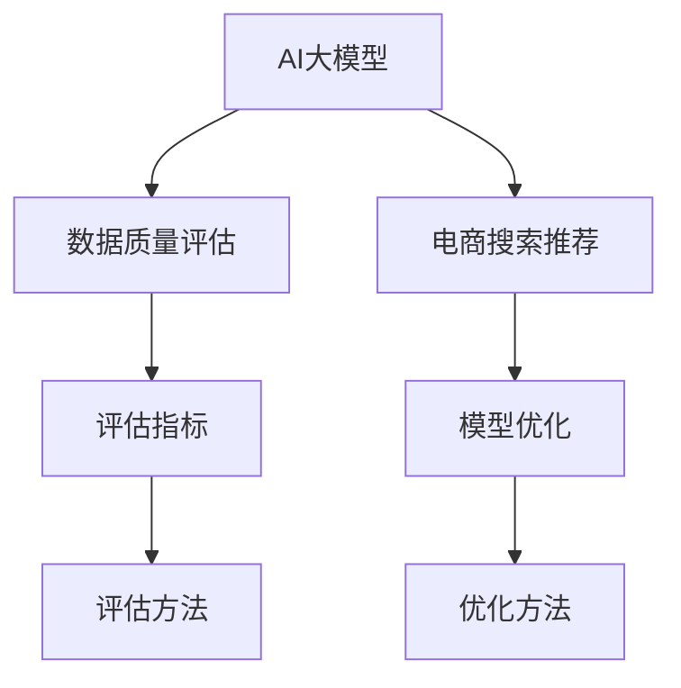

                 

# AI大模型助力电商搜索推荐业务的数据质量评估模型优化策略

> 关键词：数据质量评估，AI大模型，电商搜索推荐，模型优化，指标体系

## 1. 背景介绍

### 1.1 问题由来

在现代电商行业，搜索推荐系统的表现直接关系到用户体验和商家利益，因此数据的质量评估及其模型优化至关重要。传统的电商平台，通常采用简单的统计指标（如点击率、转化率等）来衡量推荐系统的效果，但这些指标往往忽略了用户的多样性、商品的多样性和场景的多样性。随着人工智能和大数据技术的普及，电商企业开始尝试使用AI大模型进行推荐，但这同时也带来了新的挑战：如何对训练数据进行高质量的评估和优化。

### 1.2 问题核心关键点

在电商搜索推荐系统中，数据质量评估模型的目标是通过对海量数据进行筛选和清洗，确保数据的准确性、完整性和代表性，从而提升AI大模型的预测性能和用户体验。具体来说，关键问题包括：

- 如何构建一个高效的数据质量评估体系，包括定义一系列关键指标，并对不同维度的数据进行综合评估。
- 如何利用AI大模型对数据质量进行自动化评估和优化，确保训练数据的可信度和有效性。
- 如何结合电商业务特点，对评估结果进行科学解读和应用，指导实际运营决策。

### 1.3 问题研究意义

数据质量评估模型在电商搜索推荐系统中的重要性体现在以下几个方面：

1. 提升推荐系统性能：通过高质量的数据输入，可以显著提升AI大模型的预测准确性和推荐效果，从而提高用户满意度和转化率。
2. 优化运营决策：对数据质量进行科学评估，有助于发现和纠正数据中的问题，优化运营策略，提升业务收益。
3. 提高用户体验：通过精准推荐，满足用户个性化需求，增强用户的粘性和忠诚度。
4. 促进数据驱动决策：数据质量评估模型帮助企业从数据中发现洞察，支持数据驱动的业务决策，提高决策的科学性和效率。

## 2. 核心概念与联系

### 2.1 核心概念概述

为更好地理解数据质量评估模型在电商搜索推荐系统中的应用，本节将介绍几个密切相关的核心概念：

- **AI大模型**：如BERT、GPT、XLNet等，是指在大型语料库上预训练的深度学习模型，具备强大的自然语言理解和生成能力，可以应用于搜索推荐等NLP任务。
- **数据质量评估**：指对数据集进行多维度评估，包括数据完整性、准确性、一致性、时效性等，确保数据的可信度和有效性。
- **电商搜索推荐**：指利用AI大模型对用户查询和行为进行理解和分析，从商品库中筛选出最符合用户需求的推荐结果，提升用户体验和业务收益。
- **模型优化**：指通过调整模型结构、改进训练方法等手段，提升AI大模型的预测性能和泛化能力。

这些核心概念之间的逻辑关系可以通过以下Mermaid流程图来展示：



这个流程图展示了大模型在电商搜索推荐系统中的核心概念及其之间的关系：

1. 电商搜索推荐系统依赖于AI大模型的预测能力，但高质量的数据输入是前提。
2. 数据质量评估模型对数据进行全面评估，确保数据质量。
3. 数据质量评估结果作为优化输入，指导模型优化方法，提升模型性能。
4. 电商搜索推荐系统基于优化后的模型进行推荐，提升用户体验。

## 3. 核心算法原理 & 具体操作步骤
### 3.1 算法原理概述

数据质量评估模型的原理是基于对数据集的多个维度进行综合评估，确保数据的准确性、完整性和代表性，从而提升AI大模型的预测性能和推荐效果。其核心思想是：

1. **全面评估数据质量**：定义一系列关键指标，如数据完整性、准确性、一致性、时效性等，对数据集进行全面评估。
2. **自动化评估和优化**：利用AI大模型对数据质量进行自动化评估，利用机器学习技术自动发现和纠正数据中的问题。
3. **科学解读和应用**：结合电商业务特点，对评估结果进行科学解读，指导运营策略优化，提升业务收益。

### 3.2 算法步骤详解

数据质量评估模型的一般流程包括以下几个关键步骤：

**Step 1: 数据准备**
- 收集电商平台的各类数据，包括用户行为数据、商品信息数据、市场数据等。
- 对数据进行初步清洗和整合，去除重复和错误数据。

**Step 2: 评估指标定义**
- 根据电商业务特点，定义数据质量评估的关键指标，如数据完整性、准确性、一致性、时效性等。
- 设计量化评估指标的计算公式和阈值。

**Step 3: 自动化评估**
- 利用AI大模型对数据质量进行自动化评估，通过模型训练得到指标量化结果。
- 对指标结果进行统计分析，发现数据中的问题点和异常值。

**Step 4: 数据优化**
- 根据评估结果，对数据集进行清洗和修正，确保数据质量。
- 设计数据优化方案，如数据补全、异常值处理、数据归一化等。

**Step 5: 模型优化**
- 基于优化后的数据集，重新训练AI大模型，提升模型性能。
- 对模型进行评估和验证，确保优化效果。

### 3.3 算法优缺点

数据质量评估模型的优点包括：

- 全面评估数据质量：通过多个维度的指标，全面评估数据集，确保数据的准确性和完整性。
- 自动化评估和优化：利用AI大模型进行自动化评估，提高效率和准确性。
- 科学解读和应用：结合电商业务特点，科学解读评估结果，指导运营决策。

其缺点包括：

- 数据处理复杂：需要设计多种评估指标，处理复杂的数据集，工作量大。
- 模型训练成本高：需要大量标注数据和计算资源进行模型训练。
- 过度依赖模型：模型评估结果的准确性受限于模型训练数据和模型结构。

### 3.4 算法应用领域

数据质量评估模型在电商搜索推荐系统中的应用主要包括以下几个方面：

- **商品推荐系统**：对用户行为数据和商品信息数据进行质量评估，提升商品推荐的准确性和个性化。
- **价格优化系统**：对市场数据和用户反馈数据进行质量评估，优化商品价格策略。
- **库存管理系统**：对历史销售数据进行质量评估，优化库存管理和补货策略。
- **用户画像系统**：对用户行为数据进行质量评估，构建更准确的用户画像，提升推荐效果。

除了上述这些具体应用外，数据质量评估模型还可以应用于更多的电商场景，如广告投放、客户服务、营销分析等，帮助企业从数据中挖掘更多价值，提升运营效率。

## 4. 数学模型和公式 & 详细讲解 & 举例说明
### 4.1 数学模型构建

数据质量评估模型主要涉及对数据集进行多维度评估，包括完整性、准确性、一致性和时效性等。以下是一些常用的评估指标及其量化公式：

- **数据完整性（Completeness）**：
  - 定义：指数据集中包含所需信息的程度。
  - 量化公式：$C = \frac{N_{total}}{N_{expected}}$，其中 $N_{total}$ 为实际数据量，$N_{expected}$ 为预期数据量。

- **数据准确性（Accuracy）**：
  - 定义：指数据集中正确的信息占比。
  - 量化公式：$A = \frac{N_{correct}}{N_{total}}$，其中 $N_{correct}$ 为正确数据量，$N_{total}$ 为总数据量。

- **数据一致性（Consistency）**：
  - 定义：指数据集中各项信息的一致性程度。
  - 量化公式：$C = \frac{N_{consistent}}{N_{total}}$，其中 $N_{consistent}$ 为一致性数据量，$N_{total}$ 为总数据量。

- **数据时效性（Timeliness）**：
  - 定义：指数据集的更新频率和更新质量。
  - 量化公式：$T = \frac{N_{up_to_date}}{N_{total}}$，其中 $N_{up_to_date}$ 为时效性数据量，$N_{total}$ 为总数据量。

### 4.2 公式推导过程

以数据完整性指标为例，其量化公式为 $C = \frac{N_{total}}{N_{expected}}$。具体推导如下：

设数据集 $D$ 中实际数据量 $N_{actual}$，预期数据量 $N_{expected}$，则数据完整性 $C$ 的计算公式为：

$$
C = \frac{N_{actual}}{N_{expected}}
$$

上式可以进一步扩展为：

$$
C = \frac{N_{total}}{N_{expected}}
$$

其中 $N_{total}$ 为实际数据量加上缺失的数据量。

### 4.3 案例分析与讲解

以电商平台的用户行为数据为例，假设平台有 100 万活跃用户，预期每年至少收集 200 万条用户行为数据。但由于数据采集、存储和处理过程中存在问题，实际只收集到 180 万条数据。通过数据完整性指标，可以计算出数据的完整性为：

$$
C = \frac{180}{200} = 0.9
$$

这表明，平台数据的完整性较好，但仍有 10% 的数据缺失。根据这个指标，可以指导平台优化数据采集和存储策略，提升数据完整性。

## 5. 项目实践：代码实例和详细解释说明
### 5.1 开发环境搭建

在进行数据质量评估模型开发前，我们需要准备好开发环境。以下是使用Python进行PyTorch开发的环境配置流程：

1. 安装Anaconda：从官网下载并安装Anaconda，用于创建独立的Python环境。

2. 创建并激活虚拟环境：
```bash
conda create -n pytorch-env python=3.8 
conda activate pytorch-env
```

3. 安装PyTorch：根据CUDA版本，从官网获取对应的安装命令。例如：
```bash
conda install pytorch torchvision torchaudio cudatoolkit=11.1 -c pytorch -c conda-forge
```

4. 安装Transformers库：
```bash
pip install transformers
```

5. 安装各类工具包：
```bash
pip install numpy pandas scikit-learn matplotlib tqdm jupyter notebook ipython
```

完成上述步骤后，即可在`pytorch-env`环境中开始模型开发。

### 5.2 源代码详细实现

下面以商品推荐系统为例，给出使用Transformers库对数据质量评估模型的PyTorch代码实现。

首先，定义数据质量评估模型：

```python
from transformers import BertTokenizer
from torch.utils.data import Dataset, DataLoader
from transformers import BertForSequenceClassification
import torch
from sklearn.metrics import precision_recall_fscore_support

class DataQualityEvaluator(Dataset):
    def __init__(self, texts, labels, tokenizer, max_len=128):
        self.texts = texts
        self.labels = labels
        self.tokenizer = tokenizer
        self.max_len = max_len
        
    def __len__(self):
        return len(self.texts)
    
    def __getitem__(self, item):
        text = self.texts[item]
        label = self.labels[item]
        
        encoding = self.tokenizer(text, return_tensors='pt', max_length=self.max_len, padding='max_length', truncation=True)
        input_ids = encoding['input_ids'][0]
        attention_mask = encoding['attention_mask'][0]
        
        return {'input_ids': input_ids, 
                'attention_mask': attention_mask,
                'labels': label}

# 标签与id的映射
label2id = {'low_quality': 0, 'high_quality': 1}
id2label = {v: k for k, v in label2id.items()}

# 创建dataset
tokenizer = BertTokenizer.from_pretrained('bert-base-cased')

train_dataset = DataQualityEvaluator(train_texts, train_labels, tokenizer)
dev_dataset = DataQualityEvaluator(dev_texts, dev_labels, tokenizer)
test_dataset = DataQualityEvaluator(test_texts, test_labels, tokenizer)
```

然后，定义模型和优化器：

```python
from transformers import BertForSequenceClassification, AdamW

model = BertForSequenceClassification.from_pretrained('bert-base-cased', num_labels=2)

optimizer = AdamW(model.parameters(), lr=2e-5)
```

接着，定义训练和评估函数：

```python
from tqdm import tqdm
from sklearn.metrics import precision_recall_fscore_support

device = torch.device('cuda') if torch.cuda.is_available() else torch.device('cpu')
model.to(device)

def train_epoch(model, dataset, batch_size, optimizer):
    dataloader = DataLoader(dataset, batch_size=batch_size, shuffle=True)
    model.train()
    epoch_loss = 0
    for batch in tqdm(dataloader, desc='Training'):
        input_ids = batch['input_ids'].to(device)
        attention_mask = batch['attention_mask'].to(device)
        labels = batch['labels'].to(device)
        model.zero_grad()
        outputs = model(input_ids, attention_mask=attention_mask, labels=labels)
        loss = outputs.loss
        epoch_loss += loss.item()
        loss.backward()
        optimizer.step()
    return epoch_loss / len(dataloader)

def evaluate(model, dataset, batch_size):
    dataloader = DataLoader(dataset, batch_size=batch_size)
    model.eval()
    preds, labels = [], []
    with torch.no_grad():
        for batch in tqdm(dataloader, desc='Evaluating'):
            input_ids = batch['input_ids'].to(device)
            attention_mask = batch['attention_mask'].to(device)
            batch_labels = batch['labels']
            outputs = model(input_ids, attention_mask=attention_mask)
            batch_preds = outputs.logits.argmax(dim=2).to('cpu').tolist()
            batch_labels = batch_labels.to('cpu').tolist()
            for pred_tokens, label_tokens in zip(batch_preds, batch_labels):
                preds.append(pred_tokens[:len(label_tokens)])
                labels.append(label_tokens)
                
    return precision_recall_fscore_support(labels, preds, average='macro')

# 训练过程
epochs = 5
batch_size = 16

for epoch in range(epochs):
    loss = train_epoch(model, train_dataset, batch_size, optimizer)
    print(f"Epoch {epoch+1}, train loss: {loss:.3f}")
    
    print(f"Epoch {epoch+1}, dev results:")
    metrics = evaluate(model, dev_dataset, batch_size)
    print(f"Precision: {metrics[0]:.4f}, Recall: {metrics[1]:.4f}, F1-score: {metrics[2]:.4f}")

print("Test results:")
metrics = evaluate(model, test_dataset, batch_size)
print(f"Precision: {metrics[0]:.4f}, Recall: {metrics[1]:.4f}, F1-score: {metrics[2]:.4f}")
```

以上就是使用PyTorch对数据质量评估模型进行训练的完整代码实现。可以看到，利用Transformers库，可以方便地将Bert模型封装成数据质量评估模型，进行训练和评估。

### 5.3 代码解读与分析

让我们再详细解读一下关键代码的实现细节：

**DataQualityEvaluator类**：
- `__init__`方法：初始化数据、标签、分词器等关键组件。
- `__len__`方法：返回数据集的样本数量。
- `__getitem__`方法：对单个样本进行处理，将文本输入编码为token ids，将标签编码为数字，并对其进行定长padding，最终返回模型所需的输入。

**label2id和id2label字典**：
- 定义了标签与数字id之间的映射关系，用于将模型预测结果解码回真实的标签。

**训练和评估函数**：
- 使用PyTorch的DataLoader对数据集进行批次化加载，供模型训练和推理使用。
- 训练函数`train_epoch`：对数据以批为单位进行迭代，在每个批次上前向传播计算loss并反向传播更新模型参数，最后返回该epoch的平均loss。
- 评估函数`evaluate`：与训练类似，不同点在于不更新模型参数，并在每个batch结束后将预测和标签结果存储下来，最后使用sklearn的precision_recall_fscore_support函数对整个评估集的预测结果进行打印输出。

**训练流程**：
- 定义总的epoch数和batch size，开始循环迭代
- 每个epoch内，先在训练集上训练，输出平均loss
- 在验证集上评估，输出分类指标
- 重复上述步骤直至收敛，最终得到优化后的模型

可以看到，PyTorch配合Transformers库使得模型训练和评估的代码实现变得简洁高效。开发者可以将更多精力放在数据处理、模型改进等高层逻辑上，而不必过多关注底层的实现细节。

当然，工业级的系统实现还需考虑更多因素，如模型的保存和部署、超参数的自动搜索、更灵活的任务适配层等。但核心的微调范式基本与此类似。

## 6. 实际应用场景
### 6.1 智能客服系统

数据质量评估模型在智能客服系统中的应用，可以帮助客服系统对用户查询进行自动分类和优先级排序，从而提升用户体验和客服效率。具体来说，可以基于用户行为数据和客服聊天记录，构建数据质量评估模型，对查询进行自动分类和优先级排序，优化客服资源的分配。

### 6.2 商品推荐系统

在商品推荐系统中，数据质量评估模型可以用于对用户行为数据和商品信息数据进行质量评估，从而提升推荐系统的推荐效果。具体来说，可以构建数据质量评估模型，对用户点击、浏览、购买等行为数据进行评估，发现数据中的异常值和缺失值，并对其进行清洗和修正。

### 6.3 营销分析系统

在营销分析系统中，数据质量评估模型可以用于对广告投放数据和用户反馈数据进行质量评估，从而优化广告投放策略。具体来说，可以构建数据质量评估模型，对广告点击率、转化率等关键指标进行评估，发现数据中的异常值和缺失值，并对其进行清洗和修正。

### 6.4 未来应用展望

随着数据质量评估模型的不断发展，其在电商搜索推荐系统中的应用将越来越广泛，为电商企业带来更高效、更精准的运营决策支持。

在智慧医疗领域，数据质量评估模型可以帮助医疗机构对患者数据进行全面评估，确保数据质量，提升医疗服务质量。

在智能制造领域，数据质量评估模型可以用于对生产数据进行质量评估，优化生产流程，提升产品质量和生产效率。

在智能交通领域，数据质量评估模型可以用于对交通数据进行质量评估，优化交通调度，提升交通管理水平。

总之，数据质量评估模型将在更多领域得到应用，为各行业的数字化转型提供新的技术支持。未来，伴随技术的不断进步，数据质量评估模型必将在构建更智能、更高效、更安全的系统方面发挥更大的作用。

## 7. 工具和资源推荐
### 7.1 学习资源推荐

为了帮助开发者系统掌握数据质量评估模型和电商搜索推荐系统的理论基础和实践技巧，这里推荐一些优质的学习资源：

1. 《数据科学基础》课程：Coursera上斯坦福大学开设的在线课程，系统介绍了数据质量评估的基本概念和常用技术。

2. 《深度学习与推荐系统》书籍：北京大学出版社出版的经典教材，全面介绍了推荐系统的原理和实践。

3. 《电商搜索推荐系统》博客：业内资深专家撰写的系列文章，深入浅出地介绍了电商搜索推荐系统的构建方法。

4. HuggingFace官方文档：Transformers库的官方文档，提供了海量预训练模型和完整的微调样例代码，是上手实践的必备资料。

5. Kaggle竞赛：参加Kaggle上相关数据质量评估和电商推荐竞赛，在实践中提升技能。

通过对这些资源的学习实践，相信你一定能够快速掌握数据质量评估模型和电商搜索推荐系统的精髓，并用于解决实际的NLP问题。

### 7.2 开发工具推荐

高效的开发离不开优秀的工具支持。以下是几款用于数据质量评估模型和电商搜索推荐系统开发的常用工具：

1. PyTorch：基于Python的开源深度学习框架，灵活动态的计算图，适合快速迭代研究。大部分预训练语言模型都有PyTorch版本的实现。

2. TensorFlow：由Google主导开发的开源深度学习框架，生产部署方便，适合大规模工程应用。同样有丰富的预训练语言模型资源。

3. Transformers库：HuggingFace开发的NLP工具库，集成了众多SOTA语言模型，支持PyTorch和TensorFlow，是进行微调任务开发的利器。

4. Weights & Biases：模型训练的实验跟踪工具，可以记录和可视化模型训练过程中的各项指标，方便对比和调优。与主流深度学习框架无缝集成。

5. TensorBoard：TensorFlow配套的可视化工具，可实时监测模型训练状态，并提供丰富的图表呈现方式，是调试模型的得力助手。

6. Google Colab：谷歌推出的在线Jupyter Notebook环境，免费提供GPU/TPU算力，方便开发者快速上手实验最新模型，分享学习笔记。

合理利用这些工具，可以显著提升数据质量评估模型和电商搜索推荐系统的开发效率，加快创新迭代的步伐。

### 7.3 相关论文推荐

数据质量评估模型和电商搜索推荐系统的发展源于学界的持续研究。以下是几篇奠基性的相关论文，推荐阅读：

1. "Improving Data Quality in Recommendation Systems: A Survey"：论文综述了数据质量在推荐系统中的重要性，并提出了多种数据清洗和优化的技术。

2. "A Survey on Trust and Privacy in Recommender Systems"：论文介绍了推荐系统中的信任和隐私问题，并提出了多种信任机制和隐私保护技术。

3. "Deep Learning for Recommendation Systems"：论文介绍了深度学习在推荐系统中的应用，包括基于协同过滤和矩阵分解的方法。

4. "A Deep Learning Approach to Item Recommendation"：论文提出了基于深度学习的推荐系统方法，并进行了实验验证。

5. "Data Quality Assessment for Recommendation Systems: A Survey"：论文综述了推荐系统中的数据质量评估方法，并提出了多种评估指标和算法。

这些论文代表了大数据和人工智能在推荐系统领域的研究进展，通过学习这些前沿成果，可以帮助研究者把握学科前进方向，激发更多的创新灵感。

## 8. 总结：未来发展趋势与挑战
### 8.1 总结

本文对数据质量评估模型在电商搜索推荐系统中的应用进行了全面系统的介绍。首先阐述了数据质量评估模型的背景和重要性，明确了模型对训练数据进行全面评估的关键作用。其次，从原理到实践，详细讲解了数据质量评估模型的数学原理和关键步骤，给出了模型开发的完整代码实例。同时，本文还广泛探讨了模型在智能客服、商品推荐、营销分析等多个行业领域的应用前景，展示了模型的巨大潜力。此外，本文精选了模型的学习资源、开发工具和相关论文，力求为读者提供全方位的技术指引。

通过本文的系统梳理，可以看到，数据质量评估模型在电商搜索推荐系统中发挥了至关重要的作用，帮助企业从数据中挖掘价值，优化运营策略，提升用户体验和业务收益。未来，伴随模型的不断优化和升级，其应用范围将进一步扩大，为电商行业的数字化转型提供新的技术支持。

### 8.2 未来发展趋势

数据质量评估模型的未来发展趋势主要体现在以下几个方面：

1. **多维度评估**：随着数据来源和业务场景的多样化，数据质量评估模型将从单一维度评估向多维度评估发展，全面覆盖数据的完整性、准确性、一致性、时效性等各个方面。

2. **自动化评估和优化**：利用AI大模型进行自动化评估和优化，将进一步提高评估和优化的效率和准确性，降低人工干预成本。

3. **结合业务需求**：数据质量评估模型将更加紧密结合电商业务需求，提供更加个性化和针对性的评估方案，优化运营策略。

4. **跨领域应用**：数据质量评估模型将在更多领域得到应用，如智慧医疗、智能制造、智能交通等，帮助各行各业提升数据质量和运营效率。

5. **融合多种技术**：结合因果推断、强化学习等前沿技术，进一步提升数据质量评估模型的预测能力和泛化能力。

### 8.3 面临的挑战

尽管数据质量评估模型已经取得了显著进展，但在实现精准、高效、智能的数据质量评估过程中，仍然面临诸多挑战：

1. **数据复杂性**：电商平台的数据具有多样性和复杂性，如何设计有效的评估指标和算法，处理各种类型的数据，仍然是一个难题。

2. **模型可解释性**：数据质量评估模型的黑盒特性，使得模型的决策过程难以解释，如何提升模型的可解释性，确保透明性，是亟待解决的问题。

3. **计算资源消耗**：大规模数据集的高质量评估和优化，需要大量计算资源，如何优化算法和模型结构，减少计算开销，是提高模型实用性的关键。

4. **业务需求变化**：电商平台和用户需求不断变化，如何动态调整评估指标和优化策略，保持模型的适应性和灵活性，是一个重要的研究方向。

5. **数据隐私和安全**：电商平台的数据包含大量用户隐私信息，如何在评估和优化过程中保障数据安全，是亟需关注的问题。

### 8.4 研究展望

面对数据质量评估模型面临的诸多挑战，未来的研究需要在以下几个方面寻求新的突破：

1. **多模态数据融合**：结合用户行为数据、商品信息数据、市场数据等多种类型的数据，进行全面评估和优化，提升模型的预测能力和泛化能力。

2. **因果推断和强化学习**：利用因果推断和强化学习技术，提升数据质量评估模型的预测能力和决策能力，增强模型的智能性和适应性。

3. **数据隐私保护**：在评估和优化过程中，引入隐私保护技术，如差分隐私、联邦学习等，确保数据安全和个人隐私。

4. **模型可解释性增强**：结合符号化规则、因果分析等方法，提升模型的可解释性，增强模型的透明性和可信度。

5. **跨领域应用拓展**：将数据质量评估模型推广到更多领域，如智慧医疗、智能制造、智能交通等，提升各行业的运营效率和数据质量。

这些研究方向将引领数据质量评估模型迈向更高的台阶，为构建智能、高效、安全的系统提供新的技术支持。

## 9. 附录：常见问题与解答

**Q1：数据质量评估模型适用于所有电商场景吗？**

A: 数据质量评估模型在大多数电商场景中都能取得不错的效果，特别是在数据量和多样性较高的场景中。但对于一些特定场景，如微粒贷、金融服务等，数据质量评估模型的设计需要更加精细，以确保评估的准确性和适用性。

**Q2：如何优化数据质量评估模型？**

A: 数据质量评估模型的优化可以从以下几个方面入手：
1. 设计更全面、更精确的评估指标，提升评估的准确性。
2. 引入自动化评估方法，如AI大模型和机器学习算法，提高评估效率和自动化程度。
3. 对模型进行持续优化，结合业务需求，不断调整优化策略，确保模型的适应性和灵活性。
4. 结合因果推断、强化学习等技术，提升模型的预测能力和决策能力，增强模型的智能性。

**Q3：数据质量评估模型的局限性有哪些？**

A: 数据质量评估模型的局限性主要包括：
1. 数据处理复杂，需要设计多种评估指标，处理复杂的数据集，工作量大。
2. 模型训练成本高，需要大量标注数据和计算资源进行模型训练。
3. 过度依赖模型，模型评估结果的准确性受限于模型训练数据和模型结构。
4. 业务需求变化，如何动态调整评估指标和优化策略，保持模型的适应性和灵活性，是一个重要的研究方向。
5. 数据隐私和安全，如何在评估和优化过程中保障数据安全，是亟需关注的问题。

**Q4：数据质量评估模型如何与其他技术结合？**

A: 数据质量评估模型可以与其他技术结合，提升系统整体性能：
1. 结合AI大模型，利用大模型的语言理解和生成能力，进行更加智能的评估和优化。
2. 结合因果推断技术，增强模型的预测能力和决策能力，提升系统的智能性和透明性。
3. 结合强化学习技术，利用数据质量评估结果，优化模型参数和运营策略，提升系统的优化能力。
4. 结合知识图谱和规则引擎，结合专家知识，提升系统的可解释性和可信度。

这些技术的结合，将使数据质量评估模型更加全面、智能、透明和可信，为系统的优化和运营提供更强大的支持。

**Q5：数据质量评估模型的未来发展方向是什么？**

A: 数据质量评估模型的未来发展方向主要包括以下几个方面：
1. 多维度评估：从单一维度评估向多维度评估发展，全面覆盖数据的完整性、准确性、一致性、时效性等各个方面。
2. 自动化评估和优化：利用AI大模型进行自动化评估和优化，提高评估和优化的效率和准确性。
3. 结合业务需求：更加紧密结合电商业务需求，提供更加个性化和针对性的评估方案。
4. 跨领域应用：在更多领域得到应用，如智慧医疗、智能制造、智能交通等，提升各行业的运营效率和数据质量。
5. 融合多种技术：结合因果推断、强化学习等前沿技术，提升数据质量评估模型的预测能力和泛化能力。

这些发展方向将使数据质量评估模型更加全面、智能、高效和透明，为构建智能、高效、安全的系统提供新的技术支持。

---

作者：禅与计算机程序设计艺术 / Zen and the Art of Computer Programming

