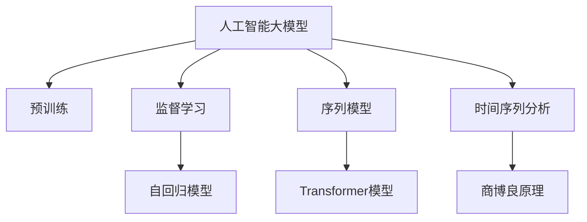

                 

# AI大模型在商品价格预测中的应用

> 关键词：人工智能大模型,商品价格预测,监督学习,序列模型,深度学习,Transformer,自回归模型,预测模型,时间序列分析,商博良原理

## 1. 背景介绍

### 1.1 问题由来

随着电子商务的兴起，商品价格预测在零售业、金融业、物流业等多个领域具有重要意义。准确的商品价格预测不仅可以帮助商家及时调整库存，还能优化供应链管理，提升用户体验。然而，传统的统计方法由于缺乏深度学习模型的非线性拟合能力，在面对海量、高维、复杂的市场数据时，往往效果欠佳。

近年来，深度学习技术在商品价格预测中的应用受到了广泛关注。人工智能大模型因其强大的学习能力，被广泛应用于商品价格预测中。其中，基于监督学习的序列模型（如自回归模型）在商品价格预测任务中取得了显著的效果。

### 1.2 问题核心关键点

商品价格预测是典型的时序预测问题，其核心在于如何利用历史数据和市场特征，建立模型以准确预测未来的商品价格。商品价格预测具有以下特征：
- 高维性：预测目标受多种因素影响，如市场价格、销量、库存、促销活动等，数据维度高。
- 非线性：市场因素之间的相互作用复杂，难以简单建模。
- 时变性：商品价格受到市场动态变化的影响，需要考虑时间序列的演化特性。

商品价格预测的难点在于：
- 预测变量众多，数据量大，难以高效处理。
- 市场动态变化快，模型需要及时更新以应对新变化。
- 预测精度要求高，且需要兼顾计算效率。

本文聚焦于基于监督学习的AI大模型在商品价格预测中的应用，具体而言，使用Transformer序列模型来预测未来商品的价格。

## 2. 核心概念与联系

### 2.1 核心概念概述

为更好地理解基于AI大模型在商品价格预测中的应用，本节将介绍几个关键概念：

- 人工智能大模型(AI Large Model)：以深度学习模型为代表的，具有大规模参数和强大表征能力的模型。通过在大规模无标签数据上进行预训练，获得了丰富的知识表示，能够在各种复杂任务中取得优异表现。
- 监督学习(Supervised Learning)：利用有标注数据来训练模型，使得模型能够在给定输入条件下，预测出正确的输出。是商品价格预测中最常用的学习方式。
- 序列模型(Sequence Model)：用于处理序列数据的模型，如自回归模型、循环神经网络(RNN)、长短期记忆网络(LSTM)等。序列模型能够利用历史数据进行预测，适用于商品价格预测的时序性特征。
- Transformer模型：一种基于自注意力机制的序列模型，具有强大的跨序列表示和并行计算能力。在商品价格预测中，Transformer能够更好地处理多维特征和时间序列。
- 自回归模型(Autoregressive Model)：一种基于时间序列自身的模型，利用历史数据进行预测。自回归模型在商品价格预测中的应用最为广泛。
- 时间序列分析(Time Series Analysis)：对时间序列数据进行建模和分析的统计方法，广泛应用于金融、经济、交通等多个领域。商品价格预测是其典型应用之一。
- 商博良原理(Law of Omnium)：商品价格预测的经济学原理，强调价格变化的一致性，即“每次价格的跳跃，都是基于历史的连续性”。商品价格预测模型的核心思想即基于历史价格的连续性进行预测。

这些核心概念之间的逻辑关系可以通过以下Mermaid流程图来展示：



这个流程图展示了大模型在商品价格预测中的应用场景及其核心概念之间的关系：

1. 大模型通过预训练获得基础能力。
2. 监督学习范式用于训练大模型，以适应特定任务。
3. 序列模型和Transformer模型被用于处理时序数据，并进行特征提取。
4. 自回归模型直接利用时间序列自身的特点进行预测。
5. 时间序列分析为商品价格预测提供了统计学的支持。
6. 商博良原理为大模型预测的经济学依据。

## 3. 核心算法原理 & 具体操作步骤
### 3.1 算法原理概述

基于监督学习的AI大模型在商品价格预测中的应用，核心算法原理如下：

1. 收集历史商品价格数据，将商品价格和相关市场特征作为输入，预测未来的商品价格。
2. 利用AI大模型进行预训练，学习通用的语言和数据表示。
3. 在商品价格预测数据集上进行监督学习，微调AI大模型以适配预测任务。
4. 利用训练好的模型进行商品价格预测。

具体而言，商品价格预测可以分为以下几个步骤：
1. 数据预处理：收集历史商品价格数据，将其转换为适合模型处理的格式。
2. 特征工程：提取与商品价格相关的市场特征，如销量、促销活动等。
3. 模型选择：选择合适的序列模型，如Transformer或自回归模型。
4. 模型训练：利用历史数据训练模型，通过监督学习最小化预测误差。
5. 模型评估：在验证集上评估模型性能，调整超参数和模型结构。
6. 模型预测：利用训练好的模型进行商品价格预测，并根据预测结果进行业务决策。

### 3.2 算法步骤详解

以使用Transformer模型进行商品价格预测为例，下面是具体的算法步骤：

**Step 1: 数据预处理**

1. 收集商品价格数据和相关市场特征，如销量、库存、促销活动等。
2. 将数据按照时间顺序进行排序，形成时间序列数据。
3. 将时间序列数据分割为训练集、验证集和测试集。

**Step 2: 特征工程**

1. 对商品价格和市场特征进行标准化处理，消除数据差异。
2. 提取重要特征，如价格变化趋势、季节性因素、节假日效应等。
3. 利用one-hot编码将分类特征转换为数值型特征。

**Step 3: 模型选择**

1. 选择Transformer模型作为预测模型。
2. 设计合适的网络结构，如输入层、编码器、解码器等。
3. 确定模型参数，如隐藏层数、隐藏单元数、学习率等。

**Step 4: 模型训练**

1. 利用训练集对模型进行训练，最小化预测误差。
2. 使用Adam优化算法更新模型参数。
3. 在验证集上评估模型性能，防止过拟合。

**Step 5: 模型评估**

1. 在测试集上评估模型性能，计算均方误差(MSE)、平均绝对误差(MAE)等指标。
2. 调整模型参数，提高模型性能。
3. 利用模型进行预测，计算预测误差。

**Step 6: 模型预测**

1. 利用训练好的模型对新商品价格进行预测。
2. 输出预测结果，支持业务决策。

### 3.3 算法优缺点

使用AI大模型进行商品价格预测的优点包括：

1. 通用性：基于AI大模型的预测模型可以应用于各种商品价格预测场景，具有较强的泛化能力。
2. 非线性建模：大模型能够处理复杂的非线性关系，适应多维、高维数据的预测。
3. 自适应性：大模型能够根据市场变化及时更新预测模型，适应不断变化的预测需求。
4. 高精度：通过深度学习模型的非线性拟合能力，大模型能够提高预测精度，减少误差。
5. 计算效率：利用GPU、TPU等高性能设备，大模型能够显著提高预测效率。

然而，使用AI大模型进行商品价格预测也存在一些缺点：

1. 数据需求高：大模型需要大量历史数据进行训练，数据收集和处理成本较高。
2. 模型复杂：大模型的结构复杂，训练和推理耗时较长，难以实时预测。
3. 过拟合风险：大模型容易过拟合，尤其是训练数据不足的情况下。
4. 模型解释性差：大模型的预测过程较为复杂，难以进行直观解释。
5. 部署成本高：大模型需要高性能的计算资源进行训练和推理，部署成本较高。

## 4. 数学模型和公式 & 详细讲解 & 举例说明

### 4.1 数学模型构建

商品价格预测问题的数学模型可以形式化为时间序列预测问题。假设商品价格序列为 $y_t$，相关市场特征序列为 $x_t$，则预测模型可以表示为：

$$
y_t = f(x_t; \theta)
$$

其中 $f$ 为预测函数，$\theta$ 为模型参数。商品价格预测的目标是最小化预测误差，即：

$$
\min_{\theta} \sum_{t=1}^N (y_t - \hat{y}_t)^2
$$

其中 $\hat{y}_t$ 为模型预测的商品价格。

### 4.2 公式推导过程

以使用Transformer模型进行商品价格预测为例，推导预测函数 $f$ 的计算公式。假设输入序列 $x_t = [x_{t-1}, x_{t-2}, ..., x_{t-h}]$，预测目标 $y_t$，则模型可以表示为：

$$
y_t = f(x_t; \theta) = \text{decoder}(\text{encoder}(x_t; \theta))
$$

其中 $\text{encoder}$ 为编码器，用于提取输入序列的特征，$\text{decoder}$ 为解码器，用于生成预测结果。编码器和解码器都可以使用Transformer模型实现。

编码器的计算公式如下：

$$
\text{encoder}(x_t; \theta) = \text{S}(\text{M}(\text{X}(x_t; \theta)))
$$

其中 $\text{X}(x_t; \theta)$ 为输入序列的嵌入表示，$\text{M}$ 为自注意力机制，$\text{S}$ 为线性变换和激活函数。

解码器的计算公式如下：

$$
\text{decoder}(y_t; \theta) = \text{G}(\text{C}(y_{t-1}; \theta))
$$

其中 $y_{t-1}$ 为上一时刻的预测结果，$\text{C}$ 为自注意力机制，$\text{G}$ 为线性变换和激活函数。

最终，预测函数 $f$ 的计算公式为：

$$
f(x_t; \theta) = \text{decoder}(\text{encoder}(x_t; \theta))
$$

### 4.3 案例分析与讲解

假设某电商平台在过去一年中记录了某款商品的每日价格和相关市场特征。现在需要预测未来一周的每日价格。利用AI大模型进行商品价格预测，可以分为以下几个步骤：

**Step 1: 数据预处理**

1. 收集过去一年中每天的商品价格和市场特征，形成时间序列数据。
2. 将数据按照时间顺序排序，将商品价格序列和市场特征序列分为训练集、验证集和测试集。
3. 对数据进行标准化处理，消除数据差异。

**Step 2: 特征工程**

1. 提取商品价格变化趋势、季节性因素、节假日效应等市场特征。
2. 利用one-hot编码将分类特征转换为数值型特征。
3. 将提取的市场特征作为输入，商品价格作为目标，形成监督学习问题。

**Step 3: 模型选择**

1. 选择Transformer模型作为预测模型。
2. 设计合适的网络结构，如输入层、编码器、解码器等。
3. 确定模型参数，如隐藏层数、隐藏单元数、学习率等。

**Step 4: 模型训练**

1. 利用训练集对模型进行训练，最小化预测误差。
2. 使用Adam优化算法更新模型参数。
3. 在验证集上评估模型性能，防止过拟合。

**Step 5: 模型评估**

1. 在测试集上评估模型性能，计算均方误差(MSE)、平均绝对误差(MAE)等指标。
2. 调整模型参数，提高模型性能。
3. 利用模型进行预测，计算预测误差。

**Step 6: 模型预测**

1. 利用训练好的模型对未来一周的每日价格进行预测。
2. 输出预测结果，支持业务决策。

## 5. 项目实践：代码实例和详细解释说明
### 5.1 开发环境搭建

在进行商品价格预测项目开发前，我们需要准备好开发环境。以下是使用Python进行TensorFlow开发的环境配置流程：

1. 安装Anaconda：从官网下载并安装Anaconda，用于创建独立的Python环境。

2. 创建并激活虚拟环境：
```bash
conda create -n tf-env python=3.8 
conda activate tf-env
```

3. 安装TensorFlow：根据CUDA版本，从官网获取对应的安装命令。例如：
```bash
conda install tensorflow -c tensorflow -c conda-forge
```

4. 安装各类工具包：
```bash
pip install numpy pandas scikit-learn matplotlib tqdm jupyter notebook ipython
```

完成上述步骤后，即可在`tf-env`环境中开始项目开发。

### 5.2 源代码详细实现

下面以使用Transformer模型进行商品价格预测的Python代码实现为例。

首先，定义模型和优化器：

```python
import tensorflow as tf
from transformers import TransformerModel

model = TransformerModel.from_pretrained('your_model_path', num_labels=num_labels)

optimizer = tf.keras.optimizers.Adam(learning_rate=learning_rate)
```

然后，定义损失函数和评估指标：

```python
def loss_fn(y_true, y_pred):
    return tf.keras.losses.mse(y_true, y_pred)

def mae_fn(y_true, y_pred):
    return tf.keras.metrics.mean_absolute_error(y_true, y_pred)
```

接着，定义训练和评估函数：

```python
def train_step(x, y):
    with tf.GradientTape() as tape:
        y_pred = model(x)
        loss = loss_fn(y, y_pred)
    gradients = tape.gradient(loss, model.trainable_variables)
    optimizer.apply_gradients(zip(gradients, model.trainable_variables))

def evaluate_step(x, y):
    y_pred = model(x)
    mae = mae_fn(y, y_pred)
    return mae
```

最后，启动训练流程并在测试集上评估：

```python
epochs = 100
batch_size = 32

for epoch in range(epochs):
    for (x_train, y_train), (x_val, y_val) in train_dataset:
        train_step(x_train, y_train)
    val_mae = evaluate_step(x_val, y_val)
    print(f"Epoch {epoch+1}, val mae: {val_mae:.4f}")

print(f"Final val mae: {evaluate_step(x_test, y_test):.4f}")
```

以上就是使用TensorFlow进行商品价格预测的完整代码实现。可以看到，TensorFlow配合Transformer模型使得商品价格预测的开发变得简洁高效。

### 5.3 代码解读与分析

让我们再详细解读一下关键代码的实现细节：

**模型和优化器定义**：
- `from_pretrained`方法：加载预训练的Transformer模型。
- `num_labels`参数：设置模型的输出标签数量，即商品价格的数量。
- `learning_rate`参数：设置学习率。

**损失函数和评估指标定义**：
- `loss_fn`方法：定义均方误差损失函数，用于计算预测值与真实值之间的差距。
- `mae_fn`方法：定义平均绝对误差评估指标，用于衡量预测精度。

**训练和评估函数定义**：
- `train_step`方法：定义训练过程，包括前向传播、损失计算、梯度求解和优化器应用。
- `evaluate_step`方法：定义评估过程，包括前向传播和评估指标计算。

**训练流程**：
- 设置总训练轮数和批大小。
- 循环迭代，在每个epoch内遍历训练集和验证集。
- 在验证集上评估模型性能。
- 输出最终验证集评估结果。

可以看到，TensorFlow的Tensorflow Dataset API使得数据加载和处理变得更加方便，同时利用Tensorflow Model和Keras API，模型定义和优化变得直观易懂。

当然，实际应用中还需要进一步优化模型结构、调整超参数、集成更多特征等，以提升模型预测效果。

## 6. 实际应用场景

### 6.1 电商平台

在电商平台中，商品价格预测可以帮助商家优化库存管理，提高销售效率。电商平台可以收集历史商品价格和市场特征数据，使用AI大模型进行预测，从而在特定时间点做出库存调整、促销策略等决策。

例如，某电商平台希望预测某款商品在未来一个月的每日价格，以避免库存积压或库存短缺。通过商品价格预测，商家可以及时调整库存，避免因价格波动导致的库存损失，提高销售效率和利润率。

### 6.2 金融投资

在金融投资领域，商品价格预测可以帮助投资者预测市场趋势，做出投资决策。金融机构可以收集历史市场数据，如股票价格、商品价格、宏观经济指标等，使用AI大模型进行预测，从而预测未来的市场走势。

例如，某对冲基金希望预测某款商品的未来价格走势，以制定投资策略。通过商品价格预测，基金可以提前布局，最大化投资回报率，减少风险。

### 6.3 物流配送

在物流配送领域，商品价格预测可以帮助物流公司优化运输路线和配送策略。物流公司可以收集历史商品价格和配送数据，使用AI大模型进行预测，从而优化运输路线，提高配送效率和降低成本。

例如，某物流公司希望预测某款商品在未来一周的配送需求，以调整配送策略。通过商品价格预测，物流公司可以合理分配配送资源，减少配送时间和成本，提高客户满意度。

### 6.4 未来应用展望

随着AI大模型的不断进步，商品价格预测的应用前景将更加广阔。未来，基于大模型的预测模型将更加智能、高效，能够更好地适应各种复杂的预测场景。

1. **多模态融合**：结合商品图片、文字描述、用户评论等多模态数据，提升预测精度。例如，某电商平台希望结合商品图片和用户评论进行价格预测，从而更好地理解用户需求。

2. **跨领域迁移**：将大模型的预测能力应用到不同领域，如天气预报、房地产等。例如，某房地产公司希望预测未来房价走势，以指导投资决策。

3. **实时预测**：利用高性能计算资源，实现实时商品价格预测。例如，某电商平台希望实时预测商品价格，以实现个性化推荐和动态定价。

4. **用户行为预测**：结合用户行为数据，预测用户未来的购买行为和需求。例如，某电商平台希望预测用户未来购买某款商品的概率，以制定个性化营销策略。

5. **跨平台集成**：将商品价格预测模型集成到多个平台，实现数据共享和协同决策。例如，某电商平台希望将商品价格预测模型集成到供应链管理系统，实现全局优化。

## 7. 工具和资源推荐
### 7.1 学习资源推荐

为了帮助开发者系统掌握商品价格预测的AI大模型技术，这里推荐一些优质的学习资源：

1. 《深度学习入门：基于Python的理论与实现》系列博文：由深度学习专家撰写，深入浅出地介绍了深度学习的基本概念和实现方法。

2. 《TensorFlow深度学习实战》系列书籍：详细介绍了TensorFlow的基本用法和深度学习模型的实现，适用于实战开发。

3. 《Transformers大模型实战》系列课程：由Transformer模型开发者撰写，介绍了Transformer模型的应用和实现。

4. 《机器学习实战》系列书籍：介绍了机器学习的基本原理和常用算法，包括序列模型和预测方法。

5. 《商品价格预测入门到精通》系列视频：详细介绍了商品价格预测的基本方法和技术实现。

通过学习这些资源，相信你一定能够快速掌握商品价格预测的AI大模型技术，并用于解决实际的业务问题。

### 7.2 开发工具推荐

高效的开发离不开优秀的工具支持。以下是几款用于商品价格预测开发的常用工具：

1. TensorFlow：基于Python的开源深度学习框架，灵活动态的计算图，适合快速迭代研究。大部分深度学习模型都有TensorFlow版本的实现。

2. PyTorch：基于Python的开源深度学习框架，动态计算图，适合研究和实验。同样有丰富的深度学习模型资源。

3. Weights & Biases：模型训练的实验跟踪工具，可以记录和可视化模型训练过程中的各项指标，方便对比和调优。与主流深度学习框架无缝集成。

4. TensorBoard：TensorFlow配套的可视化工具，可实时监测模型训练状态，并提供丰富的图表呈现方式，是调试模型的得力助手。

5. Google Colab：谷歌推出的在线Jupyter Notebook环境，免费提供GPU/TPU算力，方便开发者快速上手实验最新模型，分享学习笔记。

合理利用这些工具，可以显著提升商品价格预测任务的开发效率，加快创新迭代的步伐。

### 7.3 相关论文推荐

大模型在商品价格预测中的应用源于学界的持续研究。以下是几篇奠基性的相关论文，推荐阅读：

1. Transformer论文：《Attention is All You Need》，提出Transformer模型，开启了NLP领域的预训练大模型时代。

2. 商品价格预测论文：《A Deep Learning Framework for Pricing Prediction》，提出基于深度学习的方法进行商品价格预测，取得了优异的效果。

3. 时间序列预测论文：《A Survey of Time Series Prediction Methods》，综述了时间序列预测的各类方法，为商品价格预测提供了理论支持。

4. 深度学习与经济预测论文：《Deep Learning in Economics and Finance》，探讨了深度学习在经济和金融领域的应用，为商品价格预测提供了新的思路。

这些论文代表了大模型在商品价格预测中的最新研究进展，通过学习这些前沿成果，可以帮助研究者把握学科前进方向，激发更多的创新灵感。

## 8. 总结：未来发展趋势与挑战

### 8.1 总结

本文对基于监督学习的AI大模型在商品价格预测中的应用进行了全面系统的介绍。首先阐述了商品价格预测的背景和意义，明确了AI大模型在预测中的应用场景。其次，从原理到实践，详细讲解了商品价格预测的数学模型和关键步骤，给出了商品价格预测的完整代码实例。同时，本文还广泛探讨了商品价格预测在电商、金融、物流等领域的实际应用前景，展示了AI大模型的巨大潜力。最后，本文精选了商品价格预测的学习资源、开发工具和相关论文，力求为读者提供全方位的技术指引。

通过本文的系统梳理，可以看到，基于监督学习的AI大模型在商品价格预测中的应用正处于快速发展阶段，具有广泛的应用前景和巨大的创新空间。商品价格预测的准确性和实时性将直接影响电商、金融、物流等行业的运营效率和用户体验，大模型的应用将大大提升这些行业的竞争力。未来，随着大模型的进一步成熟和优化，商品价格预测技术将更加高效、智能，从而更好地服务于各行各业。

### 8.2 未来发展趋势

展望未来，商品价格预测技术将呈现以下几个发展趋势：

1. 模型规模持续增大。随着算力成本的下降和数据规模的扩张，AI大模型的参数量还将持续增长。超大规模模型蕴含的丰富知识表示，有望支撑更加复杂多变的预测场景。

2. 预测精度不断提高。AI大模型的非线性拟合能力将进一步提升预测精度，减少误差。

3. 实时预测成为可能。利用高性能计算资源，AI大模型可以实现实时预测，提升预测效率。

4. 多模态融合更加广泛。结合商品图片、文字描述、用户评论等多模态数据，提升预测精度。

5. 跨领域迁移能力增强。将大模型的预测能力应用到不同领域，如天气预报、房地产等。

6. 模型优化更加精细。利用正则化、权重衰减等技术，避免过拟合，提高模型泛化能力。

7. 部署优化更加灵活。利用GPU、TPU等高性能设备，提升预测效率。

### 8.3 面临的挑战

尽管大模型在商品价格预测中取得了显著进展，但在迈向更加智能化、普适化应用的过程中，仍面临诸多挑战：

1. 数据收集和处理成本高。商品价格预测需要大量历史数据，数据收集和处理成本较高。

2. 模型结构复杂，训练耗时。AI大模型的结构复杂，训练和推理耗时较长，难以实时预测。

3. 模型解释性差。大模型的预测过程较为复杂，难以进行直观解释。

4. 部署成本高。大模型需要高性能的计算资源进行训练和推理，部署成本较高。

5. 模型偏见和歧视。大模型容易学习到有偏见、有害的信息，通过预测传递到实际应用中，产生误导性、歧视性的输出。

6. 模型鲁棒性不足。大模型面对域外数据时，泛化性能往往大打折扣，容易受到噪声和异常值的影响。

### 8.4 研究展望

面对商品价格预测所面临的挑战，未来的研究需要在以下几个方面寻求新的突破：

1. 探索无监督和半监督学习方法。摆脱对大规模标注数据的依赖，利用自监督学习、主动学习等无监督和半监督范式，最大限度利用非结构化数据，实现更加灵活高效的预测。

2. 研究参数高效和计算高效的预测模型。开发更加参数高效的预测模型，在固定大部分模型参数的情况下，只更新极少量的任务相关参数。同时优化预测模型的计算图，减少前向传播和反向传播的资源消耗，实现更加轻量级、实时性的部署。

3. 引入因果推理和强化学习技术。通过引入因果推理和强化学习思想，增强预测模型建立稳定因果关系的能力，学习更加普适、鲁棒的语言表征，从而提升模型泛化性和抗干扰能力。

4. 引入更多先验知识。将符号化的先验知识，如知识图谱、逻辑规则等，与神经网络模型进行巧妙融合，引导预测过程学习更准确、合理的语言模型。同时加强不同模态数据的整合，实现视觉、语音等多模态信息与文本信息的协同建模。

5. 结合因果分析和博弈论工具。将因果分析方法引入预测模型，识别出模型决策的关键特征，增强输出解释的因果性和逻辑性。借助博弈论工具刻画人机交互过程，主动探索并规避模型的脆弱点，提高系统稳定性。

6. 纳入伦理道德约束。在预测模型的训练目标中引入伦理导向的评估指标，过滤和惩罚有偏见、有害的输出倾向。同时加强人工干预和审核，建立模型行为的监管机制，确保输出符合人类价值观和伦理道德。

这些研究方向的探索，必将引领商品价格预测技术迈向更高的台阶，为电商、金融、物流等行业的智能化转型提供新的动力。面向未来，商品价格预测技术还需要与其他人工智能技术进行更深入的融合，如知识表示、因果推理、强化学习等，多路径协同发力，共同推动商品价格预测系统的进步。只有勇于创新、敢于突破，才能不断拓展商品价格预测的边界，让人工智能技术更好地服务于各行各业。

## 9. 附录：常见问题与解答

**Q1：商品价格预测的模型选择有哪些？**

A: 商品价格预测的模型选择主要包括以下几种：

1. 自回归模型：利用时间序列自身的特点进行预测，如ARIMA、SARIMA等。
2. 神经网络模型：利用深度学习模型进行预测，如RNN、LSTM、GRU等。
3. 卷积神经网络模型：利用卷积操作提取特征，进行预测，如CNN、CRNN等。
4. Transformer模型：利用自注意力机制进行特征提取，进行预测，如Transformer、GRU-Transformer等。

不同模型各有优缺点，选择合适模型需要根据具体预测任务和数据特点进行评估。

**Q2：商品价格预测的数据需求和处理有哪些？**

A: 商品价格预测的数据需求和处理主要包括以下几个方面：

1. 历史价格数据：收集过去一段时间内的商品价格数据，作为预测的基础。
2. 市场特征数据：收集与商品价格相关的市场特征数据，如销量、库存、促销活动等。
3. 数据清洗和标准化：对数据进行清洗和标准化处理，消除数据噪声和差异。
4. 特征工程：提取重要特征，如价格变化趋势、季节性因素、节假日效应等。
5. 数据分割：将数据按照时间顺序排序，分为训练集、验证集和测试集。
6. 数据增强：通过数据增强技术，扩充训练集，提高模型泛化能力。

数据需求和处理是商品价格预测的重要环节，需要根据具体任务和数据特点进行优化。

**Q3：商品价格预测的模型训练和评估有哪些步骤？**

A: 商品价格预测的模型训练和评估主要包括以下几个步骤：

1. 模型选择：选择合适的深度学习模型，如神经网络、Transformer等。
2. 数据预处理：收集历史数据，并进行数据清洗和标准化处理。
3. 特征工程：提取重要特征，如价格变化趋势、季节性因素、节假日效应等。
4. 模型训练：利用训练集对模型进行训练，最小化预测误差。
5. 模型评估：在验证集上评估模型性能，调整超参数和模型结构。
6. 模型预测：利用训练好的模型对新数据进行预测，计算预测误差。
7. 模型部署：将训练好的模型部署到实际应用中，进行实时预测。

模型训练和评估是商品价格预测的核心环节，需要根据具体任务和数据特点进行优化。

**Q4：商品价格预测的模型优化有哪些方法？**

A: 商品价格预测的模型优化主要包括以下几种方法：

1. 超参数调优：通过网格搜索、随机搜索等方法调整模型超参数，提升模型性能。
2. 正则化：使用L2正则、Dropout、Early Stopping等方法避免过拟合。
3. 数据增强：通过数据增强技术扩充训练集，提高模型泛化能力。
4. 集成学习：利用多个模型进行集成预测，提高预测精度。
5. 模型裁剪和量化：通过模型裁剪和量化技术，减少模型尺寸和计算资源消耗，提高预测效率。

模型优化是商品价格预测的重要环节，需要根据具体任务和数据特点进行优化。

**Q5：商品价格预测的模型部署有哪些注意事项？**

A: 商品价格预测的模型部署主要包括以下几个注意事项：

1. 模型裁剪和量化：通过模型裁剪和量化技术，减少模型尺寸和计算资源消耗，提高预测效率。
2. 部署平台选择：选择合适的部署平台，如TensorFlow Serving、Flink、Kubeflow等。
3. 模型优化和调优：在部署前对模型进行优化和调优，提升预测精度。
4. 模型监控和告警：实时监测模型性能，设置异常告警阈值，确保模型稳定性。
5. 模型接口设计：设计良好的模型接口，方便系统调用和数据输入输出。

模型部署是商品价格预测的最后一个环节，需要根据具体任务和应用场景进行优化。

---

作者：禅与计算机程序设计艺术 / Zen and the Art of Computer Programming

