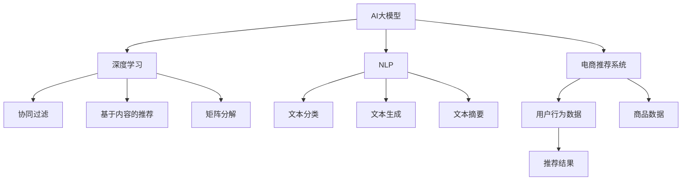

                 

# AI大模型在电商个性化推荐中的深度应用

## 1. 背景介绍

### 1.1 问题由来
随着互联网技术的迅猛发展，电商行业成为全球最大的经济体之一。在线购物的便利性和多样性，使得用户对个性化推荐的需求日益增长。个性化推荐系统（Recommendation System）通过分析用户的浏览记录、购买历史、搜索行为等数据，预测用户对特定商品的兴趣，从而提供个性化的商品推荐，提升用户购物体验和商家销售转化率。

在传统的个性化推荐系统中，推荐算法依赖于用户历史行为数据的统计分析，难以实时捕捉用户当前需求和情感状态，推荐效果常常存在偏差。近年来，随着预训练语言模型的兴起，通过AI大模型对电商文本数据进行深度挖掘，不仅能捕捉用户的隐式需求，还能发现新的商业机会，为电商推荐系统的优化带来了新的思路和可能性。

### 1.2 问题核心关键点
本文聚焦于如何利用AI大模型对电商文本数据进行深度学习，提出一种基于大模型的电商个性化推荐系统方案。该方案通过预训练大模型在电商领域的数据上进行微调，能够捕捉用户的多层次需求和隐式意图，从而提供更精准、个性化的推荐结果。

### 1.3 问题研究意义
利用AI大模型进行电商个性化推荐，具有以下重要意义：
1. **提升推荐精度**：大模型能够捕捉更丰富的语义信息和上下文关系，结合用户行为数据，提供更高精度的个性化推荐。
2. **拓展推荐边界**：通过深度语义分析，大模型能够发现更多隐性的用户需求和购买意图，为电商商家提供更多潜在商业机会。
3. **促进用户体验**：个性化推荐能显著提升用户的购物体验，增加用户粘性和满意度。
4. **优化商家收益**：精准的推荐能提高销售转化率，优化库存管理，减少营销成本。

## 2. 核心概念与联系

### 2.1 核心概念概述
为更好地理解基于大模型的电商个性化推荐方法，本节将介绍几个关键概念：

- **AI大模型(AI Large Model)**：如GPT-3、BERT、RoBERTa等，利用大规模无标签文本数据进行预训练，学习通用的语言表示，具备强大的语言理解和生成能力。
- **电商推荐系统(e-commerce recommendation system)**：基于用户行为数据，预测用户对商品的需求，并提供个性化推荐，提升用户购物体验和商家销售转化率的系统。
- **推荐算法(recommendation algorithm)**：如协同过滤、基于内容的推荐、基于矩阵分解等，用于根据用户历史行为数据预测用户兴趣，生成推荐列表的算法。
- **深度学习(deep learning)**：通过神经网络对数据进行抽象表示和模式学习，以获取高层次的特征表示和复杂关系的建模。
- **自然语言处理(natural language processing, NLP)**：使用计算机技术处理和分析人类语言，涵盖文本生成、文本分类、文本摘要等任务。

这些核心概念之间的关系可以通过以下Mermaid流程图来展示：



这个流程图展示了AI大模型、电商推荐系统与其他相关概念之间的关系：

1. AI大模型利用深度学习和NLP技术，学习通用的语言表示。
2. 电商推荐系统基于用户行为数据和商品数据，结合AI大模型进行推荐。
3. 协同过滤、基于内容的推荐、矩阵分解等算法是推荐系统的常见技术手段。
4. 文本分类、文本生成、文本摘要等NLP技术，用于处理电商中的文本数据。

## 3. 核心算法原理 & 具体操作步骤

### 3.1 算法原理概述

基于大模型的电商个性化推荐系统，核心在于将大模型的语言理解能力与电商推荐算法相结合。通过在电商领域的数据上对大模型进行微调，捕捉用户对商品的隐式需求和情感状态，从而提供更加精准和个性化的推荐。

具体来说，该方法包含以下几个关键步骤：
1. **数据预处理**：将电商文本数据转换为大模型可以处理的形式。
2. **模型微调**：在电商数据上进行微调，训练大模型学习电商领域的语言特征。
3. **特征提取**：提取微调后的模型输出，作为推荐算法的输入特征。
4. **推荐生成**：结合用户行为数据，使用推荐算法生成推荐结果。

### 3.2 算法步骤详解

#### 3.2.1 数据预处理

电商文本数据包括用户评论、商品描述、搜索关键词等，数据量庞大且存在多语言、多格式等问题。需要进行以下预处理：

1. **数据清洗**：去除无用数据、去重、填充缺失值等。
2. **数据标准化**：统一编码格式，标准化文本格式。
3. **分词和标注**：将文本进行分词，并标注词性、实体等信息。
4. **文本编码**：将文本转换为大模型可接受的数值表示形式，如token ids。

#### 3.2.2 模型微调

电商推荐系统数据往往不均衡，用户行为数据较少，而商品描述数据较多。因此，大模型的微调需要特别设计，以适应电商数据的特点。具体步骤如下：

1. **选择预训练模型**：如BERT、GPT等，作为基础大模型。
2. **构建微调任务**：定义推荐任务，如预测用户对商品评分、点击概率等。
3. **定义损失函数**：如交叉熵损失、均方误差损失等，用于衡量模型预测与实际标签之间的差异。
4. **设置超参数**：包括学习率、批大小、迭代轮数等。
5. **训练模型**：在电商数据集上训练微调后的模型。

#### 3.2.3 特征提取

微调后的模型输出可以表示为多个向量，每个向量代表文本中的一个方面特征。这些特征可以用于电商推荐算法中，以提高推荐精度。

1. **选择特征向量**：根据电商推荐任务的特点，选择最相关的特征向量。
2. **特征拼接**：将不同特征向量拼接在一起，形成综合特征向量。
3. **归一化**：对特征向量进行归一化处理，避免不同特征之间的尺度差异。

#### 3.2.4 推荐生成

电商推荐系统通常结合多种推荐算法，生成推荐结果。结合微调后的大模型输出，推荐算法可以更加精准地预测用户兴趣，生成个性化的推荐列表。

1. **协同过滤**：基于用户历史行为数据，推荐与用户历史兴趣相似的商品。
2. **基于内容的推荐**：利用商品属性、描述等信息，推荐与用户当前浏览商品相似的商品。
3. **矩阵分解**：通过分解用户-商品矩阵，预测用户对商品的评分和点击概率。

### 3.3 算法优缺点

基于大模型的电商个性化推荐方法，具有以下优点：
1. **精度高**：利用大模型的语义理解能力，捕捉用户的多层次需求和隐式意图，提高推荐精度。
2. **泛化能力强**：大模型学习到的语言知识能够适应不同场景的电商数据，提高推荐的泛化性能。
3. **鲁棒性强**：大模型的预训练过程已经学习到大量的语言知识，对小样本数据也有较好的泛化能力。
4. **实时性高**：大模型能够实时处理电商数据，快速生成推荐结果。

同时，该方法也存在以下缺点：
1. **计算成本高**：大模型的微调和推理需要大量计算资源，对硬件要求较高。
2. **模型复杂度高**：大模型的参数量较大，难以解释和调试。
3. **数据质量要求高**：电商文本数据质量对推荐效果影响较大，数据清洗和预处理需要花费大量时间。

### 3.4 算法应用领域

基于大模型的电商个性化推荐方法，在以下领域有广泛的应用：

- **电商推荐系统**：对电商数据进行深度学习，捕捉用户的多层次需求和隐式意图，生成个性化的商品推荐。
- **商品搜索系统**：利用大模型的语义理解能力，提升搜索查询的匹配度和相关性。
- **广告推荐系统**：通过深度学习用户行为数据，生成个性化的广告推荐，提升广告效果。
- **智能客服系统**：结合大模型和电商领域知识，为用户提供智能的客户服务，提升客户满意度。
- **商品评价系统**：利用大模型分析用户评论文本，生成商品评价和情感分析，提升商品质量。

## 4. 数学模型和公式 & 详细讲解 & 举例说明

### 4.1 数学模型构建

假设电商推荐系统数据集为 $D=\{(x_i,y_i)\}_{i=1}^N$，其中 $x_i$ 为电商文本数据，$y_i$ 为对应的推荐标签。使用大模型 $M_{\theta}$ 作为特征提取器，将 $x_i$ 映射为特征向量 $f(x_i)$。推荐算法的损失函数为 $\mathcal{L}(y_i,f(x_i))$。

推荐任务可以是预测用户评分、点击概率等，如预测用户对商品 $j$ 的评分 $y_i^j$。则模型微调的损失函数为：

$$
\mathcal{L}(\theta) = \frac{1}{N}\sum_{i=1}^N \mathcal{L}(y_i,f(x_i))
$$

其中 $\mathcal{L}$ 为推荐任务的损失函数。

### 4.2 公式推导过程

以预测用户对商品 $j$ 的评分 $y_i^j$ 为例，假设模型 $M_{\theta}$ 在输入 $x_i$ 上的输出为 $f(x_i)=\{f^k(x_i)\}_{k=1}^K$，其中 $K$ 为大模型输出的特征向量数量。推荐算法可以使用协同过滤、基于内容的推荐等方法，生成推荐结果。

对于协同过滤，假设用户历史评分矩阵为 $R$，第 $i$ 个用户对商品 $j$ 的评分 $y_i^j$ 为：

$$
y_i^j = \sum_{k=1}^K f^k(x_i) \cdot R_{ij}
$$

其中 $R_{ij}$ 为第 $i$ 个用户对商品 $j$ 的评分。

### 4.3 案例分析与讲解

假设电商数据集中包含用户评论文本 $x$ 和商品 $j$ 的评分 $y$。首先，使用BERT模型对评论文本进行微调，得到特征向量 $f(x)$。然后，结合协同过滤算法，预测用户对商品 $j$ 的评分 $y_i^j$。

在实际应用中，为了提高推荐效果，可以引入更多电商领域特定的知识，如商品属性、品牌等信息。这些知识可以与大模型输出的特征向量结合，进一步提升推荐精度。

## 5. 项目实践：代码实例和详细解释说明

### 5.1 开发环境搭建

在进行电商推荐系统开发前，我们需要准备好开发环境。以下是使用Python进行TensorFlow开发的环境配置流程：

1. 安装Anaconda：从官网下载并安装Anaconda，用于创建独立的Python环境。

2. 创建并激活虚拟环境：
```bash
conda create -n tf-env python=3.8 
conda activate tf-env
```

3. 安装TensorFlow：
```bash
pip install tensorflow==2.4.1
```

4. 安装相关依赖：
```bash
pip install pandas scikit-learn numpy tensorflow-datasets tqdm
```

完成上述步骤后，即可在`tf-env`环境中开始电商推荐系统的开发。

### 5.2 源代码详细实现

这里我们以一个简单的电商推荐系统为例，展示使用TensorFlow进行电商推荐系统开发的代码实现。

首先，定义数据处理函数：

```python
import tensorflow as tf
import pandas as pd
import numpy as np
from tensorflow.keras.preprocessing.text import Tokenizer
from tensorflow.keras.preprocessing.sequence import pad_sequences

# 读取数据
train_data = pd.read_csv('train.csv')
test_data = pd.read_csv('test.csv')

# 数据清洗
train_data = train_data.dropna(subset=['text', 'label'])
test_data = test_data.dropna(subset=['text'])

# 分词和编码
tokenizer = Tokenizer()
tokenizer.fit_on_texts(train_data['text'].values)
sequences = tokenizer.texts_to_sequences(train_data['text'].values)
padded_sequences = pad_sequences(sequences, maxlen=128)

# 定义标签
train_labels = train_data['label'].values

# 数据集划分
from sklearn.model_selection import train_test_split
train_x, test_x, train_y, test_y = train_test_split(padded_sequences, train_labels, test_size=0.2)
```

然后，定义模型：

```python
from tensorflow.keras.models import Sequential
from tensorflow.keras.layers import Embedding, Dense

model = Sequential([
    Embedding(input_dim=len(tokenizer.word_index) + 1, output_dim=128, input_length=128),
    Dense(64, activation='relu'),
    Dense(1, activation='sigmoid')
])

model.compile(optimizer='adam', loss='binary_crossentropy', metrics=['accuracy'])
```

接着，训练模型：

```python
model.fit(train_x, train_y, epochs=10, validation_data=(test_x, test_y))
```

最后，评估模型：

```python
loss, accuracy = model.evaluate(test_x, test_y)
print(f'Test Loss: {loss:.4f}')
print(f'Test Accuracy: {accuracy:.4f}')
```

以上就是使用TensorFlow对电商推荐系统进行开发的完整代码实现。可以看到，利用TensorFlow的高级API，电商推荐系统的开发变得简洁高效。

### 5.3 代码解读与分析

让我们再详细解读一下关键代码的实现细节：

**数据处理函数**：
- 使用Pandas读取电商数据集，并进行数据清洗，去除缺失值。
- 使用TensorFlow的Tokenizer对文本进行分词和编码，得到token ids。
- 对编码后的文本进行填充，使其长度一致。
- 定义标签，将标签转换为数值形式。
- 使用Scikit-learn的train_test_split方法，将数据集划分为训练集和测试集。

**模型定义**：
- 使用Sequential模型定义神经网络结构。
- 定义Embedding层，将token ids转换为密集向量。
- 定义两个Dense层，进行特征提取和分类。
- 编译模型，指定优化器和损失函数。

**模型训练**：
- 使用fit方法训练模型，指定训练数据、标签、迭代次数和验证数据。
- 在训练过程中，使用evaluate方法评估模型性能，避免过拟合。

**模型评估**：
- 使用evaluate方法在测试集上评估模型性能，输出测试损失和准确率。

## 6. 实际应用场景

### 6.1 智能推荐引擎

基于大模型的电商推荐系统，可以应用于智能推荐引擎中。传统推荐引擎依赖于用户历史行为数据的统计分析，难以实时捕捉用户当前需求和情感状态。大模型能够捕捉更丰富的语义信息和上下文关系，结合用户行为数据，提供更高精度的个性化推荐。

在实际应用中，可以收集用户浏览、点击、评论等行为数据，将商品描述、属性等文本信息作为模型输入，生成个性化推荐结果。大模型通过深度语义分析，能够发现更多隐性的用户需求和购买意图，为电商商家提供更多潜在商业机会。

### 6.2 广告投放系统

电商广告投放系统通过精准推荐，提高广告效果和ROI。大模型能够捕捉用户的多层次需求和隐式意图，结合电商广告数据，生成个性化的广告推荐。

在实际应用中，广告主可以提供广告素材、预算、目标用户等信息，大模型通过深度学习，生成最符合用户需求的广告推荐。广告主可以根据广告效果，实时调整投放策略，提升广告效果和收益。

### 6.3 用户画像构建

电商用户画像通过分析用户行为数据，构建用户的多层次特征。大模型能够捕捉用户的多层次需求和隐式意图，结合电商用户画像数据，生成更加全面、准确的画像。

在实际应用中，电商企业可以收集用户行为数据、购买历史、搜索行为等，利用大模型进行深度学习，构建用户画像。根据用户画像，电商企业可以进行个性化推荐、精准营销、客户细分等，提升用户购物体验和商家收益。

### 6.4 未来应用展望

随着大模型和微调方法的不断发展，基于大模型的电商推荐系统将在更多领域得到应用，为电商行业带来变革性影响。

在智慧物流领域，基于大模型的物流推荐系统可以优化仓储和配送策略，提高物流效率和准确性。在智能客服领域，结合大模型和电商领域知识，为用户提供智能的客户服务，提升客户满意度。在金融领域，基于大模型的金融推荐系统可以预测用户对金融产品的需求，提升金融产品销售和用户粘性。

## 7. 工具和资源推荐

### 7.1 学习资源推荐

为了帮助开发者系统掌握大模型在电商推荐中的应用，这里推荐一些优质的学习资源：

1. 《TensorFlow深度学习实战》系列博文：由TensorFlow官方团队撰写，深入浅出地介绍了TensorFlow在深度学习中的应用。

2. 《自然语言处理入门》课程：斯坦福大学开设的NLP入门课程，涵盖了NLP的基本概念和经典模型。

3. 《TensorFlow推荐系统实战》书籍：介绍如何使用TensorFlow构建推荐系统，涵盖协同过滤、基于内容的推荐等技术。

4. Kaggle数据集和竞赛：Kaggle提供了大量电商推荐系统的数据集和竞赛，帮助开发者实践和验证算法效果。

5. 《推荐系统实践》书籍：介绍了推荐系统的各种技术和算法，涵盖协同过滤、矩阵分解、基于内容的推荐等。

通过对这些资源的学习实践，相信你一定能够快速掌握大模型在电商推荐中的应用，并用于解决实际的电商问题。

### 7.2 开发工具推荐

高效的开发离不开优秀的工具支持。以下是几款用于电商推荐系统开发的常用工具：

1. TensorFlow：由Google主导开发的开源深度学习框架，生产部署方便，适合大规模工程应用。

2. PyTorch：基于Python的开源深度学习框架，灵活动态的计算图，适合快速迭代研究。

3. TensorBoard：TensorFlow配套的可视化工具，可实时监测模型训练状态，并提供丰富的图表呈现方式。

4. Kaggle：提供大量电商推荐系统数据集和竞赛，方便开发者实践和验证算法效果。

5. Jupyter Notebook：用于编写和分享深度学习代码的平台，支持多种编程语言和数据处理库。

合理利用这些工具，可以显著提升电商推荐系统的开发效率，加快创新迭代的步伐。

### 7.3 相关论文推荐

大模型在电商推荐系统中的应用，源于学界的持续研究。以下是几篇奠基性的相关论文，推荐阅读：

1. Attention is All You Need：提出Transformer结构，开启了NLP领域的预训练大模型时代。

2. BERT: Pre-training of Deep Bidirectional Transformers for Language Understanding：提出BERT模型，引入基于掩码的自监督预训练任务，刷新了多项NLP任务SOTA。

3. Matrix Factorization Techniques for Recommender Systems：介绍矩阵分解推荐算法，被广泛应用于电商推荐系统中。

4. Deep Interest Networks for Multi-view Recommendations：提出Deep Interest Networks模型，结合多视图数据进行推荐。

5. Learning Deep Structured Models for Recommender Systems：介绍深度学习在推荐系统中的应用，涵盖协同过滤、基于内容的推荐等技术。

这些论文代表了大模型在电商推荐系统中的研究方向和发展脉络。通过学习这些前沿成果，可以帮助研究者把握学科前进方向，激发更多的创新灵感。

## 8. 总结：未来发展趋势与挑战

### 8.1 总结

本文对基于大模型的电商个性化推荐方法进行了全面系统的介绍。首先阐述了大模型和电商推荐系统的研究背景和意义，明确了电商推荐系统中大模型的应用场景和优势。其次，从原理到实践，详细讲解了大模型在电商推荐系统中的深度应用，并给出了电商推荐系统的完整代码实例。同时，本文还广泛探讨了大模型在电商推荐系统中的应用前景，展示了大模型范式的巨大潜力。

通过本文的系统梳理，可以看到，基于大模型的电商推荐系统已经成为电商行业的重要技术手段，显著提升了电商推荐系统的精度和效果。未来，伴随大模型和微调方法的持续演进，基于大模型的电商推荐系统必将在更多领域得到应用，为电商行业带来变革性影响。

### 8.2 未来发展趋势

展望未来，大模型在电商推荐系统中的发展趋势将呈现以下几个方向：

1. **大模型规模持续增大**：随着算力成本的下降和数据规模的扩张，大模型的参数量还将持续增长。超大模型的语义表示能力将更加强大，能够捕捉更加丰富的语义信息。

2. **模型泛化能力增强**：大模型的预训练过程将更加注重泛化能力，能够在不同场景和数据集上表现优异。

3. **实时性提升**：通过分布式训练和推理优化，大模型的实时性将得到显著提升，能够实时处理电商数据，生成推荐结果。

4. **多模态融合**：结合视觉、语音、文本等多模态数据，构建多模态推荐系统，提升推荐的准确性和丰富性。

5. **个性化推荐多样化**：结合电商领域知识，构建个性化推荐模型，实现多种推荐策略的组合，提高推荐效果。

6. **可解释性增强**：大模型的可解释性将成为研究重点，通过引入因果分析和对抗训练等方法，提高推荐模型的透明性和可信度。

以上趋势凸显了大模型在电商推荐系统中的广阔前景。这些方向的探索发展，必将进一步提升电商推荐系统的性能和应用范围，为电商行业带来变革性影响。

### 8.3 面临的挑战

尽管大模型在电商推荐系统中已经取得了显著进展，但在迈向更加智能化、普适化应用的过程中，它仍面临着诸多挑战：

1. **计算成本高**：大模型的微调和推理需要大量计算资源，对硬件要求较高。

2. **模型复杂度高**：大模型的参数量较大，难以解释和调试。

3. **数据质量要求高**：电商文本数据质量对推荐效果影响较大，数据清洗和预处理需要花费大量时间。

4. **模型鲁棒性不足**：大模型面对域外数据时，泛化性能往往大打折扣。对于测试样本的微小扰动，模型预测也容易发生波动。

5. **隐私和安全性**：电商推荐系统涉及用户隐私数据，如何保护用户隐私和数据安全，是一个重要挑战。

6. **公平性和公正性**：大模型可能会学习到用户偏见和数据偏见，导致推荐结果不公平、不公正。

7. **实时性和效率**：大模型的推理速度较慢，实时性需要进一步优化。

以上挑战需要通过技术创新和工程实践来解决，才能将大模型在电商推荐系统中的应用推向新的高度。

### 8.4 研究展望

面对大模型在电商推荐系统中面临的挑战，未来的研究需要在以下几个方面寻求新的突破：

1. **分布式训练和推理**：通过分布式计算和优化，提升大模型的实时性和效率。

2. **模型压缩和优化**：通过模型压缩和优化，降低大模型的计算成本和存储开销。

3. **多模态融合**：结合视觉、语音、文本等多模态数据，构建多模态推荐系统，提升推荐的准确性和丰富性。

4. **可解释性增强**：通过引入因果分析和对抗训练等方法，提高推荐模型的透明性和可信度。

5. **公平性和公正性**：通过数据清洗和算法优化，消除模型偏见，提升推荐结果的公平性和公正性。

6. **隐私保护和数据安全**：通过隐私保护技术，保护用户隐私和数据安全。

这些研究方向的探索，必将引领大模型在电商推荐系统中的进一步发展和应用，为电商行业带来更加智能化、普适化的推荐服务。

## 9. 附录：常见问题与解答

**Q1：大模型在电商推荐系统中需要预训练吗？**

A: 大模型在电商推荐系统中需要进行预训练，以学习通用的语言表示和语言知识。预训练过程可以提高模型的泛化能力，在电商推荐系统中表现出更好的性能。

**Q2：电商推荐系统中的数据清洗和预处理需要多长时间？**

A: 电商推荐系统中的数据清洗和预处理需要大量时间，特别是对于大规模电商数据集。数据清洗和预处理包括去重、填充缺失值、分词编码等步骤，通常需要数小时或数天完成。

**Q3：如何提高电商推荐系统的实时性？**

A: 电商推荐系统的实时性可以通过分布式训练和推理优化来提升。使用TensorFlow或PyTorch的分布式训练框架，可以加快模型训练速度。同时，优化模型推理过程，使用量化加速、模型压缩等技术，可以提升推理速度，实现实时推荐。

**Q4：电商推荐系统中的推荐算法有哪些？**

A: 电商推荐系统中的推荐算法包括协同过滤、基于内容的推荐、矩阵分解、深度学习等。协同过滤和基于内容的推荐是常用的推荐算法，而矩阵分解和深度学习是更高级的推荐方法，能够捕捉更丰富的特征和关系。

**Q5：电商推荐系统中的模型压缩有哪些方法？**

A: 电商推荐系统中的模型压缩方法包括参数剪枝、量化、知识蒸馏等。参数剪枝可以去除冗余参数，量化可以减少模型占用的存储空间和计算资源。知识蒸馏可以将大模型知识转移给轻量级模型，降低计算成本。

以上是本文对大模型在电商推荐系统中的深度应用进行详细讲解和实践的完整内容。通过本文的系统梳理，相信你一定能够快速掌握大模型在电商推荐系统中的应用，并用于解决实际的电商问题。希望本文能为电商推荐系统的开发者和研究者提供有益的参考和指导。

---

作者：禅与计算机程序设计艺术 / Zen and the Art of Computer Programming

