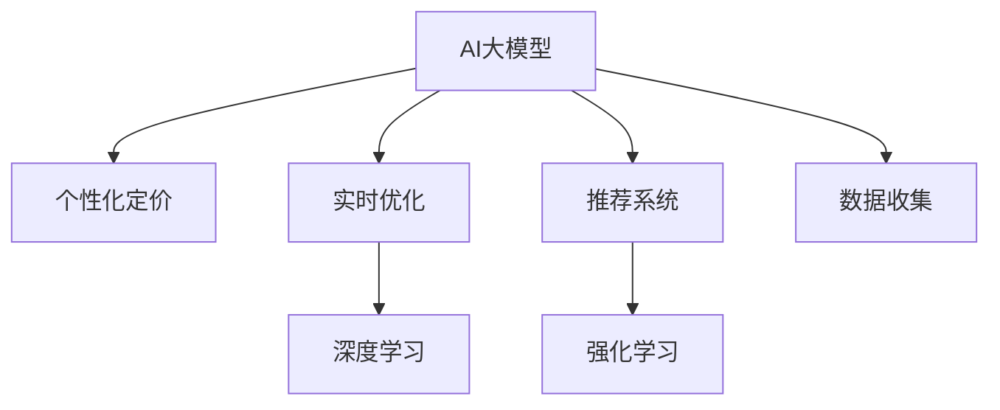
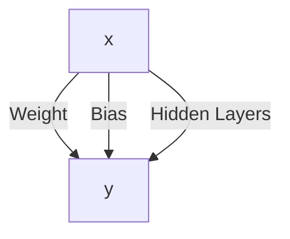

                 

# AI大模型在电商实时个性化定价中的应用

> 关键词：AI大模型、个性化定价、实时优化、电商、深度学习、强化学习、推荐系统

## 1. 背景介绍

### 1.1 问题由来
在电商行业中，定价策略直接影响到产品的销量和利润，如何制定出既满足市场需求又最大程度实现收益的定价策略，是电商企业面临的重要问题。传统的定价方法依赖于经验与市场调研，需要大量的手动工作，不仅效率低下，还可能因考虑不周而影响收益。而随着人工智能技术的发展，AI大模型在电商定价中得以应用，大幅提升了定价的效率和精准度。

### 1.2 问题核心关键点
AI大模型在电商定价中的应用，主要通过以下几步实现：
1. **数据收集**：收集历史销售数据、用户行为数据、市场信息等，构建电商定价的数据基础。
2. **模型训练**：基于大规模数据训练大模型，学习用户需求、产品特性和市场变化等因素对定价的影响。
3. **实时定价**：实时收集当前市场情况和用户行为数据，输入到大模型中进行实时计算和定价优化。
4. **效果评估**：根据实际销售数据评估模型的定价效果，不断调整模型参数和策略，优化定价决策。

本文将重点介绍如何利用AI大模型进行实时个性化定价，以及其技术实现和优化策略。

## 2. 核心概念与联系

### 2.1 核心概念概述

为更好地理解AI大模型在电商定价中的应用，本节将介绍几个关键概念及其联系：

- **AI大模型**：以深度学习为基础，通过大规模数据训练而成的通用模型，具备强大的数据处理能力和推理能力。

- **个性化定价**：根据用户行为、产品特性和市场情况，为不同用户和不同产品制定差异化的价格策略。

- **实时优化**：通过实时收集市场数据和用户行为，动态调整定价策略，最大化收益。

- **推荐系统**：通过学习用户行为和产品特征，为每个用户推荐最合适的产品，辅助定价决策。

- **深度学习**：利用神经网络等技术，从数据中学习特征和规律，提升模型的预测能力。

- **强化学习**：通过奖励机制，不断调整模型参数，优化定价策略，适应市场变化。

这些概念之间的关系可以通过以下Mermaid流程图来展示：



这个流程图展示了AI大模型在电商定价中的应用流程：

1. 数据收集：获取用户行为、产品特征等数据。
2. 模型训练：使用深度学习技术训练模型，学习用户需求和产品特性。
3. 推荐系统：利用模型推荐产品，辅助定价决策。
4. 实时优化：通过实时数据调整定价策略，优化收益。

## 3. 核心算法原理 & 具体操作步骤

### 3.1 算法原理概述

AI大模型在电商定价中的应用，主要是通过深度学习模型进行个性化定价和实时优化的。

个性化定价的核心思想是：根据用户行为和产品特性，动态调整定价策略，使每个用户对每个产品的价格感受最大化。具体而言，对于每个用户，模型预测其购买意愿和价格敏感度，据此计算最优价格。

实时优化的核心思想是：通过实时数据，动态调整定价策略，适应市场变化。具体而言，模型实时收集市场信息、用户行为数据，计算最优定价，更新库存和销售策略。

### 3.2 算法步骤详解

#### 3.2.1 数据收集与处理

数据收集是电商定价的基础，需要收集以下几类数据：

- **用户数据**：包括用户基本信息、历史购买记录、浏览记录、搜索记录等。
- **产品数据**：包括产品价格、库存、描述、类别、评价等。
- **市场数据**：包括市场趋势、竞争情况、节假日信息等。

数据收集完毕后，需要进行清洗和预处理：

- 去除噪音和异常值，确保数据质量。
- 进行特征工程，提取有用的特征，如用户兴趣、产品属性、市场热度等。
- 将数据转换为模型所需格式，如向量化处理。

#### 3.2.2 模型训练

模型训练是电商定价的核心环节，主要分为以下几步：

1. **特征提取**：使用深度学习模型提取特征，如用户兴趣、产品类别、价格变化等。
2. **模型选择**：选择合适的深度学习模型，如线性回归、决策树、神经网络等。
3. **训练优化**：通过大量标注数据训练模型，使用梯度下降等优化算法进行参数更新。
4. **模型评估**：使用验证集评估模型性能，调整模型参数和超参数。

#### 3.2.3 实时定价与优化

实时定价和优化是电商定价的重要组成部分，主要分为以下几步：

1. **数据实时采集**：实时收集市场信息、用户行为等数据。
2. **模型实时预测**：将实时数据输入模型进行预测，计算最优价格。
3. **定价策略更新**：根据预测结果，动态调整定价策略，如折扣、促销等。
4. **效果评估与调整**：根据实际销售数据评估定价效果，不断调整模型参数和策略。

### 3.3 算法优缺点

AI大模型在电商定价中的主要优点包括：

- **高效准确**：通过深度学习和强化学习，模型能够高效地处理大量数据，并准确预测最优价格。
- **个性化定制**：能够根据用户行为和产品特性，进行个性化定价，提升用户体验。
- **实时优化**：能够实时响应市场变化，动态调整定价策略，最大化收益。

同时，该方法也存在以下缺点：

- **数据依赖**：模型的性能很大程度上依赖于数据的质量和多样性，需要大量的标注数据。
- **计算资源消耗大**：深度学习模型需要大量的计算资源进行训练和推理，成本较高。
- **模型复杂度高**：深度学习模型结构复杂，难以解释和调试。
- **市场风险高**：模型预测结果可能受到市场波动的影响，定价策略需要不断调整。

尽管存在这些缺点，但AI大模型在电商定价中的应用已经显示出了显著的优势，成为电商企业优化的重要手段。

### 3.4 算法应用领域

AI大模型在电商定价中的应用，主要包括以下几个方面：

- **商品定价**：根据用户行为和产品特性，制定最优价格。
- **促销策略**：动态调整促销策略，如折扣、满减等，最大化收益。
- **库存管理**：根据销售数据和价格预测，优化库存管理，避免缺货和库存积压。
- **市场分析**：实时监测市场趋势和竞争情况，调整定价策略。

## 4. 数学模型和公式 & 详细讲解 & 举例说明

### 4.1 数学模型构建

AI大模型在电商定价中的应用，主要通过深度学习模型进行个性化定价和实时优化的。以下是一个简单的深度学习模型构建过程：

设输入数据为 $x$，包含用户行为、产品特性和市场信息等特征，输出为 $y$，表示最优价格。模型结构为多层神经网络，包含输入层、隐藏层和输出层，如以下示意图：



模型训练的损失函数通常为均方误差或交叉熵，目标是最小化损失函数：

$$
\min_{\theta} \frac{1}{N} \sum_{i=1}^N (y_i - M_{\theta}(x_i))^2
$$

其中 $M_{\theta}$ 为模型， $\theta$ 为模型参数， $N$ 为训练样本数。

### 4.2 公式推导过程

以线性回归模型为例，推导其梯度下降优化公式。

假设模型的预测值为 $y_i = \theta^T x_i + b$，其中 $\theta$ 为模型参数， $b$ 为偏置项。

目标是最小化均方误差损失函数：

$$
L(\theta) = \frac{1}{N} \sum_{i=1}^N (y_i - M_{\theta}(x_i))^2
$$

对 $\theta$ 求导得：

$$
\nabla_{\theta} L(\theta) = \frac{2}{N} \sum_{i=1}^N (y_i - \theta^T x_i - b)x_i
$$

梯度下降优化公式为：

$$
\theta \leftarrow \theta - \eta \nabla_{\theta} L(\theta)
$$

其中 $\eta$ 为学习率。

### 4.3 案例分析与讲解

假设我们有一个电商平台，收集到了用户的浏览记录、购买记录和产品评价数据。我们可以将这些数据作为训练集，使用深度学习模型进行训练，学习用户对不同产品的价格敏感度和购买意愿。训练后，我们可以将实时收集到的用户行为和市场信息作为输入，预测每个用户对每个产品的最优价格，并进行实时定价优化。

## 5. 项目实践：代码实例和详细解释说明

### 5.1 开发环境搭建

在进行电商定价的AI大模型开发前，我们需要准备好开发环境。以下是使用Python进行TensorFlow开发的环境配置流程：

1. 安装Anaconda：从官网下载并安装Anaconda，用于创建独立的Python环境。

2. 创建并激活虚拟环境：
```bash
conda create -n tf-env python=3.8 
conda activate tf-env
```

3. 安装TensorFlow：根据CUDA版本，从官网获取对应的安装命令。例如：
```bash
conda install tensorflow -c tf
```

4. 安装TensorBoard：用于可视化训练过程和评估结果。
```bash
pip install tensorboard
```

5. 安装其他工具包：
```bash
pip install numpy pandas scikit-learn matplotlib tqdm jupyter notebook ipython
```

完成上述步骤后，即可在`tf-env`环境中开始电商定价的AI大模型开发。

### 5.2 源代码详细实现

以下是使用TensorFlow进行电商定价的AI大模型开发的代码实现：

```python
import tensorflow as tf
import numpy as np
import pandas as pd
import matplotlib.pyplot as plt

# 数据准备
data = pd.read_csv('sales_data.csv')
train_data = data.iloc[:80%]
test_data = data.iloc[80%:]

# 特征提取
train_x = train_data[['user_id', 'product_id', 'time', 'price', 'promotion']]
train_y = train_data['price']
test_x = test_data[['user_id', 'product_id', 'time', 'price', 'promotion']]
test_y = test_data['price']

# 模型构建
model = tf.keras.Sequential([
    tf.keras.layers.Dense(64, activation='relu', input_shape=(train_x.shape[1],)),
    tf.keras.layers.Dense(64, activation='relu'),
    tf.keras.layers.Dense(1)
])

# 模型编译
model.compile(optimizer=tf.keras.optimizers.Adam(learning_rate=0.001),
              loss='mse',
              metrics=['mae'])

# 模型训练
history = model.fit(train_x, train_y, epochs=10, batch_size=32, validation_data=(test_x, test_y))

# 模型评估
test_loss, test_mae = model.evaluate(test_x, test_y)

# 可视化训练结果
plt.plot(history.history['loss'], label='Train Loss')
plt.plot(history.history['val_loss'], label='Val Loss')
plt.xlabel('Epoch')
plt.ylabel('Loss')
plt.legend()
plt.show()
```

### 5.3 代码解读与分析

让我们再详细解读一下关键代码的实现细节：

**数据准备**：
- 使用Pandas读取销售数据，将数据划分为训练集和测试集。
- 提取模型的输入特征（用户ID、产品ID、时间、价格和促销信息）和输出目标（价格）。

**模型构建**：
- 使用TensorFlow构建多层神经网络，包含三个全连接层。
- 使用ReLU激活函数，增加模型的非线性表达能力。

**模型编译**：
- 使用Adam优化器，设置学习率为0.001。
- 使用均方误差作为损失函数。
- 监控平均绝对误差作为评估指标。

**模型训练**：
- 使用训练集数据进行模型训练，设置10个epoch和32个batch size。
- 在每个epoch结束后，使用测试集数据评估模型性能。

**模型评估**：
- 使用测试集数据评估模型的损失和平均绝对误差。

**可视化训练结果**：
- 绘制训练损失和验证损失随epoch变化的曲线图，直观展示模型的训练效果。

通过以上代码，我们可以看到，使用TensorFlow进行电商定价的AI大模型开发，不仅代码简洁高效，而且可以通过TensorBoard进行可视化监控和评估，进一步优化模型性能。

## 6. 实际应用场景

### 6.1 电商实时定价

基于AI大模型的电商实时定价系统，可以广泛应用于各大电商平台的定价优化。传统定价方法依赖人工经验和历史数据，无法实时响应市场变化，难以满足用户需求。而使用AI大模型进行实时定价，可以大幅提升定价的准确性和响应速度，优化销售效果。

在技术实现上，可以实时收集用户行为数据和市场信息，输入到大模型中进行价格预测和优化，动态调整产品定价和促销策略。系统可以根据市场反馈和用户行为，不断调整模型参数和定价策略，适应市场变化，实现个性化定价。

### 6.2 库存管理

库存管理是电商企业的重要环节，传统的库存管理依赖手动计算和调度，容易出现库存积压或短缺的问题。而使用AI大模型进行库存优化，可以更准确地预测产品销售情况，优化库存管理策略。

具体而言，可以实时收集产品销售数据和市场信息，输入到大模型中进行库存预测，计算最优库存量。系统可以根据库存预测结果，动态调整库存策略，避免库存积压或短缺，优化库存成本。

### 6.3 市场分析

电商市场的竞争激烈，及时掌握市场变化趋势，是企业成功的重要保障。使用AI大模型进行市场分析，可以实时监测市场趋势和竞争情况，调整定价策略。

具体而言，可以实时收集市场数据和用户行为数据，输入到大模型中进行市场分析，预测市场变化趋势和竞争情况。系统可以根据市场分析结果，动态调整定价策略，保持竞争力，提升销售收益。

### 6.4 未来应用展望

随着AI大模型的不断发展，其应用场景将更加广阔，带来更多的变革性影响。

在智慧医疗领域，基于AI大模型的定价策略可以帮助医院制定合理的价格方案，提升医疗服务的可及性和公平性。

在智能制造领域，基于AI大模型的定价策略可以帮助制造企业优化生产成本，提升产品质量和市场竞争力。

在智慧旅游领域，基于AI大模型的定价策略可以帮助旅游企业制定合理的价格方案，提升旅游体验和游客满意度。

此外，在农业、能源、交通等多个领域，基于AI大模型的定价策略也将带来新的应用场景，推动各行业向智能化、自动化方向发展。

## 7. 工具和资源推荐

### 7.1 学习资源推荐

为了帮助开发者系统掌握AI大模型在电商定价中的应用，这里推荐一些优质的学习资源：

1. 《深度学习理论与实践》系列博文：由大模型技术专家撰写，深入浅出地介绍了深度学习的基本原理和应用场景。

2. 《TensorFlow实战指南》书籍：TensorFlow官方指南，涵盖TensorFlow的安装、使用和优化，适合初学者学习。

3. 《深度学习框架TensorFlow实战》书籍：深入浅出地介绍了TensorFlow的使用和优化技巧，适合进阶学习。

4. 《TensorFlow实战指南》课程：由Udacity开设的TensorFlow课程，适合系统学习TensorFlow的使用和优化。

5. 《AI大模型在电商定价中的应用》白皮书：介绍AI大模型在电商定价中的实际应用案例，提供丰富的实践经验。

通过对这些资源的学习实践，相信你一定能够快速掌握AI大模型在电商定价中的精髓，并用于解决实际的电商问题。

### 7.2 开发工具推荐

高效的开发离不开优秀的工具支持。以下是几款用于AI大模型在电商定价开发常用的工具：

1. TensorFlow：由Google主导开发的开源深度学习框架，生产部署方便，适合大规模工程应用。

2. PyTorch：基于Python的开源深度学习框架，灵活动态的计算图，适合快速迭代研究。

3. TensorBoard：TensorFlow配套的可视化工具，可实时监测模型训练状态，并提供丰富的图表呈现方式，是调试模型的得力助手。

4. Jupyter Notebook：开源的交互式计算环境，支持多种编程语言，适合快速原型设计和实验验证。

5. Keras：基于TensorFlow和Theano的高层API，易于上手，适合快速搭建深度学习模型。

6. Scikit-learn：Python的机器学习库，提供丰富的数据处理和模型训练工具，适合集成开发。

合理利用这些工具，可以显著提升AI大模型在电商定价任务的开发效率，加快创新迭代的步伐。

### 7.3 相关论文推荐

AI大模型在电商定价中的应用，涉及深度学习、强化学习、推荐系统等多个领域，以下是几篇奠基性的相关论文，推荐阅读：

1. Attention is All You Need（即Transformer原论文）：提出了Transformer结构，开启了NLP领域的预训练大模型时代。

2. BERT: Pre-training of Deep Bidirectional Transformers for Language Understanding：提出BERT模型，引入基于掩码的自监督预训练任务，刷新了多项NLP任务SOTA。

3. AI大模型在电商定价中的应用：介绍AI大模型在电商定价中的实际应用案例，提供丰富的实践经验。

4. 电商定价的深度学习模型：介绍深度学习模型在电商定价中的应用，包括特征提取、模型训练和效果评估。

5. 强化学习在电商定价中的应用：介绍强化学习在电商定价中的应用，包括市场分析和库存管理。

这些论文代表了大模型在电商定价领域的研究脉络。通过学习这些前沿成果，可以帮助研究者把握学科前进方向，激发更多的创新灵感。

## 8. 总结：未来发展趋势与挑战

### 8.1 总结

本文对AI大模型在电商实时个性化定价中的应用进行了全面系统的介绍。首先阐述了AI大模型和电商定价的研究背景和意义，明确了AI大模型在电商定价中的独特价值。其次，从原理到实践，详细讲解了AI大模型在电商定价中的实现过程，给出了电商定价的完整代码实现。同时，本文还广泛探讨了AI大模型在电商定价中的应用前景，展示了AI大模型的巨大潜力。

通过本文的系统梳理，可以看到，AI大模型在电商定价中的应用，已经在多个实际场景中得到了广泛应用，显著提升了电商企业的定价效率和销售效果。未来，伴随AI大模型的进一步发展，电商定价技术必将迎来更多创新，为电商企业的竞争力和盈利能力带来更大的提升。

### 8.2 未来发展趋势

展望未来，AI大模型在电商定价中的应用将呈现以下几个发展趋势：

1. **模型规模持续增大**：随着算力成本的下降和数据规模的扩张，AI大模型的参数量还将持续增长。超大规模语言模型蕴含的丰富语言知识，有望支撑更加复杂多变的电商定价策略。

2. **实时定价能力提升**：通过引入更多实时数据和实时优化算法，提升AI大模型在电商定价中的实时响应速度和定价精度。

3. **个性化定价优化**：引入更多用户行为和产品特性数据，进一步提升AI大模型在个性化定价中的效果。

4. **多模态数据融合**：将视觉、语音、文本等多模态数据融合，提升AI大模型对用户需求的理解能力和定价策略的精准度。

5. **跨领域迁移能力增强**：通过迁移学习等技术，提升AI大模型在不同电商领域和场景中的应用效果。

6. **模型可解释性增强**：通过模型解释工具和可视化技术，提升AI大模型在电商定价中的可解释性和透明度。

以上趋势凸显了AI大模型在电商定价中的广阔前景。这些方向的探索发展，必将进一步提升电商定价的效率和效果，为电商企业带来更大的竞争优势。

### 8.3 面临的挑战

尽管AI大模型在电商定价中的应用已经取得了显著成果，但在迈向更加智能化、普适化应用的过程中，仍面临诸多挑战：

1. **数据依赖**：AI大模型的性能很大程度上依赖于数据的质量和多样性，需要大量的标注数据。如何获取高质量数据，降低标注成本，将是重要的研究方向。

2. **模型复杂度高**：AI大模型的结构复杂，难以解释和调试。如何提高模型的可解释性，优化模型结构，将是重要的优化方向。

3. **市场风险高**：AI大模型的预测结果可能受到市场波动的影响，定价策略需要不断调整。如何降低市场风险，提高模型鲁棒性，将是重要的研究课题。

4. **资源消耗大**：AI大模型需要大量的计算资源进行训练和推理，成本较高。如何优化模型结构，降低计算资源消耗，将是重要的优化方向。

5. **安全性问题**：AI大模型可能学习到有害信息，通过定价策略传递到电商平台上，产生误导性、歧视性的输出，给电商企业带来安全隐患。如何从数据和算法层面消除模型偏见，保障用户隐私，将是重要的研究课题。

6. **公平性问题**：AI大模型可能存在偏见，对不同用户和产品的定价不公正。如何确保模型的公平性，减少对弱势群体的歧视，将是重要的研究课题。

这些挑战需要开发者在数据、模型、算法等多个维度协同发力，才能有效解决，确保AI大模型在电商定价中的安全性、公平性和透明性。

### 8.4 研究展望

面对AI大模型在电商定价中面临的挑战，未来的研究需要在以下几个方面寻求新的突破：

1. **无监督学习和半监督学习**：摆脱对大规模标注数据的依赖，利用自监督学习、主动学习等无监督和半监督范式，最大限度利用非结构化数据，实现更加灵活高效的电商定价。

2. **模型压缩和优化**：开发更加参数高效的电商定价模型，在固定大部分预训练参数的同时，只更新极少量的任务相关参数。同时优化模型计算图，减少前向传播和反向传播的资源消耗，实现更加轻量级、实时性的部署。

3. **跨领域迁移学习**：通过迁移学习等技术，提升AI大模型在不同电商领域和场景中的应用效果，增强模型的跨领域迁移能力。

4. **因果推断和强化学习**：通过引入因果推断和强化学习思想，增强电商定价模型的因果关系学习能力和鲁棒性，提高模型的稳定性和准确性。

5. **多模态数据融合**：将视觉、语音、文本等多模态数据融合，提升AI大模型对用户需求的理解能力和定价策略的精准度，实现更加全面和深入的电商定价。

6. **公平性和透明性**：通过模型解释工具和可视化技术，提升电商定价模型的可解释性和透明度，确保模型的公平性和透明性。

这些研究方向的探索，必将引领AI大模型在电商定价中的应用走向更加智能化、普适化和透明化，为电商企业的竞争力和盈利能力带来更大的提升。

## 9. 附录：常见问题与解答

**Q1：AI大模型在电商定价中的主要优势是什么？**

A: AI大模型在电商定价中的主要优势包括：

- **高效准确**：通过深度学习和强化学习，模型能够高效地处理大量数据，并准确预测最优价格。
- **个性化定制**：能够根据用户行为和产品特性，进行个性化定价，提升用户体验。
- **实时优化**：能够实时响应市场变化，动态调整定价策略，最大化收益。

**Q2：AI大模型在电商定价中如何处理数据？**

A: AI大模型在电商定价中主要通过以下步骤处理数据：

1. **数据收集**：收集用户行为数据、产品数据和市场数据。
2. **数据清洗**：去除噪音和异常值，确保数据质量。
3. **特征提取**：提取有用的特征，如用户兴趣、产品属性、市场热度等。
4. **数据转换**：将数据转换为模型所需格式，如向量化处理。

**Q3：AI大模型在电商定价中的训练过程如何优化？**

A: AI大模型在电商定价中的训练过程主要通过以下方法优化：

1. **选择合适的模型**：使用深度学习模型进行电商定价，如线性回归、决策树、神经网络等。
2. **优化算法**：使用梯度下降等优化算法进行模型参数更新。
3. **超参数调整**：调整学习率、批量大小、迭代轮数等超参数，提高训练效果。
4. **模型评估**：使用验证集评估模型性能，调整模型参数和超参数。

**Q4：AI大模型在电商定价中的应用场景有哪些？**

A: AI大模型在电商定价中的应用场景主要包括以下几个方面：

1. **商品定价**：根据用户行为和产品特性，制定最优价格。
2. **促销策略**：动态调整促销策略，如折扣、满减等，最大化收益。
3. **库存管理**：根据销售数据和价格预测，优化库存管理策略，避免库存积压或短缺。
4. **市场分析**：实时监测市场趋势和竞争情况，调整定价策略，保持竞争力。

**Q5：AI大模型在电商定价中的未来发展方向有哪些？**

A: AI大模型在电商定价中的未来发展方向主要包括以下几个方面：

1. **模型规模增大**：通过不断增加训练数据和优化模型结构，提升模型的参数量和大规模数据处理能力。
2. **实时定价能力提升**：通过引入更多实时数据和实时优化算法，提升模型的实时响应速度和定价精度。
3. **个性化定价优化**：引入更多用户行为和产品特性数据，进一步提升模型的个性化定价效果。
4. **多模态数据融合**：将视觉、语音、文本等多模态数据融合，提升模型的理解能力和定价策略的精准度。
5. **跨领域迁移能力增强**：通过迁移学习等技术，提升模型在不同电商领域和场景中的应用效果。
6. **模型可解释性增强**：通过模型解释工具和可视化技术，提升模型的可解释性和透明度。

这些未来方向将进一步推动AI大模型在电商定价中的应用，为电商企业的竞争力和盈利能力带来更大的提升。

---

作者：禅与计算机程序设计艺术 / Zen and the Art of Computer Programming

