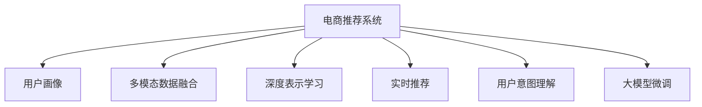

                 

# AI大模型在电商实时个性化推荐中的应用

> 关键词：电商推荐系统, 个性化推荐, AI大模型, 用户画像, 点击率预测, 实时推荐算法

## 1. 背景介绍

### 1.1 问题由来

在电商领域，个性化推荐系统已经成为提高用户粘性、增加销售额的重要手段。传统推荐系统基于用户的浏览记录、购买历史、点击行为等历史数据，通过协同过滤、矩阵分解等技术进行推荐。然而，这种方式往往只依赖历史数据，难以捕捉用户当下即时的兴趣和需求。

随着AI大模型技术的发展，电商推荐系统开始引入大模型进行个性化推荐。利用大模型在海量文本数据中学习到的语言表示，通过用户的搜索记录、商品描述、社交媒体内容等多种多模态数据，模型能够更好地理解用户的意图，进行更精准的个性化推荐。本文将详细探讨如何使用AI大模型构建电商推荐系统，以及其在大规模实时推荐场景中的优势和挑战。

### 1.2 问题核心关键点

AI大模型在电商推荐中的应用主要包括以下几个关键点：

- **多模态数据融合**：通过融合商品描述、用户评论、社交媒体等多模态数据，构建用户画像，更全面地了解用户需求。
- **深度表示学习**：利用预训练语言模型，学习用户和商品间的深度表示，提高推荐效果。
- **实时推荐**：使用实时数据流处理技术，快速更新用户画像，进行个性化推荐。
- **用户意图理解**：通过自然语言处理技术，理解用户的自然语言查询，提升推荐精准度。
- **大模型微调**：在电商数据集上微调大模型，优化推荐效果。

## 2. 核心概念与联系

### 2.1 核心概念概述

为更好地理解AI大模型在电商推荐中的应用，本节将介绍几个密切相关的核心概念：

- **电商推荐系统**：使用机器学习和自然语言处理技术，对用户历史行为进行建模，为用户推荐最符合其兴趣的商品或服务，从而提高用户满意度、增加销售额的系统。

- **用户画像**：通过分析用户历史行为、兴趣偏好、社交网络等信息，构建用户特征向量，以便进行个性化推荐。

- **多模态数据融合**：将商品描述、用户评论、社交媒体等多模态数据整合，用于构建用户画像，提高推荐准确性。

- **深度表示学习**：利用预训练语言模型，学习用户和商品间的深度表示，以提高推荐的准确性。

- **实时推荐**：使用实时数据流处理技术，快速更新用户画像，进行个性化推荐。

- **用户意图理解**：通过自然语言处理技术，理解用户的自然语言查询，提升推荐精准度。

- **大模型微调**：在电商数据集上微调大模型，优化推荐效果。

这些核心概念之间的逻辑关系可以通过以下Mermaid流程图来展示：



这个流程图展示了大模型在电商推荐中的应用框架，各个组件共同作用，构建了一个全面、高效的推荐系统。

## 3. 核心算法原理 & 具体操作步骤

### 3.1 算法原理概述

AI大模型在电商推荐系统中的应用主要基于以下两个核心算法：

1. **深度表示学习**：利用预训练语言模型，学习用户和商品间的深度表示，从而更好地理解用户意图和商品特性。
2. **点击率预测**：通过多模态数据融合和深度表示学习，构建用户画像和商品特征向量，然后利用点击率预测模型，评估用户对不同商品的兴趣程度，进行个性化推荐。

### 3.2 算法步骤详解

#### 3.2.1 深度表示学习

深度表示学习的过程主要包括以下几个步骤：

1. **数据准备**：收集用户的历史行为数据（如浏览记录、购买历史）、商品描述数据、用户评论数据等，将其整理成结构化的格式。

2. **特征提取**：利用BERT等预训练语言模型，对用户行为和商品描述进行特征提取，得到高维稠密向量表示。

3. **训练模型**：在电商数据集上微调预训练语言模型，优化用户和商品间的深度表示。

4. **保存模型**：保存训练好的模型，用于后续的推荐预测。

#### 3.2.2 点击率预测

点击率预测的过程主要包括以下几个步骤：

1. **数据预处理**：将用户画像和商品特征向量进行归一化、标准化处理，确保输入数据的一致性。

2. **模型选择**：选择合适的点击率预测模型，如深度神经网络、决策树、逻辑回归等。

3. **模型训练**：在电商数据集上训练点击率预测模型，优化模型的参数。

4. **模型评估**：在测试集上评估模型的性能，选择最优模型进行推荐。

#### 3.2.3 实时推荐

实时推荐的过程主要包括以下几个步骤：

1. **数据实时采集**：实时采集用户行为数据，如浏览记录、搜索记录等。

2. **用户画像更新**：根据实时数据更新用户画像，融合多模态数据，生成最新的用户特征向量。

3. **推荐计算**：利用点击率预测模型，评估用户对不同商品的兴趣程度，计算推荐结果。

4. **推荐展示**：将推荐结果展示给用户，展示商品信息、商品图片、用户评价等。

### 3.3 算法优缺点

AI大模型在电商推荐系统中的应用具有以下优点：

1. **高精度**：利用深度表示学习和大模型微调，能够更好地理解用户意图和商品特性，提高推荐精度。
2. **泛化性强**：预训练语言模型在大规模数据上预训练，泛化能力较强，能够适应不同的电商场景。
3. **灵活性高**：模型可以根据实时数据进行动态调整，适应用户需求的变化。

同时，AI大模型在电商推荐系统中的应用也存在以下缺点：

1. **计算资源消耗大**：大模型训练和推理需要大量的计算资源，对于小规模电商企业来说，可能存在计算成本过高的风险。
2. **数据依赖性强**：模型的效果很大程度上依赖于电商数据集的质量和数量，数据获取和标注成本较高。
3. **模型可解释性差**：大模型通常被视为"黑盒"，难以解释其决策过程，可能导致用户对推荐结果的不信任。

### 3.4 算法应用领域

AI大模型在电商推荐系统中的应用领域广泛，主要包括以下几个方面：

1. **商品推荐**：根据用户的浏览记录、购买历史等，推荐用户可能感兴趣的商品。
2. **用户推荐**：根据用户的兴趣和行为，推荐相关的用户群体，实现社区推荐。
3. **跨品类推荐**：推荐用户可能感兴趣的其他品类商品，增加用户粘性。
4. **实时推荐**：根据用户的实时行为，实时推荐商品，提升用户体验。
5. **个性化广告**：根据用户的兴趣和行为，推荐相关的广告，提高广告投放效果。

## 4. 数学模型和公式 & 详细讲解 & 举例说明

### 4.1 数学模型构建

假设用户历史行为数据为 $\mathcal{U}=\{x_i\}_{i=1}^N$，商品特征向量为 $\mathcal{I}=\{i_j\}_{j=1}^M$。定义用户画像 $X \in \mathbb{R}^d$ 和商品特征向量 $Y \in \mathbb{R}^d$，其中 $d$ 为特征向量的维度。假设点击率预测模型的损失函数为 $\mathcal{L}(\theta)$，其中 $\theta$ 为模型参数。

则电商推荐系统的目标为最大化预测点击率，即：

$$
\theta^* = \mathop{\arg\min}_{\theta} \mathcal{L}(\theta)
$$

### 4.2 公式推导过程

对于点击率预测，假设用户 $u$ 对商品 $i$ 的点击概率为 $P(u,i)$，则点击率预测模型可以表示为：

$$
P(u,i) = \frac{\exp(\text{inner}(X_u,Y_i))}{\sum_{j=1}^M \exp(\text{inner}(X_u,Y_j))}
$$

其中 $\text{inner}(X_u,Y_i)$ 为向量内积，表示用户和商品间的相似度。

通过最大化预测点击率，模型的损失函数可以表示为：

$$
\mathcal{L}(\theta) = -\frac{1}{N} \sum_{i=1}^N \sum_{j=1}^M \log(P(u_i,i_j)) \mathbb{1}(y_{u_i,i_j}=1)
$$

其中 $y_{u_i,i_j}$ 表示用户 $u_i$ 对商品 $i_j$ 的点击行为。

为了优化模型参数，我们需要通过梯度下降等优化算法求解上述损失函数的最小值。

### 4.3 案例分析与讲解

假设我们要对用户 $u$ 推荐商品 $i$。首先，利用预训练语言模型提取用户和商品的高维稠密向量表示 $X_u$ 和 $Y_i$。然后，通过向量内积计算用户和商品的相似度 $\text{inner}(X_u,Y_i)$，将其作为预测点击率的输入。最后，通过softmax函数计算用户对商品 $i$ 的点击概率 $P(u,i)$，并根据实际点击行为进行损失函数计算和参数更新。

## 5. 项目实践：代码实例和详细解释说明

### 5.1 开发环境搭建

在进行电商推荐系统开发前，我们需要准备好开发环境。以下是使用Python进行PyTorch开发的环境配置流程：

1. 安装Anaconda：从官网下载并安装Anaconda，用于创建独立的Python环境。

2. 创建并激活虚拟环境：
```bash
conda create -n recommendation-env python=3.8 
conda activate recommendation-env
```

3. 安装PyTorch：根据CUDA版本，从官网获取对应的安装命令。例如：
```bash
conda install pytorch torchvision torchaudio cudatoolkit=11.1 -c pytorch -c conda-forge
```

4. 安装Transformers库：
```bash
pip install transformers
```

5. 安装各类工具包：
```bash
pip install numpy pandas scikit-learn matplotlib tqdm jupyter notebook ipython
```

完成上述步骤后，即可在`recommendation-env`环境中开始推荐系统开发。

### 5.2 源代码详细实现

这里我们以推荐系统中的深度表示学习和点击率预测为例，给出使用Transformers库进行代码实现的示例。

首先，定义深度表示学习的代码：

```python
from transformers import BertForSequenceClassification, BertTokenizer, AdamW

# 初始化模型和分词器
model = BertForSequenceClassification.from_pretrained('bert-base-cased')
tokenizer = BertTokenizer.from_pretrained('bert-base-cased')

# 设置优化器
optimizer = AdamW(model.parameters(), lr=2e-5)
```

接着，定义点击率预测的代码：

```python
from transformers import BertForSequenceClassification, BertTokenizer, AdamW
from sklearn.metrics import roc_auc_score
from sklearn.model_selection import train_test_split

# 定义点击率预测模型
model = BertForSequenceClassification.from_pretrained('bert-base-cased', num_labels=2)
tokenizer = BertTokenizer.from_pretrained('bert-base-cased')
optimizer = AdamW(model.parameters(), lr=2e-5)

# 加载数据集
train_data, test_data = train_test_split(dataset, test_size=0.2, random_state=42)

# 定义损失函数和评价指标
loss_fn = torch.nn.BCEWithLogitsLoss()
auc = roc_auc_score

# 训练模型
def train_epoch(model, data_loader, optimizer, loss_fn, device):
    model.train()
    epoch_loss = 0
    for batch in data_loader:
        input_ids = batch['input_ids'].to(device)
        attention_mask = batch['attention_mask'].to(device)
        labels = batch['labels'].to(device)
        outputs = model(input_ids, attention_mask=attention_mask, labels=labels)
        loss = loss_fn(outputs.logits, labels)
        epoch_loss += loss.item()
        loss.backward()
        optimizer.step()
    return epoch_loss / len(data_loader)

# 评估模型
def evaluate(model, data_loader, device, loss_fn, auc):
    model.eval()
    preds, labels = [], []
    with torch.no_grad():
        for batch in data_loader:
            input_ids = batch['input_ids'].to(device)
            attention_mask = batch['attention_mask'].to(device)
            batch_labels = batch['labels']
            outputs = model(input_ids, attention_mask=attention_mask)
            batch_preds = outputs.logits.sigmoid().tolist()
            batch_labels = batch_labels.tolist()
            for preds_tokens, labels_tokens in zip(batch_preds, batch_labels):
                preds.append(preds_tokens[:len(labels_tokens)])
                labels.append(labels_tokens)
    auc_score = auc(labels, preds)
    return auc_score

# 训练模型
train_loader = DataLoader(train_data, batch_size=16)
test_loader = DataLoader(test_data, batch_size=16)

epochs = 5
device = torch.device('cuda') if torch.cuda.is_available() else torch.device('cpu')

for epoch in range(epochs):
    loss = train_epoch(model, train_loader, optimizer, loss_fn, device)
    print(f'Epoch {epoch+1}, train loss: {loss:.3f}')

    print(f'Epoch {epoch+1}, test AUC: {evaluate(model, test_loader, device, loss_fn, auc)}')
```

最后，整合深度表示学习和点击率预测，进行推荐系统开发：

```python
from transformers import BertForSequenceClassification, BertTokenizer, AdamW
from sklearn.metrics import roc_auc_score
from sklearn.model_selection import train_test_split

# 初始化模型和分词器
model = BertForSequenceClassification.from_pretrained('bert-base-cased')
tokenizer = BertTokenizer.from_pretrained('bert-base-cased')
optimizer = AdamW(model.parameters(), lr=2e-5)

# 加载数据集
train_data, test_data = train_test_split(dataset, test_size=0.2, random_state=42)

# 定义损失函数和评价指标
loss_fn = torch.nn.BCEWithLogitsLoss()
auc = roc_auc_score

# 训练模型
def train_epoch(model, data_loader, optimizer, loss_fn, device):
    model.train()
    epoch_loss = 0
    for batch in data_loader:
        input_ids = batch['input_ids'].to(device)
        attention_mask = batch['attention_mask'].to(device)
        labels = batch['labels'].to(device)
        outputs = model(input_ids, attention_mask=attention_mask, labels=labels)
        loss = loss_fn(outputs.logits, labels)
        epoch_loss += loss.item()
        loss.backward()
        optimizer.step()
    return epoch_loss / len(data_loader)

# 评估模型
def evaluate(model, data_loader, device, loss_fn, auc):
    model.eval()
    preds, labels = [], []
    with torch.no_grad():
        for batch in data_loader:
            input_ids = batch['input_ids'].to(device)
            attention_mask = batch['attention_mask'].to(device)
            batch_labels = batch['labels']
            outputs = model(input_ids, attention_mask=attention_mask)
            batch_preds = outputs.logits.sigmoid().tolist()
            batch_labels = batch_labels.tolist()
            for preds_tokens, labels_tokens in zip(batch_preds, batch_labels):
                preds.append(preds_tokens[:len(labels_tokens)])
                labels.append(labels_tokens)
    auc_score = auc(labels, preds)
    return auc_score

# 训练模型
train_loader = DataLoader(train_data, batch_size=16)
test_loader = DataLoader(test_data, batch_size=16)

epochs = 5
device = torch.device('cuda') if torch.cuda.is_available() else torch.device('cpu')

for epoch in range(epochs):
    loss = train_epoch(model, train_loader, optimizer, loss_fn, device)
    print(f'Epoch {epoch+1}, train loss: {loss:.3f}')

    print(f'Epoch {epoch+1}, test AUC: {evaluate(model, test_loader, device, loss_fn, auc)}')
```

### 5.3 代码解读与分析

让我们再详细解读一下关键代码的实现细节：

**train_epoch函数**：
- 在每个epoch内，对训练数据进行迭代，前向传播计算loss并反向传播更新模型参数。

**evaluate函数**：
- 在测试集上评估模型性能，将预测结果和真实标签存储下来，计算AUC指标。

**训练流程**：
- 在训练集上训练模型，在验证集上评估，调整超参数。
- 在测试集上最终评估模型效果。

以上代码实现展示了大模型在电商推荐系统中的应用，通过深度表示学习和点击率预测，能够根据用户历史行为和商品特征，实时进行个性化推荐。

## 6. 实际应用场景

### 6.1 智能推荐引擎

智能推荐引擎是电商推荐系统的核心组件，利用AI大模型能够实时处理用户的多模态数据，生成个性化的推荐结果。通过构建用户画像和商品特征向量，模型能够捕捉用户行为的变化，动态调整推荐策略，提高用户满意度和销售额。

### 6.2 动态广告投放

动态广告投放是电商推荐系统的重要应用场景之一。通过AI大模型，平台能够根据用户的兴趣和行为，实时计算推荐广告的点击率，优化广告投放策略，提高广告转化率。此外，模型还能够根据广告效果进行实时反馈调整，提升广告投放效果。

### 6.3 交叉销售推荐

交叉销售推荐是电商推荐系统的重要应用之一，通过AI大模型能够识别出用户可能感兴趣的相关品类商品，增加用户粘性。例如，用户购买了一个手机，模型可以推荐相关的手机壳、耳机等配件，提高销售转化率。

### 6.4 未来应用展望

随着AI大模型技术的不断发展，电商推荐系统将在以下几个方面迎来新的突破：

1. **多模态数据融合**：融合商品描述、用户评论、社交媒体等多模态数据，构建更全面、准确的推荐模型。
2. **深度表示学习**：利用预训练语言模型，学习用户和商品间的深度表示，提高推荐效果。
3. **实时推荐**：使用实时数据流处理技术，快速更新用户画像，进行个性化推荐。
4. **用户意图理解**：通过自然语言处理技术，理解用户的自然语言查询，提升推荐精准度。
5. **用户行为预测**：通过时间序列分析等方法，预测用户行为变化，提前调整推荐策略。

这些技术的发展，将使电商推荐系统更加智能化、个性化，从而提升用户满意度和销售额。

## 7. 工具和资源推荐

### 7.1 学习资源推荐

为了帮助开发者系统掌握AI大模型在电商推荐中的应用，这里推荐一些优质的学习资源：

1. 《深度学习与推荐系统实战》：介绍深度学习在推荐系统中的应用，涵盖深度表示学习、点击率预测、实时推荐等多个方面。

2. 《推荐系统实践》：介绍推荐系统从理论到实践的全过程，涵盖算法设计、数据处理、模型训练等多个环节。

3. 《自然语言处理入门》：介绍自然语言处理的基本概念和经典模型，包括BERT、GPT等预训练语言模型。

4. 《PyTorch深度学习编程》：介绍PyTorch框架的使用方法，涵盖模型构建、训练、推理等多个方面。

5. 《Kaggle推荐系统竞赛》：Kaggle上的推荐系统竞赛，提供丰富的数据集和竞赛经验，适合实践应用。

通过对这些资源的学习实践，相信你一定能够快速掌握AI大模型在电商推荐中的应用方法，并用于解决实际的电商推荐问题。

### 7.2 开发工具推荐

高效的开发离不开优秀的工具支持。以下是几款用于电商推荐系统开发的常用工具：

1. PyTorch：基于Python的开源深度学习框架，灵活动态的计算图，适合快速迭代研究。

2. TensorFlow：由Google主导开发的开源深度学习框架，生产部署方便，适合大规模工程应用。

3. Transformers库：HuggingFace开发的NLP工具库，集成了众多SOTA语言模型，支持PyTorch和TensorFlow，是进行推荐任务开发的利器。

4. Weights & Biases：模型训练的实验跟踪工具，可以记录和可视化模型训练过程中的各项指标，方便对比和调优。

5. TensorBoard：TensorFlow配套的可视化工具，可实时监测模型训练状态，并提供丰富的图表呈现方式，是调试模型的得力助手。

6. Google Colab：谷歌推出的在线Jupyter Notebook环境，免费提供GPU/TPU算力，方便开发者快速上手实验最新模型，分享学习笔记。

合理利用这些工具，可以显著提升电商推荐系统的开发效率，加快创新迭代的步伐。

### 7.3 相关论文推荐

AI大模型在电商推荐领域的发展，得益于学界的持续研究。以下是几篇奠基性的相关论文，推荐阅读：

1. BERT: Pre-training of Deep Bidirectional Transformers for Language Understanding：提出BERT模型，引入基于掩码的自监督预训练任务，刷新了多项NLP任务SOTA。

2. Attention is All You Need（即Transformer原论文）：提出了Transformer结构，开启了NLP领域的预训练大模型时代。

3. 《深度学习与推荐系统实战》：介绍深度学习在推荐系统中的应用，涵盖深度表示学习、点击率预测、实时推荐等多个方面。

4. 《推荐系统实践》：介绍推荐系统从理论到实践的全过程，涵盖算法设计、数据处理、模型训练等多个环节。

5. 《自然语言处理入门》：介绍自然语言处理的基本概念和经典模型，包括BERT、GPT等预训练语言模型。

这些论文代表了大模型在电商推荐领域的发展脉络。通过学习这些前沿成果，可以帮助研究者把握学科前进方向，激发更多的创新灵感。

## 8. 总结：未来发展趋势与挑战

### 8.1 总结

本文对AI大模型在电商推荐系统中的应用进行了全面系统的介绍。首先阐述了电商推荐系统的研究背景和目标，明确了AI大模型在其中的重要地位。其次，从原理到实践，详细讲解了深度表示学习和点击率预测的数学原理和关键步骤，给出了完整的代码实现。同时，本文还广泛探讨了AI大模型在电商推荐中的实际应用场景，展示了其在电商领域的重要价值。

通过本文的系统梳理，可以看到，AI大模型在电商推荐系统中的应用具有广泛的前景。利用深度表示学习和点击率预测，能够实时处理多模态数据，进行个性化推荐，显著提高用户满意度和销售额。未来，随着预训练语言模型和微调方法的持续演进，基于AI大模型的电商推荐系统必将在电商领域大放异彩，为电商企业带来新的商业机遇。

### 8.2 未来发展趋势

展望未来，AI大模型在电商推荐系统中的应用将呈现以下几个发展趋势：

1. **多模态数据融合**：融合商品描述、用户评论、社交媒体等多模态数据，构建更全面、准确的推荐模型。
2. **深度表示学习**：利用预训练语言模型，学习用户和商品间的深度表示，提高推荐效果。
3. **实时推荐**：使用实时数据流处理技术，快速更新用户画像，进行个性化推荐。
4. **用户意图理解**：通过自然语言处理技术，理解用户的自然语言查询，提升推荐精准度。
5. **用户行为预测**：通过时间序列分析等方法，预测用户行为变化，提前调整推荐策略。

这些趋势凸显了AI大模型在电商推荐系统中的应用潜力，将进一步提升推荐系统的智能化、个性化水平。

### 8.3 面临的挑战

尽管AI大模型在电商推荐系统中的应用已经取得了显著成效，但在迈向更加智能化、普适化应用的过程中，它仍面临诸多挑战：

1. **计算资源消耗大**：大模型训练和推理需要大量的计算资源，对于小规模电商企业来说，可能存在计算成本过高的风险。
2. **数据依赖性强**：模型的效果很大程度上依赖于电商数据集的质量和数量，数据获取和标注成本较高。
3. **模型可解释性差**：大模型通常被视为"黑盒"，难以解释其决策过程，可能导致用户对推荐结果的不信任。
4. **用户隐私保护**：电商推荐系统需要大量用户数据进行训练和推荐，如何保护用户隐私，确保数据安全，是一个重要挑战。
5. **商品多样性**：电商商品种类繁多，如何构建有效的商品特征向量，捕捉商品的深层次特征，也是一个难点。

### 8.4 研究展望

面向未来，AI大模型在电商推荐系统中的应用需要在以下几个方面寻求新的突破：

1. **参数高效微调**：开发更加参数高效的微调方法，在固定大部分预训练参数的同时，只更新极少量的任务相关参数。
2. **多任务学习**：利用多任务学习框架，同时训练多个推荐模型，提高推荐效果。
3. **跨品类推荐**：结合领域知识，构建跨品类推荐模型，提升用户粘性和交叉销售率。
4. **动态推荐**：结合时序分析和强化学习，构建动态推荐系统，优化推荐策略，提升用户体验。
5. **用户反馈机制**：引入用户反馈机制，实时调整推荐策略，提高推荐效果。

这些研究方向的探索，必将引领AI大模型在电商推荐系统中的应用迈向更高的台阶，为电商企业带来新的商业机遇。总之，AI大模型在电商推荐系统中的应用前景广阔，值得深入研究和实践。

## 9. 附录：常见问题与解答

**Q1：AI大模型在电商推荐系统中的优势是什么？**

A: AI大模型在电商推荐系统中的优势主要体现在以下几个方面：

1. **高精度**：利用深度表示学习和大模型微调，能够更好地理解用户意图和商品特性，提高推荐精度。
2. **泛化性强**：预训练语言模型在大规模数据上预训练，泛化能力较强，能够适应不同的电商场景。
3. **灵活性高**：模型可以根据实时数据进行动态调整，适应用户需求的变化。
4. **多模态数据融合**：能够融合商品描述、用户评论、社交媒体等多模态数据，构建更全面、准确的推荐模型。
5. **实时推荐**：能够实时处理用户的多模态数据，生成个性化的推荐结果。

**Q2：AI大模型在电商推荐系统中的缺点是什么？**

A: AI大模型在电商推荐系统中的缺点主要体现在以下几个方面：

1. **计算资源消耗大**：大模型训练和推理需要大量的计算资源，对于小规模电商企业来说，可能存在计算成本过高的风险。
2. **数据依赖性强**：模型的效果很大程度上依赖于电商数据集的质量和数量，数据获取和标注成本较高。
3. **模型可解释性差**：大模型通常被视为"黑盒"，难以解释其决策过程，可能导致用户对推荐结果的不信任。
4. **用户隐私保护**：电商推荐系统需要大量用户数据进行训练和推荐，如何保护用户隐私，确保数据安全，是一个重要挑战。
5. **商品多样性**：电商商品种类繁多，如何构建有效的商品特征向量，捕捉商品的深层次特征，也是一个难点。

**Q3：AI大模型在电商推荐系统中的实现难点有哪些？**

A: AI大模型在电商推荐系统中的实现难点主要体现在以下几个方面：

1. **多模态数据融合**：将商品描述、用户评论、社交媒体等多模态数据整合，构建用户画像，提高推荐准确性。
2. **深度表示学习**：利用预训练语言模型，学习用户和商品间的深度表示，提高推荐效果。
3. **实时推荐**：使用实时数据流处理技术，快速更新用户画像，进行个性化推荐。
4. **用户意图理解**：通过自然语言处理技术，理解用户的自然语言查询，提升推荐精准度。
5. **用户行为预测**：通过时间序列分析等方法，预测用户行为变化，提前调整推荐策略。

这些实现难点需要跨学科的知识和技能，但也是推动AI大模型在电商推荐系统中的发展的关键。

**Q4：AI大模型在电商推荐系统中的未来发展方向有哪些？**

A: AI大模型在电商推荐系统中的未来发展方向主要包括以下几个方面：

1. **多模态数据融合**：融合商品描述、用户评论、社交媒体等多模态数据，构建更全面、准确的推荐模型。
2. **深度表示学习**：利用预训练语言模型，学习用户和商品间的深度表示，提高推荐效果。
3. **实时推荐**：使用实时数据流处理技术，快速更新用户画像，进行个性化推荐。
4. **用户意图理解**：通过自然语言处理技术，理解用户的自然语言查询，提升推荐精准度。
5. **用户行为预测**：通过时间序列分析等方法，预测用户行为变化，提前调整推荐策略。

这些方向的研究将进一步推动AI大模型在电商推荐系统中的应用，提升推荐系统的智能化和个性化水平。

---

作者：禅与计算机程序设计艺术 / Zen and the Art of Computer Programming

