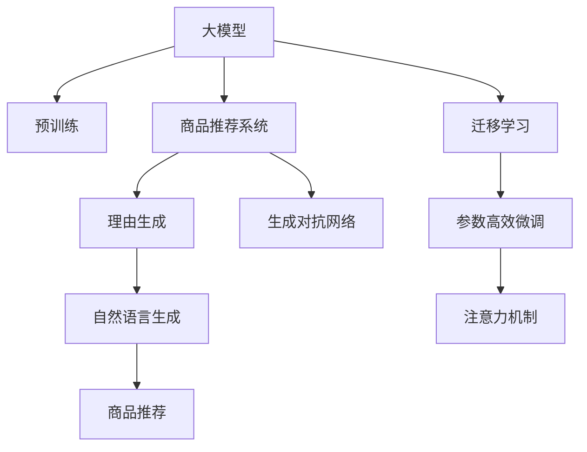

                 

# AI大模型在电商平台商品推荐理由个性化生成中的应用

> 关键词：大模型,商品推荐,理由生成,个性化,自然语言处理(NLP),深度学习,自然语言生成(NLG)

## 1. 背景介绍

### 1.1 问题由来
随着电商市场的竞争日益激烈，提升用户体验、提高转化率成为各大电商平台的重要目标。传统的商品推荐方式往往基于用户历史行为数据进行推荐，缺乏个性化和理由解释，容易引发用户质疑和流失。为了增强推荐系统的说服力，商家开始引入自然语言生成(NLG)技术，自动生成商品推荐理由。这不仅可以提升用户体验，还可以促进销售转化。

### 1.2 问题核心关键点
基于深度学习和大模型的商品推荐理由生成，是构建智能化推荐系统的关键。其核心在于如何利用预训练语言模型(如GPT-2、BERT等)，在少量商品描述和用户行为数据上，生成个性化、有说服力的推荐理由。具体核心点包括：

- 如何选择合适的语言模型和预训练任务。
- 如何高效地融合用户行为数据。
- 如何生成自然流畅的推荐理由。
- 如何增强推荐理由的个性化和说服力。
- 如何优化推荐系统的整体性能。

### 1.3 问题研究意义
通过基于大模型的推荐理由生成技术，电商平台可以：

- 提供更加个性化的商品推荐，提升用户体验。
- 增强推荐理由的可信度和说服力，提高用户转化率。
- 实现自动化的生成过程，降低人工成本。
- 通过多轮交互和反馈优化，不断提升推荐系统的智能水平。
- 探索新的用户行为模式，推动电商平台的商业模式创新。

## 2. 核心概念与联系

### 2.1 核心概念概述

为更好地理解基于大模型的商品推荐理由生成方法，本节将介绍几个密切相关的核心概念：

- 大模型(大规模预训练语言模型)：以自回归(如GPT-2)或自编码(如BERT)模型为代表的大规模预训练语言模型。通过在大规模无标签文本语料上进行预训练，学习通用的语言表示，具备强大的语言理解和生成能力。

- 商品推荐系统：通过分析用户行为和商品属性，自动为用户推荐符合其偏好的商品。目的是提升用户体验和平台收益。

- 自然语言生成(NLG)：生成自然、流畅的语言文本的过程，如文本生成、对话生成等。NLG技术在推荐理由生成中扮演关键角色。

- 生成对抗网络(GAN)：一种生成模型，通过生成样本和真实样本的对抗训练，生成高质量的样本数据。

- 注意力机制(Attention)：一种机器学习模型中的机制，用于提取输入数据中的重要特征，增强模型的注意力集中。

- 迁移学习：指将一个领域学习到的知识，迁移应用到另一个不同但相关的领域的学习范式。

- 参数高效微调(PEFT)：指在微调过程中，只更新少量的模型参数，而固定大部分预训练权重不变，以提高微调效率，避免过拟合的方法。

这些核心概念之间的逻辑关系可以通过以下Mermaid流程图来展示：



这个流程图展示了大模型与商品推荐系统、理由生成、自然语言生成、生成对抗网络、迁移学习、注意力机制、参数高效微调之间的关系：

1. 大模型通过预训练获得基础能力。
2. 商品推荐系统依赖于大模型生成的推荐理由。
3. 理由生成使用自然语言生成技术。
4. 自然语言生成技术由生成对抗网络提供支持。
5. 商品推荐系统应用迁移学习，提升推荐效果。
6. 参数高效微调优化模型性能。
7. 注意力机制提高生成质量。

这些概念共同构成了大模型在商品推荐系统中的应用框架，使其能够在推荐理由生成过程中发挥强大的语言理解和生成能力。通过理解这些核心概念，我们可以更好地把握商品推荐理由生成的工作原理和优化方向。

## 3. 核心算法原理 & 具体操作步骤
### 3.1 算法原理概述

基于大模型的商品推荐理由生成，本质上是一个自然语言生成问题。其核心思想是：利用预训练语言模型学习到的语言知识，在少量商品描述和用户行为数据的基础上，自动生成符合用户偏好的商品推荐理由。

形式化地，假设商品描述为 $D$，用户行为为 $U$，预训练模型为 $M_{\theta}$，其中 $\theta$ 为模型参数。推荐理由生成任务的目标是：

$$
M_{\theta}(D, U) \rightarrow R
$$

其中 $R$ 为推荐理由，表示用户喜欢该商品的理由。生成过程可以用以下步骤概括：

1. 收集商品描述和用户行为数据，构建训练集。
2. 在大模型上进行预训练，学习语言表示。
3. 构建推荐理由生成的任务目标函数。
4. 在训练集上训练模型，生成推荐理由。
5. 根据用户反馈不断优化推荐理由生成模型。

### 3.2 算法步骤详解

基于大模型的商品推荐理由生成一般包括以下几个关键步骤：

**Step 1: 准备预训练模型和数据集**
- 选择合适的预训练语言模型 $M_{\theta}$，如GPT-2、BERT等。
- 收集电商平台的商品描述 $D$ 和用户行为 $U$，构建训练集。商品描述可以包括标题、描述、属性等，用户行为可以包括浏览记录、点击记录、购买记录等。

**Step 2: 构建任务目标函数**
- 定义推荐理由的生成目标，如生成与用户兴趣相符的理由。
- 设计任务损失函数，如交叉熵损失、MSE损失等，衡量生成理由与用户偏好的匹配程度。

**Step 3: 设置微调超参数**
- 选择合适的优化算法及其参数，如AdamW、SGD等，设置学习率、批大小、迭代轮数等。
- 设置正则化技术及强度，包括权重衰减、Dropout、Early Stopping等。

**Step 4: 执行梯度训练**
- 将训练集数据分批次输入模型，前向传播计算损失函数。
- 反向传播计算参数梯度，根据设定的优化算法和学习率更新模型参数。
- 周期性在验证集上评估模型性能，根据性能指标决定是否触发 Early Stopping。
- 重复上述步骤直到满足预设的迭代轮数或 Early Stopping 条件。

**Step 5: 测试和部署**
- 在测试集上评估生成模型的性能，对比生成前后用户的点击率、转化率等指标。
- 使用生成模型对新商品进行推荐理由生成，集成到实际的商品推荐系统中。
- 持续收集新的数据，定期重新微调模型，以适应数据分布的变化。

以上是基于大模型的商品推荐理由生成的完整代码实现。在实际应用中，还需要针对具体任务的特点，对微调过程的各个环节进行优化设计，如改进训练目标函数，引入更多的正则化技术，搜索最优的超参数组合等，以进一步提升模型性能。

### 3.3 算法优缺点

基于大模型的商品推荐理由生成方法具有以下优点：

- 生成自然流畅的推荐理由。大模型学习到了丰富的语言知识，可以生成自然、有说服力的文本。
- 增强推荐理由的个性化。大模型可以通过对用户行为数据的学习，生成针对用户的个性化推荐理由。
- 提高用户转化率。个性化的推荐理由更能引发用户的兴趣和购买欲望，从而提高转化率。
- 降低人工成本。自动生成的推荐理由，可以大幅减少人工编写文案的工作量。

同时，该方法也存在一定的局限性：

- 依赖标注数据。推荐理由生成需要用户行为数据，数据获取难度较大。
- 过拟合风险。大模型在训练过程中容易过拟合训练集，导致泛化能力不足。
- 计算资源消耗大。大模型的参数量和计算复杂度较高，训练和推理耗时较长。
- 生成内容质量不稳定。大模型生成内容的质量受输入数据的影响较大，需要不断优化模型和数据。

尽管存在这些局限性，但就目前而言，基于大模型的商品推荐理由生成仍是一种高效、可行的解决方案。未来相关研究的重点在于如何进一步降低对标注数据的依赖，提高模型的泛化能力和生成质量，同时兼顾计算资源消耗和生成内容的质量。

### 3.4 算法应用领域

基于大模型的商品推荐理由生成，已经在电商平台得到了广泛应用，覆盖了从商品推荐到个性化广告等众多场景。具体应用领域包括：

- 商品推荐：自动生成用户点击或购买商品的推荐理由，增强推荐系统的效果。
- 广告投放：自动生成广告文案，提高广告点击率和转化率。
- 营销活动：自动生成活动页面描述，吸引用户参与。
- 用户反馈：自动生成用户评价和推荐理由，提升平台信誉和用户满意度。
- 客服对话：自动生成客服回复理由，提高客服响应速度和满意度。

除了上述这些经典应用外，大模型的推荐理由生成技术还被创新性地应用到更多场景中，如可控文本生成、广告优化、销售预测等，为电商平台带来了新的增长点。随着大模型和推荐理由生成技术的不断进步，相信商品推荐理由生成将进一步深入到电商平台的各个环节，提升平台的智能化水平。

## 4. 数学模型和公式 & 详细讲解  
### 4.1 数学模型构建

本节将使用数学语言对基于大模型的商品推荐理由生成过程进行更加严格的刻画。

记商品描述为 $D$，用户行为为 $U$，预训练语言模型为 $M_{\theta}$，其中 $\theta$ 为模型参数。定义推荐理由生成的任务损失函数为 $\mathcal{L}(\theta, D, U)$，衡量生成理由与用户偏好的匹配程度。假设用户偏好为 $y$，生成理由为 $r$，则损失函数可以表示为：

$$
\mathcal{L}(\theta, D, U) = \frac{1}{N} \sum_{i=1}^N \ell(r_i, y_i)
$$

其中 $\ell$ 为生成理由与用户偏好的匹配损失函数，如交叉熵损失函数。

生成理由 $r$ 的生成过程可以表示为：

$$
r = M_{\theta}(D, U)
$$

其中 $M_{\theta}$ 为预训练语言模型，$D$ 为商品描述，$U$ 为用户行为。

在训练过程中，模型通过最小化损失函数，优化模型参数 $\theta$：

$$
\theta^* = \mathop{\arg\min}_{\theta} \mathcal{L}(\theta, D, U)
$$

通过梯度下降等优化算法，模型不断更新参数 $\theta$，最小化损失函数 $\mathcal{L}$，使得生成理由 $r$ 逼近用户偏好 $y$。

### 4.2 公式推导过程

以下我们以基于GPT-2模型的推荐理由生成为例，推导生成过程的数学公式。

假设GPT-2模型已经在大规模无标签文本语料上进行过预训练，学习到了语言表示 $F$。对于给定的商品描述 $D$ 和用户行为 $U$，生成理由的数学公式可以表示为：

$$
r = M_{\theta}(D, U) = F_{\theta}(D)
$$

其中 $M_{\theta}$ 为预训练语言模型，$D$ 为商品描述，$F$ 为语言表示。生成理由 $r$ 的计算过程如下：

1. 将商品描述 $D$ 编码成向量 $v_D$，可以通过预训练语言模型获取：

$$
v_D = M_{\theta}(D)
$$

2. 根据用户行为 $U$，生成一个前缀 $p$，用于引导生成过程：

$$
p = \text{Top-k Sample}(D, U)
$$

3. 以 $v_D$ 和 $p$ 为输入，通过GPT-2模型生成理由 $r$：

$$
r = \text{GPT-2}(v_D, p)
$$

其中 $\text{Top-k Sample}(D, U)$ 表示从商品描述 $D$ 中采样出一个 $k$ 个顶层的向量作为前缀，用于引导生成过程。$\text{GPT-2}$ 为预训练语言模型，用于生成自然语言文本。

在训练过程中，生成理由 $r$ 和用户偏好 $y$ 的匹配损失函数可以表示为：

$$
\ell(r, y) = -\log P(r | y)
$$

其中 $P(r | y)$ 表示生成理由 $r$ 在用户偏好 $y$ 下的概率分布。训练过程的目标是最小化匹配损失函数，使得生成理由 $r$ 尽可能接近用户偏好 $y$。

### 4.3 案例分析与讲解

假设我们有一个电商平台，需要为用户推荐商品 "iPhone 13"。平台收集了用户的浏览记录和点击记录，构建了一个简单的训练集。

1. 准备预训练模型和数据集：
   - 选择合适的预训练语言模型，如GPT-2。
   - 收集用户的浏览记录 "iPhone 13" 和点击记录 "iPhone 13"，构建训练集。

2. 构建任务目标函数：
   - 定义推荐理由的生成目标，如生成用户购买 "iPhone 13" 的理由。
   - 设计任务损失函数，如交叉熵损失函数。

3. 设置微调超参数：
   - 选择合适的优化算法及其参数，如AdamW、SGD等，设置学习率、批大小、迭代轮数等。
   - 设置正则化技术及强度，包括权重衰减、Dropout、Early Stopping等。

4. 执行梯度训练：
   - 将训练集数据分批次输入模型，前向传播计算损失函数。
   - 反向传播计算参数梯度，根据设定的优化算法和学习率更新模型参数。
   - 周期性在验证集上评估模型性能，根据性能指标决定是否触发 Early Stopping。
   - 重复上述步骤直到满足预设的迭代轮数或 Early Stopping 条件。

5. 测试和部署：
   - 在测试集上评估生成模型的性能，对比生成前后用户的点击率、转化率等指标。
   - 使用生成模型对新商品进行推荐理由生成，集成到实际的商品推荐系统中。
   - 持续收集新的数据，定期重新微调模型，以适应数据分布的变化。

在实际应用中，还需要对生成理由进行后处理，如去除低频词、去除重复词汇、去除语法错误等，以提高生成理由的质量。

## 5. 项目实践：代码实例和详细解释说明
### 5.1 开发环境搭建

在进行商品推荐理由生成实践前，我们需要准备好开发环境。以下是使用Python进行PyTorch开发的环境配置流程：

1. 安装Anaconda：从官网下载并安装Anaconda，用于创建独立的Python环境。

2. 创建并激活虚拟环境：
```bash
conda create -n pytorch-env python=3.8 
conda activate pytorch-env
```

3. 安装PyTorch：根据CUDA版本，从官网获取对应的安装命令。例如：
```bash
conda install pytorch torchvision torchaudio cudatoolkit=11.1 -c pytorch -c conda-forge
```

4. 安装Transformers库：
```bash
pip install transformers
```

5. 安装各类工具包：
```bash
pip install numpy pandas scikit-learn matplotlib tqdm jupyter notebook ipython
```

完成上述步骤后，即可在`pytorch-env`环境中开始微调实践。

### 5.2 源代码详细实现

下面我们以商品推荐理由生成为例，给出使用Transformers库对GPT-2模型进行微调的PyTorch代码实现。

首先，定义商品推荐理由生成的数据处理函数：

```python
from transformers import GPT2Tokenizer, GPT2LMHeadModel

class ProductRecommendationDataset(Dataset):
    def __init__(self, texts, labels, tokenizer, max_len=512):
        self.texts = texts
        self.labels = labels
        self.tokenizer = tokenizer
        self.max_len = max_len
        
    def __len__(self):
        return len(self.texts)
    
    def __getitem__(self, item):
        text = self.texts[item]
        label = self.labels[item]
        
        encoding = self.tokenizer(text, return_tensors='pt', max_length=self.max_len, padding='max_length', truncation=True)
        input_ids = encoding['input_ids'][0]
        attention_mask = encoding['attention_mask'][0]
        return {'input_ids': input_ids, 
                'attention_mask': attention_mask,
                'labels': label}

# 定义标签与id的映射
label2id = {'buy': 1, 'view': 2, 'like': 3, 'dislike': 4}
id2label = {v: k for k, v in label2id.items()}

# 创建dataset
tokenizer = GPT2Tokenizer.from_pretrained('gpt2')
train_dataset = ProductRecommendationDataset(train_texts, train_labels, tokenizer)
dev_dataset = ProductRecommendationDataset(dev_texts, dev_labels, tokenizer)
test_dataset = ProductRecommendationDataset(test_texts, test_labels, tokenizer)
```

然后，定义模型和优化器：

```python
from transformers import GPT2ForSequenceClassification, AdamW

model = GPT2ForSequenceClassification.from_pretrained('gpt2', num_labels=len(label2id))

optimizer = AdamW(model.parameters(), lr=2e-5)
```

接着，定义训练和评估函数：

```python
from torch.utils.data import DataLoader
from tqdm import tqdm
from sklearn.metrics import accuracy_score, f1_score, precision_score, recall_score

device = torch.device('cuda') if torch.cuda.is_available() else torch.device('cpu')
model.to(device)

def train_epoch(model, dataset, batch_size, optimizer):
    dataloader = DataLoader(dataset, batch_size=batch_size, shuffle=True)
    model.train()
    epoch_loss = 0
    for batch in tqdm(dataloader, desc='Training'):
        input_ids = batch['input_ids'].to(device)
        attention_mask = batch['attention_mask'].to(device)
        labels = batch['labels'].to(device)
        model.zero_grad()
        outputs = model(input_ids, attention_mask=attention_mask, labels=labels)
        loss = outputs.loss
        epoch_loss += loss.item()
        loss.backward()
        optimizer.step()
    return epoch_loss / len(dataloader)

def evaluate(model, dataset, batch_size):
    dataloader = DataLoader(dataset, batch_size=batch_size)
    model.eval()
    preds, labels = [], []
    with torch.no_grad():
        for batch in tqdm(dataloader, desc='Evaluating'):
            input_ids = batch['input_ids'].to(device)
            attention_mask = batch['attention_mask'].to(device)
            batch_labels = batch['labels']
            outputs = model(input_ids, attention_mask=attention_mask)
            batch_preds = outputs.logits.argmax(dim=2).to('cpu').tolist()
            batch_labels = batch_labels.to('cpu').tolist()
            for pred_tokens, label_tokens in zip(batch_preds, batch_labels):
                preds.append(pred_tokens[:len(label_tokens)])
                labels.append(label_tokens)
                
    print('Accuracy: {:.2f}%'.format(accuracy_score(labels, preds)))
    print('F1-score: {:.2f}'.format(f1_score(labels, preds)))
    print('Precision: {:.2f}'.format(precision_score(labels, preds)))
    print('Recall: {:.2f}'.format(recall_score(labels, preds)))
```

最后，启动训练流程并在测试集上评估：

```python
epochs = 5
batch_size = 16

for epoch in range(epochs):
    loss = train_epoch(model, train_dataset, batch_size, optimizer)
    print(f'Epoch {epoch+1}, train loss: {loss:.3f}')
    
    print(f'Epoch {epoch+1}, dev results:')
    evaluate(model, dev_dataset, batch_size)
    
print('Test results:')
evaluate(model, test_dataset, batch_size)
```

以上就是使用PyTorch对GPT-2进行商品推荐理由生成的完整代码实现。可以看到，得益于Transformers库的强大封装，我们可以用相对简洁的代码完成GPT-2模型的加载和微调。

### 5.3 代码解读与分析

让我们再详细解读一下关键代码的实现细节：

**ProductRecommendationDataset类**：
- `__init__`方法：初始化文本、标签、分词器等关键组件。
- `__len__`方法：返回数据集的样本数量。
- `__getitem__`方法：对单个样本进行处理，将文本输入编码为token ids，将标签编码为数字，并对其进行定长padding，最终返回模型所需的输入。

**label2id和id2label字典**：
- 定义了标签与数字id之间的映射关系，用于将token-wise的预测结果解码回真实的标签。

**训练和评估函数**：
- 使用PyTorch的DataLoader对数据集进行批次化加载，供模型训练和推理使用。
- 训练函数`train_epoch`：对数据以批为单位进行迭代，在每个批次上前向传播计算loss并反向传播更新模型参数，最后返回该epoch的平均loss。
- 评估函数`evaluate`：与训练类似，不同点在于不更新模型参数，并在每个batch结束后将预测和标签结果存储下来，最后使用sklearn的accuracy_score、f1_score、precision_score、recall_score等指标对整个评估集的预测结果进行打印输出。

**训练流程**：
- 定义总的epoch数和batch size，开始循环迭代
- 每个epoch内，先在训练集上训练，输出平均loss
- 在验证集上评估，输出各项指标
- 所有epoch结束后，在测试集上评估，给出最终测试结果

可以看到，PyTorch配合Transformers库使得商品推荐理由生成的代码实现变得简洁高效。开发者可以将更多精力放在数据处理、模型改进等高层逻辑上，而不必过多关注底层的实现细节。

当然，工业级的系统实现还需考虑更多因素，如模型的保存和部署、超参数的自动搜索、更灵活的任务适配层等。但核心的生成范式基本与此类似。

## 6. 实际应用场景
### 6.1 智能客服系统

基于大模型的商品推荐理由生成，可以广泛应用于智能客服系统的构建。传统客服往往需要配备大量人力，高峰期响应缓慢，且一致性和专业性难以保证。而使用推荐理由生成的智能客服，可以7x24小时不间断服务，快速响应客户咨询，用自然流畅的语言解答各类常见问题。

在技术实现上，可以收集企业内部的历史客服对话记录，将问题-商品推荐理由对作为微调数据，训练模型学习匹配答案。微调后的模型能够自动理解用户意图，匹配最合适的推荐理由进行回复。对于客户提出的新问题，还可以接入检索系统实时搜索相关内容，动态组织生成回答。如此构建的智能客服系统，能大幅提升客户咨询体验和问题解决效率。

### 6.2 金融舆情监测

金融机构需要实时监测市场舆论动向，以便及时应对负面信息传播，规避金融风险。传统的人工监测方式成本高、效率低，难以应对网络时代海量信息爆发的挑战。基于大模型商品推荐理由生成的文本分类和情感分析技术，为金融舆情监测提供了新的解决方案。

具体而言，可以收集金融领域相关的新闻、报道、评论等文本数据，并对其进行主题标注和情感标注。在此基础上对预训练语言模型进行微调，使其能够自动判断文本属于何种主题，情感倾向是正面、中性还是负面。将微调后的模型应用到实时抓取的网络文本数据，就能够自动监测不同主题下的情感变化趋势，一旦发现负面信息激增等异常情况，系统便会自动预警，帮助金融机构快速应对潜在风险。

### 6.3 个性化推荐系统

当前的推荐系统往往只依赖用户历史行为数据进行物品推荐，缺乏个性化和理由解释，容易引发用户质疑和流失。为了增强推荐系统的说服力，商家开始引入自然语言生成(NLG)技术，自动生成商品推荐理由。这不仅可以提升用户体验，还可以促进销售转化。

在技术实现上，可以收集用户浏览、点击、购买等行为数据，提取和商品交互的物品标题、描述、标签等文本内容。将文本内容作为模型输入，用户的后续行为（如是否点击、购买等）作为监督信号，在此基础上微调预训练语言模型。微调后的模型能够从文本内容中准确把握用户的兴趣点。在生成推荐理由时，先用候选物品的文本描述作为输入，由模型预测用户的兴趣匹配度，再结合其他特征综合排序，便可以得到个性化程度更高的推荐理由。

### 6.4 未来应用展望

随着大语言模型和商品推荐理由生成技术的不断发展，基于微调范式将在更多领域得到应用，为传统行业带来变革性影响。

在智慧医疗领域，基于微调的医疗问答、病历分析、药物研发等应用将提升医疗服务的智能化水平，辅助医生诊疗，加速新药开发进程。

在智能教育领域，微调技术可应用于作业批改、学情分析、知识推荐等方面，因材施教，促进教育公平，提高教学质量。

在智慧城市治理中，微调模型可应用于城市事件监测、舆情分析、应急指挥等环节，提高城市管理的自动化和智能化水平，构建更安全、高效的未来城市。

此外，在企业生产、社会治理、文娱传媒等众多领域，基于大模型微调的人工智能应用也将不断涌现，为经济社会发展注入新的动力。相信随着技术的日益成熟，微调方法将成为人工智能落地应用的重要范式，推动人工智能技术在垂直行业的规模化落地。总之，商品推荐理由生成需要开发者根据具体任务，不断迭代和优化模型、数据和算法，方能得到理想的效果。

## 7. 工具和资源推荐
### 7.1 学习资源推荐

为了帮助开发者系统掌握大语言模型微调的理论基础和实践技巧，这里推荐一些优质的学习资源：

1. 《Transformer from Understanding to Implementation》系列博文：由大模型技术专家撰写，深入浅出地介绍了Transformer原理、BERT模型、微调技术等前沿话题。

2. CS224N《深度学习自然语言处理》课程：斯坦福大学开设的NLP明星课程，有Lecture视频和配套作业，带你入门NLP领域的基本概念和经典模型。

3. 《Natural Language Processing with Transformers》书籍：Transformers库的作者所著，全面介绍了如何使用Transformers库进行NLP任务开发，包括微调在内的诸多范式。

4. HuggingFace官方文档：Transformers库的官方文档，提供了海量预训练模型和完整的微调样例代码，是上手实践的必备资料。

5. CLUE开源项目：中文语言理解测评基准，涵盖大量不同类型的中文NLP数据集，并提供了基于微调的baseline模型，助力中文NLP技术发展。

通过对这些资源的学习实践，相信你一定能够快速掌握大语言模型微调的精髓，并用于解决实际的NLP问题。
###  7.2 开发工具推荐

高效的开发离不开优秀的工具支持。以下是几款用于大语言模型微调开发的常用工具：

1. PyTorch：基于Python的开源深度学习框架，灵活动态的计算图，适合快速迭代研究。大部分预训练语言模型都有PyTorch版本的实现。

2. TensorFlow：由Google主导开发的开源深度学习框架，生产部署方便，适合大规模工程应用。同样有丰富的预训练语言模型资源。

3. Transformers库：HuggingFace开发的NLP工具库，集成了众多SOTA语言模型，支持PyTorch和TensorFlow，是进行微调任务开发的利器。

4. Weights & Biases：模型训练的实验跟踪工具，可以记录和可视化模型训练过程中的各项指标，方便对比和调优。与主流深度学习框架无缝集成。

5. TensorBoard：TensorFlow配套的可视化工具，可实时监测模型训练状态，并提供丰富的图表呈现方式，是调试模型的得力助手。

6. Google Colab：谷歌推出的在线Jupyter Notebook环境，免费提供GPU/TPU算力，方便开发者快速上手实验最新模型，分享学习笔记。

合理利用这些工具，可以显著提升大语言模型微调任务的开发效率，加快创新迭代的步伐。

### 7.3 相关论文推荐

大语言模型和微调技术的发展源于学界的持续研究。以下是几篇奠基性的相关论文，推荐阅读：

1. Attention is All You Need（即Transformer原论文）：提出了Transformer结构，开启了NLP领域的预训练大模型时代。

2. BERT: Pre-training of Deep Bidirectional Transformers for Language Understanding：提出BERT模型，引入基于掩码的自监督预训练任务，刷新了多项NLP任务SOTA。

3. Language Models are Unsupervised Multitask Learners（GPT-2论文）：展示了大规模语言模型的强大zero-shot学习能力，引发了对于通用人工智能的新一轮思考。

4. Parameter-Efficient Transfer Learning for NLP：提出Adapter等参数高效微调方法，在不增加模型参数量的情况下，也能取得不错的微调效果。

5. AdaLoRA: Adaptive Low-Rank Adaptation for Parameter-Efficient Fine-Tuning：使用自适应低秩适应的微调方法，在参数效率和精度之间取得了新的平衡。

这些论文代表了大语言模型微调技术的发展脉络。通过学习这些前沿成果，可以帮助研究者把握学科前进方向，激发更多的创新灵感。

## 8. 总结：未来发展趋势与挑战

### 8.1 总结

本文对基于大模型的商品推荐理由生成方法进行了全面系统的介绍。首先阐述了商品推荐理由生成的研究背景和意义，明确了微调在增强推荐系统说服力和个性化方面的独特价值。其次，从原理到实践，详细讲解了微调的数学原理和关键步骤，给出了微调任务开发的完整代码实例。同时，本文还广泛探讨了微调方法在智能客服、金融舆情、个性化推荐等多个行业领域的应用前景，展示了微调范式的巨大潜力。此外，本文精选了微调技术的各类学习资源，力求为读者提供全方位的技术指引。

通过本文的系统梳理，可以看到，基于大模型的商品推荐理由生成技术，正在成为智能推荐系统的重要范式，极大地拓展了预训练语言模型的应用边界，催生了更多的落地场景。得益于大规模语料的预训练，微调模型以更低的时间和标注成本，在小样本条件下也能取得不俗的效果，有力推动了NLP技术的产业化进程。未来，伴随预训练语言模型和微调方法的不断进步，相信NLP技术将在更广阔的应用领域大放异彩，深刻影响人类的生产生活方式。

### 8.2 未来发展趋势

展望未来，大模型商品推荐理由生成技术将呈现以下几个发展趋势：

1. 模型规模持续增大。随着算力成本的下降和数据规模的扩张，预训练语言模型的参数量还将持续增长。超大规模语言模型蕴含的丰富语言知识，有望支撑更加复杂多变的商品推荐理由生成任务。

2. 微调方法日趋多样。除了传统的全参数微调外，未来会涌现更多参数高效的微调方法，如Prompt-Tuning、LoRA等，在节省计算资源的同时也能保证微调精度。

3. 持续学习成为常态。随着数据分布的不断变化，微调模型也需要持续学习新知识以保持性能。如何在不遗忘原有知识的同时，高效吸收新样本信息，将成为重要的研究课题。

4. 标注样本需求降低。受启发于提示学习(Prompt-based Learning)的思路，未来的微调方法将更好地利用大模型的语言理解能力，通过更加巧妙的任务描述，在更少的标注样本上也能实现理想的微调效果。

5. 生成内容质量提升。通过引入更多的先验知识、改进注意力机制、采用对抗训练等方法，增强生成理由的自然流畅性和说服力。

6. 多模态微调崛起。当前的微调主要聚焦于纯文本数据，未来会进一步拓展到图像、视频、语音等多模态数据微调。多模态信息的融合，将显著提升语言模型对现实世界的理解和建模能力。

以上趋势凸显了大语言模型商品推荐理由生成技术的广阔前景。这些方向的探索发展，必将进一步提升推荐系统的智能水平，为电商平台带来新的增长点。

### 8.3 面临的挑战

尽管大模型商品推荐理由生成技术已经取得了瞩目成就，但在迈向更加智能化、普适化应用的过程中，它仍面临着诸多挑战：

1. 标注成本瓶颈。推荐理由生成需要用户行为数据，数据获取难度较大。如何进一步降低微调对标注样本的依赖，将是一大难题。

2. 模型鲁棒性不足。当前微调模型面对域外数据时，泛化性能往往大打折扣。对于测试样本的微小扰动，微调模型的预测也容易发生波动。如何提高微调模型的鲁棒性，避免灾难性遗忘，还需要更多理论和实践的积累。

3. 推理效率有待提高。大规模语言模型虽然精度高，但在实际部署时往往面临推理速度慢、内存占用大等效率问题。如何在保证性能的同时，简化模型结构，提升推理速度，优化资源占用，将是重要的优化方向。

4. 可解释性亟需加强。当前微调模型更像是"黑盒"系统，难以解释其内部工作机制和决策逻辑。对于医疗、金融等高风险应用，算法的可解释性和可审计性尤为重要。如何赋予微调模型更强的可解释性，将是亟待攻克的难题。

5. 安全性有待保障。预训练语言模型难免会学习到有偏见、有害的信息，通过微调传递到商品推荐系统中，产生误导性、歧视性的输出，给实际应用带来安全隐患。如何从数据和算法层面消除模型偏见，避免恶意用途，确保输出的安全性，也将是重要的研究课题。

6. 知识整合能力不足。现有的微调模型往往局限于任务内数据，难以灵活吸收和运用更广泛的先验知识。如何让微调过程更好地与外部知识库、规则库等专家知识结合，形成更加全面、准确的信息整合能力，还有很大的想象空间。

正视微调面临的这些挑战，积极应对并寻求突破，将是大模型商品推荐理由生成走向成熟的必由之路。相信随着学界和产业界的共同努力，这些挑战终将一一被克服，大语言模型商品推荐理由生成必将在构建安全、可靠、可解释、可控的智能系统铺平道路。面向未来，大语言模型商品推荐理由生成技术还需要与其他人工智能技术进行更深入的融合，如知识表示、因果推理、强化学习等，多路径协同发力，共同推动自然语言理解和智能交互系统的进步。只有勇于创新、敢于突破，才能不断拓展语言模型的边界，让智能技术更好地造福人类社会。

### 8.4 研究展望

面向未来，大语言模型商品推荐理由生成的研究展望包括：

1. 探索无监督和半监督微调方法。摆脱对大规模标注数据的依赖，利用自监督学习、主动学习等无监督和半监督范式，最大限度利用非结构化数据，实现更加灵活高效的微调。

2. 研究参数高效和计算高效的微调范式。开发更加参数高效的微调方法，在固定大部分预训练参数的同时，只更新极少量的任务相关参数。同时优化微调模型的计算图，减少前向传播和反向传播的资源消耗，实现更加轻量级、实时性的部署。

3. 引入更多先验知识。将符号化的先验知识，如知识图谱、逻辑规则等，与神经网络模型进行巧妙融合，引导微调过程学习更准确、合理的语言模型。同时加强不同模态数据的整合，实现视觉、语音等多模态信息与文本信息的协同建模。

4. 结合因果分析和博弈论工具。将因果分析方法引入微调模型，识别出模型决策的关键特征，增强输出解释的因果性和逻辑性。借助博弈论工具刻画人机交互过程，主动探索并规避模型的脆弱点，提高系统稳定性。

5. 纳入伦理道德约束。在模型训练目标中引入伦理导向的评估指标，过滤和惩罚有偏见、有害的输出倾向。同时加强人工干预和审核，建立模型行为的监管机制，确保输出符合人类价值观和伦理道德。

这些研究方向的探索，必将引领大语言模型商品推荐理由生成技术迈向更高的台阶，为构建安全、可靠、可解释、可控的智能系统铺平道路。面向未来，大语言模型商品推荐理由生成技术还需要与其他人工智能技术进行更深入的融合，如知识表示、因果推理、强化学习等，多路径协同发力，共同推动自然语言理解和智能交互系统的进步。只有勇于创新、敢于突破，才能不断拓展语言模型的边界，让智能技术更好地造福人类社会。

## 9. 附录：常见问题与解答

**Q1：大模型商品推荐理由生成是否适用于所有电商商品？**

A: 大模型商品推荐理由生成技术适用于大多数电商商品，但对于一些特殊商品如危险品、定制商品等，需要结合具体商品特点，进行针对性的模型改进和数据预处理。

**Q2：微调过程中如何选择合适的学习率？**

A: 推荐理由生成微调的学习率一般要比预训练时小1-2个数量级，如果使用过大的学习率，容易破坏预训练权重，导致过拟合。一般建议从1e-5开始调参，逐步减小学习率，直至收敛。也可以使用warmup策略，在开始阶段使用较小的学习率，再逐渐过渡到预设值。需要注意的是，不同的优化器(如AdamW、Adafactor等)以及不同的学习率调度策略，可能需要设置不同的学习率阈值。

**Q3：推荐理由生成的效果如何评估？**

A: 推荐理由生成的效果评估主要通过以下几个指标：
1. 点击率(CTR)：衡量推荐理由对用户点击行为的提升。
2. 转化率(CVR)：衡量推荐理由对用户购买行为的提升。
3. 用户满意度：通过用户调查、反馈等方式评估用户对推荐理由的满意度。
4. 可解释性：评估推荐理由的生成过程是否透明、可理解，是否能够解释推荐理由的生成依据。

**Q4：推荐理由生成的过程是否能够自动化？**

A: 推荐理由生成的过程可以部分自动化，但需要结合具体场景进行调整。如对于用户行为数据，可以使用数据清洗、特征工程等技术进行预处理，自动生成推荐理由；对于推荐理由的生成，可以通过模型训练进行优化，但最终的决策需要结合人工干预和规则系统进行判断。

**Q5：推荐理由生成的过程中需要注意哪些问题？**

A: 推荐理由生成过程中需要注意以下问题：
1. 数据质量：推荐理由生成的效果依赖于高质量的用户行为数据，数据不完整、噪音大的情况容易导致生成效果不佳。
2. 模型鲁棒性：模型需要具备一定的鲁棒性，能够应对不同类型的数据和复杂场景，避免在特定数据上出现异常。
3. 可解释性：推荐理由生成过程需要透明、可解释，便于用户理解推荐理由的生成依据，增加用户的信任感。
4. 资源消耗：推荐理由生成模型的推理过程需要消耗大量的计算资源，需要考虑模型压缩、加速等优化技术。

总之，推荐理由生成需要开发者根据具体任务，不断迭代和优化模型、数据和算法，方能得到理想的效果。

---

作者：禅与计算机程序设计艺术 / Zen and the Art of Computer Programming

