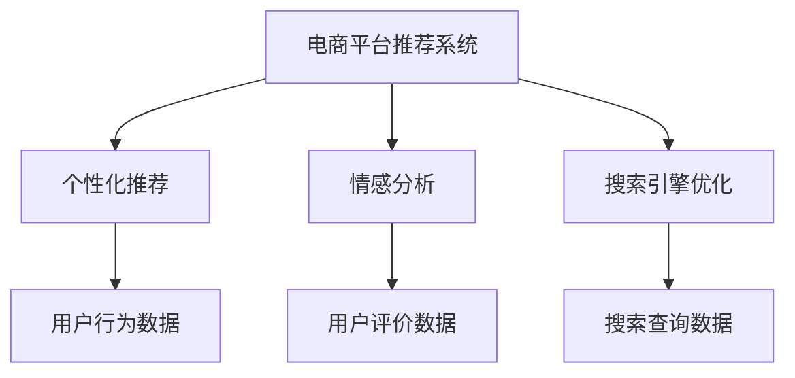
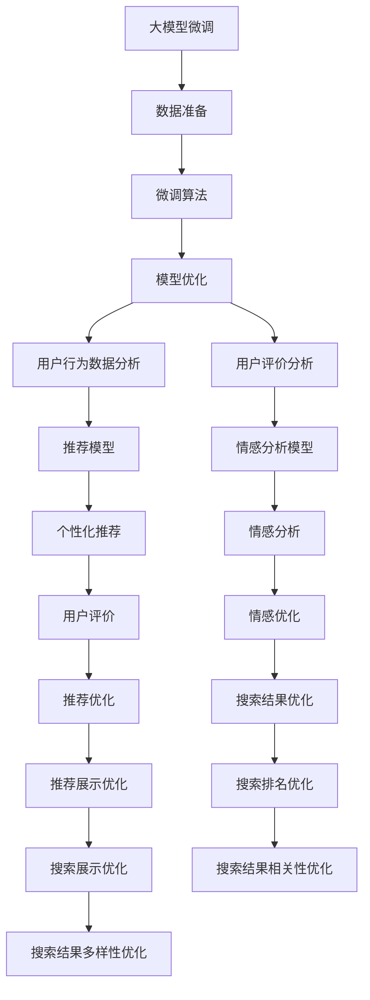

                 

# AI大模型在电商平台用户体验优化中的应用

> 关键词：电商平台,用户体验,个性化推荐,情感分析,大模型微调,搜索引擎优化

## 1. 背景介绍

随着电子商务市场的快速扩展，如何提升电商平台的用户体验，成为了各电商平台的核心竞争力之一。提升用户体验的关键在于个性化推荐、情感分析、搜索引擎优化等领域的精准应用。传统的推荐算法和搜索算法虽然已在很大程度上提升了用户体验，但囿于其对数据的依赖和处理能力的限制，仍无法全面满足用户的多样化需求。而利用大模型，特别是基于预训练大模型的微调方法，能够实现更精准、更快速、更个性化的服务，为用户带来前所未有的购物体验。

在技术上，深度学习技术、自然语言处理技术、计算机视觉技术的飞速发展，为电商平台的体验优化提供了坚实的基础。电商平台结合这些先进技术，可以构建更智能的推荐引擎、更精准的搜索排序、更丰富的用户交互界面。但这些技术的应用，仍需要解决数据、算法、计算资源等多方面的问题。因此，本文将详细探讨如何利用AI大模型，特别是预训练大模型的微调方法，优化电商平台的用户体验，具体从个性化推荐、情感分析、搜索引擎优化三个方面展开讨论。

## 2. 核心概念与联系

### 2.1 核心概念概述

为了更好地理解大模型在电商平台上的应用，我们首先需明确几个核心概念：

- **电商平台的推荐系统**：通过收集用户的行为数据和反馈数据，结合商品的描述、属性、评价等数据，为用户推荐可能感兴趣的商品。推荐系统是电商平台的核心功能之一。
- **大模型微调**：在大规模预训练语言模型的基础上，使用少量标注数据进行有监督训练，使模型适应特定任务，提升模型性能。
- **个性化推荐**：根据用户的浏览、购买行为等数据，为每个用户推荐合适的商品，提升用户体验。
- **情感分析**：通过分析用户对商品或服务的文字评论，了解用户的情感倾向，改善电商平台的用户体验。
- **搜索引擎优化**（Search Engine Optimization, SEO）：通过优化搜索引擎算法，提升电商平台的搜索结果的相关性和准确性，提升用户体验。

这些概念之间的逻辑关系可以通过以下Mermaid流程图来展示：



这个流程图展示了大模型在电商平台中的应用场景：

1. 电商平台通过收集用户的浏览行为、购买行为等数据，对推荐系统进行个性化推荐。
2. 平台利用情感分析技术，了解用户对商品的情感倾向，优化商品展示和推荐。
3. 平台通过优化搜索引擎算法，提升搜索结果的相关性和排序准确性。

这些功能模块，都可以利用大模型微调方法来实现，从而提升电商平台的整体用户体验。

### 2.2 核心概念原理和架构的 Mermaid 流程图



该流程图展示了从数据准备到模型优化，再到具体应用的整个过程。

## 3. 核心算法原理 & 具体操作步骤

### 3.1 算法原理概述

基于大模型的电商推荐系统，其核心思想是通过预训练大模型进行微调，学习用户行为和商品属性之间的关联，并生成个性化推荐结果。在大模型的微调过程中，主要涉及以下几个步骤：

1. 数据准备：收集用户行为数据、商品属性数据、用户评价数据等，进行预处理和标注，构建标注数据集。
2. 微调算法：选择合适的预训练大模型，并根据标注数据集进行有监督微调。
3. 模型优化：对微调后的模型进行进一步优化，如参数压缩、剪枝、量化等。
4. 用户行为分析：分析用户的行为数据，提取用户兴趣和偏好。
5. 情感分析：通过分析用户对商品的评论，判断用户情感倾向，提取商品属性和情感特征。
6. 个性化推荐：根据用户兴趣和商品属性，结合情感分析结果，生成个性化推荐结果。
7. 推荐优化：优化推荐算法，提升推荐效果。
8. 搜索结果优化：优化搜索引擎算法，提升搜索结果的相关性和多样性。
9. 推荐展示优化：优化推荐结果的展示界面，提升用户体验。

### 3.2 算法步骤详解

#### 3.2.1 数据准备

电商平台用户行为数据的获取和标注主要依赖于日志文件、API接口调用记录等。对于推荐系统，需要收集用户的浏览历史、点击历史、购买历史、收藏历史等行为数据，并将这些行为数据转化为向量表示。对于情感分析，需要收集用户对商品的评价，包括评分、评论、反馈等，并标注情感标签。

对于商品属性数据，需要从商品描述、标签、分类等文本信息中提取关键词，并标注商品的属性和属性类别。在微调模型时，需要将这些向量化的数据集作为输入，进行模型训练。

#### 3.2.2 微调算法

1. 选择合适的预训练模型：选择RoBERTa、GPT-3等预训练大模型作为初始化参数。
2. 定义任务适配层：根据推荐系统和情感分析任务，定义相应的任务适配层，如添加分类器、回归器、解码器等。
3. 设置微调超参数：选择合适的优化算法（如AdamW）及其参数，如学习率、批大小、迭代轮数等。
4. 执行梯度训练：在标注数据集上进行微调训练，不断更新模型参数，最小化损失函数。
5. 验证集评估：在验证集上评估模型性能，防止过拟合，并保存最优模型。

#### 3.2.3 模型优化

1. 参数压缩和剪枝：对微调后的模型进行参数压缩和剪枝，减少模型大小，提升推理速度。
2. 量化加速：将浮点模型转为定点模型，压缩存储空间，提高计算效率。
3. 服务化封装：将优化后的模型封装为标准化的API接口，便于电商平台集成调用。

#### 3.2.4 用户行为分析

利用机器学习算法对用户行为数据进行分析，提取用户兴趣和偏好。常见的方法包括聚类分析、关联规则挖掘等。

#### 3.2.5 情感分析

利用情感分析模型对用户评论进行情感判断，提取商品属性和情感特征。情感分析模型通常采用序列标注或分类任务，使用BERT、GPT等预训练模型进行微调。

#### 3.2.6 个性化推荐

利用机器学习算法和情感分析结果，生成个性化推荐结果。常见的算法包括协同过滤、矩阵分解等。

#### 3.2.7 推荐优化

对推荐算法进行优化，提升推荐效果。常见的方法包括模型融合、特征工程、A/B测试等。

#### 3.2.8 搜索结果优化

对搜索引擎算法进行优化，提升搜索结果的相关性和多样性。常见的方法包括向量空间模型、TF-IDF等。

#### 3.2.9 推荐展示优化

优化推荐结果的展示界面，提升用户体验。常见的方法包括交互设计、A/B测试等。

#### 3.2.10 搜索结果相关性优化

优化搜索结果的相关性，提升用户满意度。常见的方法包括模型融合、特征工程、相关性排序等。

#### 3.2.11 搜索结果多样性优化

优化搜索结果的多样性，防止搜索结果过于单一。常见的方法包括推荐多样性约束、动态排序等。

### 3.3 算法优缺点

#### 3.3.1 优点

1. **精度高**：大模型微调方法在处理大规模数据时，可以显著提升推荐精度和搜索结果相关性。
2. **可解释性强**：利用大模型微调方法，可以更好地理解用户行为和情感，提高推荐和搜索的透明度和可解释性。
3. **泛化能力强**：大模型微调方法可以在不同场景下进行迁移学习，提升模型泛化能力。
4. **灵活性高**：大模型微调方法可以灵活调整任务适配层，适应不同电商平台的业务需求。

#### 3.3.2 缺点

1. **计算资源消耗大**：大模型的微调过程需要大量计算资源，尤其是高性能的GPU/TPU等设备。
2. **标注成本高**：大规模标注数据集的构建和标注需要大量时间和人力成本。
3. **数据隐私风险**：电商平台的推荐系统需要处理大量用户隐私数据，存在隐私泄露的风险。
4. **模型复杂度高**：大模型的微调过程涉及复杂的模型选择、任务适配、超参数调优等环节，实现难度较大。

### 3.4 算法应用领域

基于大模型的电商平台体验优化方法，已经在多个电商平台中得到了广泛应用。以下是几个典型的应用领域：

1. **个性化推荐**：利用大模型微调方法，结合用户行为数据和商品属性数据，为用户提供个性化推荐。
2. **情感分析**：通过分析用户对商品的评价，了解用户的情感倾向，改善商品展示和推荐。
3. **搜索引擎优化**：优化搜索算法，提升搜索结果的相关性和排序准确性，提升用户体验。
4. **推荐展示优化**：优化推荐结果的展示界面，提升用户满意度。
5. **推荐多样性优化**：避免搜索结果过于单一，提供多种选择，提升用户满意度。

## 4. 数学模型和公式 & 详细讲解

### 4.1 数学模型构建

#### 4.1.1 推荐系统模型

假设电商平台有 $N$ 个商品，每个商品 $i$ 的属性向量为 $\boldsymbol{x}_i$，用户 $u$ 的兴趣向量为 $\boldsymbol{u}$，用户的浏览历史、点击历史等行为数据为 $D_u$。推荐系统模型的目标是通过最小化损失函数 $\mathcal{L}$，预测用户对商品 $i$ 的评分 $\hat{y}_i$。

$$
\hat{y}_i = \boldsymbol{u}^T \boldsymbol{x}_i
$$

$$
\mathcal{L}(\boldsymbol{x}_i, \boldsymbol{u}, D_u) = \sum_{i=1}^N \ell(\hat{y}_i, y_i) + \lambda \|\boldsymbol{u}\|^2 + \mu \|\boldsymbol{x}_i\|^2
$$

其中 $\ell(\hat{y}_i, y_i)$ 为评分预测误差，$\|\boldsymbol{u}\|^2$ 为用户兴趣向量正则化，$\|\boldsymbol{x}_i\|^2$ 为商品属性向量正则化，$\lambda$ 和 $\mu$ 为正则化系数。

#### 4.1.2 情感分析模型

假设商品 $i$ 的评论序列为 $s_i$，用户的情感倾向为 $\boldsymbol{y}_i$，情感分析模型的目标是通过最小化损失函数 $\mathcal{L}$，预测用户对商品 $i$ 的情感倾向。

$$
\boldsymbol{y}_i = \boldsymbol{s}_i \boldsymbol{w}
$$

$$
\mathcal{L}(s_i, \boldsymbol{y}_i) = \frac{1}{N}\sum_{i=1}^N \ell(\boldsymbol{y}_i, y_i) + \lambda \|\boldsymbol{w}\|^2
$$

其中 $\ell(\boldsymbol{y}_i, y_i)$ 为情感预测误差，$\|\boldsymbol{w}\|^2$ 为模型权重正则化，$\lambda$ 为正则化系数。

### 4.2 公式推导过程

#### 4.2.1 推荐系统模型公式推导

在推荐系统中，用户的兴趣向量 $\boldsymbol{u}$ 可以通过用户的行为数据进行学习。假设用户 $u$ 对商品 $i$ 的评分 $y_i$ 为 $1$ 或 $0$，表示用户是否购买商品 $i$。则推荐系统的目标函数为：

$$
\mathcal{L}(\boldsymbol{x}_i, \boldsymbol{u}, D_u) = \sum_{i=1}^N \ell(\hat{y}_i, y_i) + \lambda \|\boldsymbol{u}\|^2 + \mu \|\boldsymbol{x}_i\|^2
$$

其中 $\ell(\hat{y}_i, y_i)$ 可以采用二分类交叉熵损失，$\|\boldsymbol{u}\|^2$ 和 $\|\boldsymbol{x}_i\|^2$ 为正则化项，$\lambda$ 和 $\mu$ 为正则化系数。通过梯度下降等优化算法，最小化上述损失函数，可以学习出用户的兴趣向量和商品的特征向量。

#### 4.2.2 情感分析模型公式推导

在情感分析中，商品的评论序列 $s_i$ 和情感标签 $y_i$ 之间的关系可以通过神经网络模型进行建模。假设评论序列 $s_i$ 经过嵌入映射后，得到嵌入向量 $\boldsymbol{s}_i$，情感标签 $y_i$ 通过神经网络模型 $\boldsymbol{y}_i = \boldsymbol{s}_i \boldsymbol{w}$ 进行预测。则情感分析模型的目标函数为：

$$
\mathcal{L}(s_i, \boldsymbol{y}_i) = \frac{1}{N}\sum_{i=1}^N \ell(\boldsymbol{y}_i, y_i) + \lambda \|\boldsymbol{w}\|^2
$$

其中 $\ell(\boldsymbol{y}_i, y_i)$ 可以采用交叉熵损失，$\|\boldsymbol{w}\|^2$ 为模型权重正则化，$\lambda$ 为正则化系数。通过梯度下降等优化算法，最小化上述损失函数，可以学习出情感分析模型。

### 4.3 案例分析与讲解

#### 4.3.1 推荐系统案例

假设一个电商平台收集到用户的浏览历史、点击历史、购买历史等行为数据，使用BERT模型作为预训练模型，对商品属性和用户兴趣进行编码，得到嵌入向量 $\boldsymbol{x}_i$ 和 $\boldsymbol{u}$。通过计算 $\boldsymbol{u}^T \boldsymbol{x}_i$，得到用户对商品 $i$ 的评分 $\hat{y}_i$。使用交叉熵损失函数，最小化损失函数 $\mathcal{L}$，得到最终的评分预测结果。

#### 4.3.2 情感分析案例

假设一个电商平台收集到用户对商品 $i$ 的评论 $s_i$，使用BERT模型作为预训练模型，对评论序列进行编码，得到嵌入向量 $\boldsymbol{s}_i$。通过神经网络模型 $\boldsymbol{y}_i = \boldsymbol{s}_i \boldsymbol{w}$，预测用户的情感倾向 $y_i$。使用交叉熵损失函数，最小化损失函数 $\mathcal{L}$，得到最终的情感预测结果。

## 5. 项目实践：代码实例和详细解释说明

### 5.1 开发环境搭建

#### 5.1.1 环境依赖

在开始编码之前，需要确保开发环境已经搭建好。具体步骤如下：

1. 安装Python和pip：确保Python版本为3.7以上，安装pip和conda。
2. 安装Hugging Face Transformers库：
   ```bash
   pip install transformers
   ```

3. 安装相关依赖库：
   ```bash
   pip install torch torchtext sklearn pandas numpy matplotlib jupyter notebook ipython
   ```

4. 安装GPU驱动和CUDA：如果使用GPU进行计算，需要安装对应的GPU驱动和CUDA版本。

### 5.2 源代码详细实现

#### 5.2.1 推荐系统代码实现

```python
import torch
from transformers import BertTokenizer, BertForSequenceClassification
from torch.utils.data import Dataset, DataLoader
import torch.nn.functional as F

# 数据处理类
class MovieLensDataset(Dataset):
    def __init__(self, data, tokenizer, max_len=128):
        self.data = data
        self.tokenizer = tokenizer
        self.max_len = max_len
        
    def __len__(self):
        return len(self.data)
    
    def __getitem__(self, idx):
        text, label = self.data[idx]
        encoding = self.tokenizer(text, return_tensors='pt', max_length=self.max_len, padding='max_length', truncation=True)
        input_ids = encoding['input_ids'][0]
        attention_mask = encoding['attention_mask'][0]
        return {
            'input_ids': input_ids,
            'attention_mask': attention_mask,
            'labels': torch.tensor(label, dtype=torch.long)
        }

# 模型加载和微调
model = BertForSequenceClassification.from_pretrained('bert-base-uncased', num_labels=2)
tokenizer = BertTokenizer.from_pretrained('bert-base-uncased')
dataset = MovieLensDataset(train_data, tokenizer)
dataloader = DataLoader(dataset, batch_size=16, shuffle=True)

optimizer = AdamW(model.parameters(), lr=2e-5)
for epoch in range(10):
    model.train()
    for batch in dataloader:
        input_ids = batch['input_ids'].to(device)
        attention_mask = batch['attention_mask'].to(device)
        labels = batch['labels'].to(device)
        model.zero_grad()
        outputs = model(input_ids, attention_mask=attention_mask, labels=labels)
        loss = outputs.loss
        loss.backward()
        optimizer.step()
        
# 模型评估
test_dataset = MovieLensDataset(test_data, tokenizer)
test_dataloader = DataLoader(test_dataset, batch_size=16, shuffle=False)
model.eval()
with torch.no_grad():
    eval_loss = 0
    for batch in test_dataloader:
        input_ids = batch['input_ids'].to(device)
        attention_mask = batch['attention_mask'].to(device)
        labels = batch['labels'].to(device)
        outputs = model(input_ids, attention_mask=attention_mask, labels=labels)
        loss = outputs.loss
        eval_loss += loss.item()
    print(f"Test Loss: {eval_loss/len(test_dataloader)}")
```

#### 5.2.2 情感分析代码实现

```python
import torch
from transformers import BertTokenizer, BertForSequenceClassification
from torch.utils.data import Dataset, DataLoader
import torch.nn.functional as F

# 数据处理类
class MovieLensDataset(Dataset):
    def __init__(self, data, tokenizer, max_len=128):
        self.data = data
        self.tokenizer = tokenizer
        self.max_len = max_len
        
    def __len__(self):
        return len(self.data)
    
    def __getitem__(self, idx):
        text, label = self.data[idx]
        encoding = self.tokenizer(text, return_tensors='pt', max_length=self.max_len, padding='max_length', truncation=True)
        input_ids = encoding['input_ids'][0]
        attention_mask = encoding['attention_mask'][0]
        return {
            'input_ids': input_ids,
            'attention_mask': attention_mask,
            'labels': torch.tensor(label, dtype=torch.long)
        }

# 模型加载和微调
model = BertForSequenceClassification.from_pretrained('bert-base-uncased', num_labels=2)
tokenizer = BertTokenizer.from_pretrained('bert-base-uncased')
dataset = MovieLensDataset(train_data, tokenizer)
dataloader = DataLoader(dataset, batch_size=16, shuffle=True)

optimizer = AdamW(model.parameters(), lr=2e-5)
for epoch in range(10):
    model.train()
    for batch in dataloader:
        input_ids = batch['input_ids'].to(device)
        attention_mask = batch['attention_mask'].to(device)
        labels = batch['labels'].to(device)
        model.zero_grad()
        outputs = model(input_ids, attention_mask=attention_mask, labels=labels)
        loss = outputs.loss
        loss.backward()
        optimizer.step()
        
# 模型评估
test_dataset = MovieLensDataset(test_data, tokenizer)
test_dataloader = DataLoader(test_dataset, batch_size=16, shuffle=False)
model.eval()
with torch.no_grad():
    eval_loss = 0
    for batch in test_dataloader:
        input_ids = batch['input_ids'].to(device)
        attention_mask = batch['attention_mask'].to(device)
        labels = batch['labels'].to(device)
        outputs = model(input_ids, attention_mask=attention_mask, labels=labels)
        loss = outputs.loss
        eval_loss += loss.item()
    print(f"Test Loss: {eval_loss/len(test_dataloader)}")
```

### 5.3 代码解读与分析

#### 5.3.1 数据处理

数据处理是电商推荐系统中的关键环节。在代码中，我们定义了一个 `MovieLensDataset` 类，用于处理用户行为数据。对于每个样本，我们将行为数据编码成词向量，并进行padding处理。

#### 5.3.2 模型微调

模型微调的核心是使用AdamW优化器进行梯度下降，更新模型参数。在每个epoch中，我们使用交叉熵损失函数计算模型输出和真实标签的误差，并通过反向传播更新模型参数。

#### 5.3.3 模型评估

在训练完成后，我们在测试集上对模型进行评估，计算平均损失。评估过程中，我们使用 `eval` 模式，不进行反向传播，计算模型的预测结果和真实标签之间的误差。

## 6. 实际应用场景

### 6.1 个性化推荐

在电商平台上，个性化推荐是最重要的功能之一。通过利用大模型微调方法，电商平台可以根据用户的浏览、点击、购买等行为数据，为用户推荐可能感兴趣的商品。

以一个电商平台为例，该平台收集了用户的浏览历史和购买历史，使用RoBERTa模型进行微调，得到用户的兴趣向量 $\boldsymbol{u}$。根据每个商品的属性向量 $\boldsymbol{x}_i$，计算用户对商品 $i$ 的评分 $\hat{y}_i = \boldsymbol{u}^T \boldsymbol{x}_i$。使用交叉熵损失函数，最小化损失函数 $\mathcal{L}$，得到最终的评分预测结果。平台可以根据预测结果，为用户推荐可能感兴趣的商品，提升用户体验。

### 6.2 情感分析

情感分析可以帮助电商平台更好地理解用户的情感倾向，优化商品展示和推荐。电商平台可以收集用户对商品的评价，使用BERT模型进行情感分析，得到商品的情感倾向 $y_i$。根据商品的情感倾向，平台可以对商品进行相应的优化，如提升正面评价的商品展示位置，降低负面评价的商品展示位置，提升用户满意度。

以一个电商平台为例，该平台收集了用户对商品 $i$ 的评论 $s_i$，使用BERT模型进行情感分析，得到商品的情感倾向 $y_i$。根据情感倾向，平台可以对商品进行优化，提升用户满意度。

### 6.3 搜索引擎优化

搜索引擎优化是电商平台提升用户体验的重要手段。通过优化搜索引擎算法，电商平台可以提高搜索结果的相关性和排序准确性，提升用户体验。

以一个电商平台为例，该平台收集了用户的搜索查询数据，使用BERT模型进行微调，得到搜索结果的相关性排序。平台可以根据搜索结果的相关性，对搜索算法进行优化，提升搜索结果的相关性和多样性，提升用户体验。

## 7. 工具和资源推荐

### 7.1 学习资源推荐

为了帮助开发者系统掌握大模型在电商平台中的应用，这里推荐一些优质的学习资源：

1. 《深度学习实战》系列博文：由大模型技术专家撰写，深入浅出地介绍了深度学习在电商平台中的应用。

2. CS231n《深度学习计算机视觉》课程：斯坦福大学开设的计算机视觉明星课程，涵盖了视觉特征提取、图像分类等核心内容，适合学习视觉数据处理和优化。

3. 《深度学习与自然语言处理》书籍：亚马逊深度学习团队成员所著，全面介绍了深度学习在NLP领域的应用，包括推荐系统、情感分析等。

4. Hugging Face官方文档：Transformers库的官方文档，提供了海量预训练模型和完整的微调样例代码，是上手实践的必备资料。

5. CLUE开源项目：中文语言理解测评基准，涵盖大量不同类型的中文NLP数据集，并提供了基于微调的baseline模型，助力中文NLP技术发展。

通过对这些资源的学习实践，相信你一定能够快速掌握大模型在电商平台中的应用技巧，并用于解决实际的NLP问题。

### 7.2 开发工具推荐

为了提高大模型在电商平台中的应用效率，以下几款工具将大放异彩：

1. PyTorch：基于Python的开源深度学习框架，灵活动态的计算图，适合快速迭代研究。大部分预训练语言模型都有PyTorch版本的实现。

2. TensorFlow：由Google主导开发的开源深度学习框架，生产部署方便，适合大规模工程应用。同样有丰富的预训练语言模型资源。

3. Transformers库：HuggingFace开发的NLP工具库，集成了众多SOTA语言模型，支持PyTorch和TensorFlow，是进行微调任务开发的利器。

4. Weights & Biases：模型训练的实验跟踪工具，可以记录和可视化模型训练过程中的各项指标，方便对比和调优。与主流深度学习框架无缝集成。

5. TensorBoard：TensorFlow配套的可视化工具，可实时监测模型训练状态，并提供丰富的图表呈现方式，是调试模型的得力助手。

### 7.3 相关论文推荐

大模型在电商平台中的应用源于学界的持续研究。以下是几篇奠基性的相关论文，推荐阅读：

1. Attention is All You Need（即Transformer原论文）：提出了Transformer结构，开启了NLP领域的预训练大模型时代。

2. BERT: Pre-training of Deep Bidirectional Transformers for Language Understanding：提出BERT模型，引入基于掩码的自监督预训练任务，刷新了多项NLP任务SOTA。

3. Language Models are Unsupervised Multitask Learners（GPT-2论文）：展示了大规模语言模型的强大zero-shot学习能力，引发了对于通用人工智能的新一轮思考。

4. Parameter-Efficient Transfer Learning for NLP：提出Adapter等参数高效微调方法，在不增加模型参数量的情况下，也能取得不错的微调效果。

5. Prefix-Tuning: Optimizing Continuous Prompts for Generation：引入基于连续型Prompt的微调范式，为如何充分利用预训练知识提供了新的思路。

6. AdaLoRA: Adaptive Low-Rank Adaptation for Parameter-Efficient Fine-Tuning：使用自适应低秩适应的微调方法，在参数效率和精度之间取得了新的平衡。

这些论文代表了大模型在电商平台中的应用发展脉络。通过学习这些前沿成果，可以帮助研究者把握学科前进方向，激发更多的创新灵感。

## 8. 总结：未来发展趋势与挑战

### 8.1 总结

本文对大模型在电商平台中的应用进行了全面系统的介绍。首先阐述了电商推荐系统、情感分析、搜索引擎优化等核心概念，明确了基于大模型微调方法的优势。其次，从原理到实践，详细讲解了大模型在电商平台中的应用过程，给出了推荐系统、情感分析等核心功能的代码实现。同时，本文还广泛探讨了大模型在电商平台中的应用场景，展示了其在个性化推荐、情感分析、搜索引擎优化等方面的广泛应用前景。最后，本文精选了相关学习资源，力求为读者提供全方位的技术指引。

通过本文的系统梳理，可以看到，基于大模型微调方法在电商平台中的应用已经取得了显著的成效，显著提升了用户的购物体验。未来，伴随大模型的不断发展和微调技术的深入研究，电商平台的用户体验将进一步提升，用户满意度将大幅提升。

### 8.2 未来发展趋势

展望未来，大模型在电商平台中的应用将呈现以下几个发展趋势：

1. **个性化推荐**：随着大模型的不断进步，个性化推荐将更加精准，能够根据用户的多样化需求，实时推荐最适合的商品。

2. **情感分析**：情感分析将更加深入，能够准确把握用户的情感倾向，提升用户满意度。

3. **搜索引擎优化**：搜索引擎优化将更加智能，能够提升搜索结果的相关性和排序准确性，提高用户查询效率。

4. **多模态数据融合**：电商平台将引入视觉、语音等多模态数据，融合到推荐和搜索系统中，提升用户体验。

5. **数据隐私保护**：电商平台将更加注重数据隐私保护，利用差分隐私等技术，保护用户数据的安全性。

6. **模型高效部署**：电商平台将优化模型结构，减少计算资源消耗，提升模型推理速度，提高用户体验。

7. **模型可解释性**：电商平台将加强模型可解释性研究，提高模型的透明度和可控性。

8. **跨领域迁移学习**：电商平台将通过迁移学习，将模型应用于不同领域的推荐和搜索场景，提升平台的适用性。

### 8.3 面临的挑战

尽管大模型在电商平台中的应用已经取得了显著成效，但在迈向更加智能化、普适化应用的过程中，它仍面临以下挑战：

1. **数据隐私风险**：电商平台需要处理大量用户隐私数据，存在隐私泄露的风险。如何在数据隐私保护和用户体验提升之间找到平衡，是一个重要的挑战。

2. **计算资源消耗**：大模型的微调过程需要大量计算资源，尤其是高性能的GPU/TPU等设备。如何在有限资源下，优化模型的推理速度和计算效率，是一个亟待解决的问题。

3. **模型鲁棒性不足**：当前大模型面临域外数据时，泛化性能往往大打折扣。如何提高模型的鲁棒性，避免灾难性遗忘，还需要更多的理论和实践积累。

4. **可解释性不足**：当前大模型通常作为“黑盒”使用，难以解释其内部工作机制和决策逻辑。如何在不降低模型性能的前提下，提升模型的可解释性，是一个重要的研究方向。

5. **跨领域迁移能力不足**：当前大模型往往局限于特定领域的推荐和搜索场景，难以灵活应用于不同领域的电商平台上。如何提高模型的跨领域迁移能力，是一个亟待解决的问题。

### 8.4 研究展望

未来，在大模型微调技术的研究上，有以下几个方向值得探索：

1. **跨领域迁移学习**：探索如何将大模型应用于不同领域的推荐和搜索场景，提升模型的跨领域迁移能力。

2. **模型压缩和量化**：探索如何在大模型微调过程中，通过参数压缩、量化等技术，减少计算资源消耗，提升模型推理速度。

3. **多模态数据融合**：探索如何将视觉、语音等多模态数据融合到电商推荐和搜索系统中，提升用户体验。

4. **差分隐私保护**：探索如何利用差分隐私等技术，保护用户隐私，同时提升模型的性能。

5. **模型可解释性**：探索如何通过解释性模型和因果分析等方法，提高模型的可解释性。

6. **跨领域迁移学习**：探索如何将大模型应用于不同领域的推荐和搜索场景，提升模型的跨领域迁移能力。

## 9. 附录：常见问题与解答

**Q1：大模型微调是否适用于所有电商推荐场景？**

A: 大模型微调在大多数电商推荐场景中都能取得不错的效果，但对于一些特殊场景，如某些小众商品的推荐，可能需要根据具体情况进行优化。

**Q2：如何提高大模型在电商平台的计算效率？**

A: 可以通过参数压缩、量化加速、混合精度训练等技术，减少计算资源消耗，提高计算效率。

**Q3：大模型在电商平台上如何进行跨领域迁移学习？**

A: 可以在不同领域的电商平台上收集数据，使用预训练大模型进行微调，提升模型的跨领域迁移能力。

**Q4：电商推荐系统中如何保护用户隐私？**

A: 可以采用差分隐私等技术，保护用户隐私，同时提升模型的性能。

**Q5：电商推荐系统中如何提高模型的可解释性？**

A: 可以通过解释性模型和因果分析等方法，提高模型的可解释性。

---

作者：禅与计算机程序设计艺术 / Zen and the Art of Computer Programming

