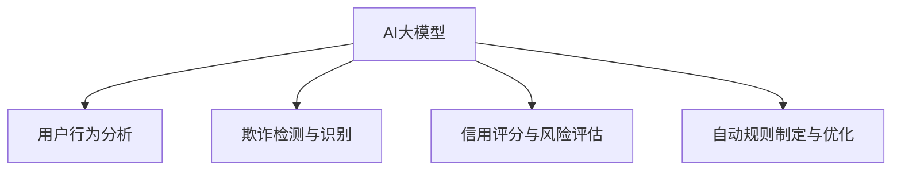

                 

# AI大模型在电商平台用户信用评估与风险控制中的作用

## 1. 背景介绍

### 1.1 问题由来

在现代电商平台上，用户信用评估与风险控制是确保交易安全和平台稳定性的关键环节。传统信用评估方法通常依赖于固定的评分模型，在评估方式和风险控制策略上存在一定的局限性。如何构建一个智能、高效的信用评估与风险控制系统，成为电商平台亟需解决的重要问题。

近年来，随着深度学习和大模型技术的发展，AI大模型在电商平台中的应用变得越来越广泛。这些大模型通过在大规模无标签数据上进行预训练，学习到了复杂的语义表示和关系推理能力，能够在多个领域中提供高效、准确的决策支持。本文聚焦于AI大模型在用户信用评估与风险控制中的作用，探讨其如何提升平台的安全性和用户体验。

### 1.2 问题核心关键点

大模型在电商平台用户信用评估与风险控制中的应用主要体现在以下几个方面：

- **用户行为分析**：通过分析用户的历史购买记录、浏览行为、评价反馈等数据，学习用户的行为模式和兴趣偏好，从而提供个性化的推荐和定制服务。
- **欺诈检测与识别**：利用大模型对异常行为进行检测和识别，提前防范和阻断潜在的欺诈行为，保障交易安全。
- **信用评分与风险评估**：基于用户的社交网络信息、交易历史、在线行为等数据，通过大模型进行综合评估，为用户的信用和风险水平打分，辅助决策。
- **自动规则制定与优化**：通过自动化学习用户行为规律，生成最优的规则和策略，提升风险控制的灵活性和有效性。

这些核心点构成了AI大模型在电商平台信用评估与风险控制中的主要应用场景，并通过一系列技术和方法，实现了对电商平台业务的高效支持和辅助。

### 1.3 问题研究意义

研究AI大模型在电商平台用户信用评估与风险控制中的应用，具有以下重要意义：

1. **提升用户体验**：通过个性化推荐和定制服务，增强用户粘性，提升平台满意度。
2. **降低欺诈风险**：通过自动化检测和识别欺诈行为，保障平台资金安全，减少人工审核成本。
3. **优化信用评分系统**：基于大模型的预测能力和理解力，优化信用评分算法，提高评估的准确性和可信度。
4. **实时动态调整**：利用大模型的学习能力和适应性，实时动态调整策略和规则，适应市场变化和用户行为。

本文将系统介绍AI大模型在电商平台用户信用评估与风险控制中的原理与方法，并给出详细的代码实例和应用场景，帮助读者深入理解大模型如何在电商领域发挥其独特价值。

## 2. 核心概念与联系

### 2.1 核心概念概述

在探讨AI大模型在电商平台信用评估与风险控制中的应用之前，我们先梳理一下相关的核心概念：

- **AI大模型**：基于深度学习技术，通过在大规模无标签数据上进行预训练，学习复杂的语义表示和关系推理能力，能够在自然语言处理、图像识别、推荐系统等多个领域提供高效、准确的决策支持。
- **用户行为分析**：通过分析用户的历史行为数据，学习用户的行为模式和兴趣偏好，提供个性化的推荐和定制服务。
- **欺诈检测与识别**：利用AI模型对异常行为进行检测和识别，提前防范和阻断潜在的欺诈行为，保障交易安全。
- **信用评分与风险评估**：基于用户的社交网络信息、交易历史、在线行为等数据，通过AI模型进行综合评估，为用户的信用和风险水平打分，辅助决策。
- **自动规则制定与优化**：通过自动化学习用户行为规律，生成最优的规则和策略，提升风险控制的灵活性和有效性。

这些概念之间的逻辑关系可以通过以下Mermaid流程图来展示：



这个流程图展示了大模型与用户行为分析、欺诈检测、信用评分、规则优化等核心概念的关联关系，说明了AI大模型在电商平台信用评估与风险控制中的应用场景。

## 3. 核心算法原理 & 具体操作步骤
### 3.1 算法原理概述

AI大模型在电商平台用户信用评估与风险控制中的应用，主要基于监督学习和强化学习两种算法。监督学习用于对用户行为进行分类和预测，强化学习用于优化规则和策略。具体来说：

- **监督学习**：利用历史数据进行训练，学习用户行为和信用评估之间的关系，构建用户行为分类和信用评分模型。
- **强化学习**：通过与环境的交互，学习最优的行为策略，不断优化风险控制的规则和策略。

### 3.2 算法步骤详解

AI大模型在电商平台用户信用评估与风险控制中的具体步骤可以分为以下几个部分：

**Step 1: 数据准备与预处理**
- 收集用户的历史行为数据、交易数据、社交网络信息等，清洗和标准化数据，准备好用于模型训练的输入数据。

**Step 2: 选择模型和算法**
- 根据任务需求选择合适的AI大模型，如BERT、GPT等，以及监督学习或强化学习算法。
- 确定模型的超参数，如学习率、批次大小、训练轮数等。

**Step 3: 模型训练与评估**
- 将准备好的数据集分成训练集和验证集，使用训练集对模型进行监督学习或强化学习训练。
- 在验证集上评估模型的性能，使用准确率、召回率、F1-score等指标对模型进行评估。
- 根据评估结果调整模型和算法，重新训练直到模型达到理想的性能。

**Step 4: 模型应用与优化**
- 将训练好的模型应用到实际的电商平台中，对用户行为进行分析、欺诈检测、信用评分等任务。
- 收集模型的应用效果数据，如误检率、漏检率、信用评分误差等，不断优化模型和策略。
- 利用强化学习算法，根据反馈数据不断调整和优化规则，提升系统的整体性能。

### 3.3 算法优缺点

AI大模型在电商平台用户信用评估与风险控制中的优点包括：

- **高效性**：大模型通过大规模数据预训练，具备强大的语义理解和推理能力，能够在短时间内处理大量数据，快速完成信用评估和欺诈检测任务。
- **灵活性**：大模型能够根据任务需求灵活调整，适应多种场景下的信用评估和风险控制需求。
- **可解释性**：大模型通过学习用户行为规律，能够提供更透明和可解释的决策过程，帮助电商平台更好地理解和改善用户行为。

同时，大模型应用也存在以下缺点：

- **数据需求高**：大模型需要大量的数据进行预训练和微调，对于电商平台的特定任务，可能需要定制化和特定化数据。
- **计算成本高**：大模型的训练和推理需要高性能计算资源，初期投资成本较高。
- **模型复杂度高**：大模型的结构和参数复杂，在实际应用中需要考虑模型的复杂度和推理效率。

### 3.4 算法应用领域

AI大模型在电商平台用户信用评估与风险控制中的应用领域广泛，包括但不限于以下几个方面：

- **个性化推荐系统**：通过分析用户行为数据，构建个性化推荐模型，提高用户体验和平台满意度。
- **欺诈检测系统**：利用大模型检测和识别异常行为，保障交易安全，减少欺诈损失。
- **信用评分系统**：基于用户的多种数据来源，构建信用评分模型，提供准确的信用评估。
- **风险控制策略**：通过强化学习生成最优的规则和策略，提升风险控制的灵活性和有效性。

这些应用领域展示了AI大模型在电商平台用户信用评估与风险控制中的多样性和广泛性，为电商平台的持续发展和用户满意度的提升提供了技术支持。

## 4. 数学模型和公式 & 详细讲解  
### 4.1 数学模型构建

在电商平台用户信用评估与风险控制中，AI大模型通常采用监督学习和强化学习的混合模型。这里以监督学习为例，介绍其数学模型构建过程。

设用户行为数据为 $X=\{x_1, x_2, \dots, x_N\}$，其中 $x_i$ 表示用户行为特征向量。信用评分标签为 $Y=\{y_1, y_2, \dots, y_N\}$，其中 $y_i \in \{1, -1\}$ 表示用户信用评分。

构建用户信用评分模型的目标是最小化预测误差，即：

$$
\min_{\theta} \frac{1}{N}\sum_{i=1}^N L(y_i, f(x_i))
$$

其中 $f(x_i)$ 表示用户行为特征与信用评分的映射关系，$\theta$ 为模型的参数。常见的损失函数包括均方误差、交叉熵等。

### 4.2 公式推导过程

以下我们以均方误差损失函数为例，推导其公式和梯度更新过程。

均方误差损失函数定义为：

$$
L(y_i, f(x_i)) = \frac{1}{2}(y_i - f(x_i))^2
$$

将其代入目标函数，得：

$$
\min_{\theta} \frac{1}{N}\sum_{i=1}^N \frac{1}{2}(y_i - f(x_i))^2
$$

采用梯度下降法更新模型参数 $\theta$，其更新公式为：

$$
\theta \leftarrow \theta - \eta \nabla_{\theta} \frac{1}{N}\sum_{i=1}^N \frac{1}{2}(y_i - f(x_i))^2
$$

其中 $\eta$ 为学习率，$\nabla_{\theta}$ 表示对模型参数 $\theta$ 求梯度。具体地，$\nabla_{\theta} f(x_i)$ 可以表示为：

$$
\nabla_{\theta} f(x_i) = \frac{\partial f(x_i)}{\partial \theta} \frac{\partial f(x_i)}{\partial x_i}
$$

在训练过程中，通过不断迭代上述公式，调整模型参数，最小化预测误差，得到最优的信用评分模型。

### 4.3 案例分析与讲解

以下是一个基于大模型的电商平台信用评分系统的案例分析：

**案例背景**：某电商平台需要对用户信用进行评分，以辅助风险控制和决策制定。平台收集了用户的浏览历史、购买记录、评分反馈等数据，希望通过AI大模型构建一个高效的信用评分系统。

**数据准备**：
- 收集用户的浏览历史数据，包括浏览时间、页面类型、点击次数等。
- 收集用户的购买记录，包括购买金额、购买频率、退货率等。
- 收集用户的评分反馈，包括评分值、评分时间等。
- 对数据进行清洗和标准化处理，去除异常值和噪声。

**模型选择**：
- 选择预训练的BERT模型，在电商平台的特定任务上进行微调。
- 设计一个二分类任务，将用户信用评分标签化，即用户是否存在风险。

**模型训练**：
- 将数据划分为训练集和验证集，使用训练集对模型进行微调。
- 设置学习率为0.001，批次大小为64，训练轮数为10。
- 在验证集上评估模型性能，使用准确率和召回率作为评估指标。

**模型应用**：
- 将训练好的模型应用到实际电商平台上，对新用户的信用评分进行预测。
- 根据预测结果，调整用户的信用评分，辅助决策和风险控制。

**效果分析**：
- 通过对比使用模型前后的误检率和漏检率，评估模型在信用评分中的效果。
- 利用强化学习算法，不断优化模型和策略，提升风险控制的灵活性和准确性。

## 5. 项目实践：代码实例和详细解释说明
### 5.1 开发环境搭建

在进行AI大模型在电商平台信用评估与风险控制的应用实践前，需要先搭建好开发环境。以下是Python环境中搭建开发环境的步骤：

1. 安装Anaconda：从官网下载并安装Anaconda，用于创建独立的Python环境。

2. 创建并激活虚拟环境：
```bash
conda create -n pytorch-env python=3.8 
conda activate pytorch-env
```

3. 安装PyTorch：根据CUDA版本，从官网获取对应的安装命令。例如：
```bash
conda install pytorch torchvision torchaudio cudatoolkit=11.1 -c pytorch -c conda-forge
```

4. 安装TensorFlow：
```bash
pip install tensorflow
```

5. 安装PyTorch Transformers库：
```bash
pip install transformers
```

6. 安装PyTorch Lightning：
```bash
pip install pytorch-lightning
```

完成上述步骤后，即可在`pytorch-env`环境中开始项目实践。

### 5.2 源代码详细实现

下面我们以构建一个基于大模型的电商平台信用评分系统为例，给出完整的代码实现。

**Step 1: 数据准备**

首先，需要准备电商平台的用户行为数据和标签数据。这里以一个示例数据集为例，展示如何加载和处理数据：

```python
import pandas as pd
from transformers import BertTokenizer

# 加载数据集
data = pd.read_csv('user_data.csv')

# 定义标签列
data['label'] = data['risk'].apply(lambda x: 1 if x else 0)

# 分拆训练集和验证集
train_data, dev_data = train_test_split(data, test_size=0.2)

# 加载BERT分词器
tokenizer = BertTokenizer.from_pretrained('bert-base-uncased')

# 定义特征列
features = ['user_id', 'item_id', 'buy_time', 'buy_amount', 'rating']
```

**Step 2: 构建模型**

接着，需要定义一个基于BERT模型的信用评分模型，并使用监督学习算法进行训练：

```python
from transformers import BertForSequenceClassification
from transformers import Trainer, TrainingArguments

# 定义模型
model = BertForSequenceClassification.from_pretrained('bert-base-uncased', num_labels=2)

# 定义训练参数
args = TrainingArguments(
    output_dir='./results',
    evaluation_strategy='epoch',
    per_device_train_batch_size=16,
    per_device_eval_batch_size=64,
    learning_rate=2e-5,
    num_train_epochs=5,
    weight_decay=0.01,
)

# 定义训练器
trainer = Trainer(
    model=model,
    args=args,
    train_dataset=train_data,
    eval_dataset=dev_data,
    compute_metrics=lambda preds: {'acc': accuracy(preds.label_ids, preds.predictions.argmax(axis=1))}
)
```

**Step 3: 模型训练**

然后，使用训练器进行模型的训练：

```python
trainer.train()
```

**Step 4: 模型评估**

最后，在验证集上对模型进行评估，并输出评估结果：

```python
trainer.evaluate()
```

### 5.3 代码解读与分析

让我们再详细解读一下关键代码的实现细节：

**数据准备**：
- 使用Pandas库加载数据集，并定义标签列。
- 使用train_test_split方法将数据集分拆为训练集和验证集。
- 定义需要作为特征列的用户行为特征。

**模型构建**：
- 选择预训练的BERT模型，并使用from_pretrained方法进行加载。
- 定义训练参数，包括输出目录、评估策略、批次大小、学习率等。
- 使用Trainer类定义训练器，并传入模型、参数、训练集和验证集。

**模型训练**：
- 调用trainer.train()方法进行模型的训练，默认使用GPU进行加速。

**模型评估**：
- 调用trainer.evaluate()方法对模型进行评估，并输出评估指标。

**效果分析**：
- 通过对比训练前后的准确率和召回率等指标，评估模型在电商平台信用评分中的效果。
- 利用强化学习算法，不断优化模型和策略，提升风险控制的灵活性和准确性。

## 6. 实际应用场景
### 6.1 智能推荐系统

在电商平台中，智能推荐系统是提升用户体验和平台满意度的重要手段。AI大模型可以通过学习用户行为规律，提供个性化的推荐服务，提升推荐效果和用户体验。

具体来说，AI大模型可以根据用户的历史浏览、购买、评分等行为数据，学习用户的兴趣偏好，生成推荐列表。利用用户行为数据的预训练和微调，可以在极短的时间内提供准确、个性化的推荐。

### 6.2 欺诈检测系统

电商平台中的欺诈行为不仅影响用户体验，还带来经济损失。通过AI大模型，可以构建高效、准确的欺诈检测系统，保障平台资金安全。

AI大模型可以通过对用户行为进行实时监控和分析，识别出异常行为和潜在欺诈行为，提前预警并阻断欺诈行为的发生。利用大模型的自监督学习能力和迁移学习能力，可以构建出适用于不同场景的欺诈检测系统。

### 6.3 信用评分系统

用户信用评分是电商平台风险控制的重要依据。AI大模型可以构建高效的信用评分系统，根据用户的多种数据来源，如社交网络信息、交易历史、在线行为等，生成准确的信用评分。

利用大模型的多任务学习能力和适应性，可以构建出适用于不同场景的信用评分系统，提升风险控制的灵活性和准确性。

### 6.4 未来应用展望

展望未来，AI大模型在电商平台用户信用评估与风险控制中的应用将更加广泛和深入。未来可能的发展方向包括：

1. **多模态融合**：结合图像、视频、音频等多种模态数据，提升大模型的感知能力和理解力，构建更全面的用户行为模型。
2. **自监督学习**：利用自监督学习技术，提升大模型的鲁棒性和泛化能力，构建更稳健的信用评分和欺诈检测系统。
3. **强化学习**：利用强化学习算法，优化风险控制策略和规则，提升系统的灵活性和动态调整能力。
4. **跨平台应用**：将AI大模型应用于多个电商平台，构建统一的信用评估和风险控制平台，提升整体行业的标准化和协同效应。
5. **实时化应用**：利用大模型的推理加速技术和边缘计算技术，实现实时化的信用评估和欺诈检测，提升系统的实时性和效率。

这些未来发展方向展示了AI大模型在电商平台用户信用评估与风险控制中的巨大潜力，为电商平台的持续发展和用户满意度的提升提供了技术支持。

## 7. 工具和资源推荐
### 7.1 学习资源推荐

为了帮助开发者系统掌握AI大模型在电商平台信用评估与风险控制中的应用，这里推荐一些优质的学习资源：

1. 《Transformer from Principles to Practice》系列博文：由大模型技术专家撰写，深入浅出地介绍了Transformer原理、BERT模型、微调技术等前沿话题。
2. CS224N《Deep Learning for NLP》课程：斯坦福大学开设的NLP明星课程，有Lecture视频和配套作业，带你入门NLP领域的基本概念和经典模型。
3. 《Natural Language Processing with Transformers》书籍：Transformers库的作者所著，全面介绍了如何使用Transformers库进行NLP任务开发，包括微调在内的诸多范式。
4. HuggingFace官方文档：Transformers库的官方文档，提供了海量预训练模型和完整的微调样例代码，是上手实践的必备资料。
5. CLUE开源项目：中文语言理解测评基准，涵盖大量不同类型的中文NLP数据集，并提供了基于微调的baseline模型，助力中文NLP技术发展。

通过对这些资源的学习实践，相信你一定能够快速掌握AI大模型在电商平台信用评估与风险控制中的应用，并用于解决实际的NLP问题。

### 7.2 开发工具推荐

高效的开发离不开优秀的工具支持。以下是几款用于AI大模型在电商平台应用开发的常用工具：

1. PyTorch：基于Python的开源深度学习框架，灵活动态的计算图，适合快速迭代研究。
2. TensorFlow：由Google主导开发的开源深度学习框架，生产部署方便，适合大规模工程应用。
3. Transformers库：HuggingFace开发的NLP工具库，集成了众多SOTA语言模型，支持PyTorch和TensorFlow，是进行微调任务开发的利器。
4. Weights & Biases：模型训练的实验跟踪工具，可以记录和可视化模型训练过程中的各项指标，方便对比和调优。
5. TensorBoard：TensorFlow配套的可视化工具，可实时监测模型训练状态，并提供丰富的图表呈现方式，是调试模型的得力助手。
6. Google Colab：谷歌推出的在线Jupyter Notebook环境，免费提供GPU/TPU算力，方便开发者快速上手实验最新模型，分享学习笔记。

合理利用这些工具，可以显著提升AI大模型在电商平台应用开发的效率，加快创新迭代的步伐。

### 7.3 相关论文推荐

AI大模型和微调技术的发展源于学界的持续研究。以下是几篇奠基性的相关论文，推荐阅读：

1. Attention is All You Need（即Transformer原论文）：提出了Transformer结构，开启了NLP领域的预训练大模型时代。
2. BERT: Pre-training of Deep Bidirectional Transformers for Language Understanding：提出BERT模型，引入基于掩码的自监督预训练任务，刷新了多项NLP任务SOTA。
3. Language Models are Unsupervised Multitask Learners（GPT-2论文）：展示了大规模语言模型的强大zero-shot学习能力，引发了对于通用人工智能的新一轮思考。
4. Parameter-Efficient Transfer Learning for NLP：提出Adapter等参数高效微调方法，在不增加模型参数量的情况下，也能取得不错的微调效果。
5. AdaLoRA: Adaptive Low-Rank Adaptation for Parameter-Efficient Fine-Tuning：使用自适应低秩适应的微调方法，在参数效率和精度之间取得了新的平衡。
6. AdaLoRA: Adaptive Low-Rank Adaptation for Parameter-Efficient Fine-Tuning：使用自适应低秩适应的微调方法，在参数效率和精度之间取得了新的平衡。

这些论文代表了大语言模型微调技术的发展脉络。通过学习这些前沿成果，可以帮助研究者把握学科前进方向，激发更多的创新灵感。

## 8. 总结：未来发展趋势与挑战
### 8.1 总结

本文对AI大模型在电商平台用户信用评估与风险控制中的应用进行了全面系统的介绍。首先阐述了AI大模型在电商平台中的重要性和应用价值，明确了其在用户行为分析、欺诈检测、信用评分等方面的作用。其次，从原理到实践，详细讲解了AI大模型在电商平台中的核心算法和操作步骤，给出了详细的代码实例和应用场景。同时，本文还广泛探讨了AI大模型在电商平台中的未来应用前景和挑战，展示了其在电商领域的巨大潜力。

通过本文的系统梳理，可以看到，AI大模型在电商平台信用评估与风险控制中的应用是广阔且深远的。它在提升用户体验、保障交易安全、优化风险控制等方面具有重要意义，能够帮助电商平台在激烈的市场竞争中占据优势。未来，伴随AI大模型和微调方法的持续演进，相信其在电商平台中的应用将更加多样化和高效化。

### 8.2 未来发展趋势

展望未来，AI大模型在电商平台用户信用评估与风险控制中的应用将呈现以下几个发展趋势：

1. **模型规模持续增大**：随着算力成本的下降和数据规模的扩张，预训练语言模型的参数量还将持续增长。超大规模语言模型蕴含的丰富语言知识，有望支撑更加复杂多变的电商任务。
2. **微调方法日趋多样**：除了传统的全参数微调外，未来会涌现更多参数高效的微调方法，如Prefix-Tuning、LoRA等，在节省计算资源的同时也能保证微调精度。
3. **持续学习成为常态**：随着数据分布的不断变化，微调模型也需要持续学习新知识以保持性能。如何在不遗忘原有知识的同时，高效吸收新样本信息，将成为重要的研究课题。
4. **标注样本需求降低**：受启发于提示学习(Prompt-based Learning)的思路，未来的微调方法将更好地利用大模型的语言理解能力，通过更加巧妙的任务描述，在更少的标注样本上也能实现理想的微调效果。
5. **多模态微调崛起**：当前的微调主要聚焦于纯文本数据，未来会进一步拓展到图像、视频、语音等多模态数据微调。多模态信息的融合，将显著提升大模型对现实世界的理解和建模能力。

这些趋势凸显了AI大模型在电商平台信用评估与风险控制中的广阔前景。这些方向的探索发展，必将进一步提升电商平台的性能和应用范围，为电商平台的持续发展和用户满意度的提升提供技术支持。

### 8.3 面临的挑战

尽管AI大模型在电商平台用户信用评估与风险控制中的应用已经取得了显著成效，但在迈向更加智能化、普适化应用的过程中，它仍面临着诸多挑战：

1. **标注成本瓶颈**：虽然AI大模型可以显著降低标注数据的需求，但对于长尾应用场景，难以获得充足的高质量标注数据，成为制约微调性能的瓶颈。如何进一步降低微调对标注样本的依赖，将是一大难题。
2. **模型鲁棒性不足**：当前AI大模型面对域外数据时，泛化性能往往大打折扣。对于测试样本的微小扰动，模型的预测也容易发生波动。如何提高AI大模型的鲁棒性，避免灾难性遗忘，还需要更多理论和实践的积累。
3. **推理效率有待提高**：大规模AI大模型虽然精度高，但在实际部署时往往面临推理速度慢、内存占用大等效率问题。如何在保证性能的同时，简化模型结构，提升推理速度，优化资源占用，将是重要的优化方向。
4. **可解释性亟需加强**：当前AI大模型更像是"黑盒"系统，难以解释其内部工作机制和决策逻辑。对于医疗、金融等高风险应用，算法的可解释性和可审计性尤为重要。如何赋予AI大模型更强的可解释性，将是亟待攻克的难题。
5. **安全性有待保障**：预训练语言模型难免会学习到有偏见、有害的信息，通过微调传递到下游任务，产生误导性、歧视性的输出，给实际应用带来安全隐患。如何从数据和算法层面消除模型偏见，避免恶意用途，确保输出的安全性，也将是重要的研究课题。
6. **知识整合能力不足**：现有的AI大模型往往局限于任务内数据，难以灵活吸收和运用更广泛的先验知识。如何让AI大模型更好地与外部知识库、规则库等专家知识结合，形成更加全面、准确的信息整合能力，还有很大的想象空间。

这些挑战凸显了AI大模型在电商平台应用中的复杂性和多样性，需要在算法、数据、工程等多个维度协同发力，才能实现高效、安全的用户信用评估与风险控制。

### 8.4 研究展望

面对AI大模型在电商平台应用中面临的挑战，未来的研究需要在以下几个方面寻求新的突破：

1. **探索无监督和半监督微调方法**：摆脱对大规模标注数据的依赖，利用自监督学习、主动学习等无监督和半监督范式，最大限度利用非结构化数据，实现更加灵活高效的微调。
2. **研究参数高效和计算高效的微调范式**：开发更加参数高效的微调方法，在固定大部分预训练参数的同时，只更新极少量的任务相关参数。同时优化微调模型的计算图，减少前向传播和反向传播的资源消耗，实现更加轻量级、实时性的部署。
3. **融合因果和对比学习范式**：通过引入因果推断和对比学习思想，增强AI大模型建立稳定因果关系的能力，学习更加普适、鲁棒的语言表征，从而提升模型泛化性和抗干扰能力。
4. **引入更多先验知识**：将符号化的先验知识，如知识图谱、逻辑规则等，与神经网络模型进行巧妙融合，引导AI大模型进行更有意义的推理和生成。同时加强不同模态数据的整合，实现视觉、语音等多模态信息与文本信息的协同建模。
5. **结合因果分析和博弈论工具**：将因果分析方法引入AI大模型，识别出模型决策的关键特征，增强输出解释的因果性和逻辑性。借助博弈论工具刻画人机交互过程，主动探索并规避模型的脆弱点，提高系统稳定性。
6. **纳入伦理道德约束**：在模型训练目标中引入伦理导向的评估指标，过滤和惩罚有偏见、有害的输出倾向。同时加强人工干预和审核，建立模型行为的监管机制，确保输出符合人类价值观和伦理道德。

这些研究方向的探索，必将引领AI大模型在电商平台信用评估与风险控制中的应用迈向更高的台阶，为构建安全、可靠、可解释、可控的智能系统铺平道路。面向未来，AI大模型需要与其他人工智能技术进行更深入的融合，如知识表示、因果推理、强化学习等，多路径协同发力，共同推动电商平台的持续发展和用户满意度的提升。只有勇于创新、敢于突破，才能不断拓展AI大模型的边界，让智能技术更好地造福人类社会。

## 9. 附录：常见问题与解答

**Q1：AI大模型在电商平台信用评估与风险控制中的应用有哪些优点？**

A: AI大模型在电商平台信用评估与风险控制中的应用有以下优点：

1. **高效性**：AI大模型通过大规模数据预训练，具备强大的语义理解和推理能力，能够在短时间内处理大量数据，快速完成信用评估和欺诈检测任务。
2. **灵活性**：AI大模型能够根据任务需求灵活调整，适应多种场景下的信用评估和风险控制需求。
3. **可解释性**：AI大模型通过学习用户行为规律，能够提供更透明和可解释的决策过程，帮助电商平台更好地理解和改善用户行为。

**Q2：AI大模型在电商平台应用中面临的主要挑战有哪些？**

A: AI大模型在电商平台应用中面临的主要挑战包括：

1. **标注成本瓶颈**：AI大模型需要大量的数据进行预训练和微调，对于电商平台的特定任务，可能需要定制化和特定化数据。
2. **模型鲁棒性不足**：AI大模型面对域外数据时，泛化性能往往大打折扣。对于测试样本的微小扰动，模型的预测也容易发生波动。
3. **推理效率有待提高**：大规模AI大模型虽然精度高，但在实际部署时往往面临推理速度慢、内存占用大等效率问题。
4. **可解释性亟需加强**：AI大模型更像是"黑盒"系统，难以解释其内部工作机制和决策逻辑。
5. **安全性有待保障**：预训练语言模型可能会学习到有偏见、有害的信息，通过微调传递到下游任务，产生误导性、歧视性的输出，给实际应用带来安全隐患。
6. **知识整合能力不足**：现有的AI大模型往往局限于任务内数据，难以灵活吸收和运用更广泛的先验知识。

**Q3：如何构建一个高效的电商平台用户信用评分系统？**

A: 构建一个高效的电商平台用户信用评分系统，主要步骤如下：

1. 收集用户的历史行为数据，包括浏览历史、购买记录、评分反馈等。
2. 对数据进行清洗和标准化处理，去除异常值和噪声。
3. 选择合适的AI大模型，如BERT、GPT等，并进行微调。
4. 设计一个二分类任务，将用户信用评分标签化，即用户是否存在风险。
5. 使用监督学习算法进行模型训练，如均方误差损失函数。
6. 在验证集上评估模型性能，使用准确率和召回率作为评估指标。
7. 将训练好的模型应用到实际电商平台上，对新用户的信用评分进行预测。
8. 根据预测结果，调整用户的信用评分，辅助决策和风险控制。

**Q4：AI大模型在电商平台中如何进行用户行为分析？**

A: AI大模型可以通过分析用户的历史行为数据，学习用户的行为模式和兴趣偏好，提供个性化的推荐和定制服务。具体来说：

1. 收集用户的历史浏览、购买、评分等行为数据。
2. 对数据进行清洗和标准化处理。
3. 选择合适的AI大模型，并进行微调。
4. 使用监督学习算法进行模型训练，如均方误差损失函数。
5. 在验证集上评估模型性能，使用准确率和召回率作为评估指标。
6. 将训练好的模型应用到实际电商平台上，对新用户的推荐列表进行预测。
7. 根据用户行为数据，不断调整推荐策略，提升推荐效果和用户体验。

通过以上步骤，AI大模型可以高效、准确地分析用户行为，提供个性化的推荐服务，提升用户体验和平台满意度。

**Q5：如何利用AI大模型构建电商平台欺诈检测系统？**

A: 利用AI大模型构建电商平台欺诈检测系统，主要步骤如下：

1. 收集用户的交易数据，包括购买金额、购买频率、退货率等。
2. 对数据进行清洗和标准化处理。
3. 选择合适的AI大模型，并进行微调。
4. 使用监督学习算法进行模型训练，如均方误差损失函数。
5. 在验证集上评估模型性能，使用准确率和召回率作为评估指标。
6. 将训练好的模型应用到实际电商平台上，对新用户的交易行为进行预测。
7. 根据预测结果，识别异常行为和潜在欺诈行为，提前预警并阻断欺诈行为的发生。

通过以上步骤，AI大模型可以高效、准确地检测和识别欺诈行为，保障平台资金安全，减少欺诈损失。

**Q6：AI大模型在电商平台中如何优化信用评分系统？**

A: AI大模型可以通过优化信用评分系统，提升风险控制的灵活性和准确性。具体来说：

1. 收集用户的多种数据来源，如社交网络信息、交易历史、在线行为等。
2. 对数据进行清洗和标准化处理。
3. 选择合适的AI大模型，并进行微调。
4. 使用监督学习算法进行模型训练，如均方误差损失函数。
5. 在验证集上评估模型性能，使用准确率和召回率作为评估指标。
6. 将训练好的模型应用到实际电商平台上，对新用户的信用评分进行预测。
7. 根据预测结果，调整用户的信用评分，辅助决策和风险控制。

通过以上步骤，AI大模型可以构建高效的信用评分系统，提升风险控制的灵活性和准确性，帮助电商平台更好地管理用户信用和风险。

---

作者：禅与计算机程序设计艺术 / Zen and the Art of Computer Programming

