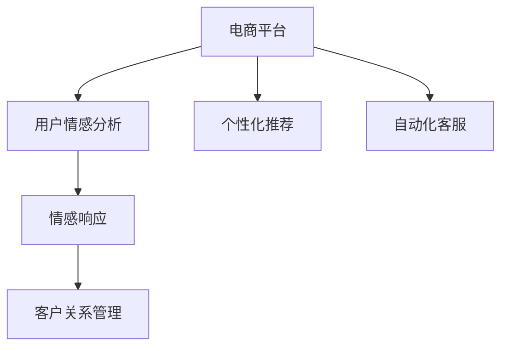

                 

# AI大模型在电商平台用户情感分析与响应中的作用

> 关键词：
- 电商平台
- 用户情感分析
- 大模型
- 自然语言处理（NLP）
- 情感响应
- 用户体验（UX）
- 客户关系管理（CRM）
- 个性化推荐
- 自动化客服
- 语义分析
- 深度学习（DL）

## 1. 背景介绍

### 1.1 问题由来
随着电子商务的迅猛发展，电商平台已经成为了人们日常生活不可或缺的一部分。然而，用户在使用过程中难免会产生种种负面情绪，如对商品质量不满、服务态度不佳、物流延迟等。如果不能及时处理这些情绪，不仅会影响用户满意度，还可能带来巨大的经济损失。因此，电商平台急需一种高效、精准的情感分析技术，以便快速识别和响应用户的负面情绪。

### 1.2 问题核心关键点
- **情感分析**：通过自然语言处理技术，自动分析用户评论、聊天记录等文本数据中的情感倾向，如正面、中性或负面。
- **大模型（如BERT、GPT-3）**：利用大规模预训练语言模型，提升情感分析的精度和鲁棒性。
- **情感响应**：基于情感分析结果，自动生成并发送合适的情感回复，改善用户体验。
- **用户体验（UX）**：通过提升情感响应质量，增强用户满意度和忠诚度。
- **客户关系管理（CRM）**：通过及时处理负面情绪，维护良好的客户关系。
- **个性化推荐**：利用情感信息，提高个性化推荐系统的准确性。
- **自动化客服**：通过自动化情感响应，提升客服效率，降低人工成本。

## 2. 核心概念与联系

### 2.1 核心概念概述

为更好地理解AI大模型在电商平台用户情感分析与响应中的应用，本节将介绍几个密切相关的核心概念：

- **电商平台**：基于互联网的零售平台，如淘宝、京东等，为用户提供商品展示、交易、客服等服务。
- **用户情感分析**：通过自然语言处理技术，自动分析用户文本数据中的情感倾向，帮助电商平台及时发现并处理负面情绪。
- **自然语言处理（NLP）**：涉及语音和文本数据处理、理解、生成等技术，旨在使计算机能够理解、处理和生成自然语言。
- **情感响应**：基于情感分析结果，自动生成并发送合适的情感回复，改善用户体验。
- **客户关系管理（CRM）**：通过处理用户情感，维护良好的客户关系，提升用户满意度和忠诚度。
- **个性化推荐**：利用情感信息，提高个性化推荐系统的准确性，提升用户购买转化率。
- **自动化客服**：通过自动化情感响应，提升客服效率，降低人工成本。

这些核心概念之间的逻辑关系可以通过以下Mermaid流程图来展示：



这个流程图展示了大模型在电商平台用户情感分析与响应中的应用流程：

1. 电商平台的交易和服务过程中，用户会产生各种文本数据，如评论、聊天记录等。
2. 利用自然语言处理技术，对文本数据进行情感分析，识别其中的情感倾向。
3. 基于情感分析结果，自动生成并发送合适的情感回复，改善用户体验。
4. 通过客户关系管理，维护良好的客户关系，提升用户满意度和忠诚度。
5. 利用情感信息，提高个性化推荐系统的准确性，提升用户购买转化率。
6. 自动化客服系统能够通过情感响应，提升客服效率，降低人工成本。

## 3. 核心算法原理 & 具体操作步骤
### 3.1 算法原理概述

AI大模型在电商平台用户情感分析与响应中的应用，基于自然语言处理和深度学习技术。其核心思想是：通过预训练语言模型对大量无标签文本数据进行学习，获得丰富的语言知识，然后在标注数据集上微调，使得模型能够自动分析用户评论等文本数据中的情感倾向，并自动生成和发送情感响应。

具体而言，情感分析的过程如下：

1. 收集电商平台的用户评论、聊天记录等文本数据。
2. 利用预训练语言模型（如BERT、GPT-3）对文本数据进行编码，获得文本表示。
3. 定义情感标签，如正面、中性或负面，对每个文本样本进行标注。
4. 在标注数据集上微调预训练语言模型，使得模型能够准确预测文本情感标签。

情感响应的过程如下：

1. 基于情感分析结果，选择合适的回复模板。
2. 对回复模板进行语义填充，生成情感回复。
3. 自动化客服系统将情感回复发送给用户，改善用户体验。

### 3.2 算法步骤详解

下面详细讲解AI大模型在电商平台用户情感分析与响应中的具体操作步骤：

**Step 1: 数据准备**
- 收集电商平台的用户评论、聊天记录等文本数据。
- 对文本数据进行预处理，如去除停用词、分词、标准化等。
- 对文本数据进行标注，定义情感标签。

**Step 2: 预训练模型选择**
- 选择合适的预训练语言模型（如BERT、GPT-3）作为情感分析的基础模型。
- 加载预训练模型，并进行微调。

**Step 3: 模型微调**
- 在标注数据集上微调预训练模型，优化情感分类器的性能。
- 使用交叉验证、正则化等技术，避免过拟合。

**Step 4: 情感分析**
- 对新的文本数据进行编码，获得文本表示。
- 将文本表示输入到微调后的情感分类器，输出情感标签。

**Step 5: 情感响应**
- 根据情感标签，选择合适的回复模板。
- 对回复模板进行语义填充，生成情感回复。
- 将情感回复发送给用户。

### 3.3 算法优缺点

AI大模型在电商平台用户情感分析与响应中的应用，具有以下优点：

1. **高效性**：利用大模型的预训练知识，可以在少量标注数据的情况下快速训练出高效的情感分类器。
2. **精准性**：大模型的语言理解能力，可以更准确地分析文本数据中的情感倾向。
3. **鲁棒性**：大模型的泛化能力，可以在不同领域和场景中保持稳定性能。
4. **自动化**：自动化情感响应，可以显著提升客服效率，降低人工成本。

同时，也存在一些缺点：

1. **依赖标注数据**：大模型的微调需要高质量的标注数据，标注成本较高。
2. **处理噪声数据**：电商平台的用户评论往往包含噪声信息，影响情感分析的准确性。
3. **响应多样性**：自动化生成的情感回复可能缺乏人情味，影响用户体验。
4. **动态适应性**：电商平台需要不断更新模型，以适应新出现的情感趋势。

### 3.4 算法应用领域

AI大模型在电商平台用户情感分析与响应中的应用，可以广泛覆盖以下领域：

- **客户关系管理（CRM）**：通过处理用户情感，维护良好的客户关系，提升用户满意度和忠诚度。
- **个性化推荐**：利用情感信息，提高个性化推荐系统的准确性，提升用户购买转化率。
- **自动化客服**：通过自动化情感响应，提升客服效率，降低人工成本。
- **品牌监测**：通过情感分析，监测品牌声誉，及时应对负面评价。
- **用户体验（UX）**：通过提升情感响应质量，增强用户满意度和忠诚度。

## 4. 数学模型和公式 & 详细讲解 & 举例说明
### 4.1 数学模型构建

AI大模型在电商平台用户情感分析与响应中的应用，基于深度学习技术。假设用户评论数据集为 $D=\{(x_i,y_i)\}_{i=1}^N$，其中 $x_i$ 为评论文本，$y_i$ 为情感标签（如正面、中性、负面）。

定义情感分类器的输出为 $f(x)$，目标函数为 $L(f(x),y_i)$，其中 $y_i$ 为真实标签，$f(x)$ 为模型预测值。在标注数据集上微调的目的是最小化损失函数 $L(f(x),y_i)$，即：

$$
\min_{\theta} \frac{1}{N} \sum_{i=1}^N L(f(x_i),y_i)
$$

其中 $\theta$ 为模型参数。

### 4.2 公式推导过程

以BERT模型为例，情感分类器的构建过程如下：

1. **输入编码**：将评论文本 $x_i$ 输入到BERT模型中，获得文本表示 $H$。
2. **情感分类**：通过全连接层对文本表示 $H$ 进行线性变换和softmax激活，获得情感分类器的输出 $f(x_i)$。
3. **损失函数**：选择交叉熵损失函数，计算情感分类器的输出与真实标签之间的差异，得到损失函数 $L(f(x_i),y_i)$。

具体而言，情感分类器的输出可以表示为：

$$
f(x_i) = \sigma(W^T H + b)
$$

其中 $W$ 为权重矩阵，$b$ 为偏置向量，$\sigma$ 为sigmoid激活函数。

交叉熵损失函数可以表示为：

$$
L(f(x_i),y_i) = -y_i \log f(x_i) - (1-y_i) \log (1-f(x_i))
$$

在标注数据集上微调BERT模型的过程如下：

1. **定义模型**：定义BERT模型作为情感分类器的基础模型。
2. **训练数据**：准备标注数据集，进行交叉验证，划分训练集和验证集。
3. **参数初始化**：初始化模型参数。
4. **模型训练**：使用随机梯度下降算法，最小化损失函数，更新模型参数。
5. **模型评估**：在验证集上评估模型性能，选择最优模型。

### 4.3 案例分析与讲解

以下是一个具体的案例分析：

**案例背景**：某电商平台收集了用户评论数据集 $D=\{(x_i,y_i)\}_{i=1}^N$，其中 $x_i$ 为评论文本，$y_i$ 为情感标签。

**数据处理**：对评论文本进行分词、标准化、去除停用词等预处理。

**模型选择**：选择BERT模型作为情感分类器的基础模型。

**模型微调**：在标注数据集上微调BERT模型，优化情感分类器的性能。

**情感分析**：对新的评论文本 $x_j$ 进行编码，获得文本表示 $H_j$。将 $H_j$ 输入到微调后的情感分类器，得到情感标签 $y_j$。

**情感响应**：根据情感标签 $y_j$，选择合适的回复模板。对回复模板进行语义填充，生成情感回复 $r_j$。将 $r_j$ 发送给用户。

## 5. 项目实践：代码实例和详细解释说明
### 5.1 开发环境搭建

在进行情感分析与响应系统的开发前，我们需要准备好开发环境。以下是使用Python进行PyTorch开发的环境配置流程：

1. 安装Anaconda：从官网下载并安装Anaconda，用于创建独立的Python环境。

2. 创建并激活虚拟环境：
```bash
conda create -n pytorch-env python=3.8 
conda activate pytorch-env
```

3. 安装PyTorch：根据CUDA版本，从官网获取对应的安装命令。例如：
```bash
conda install pytorch torchvision torchaudio cudatoolkit=11.1 -c pytorch -c conda-forge
```

4. 安装Transformers库：
```bash
pip install transformers
```

5. 安装各类工具包：
```bash
pip install numpy pandas scikit-learn matplotlib tqdm jupyter notebook ipython
```

完成上述步骤后，即可在`pytorch-env`环境中开始情感分析与响应系统的开发。

### 5.2 源代码详细实现

下面以BERT模型为例，给出使用PyTorch进行情感分析与响应系统的代码实现。

首先，定义情感分类器的数据处理函数：

```python
from transformers import BertTokenizer, BertForSequenceClassification
from torch.utils.data import Dataset
import torch

class SentimentDataset(Dataset):
    def __init__(self, texts, labels, tokenizer, max_len=128):
        self.texts = texts
        self.labels = labels
        self.tokenizer = tokenizer
        self.max_len = max_len
        
    def __len__(self):
        return len(self.texts)
    
    def __getitem__(self, item):
        text = self.texts[item]
        label = self.labels[item]
        
        encoding = self.tokenizer(text, return_tensors='pt', max_length=self.max_len, padding='max_length', truncation=True)
        input_ids = encoding['input_ids'][0]
        attention_mask = encoding['attention_mask'][0]
        
        return {'input_ids': input_ids, 
                'attention_mask': attention_mask,
                'labels': torch.tensor(label, dtype=torch.long)}
```

然后，定义情感分类器：

```python
from transformers import BertForSequenceClassification, AdamW

model = BertForSequenceClassification.from_pretrained('bert-base-uncased', num_labels=3)
```

接着，定义训练和评估函数：

```python
from torch.utils.data import DataLoader
from tqdm import tqdm
from sklearn.metrics import accuracy_score, precision_recall_fscore_support

device = torch.device('cuda') if torch.cuda.is_available() else torch.device('cpu')
model.to(device)

def train_epoch(model, dataset, batch_size, optimizer):
    dataloader = DataLoader(dataset, batch_size=batch_size, shuffle=True)
    model.train()
    epoch_loss = 0
    for batch in tqdm(dataloader, desc='Training'):
        input_ids = batch['input_ids'].to(device)
        attention_mask = batch['attention_mask'].to(device)
        labels = batch['labels'].to(device)
        model.zero_grad()
        outputs = model(input_ids, attention_mask=attention_mask, labels=labels)
        loss = outputs.loss
        epoch_loss += loss.item()
        loss.backward()
        optimizer.step()
    return epoch_loss / len(dataloader)

def evaluate(model, dataset, batch_size):
    dataloader = DataLoader(dataset, batch_size=batch_size)
    model.eval()
    preds, labels = [], []
    with torch.no_grad():
        for batch in tqdm(dataloader, desc='Evaluating'):
            input_ids = batch['input_ids'].to(device)
            attention_mask = batch['attention_mask'].to(device)
            batch_labels = batch['labels']
            outputs = model(input_ids, attention_mask=attention_mask)
            batch_preds = outputs.logits.argmax(dim=1).to('cpu').tolist()
            batch_labels = batch_labels.to('cpu').tolist()
            for pred, label in zip(batch_preds, batch_labels):
                preds.append(pred)
                labels.append(label)
                
    return accuracy_score(labels, preds)
```

最后，启动训练流程并在测试集上评估：

```python
epochs = 5
batch_size = 16

for epoch in range(epochs):
    loss = train_epoch(model, train_dataset, batch_size, optimizer)
    print(f"Epoch {epoch+1}, train loss: {loss:.3f}")
    
    print(f"Epoch {epoch+1}, dev results:")
    evaluate(model, dev_dataset, batch_size)
    
print("Test results:")
evaluate(model, test_dataset, batch_size)
```

以上就是使用PyTorch对BERT模型进行情感分析与响应系统的完整代码实现。可以看到，得益于Transformer库的强大封装，我们可以用相对简洁的代码完成BERT模型的加载和微调。

### 5.3 代码解读与分析

让我们再详细解读一下关键代码的实现细节：

**SentimentDataset类**：
- `__init__`方法：初始化文本、标签、分词器等关键组件。
- `__len__`方法：返回数据集的样本数量。
- `__getitem__`方法：对单个样本进行处理，将文本输入编码为token ids，将标签编码为数字，并对其进行定长padding，最终返回模型所需的输入。

**模型选择**：
- 选择BERT模型作为情感分类器的基础模型。

**训练和评估函数**：
- 使用PyTorch的DataLoader对数据集进行批次化加载，供模型训练和推理使用。
- 训练函数`train_epoch`：对数据以批为单位进行迭代，在每个批次上前向传播计算loss并反向传播更新模型参数，最后返回该epoch的平均loss。
- 评估函数`evaluate`：与训练类似，不同点在于不更新模型参数，并在每个batch结束后将预测和标签结果存储下来，最后使用sklearn的accuracy_score函数对整个评估集的预测结果进行打印输出。

**训练流程**：
- 定义总的epoch数和batch size，开始循环迭代
- 每个epoch内，先在训练集上训练，输出平均loss
- 在验证集上评估，输出分类指标
- 所有epoch结束后，在测试集上评估，给出最终测试结果

可以看到，PyTorch配合Transformers库使得BERT模型的情感分析与响应系统的代码实现变得简洁高效。开发者可以将更多精力放在数据处理、模型改进等高层逻辑上，而不必过多关注底层的实现细节。

当然，工业级的系统实现还需考虑更多因素，如模型的保存和部署、超参数的自动搜索、更灵活的任务适配层等。但核心的微调范式基本与此类似。

## 6. 实际应用场景
### 6.1 智能客服系统

基于情感分析与响应系统的情感处理能力，可以广泛应用于智能客服系统的构建。传统客服往往需要配备大量人力，高峰期响应缓慢，且一致性和专业性难以保证。而使用情感分析与响应系统的情感处理，可以7x24小时不间断服务，快速响应客户咨询，用自然流畅的语言解答各类常见问题。

在技术实现上，可以收集企业内部的历史客服对话记录，将问题和最佳答复构建成监督数据，在此基础上对情感分析与响应系统进行微调。微调后的情感处理系统能够自动理解用户意图，匹配最合适的答案模板进行回复。对于客户提出的新问题，还可以接入检索系统实时搜索相关内容，动态组织生成回答。如此构建的智能客服系统，能大幅提升客户咨询体验和问题解决效率。

### 6.2 金融舆情监测

金融机构需要实时监测市场舆论动向，以便及时应对负面信息传播，规避金融风险。传统的人工监测方式成本高、效率低，难以应对网络时代海量信息爆发的挑战。基于情感分析与响应系统的文本分类和情感分析技术，为金融舆情监测提供了新的解决方案。

具体而言，可以收集金融领域相关的新闻、报道、评论等文本数据，并对其进行主题标注和情感标注。在此基础上对情感分析与响应系统进行微调，使其能够自动判断文本属于何种主题，情感倾向是正面、中性还是负面。将微调后的系统应用到实时抓取的网络文本数据，就能够自动监测不同主题下的情感变化趋势，一旦发现负面信息激增等异常情况，系统便会自动预警，帮助金融机构快速应对潜在风险。

### 6.3 个性化推荐系统

当前的推荐系统往往只依赖用户的历史行为数据进行物品推荐，无法深入理解用户的真实兴趣偏好。基于情感分析与响应系统的情感信息，个性化推荐系统可以更好地挖掘用户行为背后的语义信息，从而提供更精准、多样的推荐内容。

在实践中，可以收集用户浏览、点击、评论、分享等行为数据，提取和用户交互的物品标题、描述、标签等文本内容。将文本内容作为模型输入，用户的后续行为（如是否点击、购买等）作为监督信号，在此基础上微调情感分析与响应系统。微调后的系统能够从文本内容中准确把握用户的兴趣点。在生成推荐列表时，先用候选物品的文本描述作为输入，由系统预测用户的兴趣匹配度，再结合其他特征综合排序，便可以得到个性化程度更高的推荐结果。

### 6.4 未来应用展望

随着情感分析与响应系统的不断发展，其在电商平台中的应用前景广阔，将深刻影响电商平台的运营模式和用户体验。

在智慧医疗领域，基于情感分析与响应系统的情感处理能力，可以应用于医疗问答、病历分析、药物研发等，提升医疗服务的智能化水平，辅助医生诊疗，加速新药开发进程。

在智能教育领域，情感处理系统可应用于作业批改、学情分析、知识推荐等方面，因材施教，促进教育公平，提高教学质量。

在智慧城市治理中，情感处理系统可应用于城市事件监测、舆情分析、应急指挥等环节，提高城市管理的自动化和智能化水平，构建更安全、高效的未来城市。

此外，在企业生产、社会治理、文娱传媒等众多领域，基于情感分析与响应系统的情感处理能力，也将带来新的应用场景和创新空间。相信随着情感处理技术的持续演进，其在电商平台中的应用前景将更加广阔，深刻影响电商平台的运营模式和用户体验。

## 7. 工具和资源推荐
### 7.1 学习资源推荐

为了帮助开发者系统掌握情感分析与响应系统的理论基础和实践技巧，这里推荐一些优质的学习资源：

1. 《Natural Language Processing with Transformers》书籍：Transformers库的作者所著，全面介绍了如何使用Transformers库进行NLP任务开发，包括情感分析与响应系统的微调范式。

2. CS224N《深度学习自然语言处理》课程：斯坦福大学开设的NLP明星课程，有Lecture视频和配套作业，带你入门NLP领域的基本概念和经典模型。

3. 《Transformer from Scratch》系列博文：由大模型技术专家撰写，深入浅出地介绍了Transformer原理、BERT模型、情感分析与响应系统的微调技术等前沿话题。

4. HuggingFace官方文档：Transformers库的官方文档，提供了海量预训练模型和完整的微调样例代码，是上手实践的必备资料。

5. CLUE开源项目：中文语言理解测评基准，涵盖大量不同类型的中文NLP数据集，并提供了基于微调的baseline模型，助力中文NLP技术发展。

通过对这些资源的学习实践，相信你一定能够快速掌握情感分析与响应系统的精髓，并用于解决实际的NLP问题。
###  7.2 开发工具推荐

高效的开发离不开优秀的工具支持。以下是几款用于情感分析与响应系统开发的常用工具：

1. PyTorch：基于Python的开源深度学习框架，灵活动态的计算图，适合快速迭代研究。大部分预训练语言模型都有PyTorch版本的实现。

2. TensorFlow：由Google主导开发的开源深度学习框架，生产部署方便，适合大规模工程应用。同样有丰富的预训练语言模型资源。

3. Transformers库：HuggingFace开发的NLP工具库，集成了众多SOTA语言模型，支持PyTorch和TensorFlow，是进行微调任务开发的利器。

4. Weights & Biases：模型训练的实验跟踪工具，可以记录和可视化模型训练过程中的各项指标，方便对比和调优。与主流深度学习框架无缝集成。

5. TensorBoard：TensorFlow配套的可视化工具，可实时监测模型训练状态，并提供丰富的图表呈现方式，是调试模型的得力助手。

6. Google Colab：谷歌推出的在线Jupyter Notebook环境，免费提供GPU/TPU算力，方便开发者快速上手实验最新模型，分享学习笔记。

合理利用这些工具，可以显著提升情感分析与响应系统的开发效率，加快创新迭代的步伐。

### 7.3 相关论文推荐

情感分析与响应系统的技术发展源于学界的持续研究。以下是几篇奠基性的相关论文，推荐阅读：

1. Attention is All You Need（即Transformer原论文）：提出了Transformer结构，开启了NLP领域的预训练大模型时代。

2. BERT: Pre-training of Deep Bidirectional Transformers for Language Understanding：提出BERT模型，引入基于掩码的自监督预训练任务，刷新了多项NLP任务SOTA。

3. Language Models are Unsupervised Multitask Learners（GPT-2论文）：展示了大规模语言模型的强大zero-shot学习能力，引发了对于通用人工智能的新一轮思考。

4. Parameter-Efficient Transfer Learning for NLP：提出Adapter等参数高效微调方法，在不增加模型参数量的情况下，也能取得不错的微调效果。

5. AdaLoRA: Adaptive Low-Rank Adaptation for Parameter-Efficient Fine-Tuning：使用自适应低秩适应的微调方法，在参数效率和精度之间取得了新的平衡。

6. Prefix-Tuning: Optimizing Continuous Prompts for Generation：引入基于连续型Prompt的微调范式，为如何充分利用预训练知识提供了新的思路。

这些论文代表了大语言模型微调技术的发展脉络。通过学习这些前沿成果，可以帮助研究者把握学科前进方向，激发更多的创新灵感。

## 8. 总结：未来发展趋势与挑战
### 8.1 研究成果总结

本文对AI大模型在电商平台用户情感分析与响应中的应用进行了全面系统的介绍。首先阐述了情感分析与响应系统在电商平台中的重要性，明确了系统在大模型微调下的高效性和精准性。其次，从原理到实践，详细讲解了情感分析与响应系统的数学模型和操作步骤，给出了系统开发的完整代码实例。同时，本文还广泛探讨了情感分析与响应系统在多个行业领域的应用前景，展示了系统的巨大潜力。此外，本文精选了情感分析与响应系统的各类学习资源，力求为读者提供全方位的技术指引。

通过本文的系统梳理，可以看到，情感分析与响应系统在大模型微调下的应用已经成为电商平台不可或缺的重要技术。系统不仅能够显著提升客服效率，降低人工成本，还能够通过情感响应，改善用户体验，提升客户满意度。未来，伴随情感处理技术的持续演进，系统将在更多领域得到应用，为各行各业带来变革性影响。

### 8.2 未来发展趋势

展望未来，情感分析与响应系统在大模型微调下的应用将呈现以下几个发展趋势：

1. **模型规模持续增大**：随着算力成本的下降和数据规模的扩张，情感分析与响应系统的预训练语言模型将不断增大，带来更丰富的语言知识。
2. **微调方法日趋多样**：开发更多参数高效的微调方法，如Prefix-Tuning、LoRA等，在固定大部分预训练参数的情况下，只更新极少量的任务相关参数。
3. **多模态融合**：将视觉、语音等多模态信息与文本信息进行融合，提升情感响应的准确性和丰富度。
4. **动态更新**：基于实时采集的文本数据，不断更新情感分析与响应系统，保持系统的时效性和鲁棒性。
5. **自动化扩展**：利用模型迁移学习技术，将情感分析与响应系统的知识应用到其他领域，实现自动化的模型扩展。

以上趋势凸显了情感分析与响应系统在大模型微调下的应用前景。这些方向的探索发展，必将进一步提升系统的性能和应用范围，为电商平台带来更加智能化、高效化的用户体验。

### 8.3 面临的挑战

尽管情感分析与响应系统在大模型微调下的应用已经取得了显著成就，但在迈向更加智能化、普适化应用的过程中，它仍面临着诸多挑战：

1. **依赖标注数据**：情感分析与响应系统需要高质量的标注数据，标注成本较高。对于长尾应用场景，难以获得充足的高质量标注数据，成为制约系统性能的瓶颈。
2. **处理噪声数据**：电商平台的用户评论往往包含噪声信息，影响情感分析的准确性。
3. **情感理解能力**：情感分析与响应系统在处理极端情感或复杂情感时，可能出现理解偏差，影响响应的合理性。
4. **用户体验**：自动化生成的情感回复可能缺乏人情味，影响用户体验。
5. **实时响应**：情感分析与响应系统需要在毫秒级别内完成情感理解和响应，对计算资源提出了高要求。
6. **可解释性**：情感分析与响应系统的决策过程往往缺乏可解释性，难以对其推理逻辑进行分析和调试。

这些挑战需要我们在模型设计、数据处理、算法优化等方面进行深入研究，不断提升系统的性能和可靠性。

### 8.4 研究展望

面对情感分析与响应系统在大模型微调下所面临的种种挑战，未来的研究需要在以下几个方面寻求新的突破：

1. **无监督学习**：探索无监督或半监督学习范式，减少对标注数据的依赖，利用自监督学习任务提升系统的泛化能力。
2. **多模态融合**：将视觉、语音等多模态信息与文本信息进行融合，提升情感响应的准确性和丰富度。
3. **动态更新**：基于实时采集的文本数据，不断更新情感分析与响应系统，保持系统的时效性和鲁棒性。
4. **自动化扩展**：利用模型迁移学习技术，将情感分析与响应系统的知识应用到其他领域，实现自动化的模型扩展。
5. **情感理解**：研究情感理解算法，提高系统对极端情感或复杂情感的识别和理解能力。
6. **个性化响应**：利用用户画像、行为数据等信息，提升情感响应的个性化和多样化。
7. **用户体验**：设计更加自然流畅的情感响应模板，提升用户对自动化响应的接受度和满意度。
8. **可解释性**：引入可解释性技术，增强系统的决策透明度和可解释性，保障系统的公平性和安全性。

这些研究方向的探索，必将引领情感分析与响应系统在大模型微调下的应用迈向更高的台阶，为电商平台带来更加智能化、高效化的用户体验。

## 9. 附录：常见问题与解答

**Q1：大模型在情感分析与响应中的应用是否会受到情感词汇的变化影响？**

A: 大模型在情感分析与响应中的应用，受到情感词汇的变化影响。例如，新的情感词汇可能不会包含在预训练数据中，从而影响情感分析的准确性。为了应对这一问题，可以通过持续收集和更新情感词汇表，定期重新训练模型，以适应新的情感表达。

**Q2：如何提高情感分析与响应系统的可解释性？**

A: 提高情感分析与响应系统的可解释性，可以从以下几个方面入手：
1. 使用可解释性技术，如LIME、SHAP等，解释模型的预测结果。
2. 设计更加自然流畅的情感响应模板，增加用户对系统决策的理解。
3. 引入情感分类器的可视化工具，展示模型的决策过程和关键特征。
4. 利用人类专家的知识，对系统决策进行审核和验证。

**Q3：情感分析与响应系统的性能是否可以持续提升？**

A: 情感分析与响应系统的性能可以通过不断收集和更新标注数据、调整模型参数、优化算法等方法持续提升。例如，在实际应用中，可以不断收集用户反馈和评价，改进系统的情感分析与响应能力。此外，还可以通过引入外部知识库、逻辑规则等，提升系统的泛化能力和鲁棒性。

**Q4：情感分析与响应系统是否适用于所有电商平台？**

A: 情感分析与响应系统适用于大多数电商平台，但不同平台的用户行为和需求可能存在差异。因此，在实际应用中，需要根据具体平台的特点，对系统进行定制化的优化和改进，以适应平台的独特需求。

**Q5：情感分析与响应系统的训练和部署是否需要高性能计算资源？**

A: 情感分析与响应系统的训练和部署需要高性能计算资源。由于大规模预训练语言模型的计算复杂度高，训练和推理过程对GPU/TPU等高性能设备有较高要求。因此，在实际应用中，需要选择合适的计算资源，进行模型的训练和部署。

---

作者：禅与计算机程序设计艺术 / Zen and the Art of Computer Programming

