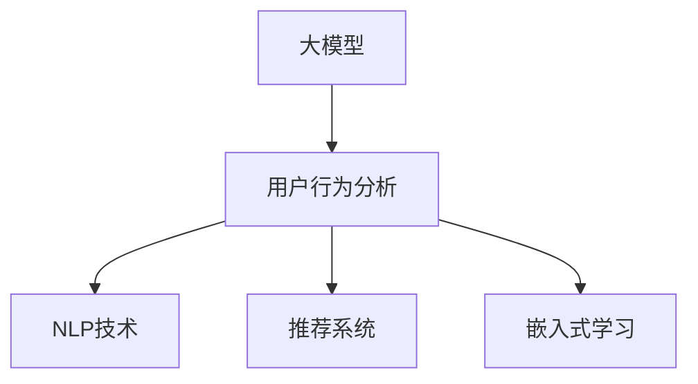

                 

# AI大模型在电商平台用户行为分析中的应用

> 关键词：大模型,用户行为分析,电商平台,自然语言处理,NLP,推荐系统

## 1. 背景介绍

### 1.1 问题由来

电商平台已成为现代消费者购物的重要渠道之一，其用户行为分析对提高转化率、提升用户体验、优化库存和运营管理具有重要意义。然而，传统的用户行为分析方法往往依赖于人工标注和手动规则，存在数据收集成本高、分析结果不稳定、复杂度高等问题。而人工智能（AI）技术的飞速发展，特别是大模型在自然语言处理（NLP）领域的应用，为电商平台用户行为分析带来了新的解决方案。

大模型通过在大规模无标签数据上进行预训练，学习到丰富的语言知识和常识，具备强大的语言理解和生成能力。在电商平台中，利用大模型对用户行为数据进行分析和建模，可以显著提升数据分析的准确性和效率，降低人工成本。本文将探讨基于大模型的用户行为分析方法，并提出具体的实践应用策略。

### 1.2 问题核心关键点

大模型在电商平台用户行为分析中的核心关键点包括：
- 如何高效地处理海量用户行为数据。
- 如何从用户行为数据中挖掘有价值的信息，如用户兴趣、购物行为、流失风险等。
- 如何利用大模型的语言理解能力，实现文本数据的自动分析。
- 如何结合推荐系统，提升电商平台的用户体验和运营效率。

本文将详细介绍这些关键问题，并通过具体的案例分析，展示大模型在电商平台用户行为分析中的实际应用效果。

## 2. 核心概念与联系

### 2.1 核心概念概述

为了更好地理解大模型在电商平台用户行为分析中的应用，本节将介绍几个密切相关的核心概念：

- 大模型（Large Model）：以自回归（如GPT）或自编码（如BERT）模型为代表的大规模预训练模型。通过在大规模无标签文本语料上进行预训练，学习通用的语言表示，具备强大的语言理解和生成能力。

- 用户行为分析（User Behavior Analysis）：通过分析用户的行为数据，如点击、浏览、购买、评论等，挖掘用户的兴趣偏好、购物习惯、流失风险等信息，为电商平台提供决策支持。

- 自然语言处理（NLP）：研究如何使计算机能够理解和生成人类语言的技术，包括分词、词性标注、句法分析、语义理解、信息抽取、情感分析等。

- 推荐系统（Recommendation System）：通过分析用户的历史行为和兴趣偏好，推荐符合用户需求的商品或内容，提升用户体验和运营效率。

- 嵌入式学习（Embedded Learning）：将用户行为数据嵌入到模型中，通过学习用户行为特征，提升模型的预测能力和决策质量。

这些核心概念之间的逻辑关系可以通过以下Mermaid流程图来展示：



这个流程图展示了大模型在电商平台用户行为分析中的核心概念及其之间的关系：

1. 大模型通过预训练获得基础能力。
2. 用户行为分析通过NLP技术对用户数据进行处理和分析，挖掘用户的兴趣偏好等信息。
3. 推荐系统利用用户行为分析的结果，为用户推荐合适的商品或内容。
4. 嵌入式学习将用户行为数据嵌入到模型中，提升模型的预测能力和决策质量。

这些概念共同构成了电商平台用户行为分析的框架，使得大模型能够更好地应用于电商平台，提升用户行为分析的准确性和效率。

## 3. 核心算法原理 & 具体操作步骤
### 3.1 算法原理概述

基于大模型的电商平台用户行为分析，本质上是一种自然语言处理（NLP）的应用。其核心思想是：利用大模型强大的语言理解能力，对用户行为数据进行语义分析和模式识别，从中挖掘出用户的兴趣偏好、购物习惯等信息，结合推荐系统，提升用户的购物体验和电商平台的运营效率。

形式化地，假设电商平台的用户行为数据集为 $D=\{(x_i, y_i)\}_{i=1}^N$，其中 $x_i$ 为用户行为数据，$y_i$ 为用户兴趣或购物行为标签。大模型的输出为 $\hat{y}=M_{\theta}(x_i) \in [0,1]$，表示用户行为与标签的预测概率。

微调的目标是最小化预测概率与真实标签之间的差异，即：

$$
\hat{y} \rightarrow \mathop{\arg\min}_{\theta} \mathcal{L}(M_{\theta}(x_i),y_i)
$$

其中 $\mathcal{L}$ 为交叉熵损失函数或自定义的损失函数，用于衡量模型预测与真实标签之间的差异。

### 3.2 算法步骤详解

基于大模型的电商平台用户行为分析，一般包括以下几个关键步骤：

**Step 1: 数据准备和预处理**

- 收集电商平台用户行为数据，如点击、浏览、购买、评论等。
- 对数据进行清洗和去噪，去除无关或异常的数据点。
- 将文本数据转换为模型输入所需的格式，如分词、去除停用词、词性标注等。

**Step 2: 选择预训练模型**

- 选择合适的预训练模型，如BERT、GPT等，作为初始化参数。
- 根据具体任务，选择适当的模型架构和超参数。

**Step 3: 设计任务适配层**

- 设计适当的任务适配层，将用户行为数据转换为模型可以处理的输入格式。
- 对于分类任务，通常在顶层添加线性分类器和交叉熵损失函数。
- 对于序列预测任务，通常使用语言模型的解码器输出概率分布，并以负对数似然为损失函数。

**Step 4: 微调模型**

- 使用用户行为数据训练模型，优化模型参数。
- 设置适当的学习率、批大小、迭代轮数等超参数。
- 应用正则化技术，如L2正则、Dropout、Early Stopping等，防止模型过拟合。
- 使用数据增强技术，如回译、近义替换等，丰富训练集多样性。
- 评估模型在验证集上的表现，根据性能指标决定是否停止训练。

**Step 5: 部署和使用**

- 在测试集上评估微调后模型的性能，对比微调前后的精度提升。
- 使用微调后的模型对新样本进行推理预测，集成到实际的应用系统中。
- 持续收集新的用户行为数据，定期重新微调模型，以适应数据分布的变化。

以上是基于大模型的电商平台用户行为分析的一般流程。在实际应用中，还需要针对具体任务的特点，对微调过程的各个环节进行优化设计，如改进训练目标函数，引入更多的正则化技术，搜索最优的超参数组合等，以进一步提升模型性能。

### 3.3 算法优缺点

基于大模型的电商平台用户行为分析方法具有以下优点：
1. 数据处理能力强。大模型能够处理海量的文本数据，降低人工标注成本。
2. 分析结果准确。大模型具备强大的语言理解能力，能够挖掘出用户的深层次兴趣和行为模式。
3. 可扩展性强。大模型的预训练权重可以复用，只需在模型顶层微调即可提升模型性能。
4. 灵活性强。可以通过多种任务适配层，支持不同类型的数据和分析任务。

同时，该方法也存在一定的局限性：
1. 依赖大规模数据。微调的效果很大程度上取决于标注数据的质量和数量，获取高质量标注数据的成本较高。
2. 模型复杂度高。大模型的参数量庞大，训练和推理速度较慢，对硬件资源要求较高。
3. 数据隐私风险。用户行为数据涉及隐私，需要采取适当的措施保护用户隐私。

尽管存在这些局限性，但就目前而言，基于大模型的用户行为分析方法仍是最主流的范式。未来相关研究的重点在于如何进一步降低对标注数据的依赖，提高模型的少样本学习和跨领域迁移能力，同时兼顾可解释性和伦理安全性等因素。

### 3.4 算法应用领域

基于大模型的电商平台用户行为分析方法，已经在推荐系统、个性化推荐、广告投放等多个领域得到了广泛的应用，具体如下：

**推荐系统（Recommendation System）**

推荐系统通过分析用户的历史行为和兴趣偏好，为用户推荐合适的商品或内容，提升用户体验和运营效率。利用大模型进行推荐系统开发，可以大大提升推荐效果，降低人工干预成本。

**个性化推荐（Personalized Recommendation）**

个性化推荐系统通过分析用户的行为数据，如浏览历史、购买记录等，预测用户可能感兴趣的商品，提升用户满意度。大模型可以更好地处理文本数据，挖掘用户的深层次兴趣和需求。

**广告投放（Ad Placement）**

广告投放系统通过分析用户的行为数据，预测用户的兴趣，精准投放广告，提升广告效果。大模型可以实时处理用户数据，动态调整广告投放策略，提高广告的点击率和转化率。

**用户行为分析（User Behavior Analysis）**

用户行为分析通过分析用户的行为数据，如点击、浏览、购买等，挖掘用户的兴趣偏好、购物习惯等信息，为电商平台提供决策支持。大模型可以处理海量数据，提升分析的准确性和效率。

## 4. 数学模型和公式 & 详细讲解 & 举例说明

### 4.1 数学模型构建

本节将使用数学语言对基于大模型的电商平台用户行为分析过程进行更加严格的刻画。

假设电商平台用户行为数据集为 $D=\{(x_i, y_i)\}_{i=1}^N$，其中 $x_i$ 为用户行为数据，$y_i$ 为用户兴趣或购物行为标签。定义模型 $M_{\theta}$ 在输入 $x_i$ 上的输出为 $\hat{y}=M_{\theta}(x_i) \in [0,1]$，表示用户行为与标签的预测概率。

微调的目标是最小化预测概率与真实标签之间的差异，即：

$$
\hat{y} \rightarrow \mathop{\arg\min}_{\theta} \mathcal{L}(M_{\theta}(x_i),y_i)
$$

其中 $\mathcal{L}$ 为交叉熵损失函数或自定义的损失函数，用于衡量模型预测与真实标签之间的差异。

在实践中，我们通常使用基于梯度的优化算法（如SGD、Adam等）来近似求解上述最优化问题。设 $\eta$ 为学习率，$\lambda$ 为正则化系数，则参数的更新公式为：

$$
\theta \leftarrow \theta - \eta \nabla_{\theta}\mathcal{L}(\theta) - \eta\lambda\theta
$$

其中 $\nabla_{\theta}\mathcal{L}(\theta)$ 为损失函数对参数 $\theta$ 的梯度，可通过反向传播算法高效计算。

### 4.2 公式推导过程

以下我们以推荐系统中的序列预测任务为例，推导交叉熵损失函数及其梯度的计算公式。

假设模型 $M_{\theta}$ 在输入 $x$ 上的输出为 $\hat{y}=M_{\theta}(x) \in [0,1]$，表示用户行为与标签的预测概率。真实标签 $y \in \{0,1\}$。则交叉熵损失函数定义为：

$$
\ell(M_{\theta}(x),y) = -[y\log \hat{y} + (1-y)\log (1-\hat{y})]
$$

将其代入经验风险公式，得：

$$
\mathcal{L}(\theta) = -\frac{1}{N}\sum_{i=1}^N [y_i\log M_{\theta}(x_i)+(1-y_i)\log(1-M_{\theta}(x_i))]
$$

根据链式法则，损失函数对参数 $\theta_k$ 的梯度为：

$$
\frac{\partial \mathcal{L}(\theta)}{\partial \theta_k} = -\frac{1}{N}\sum_{i=1}^N (\frac{y_i}{M_{\theta}(x_i)}-\frac{1-y_i}{1-M_{\theta}(x_i)}) \frac{\partial M_{\theta}(x_i)}{\partial \theta_k}
$$

其中 $\frac{\partial M_{\theta}(x_i)}{\partial \theta_k}$ 可进一步递归展开，利用自动微分技术完成计算。

在得到损失函数的梯度后，即可带入参数更新公式，完成模型的迭代优化。重复上述过程直至收敛，最终得到适应电商平台用户行为分析的最优模型参数 $\theta^*$。

## 5. 项目实践：代码实例和详细解释说明
### 5.1 开发环境搭建

在进行微调实践前，我们需要准备好开发环境。以下是使用Python进行PyTorch开发的环境配置流程：

1. 安装Anaconda：从官网下载并安装Anaconda，用于创建独立的Python环境。

2. 创建并激活虚拟环境：
```bash
conda create -n pytorch-env python=3.8 
conda activate pytorch-env
```

3. 安装PyTorch：根据CUDA版本，从官网获取对应的安装命令。例如：
```bash
conda install pytorch torchvision torchaudio cudatoolkit=11.1 -c pytorch -c conda-forge
```

4. 安装Transformers库：
```bash
pip install transformers
```

5. 安装各类工具包：
```bash
pip install numpy pandas scikit-learn matplotlib tqdm jupyter notebook ipython
```

完成上述步骤后，即可在`pytorch-env`环境中开始微调实践。

### 5.2 源代码详细实现

下面我以电商平台推荐系统为例，给出使用Transformers库对BERT模型进行微调的PyTorch代码实现。

首先，定义推荐系统的训练函数：

```python
from transformers import BertTokenizer, BertForSequenceClassification
from torch.utils.data import Dataset, DataLoader
import torch

class RecommendDataset(Dataset):
    def __init__(self, items, users, labels, tokenizer, max_len=128):
        self.items = items
        self.users = users
        self.labels = labels
        self.tokenizer = tokenizer
        self.max_len = max_len
        
    def __len__(self):
        return len(self.items)
    
    def __getitem__(self, item):
        user_id = self.users[item]
        item_id = self.items[item]
        label = self.labels[item]
        
        # 对用户行为数据进行编码
        encoding = self.tokenizer(user_id, item_id, return_tensors='pt', max_length=self.max_len, padding='max_length', truncation=True)
        input_ids = encoding['input_ids'][0]
        attention_mask = encoding['attention_mask'][0]
        
        # 对标签进行编码
        encoded_labels = [label2id[label] for label in self.labels] 
        encoded_labels.extend([label2id['None']] * (self.max_len - len(encoded_labels)))
        labels = torch.tensor(encoded_labels, dtype=torch.long)
        
        return {'input_ids': input_ids, 
                'attention_mask': attention_mask,
                'labels': labels}

# 标签与id的映射
label2id = {'positive': 1, 'negative': 0}
id2label = {v: k for k, v in label2id.items()}

# 创建dataset
tokenizer = BertTokenizer.from_pretrained('bert-base-cased')

train_dataset = RecommendDataset(train_items, train_users, train_labels, tokenizer)
dev_dataset = RecommendDataset(dev_items, dev_users, dev_labels, tokenizer)
test_dataset = RecommendDataset(test_items, test_users, test_labels, tokenizer)
```

然后，定义模型和优化器：

```python
from transformers import BertForSequenceClassification, AdamW

model = BertForSequenceClassification.from_pretrained('bert-base-cased', num_labels=len(label2id))

optimizer = AdamW(model.parameters(), lr=2e-5)
```

接着，定义训练和评估函数：

```python
from torch.utils.data import DataLoader
from tqdm import tqdm
from sklearn.metrics import classification_report

device = torch.device('cuda') if torch.cuda.is_available() else torch.device('cpu')
model.to(device)

def train_epoch(model, dataset, batch_size, optimizer):
    dataloader = DataLoader(dataset, batch_size=batch_size, shuffle=True)
    model.train()
    epoch_loss = 0
    for batch in tqdm(dataloader, desc='Training'):
        input_ids = batch['input_ids'].to(device)
        attention_mask = batch['attention_mask'].to(device)
        labels = batch['labels'].to(device)
        model.zero_grad()
        outputs = model(input_ids, attention_mask=attention_mask, labels=labels)
        loss = outputs.loss
        epoch_loss += loss.item()
        loss.backward()
        optimizer.step()
    return epoch_loss / len(dataloader)

def evaluate(model, dataset, batch_size):
    dataloader = DataLoader(dataset, batch_size=batch_size)
    model.eval()
    preds, labels = [], []
    with torch.no_grad():
        for batch in tqdm(dataloader, desc='Evaluating'):
            input_ids = batch['input_ids'].to(device)
            attention_mask = batch['attention_mask'].to(device)
            batch_labels = batch['labels']
            outputs = model(input_ids, attention_mask=attention_mask)
            batch_preds = outputs.logits.argmax(dim=2).to('cpu').tolist()
            batch_labels = batch_labels.to('cpu').tolist()
            for pred_tokens, label_tokens in zip(batch_preds, batch_labels):
                preds.append(pred_tokens[:len(label_tokens)])
                labels.append(label_tokens)
                
    print(classification_report(labels, preds))
```

最后，启动训练流程并在测试集上评估：

```python
epochs = 5
batch_size = 16

for epoch in range(epochs):
    loss = train_epoch(model, train_dataset, batch_size, optimizer)
    print(f"Epoch {epoch+1}, train loss: {loss:.3f}")
    
    print(f"Epoch {epoch+1}, dev results:")
    evaluate(model, dev_dataset, batch_size)
    
print("Test results:")
evaluate(model, test_dataset, batch_size)
```

以上就是使用PyTorch对BERT进行推荐系统开发的完整代码实现。可以看到，得益于Transformers库的强大封装，我们可以用相对简洁的代码完成BERT模型的加载和微调。

### 5.3 代码解读与分析

让我们再详细解读一下关键代码的实现细节：

**RecommendDataset类**：
- `__init__`方法：初始化用户、商品、标签等关键组件，并进行编码。
- `__len__`方法：返回数据集的样本数量。
- `__getitem__`方法：对单个样本进行处理，将用户行为数据输入编码为token ids，并将标签编码为数字，并进行定长padding。

**label2id和id2label字典**：
- 定义了标签与数字id之间的映射关系，用于将预测结果解码回真实的标签。

**训练和评估函数**：
- 使用PyTorch的DataLoader对数据集进行批次化加载，供模型训练和推理使用。
- 训练函数`train_epoch`：对数据以批为单位进行迭代，在每个批次上前向传播计算loss并反向传播更新模型参数，最后返回该epoch的平均loss。
- 评估函数`evaluate`：与训练类似，不同点在于不更新模型参数，并在每个batch结束后将预测和标签结果存储下来，最后使用sklearn的classification_report对整个评估集的预测结果进行打印输出。

**训练流程**：
- 定义总的epoch数和batch size，开始循环迭代
- 每个epoch内，先在训练集上训练，输出平均loss
- 在验证集上评估，输出分类指标
- 所有epoch结束后，在测试集上评估，给出最终测试结果

可以看到，PyTorch配合Transformers库使得BERT微调的代码实现变得简洁高效。开发者可以将更多精力放在数据处理、模型改进等高层逻辑上，而不必过多关注底层的实现细节。

当然，工业级的系统实现还需考虑更多因素，如模型的保存和部署、超参数的自动搜索、更灵活的任务适配层等。但核心的微调范式基本与此类似。

## 6. 实际应用场景

### 6.1 智能客服系统

基于大模型微调的对话技术，可以广泛应用于智能客服系统的构建。传统客服往往需要配备大量人力，高峰期响应缓慢，且一致性和专业性难以保证。而使用微调后的对话模型，可以7x24小时不间断服务，快速响应客户咨询，用自然流畅的语言解答各类常见问题。

在技术实现上，可以收集企业内部的历史客服对话记录，将问题和最佳答复构建成监督数据，在此基础上对预训练对话模型进行微调。微调后的对话模型能够自动理解用户意图，匹配最合适的答案模板进行回复。对于客户提出的新问题，还可以接入检索系统实时搜索相关内容，动态组织生成回答。如此构建的智能客服系统，能大幅提升客户咨询体验和问题解决效率。

### 6.2 金融舆情监测

金融机构需要实时监测市场舆论动向，以便及时应对负面信息传播，规避金融风险。传统的人工监测方式成本高、效率低，难以应对网络时代海量信息爆发的挑战。基于大语言模型微调的文本分类和情感分析技术，为金融舆情监测提供了新的解决方案。

具体而言，可以收集金融领域相关的新闻、报道、评论等文本数据，并对其进行主题标注和情感标注。在此基础上对预训练语言模型进行微调，使其能够自动判断文本属于何种主题，情感倾向是正面、中性还是负面。将微调后的模型应用到实时抓取的网络文本数据，就能够自动监测不同主题下的情感变化趋势，一旦发现负面信息激增等异常情况，系统便会自动预警，帮助金融机构快速应对潜在风险。

### 6.3 个性化推荐系统

当前的推荐系统往往只依赖用户的历史行为数据进行物品推荐，无法深入理解用户的真实兴趣偏好。基于大语言模型微调技术，个性化推荐系统可以更好地挖掘用户行为背后的语义信息，从而提供更精准、多样的推荐内容。

在实践中，可以收集用户浏览、点击、评论、分享等行为数据，提取和用户交互的物品标题、描述、标签等文本内容。将文本内容作为模型输入，用户的后续行为（如是否点击、购买等）作为监督信号，在此基础上微调预训练语言模型。微调后的模型能够从文本内容中准确把握用户的兴趣点。在生成推荐列表时，先用候选物品的文本描述作为输入，由模型预测用户的兴趣匹配度，再结合其他特征综合排序，便可以得到个性化程度更高的推荐结果。

### 6.4 未来应用展望

随着大语言模型微调技术的不断发展，基于微调范式将在更多领域得到应用，为传统行业带来变革性影响。

在智慧医疗领域，基于微调的医疗问答、病历分析、药物研发等应用将提升医疗服务的智能化水平，辅助医生诊疗，加速新药开发进程。

在智能教育领域，微调技术可应用于作业批改、学情分析、知识推荐等方面，因材施教，促进教育公平，提高教学质量。

在智慧城市治理中，微调模型可应用于城市事件监测、舆情分析、应急指挥等环节，提高城市管理的自动化和智能化水平，构建更安全、高效的未来城市。

此外，在企业生产、社会治理、文娱传媒等众多领域，基于大模型微调的人工智能应用也将不断涌现，为经济社会发展注入新的动力。相信随着技术的日益成熟，微调方法将成为人工智能落地应用的重要范式，推动人工智能技术在垂直行业的规模化落地。总之，微调需要开发者根据具体任务，不断迭代和优化模型、数据和算法，方能得到理想的效果。

## 7. 工具和资源推荐
### 7.1 学习资源推荐

为了帮助开发者系统掌握大语言模型微调的理论基础和实践技巧，这里推荐一些优质的学习资源：

1. 《Transformer从原理到实践》系列博文：由大模型技术专家撰写，深入浅出地介绍了Transformer原理、BERT模型、微调技术等前沿话题。

2. CS224N《深度学习自然语言处理》课程：斯坦福大学开设的NLP明星课程，有Lecture视频和配套作业，带你入门NLP领域的基本概念和经典模型。

3. 《Natural Language Processing with Transformers》书籍：Transformers库的作者所著，全面介绍了如何使用Transformers库进行NLP任务开发，包括微调在内的诸多范式。

4. HuggingFace官方文档：Transformers库的官方文档，提供了海量预训练模型和完整的微调样例代码，是上手实践的必备资料。

5. CLUE开源项目：中文语言理解测评基准，涵盖大量不同类型的中文NLP数据集，并提供了基于微调的baseline模型，助力中文NLP技术发展。

通过对这些资源的学习实践，相信你一定能够快速掌握大语言模型微调的精髓，并用于解决实际的NLP问题。
###  7.2 开发工具推荐

高效的开发离不开优秀的工具支持。以下是几款用于大语言模型微调开发的常用工具：

1. PyTorch：基于Python的开源深度学习框架，灵活动态的计算图，适合快速迭代研究。大部分预训练语言模型都有PyTorch版本的实现。

2. TensorFlow：由Google主导开发的开源深度学习框架，生产部署方便，适合大规模工程应用。同样有丰富的预训练语言模型资源。

3. Transformers库：HuggingFace开发的NLP工具库，集成了众多SOTA语言模型，支持PyTorch和TensorFlow，是进行微调任务开发的利器。

4. Weights & Biases：模型训练的实验跟踪工具，可以记录和可视化模型训练过程中的各项指标，方便对比和调优。与主流深度学习框架无缝集成。

5. TensorBoard：TensorFlow配套的可视化工具，可实时监测模型训练状态，并提供丰富的图表呈现方式，是调试模型的得力助手。

6. Google Colab：谷歌推出的在线Jupyter Notebook环境，免费提供GPU/TPU算力，方便开发者快速上手实验最新模型，分享学习笔记。

合理利用这些工具，可以显著提升大语言模型微调任务的开发效率，加快创新迭代的步伐。

### 7.3 相关论文推荐

大语言模型和微调技术的发展源于学界的持续研究。以下是几篇奠基性的相关论文，推荐阅读：

1. Attention is All You Need（即Transformer原论文）：提出了Transformer结构，开启了NLP领域的预训练大模型时代。

2. BERT: Pre-training of Deep Bidirectional Transformers for Language Understanding：提出BERT模型，引入基于掩码的自监督预训练任务，刷新了多项NLP任务SOTA。

3. Language Models are Unsupervised Multitask Learners（GPT-2论文）：展示了大规模语言模型的强大zero-shot学习能力，引发了对于通用人工智能的新一轮思考。

4. Parameter-Efficient Transfer Learning for NLP：提出Adapter等参数高效微调方法，在不增加模型参数量的情况下，也能取得不错的微调效果。

5. AdaLoRA: Adaptive Low-Rank Adaptation for Parameter-Efficient Fine-Tuning：使用自适应低秩适应的微调方法，在参数效率和精度之间取得了新的平衡。

这些论文代表了大语言模型微调技术的发展脉络。通过学习这些前沿成果，可以帮助研究者把握学科前进方向，激发更多的创新灵感。

## 8. 总结：未来发展趋势与挑战

### 8.1 总结

本文对基于大模型的电商平台用户行为分析方法进行了全面系统的介绍。首先阐述了大模型和微调技术的研究背景和意义，明确了微调在拓展预训练模型应用、提升下游任务性能方面的独特价值。其次，从原理到实践，详细讲解了微调的基本流程和关键步骤，给出了具体的代码实现和详细解释。同时，本文还广泛探讨了微调方法在智能客服、金融舆情、个性化推荐等多个行业领域的应用前景，展示了微调范式的巨大潜力。此外，本文精选了微调技术的各类学习资源，力求为读者提供全方位的技术指引。

通过本文的系统梳理，可以看到，基于大模型的用户行为分析方法在电商平台中的应用前景广阔，具备数据处理能力强、分析结果准确、可扩展性强、灵活性高等优点。尽管存在依赖大规模数据、模型复杂度高、数据隐私风险等局限性，但通过持续优化和改进，这些问题有望得到解决。相信随着大模型和微调技术的不断进步，未来电商平台用户行为分析将迈入新的阶段，为电商平台提供更加智能化的决策支持。

### 8.2 未来发展趋势

展望未来，大模型在电商平台用户行为分析中的发展趋势主要包括以下几个方面：

1. 大模型规模化应用。伴随预训练模型和微调方法的不断演进，大模型的应用场景将更加广泛，包括推荐系统、智能客服、金融舆情等。

2. 多模态融合。未来的推荐系统将融合文本、图像、视频等多模态信息，提升推荐的准确性和多样性。

3. 实时化处理。为了提高用户体验和运营效率，推荐系统和智能客服将实现实时化处理，响应速度将得到显著提升。

4. 个性化推荐。通过深度学习模型和大模型结合，推荐系统将更好地理解用户的深层次兴趣和需求，实现更加精准的个性化推荐。

5. 跨领域迁移。大模型将具备更强的跨领域迁移能力，能够在不同领域间进行知识迁移和应用。

6. 知识图谱整合。未来的电商平台将更加注重知识图谱的整合和应用，利用大模型进行知识抽取和推理，提升推荐系统的智能水平。

以上趋势凸显了大模型在电商平台用户行为分析中的广阔前景。这些方向的探索发展，必将进一步提升电商平台的智能化水平，为消费者提供更优质的购物体验，为商家提供更有效的运营支持。

### 8.3 面临的挑战

尽管大模型在电商平台用户行为分析中具备诸多优势，但仍面临以下挑战：

1. 数据隐私问题。电商平台涉及用户隐私数据，如何在保障数据隐私的同时，获取高质量标注数据，是亟待解决的问题。

2. 过拟合风险。微调模型面对域外数据时，容易发生过拟合，导致泛化性能下降。如何提高模型的鲁棒性和泛化能力，是未来研究的重点。

3. 模型复杂度高。大模型的参数量庞大，训练和推理速度较慢，对硬件资源要求较高。如何优化模型结构，提升推理效率，降低计算成本，是亟需解决的问题。

4. 模型可解释性。大模型的决策过程往往缺乏可解释性，难以对其推理逻辑进行分析和调试。如何赋予模型更强的可解释性，是亟需解决的问题。

5. 用户行为数据的处理。电商平台的用户行为数据种类繁多，如何高效地处理和分析这些数据，是亟需解决的问题。

6. 跨领域数据融合。不同领域的数据具有不同的特征和格式，如何实现跨领域数据的融合和统一，是亟需解决的问题。

尽管存在这些挑战，但随着大模型和微调技术的不断进步，这些问题有望得到解决。相信在未来的研究中，通过跨学科的合作和技术创新，大模型在电商平台用户行为分析中的应用前景将更加广阔。

### 8.4 研究展望

未来，大模型在电商平台用户行为分析领域的研究展望主要包括以下几个方面：

1. 跨领域数据融合技术。如何实现跨领域数据的融合和统一，是大模型在电商平台上应用的重要研究方向。

2. 实时推荐系统。如何将大模型与实时推荐系统结合，实现实时推荐，是大模型在电商平台应用的关键问题。

3. 个性化推荐模型。如何利用大模型更好地理解用户的深层次兴趣和需求，实现更加精准的个性化推荐，是大模型在电商平台上应用的重要研究方向。

4. 多模态融合推荐。如何融合文本、图像、视频等多模态信息，提升推荐系统的智能水平，是大模型在电商平台应用的重要研究方向。

5. 跨领域迁移学习。如何实现大模型在不同领域间的知识迁移和应用，是大模型在电商平台应用的重要研究方向。

6. 用户行为数据处理技术。如何高效地处理和分析电商平台上的用户行为数据，是大模型在电商平台上应用的重要研究方向。

通过这些研究方向的探索，相信大模型在电商平台用户行为分析中的应用前景将更加广阔，为电商平台提供更加智能化的决策支持，提升用户体验和运营效率。总之，大模型在电商平台用户行为分析中的应用是大数据和人工智能技术的有机结合，具有重要的理论和实践价值。

## 9. 附录：常见问题与解答

**Q1：电商平台用户行为分析的主要数据类型有哪些？**

A: 电商平台用户行为分析的主要数据类型包括：
1. 点击数据：用户点击商品或页面的记录。
2. 浏览数据：用户浏览商品或页面的记录。
3. 购买数据：用户购买商品或支付的记录。
4. 评论数据：用户对商品或页面的评论记录。
5. 搜索数据：用户对商品或页面的搜索记录。
6. 评分数据：用户对商品或页面的评分记录。
7. 访问数据：用户访问网站或应用的记录。

**Q2：电商平台用户行为分析的常用特征有哪些？**

A: 电商平台用户行为分析的常用特征包括：
1. 用户ID：用户的唯一标识符。
2. 商品ID：商品的唯一标识符。
3. 浏览时长：用户浏览页面的时间。
4. 浏览次数：用户浏览页面的次数。
5. 点击次数：用户点击商品或页面的次数。
6. 购买次数：用户购买商品或支付的次数。
7. 购买金额：用户购买商品或支付的总金额。
8. 评论情感：用户对商品或页面的评论情感。
9. 评分：用户对商品或页面的评分。

**Q3：如何处理电商平台用户行为数据？**

A: 电商平台用户行为数据处理通常包括以下几个步骤：
1. 数据清洗：去除无关或异常的数据点。
2. 特征工程：提取和构造有用特征，如用户ID、商品ID、浏览时长等。
3. 数据增强：通过回译、近义替换等技术，扩充训练集。
4. 数据编码：将文本数据转换为模型可以处理的输入格式，如分词、去除停用词、词性标注等。
5. 特征选择：选择对预测结果有重要影响的特征。

**Q4：如何进行电商平台用户行为分析的模型训练？**

A: 电商平台用户行为分析的模型训练通常包括以下几个步骤：
1. 选择合适的预训练模型，如BERT、GPT等。
2. 设计适当的任务适配层，将用户行为数据转换为模型可以处理的输入格式。
3. 使用用户行为数据训练模型，优化模型参数。
4. 设置适当的学习率、批大小、迭代轮数等超参数。
5. 应用正则化技术，如L2正则、Dropout、Early Stopping等，防止模型过拟合。
6. 在测试集上评估微调后模型的性能，对比微调前后的精度提升。

**Q5：如何进行电商平台用户行为分析的模型评估？**

A: 电商平台用户行为分析的模型评估通常包括以下几个步骤：
1. 在验证集上评估模型性能，如准确率、召回率、F1值等。
2. 在测试集上评估模型性能，如ROC曲线、AUC等。
3. 分析模型预测结果，找出模型的强项和弱项。
4. 优化模型超参数，提升模型性能。
5. 实时监测模型性能，及时调整模型参数。

通过这些步骤，可以全面评估和优化电商平台用户行为分析的模型，提升模型的预测能力和决策质量。

