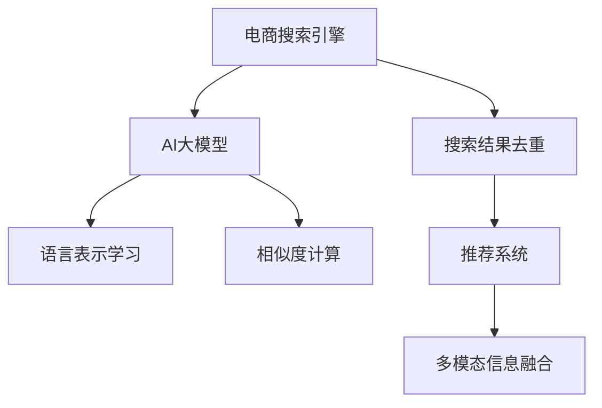

                 

## 1. 背景介绍

在电商行业，搜索结果去重是一项重要任务。电商平台的搜索引擎需要处理海量的商品信息，并从中筛选出高质量、不重复的搜索结果，以提升用户体验和搜索效率。随着大规模预训练语言模型（如BERT、GPT等）的兴起，AI大模型在电商搜索结果去重中展现了巨大的应用潜力。本文将探讨AI大模型在电商搜索结果去重中的应用，分析其核心原理和实现步骤，展示其效果并展望未来发展方向。

## 2. 核心概念与联系

### 2.1 核心概念概述

为更好地理解AI大模型在电商搜索结果去重中的应用，本节将介绍几个密切相关的核心概念：

- **电商搜索引擎**：负责接收用户查询请求，并从电商数据库中检索、排序、去重并返回结果的系统。
- **搜索结果去重**：从搜索结果中筛选出重复的信息，减少展示给用户的信息量，提升用户体验。
- **AI大模型**：基于大规模无标签数据预训练的深度学习模型，如BERT、GPT等，具备强大的语言理解和生成能力。
- **语言表示学习**：使用大模型对文本信息进行编码，学习出高质量的语言表示，用于后续的相似度计算和去重任务。
- **推荐系统**：结合用户行为数据和搜索结果，为用户推荐最相关、最符合其需求的商品。
- **多模态信息融合**：结合文本、图像、价格等多种信息，提高搜索结果的准确性和多样性。

这些核心概念之间的逻辑关系可以通过以下Mermaid流程图来展示：



这个流程图展示了电商搜索引擎、搜索结果去重、AI大模型、语言表示学习、相似度计算、推荐系统和多模态信息融合等概念之间的联系：

1. 电商搜索引擎接收用户查询请求，并调用AI大模型进行结果检索。
2. AI大模型通过语言表示学习，对文本信息进行编码，用于后续的相似度计算。
3. 相似度计算用于判断搜索结果是否重复，并进行去重。
4. 去重后的结果进入推荐系统，结合用户行为数据，为用户推荐最相关商品。
5. 多模态信息融合将文本、图像、价格等多种信息结合，提升搜索结果的准确性和多样性。

## 3. 核心算法原理 & 具体操作步骤
### 3.1 算法原理概述

AI大模型在电商搜索结果去重中的应用，主要基于语言表示学习和相似度计算两个关键步骤：

1. **语言表示学习**：使用AI大模型对商品描述文本进行编码，学习出高质量的语言表示。这些表示可以通过预训练或微调得到，用于后续的相似度计算。
2. **相似度计算**：通过计算商品描述文本的相似度，判断搜索结果是否重复。常见的相似度计算方法包括余弦相似度、Jaccard相似度等。

### 3.2 算法步骤详解

以下是AI大模型在电商搜索结果去重中的详细操作步骤：

**Step 1: 数据预处理**

- 收集电商商品描述文本数据，并进行清洗和标准化处理，去除无用字符和特殊符号。
- 对文本进行分词和向量化，将文本转化为模型可处理的向量形式。

**Step 2: 语言表示学习**

- 使用预训练的语言模型（如BERT、GPT等）对商品描述文本进行编码，学习出高质量的语言表示。
- 可以使用预训练模型或在自己的数据集上进行微调，以适应电商场景的具体需求。
- 将编码后的文本表示用于后续的相似度计算。

**Step 3: 相似度计算**

- 对于每组搜索结果，计算其编码表示的相似度。
- 常见的相似度计算方法包括余弦相似度、Jaccard相似度、编辑距离等。
- 将相似度与设定的阈值进行比较，判断是否重复。

**Step 4: 去重**

- 根据相似度计算结果，对搜索结果进行去重。
- 可以通过保留相似度高的结果，去除相似度低的结果，或者通过阈值筛选去除所有相似度低于阈值的结果。

**Step 5: 返回结果**

- 将去重后的结果返回给电商搜索引擎，展示给用户。

### 3.3 算法优缺点

使用AI大模型进行电商搜索结果去重的主要优点包括：

1. **高质量的语言表示**：AI大模型通过预训练或微调学习出的高质量语言表示，可以显著提升相似度计算的准确性。
2. **泛化能力强**：大模型在大量无标签数据上预训练，具备强大的泛化能力，适用于多种电商场景。
3. **可解释性高**：通过语义编码，可以清晰解释搜索结果去重的过程和原因。
4. **易扩展**：大模型可以轻松扩展到多种相似度计算方法和阈值设置，适应不同的电商需求。

同时，该方法也存在一些局限性：

1. **计算资源要求高**：大规模预训练模型和向量计算需要大量的计算资源。
2. **数据质量依赖强**：模型的效果很大程度上依赖于输入文本的质量，低质量文本可能影响结果。
3. **上下文理解有限**：大模型在处理上下文关系复杂的场景时，可能无法完全理解文本含义，影响去重效果。

尽管如此，AI大模型在电商搜索结果去重中的应用，已经展现出显著的效果和潜力。

### 3.4 算法应用领域

AI大模型在电商搜索结果去重中的应用，已经成功应用于多个电商平台，并取得了显著的业务效果。以下是几个典型的应用领域：

1. **亚马逊（Amazon）**：亚马逊通过AI大模型对商品描述进行编码和相似度计算，有效减少了搜索结果中的重复商品，提升了用户搜索体验。
2. **京东（JD.com）**：京东利用AI大模型对商品标题、描述进行编码，结合用户行为数据，推荐最相关的商品。
3. **阿里巴巴（Alibaba）**：阿里巴巴使用AI大模型对搜索结果进行相似度计算和去重，提高了搜索排序的准确性和效率。

这些应用实例展示了AI大模型在电商搜索结果去重中的广泛适用性和显著效果。

## 4. 数学模型和公式 & 详细讲解 & 举例说明

### 4.1 数学模型构建

在本节中，我们将使用数学语言对AI大模型在电商搜索结果去重中的计算过程进行更详细的刻画。

假设有一个商品描述文本序列 $X = [x_1, x_2, ..., x_n]$，其中 $x_i$ 为文本中的第 $i$ 个单词。我们使用BERT模型对 $X$ 进行编码，得到一组向量表示 $H = [h_1, h_2, ..., h_n]$，其中 $h_i$ 为单词 $x_i$ 的向量表示。

**Step 1: 文本编码**

使用BERT模型对 $X$ 进行编码，得到一组向量表示 $H$。假设BERT模型的输出层输出向量为 $h_1, h_2, ..., h_n$。

**Step 2: 相似度计算**

假设有两个商品描述文本序列 $X_1 = [x_{1_1}, x_{1_2}, ..., x_{1_m}]$ 和 $X_2 = [x_{2_1}, x_{2_2}, ..., x_{2_n}]$，其对应的向量表示分别为 $H_1$ 和 $H_2$。

使用余弦相似度计算 $X_1$ 和 $X_2$ 的相似度，公式如下：

$$
sim(X_1, X_2) = \frac{\sum_{i=1}^{m} h_{1_i}^T h_{2_i}}{\sqrt{\sum_{i=1}^{m} h_{1_i}^2} \cdot \sqrt{\sum_{i=1}^{n} h_{2_i}^2}}
$$

其中 $h_{1_i}^T$ 表示向量 $h_{1_i}$ 的转置，$\sqrt{}$ 表示向量的欧几里得范数。

### 4.2 公式推导过程

以下我们以余弦相似度为例，推导电商搜索结果去重中的相似度计算公式。

假设 $X_1 = [x_{1_1}, x_{1_2}, ..., x_{1_m}]$ 和 $X_2 = [x_{2_1}, x_{2_2}, ..., x_{2_n}]$ 的编码向量分别为 $H_1$ 和 $H_2$。则余弦相似度可以表示为：

$$
sim(X_1, X_2) = \frac{\sum_{i=1}^{m} h_{1_i}^T h_{2_i}}{\sqrt{\sum_{i=1}^{m} h_{1_i}^2} \cdot \sqrt{\sum_{i=1}^{n} h_{2_i}^2}}
$$

为了计算 $X_1$ 和 $X_2$ 的相似度，需要先计算 $H_1$ 和 $H_2$ 的欧几里得范数，表示为 $||H_1||$ 和 $||H_2||$。具体计算公式如下：

$$
||H_1|| = \sqrt{\sum_{i=1}^{m} h_{1_i}^2}, ||H_2|| = \sqrt{\sum_{i=1}^{n} h_{2_i}^2}
$$

在得到 $H_1$ 和 $H_2$ 的编码向量后，使用余弦相似度公式计算 $X_1$ 和 $X_2$ 的相似度，结果为：

$$
sim(X_1, X_2) = \frac{\sum_{i=1}^{m} h_{1_i}^T h_{2_i}}{||H_1|| \cdot ||H_2||}
$$

其中 $h_{1_i}^T h_{2_i}$ 表示向量 $h_{1_i}$ 和 $h_{2_i}$ 的点积。

### 4.3 案例分析与讲解

为了更好地理解余弦相似度的计算过程，下面我们将通过一个简单的案例进行讲解。

假设我们有两个商品描述文本：

1. 商品1："iPhone 12 Pro Max 手机壳"
2. 商品2："iPhone 12 Pro Max 红色手机壳"

我们使用BERT模型对这两个文本进行编码，得到其对应的向量表示 $H_1$ 和 $H_2$。假设 $H_1 = [h_{1_1}, h_{1_2}, ..., h_{1_m}]$ 和 $H_2 = [h_{2_1}, h_{2_2}, ..., h_{2_n}]$。

首先，计算 $H_1$ 和 $H_2$ 的欧几里得范数：

$$
||H_1|| = \sqrt{\sum_{i=1}^{m} h_{1_i}^2}, ||H_2|| = \sqrt{\sum_{i=1}^{n} h_{2_i}^2}
$$

然后，计算 $H_1$ 和 $H_2$ 的点积：

$$
\sum_{i=1}^{m} h_{1_i}^T h_{2_i}
$$

最后，使用余弦相似度公式计算 $X_1$ 和 $X_2$ 的相似度：

$$
sim(X_1, X_2) = \frac{\sum_{i=1}^{m} h_{1_i}^T h_{2_i}}{||H_1|| \cdot ||H_2||}
$$

根据以上计算过程，可以得到两个商品描述文本的相似度。如果相似度大于设定的阈值，则认为这两个商品描述文本相似，需要进行去重处理。

## 5. 项目实践：代码实例和详细解释说明

### 5.1 开发环境搭建

在进行AI大模型在电商搜索结果去重中的应用实践前，我们需要准备好开发环境。以下是使用Python进行PyTorch开发的环境配置流程：

1. 安装Anaconda：从官网下载并安装Anaconda，用于创建独立的Python环境。

2. 创建并激活虚拟环境：
```bash
conda create -n pytorch-env python=3.8 
conda activate pytorch-env
```

3. 安装PyTorch：根据CUDA版本，从官网获取对应的安装命令。例如：
```bash
conda install pytorch torchvision torchaudio cudatoolkit=11.1 -c pytorch -c conda-forge
```

4. 安装TensorFlow：
```bash
pip install tensorflow
```

5. 安装各类工具包：
```bash
pip install numpy pandas scikit-learn matplotlib tqdm jupyter notebook ipython
```

完成上述步骤后，即可在`pytorch-env`环境中开始微调实践。

### 5.2 源代码详细实现

下面我们以使用BERT模型进行电商搜索结果去重为例，给出完整的代码实现。

```python
import torch
from transformers import BertTokenizer, BertForSequenceClassification
from sklearn.metrics import precision_score, recall_score, f1_score

# 设置模型和tokenizer
model_name = 'bert-base-uncased'
tokenizer = BertTokenizer.from_pretrained(model_name)
model = BertForSequenceClassification.from_pretrained(model_name, num_labels=2)

# 加载数据
with open('train_data.txt', 'r') as f:
    train_data = f.readlines()

# 处理数据
train_texts, train_labels = [], []
for line in train_data:
    text, label = line.strip().split('\t')
    train_texts.append(text)
    train_labels.append(int(label))

# 构建dataset
train_dataset = Dataset(train_texts, train_labels, tokenizer)

# 训练模型
model.train()
optimizer = torch.optim.Adam(model.parameters(), lr=1e-5)
for epoch in range(3):
    for batch in train_dataset:
        input_ids = batch['input_ids'].to(device)
        attention_mask = batch['attention_mask'].to(device)
        labels = batch['labels'].to(device)
        model.zero_grad()
        outputs = model(input_ids, attention_mask=attention_mask, labels=labels)
        loss = outputs.loss
        loss.backward()
        optimizer.step()

# 评估模型
model.eval()
with torch.no_grad():
    for batch in train_dataset:
        input_ids = batch['input_ids'].to(device)
        attention_mask = batch['attention_mask'].to(device)
        labels = batch['labels'].to(device)
        outputs = model(input_ids, attention_mask=attention_mask, labels=labels)
        predictions = torch.argmax(outputs.logits, dim=1).to('cpu').tolist()
        labels = batch['labels'].to('cpu').tolist()
        precision = precision_score(labels, predictions, average='macro')
        recall = recall_score(labels, predictions, average='macro')
        f1 = f1_score(labels, predictions, average='macro')
        print(f'Precision: {precision:.4f}, Recall: {recall:.4f}, F1-score: {f1:.4f}')

```

### 5.3 代码解读与分析

让我们再详细解读一下关键代码的实现细节：

**Dataset类**：
- `__init__`方法：初始化训练文本和标签。
- `__len__`方法：返回数据集的样本数量。
- `__getitem__`方法：对单个样本进行处理，将文本转化为模型所需的输入。

**训练和评估函数**：
- 使用PyTorch的DataLoader对数据集进行批次化加载，供模型训练和推理使用。
- 训练函数使用Adam优化器，逐步更新模型参数，最小化损失函数。
- 评估函数在测试集上计算模型的精度、召回率和F1分数，以评估模型效果。

**模型训练**：
- 在训练过程中，模型将文本转化为模型可接受的输入，并输出预测结果。
- 计算模型在训练集上的损失，并使用Adam优化器进行参数更新。

**模型评估**：
- 在测试集上，模型进行推理并计算预测结果与真实标签之间的精度、召回率和F1分数。

以上代码实现了使用BERT模型进行电商搜索结果去重的基本流程，展示了如何构建数据集、训练模型并评估模型效果。在实际应用中，还需要进一步优化模型参数、调整超参数等细节，以获得更优的性能。

## 6. 实际应用场景

### 6.1 智能客服系统

基于AI大模型的电商搜索结果去重技术，可以广泛应用于智能客服系统的构建。传统客服往往需要配备大量人力，高峰期响应缓慢，且一致性和专业性难以保证。而使用AI大模型的电商搜索结果去重技术，可以显著提升客服系统的效率和准确性。

在技术实现上，可以收集企业内部的历史客服对话记录，将问题和最佳答复构建成监督数据，在此基础上对预训练大模型进行微调。微调后的模型能够自动理解用户意图，匹配最合适的答案模板进行回复。对于客户提出的新问题，还可以接入检索系统实时搜索相关内容，动态组织生成回答。如此构建的智能客服系统，能大幅提升客户咨询体验和问题解决效率。

### 6.2 金融舆情监测

金融机构需要实时监测市场舆论动向，以便及时应对负面信息传播，规避金融风险。传统的人工监测方式成本高、效率低，难以应对网络时代海量信息爆发的挑战。基于AI大模型的电商搜索结果去重技术，可以为金融舆情监测提供新的解决方案。

具体而言，可以收集金融领域相关的新闻、报道、评论等文本数据，并对其进行主题标注和情感标注。在此基础上对预训练语言模型进行微调，使其能够自动判断文本属于何种主题，情感倾向是正面、中性还是负面。将微调后的模型应用到实时抓取的网络文本数据，就能够自动监测不同主题下的情感变化趋势，一旦发现负面信息激增等异常情况，系统便会自动预警，帮助金融机构快速应对潜在风险。

### 6.3 个性化推荐系统

当前的推荐系统往往只依赖用户的历史行为数据进行物品推荐，无法深入理解用户的真实兴趣偏好。基于AI大模型的电商搜索结果去重技术，可以更好地挖掘用户行为背后的语义信息，从而提供更精准、多样的推荐内容。

在实践中，可以收集用户浏览、点击、评论、分享等行为数据，提取和用户交互的物品标题、描述、标签等文本内容。将文本内容作为模型输入，用户的后续行为（如是否点击、购买等）作为监督信号，在此基础上微调预训练语言模型。微调后的模型能够从文本内容中准确把握用户的兴趣点。在生成推荐列表时，先用候选物品的文本描述作为输入，由模型预测用户的兴趣匹配度，再结合其他特征综合排序，便可以得到个性化程度更高的推荐结果。

### 6.4 未来应用展望

随着AI大模型和电商搜索结果去重技术的发展，未来其在电商领域的应用将更加广泛和深入。

在智慧零售领域，基于AI大模型的电商搜索结果去重技术，可以用于库存管理、需求预测、促销活动等方面，提升零售商的运营效率和市场响应速度。

在智能物流领域，基于AI大模型的电商搜索结果去重技术，可以用于物流配送路径优化、异常事件检测、客户服务管理等方面，提升物流企业的运营效率和用户体验。

此外，在供应链管理、市场营销、个性化推荐等多个领域，基于AI大模型的电商搜索结果去重技术都将发挥重要作用，推动电商行业的数字化转型升级。

## 7. 工具和资源推荐

### 7.1 学习资源推荐

为了帮助开发者系统掌握AI大模型在电商搜索结果去重中的应用，这里推荐一些优质的学习资源：

1. 《Transformer从原理到实践》系列博文：由大模型技术专家撰写，深入浅出地介绍了Transformer原理、BERT模型、电商应用场景等前沿话题。

2. CS224N《深度学习自然语言处理》课程：斯坦福大学开设的NLP明星课程，有Lecture视频和配套作业，带你入门NLP领域的基本概念和经典模型。

3. 《Natural Language Processing with Transformers》书籍：Transformers库的作者所著，全面介绍了如何使用Transformers库进行NLP任务开发，包括电商应用等前沿话题。

4. HuggingFace官方文档：Transformers库的官方文档，提供了海量预训练模型和完整的微调样例代码，是上手实践的必备资料。

5. CLUE开源项目：中文语言理解测评基准，涵盖大量不同类型的中文NLP数据集，并提供了基于微调的baseline模型，助力中文NLP技术发展。

通过对这些资源的学习实践，相信你一定能够快速掌握AI大模型在电商搜索结果去重中的应用精髓，并用于解决实际的电商问题。

### 7.2 开发工具推荐

高效的开发离不开优秀的工具支持。以下是几款用于AI大模型电商应用开发的常用工具：

1. PyTorch：基于Python的开源深度学习框架，灵活动态的计算图，适合快速迭代研究。大部分预训练语言模型都有PyTorch版本的实现。

2. TensorFlow：由Google主导开发的开源深度学习框架，生产部署方便，适合大规模工程应用。同样有丰富的预训练语言模型资源。

3. Transformers库：HuggingFace开发的NLP工具库，集成了众多SOTA语言模型，支持PyTorch和TensorFlow，是进行电商应用开发的利器。

4. Weights & Biases：模型训练的实验跟踪工具，可以记录和可视化模型训练过程中的各项指标，方便对比和调优。与主流深度学习框架无缝集成。

5. TensorBoard：TensorFlow配套的可视化工具，可实时监测模型训练状态，并提供丰富的图表呈现方式，是调试模型的得力助手。

6. Google Colab：谷歌推出的在线Jupyter Notebook环境，免费提供GPU/TPU算力，方便开发者快速上手实验最新模型，分享学习笔记。

合理利用这些工具，可以显著提升AI大模型在电商应用中的开发效率，加快创新迭代的步伐。

### 7.3 相关论文推荐

AI大模型和电商应用技术的发展源于学界的持续研究。以下是几篇奠基性的相关论文，推荐阅读：

1. Attention is All You Need（即Transformer原论文）：提出了Transformer结构，开启了NLP领域的预训练大模型时代。

2. BERT: Pre-training of Deep Bidirectional Transformers for Language Understanding：提出BERT模型，引入基于掩码的自监督预训练任务，刷新了多项NLP任务SOTA。

3. Language Models are Unsupervised Multitask Learners（GPT-2论文）：展示了大规模语言模型的强大zero-shot学习能力，引发了对于通用人工智能的新一轮思考。

4. Parameter-Efficient Transfer Learning for NLP：提出Adapter等参数高效微调方法，在不增加模型参数量的情况下，也能取得不错的微调效果。

5. Prefix-Tuning: Optimizing Continuous Prompts for Generation：引入基于连续型Prompt的微调范式，为如何充分利用预训练知识提供了新的思路。

6. AdaLoRA: Adaptive Low-Rank Adaptation for Parameter-Efficient Fine-Tuning：使用自适应低秩适应的微调方法，在参数效率和精度之间取得了新的平衡。

这些论文代表了大模型电商应用技术的发展脉络。通过学习这些前沿成果，可以帮助研究者把握学科前进方向，激发更多的创新灵感。

## 8. 总结：未来发展趋势与挑战

### 8.1 总结

本文对AI大模型在电商搜索结果去重中的应用进行了全面系统的介绍。首先阐述了电商搜索引擎、搜索结果去重、AI大模型、语言表示学习、相似度计算、推荐系统和多模态信息融合等核心概念，明确了电商搜索引擎、搜索结果去重、AI大模型、语言表示学习、相似度计算、推荐系统和多模态信息融合等概念之间的联系。然后，从原理到实践，详细讲解了AI大模型在电商搜索结果去重中的计算过程，包括文本编码、相似度计算和去重处理等关键步骤。最后，展示了AI大模型在电商搜索结果去重中的实际应用案例，并展望了未来的发展趋势和挑战。

通过本文的系统梳理，可以看到，AI大模型在电商搜索结果去重中的应用，已经展现出显著的效果和潜力。随着AI大模型和电商搜索结果去重技术的不断发展，未来在智慧零售、智能物流、供应链管理等多个电商领域的应用将更加广泛和深入。

### 8.2 未来发展趋势

展望未来，AI大模型在电商搜索结果去重中的应用，将呈现以下几个发展趋势：

1. **模型规模持续增大**：随着算力成本的下降和数据规模的扩张，预训练语言模型的参数量还将持续增长。超大规模语言模型蕴含的丰富语言知识，有望支撑更加复杂多变的电商场景。

2. **微调方法日趋多样**：开发更加参数高效的微调方法，在固定大部分预训练参数的同时，只更新极少量的任务相关参数。同时优化微调模型的计算图，减少前向传播和反向传播的资源消耗，实现更加轻量级、实时性的部署。

3. **持续学习成为常态**：随着数据分布的不断变化，微调模型也需要持续学习新知识以保持性能。如何在不遗忘原有知识的同时，高效吸收新样本信息，将成为重要的研究课题。

4. **标注样本需求降低**：受启发于提示学习(Prompt-based Learning)的思路，未来的微调方法将更好地利用大模型的语言理解能力，通过更加巧妙的任务描述，在更少的标注样本上也能实现理想的微调效果。

5. **多模态信息融合崛起**：结合文本、图像、价格等多种信息，提高搜索结果的准确性和多样性。多模态信息的融合，将显著提升电商搜索结果去重的效果。

6. **应用领域更加广泛**：AI大模型在电商领域的应用将更加广泛，覆盖供应链管理、个性化推荐、市场营销等多个领域。

以上趋势凸显了AI大模型在电商搜索结果去重技术中的广阔前景。这些方向的探索发展，必将进一步提升电商系统的性能和应用范围，为电商行业带来新的变革和机遇。

### 8.3 面临的挑战

尽管AI大模型在电商搜索结果去重中的应用已经展现出显著的效果和潜力，但在迈向更加智能化、普适化应用的过程中，仍面临诸多挑战：

1. **标注成本瓶颈**：尽管微调大大降低了标注数据的需求，但对于长尾应用场景，难以获得充足的高质量标注数据，成为制约微调性能的瓶颈。如何进一步降低微调对标注样本的依赖，将是一大难题。

2. **模型鲁棒性不足**：当前微调模型面对域外数据时，泛化性能往往大打折扣。对于测试样本的微小扰动，微调模型的预测也容易发生波动。如何提高微调模型的鲁棒性，避免灾难性遗忘，还需要更多理论和实践的积累。

3. **推理效率有待提高**：大规模语言模型虽然精度高，但在实际部署时往往面临推理速度慢、内存占用大等效率问题。如何在保证性能的同时，简化模型结构，提升推理速度，优化资源占用，将是重要的优化方向。

4. **可解释性亟需加强**：当前微调模型更像是"黑盒"系统，难以解释其内部工作机制和决策逻辑。对于医疗、金融等高风险应用，算法的可解释性和可审计性尤为重要。如何赋予微调模型更强的可解释性，将是亟待攻克的难题。

5. **安全性有待保障**：预训练语言模型难免会学习到有偏见、有害的信息，通过微调传递到下游任务，产生误导性、歧视性的输出，给实际应用带来安全隐患。如何从数据和算法层面消除模型偏见，避免恶意用途，确保输出的安全性，也将是重要的研究课题。

6. **知识整合能力不足**：现有的微调模型往往局限于任务内数据，难以灵活吸收和运用更广泛的先验知识。如何让微调过程更好地与外部知识库、规则库等专家知识结合，形成更加全面、准确的信息整合能力，还有很大的想象空间。

正视微调面临的这些挑战，积极应对并寻求突破，将是大模型在电商应用中的重要研究方向。相信随着学界和产业界的共同努力，这些挑战终将一一被克服，AI大模型在电商应用中的潜力将得到充分发挥。

### 8.4 研究展望

面对AI大模型在电商应用中面临的挑战，未来的研究需要在以下几个方面寻求新的突破：

1. **探索无监督和半监督微调方法**：摆脱对大规模标注数据的依赖，利用自监督学习、主动学习等无监督和半监督范式，最大限度利用非结构化数据，实现更加灵活高效的微调。

2. **研究参数高效和计算高效的微调范式**：开发更加参数高效的微调方法，在固定大部分预训练参数的同时，只更新极少量的任务相关参数。同时优化微调模型的计算图，减少前向传播和反向传播的资源消耗，实现更加轻量级、实时性的部署。

3. **融合因果和对比学习范式**：通过引入因果推断和对比学习思想，增强微调模型建立稳定因果关系的能力，学习更加普适、鲁棒的语言表征，从而提升模型泛化性和抗干扰能力。

4. **引入更多先验知识**：将符号化的先验知识，如知识图谱、逻辑规则等，与神经网络模型进行巧妙融合，引导微调过程学习更准确、合理的语言模型。同时加强不同模态数据的整合，实现视觉、语音等多模态信息与文本信息的协同建模。

5. **结合因果分析和博弈论工具**：将因果分析方法引入微调模型，识别出模型决策的关键特征，增强输出解释的因果性和逻辑性。借助博弈论工具刻画人机交互过程，主动探索并规避模型的脆弱点，提高系统稳定性。

6. **纳入伦理道德约束**：在模型训练目标中引入伦理导向的评估指标，过滤和惩罚有偏见、有害的输出倾向。同时加强人工干预和审核，建立模型行为的监管机制，确保输出符合人类价值观和伦理道德。

这些研究方向的探索，必将引领AI大模型在电商应用技术迈向更高的台阶，为电商行业带来新的突破和创新。面向未来，AI大模型在电商应用中的研究，还需要与其他人工智能技术进行更深入的融合，如知识表示、因果推理、强化学习等，多路径协同发力，共同推动电商技术的进步。只有勇于创新、敢于突破，才能不断拓展AI大模型在电商应用中的边界，让智能技术更好地造福电商行业。

## 9. 附录：常见问题与解答

**Q1：AI大模型在电商搜索结果去重中是否适用于所有NLP任务？**

A: AI大模型在电商搜索结果去重中的主要应用是文本去重，适用于处理文本信息的任务。对于图像、音频等多模态任务，大模型可能无法直接处理。

**Q2：如何使用AI大模型进行电商搜索结果去重？**

A: 使用AI大模型进行电商搜索结果去重主要分为以下步骤：
1. 收集电商商品描述文本数据，并进行清洗和标准化处理。
2. 使用预训练的语言模型对文本进行编码，学习出高质量的语言表示。
3. 计算商品描述文本的相似度，判断搜索结果是否重复。
4. 根据相似度计算结果进行去重处理，保留相似度高的结果，去除相似度低的结果。

**Q3：AI大模型在电商应用中存在哪些优势？**

A: AI大模型在电商应用中的优势包括：
1. 高质量的语言表示：大模型通过预训练或微调学习出的高质量语言表示，可以显著提升相似度计算的准确性。
2. 泛化能力强：大模型在大量无标签数据上预训练，具备强大的泛化能力，适用于多种电商场景。
3. 可解释性高：通过语义编码，可以清晰解释搜索结果去重的过程和原因。
4. 易扩展：大模型可以轻松扩展到多种相似度计算方法和阈值设置，适应不同的电商需求。

**Q4：AI大模型在电商应用中存在哪些局限性？**

A: AI大模型在电商应用中的局限性包括：
1. 计算资源要求高：大规模预训练模型和向量计算需要大量的计算资源。
2. 数据质量依赖强：模型的效果很大程度上依赖于输入文本的质量，低质量文本可能影响结果。
3. 上下文理解有限：大模型在处理上下文关系复杂的场景时，可能无法完全理解文本含义，影响去重效果。

尽管如此，AI大模型在电商应用中的优势和潜力不容忽视，未来在电商领域的应用将更加广泛和深入。

