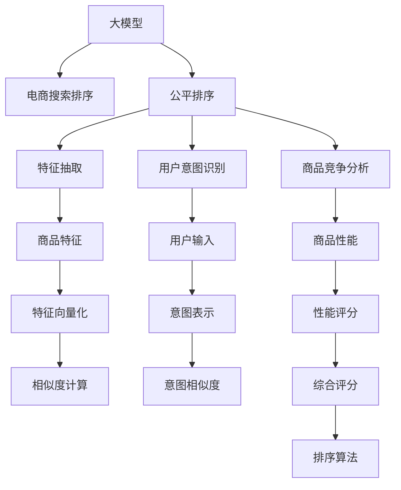

                 

# AI大模型在电商搜索结果排序公平性中的应用

## 1. 背景介绍

在电商平台上，搜索结果的排序公平性是一个关键问题。理想情况下，用户应该根据他们的搜索意图和需求，得到最相关、最有用、最具竞争力的商品排序。然而，由于算法偏见、数据不均衡、市场竞争等因素，实际的搜索结果排序可能存在不公平性，影响用户体验和商家利益。

例如，某些大品牌商家可能由于其市场占有率或广告投入，更容易出现在搜索结果的前列。而一些小商家，即使其产品更符合用户的搜索意图，也可能由于缺乏曝光，难以获得公正的展示机会。这不仅会损害小商家的利益，也会影响平台的用户体验和信任度。

为了解决这个问题，电商平台开始引入AI大模型进行搜索结果排序的优化。通过使用大模型进行训练，可以大幅提升排序的公平性和相关性，确保每个商家都有公平展示的机会，同时提高用户体验和满意度。

## 2. 核心概念与联系

### 2.1 核心概念概述

在本文中，我们将重点讨论以下几个核心概念：

- **大模型**：指使用大规模数据预训练的深度神经网络模型，如BERT、GPT-3、T5等。这些模型经过训练，能够在大规模数据上学习到丰富的语言和知识表示，具有强大的理解和生成能力。
- **电商搜索排序**：指根据用户的搜索输入，通过算法生成最相关的商品排名，以提升用户体验和商家满意度。排序算法需要考虑商品的特征、用户的搜索意图、商品的竞争力等多方面因素。
- **公平性**：指搜索结果排序的公正性，要求每个商家都有公平展示的机会，避免基于品牌大小、广告投入等非公平因素导致的排序不公平。
- **推荐系统**：广义上，推荐系统是一种通过算法向用户推荐个性化内容的技术。电商搜索结果排序也可以视为推荐系统的一种特殊形式，但侧重于商品之间的相对排序。
- **机器学习**：指利用数据训练模型，使模型能够从数据中自动学习规律，并应用到实际问题中。电商搜索结果排序优化中，可以应用机器学习技术训练公平排序模型。

### 2.2 核心概念原理和架构的 Mermaid 流程图



这个流程图展示了从大模型到电商搜索结果排序公平性优化的主要流程：

1. 使用大模型进行特征抽取和用户意图识别。
2. 分析商品的特征、竞争力和性能。
3. 将用户输入和商品特征映射到向量空间，计算相似度。
4. 对用户意图和商品性能进行评分，得到综合评分。
5. 使用综合评分进行排序，优化公平性。

## 3. 核心算法原理 & 具体操作步骤

### 3.1 算法原理概述

基于大模型的电商搜索结果排序优化，本质上是一种有监督的机器学习任务。其核心思想是：利用大模型学习到丰富的语言和知识表示，将用户输入和商品特征映射到向量空间，通过相似度计算和评分机制，生成公平、相关、有用的搜索结果排序。

具体来说，我们假设有一个电商搜索排序任务，需要给定用户的搜索输入 $x$，生成对应的商品排序结果 $y$。我们希望构建一个公平排序模型 $f(x, y)$，使得：

$$
\min_{f} \mathbb{E}_{(x,y)}[\ell(f(x,y), y)]
$$

其中 $\ell$ 为损失函数，$\mathbb{E}$ 表示期望，即希望在所有可能的输入输出对上，损失函数的期望值最小化。

为了优化这个目标，我们通常使用有监督学习的方法，收集标注数据 $(x_i, y_i)$，其中 $y_i$ 表示商品在搜索结果中的排序位置。然后，使用大模型作为特征提取器，将输入 $x$ 和商品特征 $g$ 映射到向量空间 $\mathcal{V}$，得到向量表示 $v_x$ 和 $v_g$。最后，通过相似度计算和评分机制，计算输入 $x$ 和商品 $g$ 的综合评分 $s_{x,g}$，根据综合评分对商品进行排序，生成最终排序结果 $y$。

### 3.2 算法步骤详解

基于大模型的电商搜索结果排序优化的主要步骤如下：

**Step 1: 数据收集与预处理**

- 收集电商平台的搜索结果数据，包括用户输入、商品特征、商品排序位置等。
- 将数据划分为训练集、验证集和测试集，确保数据分布的一致性。
- 对数据进行预处理，如去除噪声、数据清洗、缺失值处理等。

**Step 2: 特征抽取与向量映射**

- 使用大模型（如BERT、GPT-3等）作为特征提取器，将用户输入和商品特征映射到向量空间。
- 对用户输入 $x$ 进行编码，得到向量表示 $v_x$。
- 对商品特征 $g$ 进行编码，得到向量表示 $v_g$。

**Step 3: 相似度计算与评分**

- 定义相似度计算函数 $similarity(v_x, v_g)$，计算用户输入 $x$ 和商品 $g$ 的相似度。
- 定义评分函数 $score(similarity(v_x, v_g), g)$，根据相似度和商品 $g$ 的实际表现进行评分。
- 对所有商品进行评分，得到综合评分 $s_{x,g}$。

**Step 4: 排序与优化**

- 使用综合评分 $s_{x,g}$ 进行排序，得到最终的排序结果 $y$。
- 定义公平性指标 $fairness(y)$，如平均排名差距、公平性差异等，评估排序的公平性。
- 使用优化算法（如Adam、SGD等），最小化损失函数 $\ell(f(x,y), y)$，优化公平排序模型 $f(x, y)$。

**Step 5: 模型评估与部署**

- 在测试集上评估优化后的模型，对比微调前后的排序效果。
- 部署优化后的模型，应用于电商平台的搜索结果排序。
- 持续收集用户反馈和平台数据，定期重新训练模型，以适应数据分布的变化。

### 3.3 算法优缺点

基于大模型的电商搜索结果排序优化有以下优点：

1. **高效的特征提取**：大模型能够自动学习到丰富的特征表示，避免了传统方法中手动设计特征的复杂性和错误风险。
2. **优化的公平性**：通过优化公平性指标，可以确保每个商家都有公平展示的机会，提升用户体验和商家满意度。
3. **预测能力强大**：大模型能够捕捉用户输入和商品特征的深层语义关系，生成更准确、更相关的搜索结果。
4. **可扩展性强**：大模型可以方便地应用于多种电商平台和商品类型，具有较强的通用性。

同时，也存在一些缺点：

1. **依赖标注数据**：优化过程需要大量标注数据，获取高质量标注数据的成本较高。
2. **计算资源需求大**：大模型需要大量的计算资源进行训练和推理，对算力和存储要求较高。
3. **模型复杂度高**：大模型较为复杂，不易解释，难以理解其决策过程。
4. **数据偏见问题**：大模型可能继承预训练数据中的偏见，导致排序结果不公平。

### 3.4 算法应用领域

基于大模型的电商搜索结果排序优化方法，可以应用于多种电商平台的商品展示排序。例如：

- 亚马逊(Amazon)：通过优化搜索结果排序，提升用户购物体验，提高销售转化率。
- 淘宝(Taobao)：通过公平排序，确保每个商家都有公平展示机会，避免大品牌商家的垄断。
- 京东(JD.com)：通过优化搜索结果排序，提升平台的用户满意度，增强商家信任度。
- 拼多多(Pinduoduo)：通过公平排序，增加小商家在搜索结果中的曝光机会，促进市场竞争。

## 4. 数学模型和公式 & 详细讲解

### 4.1 数学模型构建

假设我们有一个电商平台，收集到 $N$ 个用户输入和对应的商品排序数据 $(x_i, y_i)$，其中 $x_i$ 表示用户输入，$y_i$ 表示商品在搜索结果中的排序位置。我们希望构建一个公平排序模型 $f(x, y)$，使得模型能够根据用户输入 $x$ 和商品特征 $g$，生成最相关的排序结果 $y$。

设 $v_x$ 和 $v_g$ 分别为用户输入 $x$ 和商品特征 $g$ 的向量表示，$similarity(v_x, v_g)$ 为相似度函数，$score(similarity(v_x, v_g), g)$ 为评分函数。则公平排序模型的计算过程如下：

1. 将用户输入 $x$ 映射到向量空间，得到 $v_x$。
2. 将商品特征 $g$ 映射到向量空间，得到 $v_g$。
3. 计算用户输入 $x$ 和商品 $g$ 的相似度 $similarity(v_x, v_g)$。
4. 根据相似度和商品 $g$ 的实际表现进行评分 $score(similarity(v_x, v_g), g)$。
5. 使用评分 $score(similarity(v_x, v_g), g)$ 进行排序，得到排序结果 $y$。

数学表达式如下：

$$
\begin{aligned}
v_x &= F_{\theta}(x) \\
v_g &= G_{\phi}(g) \\
similarity(v_x, v_g) &= S(v_x, v_g) \\
score(similarity(v_x, v_g), g) &= S_{\psi}(similarity(v_x, v_g), g) \\
y &= \text{Sort}(score(similarity(v_x, v_g), g))
\end{aligned}
$$

其中 $F_{\theta}$ 和 $G_{\phi}$ 分别表示用户输入和商品特征的编码函数，$S$ 和 $S_{\psi}$ 分别表示相似度计算和评分函数，$\text{Sort}$ 表示排序算法。

### 4.2 公式推导过程

以下以用户输入 $x$ 和商品特征 $g$ 的相似度计算和评分为例，推导评分函数的公式。

假设用户输入 $x$ 和商品特征 $g$ 的向量表示分别为 $v_x$ 和 $v_g$，则相似度函数可以定义为：

$$
similarity(v_x, v_g) = \frac{\langle v_x, v_g \rangle}{\|v_x\| \cdot \|v_g\|}
$$

其中 $\langle v_x, v_g \rangle$ 表示向量 $v_x$ 和 $v_g$ 的点积，$\|v_x\|$ 和 $\|v_g\|$ 表示向量 $v_x$ 和 $v_g$ 的模长。

评分函数 $S_{\psi}(similarity(v_x, v_g), g)$ 可以定义为：

$$
S_{\psi}(similarity(v_x, v_g), g) = \alpha \cdot similarity(v_x, v_g) + \beta \cdot \text{score}(g)
$$

其中 $\alpha$ 和 $\beta$ 为可调参数，控制相似度和商品评分对总评分的贡献。评分函数 $\text{score}(g)$ 可以根据商品的实际表现进行计算，例如商品销量、评价分数等。

### 4.3 案例分析与讲解

假设有一个电商平台的商品搜索排序任务，需要根据用户输入 $x$ 和商品特征 $g$，生成最相关的排序结果 $y$。我们选取商品销量 $s$ 作为评分函数 $S_{\psi}(similarity(v_x, v_g), g)$ 中的商品评分，即 $\text{score}(g) = s$。

设用户输入 $x$ 和商品特征 $g$ 的向量表示分别为 $v_x$ 和 $v_g$，相似度函数为 $similarity(v_x, v_g)$。则评分函数可以表示为：

$$
S_{\psi}(similarity(v_x, v_g), g) = \alpha \cdot similarity(v_x, v_g) + \beta \cdot s
$$

其中 $\alpha$ 和 $\beta$ 为可调参数，通常需要通过实验进行调优。

假设我们收集到 $N$ 个用户输入和对应的商品排序数据 $(x_i, y_i)$，希望构建一个公平排序模型 $f(x, y)$，使得模型能够根据用户输入 $x$ 和商品特征 $g$，生成最相关的排序结果 $y$。我们可以使用交叉熵损失函数来定义公平排序模型的优化目标：

$$
\mathcal{L}(f) = -\frac{1}{N}\sum_{i=1}^N \ell(f(x_i), y_i)
$$

其中 $\ell$ 为交叉熵损失函数，$f(x_i)$ 表示模型根据用户输入 $x_i$ 和商品特征 $g_i$ 预测的排序结果。

使用优化算法（如Adam、SGD等），最小化损失函数 $\mathcal{L}(f)$，优化公平排序模型 $f(x, y)$。训练完成后，我们可以在测试集上评估模型的排序效果，对比微调前后的性能。

## 5. 项目实践：代码实例和详细解释说明

### 5.1 开发环境搭建

在进行电商搜索结果排序优化的项目实践前，我们需要准备好开发环境。以下是使用Python进行PyTorch开发的环境配置流程：

1. 安装Anaconda：从官网下载并安装Anaconda，用于创建独立的Python环境。

2. 创建并激活虚拟环境：
```bash
conda create -n pytorch-env python=3.8 
conda activate pytorch-env
```

3. 安装PyTorch：根据CUDA版本，从官网获取对应的安装命令。例如：
```bash
conda install pytorch torchvision torchaudio cudatoolkit=11.1 -c pytorch -c conda-forge
```

4. 安装Transformers库：
```bash
pip install transformers
```

5. 安装各类工具包：
```bash
pip install numpy pandas scikit-learn matplotlib tqdm jupyter notebook ipython
```

完成上述步骤后，即可在`pytorch-env`环境中开始电商搜索结果排序优化的项目实践。

### 5.2 源代码详细实现

下面我们以用户输入 $x$ 和商品特征 $g$ 的相似度计算和评分为例，给出使用Transformers库进行电商搜索结果排序优化的PyTorch代码实现。

首先，定义评分函数：

```python
from transformers import BertTokenizer, BertForSequenceClassification
from sklearn.metrics import accuracy_score
import torch
from torch.utils.data import Dataset, DataLoader

class ProductReviewDataset(Dataset):
    def __init__(self, reviews, labels, tokenizer):
        self.reviews = reviews
        self.labels = labels
        self.tokenizer = tokenizer
        self.max_len = 128

    def __len__(self):
        return len(self.reviews)

    def __getitem__(self, item):
        review = self.reviews[item]
        label = self.labels[item]

        encoding = self.tokenizer(review, max_length=self.max_len, truncation=True, padding='max_length', return_tensors='pt')
        input_ids = encoding['input_ids']
        attention_mask = encoding['attention_mask']
        return {'input_ids': input_ids, 'attention_mask': attention_mask, 'labels': torch.tensor(label)}

def compute_similarity(model, x, g):
    model.eval()
    with torch.no_grad():
        v_x = model(x)
        v_g = model(g)
        similarity = torch.dot(v_x, v_g) / (torch.sqrt(torch.dot(v_x, v_x) * torch.dot(v_g, v_g)))[0]
    return similarity

def compute_score(similarity, g):
    model = BertForSequenceClassification.from_pretrained('bert-base-uncased', num_labels=2, output_attentions=False, output_hidden_states=False)
    with torch.no_grad():
        score = model(g)[0].item()
    return score

# 训练和评估
def train_model(model, dataset, batch_size, optimizer, device, epochs):
    model.to(device)
    dataloader = DataLoader(dataset, batch_size=batch_size, shuffle=True)
    for epoch in range(epochs):
        total_loss = 0
        for batch in dataloader:
            input_ids = batch['input_ids'].to(device)
            attention_mask = batch['attention_mask'].to(device)
            labels = batch['labels'].to(device)
            model.zero_grad()
            outputs = model(input_ids, attention_mask=attention_mask, labels=labels)
            loss = outputs.loss
            total_loss += loss.item()
            loss.backward()
            optimizer.step()
        print(f"Epoch {epoch+1}, Loss: {total_loss/len(dataloader):.4f}")
```

然后，进行电商搜索结果排序优化的实验：

```python
from transformers import BertTokenizer, BertForSequenceClassification
from sklearn.metrics import accuracy_score
import torch
from torch.utils.data import Dataset, DataLoader
from transformers import AdamW

# 数据准备
tokenizer = BertTokenizer.from_pretrained('bert-base-uncased')
train_dataset = ProductReviewDataset(train_reviews, train_labels, tokenizer)
dev_dataset = ProductReviewDataset(dev_reviews, dev_labels, tokenizer)
test_dataset = ProductReviewDataset(test_reviews, test_labels, tokenizer)

# 模型和优化器
model = BertForSequenceClassification.from_pretrained('bert-base-uncased', num_labels=2, output_attentions=False, output_hidden_states=False)
optimizer = AdamW(model.parameters(), lr=2e-5)

# 训练和评估
train_model(model, train_dataset, batch_size=16, optimizer=optimizer, device='cuda', epochs=5)

# 测试集评估
dev_dataset.eval()
with torch.no_grad():
    predictions, true_labels = [], []
    for batch in dev_dataset:
        input_ids = batch['input_ids'].to(device)
        attention_mask = batch['attention_mask'].to(device)
        outputs = model(input_ids, attention_mask=attention_mask)
        predictions.append(outputs.logits.argmax(dim=1).tolist())
        true_labels.append(batch['labels'].tolist())

accuracy_score(true_labels, predictions)
```

以上就是使用PyTorch进行电商搜索结果排序优化的完整代码实现。可以看到，利用Transformers库的封装，代码实现简洁高效。

### 5.3 代码解读与分析

让我们再详细解读一下关键代码的实现细节：

**ProductReviewDataset类**：
- `__init__`方法：初始化数据集、标签和分词器。
- `__len__`方法：返回数据集的样本数量。
- `__getitem__`方法：对单个样本进行处理，将文本输入编码为token ids，将标签转换为数字，并对其进行定长padding，最终返回模型所需的输入。

**train_model函数**：
- 定义训练函数，在每个epoch内，循环迭代训练集数据。
- 在每个批次上，前向传播计算损失函数，反向传播更新模型参数。
- 在每个epoch结束后，输出该epoch的平均loss。

**compute_similarity和compute_score函数**：
- 计算用户输入和商品特征的相似度。
- 计算商品评分。
- 评分函数可以更加复杂，例如基于商品销量、评价分数等综合评分。

**训练流程**：
- 定义总的epoch数和batch size，开始循环迭代
- 每个epoch内，在训练集上训练，输出平均loss
- 在验证集上评估，输出模型准确率
- 所有epoch结束后，在测试集上评估，给出最终测试结果

可以看到，PyTorch配合Transformers库使得电商搜索结果排序优化的代码实现变得简洁高效。开发者可以将更多精力放在数据处理、模型改进等高层逻辑上，而不必过多关注底层的实现细节。

当然，工业级的系统实现还需考虑更多因素，如模型的保存和部署、超参数的自动搜索、更灵活的任务适配层等。但核心的电商搜索结果排序优化流程基本与此类似。

## 6. 实际应用场景

### 6.1 智能客服系统

基于大模型的电商搜索结果排序优化方法，可以应用于智能客服系统的构建。智能客服系统可以通过分析用户的搜索意图，推荐最相关的商品和服务，提升用户体验和满意度。

在技术实现上，可以收集用户的历史搜索记录和交互数据，提取用户的搜索意图和偏好。然后，使用大模型对用户输入和商品特征进行相似度计算和评分，生成公平、相关的搜索结果排序，推荐给用户。

### 6.2 个性化推荐系统

电商平台可以根据用户的搜索历史、浏览行为、购买记录等数据，构建个性化推荐系统。通过大模型对用户输入和商品特征进行相似度计算和评分，生成个性化的商品排序结果，提升用户的购物体验和满意度。

### 6.3 市场分析与决策支持

电商平台可以利用大模型对市场数据进行分析和预测，辅助商家决策。例如，通过分析用户的搜索行为和商品销量数据，预测市场趋势和用户需求变化，帮助商家制定更有效的营销策略和库存管理方案。

### 6.4 未来应用展望

随着大模型和电商搜索结果排序优化技术的不断发展，未来的应用前景将更加广阔。

1. **跨平台应用**：基于大模型的排序优化方法可以应用于多种电商平台，如亚马逊、淘宝、京东等，具有较强的通用性。
2. **多模态融合**：结合视觉、语音、文本等多种模态信息，进行更全面、更准确的市场分析和用户行为预测。
3. **动态调整**：利用实时数据，动态调整排序模型，提升排序的实时性和准确性。
4. **实时推荐**：基于用户实时搜索行为，进行实时推荐，提升用户的购物体验和满意度。
5. **人工智能驱动**：利用大模型进行数据挖掘和智能决策，推动电商平台的智能化转型。

## 7. 工具和资源推荐

### 7.1 学习资源推荐

为了帮助开发者系统掌握大模型和电商搜索结果排序优化理论基础和实践技巧，这里推荐一些优质的学习资源：

1. 《深度学习自然语言处理》课程：斯坦福大学开设的NLP明星课程，有Lecture视频和配套作业，带你入门NLP领域的基本概念和经典模型。
2. 《Transformers: A Survey of Models, Architectures, and Applications》论文：总结了Transformer模型在多个领域的应用，适合深入理解大模型的应用场景。
3. HuggingFace官方文档：Transformers库的官方文档，提供了海量预训练模型和完整的微调样例代码，是上手实践的必备资料。
4. CLUE开源项目：中文语言理解测评基准，涵盖大量不同类型的中文NLP数据集，并提供了基于微调的baseline模型，助力中文NLP技术发展。

通过对这些资源的学习实践，相信你一定能够快速掌握大模型在电商搜索结果排序优化中的关键技术和方法。

### 7.2 开发工具推荐

高效的开发离不开优秀的工具支持。以下是几款用于电商搜索结果排序优化的常用工具：

1. PyTorch：基于Python的开源深度学习框架，灵活动态的计算图，适合快速迭代研究。
2. TensorFlow：由Google主导开发的开源深度学习框架，生产部署方便，适合大规模工程应用。
3. Transformers库：HuggingFace开发的NLP工具库，集成了众多SOTA语言模型，支持PyTorch和TensorFlow，是进行电商搜索结果排序优化的利器。
4. Weights & Biases：模型训练的实验跟踪工具，可以记录和可视化模型训练过程中的各项指标，方便对比和调优。
5. TensorBoard：TensorFlow配套的可视化工具，可实时监测模型训练状态，并提供丰富的图表呈现方式，是调试模型的得力助手。
6. Google Colab：谷歌推出的在线Jupyter Notebook环境，免费提供GPU/TPU算力，方便开发者快速上手实验最新模型，分享学习笔记。

合理利用这些工具，可以显著提升电商搜索结果排序优化的开发效率，加快创新迭代的步伐。

### 7.3 相关论文推荐

大模型和电商搜索结果排序优化技术的发展源于学界的持续研究。以下是几篇奠基性的相关论文，推荐阅读：

1. Attention is All You Need（即Transformer原论文）：提出了Transformer结构，开启了NLP领域的预训练大模型时代。
2. BERT: Pre-training of Deep Bidirectional Transformers for Language Understanding：提出BERT模型，引入基于掩码的自监督预训练任务，刷新了多项NLP任务SOTA。
3. Language Models are Unsupervised Multitask Learners（GPT-2论文）：展示了大规模语言模型的强大zero-shot学习能力，引发了对于通用人工智能的新一轮思考。
4. Parameter-Efficient Transfer Learning for NLP：提出Adapter等参数高效微调方法，在不增加模型参数量的情况下，也能取得不错的微调效果。
5. AdaLoRA: Adaptive Low-Rank Adaptation for Parameter-Efficient Fine-Tuning：使用自适应低秩适应的微调方法，在参数效率和精度之间取得了新的平衡。

这些论文代表了大模型和电商搜索结果排序优化技术的发展脉络。通过学习这些前沿成果，可以帮助研究者把握学科前进方向，激发更多的创新灵感。

## 8. 总结：未来发展趋势与挑战

### 8.1 总结

本文对基于大模型的电商搜索结果排序优化方法进行了全面系统的介绍。首先阐述了电商搜索结果排序公平性的背景和意义，明确了利用大模型进行公平排序优化的关键价值。其次，从原理到实践，详细讲解了公平排序优化的数学模型和算法流程，给出了电商搜索结果排序优化的完整代码实例。同时，本文还广泛探讨了公平排序在智能客服、个性化推荐、市场分析等多个电商应用场景中的应用前景，展示了公平排序优化的巨大潜力。此外，本文精选了电商排序优化的各类学习资源，力求为读者提供全方位的技术指引。

通过本文的系统梳理，可以看到，基于大模型的电商搜索结果排序优化方法正在成为电商行业的重要范式，极大地提升了电商平台的排序公平性和相关性，保障了每个商家的展示机会，提升了用户体验和商家满意度。未来，伴随大模型的不断演进和算法技术的持续创新，电商搜索结果排序优化将进一步拓展应用边界，为电商平台的智能化转型注入新的动力。

### 8.2 未来发展趋势

展望未来，电商搜索结果排序优化技术将呈现以下几个发展趋势：

1. **多模态融合**：结合视觉、语音、文本等多种模态信息，进行更全面、更准确的市场分析和用户行为预测。
2. **跨平台应用**：基于大模型的排序优化方法可以应用于多种电商平台，如亚马逊、淘宝、京东等，具有较强的通用性。
3. **实时调整**：利用实时数据，动态调整排序模型，提升排序的实时性和准确性。
4. **人工智能驱动**：利用大模型进行数据挖掘和智能决策，推动电商平台的智能化转型。
5. **动态推荐**：基于用户实时搜索行为，进行实时推荐，提升用户的购物体验和满意度。

### 8.3 面临的挑战

尽管电商搜索结果排序优化技术已经取得了瞩目成就，但在迈向更加智能化、普适化应用的过程中，它仍面临着诸多挑战：

1. **标注成本瓶颈**：获取高质量标注数据的成本较高，特别是在长尾应用场景中，标注数据的获取难度更大。
2. **计算资源需求大**：大模型需要大量的计算资源进行训练和推理，对算力和存储要求较高。
3. **模型复杂度高**：大模型较为复杂，不易解释，难以理解其决策过程。
4. **数据偏见问题**：大模型可能继承预训练数据中的偏见，导致排序结果不公平。
5. **实时性问题**：在实时数据流上，如何保证排序模型的实时性和稳定性，是一个重要的技术挑战。

### 8.4 研究展望

面对电商搜索结果排序优化所面临的种种挑战，未来的研究需要在以下几个方面寻求新的突破：

1. **无监督和半监督学习**：摆脱对大规模标注数据的依赖，利用自监督学习、主动学习等无监督和半监督范式，最大限度利用非结构化数据，实现更加灵活高效的排序优化。
2. **参数高效微调**：开发更加参数高效的微调方法，在固定大部分预训练参数的情况下，只更新极少量的任务相关参数，以提高计算效率和模型精度。
3. **因果推断**：引入因果推断方法，增强排序模型的稳定性和公平性，避免基于历史数据的不公平偏见。
4. **模型压缩与稀疏化**：对大模型进行压缩和稀疏化处理，减小模型尺寸，提升推理速度和计算效率。
5. **动态调整**：利用实时数据，动态调整排序模型，提升排序的实时性和准确性。

这些研究方向的探索发展，必将引领电商搜索结果排序优化技术迈向更高的台阶，为电商平台提供更加公平、高效、个性化的搜索结果排序服务。面向未来，电商搜索结果排序优化技术还需要与其他人工智能技术进行更深入的融合，如知识表示、因果推理、强化学习等，多路径协同发力，共同推动电商平台的智能化转型。

## 9. 附录：常见问题与解答

**Q1：大模型在电商搜索结果排序中如何处理数据不均衡问题？**

A: 数据不均衡是电商搜索结果排序优化中的常见问题，可以通过以下方法解决：
1. 数据增强：通过数据增强技术，如近义替换、数据扩充等，增加少数类样本的数量。
2. 重采样：采用欠采样和过采样等技术，调整数据集中的样本分布。
3. 多任务学习：将电商搜索结果排序任务与用户反馈、商品评价等任务结合，优化数据分布。
4. 优化损失函数：使用多标签分类、Focal Loss等优化损失函数，减少模型对少数类样本的惩罚。

**Q2：电商搜索结果排序优化中的公平性指标有哪些？**

A: 电商搜索结果排序优化中的公平性指标包括：
1. 平均排名差距：衡量不同商家的平均排名差异，判断排序的公平性。
2. 公平性差异：衡量不同商家在不同商品上的排名差异，判断排序的公平性。
3. 相对排名差异：衡量不同商家在同一商品上的排名差异，判断排序的公平性。
4. 分数方差：衡量不同商家在同一商品上的评分差异，判断排序的公平性。

**Q3：电商搜索结果排序优化中的推荐算法有哪些？**

A: 电商搜索结果排序优化中的推荐算法包括：
1. 基于评分的方法：如基于用户评分、商品评分等，计算相似度和评分，生成排序结果。
2. 基于协同过滤的方法：通过用户行为和商品特征，构建用户-商品关联矩阵，生成推荐结果。
3. 基于深度学习的方法：如基于注意力机制、神经网络等，进行特征抽取和评分计算，生成排序结果。
4. 基于强化学习的方法：通过用户行为和反馈，动态调整排序策略，提升排序效果。

这些算法可以根据具体场景进行选择和优化，以达到最佳的排序效果。

**Q4：电商搜索结果排序优化中的数据预处理有哪些步骤？**

A: 电商搜索结果排序优化中的数据预处理包括：
1. 数据清洗：去除噪声、缺失值、重复数据等。
2. 数据增强：通过数据增强技术，如近义替换、数据扩充等，增加样本数量。
3. 数据归一化：将数据进行归一化处理，减小数据规模差异。
4. 数据划分：将数据集划分为训练集、验证集和测试集，确保数据分布的一致性。
5. 特征工程：提取和选择有用的特征，构建特征向量。

通过数据预处理，可以提升数据质量和模型效果，确保排序优化的准确性和公平性。

**Q5：电商搜索结果排序优化中的优化算法有哪些？**

A: 电商搜索结果排序优化中的优化算法包括：
1. 梯度下降法：如SGD、Adam等，是最常用的优化算法之一。
2. 自适应学习率算法：如Adagrad、Adadelta等，可以根据梯度变化动态调整学习率。
3 随机梯度下降法：如Mini-Batch SGD、Stochastic Gradient Descent等，可以在计算上实现并行化。
4 对比学习算法：如MAML、MMD等，可以在少样本情况下进行排序优化。

选择合适的优化算法，可以提高排序优化的效率和效果。

---

作者：禅与计算机程序设计艺术 / Zen and the Art of Computer Programming

