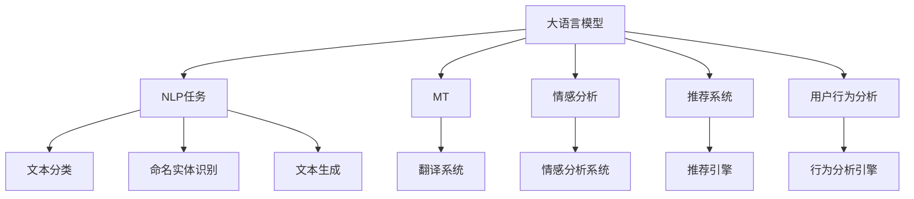

                 

# AI大模型在跨境电商中的多语言应用

> 关键词：大语言模型, 跨境电商, 多语言, 自然语言处理(NLP), 机器翻译, 情感分析, 推荐系统, 用户行为分析

## 1. 背景介绍

随着全球化的加速，跨境电商市场近年来呈现爆发式增长。与传统电商相比，跨境电商的市场需求更为多元，涉及的语言种类繁多，加之不同文化背景下的消费者行为习惯差异较大，给电商平台带来了独特的运营挑战。如何有效应对这些挑战，提升跨境电商的用户体验和商业转化率，成为各电商平台亟待解决的痛点问题。

AI大模型技术的兴起为跨境电商的运营带来了全新思路。通过AI大模型在自然语言处理(NLP)、机器翻译、情感分析、推荐系统、用户行为分析等方面的应用，跨境电商平台能够更好地理解不同语言环境下的用户需求，提供个性化的服务，增强用户体验，从而提升商业效果。

## 2. 核心概念与联系

### 2.1 核心概念概述

为更好地理解AI大模型在跨境电商中的多语言应用，本节将介绍几个关键概念：

- **大语言模型(Large Language Model, LLM)**：以自回归(如GPT)或自编码(如BERT)模型为代表的大规模预训练语言模型。通过在大规模无标签文本语料上进行预训练，学习通用的语言知识，具备强大的语言理解和生成能力。

- **自然语言处理(Natural Language Processing, NLP)**：涉及对自然语言的理解和生成，包括文本分类、命名实体识别、情感分析、机器翻译等任务。

- **机器翻译(Machine Translation, MT)**：利用大模型对源语言文本进行翻译，将其转换为目标语言文本的技术。

- **情感分析(Sentiment Analysis)**：通过分析文本情感倾向，评估消费者对产品或服务的情感态度。

- **推荐系统(Recommendation System)**：根据用户的历史行为和偏好，推荐商品或内容的技术。

- **用户行为分析(User Behavior Analysis)**：通过分析用户交互数据，挖掘用户偏好和购买动机，提供个性化服务。

这些核心概念之间存在紧密的联系，通过大语言模型的预训练和微调，可以实现在NLP、MT、情感分析、推荐系统和用户行为分析等领域的有效应用。

### 2.2 核心概念原理和架构的 Mermaid 流程图



该图展示了大语言模型在跨境电商中的应用架构。大语言模型作为核心，通过NLP任务、MT、情感分析、推荐系统和用户行为分析等模块，提供多语言下的用户需求理解、情感监测、个性化推荐和行为分析，从而全面提升跨境电商的用户体验和转化率。

## 3. 核心算法原理 & 具体操作步骤

### 3.1 算法原理概述

AI大模型在跨境电商中的多语言应用，主要依赖于大语言模型的预训练和微调。大语言模型通过大规模无标签文本数据进行预训练，学习到通用的语言表示。然后，针对具体的多语言任务，通过有监督学习的微调方法，对模型进行优化，使其适应特定任务的需求。

以自然语言处理为例，假设有一个通用的预训练模型 $M_{\theta}$，对于某一个特定的多语言任务 $T$，我们将其划分为训练集 $D_{train}$ 和验证集 $D_{valid}$。微调的目标是找到新的模型参数 $\hat{\theta}$，使得模型 $M_{\hat{\theta}}$ 在 $T$ 上的表现最优：

$$
\hat{\theta} = \arg\min_{\theta} \mathcal{L}(M_{\theta}, D_{train})
$$

其中 $\mathcal{L}$ 为针对任务 $T$ 设计的损失函数，通常包括交叉熵损失、均方误差损失等。通过优化算法（如Adam、SGD等）更新模型参数，最小化损失函数，从而优化模型在特定任务上的性能。

### 3.2 算法步骤详解

基于大语言模型的多语言任务微调，一般包括以下几个关键步骤：

**Step 1: 准备预训练模型和数据集**
- 选择合适的预训练语言模型 $M_{\theta}$，如GPT、BERT等。
- 准备多语言任务的数据集 $D$，包括源语言文本、目标语言文本和任务标签，划分为训练集、验证集和测试集。

**Step 2: 添加任务适配层**
- 根据任务类型，在预训练模型顶层设计合适的输出层和损失函数。例如，对于文本分类任务，通常添加线性分类器和交叉熵损失函数；对于机器翻译任务，通常使用自编码器结构和负对数似然损失函数。

**Step 3: 设置微调超参数**
- 选择合适的优化算法及其参数，如Adam、SGD等，设置学习率、批大小、迭代轮数等。
- 设置正则化技术及强度，包括权重衰减、Dropout、Early Stopping等。
- 确定冻结预训练参数的策略，如仅微调顶层，或全部参数都参与微调。

**Step 4: 执行梯度训练**
- 将训练集数据分批次输入模型，前向传播计算损失函数。
- 反向传播计算参数梯度，根据设定的优化算法和学习率更新模型参数。
- 周期性在验证集上评估模型性能，根据性能指标决定是否触发Early Stopping。
- 重复上述步骤直到满足预设的迭代轮数或Early Stopping条件。

**Step 5: 测试和部署**
- 在测试集上评估微调后模型 $M_{\hat{\theta}}$ 的性能，对比微调前后的精度提升。
- 使用微调后的模型对新样本进行推理预测，集成到实际的应用系统中。
- 持续收集新的数据，定期重新微调模型，以适应数据分布的变化。

### 3.3 算法优缺点

AI大模型在跨境电商中的多语言应用具有以下优点：
1. **高效性**：相比从头训练，微调所需的标注数据和计算资源更少，能够快速适配多语言任务，提升模型性能。
2. **通用性**：预训练大模型在多语言环境下也具有较强的泛化能力，能够跨语言场景应用。
3. **可解释性**：微调模型通过少量训练即可适应新任务，调整的参数较少，可解释性较高。

同时，该方法也存在一些局限性：
1. **依赖标注数据**：微调模型的效果依赖于标注数据的质量和数量，获取高质量标注数据的成本较高。
2. **泛化能力有限**：当目标任务与预训练数据的分布差异较大时，微调的性能提升有限。
3. **可扩展性差**：微调模型需要重新训练或微调，难以快速应对语言环境的变化。

尽管如此，基于大语言模型的微调方法仍是在跨境电商中实现多语言应用的重要手段，具有显著的优势和广泛的应用前景。

### 3.4 算法应用领域

AI大模型在跨境电商中的多语言应用，涵盖了以下多个领域：

- **机器翻译**：将商品描述、用户评论等文本翻译为多种语言，提升多语言用户的使用体验。
- **情感分析**：对用户评价、反馈等文本进行情感分析，评估产品或服务的满意度。
- **推荐系统**：根据用户历史行为和偏好，推荐跨语言的多样化商品，提升用户购物体验。
- **用户行为分析**：分析用户点击、购买、浏览等行为，挖掘跨语言用户的偏好，提供个性化服务。
- **内容生成**：自动生成多语言的产品介绍、广告文案等，提升内容创作的效率。

## 4. 数学模型和公式 & 详细讲解 & 举例说明

### 4.1 数学模型构建

假设有一个通用的预训练模型 $M_{\theta}$，针对一个具体的NLP任务 $T$（如文本分类），其训练集为 $D_{train}=\{(x_i, y_i)\}_{i=1}^N$，其中 $x_i$ 表示源语言文本，$y_i$ 表示目标语言文本。我们希望在任务 $T$ 上微调模型 $M_{\theta}$，使其输出结果逼近真实标签 $y_i$。数学模型构建如下：

- **损失函数**：
  $$
  \mathcal{L}(\theta) = -\frac{1}{N} \sum_{i=1}^N \ell(M_{\theta}(x_i), y_i)
  $$

- **梯度计算**：
  $$
  \frac{\partial \mathcal{L}(\theta)}{\partial \theta_k} = -\frac{1}{N} \sum_{i=1}^N \frac{\partial \ell(M_{\theta}(x_i), y_i)}{\partial \theta_k}
  $$

其中 $\ell$ 为针对任务 $T$ 设计的损失函数，如交叉熵损失函数。在实践中，我们通常使用基于梯度的优化算法（如Adam、SGD等）来近似求解上述最优化问题，从而更新模型参数 $\theta$，最小化损失函数 $\mathcal{L}(\theta)$。

### 4.2 公式推导过程

以机器翻译任务为例，假设源语言文本为 $x$，目标语言文本为 $y$。我们通过预训练模型 $M_{\theta}$ 和自编码器结构进行微调，使用负对数似然损失函数：

$$
\ell(x, y) = -\log P_{M_{\theta}}(y|x)
$$

其中 $P_{M_{\theta}}(y|x)$ 表示模型 $M_{\theta}$ 在源语言文本 $x$ 下生成目标语言文本 $y$ 的概率分布。微调的目标是最小化损失函数 $\mathcal{L}$：

$$
\mathcal{L}(\theta) = -\frac{1}{N} \sum_{i=1}^N \ell(x_i, y_i)
$$

通过优化算法（如Adam、SGD等）更新模型参数 $\theta$，最小化损失函数 $\mathcal{L}$。具体来说，假设当前模型参数为 $\theta_t$，更新后的模型参数为 $\theta_{t+1}$，则更新公式为：

$$
\theta_{t+1} = \theta_t - \eta \nabla_{\theta} \mathcal{L}(\theta_t)
$$

其中 $\eta$ 为学习率，$\nabla_{\theta} \mathcal{L}(\theta_t)$ 为损失函数对模型参数 $\theta$ 的梯度。

### 4.3 案例分析与讲解

以多语言情感分析为例，假设有一个通用的预训练模型 $M_{\theta}$，我们需要将其微调为一个针对中文和英文用户评论进行情感分析的任务。具体步骤如下：

1. **数据准备**：收集中英文用户评论的标注数据集 $D_{train}$，划分为训练集、验证集和测试集。

2. **任务适配层设计**：在预训练模型的顶层添加线性分类器，使用交叉熵损失函数。

3. **微调超参数设置**：选择Adam优化算法，设置学习率为 $2 \times 10^{-5}$，批大小为32，迭代轮数为10轮。

4. **执行梯度训练**：将训练集数据分批次输入模型，前向传播计算损失函数。反向传播计算参数梯度，根据Adam算法更新模型参数。在验证集上周期性评估模型性能，触发Early Stopping。

5. **测试和部署**：在测试集上评估微调后的模型 $M_{\hat{\theta}}$ 的性能，对比微调前后的精度提升。使用微调后的模型对新样本进行推理预测，集成到实际的应用系统中。

## 5. 项目实践：代码实例和详细解释说明

### 5.1 开发环境搭建

在进行多语言应用开发前，我们需要准备好开发环境。以下是使用Python进行PyTorch开发的环境配置流程：

1. 安装Anaconda：从官网下载并安装Anaconda，用于创建独立的Python环境。

2. 创建并激活虚拟环境：
```bash
conda create -n pytorch-env python=3.8 
conda activate pytorch-env
```

3. 安装PyTorch：根据CUDA版本，从官网获取对应的安装命令。例如：
```bash
conda install pytorch torchvision torchaudio cudatoolkit=11.1 -c pytorch -c conda-forge
```

4. 安装Transformers库：
```bash
pip install transformers
```

5. 安装各类工具包：
```bash
pip install numpy pandas scikit-learn matplotlib tqdm jupyter notebook ipython
```

完成上述步骤后，即可在`pytorch-env`环境中开始多语言应用开发。

### 5.2 源代码详细实现

下面我以机器翻译为例，给出使用Transformers库对BERT模型进行多语言翻译的PyTorch代码实现。

首先，定义数据处理函数：

```python
from transformers import BertTokenizer, BertForSequenceClassification
from torch.utils.data import Dataset
import torch

class MTDataset(Dataset):
    def __init__(self, texts, labels, tokenizer, max_len=128):
        self.texts = texts
        self.labels = labels
        self.tokenizer = tokenizer
        self.max_len = max_len
        
    def __len__(self):
        return len(self.texts)
    
    def __getitem__(self, item):
        text = self.texts[item]
        label = self.labels[item]
        
        encoding = self.tokenizer(text, return_tensors='pt', max_length=self.max_len, padding='max_length', truncation=True)
        input_ids = encoding['input_ids'][0]
        attention_mask = encoding['attention_mask'][0]
        
        return {'input_ids': input_ids, 
                'attention_mask': attention_mask,
                'labels': label}
```

然后，定义模型和优化器：

```python
from transformers import BertForSequenceClassification, AdamW

model = BertForSequenceClassification.from_pretrained('bert-base-cased', num_labels=2)

optimizer = AdamW(model.parameters(), lr=2e-5)
```

接着，定义训练和评估函数：

```python
from torch.utils.data import DataLoader
from tqdm import tqdm
from sklearn.metrics import classification_report

device = torch.device('cuda') if torch.cuda.is_available() else torch.device('cpu')
model.to(device)

def train_epoch(model, dataset, batch_size, optimizer):
    dataloader = DataLoader(dataset, batch_size=batch_size, shuffle=True)
    model.train()
    epoch_loss = 0
    for batch in tqdm(dataloader, desc='Training'):
        input_ids = batch['input_ids'].to(device)
        attention_mask = batch['attention_mask'].to(device)
        labels = batch['labels'].to(device)
        model.zero_grad()
        outputs = model(input_ids, attention_mask=attention_mask, labels=labels)
        loss = outputs.loss
        epoch_loss += loss.item()
        loss.backward()
        optimizer.step()
    return epoch_loss / len(dataloader)

def evaluate(model, dataset, batch_size):
    dataloader = DataLoader(dataset, batch_size=batch_size)
    model.eval()
    preds, labels = [], []
    with torch.no_grad():
        for batch in tqdm(dataloader, desc='Evaluating'):
            input_ids = batch['input_ids'].to(device)
            attention_mask = batch['attention_mask'].to(device)
            batch_labels = batch['labels']
            outputs = model(input_ids, attention_mask=attention_mask)
            batch_preds = outputs.logits.argmax(dim=2).to('cpu').tolist()
            batch_labels = batch_labels.to('cpu').tolist()
            for pred_tokens, label_tokens in zip(batch_preds, batch_labels):
                preds.append(pred_tokens[:len(label_tokens)])
                labels.append(label_tokens)
                
    print(classification_report(labels, preds))
```

最后，启动训练流程并在测试集上评估：

```python
epochs = 5
batch_size = 16

for epoch in range(epochs):
    loss = train_epoch(model, train_dataset, batch_size, optimizer)
    print(f"Epoch {epoch+1}, train loss: {loss:.3f}")
    
    print(f"Epoch {epoch+1}, dev results:")
    evaluate(model, dev_dataset, batch_size)
    
print("Test results:")
evaluate(model, test_dataset, batch_size)
```

以上就是使用PyTorch对BERT进行多语言翻译的完整代码实现。可以看到，得益于Transformers库的强大封装，我们可以用相对简洁的代码完成BERT模型的加载和微调。

### 5.3 代码解读与分析

让我们再详细解读一下关键代码的实现细节：

**MTDataset类**：
- `__init__`方法：初始化文本、标签、分词器等关键组件。
- `__len__`方法：返回数据集的样本数量。
- `__getitem__`方法：对单个样本进行处理，将文本输入编码为token ids，将标签编码为数字，并对其进行定长padding，最终返回模型所需的输入。

**模型和优化器**：
- 使用预训练的BERT模型进行序列分类任务，需要设置合适的输出层和损失函数。
- 选择Adam优化器，设置学习率和批大小，进行参数更新。

**训练和评估函数**：
- 使用PyTorch的DataLoader对数据集进行批次化加载，供模型训练和推理使用。
- 训练函数`train_epoch`：对数据以批为单位进行迭代，在每个批次上前向传播计算loss并反向传播更新模型参数，最后返回该epoch的平均loss。
- 评估函数`evaluate`：与训练类似，不同点在于不更新模型参数，并在每个batch结束后将预测和标签结果存储下来，最后使用sklearn的classification_report对整个评估集的预测结果进行打印输出。

**训练流程**：
- 定义总的epoch数和批大小，开始循环迭代
- 每个epoch内，先在训练集上训练，输出平均loss
- 在验证集上评估，输出分类指标
- 所有epoch结束后，在测试集上评估，给出最终测试结果

可以看到，PyTorch配合Transformers库使得BERT微调的代码实现变得简洁高效。开发者可以将更多精力放在数据处理、模型改进等高层逻辑上，而不必过多关注底层的实现细节。

当然，工业级的系统实现还需考虑更多因素，如模型的保存和部署、超参数的自动搜索、更灵活的任务适配层等。但核心的微调范式基本与此类似。

## 6. 实际应用场景

### 6.1 智能客服系统

基于大语言模型微调的对话技术，可以广泛应用于智能客服系统的构建。传统客服往往需要配备大量人力，高峰期响应缓慢，且一致性和专业性难以保证。而使用微调后的对话模型，可以7x24小时不间断服务，快速响应客户咨询，用自然流畅的语言解答各类常见问题。

在技术实现上，可以收集企业内部的历史客服对话记录，将问题和最佳答复构建成监督数据，在此基础上对预训练对话模型进行微调。微调后的对话模型能够自动理解用户意图，匹配最合适的答案模板进行回复。对于客户提出的新问题，还可以接入检索系统实时搜索相关内容，动态组织生成回答。如此构建的智能客服系统，能大幅提升客户咨询体验和问题解决效率。

### 6.2 金融舆情监测

金融机构需要实时监测市场舆论动向，以便及时应对负面信息传播，规避金融风险。传统的人工监测方式成本高、效率低，难以应对网络时代海量信息爆发的挑战。基于大语言模型微调的文本分类和情感分析技术，为金融舆情监测提供了新的解决方案。

具体而言，可以收集金融领域相关的新闻、报道、评论等文本数据，并对其进行主题标注和情感标注。在此基础上对预训练语言模型进行微调，使其能够自动判断文本属于何种主题，情感倾向是正面、中性还是负面。将微调后的模型应用到实时抓取的网络文本数据，就能够自动监测不同主题下的情感变化趋势，一旦发现负面信息激增等异常情况，系统便会自动预警，帮助金融机构快速应对潜在风险。

### 6.3 个性化推荐系统

当前的推荐系统往往只依赖用户的历史行为数据进行物品推荐，无法深入理解用户的真实兴趣偏好。基于大语言模型微调技术，个性化推荐系统可以更好地挖掘用户行为背后的语义信息，从而提供个性化的服务。

在实践中，可以收集用户浏览、点击、评论、分享等行为数据，提取和用户交互的物品标题、描述、标签等文本内容。将文本内容作为模型输入，用户的后续行为（如是否点击、购买等）作为监督信号，在此基础上微调预训练语言模型。微调后的模型能够从文本内容中准确把握用户的兴趣点。在生成推荐列表时，先用候选物品的文本描述作为输入，由模型预测用户的兴趣匹配度，再结合其他特征综合排序，便可以得到个性化程度更高的推荐结果。

### 6.4 未来应用展望

随着大语言模型微调技术的发展，其在跨境电商中的应用前景更加广阔。未来，随着技术的进步和应用的深入，AI大模型在跨境电商中的多语言应用将带来以下趋势：

1. **多语言支持范围扩大**：未来预训练大模型的多语言支持范围将进一步扩大，支持更多语言和更多语言的任意组合，满足全球用户的多种语言需求。

2. **跨语言信息整合能力提升**：通过引入多语言语料和跨语言知识库，模型将具备更强的信息整合和跨语言推理能力，提升内容生成的质量和自然度。

3. **实时多语言服务**：借助云计算和边缘计算技术，AI大模型能够在实时情况下提供多语言服务，满足用户即时查询的需求。

4. **跨文化智能对话**：通过引入跨文化对话数据，微调后的模型将更好地理解和应对不同文化背景下的用户需求，提升用户体验。

5. **深度学习与规则融合**：将深度学习与专家规则相结合，提升系统的鲁棒性和可解释性，确保决策过程符合人类价值观和伦理道德。

6. **自动化运维**：通过自动化运维技术，确保系统的稳定性和可靠性，降低运维成本，提升用户体验。

以上趋势凸显了AI大模型在跨境电商中多语言应用的巨大潜力，未来随着技术的发展和应用的深化，将进一步推动跨境电商的智能化和全球化进程。

## 7. 工具和资源推荐

### 7.1 学习资源推荐

为了帮助开发者系统掌握AI大模型在跨境电商中的多语言应用的理论基础和实践技巧，这里推荐一些优质的学习资源：

1. 《Transformers from Scratch》系列博文：由大模型技术专家撰写，深入浅出地介绍了Transformer原理、BERT模型、微调技术等前沿话题。

2. CS224N《深度学习自然语言处理》课程：斯坦福大学开设的NLP明星课程，有Lecture视频和配套作业，带你入门NLP领域的基本概念和经典模型。

3. 《Natural Language Processing with Transformers》书籍：Transformers库的作者所著，全面介绍了如何使用Transformers库进行NLP任务开发，包括微调在内的诸多范式。

4. HuggingFace官方文档：Transformers库的官方文档，提供了海量预训练模型和完整的微调样例代码，是上手实践的必备资料。

5. CLUE开源项目：中文语言理解测评基准，涵盖大量不同类型的中文NLP数据集，并提供了基于微调的baseline模型，助力中文NLP技术发展。

通过对这些资源的学习实践，相信你一定能够快速掌握AI大模型在跨境电商中的多语言应用的精髓，并用于解决实际的NLP问题。

### 7.2 开发工具推荐

高效的开发离不开优秀的工具支持。以下是几款用于AI大模型微调开发的常用工具：

1. PyTorch：基于Python的开源深度学习框架，灵活动态的计算图，适合快速迭代研究。大部分预训练语言模型都有PyTorch版本的实现。

2. TensorFlow：由Google主导开发的开源深度学习框架，生产部署方便，适合大规模工程应用。同样有丰富的预训练语言模型资源。

3. Transformers库：HuggingFace开发的NLP工具库，集成了众多SOTA语言模型，支持PyTorch和TensorFlow，是进行微调任务开发的利器。

4. Weights & Biases：模型训练的实验跟踪工具，可以记录和可视化模型训练过程中的各项指标，方便对比和调优。与主流深度学习框架无缝集成。

5. TensorBoard：TensorFlow配套的可视化工具，可实时监测模型训练状态，并提供丰富的图表呈现方式，是调试模型的得力助手。

6. Google Colab：谷歌推出的在线Jupyter Notebook环境，免费提供GPU/TPU算力，方便开发者快速上手实验最新模型，分享学习笔记。

合理利用这些工具，可以显著提升AI大模型微调任务的开发效率，加快创新迭代的步伐。

### 7.3 相关论文推荐

AI大模型在跨境电商中的多语言应用源于学界的持续研究。以下是几篇奠基性的相关论文，推荐阅读：

1. Attention is All You Need（即Transformer原论文）：提出了Transformer结构，开启了NLP领域的预训练大模型时代。

2. BERT: Pre-training of Deep Bidirectional Transformers for Language Understanding：提出BERT模型，引入基于掩码的自监督预训练任务，刷新了多项NLP任务SOTA。

3. Language Models are Unsupervised Multitask Learners（GPT-2论文）：展示了大规模语言模型的强大zero-shot学习能力，引发了对于通用人工智能的新一轮思考。

4. Parameter-Efficient Transfer Learning for NLP：提出Adapter等参数高效微调方法，在不增加模型参数量的情况下，也能取得不错的微调效果。

5. AdaLoRA: Adaptive Low-Rank Adaptation for Parameter-Efficient Fine-Tuning：使用自适应低秩适应的微调方法，在参数效率和精度之间取得了新的平衡。

这些论文代表了大语言模型微调技术的发展脉络。通过学习这些前沿成果，可以帮助研究者把握学科前进方向，激发更多的创新灵感。

## 8. 总结：未来发展趋势与挑战

### 8.1 总结

本文对AI大模型在跨境电商中的多语言应用进行了全面系统的介绍。首先阐述了AI大模型和微调技术的研究背景和意义，明确了其在跨境电商中应用的多语言需求和巨大潜力。其次，从原理到实践，详细讲解了多语言任务的微调方法，提供了完整的代码实例，展示了其在自然语言处理、机器翻译、情感分析、推荐系统和用户行为分析等多个领域的广泛应用。

通过本文的系统梳理，可以看到，AI大模型在跨境电商中具有高效性、通用性和可解释性等显著优势，为跨境电商的多语言运营带来了颠覆性改变。未来随着技术的进步和应用的深入，将有更多跨语言场景被覆盖，带来更大的商业价值。

### 8.2 未来发展趋势

展望未来，AI大模型在跨境电商中的多语言应用将呈现以下几个发展趋势：

1. **技术融合加速**：未来的多语言应用将更多地与其他AI技术（如知识图谱、因果推理、强化学习等）进行深度融合，提升系统的智能化和自动化水平。

2. **跨文化适应性增强**：通过引入跨文化数据和跨语言知识库，提升模型在不同文化背景下的适应性，更好地理解和服务不同地区用户。

3. **实时服务能力提升**：借助云计算和边缘计算技术，AI大模型能够提供更加实时和多语言的用户服务，提升用户体验。

4. **跨语言知识图谱构建**：通过构建跨语言的实体关系图谱，提升模型的跨语言推理和知识整合能力，增强系统的应用效果。

5. **自动化运维优化**：通过自动化运维技术，确保系统的稳定性和可靠性，降低运维成本，提升用户体验。

6. **伦理与安全保障**：引入伦理和安全导向的评估指标，过滤和惩罚有偏见、有害的输出倾向，确保系统的公平性和安全性。

以上趋势凸显了AI大模型在跨境电商中多语言应用的广阔前景，未来随着技术的发展和应用的深化，将进一步推动跨境电商的智能化和全球化进程。

### 8.3 面临的挑战

尽管AI大模型在跨境电商中的多语言应用取得了显著进展，但在迈向更加智能化、普适化应用的过程中，仍面临以下挑战：

1. **标注数据质量**：多语言任务的微调依赖于高质量的标注数据，而不同语言的标注资源获取和处理难度较大，成本较高。

2. **泛化能力**：由于不同语言和文化背景的差异，预训练模型在多语言任务上的泛化能力有限，模型在特定语言环境下的效果可能不如预期。

3. **推理效率**：大规模语言模型的推理速度较慢，内存占用大，如何提升推理效率，优化模型结构和计算资源，仍是重要的技术挑战。

4. **跨语言知识图谱构建**：跨语言知识图谱的构建涉及多语言的实体对齐和关系映射，技术和数据获取难度较大，亟需解决。

5. **伦理与安全性**：AI大模型在跨境电商中的应用可能涉及隐私和安全问题，如何确保数据和系统的安全，避免误导性输出，是亟待解决的重要问题。

6. **自动化运维**：多语言服务的自动化运维涉及语言切换、时区转换、数据本地化等多方面问题，需要构建统一的运维框架，提升系统的可靠性。

尽管面临诸多挑战，但未来随着技术的发展和应用的深入，这些挑战终将得到逐步解决，AI大模型在跨境电商中的应用前景将更加广阔。

### 8.4 研究展望

未来的研究需要在以下几个方面寻求新的突破：

1. **自动化数据标注**：利用自动标注技术，减少人工标注数据的获取成本，提高数据标注效率。

2. **跨语言预训练**：引入多语言语料进行跨语言预训练，提升模型在多语言环境下的泛化能力。

3. **深度融合跨语言知识**：构建跨语言知识图谱，利用深度学习方法整合不同语言的知识，提升模型的跨语言推理和知识整合能力。

4. **多语言交互设计**：研究多语言交互模式和交互界面设计，提升用户的跨语言交互体验。

5. **跨文化智能对话**：通过引入跨文化对话数据，微调后的模型将更好地理解和应对不同文化背景下的用户需求。

6. **跨语言情感分析**：研究跨语言情感分析方法，理解不同文化背景下的情感表达方式，提升情感分析的准确性。

7. **跨语言推荐系统**：构建跨语言推荐系统，满足用户的多语言推荐需求，提升推荐效果。

8. **自动化运维优化**：研究自动化运维技术和框架，确保系统的稳定性和可靠性，降低运维成本，提升用户体验。

9. **伦理与安全保障**：引入伦理和安全导向的评估指标，过滤和惩罚有偏见、有害的输出倾向，确保系统的公平性和安全性。

这些研究方向的探索，必将引领AI大模型在跨境电商中多语言应用技术的发展，为构建更加智能化、普适化的电商系统铺平道路。面向未来，AI大模型在跨境电商中的应用还将迎来更多的创新和突破。

## 9. 附录：常见问题与解答

**Q1：大语言模型微调是否适用于所有NLP任务？**

A: 大语言模型微调在大多数NLP任务上都能取得不错的效果，特别是对于数据量较小的任务。但对于一些特定领域的任务，如医学、法律等，仅仅依靠通用语料预训练的模型可能难以很好地适应。此时需要在特定领域语料上进一步预训练，再进行微调，才能获得理想效果。此外，对于一些需要时效性、个性化很强的任务，如对话、推荐等，微调方法也需要针对性的改进优化。

**Q2：微调过程中如何选择合适的学习率？**

A: 微调的学习率一般要比预训练时小1-2个数量级，如果使用过大的学习率，容易破坏预训练权重，导致过拟合。一般建议从1e-5开始调参，逐步减小学习率，直至收敛。也可以使用warmup策略，在开始阶段使用较小的学习率，再逐渐过渡到预设值。需要注意的是，不同的优化器(如Adam、SGD等)以及不同的学习率调度策略，可能需要设置不同的学习率阈值。

**Q3：采用大模型微调时会面临哪些资源瓶颈？**

A: 目前主流的预训练大模型动辄以亿计的参数规模，对算力、内存、存储都提出了很高的要求。GPU/TPU等高性能设备是必不可少的，但即便如此，超大批次的训练和推理也可能遇到显存不足的问题。因此需要采用一些资源优化技术，如梯度积累、混合精度训练、模型并行等，来突破硬件瓶颈。同时，模型的存储和读取也可能占用大量时间和空间，需要采用模型压缩、稀疏化存储等方法进行优化。

**Q4：如何缓解微调过程中的过拟合问题？**

A: 过拟合是微调面临的主要挑战，尤其是在标注数据不足的情况下。常见的缓解策略包括：
1. 数据增强：通过回译、近义替换等方式扩充训练集
2. 正则化：使用L2正则、Dropout、Early Stopping等避免过拟合
3. 对抗训练：引入对抗样本，提高模型鲁棒性
4. 参数高效微调：只调整少量参数(如Adapter、Prefix等)，减小过拟合风险
5. 多模型集成：训练多个微调模型，取平均输出，抑制过拟合

这些策略往往需要根据具体任务和数据特点进行灵活组合。只有在数据、模型、训练、推理等各环节进行全面优化，才能最大限度地发挥大模型微调的威力。

**Q5：微调模型在落地部署时需要注意哪些问题？**

A: 将微调模型转化为实际应用，还需要考虑以下因素：
1. 模型裁剪：去除不必要的层和参数，减小模型尺寸，加快推理速度
2. 量化加速：将浮点模型转为定点模型，压缩存储空间，提高计算效率
3. 服务化封装：将模型封装为标准化服务接口，便于集成调用
4. 弹性伸缩：根据请求流量动态调整资源配置，平衡服务质量和成本
5. 监控告警：实时采集系统指标，设置异常告警阈值，确保服务稳定性
6. 安全防护：采用访问鉴权、数据脱敏等措施，保障数据和模型安全

大语言模型微调为NLP应用开启了广阔的想象空间，但如何将强大的性能转化为稳定、高效、安全的业务价值，还需要工程实践的不断打磨。唯有从数据、算法、工程、业务等多个维度协同发力，才能真正实现人工智能技术在垂直行业的规模化落地。总之，微调需要开发者根据具体任务，不断迭代和优化模型、数据和算法，方能得到理想的效果。

---

作者：禅与计算机程序设计艺术 / Zen and the Art of Computer Programming

