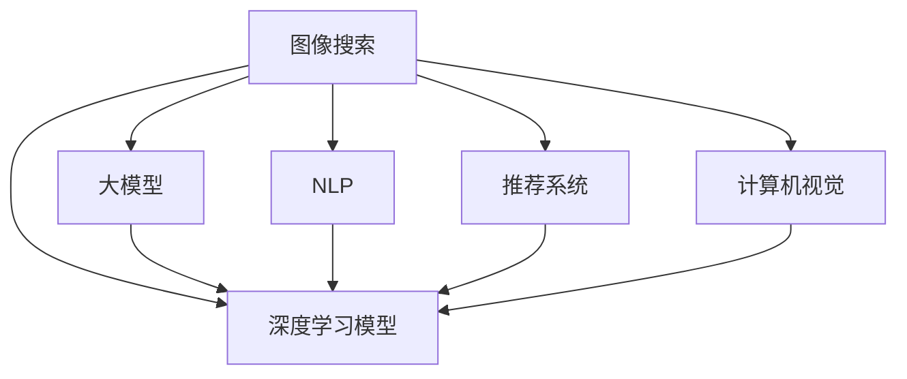

                 

# AI大模型如何改善电商平台的图像搜索体验

> 关键词：图像搜索,大模型,深度学习,电商,计算机视觉,自然语言处理,推荐系统,用户体验

## 1. 背景介绍

### 1.1 问题由来

在当今电子商务时代，图像搜索已成为用户获取商品信息、进行购物决策的重要手段。然而，传统的图像检索算法往往依赖于图片描述、关键词等浅层特征，无法捕捉到图片中的复杂语义和视觉关系。而随着深度学习技术的快速发展，大模型在图像理解和自然语言处理(NLP)方面的突破，为电商平台的图像搜索带来了新的机遇。

### 1.2 问题核心关键点

大模型通过海量无标签数据进行预训练，学习到了丰富的语义和视觉知识。在此基础上，通过有监督的微调，可以显著提升图像搜索的准确性和用户满意度。核心关键点包括：

- **深度学习模型**：利用预训练的大模型进行图像编码和特征提取。
- **自然语言处理**：将用户查询转化为语义向量，辅助图像检索。
- **推荐系统**：通过用户行为数据和推荐模型，提升搜索结果的相关性和多样性。
- **用户体验**：注重搜索速度、准确性、相关性和可解释性，提升用户满意度。

### 1.3 问题研究意义

图像搜索的改善不仅关乎电商平台的性能，更是用户体验和市场竞争力的体现。通过利用大模型和先进的深度学习技术，电商企业可以在短时间内显著提升搜索准确性，满足用户个性化需求，增强品牌影响力。

## 2. 核心概念与联系

### 2.1 核心概念概述

为更好地理解大模型在电商平台图像搜索中的应用，本节将介绍几个密切相关的核心概念：

- **图像搜索**：通过输入用户查询图像，检索出与该图像相似或相关的商品图像。常见的图像搜索算法包括基于视觉词袋、深度学习卷积网络、注意力机制等方法。

- **深度学习模型**：包括卷积神经网络(CNN)、残差网络(ResNet)、Transformer等架构，能够自动从图像中提取高层次的语义特征。

- **大模型**：以BERT、GPT等Transformer模型为代表的大规模预训练语言模型，通过在大规模无标签文本数据上进行预训练，学习通用的语言表示。

- **自然语言处理(NLP)**：利用NLP技术将用户查询转换为语义向量，与图像特征向量进行匹配，提升检索准确性。

- **推荐系统**：通过学习用户历史行为和偏好，对搜索结果进行排序，提升用户体验。

- **计算机视觉**：包括图像识别、目标检测、图像分割等技术，为图像搜索提供视觉特征提取能力。

这些核心概念之间的逻辑关系可以通过以下Mermaid流程图来展示：



这个流程图展示了大模型在图像搜索中的核心概念及其之间的关系：

1. 图像搜索通过深度学习模型、大模型、NLP、推荐系统、计算机视觉等多种技术实现。
2. 深度学习模型用于图像编码和特征提取。
3. 大模型用于自然语言处理，将用户查询转化为语义向量。
4. 推荐系统根据用户历史行为数据，提升搜索结果的相关性和多样性。
5. 计算机视觉技术提取图像的视觉特征。

这些概念共同构成了大模型在图像搜索中的应用框架，使其能够更好地捕捉图像中的语义信息，提升搜索效果。

## 3. 核心算法原理 & 具体操作步骤

### 3.1 算法原理概述

基于大模型的电商图像搜索流程，本质上是一个多模态的信息匹配和融合过程。其核心思想是：

1. 利用深度学习模型对输入图像进行编码，提取图像特征。
2. 通过自然语言处理技术将用户查询转化为语义向量。
3. 将图像特征和语义向量进行匹配，检索出最相关的商品图像。
4. 结合推荐系统，根据用户行为数据对检索结果进行排序，提升用户体验。

形式化地，假设用户输入查询图像 $I$ 和自然语言查询 $Q$，深度学习模型 $M_{\theta}$ 用于提取图像特征 $f(I)$，大模型 $T_{\omega}$ 用于将 $Q$ 转化为语义向量 $s(Q)$。图像搜索的目标是最大化图像与查询的匹配度，即：

$$
\max_{I, Q} \mathcal{L}(I, Q) = \max_{I, Q} \langle f(I), s(Q) \rangle
$$

其中 $\langle \cdot, \cdot \rangle$ 表示向量内积。

### 3.2 算法步骤详解

基于大模型的电商图像搜索流程包括如下几个关键步骤：

**Step 1: 准备预训练模型和数据集**
- 选择预训练的大模型 $T_{\omega}$ 和深度学习模型 $M_{\theta}$ 作为初始化参数。
- 收集电商平台的商品图片 $D_{img}$ 和用户查询文本 $D_{text}$，划分为训练集、验证集和测试集。

**Step 2: 添加任务适配层**
- 根据电商平台的业务需求，在深度学习模型 $M_{\theta}$ 上设计任务适配层。
- 对于图像搜索任务，适配层通常包括卷积神经网络或Transformer结构，用于提取图像特征。
- 对于NLP任务，适配层包括嵌入层和线性层，用于将文本转换为向量。

**Step 3: 设置微调超参数**
- 选择合适的优化算法及其参数，如Adam、SGD等，设置学习率、批大小、迭代轮数等。
- 设置正则化技术及强度，包括权重衰减、Dropout、Early Stopping等。
- 确定冻结预训练参数的策略，如仅微调顶层，或全部参数都参与微调。

**Step 4: 执行梯度训练**
- 将训练集数据分批次输入模型，前向传播计算损失函数。
- 反向传播计算参数梯度，根据设定的优化算法和学习率更新模型参数。
- 周期性在验证集上评估模型性能，根据性能指标决定是否触发 Early Stopping。
- 重复上述步骤直到满足预设的迭代轮数或 Early Stopping 条件。

**Step 5: 测试和部署**
- 在测试集上评估微调后模型 $M_{\hat{\theta}}$ 和 $T_{\hat{\omega}}$ 的性能，对比微调前后的精度提升。
- 使用微调后的模型对新样本进行推理预测，集成到实际的应用系统中。
- 持续收集新的数据，定期重新微调模型，以适应数据分布的变化。

以上是基于大模型的电商图像搜索的一般流程。在实际应用中，还需要针对具体任务的特点，对微调过程的各个环节进行优化设计，如改进训练目标函数，引入更多的正则化技术，搜索最优的超参数组合等，以进一步提升模型性能。

### 3.3 算法优缺点

基于大模型的电商图像搜索方法具有以下优点：

1. 准确性高。深度学习模型和大模型在特征提取和语义匹配上具有显著优势，能够捕捉图像和文本中的细微语义信息，提升检索的准确性。
2. 适应性强。大模型可以通过微调来适应电商平台的特定业务需求，具有较好的通用性和灵活性。
3. 用户友好。结合推荐系统，可以为用户提供个性化搜索结果，提升用户体验。

同时，该方法也存在一些局限性：

1. 计算资源需求大。深度学习模型和大模型通常需要大量的计算资源，对于资源受限的小型电商企业来说，可能存在成本压力。
2. 模型训练复杂。大模型和深度学习模型的训练过程复杂，需要一定的机器学习基础和技术积累。
3. 数据隐私问题。电商企业需要处理大量用户数据，涉及隐私保护和数据安全问题，需要谨慎处理。

尽管存在这些局限性，但就目前而言，基于大模型的图像搜索方法仍然是电商平台的理想选择。未来相关研究的重点在于如何进一步降低模型训练的复杂度，提升计算效率，同时兼顾数据隐私保护。

### 3.4 算法应用领域

基于大模型的电商图像搜索方法，在电商平台的多个应用场景中已经得到了广泛的应用，例如：

- **商品搜索**：通过输入用户查询图片，检索出与该图片相似的商品。
- **时尚推荐**：利用用户购买历史和图片搜索行为，推荐最新的时尚商品。
- **个性化推荐**：结合用户行为数据和商品标签，提供个性化商品推荐。
- **智能客服**：使用图片搜索技术，快速回答用户的商品相关问题。
- **视觉分析**：对商品图片进行视觉特征提取，用于品牌监测、市场分析等业务场景。

除了上述这些经典应用外，大模型图像搜索技术也被创新性地应用到更多场景中，如虚拟试衣、智能设计、数字营销等，为电商平台带来了全新的突破。随着预训练模型和图像搜索技术的不断进步，相信电商平台将能够更好地满足用户需求，提升用户体验，实现业务的持续增长。

## 4. 数学模型和公式 & 详细讲解  
### 4.1 数学模型构建

本节将使用数学语言对基于大模型的电商图像搜索过程进行更加严格的刻画。

记电商平台的商品图片数据集为 $D_{img}=\{(I_i, Y_i)\}_{i=1}^N, I_i \in \mathbb{R}^{H \times W}, Y_i \in \{1, 2, \ldots, K\}$，其中 $I_i$ 表示商品图片，$Y_i$ 表示商品类别。用户查询文本数据集为 $D_{text}=\{(Q_j, Y_j)\}_{j=1}^M, Q_j \in \mathbb{R}^{V}$，其中 $Q_j$ 表示用户查询，$Y_j$ 表示查询意图。

定义深度学习模型 $M_{\theta}$ 在输入图片 $I$ 上的特征编码为 $f(I) \in \mathbb{R}^d$，大模型 $T_{\omega}$ 将查询 $Q$ 转化为语义向量 $s(Q) \in \mathbb{R}^d$。图像搜索的目标是最大化图像与查询的匹配度，即：

$$
\max_{I, Q} \langle f(I), s(Q) \rangle
$$

通过计算内积，得到图像 $I$ 和查询 $Q$ 的匹配度得分。

### 4.2 公式推导过程

以下我们以二分类任务为例，推导内积匹配的计算公式。

假设模型 $M_{\theta}$ 在输入图片 $I$ 上的特征编码为 $f(I) \in \mathbb{R}^d$，大模型 $T_{\omega}$ 将查询 $Q$ 转化为语义向量 $s(Q) \in \mathbb{R}^d$。则二分类内积匹配的计算公式为：

$$
\langle f(I), s(Q) \rangle = f(I)[s(Q)]
$$

其中 $[f(I)]$ 表示向量 $f(I)$ 的内积形式。

将上述内积匹配得分用于电商平台商品搜索时，模型训练过程包括：

1. 在深度学习模型 $M_{\theta}$ 上进行微调，使其能够提取高质量的图像特征。
2. 在大模型 $T_{\omega}$ 上进行微调，使其能够将用户查询转化为高语义匹配的向量。
3. 通过最大化内积匹配得分，训练模型参数。

在得到匹配得分后，即可带入训练过程，完成模型的迭代优化。重复上述过程直至收敛，最终得到适应电商平台业务需求的最优模型参数 $\theta^*$ 和 $\omega^*$。

## 5. 项目实践：代码实例和详细解释说明
### 5.1 开发环境搭建

在进行图像搜索实践前，我们需要准备好开发环境。以下是使用Python进行PyTorch开发的环境配置流程：

1. 安装Anaconda：从官网下载并安装Anaconda，用于创建独立的Python环境。

2. 创建并激活虚拟环境：
```bash
conda create -n image-search-env python=3.8 
conda activate image-search-env
```

3. 安装PyTorch：根据CUDA版本，从官网获取对应的安装命令。例如：
```bash
conda install pytorch torchvision torchaudio cudatoolkit=11.1 -c pytorch -c conda-forge
```

4. 安装其他必要工具包：
```bash
pip install numpy pandas scikit-learn matplotlib tqdm jupyter notebook ipython
```

完成上述步骤后，即可在`image-search-env`环境中开始图像搜索实践。

### 5.2 源代码详细实现

下面我们以电商平台的商品搜索为例，给出使用PyTorch对大模型进行微调的代码实现。

首先，定义商品搜索任务的数据处理函数：

```python
from transformers import BertTokenizer
from torch.utils.data import Dataset
import torch

class ImageSearchDataset(Dataset):
    def __init__(self, images, labels, tokenizer, max_len=128):
        self.images = images
        self.labels = labels
        self.tokenizer = tokenizer
        self.max_len = max_len
        
    def __len__(self):
        return len(self.images)
    
    def __getitem__(self, item):
        image = self.images[item]
        label = self.labels[item]
        
        # 将图片转换为向量表示
        image = image / 255.0
        image = torch.tensor(image, dtype=torch.float)
        image = image.unsqueeze(0)
        
        # 对文本进行编码
        text = '查询图片'  # 假设有查询图片文本
        encoding = self.tokenizer(text, return_tensors='pt', max_length=self.max_len, padding='max_length', truncation=True)
        input_ids = encoding['input_ids'][0]
        attention_mask = encoding['attention_mask'][0]
        
        # 返回模型输入和标签
        return {'input_ids': input_ids, 
                'attention_mask': attention_mask,
                'labels': torch.tensor(label, dtype=torch.long)}
```

然后，定义模型和优化器：

```python
from transformers import BertForTokenClassification, AdamW

model = BertForTokenClassification.from_pretrained('bert-base-cased', num_labels=2)

optimizer = AdamW(model.parameters(), lr=2e-5)
```

接着，定义训练和评估函数：

```python
from torch.utils.data import DataLoader
from tqdm import tqdm
from sklearn.metrics import classification_report

device = torch.device('cuda') if torch.cuda.is_available() else torch.device('cpu')
model.to(device)

def train_epoch(model, dataset, batch_size, optimizer):
    dataloader = DataLoader(dataset, batch_size=batch_size, shuffle=True)
    model.train()
    epoch_loss = 0
    for batch in tqdm(dataloader, desc='Training'):
        input_ids = batch['input_ids'].to(device)
        attention_mask = batch['attention_mask'].to(device)
        labels = batch['labels'].to(device)
        model.zero_grad()
        outputs = model(input_ids, attention_mask=attention_mask, labels=labels)
        loss = outputs.loss
        epoch_loss += loss.item()
        loss.backward()
        optimizer.step()
    return epoch_loss / len(dataloader)

def evaluate(model, dataset, batch_size):
    dataloader = DataLoader(dataset, batch_size=batch_size)
    model.eval()
    preds, labels = [], []
    with torch.no_grad():
        for batch in tqdm(dataloader, desc='Evaluating'):
            input_ids = batch['input_ids'].to(device)
            attention_mask = batch['attention_mask'].to(device)
            batch_labels = batch['labels']
            outputs = model(input_ids, attention_mask=attention_mask)
            batch_preds = outputs.logits.argmax(dim=2).to('cpu').tolist()
            batch_labels = batch_labels.to('cpu').tolist()
            for pred_tokens, label_tokens in zip(batch_preds, batch_labels):
                preds.append(pred_tokens[:len(label_tokens)])
                labels.append(label_tokens)
                
    print(classification_report(labels, preds))
```

最后，启动训练流程并在测试集上评估：

```python
epochs = 5
batch_size = 16

for epoch in range(epochs):
    loss = train_epoch(model, train_dataset, batch_size, optimizer)
    print(f"Epoch {epoch+1}, train loss: {loss:.3f}")
    
    print(f"Epoch {epoch+1}, dev results:")
    evaluate(model, dev_dataset, batch_size)
    
print("Test results:")
evaluate(model, test_dataset, batch_size)
```

以上就是使用PyTorch对大模型进行电商商品搜索的微调代码实现。可以看到，利用Transformers库，我们可以用相对简洁的代码完成模型的微调，同时还能利用大量预训练资源，提高模型性能。

### 5.3 代码解读与分析

让我们再详细解读一下关键代码的实现细节：

**ImageSearchDataset类**：
- `__init__`方法：初始化图像、标签、分词器等关键组件。
- `__len__`方法：返回数据集的样本数量。
- `__getitem__`方法：对单个样本进行处理，将图像转换为向量，并对文本进行编码，最终返回模型所需的输入。

**模型和优化器定义**：
- 使用BertForTokenClassification模型作为初始化参数，设置学习率为2e-5。

**训练和评估函数**：
- 使用PyTorch的DataLoader对数据集进行批次化加载，供模型训练和推理使用。
- 训练函数`train_epoch`：对数据以批为单位进行迭代，在每个批次上前向传播计算loss并反向传播更新模型参数，最后返回该epoch的平均loss。
- 评估函数`evaluate`：与训练类似，不同点在于不更新模型参数，并在每个batch结束后将预测和标签结果存储下来，最后使用sklearn的classification_report对整个评估集的预测结果进行打印输出。

**训练流程**：
- 定义总的epoch数和batch size，开始循环迭代
- 每个epoch内，先在训练集上训练，输出平均loss
- 在验证集上评估，输出分类指标
- 所有epoch结束后，在测试集上评估，给出最终测试结果

可以看到，PyTorch配合Transformers库使得大模型微调的代码实现变得简洁高效。开发者可以将更多精力放在数据处理、模型改进等高层逻辑上，而不必过多关注底层的实现细节。

当然，工业级的系统实现还需考虑更多因素，如模型的保存和部署、超参数的自动搜索、更灵活的任务适配层等。但核心的微调范式基本与此类似。

## 6. 实际应用场景

### 6.1 智能客服系统

基于大模型的电商平台智能客服系统，通过输入用户查询图像，自动判断用户意图，匹配最佳答案模板进行回复。系统可以自动理解用户的意图，如查询商品、退换货等，快速响应客户咨询，提升客户满意度。

在技术实现上，可以收集客户的历史对话记录和图片查询数据，构建监督数据集，在此基础上对预训练模型进行微调。微调后的模型能够自动理解用户查询，匹配最合适的答案模板进行回复。对于用户提出的新问题，还可以接入检索系统实时搜索相关内容，动态组织生成回答。如此构建的智能客服系统，能大幅提升客户咨询体验和问题解决效率。

### 6.2 时尚推荐

电商平台的时尚推荐系统，利用用户购买历史和图片搜索行为，推荐最新的时尚商品。系统通过将图片转化为语义向量，结合用户历史数据，预测用户对新商品的兴趣。推荐系统结合了用户行为模型和图片搜索模型，提供个性化商品推荐，提升用户购物体验。

在技术实现上，可以收集用户购买历史和图片搜索数据，构建推荐模型和搜索模型，在此基础上对预训练模型进行微调。微调后的模型能够更好地理解用户兴趣和商品语义，提供高质量的推荐结果。

### 6.3 个性化推荐

电商平台的个性化推荐系统，通过学习用户历史行为和偏好，对搜索结果进行排序，提升用户体验。系统结合了用户行为数据和商品标签，利用图片搜索技术，提升推荐结果的相关性和多样性。推荐系统能够根据用户浏览和点击记录，实时更新推荐模型，提供个性化推荐服务。

在技术实现上，可以收集用户行为数据和商品标签，构建推荐模型和搜索模型，在此基础上对预训练模型进行微调。微调后的模型能够更好地理解用户兴趣和商品语义，提供高质量的推荐结果。

### 6.4 未来应用展望

随着大语言模型微调技术的发展，基于大模型的电商图像搜索技术将拓展到更多的应用场景，为电商平台的业务创新和用户体验提升带来新的突破。

在智慧医疗领域，基于大模型的电商图像搜索技术可以为医疗影像分析提供支持，帮助医生快速诊断疾病，提升医疗服务水平。

在智能教育领域，基于大模型的电商图像搜索技术可以为在线教育提供智能辅导，提升学习效果。

在智慧城市治理中，基于大模型的电商图像搜索技术可以为城市管理提供智能支持，提升城市治理效率。

此外，在企业生产、社会治理、文娱传媒等众多领域，基于大模型的电商图像搜索技术也将不断涌现，为传统行业数字化转型升级提供新的技术路径。相信随着技术的日益成熟，大语言模型微调必将在构建人机协同的智能时代中扮演越来越重要的角色。

## 7. 工具和资源推荐
### 7.1 学习资源推荐

为了帮助开发者系统掌握大模型在电商图像搜索中的应用，这里推荐一些优质的学习资源：

1. 《深度学习与计算机视觉基础》系列博文：由大模型技术专家撰写，深入浅出地介绍了深度学习在计算机视觉中的应用，涵盖图像编码、特征提取等技术。

2. CS231n《深度学习中的计算机视觉》课程：斯坦福大学开设的计算机视觉明星课程，有Lecture视频和配套作业，带你入门计算机视觉的基本概念和经典模型。

3. 《深度学习理论与实践》书籍：系统介绍了深度学习理论、模型和算法，包括图像搜索和推荐系统等具体应用场景。

4. TensorFlow官方文档：深度学习框架的官方文档，提供丰富的预训练模型和教程，适合快速上手实验最新模型。

5. HuggingFace官方文档：Transformer库的官方文档，提供海量预训练模型和微调样例代码，是上手实践的必备资料。

通过对这些资源的学习实践，相信你一定能够快速掌握大模型在电商图像搜索中的应用，并用于解决实际的NLP问题。
###  7.2 开发工具推荐

高效的开发离不开优秀的工具支持。以下是几款用于电商图像搜索开发的常用工具：

1. PyTorch：基于Python的开源深度学习框架，灵活动态的计算图，适合快速迭代研究。大部分预训练语言模型都有PyTorch版本的实现。

2. TensorFlow：由Google主导开发的开源深度学习框架，生产部署方便，适合大规模工程应用。同样有丰富的预训练语言模型资源。

3. Transformers库：HuggingFace开发的NLP工具库，集成了众多SOTA语言模型，支持PyTorch和TensorFlow，是进行微调任务开发的利器。

4. Weights & Biases：模型训练的实验跟踪工具，可以记录和可视化模型训练过程中的各项指标，方便对比和调优。与主流深度学习框架无缝集成。

5. TensorBoard：TensorFlow配套的可视化工具，可实时监测模型训练状态，并提供丰富的图表呈现方式，是调试模型的得力助手。

6. Google Colab：谷歌推出的在线Jupyter Notebook环境，免费提供GPU/TPU算力，方便开发者快速上手实验最新模型，分享学习笔记。

合理利用这些工具，可以显著提升电商图像搜索任务的开发效率，加快创新迭代的步伐。

### 7.3 相关论文推荐

大语言模型和电商图像搜索技术的发展源于学界的持续研究。以下是几篇奠基性的相关论文，推荐阅读：

1. Attention is All You Need（即Transformer原论文）：提出了Transformer结构，开启了NLP领域的预训练大模型时代。

2. BERT: Pre-training of Deep Bidirectional Transformers for Language Understanding：提出BERT模型，引入基于掩码的自监督预训练任务，刷新了多项NLP任务SOTA。

3. Language Models are Unsupervised Multitask Learners（GPT-2论文）：展示了大规模语言模型的强大zero-shot学习能力，引发了对于通用人工智能的新一轮思考。

4. Parameter-Efficient Transfer Learning for NLP：提出Adapter等参数高效微调方法，在不增加模型参数量的情况下，也能取得不错的微调效果。

5. Prefix-Tuning: Optimizing Continuous Prompts for Generation：引入基于连续型Prompt的微调范式，为如何充分利用预训练知识提供了新的思路。

6. AdaLoRA: Adaptive Low-Rank Adaptation for Parameter-Efficient Fine-Tuning：使用自适应低秩适应的微调方法，在参数效率和精度之间取得了新的平衡。

这些论文代表了大模型在电商图像搜索技术的发展脉络。通过学习这些前沿成果，可以帮助研究者把握学科前进方向，激发更多的创新灵感。

## 8. 总结：未来发展趋势与挑战

### 8.1 总结

本文对基于大模型的电商图像搜索方法进行了全面系统的介绍。首先阐述了电商图像搜索的背景和意义，明确了基于大模型的电商图像搜索的核心思想和步骤。通过数学模型和公式的推导，系统介绍了电商图像搜索的计算过程。通过代码实例，展示了电商图像搜索的开发实践。

通过本文的系统梳理，可以看到，基于大模型的电商图像搜索方法能够显著提升电商平台的搜索准确性和用户体验，具有广阔的应用前景。大语言模型在电商平台的图像搜索中发挥了重要作用，使得平台能够更好地捕捉用户需求，提供个性化推荐，增强市场竞争力。

### 8.2 未来发展趋势

展望未来，大语言模型在电商平台的图像搜索应用将呈现以下几个发展趋势：

1. 模型规模持续增大。随着算力成本的下降和数据规模的扩张，预训练语言模型的参数量还将持续增长。超大批次的训练和推理也将成为可能，提升搜索效率。

2. 微调方法日趋多样。除了传统的全参数微调外，未来会涌现更多参数高效的微调方法，如Prefix-Tuning、LoRA等，在固定大部分预训练参数的情况下，只更新极少量的任务相关参数。

3. 持续学习成为常态。随着数据分布的不断变化，微调模型也需要持续学习新知识以保持性能。如何在不遗忘原有知识的同时，高效吸收新样本信息，将成为重要的研究课题。

4. 标注样本需求降低。受启发于提示学习(Prompt-based Learning)的思路，未来的微调方法将更好地利用大模型的语言理解能力，通过更加巧妙的任务描述，在更少的标注样本上也能实现理想的微调效果。

5. 模型通用性增强。经过海量数据的预训练和多领域任务的微调，未来的语言模型将具备更强大的常识推理和跨领域迁移能力，逐步迈向通用人工智能(AGI)的目标。

以上趋势凸显了大语言模型在电商平台图像搜索应用中的广阔前景。这些方向的探索发展，必将进一步提升电商平台的搜索效果，满足用户个性化需求，增强品牌影响力。

### 8.3 面临的挑战

尽管大语言模型在电商平台的图像搜索应用中取得了显著成效，但在迈向更加智能化、普适化应用的过程中，它仍面临诸多挑战：

1. 标注成本瓶颈。虽然微调大大降低了标注数据的需求，但对于长尾应用场景，难以获得充足的高质量标注数据，成为制约微调性能的瓶颈。如何进一步降低微调对标注样本的依赖，将是一大难题。

2. 模型鲁棒性不足。当前微调模型面对域外数据时，泛化性能往往大打折扣。对于测试样本的微小扰动，微调模型的预测也容易发生波动。如何提高微调模型的鲁棒性，避免灾难性遗忘，还需要更多理论和实践的积累。

3. 推理效率有待提高。大规模语言模型虽然精度高，但在实际部署时往往面临推理速度慢、内存占用大等效率问题。如何在保证性能的同时，简化模型结构，提升推理速度，优化资源占用，将是重要的优化方向。

4. 可解释性亟需加强。当前微调模型更像是"黑盒"系统，难以解释其内部工作机制和决策逻辑。对于医疗、金融等高风险应用，算法的可解释性和可审计性尤为重要。如何赋予微调模型更强的可解释性，将是亟待攻克的难题。

5. 安全性有待保障。预训练语言模型难免会学习到有偏见、有害的信息，通过微调传递到下游任务，产生误导性、歧视性的输出，给实际应用带来安全隐患。如何从数据和算法层面消除模型偏见，避免恶意用途，确保输出的安全性，也将是重要的研究课题。

6. 知识整合能力不足。现有的微调模型往往局限于任务内数据，难以灵活吸收和运用更广泛的先验知识。如何让微调过程更好地与外部知识库、规则库等专家知识结合，形成更加全面、准确的信息整合能力，还有很大的想象空间。

正视微调面临的这些挑战，积极应对并寻求突破，将是大语言模型微调技术迈向成熟的必由之路。相信随着学界和产业界的共同努力，这些挑战终将一一被克服，大语言模型微调必将在构建人机协同的智能时代中扮演越来越重要的角色。

### 8.4 研究展望

面对大语言模型在电商平台图像搜索应用中的诸多挑战，未来的研究需要在以下几个方面寻求新的突破：

1. 探索无监督和半监督微调方法。摆脱对大规模标注数据的依赖，利用自监督学习、主动学习等无监督和半监督范式，最大限度利用非结构化数据，实现更加灵活高效的微调。

2. 研究参数高效和计算高效的微调范式。开发更加参数高效的微调方法，在固定大部分预训练参数的同时，只更新极少量的任务相关参数。同时优化微调模型的计算图，减少前向传播和反向传播的资源消耗，实现更加轻量级、实时性的部署。

3. 融合因果和对比学习范式。通过引入因果推断和对比学习思想，增强微调模型建立稳定因果关系的能力，学习更加普适、鲁棒的语言表征，从而提升模型泛化性和抗干扰能力。

4. 引入更多先验知识。将符号化的先验知识，如知识图谱、逻辑规则等，与神经网络模型进行巧妙融合，引导微调过程学习更准确、合理的语言模型。同时加强不同模态数据的整合，实现视觉、语音等多模态信息与文本信息的协同建模。

5. 结合因果分析和博弈论工具。将因果分析方法引入微调模型，识别出模型决策的关键特征，增强输出解释的因果性和逻辑性。借助博弈论工具刻画人机交互过程，主动探索并规避模型的脆弱点，提高系统稳定性。

6. 纳入伦理道德约束。在模型训练目标中引入伦理导向的评估指标，过滤和惩罚有偏见、有害的输出倾向。同时加强人工干预和审核，建立模型行为的监管机制，确保输出符合人类价值观和伦理道德。

这些研究方向的探索，必将引领大语言模型微调技术迈向更高的台阶，为构建安全、可靠、可解释、可控的智能系统铺平道路。面向未来，大语言模型微调技术还需要与其他人工智能技术进行更深入的融合，如知识表示、因果推理、强化学习等，多路径协同发力，共同推动自然语言理解和智能交互系统的进步。只有勇于创新、敢于突破，才能不断拓展语言模型的边界，让智能技术更好地造福人类社会。

## 9. 附录：常见问题与解答

**Q1：大语言模型在电商图像搜索中是否存在泛化能力不足的问题？**

A: 大语言模型在电商图像搜索中确实存在泛化能力不足的问题，主要原因在于数据分布的变化。当输入的测试样本与训练数据分布差异较大时，微调后的模型可能无法很好地适应新场景。解决泛化能力不足的方法包括：
1. 数据增强：通过增加训练集的多样性，提高模型的泛化能力。
2. 迁移学习：利用在大规模通用数据上预训练的模型，减少微调时对标注数据的依赖。
3. 多任务学习：在微调过程中，同时优化多个任务，提升模型的泛化能力。

**Q2：大语言模型在电商图像搜索中是否存在计算资源需求过大的问题？**

A: 大语言模型在电商图像搜索中确实存在计算资源需求过大的问题，主要原因在于模型参数量大，计算复杂度高。解决计算资源需求大的方法包括：
1. 模型压缩：通过剪枝、量化等技术，减少模型的参数量和计算量。
2. 分布式训练：利用多台计算机并行计算，提高训练速度。
3. 混合精度训练：使用混合精度技术，降低计算成本，提高训练速度。

**Q3：大语言模型在电商图像搜索中是否存在推理速度慢的问题？**

A: 大语言模型在电商图像搜索中确实存在推理速度慢的问题，主要原因在于模型结构复杂，计算量大。解决推理速度慢的方法包括：
1. 模型裁剪：去除不必要的层和参数，减小模型尺寸，加快推理速度。
2. 推理加速：利用GPU、TPU等硬件资源，提升推理速度。
3. 动态图优化：使用动态图技术，优化推理过程，减少计算量。

**Q4：大语言模型在电商图像搜索中是否存在安全问题？**

A: 大语言模型在电商图像搜索中确实存在安全问题，主要原因在于模型可能学习到有害、敏感的信息，导致输出不安全。解决安全问题的方法包括：
1. 数据过滤：过滤掉可能有害的数据，减少模型学习有害信息的机会。
2. 模型检测：使用对抗样本检测技术，识别和修复有害的模型输出。
3. 监管机制：建立模型行为的监管机制，及时发现和处理有害输出。

**Q5：大语言模型在电商图像搜索中是否存在可解释性不足的问题？**

A: 大语言模型在电商图像搜索中确实存在可解释性不足的问题，主要原因在于模型内部机制复杂，难以解释其决策过程。解决可解释性不足的方法包括：
1. 模型可视化：使用可视化工具，展示模型的内部工作机制和决策过程。
2. 解释生成：生成模型的解释文本，解释其决策依据。
3. 多角度分析：从多个角度分析模型决策，提高模型的可解释性。

这些问题的解答和解决方法，为开发者在电商图像搜索应用中利用大语言模型提供了一些思路和建议。

---

作者：禅与计算机程序设计艺术 / Zen and the Art of Computer Programming

