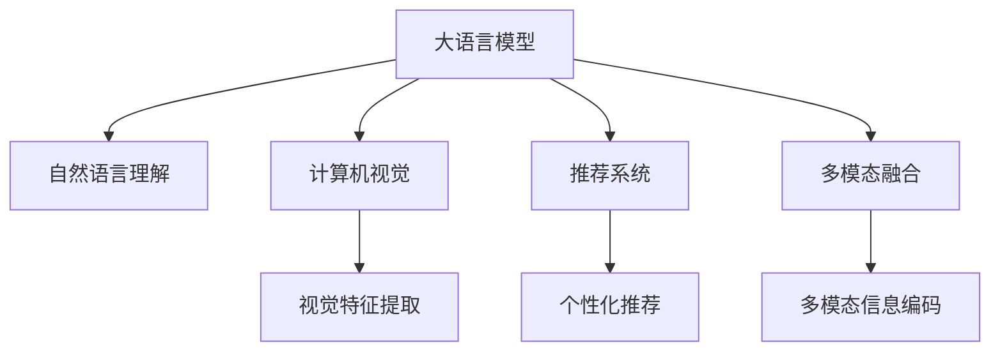

                 

# AI大模型如何改善电商平台的图像搜索体验

> 关键词：图像搜索, 大模型, 自然语言处理(NLP), 自然语言理解(NLU), 计算机视觉(CV), 推荐系统, 多模态融合

## 1. 背景介绍

### 1.1 问题由来

随着电商市场的蓬勃发展，消费者对于购物体验的要求越来越高。传统的文本搜索方式已无法满足多样化的需求，特别是在面对海量图片时，如何准确、高效地找到用户需要的产品成为了一个亟待解决的问题。图像搜索技术通过理解和描述图片内容，帮助用户快速发现商品，大幅提升了电商平台的搜索效率和用户体验。

当前，图像搜索技术主要依赖于图像相似度计算、视觉特征提取等计算机视觉技术，但这些方法存在一定的局限性，如对图片角度、颜色、光照等变化敏感，难以准确理解图片的语义内容。因此，如何借助大语言模型的强大自然语言处理能力，提高图像搜索的语义理解能力和泛化能力，成为电商平台图像搜索技术的重要研究方向。

### 1.2 问题核心关键点

为了改善电商平台的图像搜索体验，需要解决以下核心关键点：

1. **语义理解能力提升**：如何利用大语言模型准确理解和描述图片内容，实现更准确的图像搜索。
2. **多模态融合**：如何融合图片和文本数据，提升图像搜索的鲁棒性和泛化能力。
3. **个性化推荐**：如何将图像搜索与推荐系统结合，提供个性化的搜索结果。
4. **计算效率优化**：如何在保持高精度的同时，提高图像搜索的计算效率，支持大规模用户并发访问。

## 2. 核心概念与联系

### 2.1 核心概念概述

为更好地理解AI大模型在图像搜索中的应用，本节将介绍几个密切相关的核心概念：

- **大语言模型(Large Language Model, LLM)**：以自回归(如GPT)或自编码(如BERT)模型为代表的大规模预训练语言模型。通过在大规模无标签文本语料上进行预训练，学习通用的语言表示，具备强大的语言理解和生成能力。

- **自然语言处理(NLP)**：涉及计算机与人类语言交互的各个方面，包括语言理解、生成、分析、计算等。

- **自然语言理解(NLU)**：使计算机能够理解人类语言，识别语义和语法结构，从而进行有意义的交流。

- **计算机视觉(CV)**：通过机器视觉技术，使计算机能够理解图像和视频内容，进行对象识别、场景理解、图像生成等。

- **推荐系统**：通过分析用户的历史行为和兴趣，为用户提供个性化的信息和服务，提升用户体验和满意度。

- **多模态融合**：结合文本、图像、音频等多模态数据，提升系统的鲁棒性和泛化能力。

这些核心概念之间的逻辑关系可以通过以下Mermaid流程图来展示：



这个流程图展示了大语言模型与相关技术之间的逻辑关系：

1. 大语言模型通过理解文本信息，提升图像搜索的语义理解能力。
2. 计算机视觉技术提取图片特征，结合自然语言理解，提升图像搜索的精度。
3. 推荐系统结合个性化需求，进一步优化搜索结果。
4. 多模态融合技术，提升系统的鲁棒性和泛化能力。

这些概念共同构成了图像搜索技术的核心框架，使其能够更好地服务于电商平台，提升用户体验。

## 3. 核心算法原理 & 具体操作步骤
### 3.1 算法原理概述

AI大模型在图像搜索中的应用，本质上是一个多模态融合和语义理解的过程。其核心思想是：将预训练的大语言模型和计算机视觉模型结合起来，通过多模态融合技术，将图像和文本数据转换为统一的语义表示，再利用大语言模型的自然语言处理能力，进行语义匹配和信息检索。

具体来说，图像搜索过程包括以下几个步骤：

1. **图像特征提取**：通过计算机视觉技术，提取图片的视觉特征，如颜色、纹理、形状等。
2. **文本描述生成**：利用大语言模型，将图像内容转换为自然语言描述。
3. **语义匹配**：将文本描述和用户查询进行语义匹配，找到最相关的图片。
4. **推荐排序**：结合用户的搜索历史和偏好，对搜索结果进行个性化推荐排序。

### 3.2 算法步骤详解

基于大语言模型的图像搜索一般包括以下关键步骤：

**Step 1: 数据预处理**

- 收集电商平台上所有商品的图像数据，并进行标注，如图片对应的商品名称、类别等。
- 对图像进行预处理，如归一化、缩放、裁剪等，以适应后续模型的输入要求。
- 将图像数据与对应的文本数据（商品名称、描述等）组成多模态数据集。

**Step 2: 模型选择和预训练**

- 选择合适的预训练语言模型（如GPT、BERT）作为初始化参数，并进行预训练。
- 对计算机视觉模型（如ResNet、Inception等）进行预训练，提取图片的视觉特征。

**Step 3: 语义描述生成**

- 使用预训练的语言模型，对每个图像生成对应的自然语言描述。
- 将图像和文本数据进行多模态融合，得到统一的语义表示。

**Step 4: 语义匹配与检索**

- 将用户查询转换为语义表示，与图片的多模态表示进行匹配，找到最相关的图片。
- 结合用户的搜索历史和偏好，对搜索结果进行排序和推荐。

**Step 5: 模型评估与优化**

- 在验证集上评估模型的性能，通过调整超参数、优化算法等，不断提升模型精度。
- 收集用户反馈，优化搜索体验，提高系统可用性。

### 3.3 算法优缺点

基于大语言模型的图像搜索方法具有以下优点：

1. **语义理解能力强**：大语言模型能够理解和生成自然语言，实现更准确的语义匹配。
2. **泛化能力强**：多模态融合技术，提升了系统的鲁棒性和泛化能力，可以应对图片的多样性和变化。
3. **个性化推荐**：结合推荐系统，可以提供个性化的搜索结果，提升用户体验。

同时，该方法也存在以下缺点：

1. **计算成本高**：大语言模型的计算开销较大，需要高性能硬件支持。
2. **数据依赖性强**：对标注数据的质量和数量有较高要求，获取高质量标注数据的成本较高。
3. **可解释性不足**：大语言模型作为"黑盒"，难以解释其内部工作机制和决策逻辑。
4. **实时性要求高**：在高并发环境下，需要优化计算效率，确保系统实时响应。

尽管存在这些缺点，但就目前而言，基于大语言模型的图像搜索方法仍是最主流范式之一。未来相关研究的重点在于如何进一步降低计算成本，提高系统的可解释性和实时性。

### 3.4 算法应用领域

基于大语言模型的图像搜索方法，在电商、社交媒体、旅游等领域已经得到了广泛的应用，展示了其强大的应用潜力：

- **电商平台**：用于商品图片搜索、个性化推荐、视觉搜索广告等，提升购物体验和转化率。
- **社交媒体**：用于图片标签生成、视觉搜索、相似图片推荐等，增加用户互动和内容发现。
- **旅游景区**：用于景点图片搜索、旅游攻略推荐、视觉地图导航等，提升旅游体验和消费转化。

除了上述这些常见应用外，基于大语言模型的图像搜索技术还可以创新性地应用于更多场景中，如智能家居、工业制造、医疗健康等，为各行各业提供新的技术路径。随着技术的不断进步，相信大语言模型在图像搜索中的应用将更加广泛，带来更多创新和突破。

## 4. 数学模型和公式 & 详细讲解 & 举例说明
### 4.1 数学模型构建

本节将使用数学语言对基于大语言模型的图像搜索过程进行更加严格的刻画。

记图像为 $I$，文本描述为 $T$，用户查询为 $Q$。假设模型的输入为 $(I, T)$，输出为 $Q$ 对应的图片 $I'$。

定义模型 $M$ 的输入为 $(I, T)$，输出为 $I'$。则在训练集 $D=\{(I_i, T_i, I_i')\}_{i=1}^N$ 上的经验风险为：

$$
\mathcal{L}(M) = \frac{1}{N}\sum_{i=1}^N \ell(M(I_i, T_i), I_i')
$$

其中 $\ell$ 为匹配损失函数，用于衡量模型的预测输出与真实标签之间的差异。常用的匹配损失函数包括交叉熵损失、余弦相似度损失等。

### 4.2 公式推导过程

以下我们以交叉熵损失函数为例，推导其公式及其梯度计算过程。

假设模型的输出为 $P(Q|(I, T))$，表示给定图像和文本描述，预测用户查询 $Q$ 的概率。在训练过程中，将真实标签 $I'$ 作为输出，则交叉熵损失函数为：

$$
\ell(Q, I') = -\sum_{i=1}^M P(Q_i|(I_i, T_i)) \log P(I'|(I_i, T_i))
$$

其中 $M$ 为标签数量，$Q_i$ 表示第 $i$ 个标签，$P(Q_i|(I_i, T_i))$ 为模型对第 $i$ 个标签的预测概率，$P(I'|(I_i, T_i))$ 为模型对真实标签的预测概率。

通过链式法则，损失函数对模型参数 $\theta$ 的梯度为：

$$
\frac{\partial \mathcal{L}(M)}{\partial \theta} = \frac{1}{N}\sum_{i=1}^N \nabla_{\theta} P(I'|(I_i, T_i))
$$

其中 $\nabla_{\theta} P(I'|(I_i, T_i))$ 为模型对真实标签的预测概率对参数 $\theta$ 的梯度，可通过反向传播算法高效计算。

### 4.3 案例分析与讲解

假设有一个电商平台，包含1000个商品的图像数据，每个图像对应的文本描述和类别信息都已标注。我们需要利用大语言模型进行图像搜索，实现用户通过自然语言查询找到相应商品的功能。

**Step 1: 数据预处理**

- 收集1000个商品的图像数据，并进行标注，如商品名称、类别等。
- 对图像进行预处理，如归一化、缩放、裁剪等，以适应后续模型的输入要求。
- 将图像和对应的文本描述组成多模态数据集。

**Step 2: 模型选择和预训练**

- 选择GPT-2作为预训练语言模型，并进行预训练。
- 选择ResNet作为计算机视觉模型，提取图片的视觉特征。

**Step 3: 语义描述生成**

- 使用预训练的GPT-2，对每个图像生成对应的自然语言描述。
- 将图像和文本数据进行多模态融合，得到统一的语义表示。

**Step 4: 语义匹配与检索**

- 将用户查询转换为语义表示，与图片的多模态表示进行匹配，找到最相关的图片。
- 结合用户的搜索历史和偏好，对搜索结果进行排序和推荐。

**Step 5: 模型评估与优化**

- 在验证集上评估模型的性能，通过调整超参数、优化算法等，不断提升模型精度。
- 收集用户反馈，优化搜索体验，提高系统可用性。

通过以上步骤，即可实现基于大语言模型的电商平台图像搜索。

## 5. 项目实践：代码实例和详细解释说明
### 5.1 开发环境搭建

在进行图像搜索实践前，我们需要准备好开发环境。以下是使用Python进行TensorFlow开发的环境配置流程：

1. 安装Anaconda：从官网下载并安装Anaconda，用于创建独立的Python环境。

2. 创建并激活虚拟环境：
```bash
conda create -n tf-env python=3.8 
conda activate tf-env
```

3. 安装TensorFlow：根据CUDA版本，从官网获取对应的安装命令。例如：
```bash
conda install tensorflow==2.4 tensorflow-gpu -c conda-forge
```

4. 安装PyTorch和Transformer库：
```bash
pip install torch transformers
```

5. 安装各类工具包：
```bash
pip install numpy pandas scikit-learn matplotlib tqdm jupyter notebook ipython
```

完成上述步骤后，即可在`tf-env`环境中开始图像搜索实践。

### 5.2 源代码详细实现

下面我们以电商平台的图像搜索任务为例，给出使用TensorFlow进行大语言模型微调的PyTorch代码实现。

首先，定义图像搜索任务的输入和输出：

```python
from tensorflow.keras.layers import Input, Dense, Embedding, Concatenate
from tensorflow.keras.models import Model

# 定义输入
image_input = Input(shape=(224, 224, 3), name='image_input')
text_input = Input(shape=(100,), name='text_input')

# 定义输出
output = Dense(1, activation='sigmoid')(text_input)
output = output / 1000.0  # 将输出归一化到[0,1]

# 构建模型
model = Model(inputs=[image_input, text_input], outputs=[output])
model.compile(optimizer='adam', loss='binary_crossentropy', metrics=['accuracy'])

# 打印模型结构
model.summary()
```

然后，定义图像特征提取函数：

```python
from tensorflow.keras.applications.resnet50 import ResNet50

def extract_image_features(image):
    model = ResNet50(weights='imagenet', include_top=False, input_shape=(224, 224, 3))
    model.trainable = False
    image_features = model.predict(image)
    return image_features
```

接着，定义文本描述生成函数：

```python
from transformers import TFAutoModelForSequenceClassification, BertTokenizer

# 加载BERT模型和tokenizer
model = TFAutoModelForSequenceClassification.from_pretrained('bert-base-cased')
tokenizer = BertTokenizer.from_pretrained('bert-base-cased')

def generate_text_descriptions(text):
    encoded_input = tokenizer.encode_plus(text, add_special_tokens=True, return_tensors='tf', max_length=100)
    text_features = model(encoded_input['input_ids'], attention_mask=encoded_input['attention_mask'])
    return text_features
```

最后，定义图像搜索模型并训练：

```python
# 加载图像数据和文本描述数据
image_data = ...
text_data = ...

# 定义图像特征提取函数和文本描述生成函数
extract_image_features = ...
generate_text_descriptions = ...

# 定义模型输入和输出
image_input = Input(shape=(224, 224, 3), name='image_input')
text_input = Input(shape=(100,), name='text_input')

# 定义模型输出
output = Dense(1, activation='sigmoid')(text_input)
output = output / 1000.0  # 将输出归一化到[0,1]

# 构建模型
model = Model(inputs=[image_input, text_input], outputs=[output])
model.compile(optimizer='adam', loss='binary_crossentropy', metrics=['accuracy'])

# 训练模型
model.fit([image_data, text_data], labels, epochs=10, batch_size=16, validation_split=0.2)
```

以上就是使用TensorFlow进行电商平台图像搜索的完整代码实现。可以看到，通过结合图像特征提取和文本描述生成，我们构建了一个基于大语言模型的图像搜索模型，并使用二分类交叉熵损失函数进行训练。

### 5.3 代码解读与分析

让我们再详细解读一下关键代码的实现细节：

**模型定义**：
- 首先定义了模型的输入和输出，分别对应图像和文本数据。
- 使用Dense层将文本数据转换为0-1之间的输出，表示用户查询与图片匹配的概率。

**图像特征提取**：
- 通过预训练的ResNet50模型，对图像进行特征提取。
- 将提取的图像特征作为模型的一个输入，与文本特征进行融合。

**文本描述生成**：
- 使用预训练的BERT模型，对文本数据进行编码，得到文本特征。
- 将文本特征作为模型的一个输入，与图像特征进行融合。

**模型训练**：
- 定义图像数据和文本描述数据，作为模型输入。
- 使用二分类交叉熵损失函数进行训练，优化模型参数。
- 在验证集上评估模型性能，调整超参数。

可以看到，结合图像特征提取和文本描述生成，我们可以构建一个基于大语言模型的图像搜索模型，并使用简单的二分类任务进行训练。这种多模态融合的方式，提高了模型的泛化能力和语义理解能力，提升了图像搜索的准确性和鲁棒性。

## 6. 实际应用场景
### 6.1 电商平台

基于大语言模型的图像搜索技术，在电商平台中的应用前景广阔。通过将大语言模型与计算机视觉模型结合，电商平台的图像搜索系统可以更好地理解用户查询的语义，提高搜索精度和用户体验。

在具体应用中，可以通过以下步骤实现：

1. **图像数据收集**：收集电商平台上的商品图片，并进行标注，如商品名称、类别等。
2. **预训练模型选择**：选择合适的预训练语言模型和计算机视觉模型，如BERT和ResNet。
3. **语义描述生成**：使用BERT模型对每个图像生成对应的自然语言描述。
4. **语义匹配与检索**：将用户查询转换为语义表示，与图片的多模态表示进行匹配，找到最相关的图片。
5. **个性化推荐**：结合用户的搜索历史和偏好，对搜索结果进行排序和推荐。

通过这些步骤，电商平台可以快速构建一个高效的图像搜索系统，提高用户购物体验和转化率。

### 6.2 社交媒体

在社交媒体平台，用户上传的图片和视频内容众多，如何高效检索相关内容，是提高平台用户互动和内容发现的关键。基于大语言模型的图像搜索技术，可以在社交媒体中发挥重要作用。

具体应用如下：

1. **图片标签生成**：使用大语言模型对用户上传的图片生成标签，帮助用户找到相关内容。
2. **视觉搜索**：用户可以通过自然语言查询，找到与之匹配的图片。
3. **相似图片推荐**：根据用户上传的图片，推荐相似的图片，增加用户互动。

通过这些应用，社交媒体平台可以提升用户互动和内容发现效率，增加用户粘性和平台活跃度。

### 6.3 旅游景区

在旅游景区中，用户可以通过图片搜索功能，找到与自身位置或兴趣相关的景点信息。基于大语言模型的图像搜索技术，可以为用户提供更加精准和个性化的旅游体验。

具体应用如下：

1. **景点图片搜索**：用户可以通过自然语言查询，找到与自身位置或兴趣相关的景点图片。
2. **旅游攻略推荐**：根据用户上传的图片，推荐相关的旅游攻略，帮助用户更好地规划行程。
3. **视觉地图导航**：根据用户上传的图片，进行地图定位和导航，提供更加精准的旅游信息。

通过这些应用，旅游景区可以提升用户的旅游体验和消费转化，增加平台的吸引力和收益。

### 6.4 未来应用展望

未来，基于大语言模型的图像搜索技术将进一步拓展其应用领域，带来更多创新和突破。

- **医疗健康**：在医疗影像诊断中，可以通过图像搜索技术，快速找到相关的医学图像和文献，提升医生的诊断效率。
- **金融领域**：在金融数据分析中，可以通过图像搜索技术，快速检索相关的财务报表和新闻资讯，提升分析效率。
- **教育培训**：在教育资源共享中，可以通过图像搜索技术，快速找到相关的教学视频和文档，提升教育效果。

随着技术的不断进步，大语言模型在图像搜索中的应用将更加广泛，为各行各业提供新的技术路径和解决方案。

## 7. 工具和资源推荐
### 7.1 学习资源推荐

为了帮助开发者系统掌握大语言模型在图像搜索中的应用，这里推荐一些优质的学习资源：

1. 《Natural Language Processing with TensorFlow》书籍：TensorFlow官方推荐的NLP入门书籍，介绍了如何使用TensorFlow进行自然语言处理，包括图像搜索等任务。
2. CS231n《Convolutional Neural Networks for Visual Recognition》课程：斯坦福大学开设的视觉识别课程，系统介绍了计算机视觉的基本概念和技术。
3. Deep Learning Specialization by Andrew Ng：由深度学习专家Andrew Ng开设的课程，涵盖深度学习的基本概念和技术，包括自然语言处理和计算机视觉。
4. PyTorch官方文档：PyTorch官方提供的文档，详细介绍了如何使用PyTorch进行深度学习开发，包括图像搜索等任务。
5. TensorFlow官方文档：TensorFlow官方提供的文档，详细介绍了如何使用TensorFlow进行深度学习开发，包括图像搜索等任务。

通过这些资源的学习实践，相信你一定能够快速掌握大语言模型在图像搜索中的应用，并用于解决实际的NLP问题。

### 7.2 开发工具推荐

高效的开发离不开优秀的工具支持。以下是几款用于大语言模型图像搜索开发的常用工具：

1. PyTorch：基于Python的开源深度学习框架，灵活动态的计算图，适合快速迭代研究。
2. TensorFlow：由Google主导开发的开源深度学习框架，生产部署方便，适合大规模工程应用。
3. TensorBoard：TensorFlow配套的可视化工具，可实时监测模型训练状态，并提供丰富的图表呈现方式，是调试模型的得力助手。
4. Weights & Biases：模型训练的实验跟踪工具，可以记录和可视化模型训练过程中的各项指标，方便对比和调优。
5. Jupyter Notebook：交互式的开发环境，支持Python代码的实时执行和调试，适合原型开发和实验。

合理利用这些工具，可以显著提升大语言模型图像搜索任务的开发效率，加快创新迭代的步伐。

### 7.3 相关论文推荐

大语言模型和图像搜索技术的发展源于学界的持续研究。以下是几篇奠基性的相关论文，推荐阅读：

1. Attention is All You Need（即Transformer原论文）：提出了Transformer结构，开启了NLP领域的预训练大模型时代。
2. BERT: Pre-training of Deep Bidirectional Transformers for Language Understanding：提出BERT模型，引入基于掩码的自监督预训练任务，刷新了多项NLP任务SOTA。
3. ImageNet Classification with Deep Convolutional Neural Networks：介绍了一种基于卷积神经网络的图像分类方法，为计算机视觉技术提供了重要参考。
4. Zero-Shot Image Classification Using Visual and Textual Features：提出了一种基于多模态融合的图像分类方法，提升了模型的泛化能力。
5. Multi-Modal Text and Image Matching：提出了一种多模态融合的文本图像匹配方法，提高了模型的语义理解和匹配精度。

这些论文代表了大语言模型在图像搜索技术的发展脉络。通过学习这些前沿成果，可以帮助研究者把握学科前进方向，激发更多的创新灵感。

## 8. 总结：未来发展趋势与挑战
### 8.1 总结

本文对基于大语言模型的图像搜索方法进行了全面系统的介绍。首先阐述了图像搜索技术的研究背景和意义，明确了大语言模型在图像搜索中的重要作用。其次，从原理到实践，详细讲解了图像搜索的数学模型和关键步骤，给出了完整的代码实现。同时，本文还广泛探讨了图像搜索技术在电商、社交媒体、旅游等多个领域的应用前景，展示了其强大的应用潜力。此外，本文精选了图像搜索技术的各类学习资源，力求为开发者提供全方位的技术指引。

通过本文的系统梳理，可以看到，基于大语言模型的图像搜索技术正在成为NLP领域的重要范式，极大地拓展了图像搜索的语义理解能力和应用边界，为电商、社交媒体、旅游等各个领域带来了新的解决方案。未来，随着预训练语言模型和图像搜索方法的不断进步，相信这些技术将进一步提升NLP系统的性能和应用范围，为人类认知智能的进化带来深远影响。

### 8.2 未来发展趋势

展望未来，基于大语言模型的图像搜索技术将呈现以下几个发展趋势：

1. **模型规模持续增大**：随着算力成本的下降和数据规模的扩张，预训练语言模型的参数量还将持续增长。超大规模语言模型蕴含的丰富语言知识，有望支撑更加复杂多变的图像搜索任务。
2. **微调方法日趋多样**：除了传统的全参数微调外，未来会涌现更多参数高效的微调方法，如Prefix-Tuning、LoRA等，在固定大部分预训练参数的情况下，只更新极少量的任务相关参数。同时，基于多模态融合的微调方法也将不断涌现。
3. **持续学习成为常态**：随着数据分布的不断变化，微调模型也需要持续学习新知识以保持性能。如何在不遗忘原有知识的同时，高效吸收新样本信息，将成为重要的研究课题。
4. **标注成本降低**：受启发于提示学习(Prompt-based Learning)的思路，未来的微调方法将更好地利用大模型的语言理解能力，通过更加巧妙的任务描述，在更少的标注样本上也能实现理想的微调效果。
5. **计算效率优化**：如何在保持高精度的同时，提高图像搜索的计算效率，支持大规模用户并发访问，将是重要的优化方向。

以上趋势凸显了大语言模型在图像搜索技术中的广阔前景。这些方向的探索发展，必将进一步提升图像搜索系统的性能和应用范围，为各行各业带来新的解决方案。

### 8.3 面临的挑战

尽管基于大语言模型的图像搜索技术已经取得了瞩目成就，但在迈向更加智能化、普适化应用的过程中，它仍面临着诸多挑战：

1. **数据依赖性强**：对标注数据的质量和数量有较高要求，获取高质量标注数据的成本较高。如何进一步降低微调对标注样本的依赖，将是一大难题。
2. **计算成本高**：大语言模型的计算开销较大，需要高性能硬件支持。如何优化计算效率，降低硬件成本，仍然是一个重要挑战。
3. **可解释性不足**：大语言模型作为"黑盒"，难以解释其内部工作机制和决策逻辑。如何赋予模型更强的可解释性，将是亟待攻克的难题。
4. **实时性要求高**：在高并发环境下，需要优化计算效率，确保系统实时响应。如何在保证高精度的同时，提高系统实时性，仍然是一个重要的优化方向。

尽管存在这些挑战，但随着学界和产业界的共同努力，相信这些挑战终将一一被克服，大语言模型在图像搜索中的应用将更加广泛，带来更多创新和突破。

### 8.4 研究展望

面对大语言模型在图像搜索中所面临的挑战，未来的研究需要在以下几个方面寻求新的突破：

1. **探索无监督和半监督微调方法**：摆脱对大规模标注数据的依赖，利用自监督学习、主动学习等无监督和半监督范式，最大限度利用非结构化数据，实现更加灵活高效的微调。
2. **研究参数高效和计算高效的微调范式**：开发更加参数高效的微调方法，在固定大部分预训练参数的同时，只更新极少量的任务相关参数。同时优化微调模型的计算图，减少前向传播和反向传播的资源消耗，实现更加轻量级、实时性的部署。
3. **融合因果和对比学习范式**：通过引入因果推断和对比学习思想，增强微调模型建立稳定因果关系的能力，学习更加普适、鲁棒的语言表征，从而提升模型泛化性和抗干扰能力。
4. **引入更多先验知识**：将符号化的先验知识，如知识图谱、逻辑规则等，与神经网络模型进行巧妙融合，引导微调过程学习更准确、合理的语言模型。同时加强不同模态数据的整合，实现视觉、语音等多模态信息与文本信息的协同建模。
5. **结合因果分析和博弈论工具**：将因果分析方法引入微调模型，识别出模型决策的关键特征，增强输出解释的因果性和逻辑性。借助博弈论工具刻画人机交互过程，主动探索并规避模型的脆弱点，提高系统稳定性。
6. **纳入伦理道德约束**：在模型训练目标中引入伦理导向的评估指标，过滤和惩罚有偏见、有害的输出倾向。同时加强人工干预和审核，建立模型行为的监管机制，确保输出符合人类价值观和伦理道德。

这些研究方向的探索，必将引领大语言模型在图像搜索技术中迈向更高的台阶，为构建安全、可靠、可解释、可控的智能系统铺平道路。面向未来，大语言模型在图像搜索中的应用需要与其他人工智能技术进行更深入的融合，如知识表示、因果推理、强化学习等，多路径协同发力，共同推动自然语言理解和智能交互系统的进步。只有勇于创新、敢于突破，才能不断拓展语言模型的边界，让智能技术更好地造福人类社会。

## 9. 附录：常见问题与解答

**Q1：大语言模型在图像搜索中的应用效果如何？**

A: 大语言模型在图像搜索中的应用效果显著。通过结合计算机视觉技术，大语言模型可以理解图像内容，生成自然语言描述，进行语义匹配和信息检索。相比于传统的视觉特征提取方法，大语言模型在语义理解能力和泛化能力上有显著提升，能够处理更多样化的图像数据。

**Q2：大语言模型在图像搜索中需要注意哪些问题？**

A: 大语言模型在图像搜索中需要注意以下问题：

1. **标注成本高**：大语言模型在图像搜索中需要标注大量的图像数据，成本较高。可以考虑使用主动学习等方法，降低标注成本。
2. **计算开销大**：大语言模型的计算开销较大，需要高性能硬件支持。可以通过优化计算图、使用分布式训练等方式，降低计算成本。
3. **可解释性不足**：大语言模型作为"黑盒"，难以解释其内部工作机制和决策逻辑。可以引入可解释性技术，提高模型的可解释性。
4. **实时性要求高**：在高并发环境下，需要优化计算效率，确保系统实时响应。可以通过优化计算图、使用GPU加速等方式，提高系统实时性。

**Q3：如何提升大语言模型在图像搜索中的泛化能力？**

A: 提升大语言模型在图像搜索中的泛化能力，可以从以下几个方面入手：

1. **数据增强**：通过对训练样本进行扩充，如旋转、缩放、裁剪等，增加数据的多样性，提升模型的泛化能力。
2. **多模态融合**：将文本、图像、语音等多模态数据融合，提升模型的语义理解和匹配精度。
3. **迁移学习**：在多个数据集上进行预训练，将预训练模型迁移到新任务中进行微调，提升模型的泛化能力。
4. **自监督学习**：利用无标签数据进行自监督学习，提升模型的泛化能力。

通过这些方法，可以显著提升大语言模型在图像搜索中的泛化能力，提高模型的鲁棒性和适应性。

**Q4：如何在电商平台上实现高效的图像搜索？**

A: 在电商平台上实现高效的图像搜索，可以从以下几个方面入手：

1. **数据预处理**：收集电商平台上的商品图片，并进行标注，如商品名称、类别等。对图像进行预处理，如归一化、缩放、裁剪等，以适应后续模型的输入要求。
2. **模型选择和预训练**：选择合适的预训练语言模型和计算机视觉模型，如BERT和ResNet。对模型进行预训练，提取图像特征和生成文本描述。
3. **语义匹配与检索**：将用户查询转换为语义表示，与图片的多模态表示进行匹配，找到最相关的图片。结合用户的搜索历史和偏好，对搜索结果进行排序和推荐。
4. **模型评估与优化**：在验证集上评估模型的性能，通过调整超参数、优化算法等，不断提升模型精度。收集用户反馈，优化搜索体验，提高系统可用性。

通过这些步骤，电商平台可以快速构建一个高效的图像搜索系统，提高用户购物体验和转化率。

**Q5：如何提升大语言模型在图像搜索中的实时性？**

A: 提升大语言模型在图像搜索中的实时性，可以从以下几个方面入手：

1. **模型裁剪**：去除不必要的层和参数，减小模型尺寸，加快推理速度。
2. **量化加速**：将浮点模型转为定点模型，压缩存储空间，提高计算效率。
3. **服务化封装**：将模型封装为标准化服务接口，便于集成调用。
4. **弹性伸缩**：根据请求流量动态调整资源配置，平衡服务质量和成本。
5. **模型优化**：优化模型的计算图，减少前向传播和反向传播的资源消耗，实现更加轻量级、实时性的部署。

通过这些方法，可以显著提升大语言模型在图像搜索中的实时性，支持大规模用户并发访问。

---

作者：禅与计算机程序设计艺术 / Zen and the Art of Computer Programming

