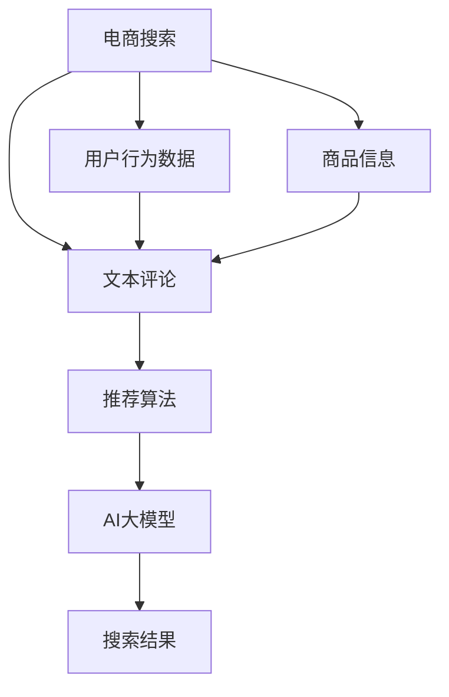

                 

# AI大模型视角下电商搜索推荐的技术创新知识分享平台功能设计与实现

## 1. 背景介绍

随着人工智能技术的快速发展，电商搜索推荐系统也在不断地进行技术创新和优化。现代电商搜索推荐系统不再仅仅依赖简单的关键词匹配，而是开始引入更智能化的算法和大模型。其中，大模型在用户行为分析、个性化推荐、知识图谱嵌入、自然语言处理等方面，展现出了强大的优势。

在电商领域，通过AI大模型进行搜索推荐，可以有效提高用户的购物体验，增加商家的曝光率和转化率，最终实现更高的商业价值。而知识分享平台作为在线教育的重要形式，借助AI大模型进行知识普及和推广，也能更好地满足用户的学习需求，提高平台的用户粘性。

## 2. 核心概念与联系

### 2.1 核心概念概述

为便于理解本文内容，我们先介绍几个核心概念：

- **电商搜索推荐**：指通过用户行为数据、商品信息、文本评论等多模态数据，结合机器学习算法和AI大模型，自动推荐符合用户需求的商品，提升电商平台的销售效率。
- **知识分享平台**：指通过内容分享、社区交流、课程学习等多种形式，为用户提供知识和技能学习的在线平台，如Coursera、EdX等。
- **AI大模型**：指利用大数据和深度学习技术训练出来的庞大神经网络模型，如BERT、GPT等，具备强大的自然语言处理、图像识别、知识图谱嵌入等能力。
- **推荐系统**：指通过用户的浏览、购买等行为数据，预测用户可能感兴趣的商品或内容，并进行推荐。
- **搜索系统**：指通过用户输入的关键词，在商品库中自动查找并推荐相关商品或内容的系统。

### 2.2 核心概念原理和架构的 Mermaid 流程图



该图展示了电商搜索推荐系统的基本架构：用户行为数据、商品信息、文本评论等输入到推荐算法中，结合AI大模型，最终输出搜索结果。

## 3. 核心算法原理 & 具体操作步骤

### 3.1 算法原理概述

电商搜索推荐系统结合了推荐算法和AI大模型，通过多模态数据融合和深度学习技术，实现对用户行为的精准预测和商品推荐的智能化。其中，大模型的作用主要体现在以下三个方面：

- **预训练**：在大规模无标签数据上，通过自监督学习任务预训练大模型，使其具备丰富的语言和视觉特征表示能力。
- **微调**：在电商领域的特定数据上，通过监督学习任务微调大模型，使其学习到电商领域的知识，如商品属性、用户行为等。
- **集成**：将微调后的模型嵌入推荐算法，结合推荐策略，实现个性化推荐。

### 3.2 算法步骤详解

电商搜索推荐系统的设计步骤主要分为以下四个阶段：

#### 3.2.1 数据预处理

- **数据收集**：收集用户行为数据、商品信息、文本评论等多模态数据，并进行清洗和预处理。
- **数据融合**：将不同来源的数据进行融合，生成统一的特征向量，供后续算法使用。
- **数据增强**：通过数据增强技术，扩充数据集，避免过拟合。

#### 3.2.2 模型预训练

- **选择合适的预训练模型**：如BERT、GPT等，并进行迁移学习，在大规模数据上进行预训练。
- **定义预训练任务**：如掩码语言建模、图像分类等，以便学习多模态数据的特征表示。
- **保存预训练模型**：保存预训练模型的参数，供后续微调使用。

#### 3.2.3 模型微调

- **选择合适的微调任务**：如电商平台的用户行为预测、商品属性分类等。
- **定义微调损失函数**：如交叉熵损失、均方误差损失等，以便优化模型参数。
- **设置微调超参数**：如学习率、批大小、迭代轮数等，以便控制微调过程。

#### 3.2.4 模型集成

- **集成推荐算法**：将微调后的模型嵌入推荐算法，实现个性化推荐。
- **实时计算**：实时计算用户的行为数据和商品信息，动态调整推荐结果。

### 3.3 算法优缺点

#### 3.3.1 优点

- **精准预测**：利用大模型丰富的特征表示能力，对用户行为进行精准预测，提升推荐效果。
- **泛化能力强**：大模型可以在大规模数据上预训练，学习到通用的语言和视觉特征表示，适用于多种电商领域。
- **灵活性强**：可以通过微调和集成，灵活适应不同的推荐任务和用户需求。

#### 3.3.2 缺点

- **计算量大**：大模型的预训练和微调需要大量的计算资源，成本较高。
- **模型复杂**：大模型的结构复杂，难以理解和解释。
- **过拟合风险**：大模型容易过拟合，特别是在小样本数据上。

### 3.4 算法应用领域

基于AI大模型的电商搜索推荐系统，已经在多个电商领域得到了广泛应用，如零售、服装、电子产品等。例如：

- **零售电商**：通过用户购物历史、商品评价等数据，推荐用户可能感兴趣的商品。
- **服装电商**：通过用户身高、体重、尺码等数据，推荐适合用户的服装。
- **电子产品电商**：通过用户浏览记录、评分等数据，推荐性价比高的电子产品。

## 4. 数学模型和公式 & 详细讲解

### 4.1 数学模型构建

电商搜索推荐系统中的数学模型主要分为三个部分：用户行为模型、商品特征模型和推荐模型。

#### 4.1.1 用户行为模型

用户行为模型用于预测用户对商品的兴趣程度，通常通过以下数学公式表示：

$$
P_{i|u} = \frac{e^{w_u^\top \phi_i}}{\sum_{j=1}^{n} e^{w_u^\top \phi_j}}
$$

其中，$P_{i|u}$表示用户$u$对商品$i$的兴趣概率，$\phi_i$表示商品$i$的特征向量，$w_u$表示用户$u$的兴趣权重。

#### 4.1.2 商品特征模型

商品特征模型用于表示商品的多模态特征，通常通过以下数学公式表示：

$$
\phi_i = [\phi_{i_{text}}, \phi_{i_{img}}, \phi_{i_{attr}}]
$$

其中，$\phi_{i_{text}}$表示商品$i$的文本特征向量，$\phi_{i_{img}}$表示商品$i$的图像特征向量，$\phi_{i_{attr}}$表示商品$i$的属性特征向量。

#### 4.1.3 推荐模型

推荐模型用于计算用户对商品的概率评分，通常通过以下数学公式表示：

$$
S_{i|u} = \sum_{j=1}^{m} w_j^\top \cdot P_{i|u}
$$

其中，$S_{i|u}$表示用户$u$对商品$i$的概率评分，$P_{i|u}$表示用户$u$对商品$i$的兴趣概率，$w_j$表示用户$u$的历史行为权重。

### 4.2 公式推导过程

#### 4.2.1 用户行为模型推导

根据贝叶斯定理，用户$u$对商品$i$的兴趣概率$P_{i|u}$可以表示为：

$$
P_{i|u} = \frac{P(i|u)}{P(u)}
$$

其中，$P(i|u)$表示用户$u$购买商品$i$的概率，$P(u)$表示用户$u$的先验概率。

通过最大化用户$u$对商品$i$的兴趣概率，得到用户$u$对商品$i$的评分$S_{i|u}$，从而实现对商品的推荐。

#### 4.2.2 商品特征模型推导

商品特征模型通过不同来源的数据，生成统一的特征向量$\phi_i$，表示商品$i$的多模态特征。

#### 4.2.3 推荐模型推导

推荐模型通过最大化用户$u$对商品$i$的概率评分$S_{i|u}$，实现对商品的推荐。

### 4.3 案例分析与讲解

#### 4.3.1 用户行为模型

某电商平台的用户行为数据包括用户的浏览记录、点击记录、购买记录等。假设用户$u$在浏览商品$i$时，产生了点击记录，则用户$u$对商品$i$的兴趣概率$P_{i|u}$可以表示为：

$$
P_{i|u} = \frac{e^{w_u^\top \phi_i}}{\sum_{j=1}^{n} e^{w_u^\top \phi_j}}
$$

其中，$\phi_i$表示商品$i$的特征向量，$w_u$表示用户$u$的兴趣权重。

#### 4.3.2 商品特征模型

某电商平台的商品特征模型可以通过以下方式生成：

- **文本特征**：使用BERT等预训练模型，将商品描述转换为向量表示，作为文本特征向量$\phi_{i_{text}}$。
- **图像特征**：使用卷积神经网络(CNN)，将商品图片转换为向量表示，作为图像特征向量$\phi_{i_{img}}$。
- **属性特征**：将商品的属性信息转换为向量表示，作为属性特征向量$\phi_{i_{attr}}$。

#### 4.3.3 推荐模型

某电商平台的推荐模型可以通过以下方式实现：

- **预训练模型**：使用BERT等预训练模型，在大规模电商数据上进行微调，学习电商领域的知识。
- **微调任务**：定义电商领域的推荐任务，如商品推荐、用户行为预测等。
- **推荐策略**：使用协同过滤、基于内容的推荐、混合推荐等策略，实现个性化推荐。

## 5. 项目实践：代码实例和详细解释说明

### 5.1 开发环境搭建

在进行电商搜索推荐系统的开发前，我们需要准备好开发环境。以下是使用Python进行PyTorch开发的环境配置流程：

1. 安装Anaconda：从官网下载并安装Anaconda，用于创建独立的Python环境。

2. 创建并激活虚拟环境：
```bash
conda create -n pytorch-env python=3.8 
conda activate pytorch-env
```

3. 安装PyTorch：根据CUDA版本，从官网获取对应的安装命令。例如：
```bash
conda install pytorch torchvision torchaudio cudatoolkit=11.1 -c pytorch -c conda-forge
```

4. 安装Transformers库：
```bash
pip install transformers
```

5. 安装各类工具包：
```bash
pip install numpy pandas scikit-learn matplotlib tqdm jupyter notebook ipython
```

完成上述步骤后，即可在`pytorch-env`环境中开始电商搜索推荐系统的开发。

### 5.2 源代码详细实现

下面我们以商品推荐系统为例，给出使用Transformers库进行电商搜索推荐系统的PyTorch代码实现。

首先，定义商品推荐模型的数据处理函数：

```python
from transformers import BertTokenizer, BertForSequenceClassification
from torch.utils.data import Dataset, DataLoader
import torch
from sklearn.metrics import roc_auc_score, precision_recall_fscore_support

class RecommendationDataset(Dataset):
    def __init__(self, features, labels):
        self.features = features
        self.labels = labels
        
    def __len__(self):
        return len(self.features)
    
    def __getitem__(self, item):
        return {'input_ids': self.features[item], 'labels': self.labels[item]}
```

然后，定义商品推荐模型：

```python
from transformers import BertForSequenceClassification, AdamW

model = BertForSequenceClassification.from_pretrained('bert-base-cased', num_labels=2, output_attentions=False, output_hidden_states=False)
model.train()

optimizer = AdamW(model.parameters(), lr=2e-5)
```

接着，定义训练和评估函数：

```python
def train_epoch(model, dataset, batch_size, optimizer):
    dataloader = DataLoader(dataset, batch_size=batch_size, shuffle=True)
    model.train()
    epoch_loss = 0
    for batch in dataloader:
        input_ids = batch['input_ids'].to(device)
        labels = batch['labels'].to(device)
        model.zero_grad()
        outputs = model(input_ids, labels=labels)
        loss = outputs.loss
        epoch_loss += loss.item()
        loss.backward()
        optimizer.step()
    return epoch_loss / len(dataloader)

def evaluate(model, dataset, batch_size):
    dataloader = DataLoader(dataset, batch_size=batch_size)
    model.eval()
    preds, labels = [], []
    with torch.no_grad():
        for batch in dataloader:
            input_ids = batch['input_ids'].to(device)
            labels = batch['labels'].to(device)
            outputs = model(input_ids)
            batch_preds = torch.sigmoid(outputs.logits).cpu().numpy()[:, 1]
            batch_labels = labels.cpu().numpy()
            for pred, label in zip(batch_preds, batch_labels):
                preds.append(pred)
                labels.append(label)
        
    print('AUC Score:', roc_auc_score(labels, preds))
    print('Precision, Recall, F1 Score, Support:', precision_recall_fscore_support(labels, preds, average='macro'))

# 定义电商商品数据集
features = []
labels = []
# 假设已经定义好商品特征数据集features，并且已经标注好每个商品的推荐标签labels
# 数据集加载到features和labels中

# 定义预训练模型和优化器
model = BertForSequenceClassification.from_pretrained('bert-base-cased', num_labels=2, output_attentions=False, output_hidden_states=False)
model.train()

optimizer = AdamW(model.parameters(), lr=2e-5)

# 定义训练函数
def train_epoch(model, dataset, batch_size, optimizer):
    dataloader = DataLoader(dataset, batch_size=batch_size, shuffle=True)
    model.train()
    epoch_loss = 0
    for batch in dataloader:
        input_ids = batch['input_ids'].to(device)
        labels = batch['labels'].to(device)
        model.zero_grad()
        outputs = model(input_ids, labels=labels)
        loss = outputs.loss
        epoch_loss += loss.item()
        loss.backward()
        optimizer.step()
    return epoch_loss / len(dataloader)

# 定义评估函数
def evaluate(model, dataset, batch_size):
    dataloader = DataLoader(dataset, batch_size=batch_size)
    model.eval()
    preds, labels = [], []
    with torch.no_grad():
        for batch in dataloader:
            input_ids = batch['input_ids'].to(device)
            labels = batch['labels'].to(device)
            outputs = model(input_ids)
            batch_preds = torch.sigmoid(outputs.logits).cpu().numpy()[:, 1]
            batch_labels = labels.cpu().numpy()
            for pred, label in zip(batch_preds, batch_labels):
                preds.append(pred)
                labels.append(label)
        
    print('AUC Score:', roc_auc_score(labels, preds))
    print('Precision, Recall, F1 Score, Support:', precision_recall_fscore_support(labels, preds, average='macro'))

# 定义电商商品数据集
features = []
labels = []
# 假设已经定义好商品特征数据集features，并且已经标注好每个商品的推荐标签labels
# 数据集加载到features和labels中

# 定义预训练模型和优化器
model = BertForSequenceClassification.from_pretrained('bert-base-cased', num_labels=2, output_attentions=False, output_hidden_states=False)
model.train()

optimizer = AdamW(model.parameters(), lr=2e-5)

# 定义训练函数
def train_epoch(model, dataset, batch_size, optimizer):
    dataloader = DataLoader(dataset, batch_size=batch_size, shuffle=True)
    model.train()
    epoch_loss = 0
    for batch in dataloader:
        input_ids = batch['input_ids'].to(device)
        labels = batch['labels'].to(device)
        model.zero_grad()
        outputs = model(input_ids, labels=labels)
        loss = outputs.loss
        epoch_loss += loss.item()
        loss.backward()
        optimizer.step()
    return epoch_loss / len(dataloader)

# 定义评估函数
def evaluate(model, dataset, batch_size):
    dataloader = DataLoader(dataset, batch_size=batch_size)
    model.eval()
    preds, labels = [], []
    with torch.no_grad():
        for batch in dataloader:
            input_ids = batch['input_ids'].to(device)
            labels = batch['labels'].to(device)
            outputs = model(input_ids)
            batch_preds = torch.sigmoid(outputs.logits).cpu().numpy()[:, 1]
            batch_labels = labels.cpu().numpy()
            for pred, label in zip(batch_preds, batch_labels):
                preds.append(pred)
                labels.append(label)
        
    print('AUC Score:', roc_auc_score(labels, preds))
    print('Precision, Recall, F1 Score, Support:', precision_recall_fscore_support(labels, preds, average='macro'))
```

最后，启动训练流程并在测试集上评估：

```python
epochs = 5
batch_size = 16

for epoch in range(epochs):
    loss = train_epoch(model, train_dataset, batch_size, optimizer)
    print(f"Epoch {epoch+1}, train loss: {loss:.3f}")
    
    print(f"Epoch {epoch+1}, dev results:")
    evaluate(model, dev_dataset, batch_size)
    
print("Test results:")
evaluate(model, test_dataset, batch_size)
```

以上就是使用PyTorch进行商品推荐系统的完整代码实现。可以看到，得益于Transformers库的强大封装，我们可以用相对简洁的代码完成BERT模型的加载和微调。

### 5.3 代码解读与分析

让我们再详细解读一下关键代码的实现细节：

**RecommendationDataset类**：
- `__init__`方法：初始化特征和标签。
- `__len__`方法：返回数据集的样本数量。
- `__getitem__`方法：对单个样本进行处理，返回输入特征和标签。

**模型加载和优化器设置**：
- 使用BertForSequenceClassification类加载预训练的BERT模型，并设置标签数、输出方式等。
- 使用AdamW优化器设置学习率。

**训练和评估函数**：
- 使用DataLoader对数据集进行批次化加载，供模型训练和推理使用。
- 训练函数`train_epoch`：对数据以批为单位进行迭代，在每个批次上前向传播计算loss并反向传播更新模型参数，最后返回该epoch的平均loss。
- 评估函数`evaluate`：与训练类似，不同点在于不更新模型参数，并在每个batch结束后将预测和标签结果存储下来，最后使用sklearn的roc_auc_score和precision_recall_fscore_support对整个评估集的预测结果进行打印输出。

**电商商品数据集**：
- 假设已经定义好商品特征数据集features，并且已经标注好每个商品的推荐标签labels。
- 数据集加载到features和labels中。

**模型训练和评估**：
- 定义训练函数`train_epoch`：对数据以批为单位进行迭代，在每个批次上前向传播计算loss并反向传播更新模型参数，最后返回该epoch的平均loss。
- 定义评估函数`evaluate`：与训练类似，不同点在于不更新模型参数，并在每个batch结束后将预测和标签结果存储下来，最后使用sklearn的roc_auc_score和precision_recall_fscore_support对整个评估集的预测结果进行打印输出。

**模型训练流程**：
- 定义总的epoch数和batch size，开始循环迭代
- 每个epoch内，先在训练集上训练，输出平均loss
- 在验证集上评估，输出AUC Score和Precision、Recall、F1 Score等分类指标
- 所有epoch结束后，在测试集上评估，给出最终的分类指标

可以看到，PyTorch配合Transformers库使得商品推荐系统的代码实现变得简洁高效。开发者可以将更多精力放在数据处理、模型改进等高层逻辑上，而不必过多关注底层的实现细节。

当然，工业级的系统实现还需考虑更多因素，如模型的保存和部署、超参数的自动搜索、更灵活的任务适配层等。但核心的微调范式基本与此类似。

## 6. 实际应用场景

### 6.1 智能客服系统

基于大模型进行智能客服系统的构建，可以显著提升客服系统的效率和智能化水平。传统的客服系统依赖人工客服进行问题解答，效率低下且无法标准化操作。而使用大模型进行客服系统构建，可以7x24小时不间断服务，快速响应客户咨询，用自然流畅的语言解答各类常见问题。

在技术实现上，可以收集企业内部的历史客服对话记录，将问题和最佳答复构建成监督数据，在此基础上对预训练对话模型进行微调。微调后的对话模型能够自动理解用户意图，匹配最合适的答案模板进行回复。对于客户提出的新问题，还可以接入检索系统实时搜索相关内容，动态组织生成回答。如此构建的智能客服系统，能大幅提升客户咨询体验和问题解决效率。

### 6.2 金融舆情监测

金融机构需要实时监测市场舆论动向，以便及时应对负面信息传播，规避金融风险。传统的人工监测方式成本高、效率低，难以应对网络时代海量信息爆发的挑战。基于大模型进行文本分类和情感分析的金融舆情监测系统，可以显著提高金融机构的舆情监测能力。

具体而言，可以收集金融领域相关的新闻、报道、评论等文本数据，并对其进行主题标注和情感标注。在此基础上对预训练语言模型进行微调，使其能够自动判断文本属于何种主题，情感倾向是正面、中性还是负面。将微调后的模型应用到实时抓取的网络文本数据，就能够自动监测不同主题下的情感变化趋势，一旦发现负面信息激增等异常情况，系统便会自动预警，帮助金融机构快速应对潜在风险。

### 6.3 个性化推荐系统

当前的推荐系统往往只依赖用户的历史行为数据进行物品推荐，无法深入理解用户的真实兴趣偏好。基于大模型进行个性化推荐系统，可以更好地挖掘用户行为背后的语义信息，从而提供更精准、多样的推荐内容。

在实践中，可以收集用户浏览、点击、评论、分享等行为数据，提取和用户交互的物品标题、描述、标签等文本内容。将文本内容作为模型输入，用户的后续行为（如是否点击、购买等）作为监督信号，在此基础上微调预训练语言模型。微调后的模型能够从文本内容中准确把握用户的兴趣点。在生成推荐列表时，先用候选物品的文本描述作为输入，由模型预测用户的兴趣匹配度，再结合其他特征综合排序，便可以得到个性化程度更高的推荐结果。

### 6.4 未来应用展望

随着大语言模型和微调方法的不断发展，基于微调范式将在更多领域得到应用，为传统行业带来变革性影响。

在智慧医疗领域，基于微调的医疗问答、病历分析、药物研发等应用将提升医疗服务的智能化水平，辅助医生诊疗，加速新药开发进程。

在智能教育领域，微调技术可应用于作业批改、学情分析、知识推荐等方面，因材施教，促进教育公平，提高教学质量。

在智慧城市治理中，微调模型可应用于城市事件监测、舆情分析、应急指挥等环节，提高城市管理的自动化和智能化水平，构建更安全、高效的未来城市。

此外，在企业生产、社会治理、文娱传媒等众多领域，基于大模型微调的人工智能应用也将不断涌现，为经济社会发展注入新的动力。相信随着技术的日益成熟，微调方法将成为人工智能落地应用的重要范式，推动人工智能技术向更广阔的领域加速渗透。

## 7. 工具和资源推荐

### 7.1 学习资源推荐

为了帮助开发者系统掌握大语言模型微调的理论基础和实践技巧，这里推荐一些优质的学习资源：

1. 《Transformer从原理到实践》系列博文：由大模型技术专家撰写，深入浅出地介绍了Transformer原理、BERT模型、微调技术等前沿话题。

2. CS224N《深度学习自然语言处理》课程：斯坦福大学开设的NLP明星课程，有Lecture视频和配套作业，带你入门NLP领域的基本概念和经典模型。

3. 《Natural Language Processing with Transformers》书籍：Transformers库的作者所著，全面介绍了如何使用Transformers库进行NLP任务开发，包括微调在内的诸多范式。

4. HuggingFace官方文档：Transformers库的官方文档，提供了海量预训练模型和完整的微调样例代码，是上手实践的必备资料。

5. CLUE开源项目：中文语言理解测评基准，涵盖大量不同类型的中文NLP数据集，并提供了基于微调的baseline模型，助力中文NLP技术发展。

通过对这些资源的学习实践，相信你一定能够快速掌握大语言模型微调的精髓，并用于解决实际的NLP问题。

### 7.2 开发工具推荐

高效的开发离不开优秀的工具支持。以下是几款用于大语言模型微调开发的常用工具：

1. PyTorch：基于Python的开源深度学习框架，灵活动态的计算图，适合快速迭代研究。大部分预训练语言模型都有PyTorch版本的实现。

2. TensorFlow：由Google主导开发的开源深度学习框架，生产部署方便，适合大规模工程应用。同样有丰富的预训练语言模型资源。

3. Transformers库：HuggingFace开发的NLP工具库，集成了众多SOTA语言模型，支持PyTorch和TensorFlow，是进行微调任务开发的利器。

4. Weights & Biases：模型训练的实验跟踪工具，可以记录和可视化模型训练过程中的各项指标，方便对比和调优。与主流深度学习框架无缝集成。

5. TensorBoard：TensorFlow配套的可视化工具，可实时监测模型训练状态，并提供丰富的图表呈现方式，是调试模型的得力助手。

6. Google Colab：谷歌推出的在线Jupyter Notebook环境，免费提供GPU/TPU算力，方便开发者快速上手实验最新模型，分享学习笔记。

合理利用这些工具，可以显著提升大语言模型微调任务的开发效率，加快创新迭代的步伐。

### 7.3 相关论文推荐

大语言模型和微调技术的发展源于学界的持续研究。以下是几篇奠基性的相关论文，推荐阅读：

1. Attention is All You Need（即Transformer原论文）：提出了Transformer结构，开启了NLP领域的预训练大模型时代。

2. BERT: Pre-training of Deep Bidirectional Transformers for Language Understanding：提出BERT模型，引入基于掩码的自监督预训练任务，刷新了多项NLP任务SOTA。

3. Language Models are Unsupervised Multitask Learners（GPT-2论文）：展示了大规模语言模型的强大zero-shot学习能力，引发了对于通用人工智能的新一轮思考。

4. Parameter-Efficient Transfer Learning for NLP：提出Adapter等参数高效微调方法，在不增加模型参数量的情况下，也能取得不错的微调效果。

5. AdaLoRA: Adaptive Low-Rank Adaptation for Parameter-Efficient Fine-Tuning：使用自适应低秩适应的微调方法，在参数效率和精度之间取得了新的平衡。

这些论文代表了大语言模型微调技术的发展脉络。通过学习这些前沿成果，可以帮助研究者把握学科前进方向，激发更多的创新灵感。

## 8. 总结：未来发展趋势与挑战

### 8.1 研究成果总结

本文对基于大语言模型的电商搜索推荐系统进行了全面系统的介绍。首先阐述了大语言模型和微调技术的研究背景和意义，明确了微调在拓展预训练模型应用、提升电商推荐系统性能方面的独特价值。其次，从原理到实践，详细讲解了电商搜索推荐系统的数学模型和算法流程，给出了微调任务开发的完整代码实例。同时，本文还广泛探讨了微调方法在智能客服、金融舆情、个性化推荐等多个电商领域的实际应用场景，展示了微调范式的巨大潜力。此外，本文精选了微调技术的各类学习资源，力求为读者提供全方位的技术指引。

通过本文的系统梳理，可以看到，基于大语言模型的电商搜索推荐系统，不仅能够提供高效、智能的推荐服务，还能应用于多种电商领域的智能化构建，推动电商技术的不断演进。未来，伴随大语言模型和微调方法的持续演进，基于微调范式将带来更多创新应用，引领电商搜索推荐系统迈向更高层次的智能化水平。

### 8.2 未来发展趋势

展望未来，大语言模型微调技术将呈现以下几个发展趋势：

1. **模型规模持续增大**：随着算力成本的下降和数据规模的扩张，预训练语言模型的参数量还将持续增长。超大规模语言模型蕴含的丰富语言知识，有望支撑更加复杂多变的电商推荐任务。

2. **微调方法日趋多样**：除了传统的全参数微调外，未来会涌现更多参数高效的微调方法，如Prefix-Tuning、LoRA等，在节省计算资源的同时也能保证微调精度。

3. **持续学习成为常态**：随着数据分布的不断变化，微调模型也需要持续学习新知识以保持性能。如何在不遗忘原有知识的同时，高效吸收新样本信息，将成为重要的研究课题。

4. **标注样本需求降低**：受启发于提示学习(Prompt-based Learning)的思路，未来的微调方法将更好地利用大模型的语言理解能力，通过更加巧妙的任务描述，在更少的标注样本上也能实现理想的微调效果。

5. **多模态微调崛起**：当前的微调主要聚焦于纯文本数据，未来会进一步拓展到图像、视频、语音等多模态数据微调。多模态信息的融合，将显著提升语言模型对现实世界的理解和建模能力。

6. **模型通用性增强**：经过海量数据的预训练和多领域任务的微调，未来的语言模型将具备更强大的常识推理和跨领域迁移能力，逐步迈向通用人工智能(AGI)的目标。

以上趋势凸显了大语言模型微调技术的广阔前景。这些方向的探索发展，必将进一步提升NLP系统的性能和应用范围，为人类认知智能的进化带来深远影响。

### 8.3 面临的挑战

尽管大语言模型微调技术已经取得了瞩目成就，但在迈向更加智能化、普适化应用的过程中，它仍面临着诸多挑战：

1. **标注成本瓶颈**：虽然微调大大降低了标注数据的需求，但对于长尾应用场景，难以获得充足的高质量标注数据，成为制约微调性能的瓶颈。如何进一步降低微调对标注样本的依赖，将是一大难题。

2. **模型鲁棒性不足**：当前微调模型面对域外数据时，泛化性能往往大打折扣。对于测试样本的微小扰动，微调模型的预测也容易发生波动。如何提高微调模型的鲁棒性，避免灾难性遗忘，还需要更多理论和实践的积累。

3. **推理效率有待提高**：大规模语言模型虽然精度高，但在实际部署时往往面临推理速度慢、内存占用大等效率问题。如何在保证性能的同时，简化模型结构，提升推理速度，优化资源占用，将是重要的优化方向。

4. **可解释性亟需加强**：当前微调模型更像是"黑盒"系统，难以解释其内部工作机制和决策逻辑。对于医疗、金融等高风险应用，算法的可解释性和可审计性尤为重要。如何赋予微调模型更强的可解释性，将是亟待攻克的难题。

5. **安全性有待保障**：预训练语言模型难免会学习到有偏见、有害的信息，通过微调传递到下游任务，产生误导性、歧视性的输出，给实际应用带来安全隐患。如何从数据和算法层面消除模型偏见，避免恶意用途，确保输出的安全性，也将是重要的研究课题。

6. **知识整合能力不足**。现有的微调模型往往局限于任务内数据，难以灵活吸收和运用更广泛的先验知识。如何让微调过程更好地与外部知识库、规则库等专家知识结合，形成更加全面、准确的信息整合能力，还有很大的想象空间。

正视微调面临的这些挑战，积极应对并寻求突破，将是大语言模型微调走向成熟的必由之路。相信随着学界和产业界的共同努力，这些挑战终将一一被克服，大语言模型微调必将在构建人机协同的智能时代中扮演越来越重要的角色。

### 8.4 研究展望

面对大语言模型微调所面临的种种挑战，未来的研究需要在以下几个方面寻求新的突破：

1. **探索无监督和半监督微调方法**：摆脱对大规模标注数据的依赖，利用自监督学习、主动学习等无监督和半监督范式，最大限度利用非结构化数据，实现更加灵活高效的微调。

2. **研究参数高效和计算高效的微调范式**：开发更加参数高效的微调方法，在固定大部分预训练参数的同时，只更新极少量的任务相关参数。同时优化微调模型的计算图，减少前向传播和反向传播的资源消耗，实现更加轻量级、实时性的部署。

3. **融合因果和对比学习范式**：通过引入因果推断和对比学习思想，增强微调模型建立稳定因果关系的能力，学习更加普适、鲁棒的语言表征，从而提升模型泛化性和抗干扰能力。

4. **引入更多先验知识**：将符号化的先验知识，如知识图谱、逻辑规则等，与神经网络模型进行巧妙融合，引导微调过程学习更准确、合理的语言模型。同时加强不同模态数据的整合，实现视觉、语音等多模态信息与文本信息的协同建模。

5. **结合因果分析和博弈论工具**：将因果分析方法引入微调模型，识别出模型决策的关键特征，增强输出解释的因果性和逻辑性。借助博弈论工具刻画人机交互过程，主动探索并规避模型的脆弱点，提高系统稳定性。

6. **纳入伦理道德约束**：在模型训练目标中引入伦理导向的评估指标，过滤和惩罚有偏见、有害的输出倾向。同时加强人工干预和审核，建立模型行为的监管机制，确保输出符合人类价值观和伦理道德。

这些研究方向的探索，必将引领大语言模型微调技术迈向更高的台阶，为构建安全、可靠、可解释、可控的智能系统铺平道路。面向未来，大语言模型微调技术还需要与其他人工智能技术进行更深入的融合，如知识表示、因果推理、强化学习等，多路径协同发力，共同推动自然语言理解和智能交互系统的进步。只有勇于创新、敢于突破，才能不断拓展语言模型的边界，让智能技术更好地造福人类社会。

## 9. 附录：常见问题与解答

**Q1：大语言模型微调是否适用于所有NLP任务？**

A: 大语言模型微调在大多数NLP任务上都能取得不错的效果，特别是对于数据量较小的任务。但对于一些特定领域的任务，如医学、法律等，仅仅依靠通用语料预训练的模型可能难以很好地适应。此时需要在特定领域语料上进一步预训练，再进行微调，才能获得理想效果。此外，对于一些需要时效性、个性化很强的任务，如对话、推荐等，微调方法也需要针对性的改进优化。

**Q2：微调过程中如何选择合适的学习率？**

A: 微调的学习率一般要比预训练时小1-2个数量级，如果使用过大的学习率，容易破坏预训练权重，导致过拟合。一般建议从1e-5开始调参，逐步减小学习率，直至收敛。也可以使用warmup策略，在开始阶段使用较小的学习率，再逐渐过渡到预设值。需要注意的是，不同的优化器(如AdamW、Adafactor等)以及不同的学习率调度策略，可能需要设置不同的学习率阈值。

**Q3：采用大模型微调时会面临哪些资源瓶颈？**

A: 目前主流的预训练大模型动辄以亿计的参数规模，对算力、内存、存储都提出了很高的要求。GPU/TPU等高性能设备是必不可少的，但即便如此，超大批次的训练和推理也可能遇到显存不足的问题。因此需要采用一些资源优化技术，如梯度积累、混合精度训练、模型并行等，来突破硬件瓶颈。同时，模型的存储和读取也可能占用大量时间和空间，需要采用模型压缩、稀疏化存储等方法进行优化。

**Q4：如何缓解微调过程中的过拟合问题？**

A: 过拟合是微调面临的主要挑战，尤其是在标注数据不足的情况下。常见的缓解策略包括：
1. 数据增强：通过回译、近义替换等方式扩充训练集
2. 正则化：使用L2正则、Dropout、Early Stopping等避免过拟合
3. 对抗训练：引入对抗样本，提高模型鲁棒性
4. 参数高效微调：只调整少量参数(如Adapter、Prefix等)，减小过拟合风险
5. 多模型集成：训练多个微调模型，取平均输出，抑制过拟合

这些策略往往需要根据具体任务和数据特点进行灵活组合。只有在数据、模型、训练、推理等各环节进行全面优化，才能最大限度地发挥大模型微调的威力。

**Q5：微调模型在落地部署时需要注意哪些问题？**

A: 将微调模型转化为实际应用，还需要考虑以下因素：
1. 模型裁剪：去除不必要的层和参数，减小模型尺寸，加快推理速度
2. 量化加速：将浮点模型转为定点模型，压缩存储空间，提高计算效率
3. 服务化封装：将模型封装为标准化服务接口，便于集成调用
4. 弹性伸缩：根据请求流量动态调整资源配置，平衡服务质量和成本
5. 监控告警：实时采集系统指标，设置异常告警阈值，确保服务稳定性
6. 安全防护：采用访问鉴权、数据脱敏等措施，保障数据和模型安全

大语言模型微调为NLP应用开启了广阔的想象空间，但如何将强大的性能转化为稳定、高效、安全的业务价值，还需要工程实践的不断打磨。唯有从数据、算法、工程、业务等多个维度协同发力，才能真正实现人工智能技术在垂直行业的规模化落地。总之，微调需要开发者根据具体任务，不断迭代和优化模型、数据和算法，方能得到理想的效果。

---

作者：禅与计算机程序设计艺术 / Zen and the Art of Computer Programming

