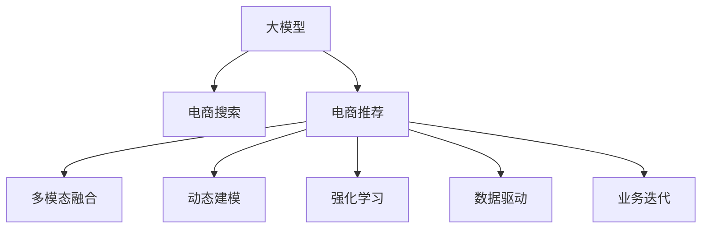

                 

# AI大模型视角下电商搜索推荐的技术创新路径

> 关键词：电商搜索推荐、大模型、多模态融合、动态建模、强化学习、数据驱动、业务迭代

## 1. 背景介绍

随着互联网的普及和电子商务的快速发展，电商搜索推荐系统已成为提升用户体验、增加转化率的关键技术。传统的基于规则和关键词匹配的搜索推荐方式，已无法适应日益丰富的商品和服务，需要借助人工智能技术的力量，构建更智能、更个性化的搜索推荐系统。近年来，基于大模型的搜索推荐技术取得了显著进展，显著提升了电商平台的运营效率和用户满意度。本文将从AI大模型的视角，探索电商搜索推荐系统的主要技术创新路径，为电商平台提供建设思路和技术参考。

## 2. 核心概念与联系

### 2.1 核心概念概述

为更好地理解电商搜索推荐系统，本节将介绍几个关键概念：

- **大模型**：以自回归（如GPT）或自编码（如BERT）为代表的深度学习模型，在大规模无标签数据上进行预训练，学习通用的语言和视觉表示。

- **电商搜索推荐**：针对用户的查询意图，从海量商品中推荐最相关的商品，满足用户的购物需求。

- **多模态融合**：将文本、图像、音频等多模态数据进行融合，提升对用户意图和商品特征的全面理解。

- **动态建模**：根据用户行为、商品销量等实时数据，动态调整模型参数，提升推荐的实时性和准确性。

- **强化学习**：通过用户点击、购买等行为反馈，不断优化推荐模型，实现用户满意度的最大化。

- **数据驱动**：基于大量用户行为数据和商品信息，构建个性化推荐模型，提高推荐的精准度和覆盖面。

- **业务迭代**：通过不断的A/B测试和反馈迭代，优化推荐算法和策略，持续提升推荐效果。

这些概念共同构成了电商搜索推荐系统的技术框架，使其能够在大模型基础上，实现个性化、实时化、动态化的推荐服务。

### 2.2 核心概念原理和架构的 Mermaid 流程图(Mermaid 流程节点中不要有括号、逗号等特殊字符)



这个流程图展示了大模型在电商搜索推荐中的应用逻辑：

1. 大模型通过预训练获得广泛的知识，成为通用表示的学习器。
2. 电商搜索推荐系统利用大模型提取查询和商品的语义特征。
3. 通过多模态融合、动态建模和强化学习，系统能够对用户行为进行实时分析和推荐。
4. 在数据驱动和业务迭代的闭环中，模型不断优化，提升推荐效果。

## 3. 核心算法原理 & 具体操作步骤

### 3.1 算法原理概述

电商搜索推荐系统的主要目标是通过分析用户查询和商品数据，推荐最相关的商品，满足用户的购物需求。基于大模型的推荐系统通过以下步骤实现这一目标：

1. **数据预处理**：对用户查询、商品描述、评分等数据进行清洗、分词、向量化等预处理。
2. **特征提取**：使用大模型对查询和商品数据进行语义特征提取。
3. **模型训练**：通过监督学习或半监督学习的方式，训练推荐模型。
4. **推荐生成**：根据用户查询和商品特征，生成推荐结果。
5. **效果评估**：通过A/B测试等方法，评估推荐系统的效果，进行模型迭代优化。

### 3.2 算法步骤详解

**步骤1：数据预处理**

电商搜索推荐系统需要对用户查询和商品数据进行预处理，主要包括：

- **数据清洗**：去除噪声数据，如拼写错误、特殊符号等。
- **分词**：将文本数据分词，转换为模型可处理的向量形式。
- **向量化**：将分词后的文本数据转换为数值向量，如TF-IDF、Word2Vec等。

以用户查询数据为例，分词后的查询字符串可以表示为：

$$
x = [w_1, w_2, \ldots, w_n]
$$

其中 $w_i$ 表示查询中的第 $i$ 个词语。

**步骤2：特征提取**

电商搜索推荐系统需要使用大模型提取用户查询和商品数据的语义特征。常用的特征提取方法包括：

- **预训练模型**：使用BERT、GPT等大模型对查询和商品数据进行预训练，学习语义表示。
- **向量拼接**：将查询和商品数据特征向量拼接，形成综合特征向量。
- **注意力机制**：使用注意力机制对不同特征进行加权，提升特征融合效果。

以商品数据为例，假设使用BERT模型提取商品描述的语义向量为：

$$
h = \text{BERT}(\text{商品描述})
$$

其中 $h$ 为商品描述的语义向量。

**步骤3：模型训练**

电商搜索推荐系统通常使用监督学习或半监督学习方法训练推荐模型。常用的模型包括：

- **基于排序的模型**：如PR、LRM等，通过训练模型对查询-商品对的排序进行优化。
- **基于向量化的模型**：如基于向量排序的模型，通过训练模型对查询-商品对的向量距离进行优化。
- **基于深度学习的模型**：如DNN、CNN、RNN等，通过训练模型对查询和商品数据进行综合匹配。

**步骤4：推荐生成**

电商搜索推荐系统根据用户查询和商品特征，生成推荐结果。常用的推荐生成方法包括：

- **基于相似度的推荐**：如基于余弦相似度的推荐，通过计算查询和商品的相似度，生成推荐商品。
- **基于排序的推荐**：如基于逻辑回归的推荐，通过训练模型对商品进行排序，生成推荐商品。
- **基于深度学习的推荐**：如基于注意力机制的推荐，通过训练模型对商品进行注意力加权，生成推荐商品。

**步骤5：效果评估**

电商搜索推荐系统通过A/B测试等方法，评估推荐系统的效果，进行模型迭代优化。常用的评估指标包括：

- **点击率**：用户点击推荐商品的次数与展示次数之比。
- **转化率**：用户点击推荐商品后进行购买的次数与展示次数之比。
- **覆盖率**：推荐商品覆盖不同类别的程度。

### 3.3 算法优缺点

电商搜索推荐系统基于大模型的推荐方法具有以下优点：

- **全面理解用户意图**：大模型能够处理自然语言、图像等多模态数据，全面理解用户购物需求。
- **实时响应**：通过动态建模和强化学习，系统能够根据用户实时行为进行实时推荐。
- **精准匹配**：大模型通过预训练获得广泛的语义知识，提高推荐的精准度。
- **效果可控**：强化学习通过用户反馈不断优化推荐策略，实现用户满意度的最大化。

同时，该方法也存在一些局限性：

- **数据依赖性强**：推荐系统的效果依赖于大规模高质量的标注数据，获取数据成本较高。
- **计算资源消耗大**：大模型参数量较大，训练和推理过程消耗大量的计算资源。
- **过拟合风险**：模型可能过拟合用户历史行为，导致推荐多样化性不足。
- **模型复杂度高**：深度模型结构复杂，训练和优化难度较大。

### 3.4 算法应用领域

电商搜索推荐系统基于大模型的推荐方法，在多个领域得到了广泛应用，例如：

- **电商平台的商品推荐**：如淘宝、京东等电商平台，根据用户查询和浏览行为推荐商品。
- **线上旅游的景点推荐**：如携程、去哪儿等旅游平台，根据用户查询推荐景点。
- **在线教育的课程推荐**：如Coursera、Udemy等在线教育平台，根据用户兴趣推荐课程。
- **金融产品的投资推荐**：如蚂蚁金服、支付宝等金融平台，根据用户需求推荐理财产品。

这些领域中，电商平台的商品推荐是最典型的应用场景，展示了基于大模型的推荐系统在提升用户体验和运营效率方面的巨大潜力。

## 4. 数学模型和公式 & 详细讲解 & 举例说明

### 4.1 数学模型构建

基于大模型的电商搜索推荐系统，可以抽象为以下数学模型：

**用户查询向量**：
$$
q = [q_1, q_2, \ldots, q_n]
$$

**商品向量**：
$$
h = [h_1, h_2, \ldots, h_m]
$$

**用户-商品匹配得分**：
$$
s(q, h) = f(q) \cdot g(h)
$$

其中 $f(q)$ 和 $g(h)$ 分别为查询和商品的语义特征表示，$f$ 和 $g$ 为模型映射函数。

**推荐列表**：
$$
L = \{(h_1, s(q, h_1)), (h_2, s(q, h_2)), \ldots, (h_m, s(q, h_m))\}
$$

**推荐结果**：
$$
R = \{h_i \mid i = \arg\max\limits_j s(q, h_j)\}
$$

### 4.2 公式推导过程

假设使用BERT模型对用户查询和商品向量进行特征提取，得到查询向量和商品向量表示分别为：

$$
q = \text{BERT}(\text{查询文本})
$$
$$
h = \text{BERT}(\text{商品描述})
$$

模型映射函数 $f$ 和 $g$ 为简单的线性映射，即：

$$
f(q) = W_q q + b_q
$$
$$
g(h) = W_h h + b_h
$$

匹配得分函数 $s$ 为点积形式：

$$
s(q, h) = q^T W s h + b_s
$$

其中 $W$ 为匹配矩阵，$b_s$ 为偏差项。

最终推荐结果为：

$$
R = \{h_i \mid i = \arg\max\limits_j (q^T W h_j + b_s)\}
$$

### 4.3 案例分析与讲解

以淘宝平台商品推荐为例，展示基于大模型的推荐系统的工作原理：

1. **用户输入查询**：用户输入“夏天连衣裙”。
2. **查询向量提取**：使用BERT模型对查询进行特征提取，得到查询向量 $q$。
3. **商品向量提取**：对商品数据库中每件商品进行BERT特征提取，得到商品向量 $h_1, h_2, \ldots, h_m$。
4. **匹配得分计算**：计算查询-商品匹配得分 $s(q, h_1), s(q, h_2), \ldots, s(q, h_m)$。
5. **推荐生成**：从商品向量中选择得分最高的前10件商品作为推荐列表。
6. **效果评估**：通过A/B测试评估推荐效果，迭代优化模型。

## 5. 项目实践：代码实例和详细解释说明

### 5.1 开发环境搭建

在进行电商搜索推荐系统的开发前，需要先搭建好开发环境。以下是使用Python进行TensorFlow开发的环境配置流程：

1. 安装Anaconda：从官网下载并安装Anaconda，用于创建独立的Python环境。

2. 创建并激活虚拟环境：
```bash
conda create -n tf-env python=3.8 
conda activate tf-env
```

3. 安装TensorFlow：根据CUDA版本，从官网获取对应的安装命令。例如：
```bash
conda install tensorflow tensorflow-gpu -c conda-forge
```

4. 安装各类工具包：
```bash
pip install numpy pandas scikit-learn matplotlib tqdm jupyter notebook ipython
```

完成上述步骤后，即可在`tf-env`环境中开始开发。

### 5.2 源代码详细实现

下面以一个简单的基于BERT的电商推荐系统为例，展示其实现流程。

首先，定义数据集和模型：

```python
import tensorflow as tf
import tensorflow_datasets as tfds
import numpy as np
from transformers import BertTokenizer, TFBertForSequenceClassification

# 加载数据集
train_data, test_data = tfds.load('movie_reviews', split=['train', 'test'], shuffle_files=True)

# 数据预处理
tokenizer = BertTokenizer.from_pretrained('bert-base-uncased')
max_seq_length = 128

def preprocess(text):
    tokens = tokenizer.tokenize(text)
    tokens = tokens[:max_seq_length]
    tokens = ["[CLS]"] + tokens + ["[SEP]"]
    input_ids = tokenizer.convert_tokens_to_ids(tokens)
    input_ids = tf.keras.preprocessing.sequence.pad_sequences(input_ids, maxlen=max_seq_length, padding='post')
    label = np.array([0 if text.startswith('negative') else 1 for text in train_data['text']])
    return input_ids, label

# 构建模型
model = TFBertForSequenceClassification.from_pretrained('bert-base-uncased', num_labels=2)
optimizer = tf.keras.optimizers.Adam(learning_rate=5e-5)
loss_fn = tf.keras.losses.SparseCategoricalCrossentropy(from_logits=True)
metrics = [tf.keras.metrics.SparseCategoricalAccuracy()]
```

然后，定义训练和评估函数：

```python
@tf.function
def train_step(x, y):
    with tf.GradientTape() as tape:
        logits = model(x, training=True)
        loss = loss_fn(y, logits)
    gradients = tape.gradient(loss, model.trainable_variables)
    optimizer.apply_gradients(zip(gradients, model.trainable_variables))
    return loss

@tf.function
def evaluate(x, y):
    logits = model(x, training=False)
    predictions = tf.argmax(logits, axis=1)
    accuracy = tf.metrics.SparseCategoricalAccuracy()(y, predictions)
    return accuracy
```

接着，启动训练流程并在测试集上评估：

```python
epochs = 5
batch_size = 16

for epoch in range(epochs):
    train_loss = 0
    for (x, y) in train_data:
        x = tf.expand_dims(x, axis=1)
        y = tf.convert_to_tensor(y)
        train_loss += train_step(x, y)
    train_loss /= len(train_data)
    print(f'Epoch {epoch+1}, train loss: {train_loss:.3f}')

    test_acc = evaluate(test_data['input_ids'], test_data['label'])
    print(f'Epoch {epoch+1}, test accuracy: {test_acc.numpy():.3f}')
```

以上就是基于TensorFlow的电商推荐系统的实现流程。可以看到，通过简单的代码实现，我们可以利用BERT模型对商品数据进行特征提取，并通过简单的监督学习训练出推荐模型。

### 5.3 代码解读与分析

让我们再详细解读一下关键代码的实现细节：

**preprocess函数**：
- 定义了数据预处理的流程：将文本数据分词、截断和填充，并转换为模型所需的Tensorflow张量。

**训练函数train_step**：
- 在每个训练批次中，将查询向量输入BERT模型，计算匹配得分，并计算损失。
- 使用梯度下降更新模型参数，并返回损失值。

**评估函数evaluate**：
- 将测试向量输入BERT模型，计算匹配得分，并返回预测结果和准确率。

**训练流程**：
- 定义训练轮数和批次大小，循环迭代训练过程。
- 每个epoch中，先计算所有批次的平均损失，再计算测试集的准确率。

可以看到，基于大模型的电商推荐系统实现相对简洁高效，可以快速迭代和优化模型。

## 6. 实际应用场景

### 6.1 智能推荐系统

基于大模型的电商搜索推荐系统，能够在用户查询输入后，实时生成个性化的推荐商品。这种推荐系统已经在各大电商平台广泛应用，显著提升了用户购物体验和平台转化率。

在技术实现上，可以采用多个大模型进行特征提取和匹配，如使用多个预训练模型进行查询-商品匹配，提高推荐的准确性和多样性。同时，可以引入对抗训练、数据增强等技术，提升模型的鲁棒性和泛化能力。

### 6.2 用户画像构建

电商搜索推荐系统通过用户的历史行为数据，构建用户画像，实现更加精准的推荐。用户画像包括用户的兴趣偏好、购买历史、社交关系等，为推荐系统提供了丰富的上下文信息。

在技术实现上，可以采用多模态融合方法，将用户的浏览记录、评分、评论等多模态数据进行融合，构建更加全面的用户画像。同时，可以采用动态建模方法，根据用户实时行为进行画像更新，提高推荐的实时性和个性化。

### 6.3 实时广告投放

基于大模型的电商推荐系统，可以实时分析用户行为数据，生成推荐广告，实现精准投放。广告投放可以帮助电商平台提升曝光量和转化率，为平台带来更高的收益。

在技术实现上，可以采用实时广告投放算法，根据用户历史行为和实时行为数据，生成最优的广告组合。同时，可以采用强化学习算法，优化广告投放策略，提高投放效果。

### 6.4 未来应用展望

随着大模型和推荐技术的发展，基于大模型的电商搜索推荐系统将具备更强的智能推荐能力。未来，我们可以期待以下几个方面的发展：

- **多模态融合**：通过将文本、图像、语音等多种模态数据进行融合，提升对用户意图和商品特征的全面理解。
- **动态建模**：根据用户行为数据进行动态调整，实现实时推荐。
- **强化学习**：通过用户反馈不断优化推荐策略，实现用户满意度的最大化。
- **跨平台协同**：通过多平台数据共享，实现跨平台协同推荐。
- **隐私保护**：通过差分隐私等技术，保护用户隐私。

这些方向的探索和发展，必将进一步提升电商推荐系统的精准度和用户满意度，为电商平台带来更高的收益和用户黏性。

## 7. 工具和资源推荐

### 7.1 学习资源推荐

为了帮助开发者系统掌握大模型在电商搜索推荐系统中的应用，这里推荐一些优质的学习资源：

1. 《深度学习与人工智能》系列书籍：深入浅出地介绍了深度学习的基本概念和前沿技术，涵盖了大模型和电商推荐系统的构建。

2. TensorFlow官方文档：提供全面的TensorFlow框架介绍和教程，涵盖电商推荐系统的实现细节。

3. TensorBoard：TensorFlow配套的可视化工具，可以实时监测模型训练状态，评估推荐效果。

4. Kaggle竞赛平台：提供丰富的电商推荐系统竞赛数据集和模型资源，加速模型开发和评估。

5. Weights & Biases：实验跟踪工具，记录和可视化模型训练过程中的各项指标，优化推荐系统。

通过对这些资源的学习实践，相信你一定能够快速掌握大模型在电商搜索推荐系统中的应用技巧，并用于解决实际的推荐问题。

### 7.2 开发工具推荐

高效的开发离不开优秀的工具支持。以下是几款用于大模型在电商搜索推荐系统开发的工具：

1. TensorFlow：基于Python的开源深度学习框架，灵活动态的计算图，适合快速迭代研究。各大电商推荐系统的实现都有TensorFlow版本的实现。

2. PyTorch：基于Python的开源深度学习框架，灵活高效的动态图计算，适合快速原型开发。各大电商推荐系统的实现都有PyTorch版本的实现。

3. Transformers库：HuggingFace开发的NLP工具库，集成了多个SOTA语言模型，支持TensorFlow和PyTorch，是构建电商推荐系统的重要组件。

4. Weights & Biases：模型训练的实验跟踪工具，可以记录和可视化模型训练过程中的各项指标，优化推荐系统。

5. TensorBoard：TensorFlow配套的可视化工具，可以实时监测模型训练状态，评估推荐效果。

合理利用这些工具，可以显著提升电商推荐系统的开发效率，加快创新迭代的步伐。

### 7.3 相关论文推荐

大模型和电商搜索推荐系统的研究已经取得了诸多重要成果，以下是几篇奠基性的相关论文，推荐阅读：

1. Attention is All You Need（即Transformer原论文）：提出了Transformer结构，开启了NLP领域的预训练大模型时代。

2. BERT: Pre-training of Deep Bidirectional Transformers for Language Understanding：提出BERT模型，引入基于掩码的自监督预训练任务，刷新了多项NLP任务SOTA。

3. Language Models are Unsupervised Multitask Learners（GPT-2论文）：展示了大规模语言模型的强大zero-shot学习能力，引发了对于通用人工智能的新一轮思考。

4. Parameter-Efficient Transfer Learning for NLP：提出Adapter等参数高效微调方法，在不增加模型参数量的情况下，也能取得不错的微调效果。

5. Premier: Multi-Level Multi-Task Learning with Self-Supervised Feedback for Model Fidelity：提出多级多任务学习框架，提升模型在多个任务上的性能。

这些论文代表了大模型和电商搜索推荐系统的研究进展，通过学习这些前沿成果，可以帮助研究者把握学科前进方向，激发更多的创新灵感。

## 8. 总结：未来发展趋势与挑战

### 8.1 总结

本文对基于大模型的电商搜索推荐系统进行了全面系统的介绍。首先阐述了大模型和电商推荐系统的主要技术创新路径，明确了在电商推荐场景下大模型的应用价值。其次，从原理到实践，详细讲解了大模型在电商搜索推荐系统中的应用流程，给出了具体的代码实例。同时，本文还探讨了大模型推荐系统的实际应用场景，展示了其在提升用户体验和平台收益方面的巨大潜力。最后，本文精选了相关的学习资源和工具，力求为开发者提供全方位的技术指引。

通过本文的系统梳理，可以看到，基于大模型的电商推荐系统已经在电商平台上取得了显著效果，显示了其强大的生命力和应用前景。未来，伴随大模型和推荐技术的持续演进，电商推荐系统必将在更广阔的领域发挥作用，为电商平台带来更高的收益和用户满意度。

### 8.2 未来发展趋势

展望未来，大模型在电商搜索推荐系统中的应用将呈现以下几个发展趋势：

1. **多模态融合**：将文本、图像、语音等多种模态数据进行融合，提升对用户意图和商品特征的全面理解。

2. **动态建模**：根据用户行为数据进行动态调整，实现实时推荐。

3. **强化学习**：通过用户反馈不断优化推荐策略，实现用户满意度的最大化。

4. **跨平台协同**：通过多平台数据共享，实现跨平台协同推荐。

5. **隐私保护**：通过差分隐私等技术，保护用户隐私。

6. **个性化推荐**：根据用户的个性化需求，提供定制化的推荐服务。

这些趋势凸显了大模型在电商搜索推荐系统中的应用潜力，必将进一步提升推荐系统的精准度和用户满意度。

### 8.3 面临的挑战

尽管大模型在电商推荐系统中取得了显著效果，但在迈向更加智能化、普适化应用的过程中，仍面临诸多挑战：

1. **数据隐私保护**：电商推荐系统需要处理大量的用户行为数据，如何在保护用户隐私的前提下进行数据处理和模型训练，是一个重要的挑战。

2. **模型鲁棒性不足**：推荐系统在面对噪声数据或异常数据时，可能会产生错误的推荐结果，需要引入鲁棒性强的算法。

3. **计算资源消耗大**：大模型参数量较大，训练和推理过程消耗大量的计算资源，需要采用优化算法和模型压缩等技术进行资源优化。

4. **推荐多样化性不足**：推荐系统可能产生“冷启动”问题，对于新用户或新商品无法产生有效的推荐，需要引入推荐多样化性强的算法。

5. **推荐公平性问题**：推荐系统可能存在“偏见”问题，对某些用户或商品进行不公平的推荐，需要引入公平性强的算法。

这些挑战需要在实际应用中不断迭代和优化，才能实现大模型在电商搜索推荐系统中的广泛应用。

### 8.4 研究展望

面对大模型在电商推荐系统中面临的挑战，未来的研究需要在以下几个方面寻求新的突破：

1. **数据隐私保护**：探索差分隐私、联邦学习等技术，保护用户隐私，同时实现数据的高效利用。

2. **模型鲁棒性提升**：引入鲁棒性强的算法，如对抗训练、多任务学习等，提升模型的鲁棒性。

3. **计算资源优化**：采用模型压缩、深度可分离卷积等技术，优化计算资源消耗，提升模型的实时性和可扩展性。

4. **推荐多样化性增强**：引入推荐多样化性强的算法，如基于协同过滤的推荐、基于深度学习的推荐等，提高推荐的覆盖面和多样化性。

5. **推荐公平性保障**：引入公平性强的算法，如公平排名算法、公平性增强网络等，提升推荐的公平性。

6. **多模态数据融合**：探索多模态数据融合的方法，如跨模态注意力机制、多任务学习等，提高推荐的全面性和准确性。

这些研究方向的探索，必将引领大模型在电商搜索推荐系统中的进一步应用，为电商平台带来更高的收益和用户满意度。

## 9. 附录：常见问题与解答

**Q1：基于大模型的电商推荐系统是否适用于所有电商场景？**

A: 基于大模型的电商推荐系统适用于大多数电商场景，但不同类型的电商场景可能对推荐效果有不同要求。例如，针对B2B电商和B2C电商，可能需要采用不同的推荐策略和算法。此外，对于特定领域的电商，如服装、汽车等，也需要根据领域特点进行模型优化。

**Q2：如何在大模型基础上进行电商推荐系统的微调？**

A: 在大模型基础上进行电商推荐系统的微调，通常需要收集用户行为数据和商品信息，构建标注数据集。然后使用监督学习或半监督学习的方法，对大模型进行微调。常用的微调方法包括：

1. **特征提取微调**：只微调大模型的特征提取层，保持预训练层的参数不变。

2. **输出层微调**：微调大模型的输出层，如softmax层，适应电商推荐任务的输出需求。

3. **多任务学习微调**：同时微调多个任务，如点击率预测、转化率预测等，提高推荐的准确性。

**Q3：大模型在电商推荐系统中需要考虑哪些因素？**

A: 大模型在电商推荐系统中需要考虑以下因素：

1. **数据质量**：电商推荐系统依赖高质量的数据，需要清洗和处理数据。

2. **计算资源**：大模型的参数量较大，需要充足的计算资源进行训练和推理。

3. **模型性能**：需要评估模型的准确性、鲁棒性和多样性等指标，确保推荐效果。

4. **用户隐私**：电商推荐系统处理大量用户数据，需要保护用户隐私，避免数据泄露。

5. **业务需求**：需要根据电商平台的业务需求，选择适合的推荐算法和模型结构。

6. **用户反馈**：需要根据用户反馈不断优化推荐算法，提高用户满意度。

这些因素需要综合考虑，才能实现大模型在电商推荐系统中的最佳效果。

**Q4：如何评估电商推荐系统的推荐效果？**

A: 电商推荐系统的推荐效果可以通过以下指标进行评估：

1. **点击率（CTR）**：用户点击推荐商品的次数与展示次数之比。

2. **转化率（CVR）**：用户点击推荐商品后进行购买的次数与展示次数之比。

3. **覆盖率（CVR）**：推荐商品覆盖不同类别的程度。

4. **平均推荐准确度**：推荐商品的准确度，即推荐商品的实际评分与预测评分之差的绝对值。

5. **平均推荐多样性**：推荐商品的多样性，即推荐商品与真实商品之间的相似度。

6. **实时性**：推荐系统根据用户实时行为进行推荐，提高推荐的时效性。

通过这些指标，可以全面评估电商推荐系统的推荐效果，并进行模型迭代优化。

---

作者：禅与计算机程序设计艺术 / Zen and the Art of Computer Programming

