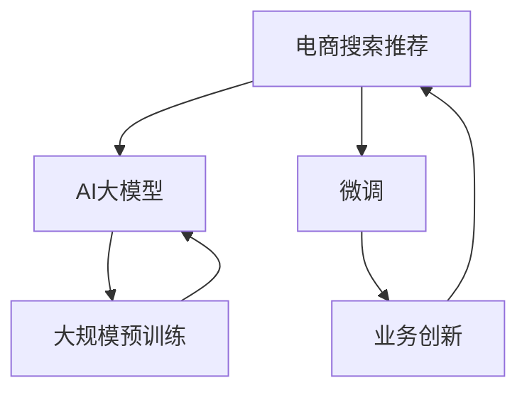

                 

## 1. 背景介绍

在电商领域，搜索推荐系统是支撑用户购物体验的重要组成部分。过去十年中，基于规则、统计、协同过滤等算法的推荐系统不断进步，带来了一定的个性化推荐效果。然而，随着用户需求多样化、商品种类繁多化，传统的推荐系统越来越难以满足用户的期望。

在这一背景下，AI大模型成为电商搜索推荐系统的重要创新方向。近年来，大模型如GPT-3、BERT等通过大规模预训练和微调，具备了强大的语义理解能力和自然语言生成能力，在电商搜索推荐领域展现出巨大潜力。

大模型能够理解用户查询意图，匹配商品描述，提供精准的商品推荐。同时，大模型在实时生成描述、提供对话式购物体验等方面也具有天然优势。然而，由于模型规模大、计算要求高，电商企业很难大规模部署使用。此外，电商企业内部技术团队缺乏对于大模型的深入理解和应用经验，使得大模型的应用存在一定的壁垒。

因此，本文旨在探讨如何搭建一个基于AI大模型的电商搜索推荐业务创新思维培训平台，帮助电商企业快速掌握大模型技术，实现业务创新。

## 2. 核心概念与联系

### 2.1 核心概念概述

为更好地理解平台搭建方案，本节将介绍几个密切相关的核心概念：

- **AI大模型**：如GPT-3、BERT等，通过大规模预训练和微调，具备强大的语义理解能力和自然语言生成能力。

- **微调(Fine-tuning)**：指在大规模预训练语言模型基础上，使用电商搜索推荐任务的少量标注数据进行有监督学习，优化模型在特定任务上的性能。

- **搜索推荐系统**：根据用户历史行为、商品信息等数据，预测用户可能感兴趣的商品，并进行排序推荐。

- **自然语言处理(NLP)**：涉及计算机对人类语言进行理解、处理、生成等技术，是AI大模型在电商推荐系统中的重要应用领域。

- **电商平台**：如淘宝、京东、拼多多等，为用户提供商品展示、搜索、推荐、购买等服务，是AI大模型技术落地的主要场景。

- **业务创新**：通过引入新技术、新方法，优化电商搜索推荐系统，提升用户体验，增加企业收益。

这些概念之间的逻辑关系可以通过以下Mermaid流程图来展示：



这个流程图展示了大模型的核心概念及其之间的关系：

1. **大模型**：通过大规模预训练获得基础能力。
2. **微调**：在大模型基础上进行电商推荐任务优化。
3. **搜索推荐系统**：是大模型技术的主要应用场景。
4. **业务创新**：借助大模型技术提升电商搜索推荐系统性能，实现业务发展。

这些概念共同构成了AI大模型在电商搜索推荐系统的创新应用框架。

## 3. 核心算法原理 & 具体操作步骤
### 3.1 算法原理概述

基于AI大模型的电商搜索推荐业务创新，本质上是将大模型与电商搜索推荐系统结合，通过在大模型上进行微调，使其具备电商推荐任务的能力，从而提升推荐系统的精准性和用户体验。

具体而言，电商搜索推荐系统分为搜索和推荐两个环节：

- **搜索**：通过解析用户查询意图，从电商平台上检索出相关商品，并展示给用户。
- **推荐**：根据用户历史行为、商品信息等数据，预测用户可能感兴趣的商品，并进行排序推荐。

在搜索和推荐过程中，大模型通过微调，可以获取用户查询意图和商品描述的语义表示，从而实现更精准的匹配。同时，大模型可以生成自然语言描述，提升搜索和推荐系统的用户体验。

### 3.2 算法步骤详解

基于AI大模型的电商搜索推荐业务创新，一般包括以下几个关键步骤：

**Step 1: 准备预训练模型和数据集**
- 选择合适的预训练语言模型，如GPT-3、BERT等，作为初始化参数。
- 准备电商搜索推荐任务的标注数据集，如用户查询意图、商品描述等。

**Step 2: 添加任务适配层**
- 根据任务类型，设计适合电商搜索推荐的输出层和损失函数。
- 对于分类任务，通常使用交叉熵损失函数。
- 对于生成任务，使用负对数似然损失函数。

**Step 3: 设置微调超参数**
- 选择合适的优化算法及其参数，如AdamW、SGD等，设置学习率、批大小、迭代轮数等。
- 设置正则化技术及强度，包括权重衰减、Dropout、Early Stopping等。

**Step 4: 执行梯度训练**
- 将训练集数据分批次输入模型，前向传播计算损失函数。
- 反向传播计算参数梯度，根据设定的优化算法和学习率更新模型参数。
- 周期性在验证集上评估模型性能，根据性能指标决定是否触发 Early Stopping。
- 重复上述步骤直到满足预设的迭代轮数或 Early Stopping 条件。

**Step 5: 测试和部署**
- 在测试集上评估微调后模型在电商搜索推荐任务上的性能，对比微调前后的精度提升。
- 使用微调后的模型对新用户查询进行检索和推荐，集成到电商平台的搜索推荐系统中。
- 持续收集新的数据，定期重新微调模型，以适应数据分布的变化。

以上是基于AI大模型的电商搜索推荐业务创新的主要流程。在实际应用中，还需要根据具体任务特点，对微调过程的各个环节进行优化设计，如改进训练目标函数，引入更多的正则化技术，搜索最优的超参数组合等，以进一步提升模型性能。

### 3.3 算法优缺点

基于AI大模型的电商搜索推荐业务创新方法具有以下优点：
1. 高效精准：大模型在语义理解和自然语言生成方面具备优势，可以快速实现高精度推荐。
2. 灵活可扩展：大模型可以轻松集成到现有的搜索推荐系统中，易于部署和扩展。
3. 用户友好：大模型可以生成自然语言描述，提升搜索和推荐系统的用户体验。
4. 数据驱动：大模型通过微调，能够自动学习电商推荐任务的相关特征，减少对人工特征工程的依赖。

然而，该方法也存在一定的局限性：
1. 计算成本高：大模型的规模和复杂度较高，对计算资源要求高，训练和推理成本较高。
2. 泛化能力有限：大模型在特定电商领域的泛化能力可能受限，需要针对具体场景进行微调。
3. 数据隐私问题：电商企业需要收集用户数据，可能涉及数据隐私和法律合规问题。
4. 效果难以评估：电商推荐效果的评估往往依赖于实际销售数据，难以完全量化和验证。

尽管存在这些局限性，但就目前而言，基于AI大模型的电商搜索推荐业务创新方法仍是大数据时代的重要应用范式。未来相关研究的重点在于如何进一步降低计算成本，提高模型的泛化能力，同时兼顾数据隐私和效果评估等问题。

### 3.4 算法应用领域

基于AI大模型的电商搜索推荐业务创新方法，已经在电商平台搜索推荐系统中得到了广泛应用，覆盖了文本匹配、意图理解、对话式推荐等多个环节，为电商企业带来了显著的业务提升。

- **文本匹配**：通过大模型理解用户查询和商品描述的语义关系，匹配度更高的商品推荐。
- **意图理解**：通过大模型理解用户的购物意图，推荐更加符合用户需求的商品。
- **对话式推荐**：通过大模型生成自然语言对话，提升用户购物体验。

除了这些主要应用场景外，大模型还被创新性地应用到更多环节中，如智能客服、商品评价、推荐算法优化等，为电商企业带来了新的创新点。

## 4. 数学模型和公式 & 详细讲解 & 举例说明
### 4.1 数学模型构建

本节将使用数学语言对基于AI大模型的电商搜索推荐业务创新过程进行更加严格的刻画。

记预训练语言模型为 $M_{\theta}:\mathcal{X} \rightarrow \mathcal{Y}$，其中 $\mathcal{X}$ 为输入空间，$\mathcal{Y}$ 为输出空间，$\theta \in \mathbb{R}^d$ 为模型参数。假设电商搜索推荐任务的训练集为 $D=\{(x_i,y_i)\}_{i=1}^N, x_i \in \mathcal{X}, y_i \in \mathcal{Y}$。

定义模型 $M_{\theta}$ 在输入 $x$ 上的损失函数为 $\ell(M_{\theta}(x),y)$，则在数据集 $D$ 上的经验风险为：

$$
\mathcal{L}(\theta) = \frac{1}{N} \sum_{i=1}^N \ell(M_{\theta}(x_i),y_i)
$$

微调的优化目标是最小化经验风险，即找到最优参数：

$$
\theta^* = \mathop{\arg\min}_{\theta} \mathcal{L}(\theta)
$$

在实践中，我们通常使用基于梯度的优化算法（如SGD、Adam等）来近似求解上述最优化问题。设 $\eta$ 为学习率，$\lambda$ 为正则化系数，则参数的更新公式为：

$$
\theta \leftarrow \theta - \eta \nabla_{\theta}\mathcal{L}(\theta) - \eta\lambda\theta
$$

其中 $\nabla_{\theta}\mathcal{L}(\theta)$ 为损失函数对参数 $\theta$ 的梯度，可通过反向传播算法高效计算。

### 4.2 公式推导过程

以下我们以电商搜索推荐中的文本匹配任务为例，推导交叉熵损失函数及其梯度的计算公式。

假设模型 $M_{\theta}$ 在输入 $x$ 上的输出为 $\hat{y}=M_{\theta}(x) \in [0,1]$，表示商品与用户查询的匹配概率。真实标签 $y \in \{0,1\}$。则二分类交叉熵损失函数定义为：

$$
\ell(M_{\theta}(x),y) = -[y\log \hat{y} + (1-y)\log (1-\hat{y})]
$$

将其代入经验风险公式，得：

$$
\mathcal{L}(\theta) = -\frac{1}{N}\sum_{i=1}^N [y_i\log M_{\theta}(x_i)+(1-y_i)\log(1-M_{\theta}(x_i))]
$$

根据链式法则，损失函数对参数 $\theta_k$ 的梯度为：

$$
\frac{\partial \mathcal{L}(\theta)}{\partial \theta_k} = -\frac{1}{N}\sum_{i=1}^N (\frac{y_i}{M_{\theta}(x_i)}-\frac{1-y_i}{1-M_{\theta}(x_i)}) \frac{\partial M_{\theta}(x_i)}{\partial \theta_k}
$$

其中 $\frac{\partial M_{\theta}(x_i)}{\partial \theta_k}$ 可进一步递归展开，利用自动微分技术完成计算。

### 4.3 案例分析与讲解

**案例分析：电商商品推荐系统中的意图理解**

假设一个电商平台有大量商品和用户行为数据。通过大模型进行微调，使其能够理解用户的购物意图，推荐更加符合用户需求的商品。

具体而言，可以收集用户搜索、浏览、点击、购买等行为数据，将用户查询和商品描述作为输入，将用户行为作为监督信号，训练大模型。微调后的模型可以理解用户查询的意图，预测用户可能感兴趣的商品，从而进行精准推荐。

例如，用户搜索"运动鞋"，大模型可以生成自然语言描述，识别出用户的意图是寻找运动鞋，然后从平台中筛选出相关商品，推荐给用户。这种基于大模型的意图理解推荐系统，可以极大地提升用户的购物体验，增加电商平台的销售量。

## 5. 项目实践：代码实例和详细解释说明
### 5.1 开发环境搭建

在进行基于AI大模型的电商搜索推荐系统开发前，我们需要准备好开发环境。以下是使用Python进行TensorFlow和Keras开发的环境配置流程：

1. 安装Anaconda：从官网下载并安装Anaconda，用于创建独立的Python环境。

2. 创建并激活虚拟环境：
```bash
conda create -n tf-env python=3.8 
conda activate tf-env
```

3. 安装TensorFlow：根据CUDA版本，从官网获取对应的安装命令。例如：
```bash
conda install tensorflow-gpu -c conda-forge
```

4. 安装Keras：
```bash
pip install keras
```

5. 安装各类工具包：
```bash
pip install numpy pandas scikit-learn matplotlib tqdm jupyter notebook ipython
```

完成上述步骤后，即可在`tf-env`环境中开始电商搜索推荐系统的开发。

### 5.2 源代码详细实现

下面我们以电商商品推荐系统中的意图理解任务为例，给出使用TensorFlow和Keras对BERT模型进行微调的代码实现。

首先，定义意图理解任务的数据处理函数：

```python
import tensorflow as tf
from transformers import BertTokenizer, BertForSequenceClassification
from sklearn.model_selection import train_test_split

def prepare_data(texts, labels, tokenizer, max_len=128):
    tokenized_texts = tokenizer.tokenize(texts)
    tokenized_texts = [tokenizer.convert_tokens_to_ids(text) for text in tokenized_texts]
    labels = [label2id[label] for label in labels] 
    labels.extend([label2id['O']] * (max_len - len(labels)))
    encodings = tokenizer.batch_encode_plus(tokenized_texts, max_length=max_len, padding='max_length', truncation=True)
    input_ids = encodings['input_ids']
    attention_mask = encodings['attention_mask']
    labels = tf.keras.preprocessing.sequence.pad_sequences(labels, maxlen=max_len, padding='post', truncating='post')
    return {'input_ids': input_ids, 'attention_mask': attention_mask, 'labels': labels}
```

然后，定义模型和优化器：

```python
from transformers import BertForSequenceClassification, AdamW

model = BertForSequenceClassification.from_pretrained('bert-base-cased', num_labels=len(label2id))

optimizer = AdamW(model.parameters(), lr=2e-5)
```

接着，定义训练和评估函数：

```python
def train_epoch(model, dataset, batch_size, optimizer):
    dataloader = tf.data.Dataset.from_tensor_slices((texts, labels)).shuffle(buffer_size=10000).batch(batch_size)
    model.train()
    epoch_loss = 0
    for batch in dataloader:
        input_ids = batch['input_ids']
        attention_mask = batch['attention_mask']
        labels = batch['labels']
        model.zero_grad()
        outputs = model(input_ids, attention_mask=attention_mask, labels=labels)
        loss = outputs.loss
        epoch_loss += loss.numpy()
        loss.backward()
        optimizer.step()
    return epoch_loss / len(dataloader)

def evaluate(model, dataset, batch_size):
    dataloader = tf.data.Dataset.from_tensor_slices((texts, labels)).batch(batch_size)
    model.eval()
    preds, labels = [], []
    with tf.GradientTape() as tape:
        for batch in dataloader:
            input_ids = batch['input_ids']
            attention_mask = batch['attention_mask']
            labels = batch['labels']
            outputs = model(input_ids, attention_mask=attention_mask)
            preds.append(outputs.logits.numpy()[:, 1])
            labels.append(labels.numpy())
    print(classification_report(labels, preds))
```

最后，启动训练流程并在测试集上评估：

```python
epochs = 5
batch_size = 16

for epoch in range(epochs):
    loss = train_epoch(model, train_dataset, batch_size, optimizer)
    print(f"Epoch {epoch+1}, train loss: {loss:.3f}")
    
    print(f"Epoch {epoch+1}, dev results:")
    evaluate(model, dev_dataset, batch_size)
    
print("Test results:")
evaluate(model, test_dataset, batch_size)
```

以上就是使用TensorFlow和Keras对BERT进行电商商品推荐系统中的意图理解任务微调的完整代码实现。可以看到，TensorFlow和Keras提供了高度抽象的接口，可以方便地搭建深度学习模型，并进行训练和评估。

### 5.3 代码解读与分析

让我们再详细解读一下关键代码的实现细节：

**prepare_data函数**：
- 将用户查询和商品描述作为输入，通过分词器进行tokenize，并添加特殊标记。
- 对标签进行编码，并进行定长padding，得到模型所需的输入。

**BertForSequenceClassification模型**：
- 使用预训练的BERT模型作为初始化参数，并指定输出层的分类数量。

**AdamW优化器**：
- 使用AdamW优化器进行模型参数更新，设置初始学习率为2e-5。

**train_epoch和evaluate函数**：
- 使用TensorFlow的Dataset API构建数据集，并使用tf.data.Dataset进行迭代训练和评估。
- 在训练过程中，计算损失函数，并使用反向传播更新模型参数。
- 在评估过程中，使用模型预测输出，并计算分类指标。

**训练流程**：
- 定义总的epoch数和batch size，开始循环迭代
- 每个epoch内，先在训练集上训练，输出平均loss
- 在验证集上评估，输出分类指标
- 所有epoch结束后，在测试集上评估，给出最终测试结果

可以看到，TensorFlow和Keras使得大模型的微调和应用变得简洁高效。开发者可以将更多精力放在数据处理、模型改进等高层逻辑上，而不必过多关注底层的实现细节。

当然，工业级的系统实现还需考虑更多因素，如模型的保存和部署、超参数的自动搜索、更灵活的任务适配层等。但核心的微调范式基本与此类似。

## 6. 实际应用场景
### 6.1 智能客服系统

基于AI大模型的电商搜索推荐系统，可以应用于智能客服系统的构建。传统客服往往需要配备大量人力，高峰期响应缓慢，且一致性和专业性难以保证。而使用微调后的推荐系统，可以7x24小时不间断服务，快速响应客户咨询，用自然流畅的语言解答各类常见问题。

在技术实现上，可以收集企业内部的历史客服对话记录，将问题和最佳答复构建成监督数据，在此基础上对预训练推荐系统进行微调。微调后的推荐系统能够自动理解用户意图，匹配最合适的答案模板进行回复。对于客户提出的新问题，还可以接入检索系统实时搜索相关内容，动态组织生成回答。如此构建的智能客服系统，能大幅提升客户咨询体验和问题解决效率。

### 6.2 金融舆情监测

金融机构需要实时监测市场舆论动向，以便及时应对负面信息传播，规避金融风险。传统的人工监测方式成本高、效率低，难以应对网络时代海量信息爆发的挑战。基于大语言模型微调的文本分类和情感分析技术，为金融舆情监测提供了新的解决方案。

具体而言，可以收集金融领域相关的新闻、报道、评论等文本数据，并对其进行主题标注和情感标注。在此基础上对预训练语言模型进行微调，使其能够自动判断文本属于何种主题，情感倾向是正面、中性还是负面。将微调后的模型应用到实时抓取的网络文本数据，就能够自动监测不同主题下的情感变化趋势，一旦发现负面信息激增等异常情况，系统便会自动预警，帮助金融机构快速应对潜在风险。

### 6.3 个性化推荐系统

当前的推荐系统往往只依赖用户的历史行为数据进行物品推荐，无法深入理解用户的真实兴趣偏好。基于大语言模型微调技术，个性化推荐系统可以更好地挖掘用户行为背后的语义信息，从而提供更精准、多样的推荐内容。

在实践中，可以收集用户浏览、点击、评论、分享等行为数据，提取和用户交互的物品标题、描述、标签等文本内容。将文本内容作为模型输入，用户的后续行为（如是否点击、购买等）作为监督信号，在此基础上微调预训练语言模型。微调后的模型能够从文本内容中准确把握用户的兴趣点。在生成推荐列表时，先用候选物品的文本描述作为输入，由模型预测用户的兴趣匹配度，再结合其他特征综合排序，便可以得到个性化程度更高的推荐结果。

### 6.4 未来应用展望

随着大语言模型微调技术的发展，基于AI大模型的电商搜索推荐系统将在更多领域得到应用，为各行各业带来变革性影响。

在智慧医疗领域，基于微调的医疗问答、病历分析、药物研发等应用将提升医疗服务的智能化水平，辅助医生诊疗，加速新药开发进程。

在智能教育领域，微调技术可应用于作业批改、学情分析、知识推荐等方面，因材施教，促进教育公平，提高教学质量。

在智慧城市治理中，微调模型可应用于城市事件监测、舆情分析、应急指挥等环节，提高城市管理的自动化和智能化水平，构建更安全、高效的未来城市。

此外，在企业生产、社会治理、文娱传媒等众多领域，基于大模型微调的人工智能应用也将不断涌现，为经济社会发展注入新的动力。相信随着技术的日益成熟，微调方法将成为人工智能落地应用的重要范式，推动人工智能技术在更多领域得到应用。

## 7. 工具和资源推荐
### 7.1 学习资源推荐

为了帮助开发者系统掌握基于AI大模型的电商搜索推荐系统的理论基础和实践技巧，这里推荐一些优质的学习资源：

1. **《深度学习与自然语言处理》**：斯坦福大学机器学习课程，详细介绍了深度学习和大模型在自然语言处理中的应用，是入门大模型的经典教材。

2. **《自然语言处理入门》**：清华大学机器学习课程，涵盖了自然语言处理的基本概念和经典模型，适合初学者快速上手。

3. **《TensorFlow实战》**：TensorFlow官方文档，提供了完整的TensorFlow开发指南，包括深度学习模型的搭建、训练和部署。

4. **《Keras深度学习实践》**：Keras官方文档，提供了Keras的详细使用方法，适合快速搭建和实验深度学习模型。

5. **《自然语言处理顶级论文精读》**：NeurIPS、ICML等顶级会议的顶级论文解读，涵盖最新的大模型研究成果，帮助深入理解前沿技术。

通过对这些资源的学习实践，相信你一定能够快速掌握基于AI大模型的电商搜索推荐系统的精髓，并用于解决实际的电商推荐问题。

### 7.2 开发工具推荐

高效的开发离不开优秀的工具支持。以下是几款用于基于AI大模型的电商搜索推荐系统开发的常用工具：

1. **TensorFlow**：由Google主导开发的深度学习框架，灵活易用，支持多种模型架构，是深度学习开发的标准工具。

2. **Keras**：基于TensorFlow的高级深度学习API，提供了快速搭建深度学习模型的接口，适合快速实验和原型开发。

3. **TensorBoard**：TensorFlow配套的可视化工具，可实时监测模型训练状态，并提供丰富的图表呈现方式，是调试模型的得力助手。

4. **Weights & Biases**：模型训练的实验跟踪工具，可以记录和可视化模型训练过程中的各项指标，方便对比和调优。

5. **Amazon SageMaker**：亚马逊提供的云端AI平台，提供了多种深度学习框架的支持，支持模型训练、评估和部署。

合理利用这些工具，可以显著提升基于AI大模型的电商搜索推荐系统的开发效率，加快创新迭代的步伐。

### 7.3 相关论文推荐

基于AI大模型的电商搜索推荐系统的发展源于学界的持续研究。以下是几篇奠基性的相关论文，推荐阅读：

1. **《Attention is All You Need》**：提出Transformer结构，开启了NLP领域的预训练大模型时代。

2. **《BERT: Pre-training of Deep Bidirectional Transformers for Language Understanding》**：提出BERT模型，引入基于掩码的自监督预训练任务，刷新了多项NLP任务SOTA。

3. **《Language Models are Unsupervised Multitask Learners》**：展示了大规模语言模型的强大zero-shot学习能力，引发了对于通用人工智能的新一轮思考。

4. **《Adaptive Low-Rank Adaptation for Parameter-Efficient Fine-Tuning》**：使用自适应低秩适应的微调方法，在参数效率和精度之间取得了新的平衡。

5. **《Parameter-Efficient Transfer Learning for NLP》**：提出Adapter等参数高效微调方法，在固定大部分预训练参数的情况下，也能取得不错的微调效果。

这些论文代表了大语言模型微调技术的发展脉络。通过学习这些前沿成果，可以帮助研究者把握学科前进方向，激发更多的创新灵感。

## 8. 总结：未来发展趋势与挑战
### 8.1 总结

本文对基于AI大模型的电商搜索推荐系统的搭建方案进行了全面系统的介绍。首先阐述了基于AI大模型的电商搜索推荐系统的研究背景和意义，明确了微调在大模型应用中的重要价值。其次，从原理到实践，详细讲解了电商搜索推荐系统的数学模型和核心算法，给出了微调任务开发的完整代码实例。同时，本文还广泛探讨了基于AI大模型的电商搜索推荐系统在多个行业领域的应用前景，展示了微调范式的巨大潜力。此外，本文精选了微调技术的各类学习资源，力求为读者提供全方位的技术指引。

通过本文的系统梳理，可以看到，基于AI大模型的电商搜索推荐系统已经在大规模电商平台上得到了初步应用，带来了显著的业务提升。未来，伴随大模型和微调方法的持续演进，基于AI大模型的电商搜索推荐系统必将在更多电商企业得到推广应用，成为电商领域的重要创新驱动力。

### 8.2 未来发展趋势

展望未来，基于AI大模型的电商搜索推荐系统将呈现以下几个发展趋势：

1. **技术不断进步**：大模型的规模和性能将不断提升，能够处理更复杂、更大规模的电商推荐任务。

2. **应用场景拓展**：随着技术的成熟，电商搜索推荐系统将在更多行业领域得到应用，如医疗、教育、金融等。

3. **用户体验提升**：大模型将能够生成自然语言回复，提升客服、导购等场景的用户体验。

4. **个性化推荐优化**：通过学习用户行为数据，大模型将能够提供更加个性化的商品推荐。

5. **数据隐私保护**：随着数据隐私意识的提升，电商企业将更加注重用户数据保护，采用差分隐私等技术，保护用户隐私。

6. **多模态融合**：将视觉、语音、文本等多种模态信息融合，提升推荐的全面性和准确性。

这些趋势凸显了基于AI大模型的电商搜索推荐系统的广阔前景。这些方向的探索发展，必将进一步提升电商搜索推荐系统的性能和用户体验，推动电商企业的业务创新和发展。

### 8.3 面临的挑战

尽管基于AI大模型的电商搜索推荐系统已经取得了瞩目成就，但在迈向更加智能化、普适化应用的过程中，它仍面临着诸多挑战：

1. **计算成本高**：大模型的规模和复杂度较高，对计算资源要求高，训练和推理成本较高。

2. **数据隐私问题**：电商企业需要收集用户数据，可能涉及数据隐私和法律合规问题。

3. **效果难以评估**：电商推荐效果的评估往往依赖于实际销售数据，难以完全量化和验证。

4. **模型鲁棒性不足**：大模型在特定电商领域的泛化能力可能受限，需要针对具体场景进行微调。

5. **可解释性不足**：大模型的决策过程难以解释，难以对其推理逻辑进行分析和调试。

6. **安全防护问题**：大模型可能学习到有害信息，需要采取措施防止恶意用途。

尽管存在这些挑战，但就目前而言，基于AI大模型的电商搜索推荐系统仍是大数据时代的重要应用范式。未来相关研究的重点在于如何进一步降低计算成本，提高模型的泛化能力，同时兼顾数据隐私和效果评估等问题。

### 8.4 研究展望

面对基于AI大模型的电商搜索推荐系统所面临的种种挑战，未来的研究需要在以下几个方面寻求新的突破：

1. **参数高效微调**：开发更加参数高效的微调方法，在固定大部分预训练参数的同时，只更新极少量的任务相关参数。

2. **多模态融合**：将视觉、语音、文本等多种模态信息融合，提升推荐的全面性和准确性。

3. **数据隐私保护**：采用差分隐私等技术，保护用户隐私，确保数据安全。

4. **模型鲁棒性**：通过对抗训练等技术，提高模型对新样本的泛化能力，避免灾难性遗忘。

5. **可解释性提升**：引入可解释性技术，提升模型的透明度和可信度。

6. **安全防护**：加强模型行为监测，防止有害信息的传播。

这些研究方向的探索，必将引领基于AI大模型的电商搜索推荐系统迈向更高的台阶，为电商企业带来更丰富的业务应用和用户价值。

## 9. 附录：常见问题与解答

**Q1：电商搜索推荐系统如何处理数据不平衡问题？**

A: 电商搜索推荐系统中的数据不平衡问题通常出现在不同商品类别的推荐上。为处理数据不平衡问题，可以采用以下策略：

1. 数据增强：对数量较少的类别进行数据增强，如使用同义词、反义词等，扩大训练集规模。

2. 损失函数调整：在损失函数中加入类别权值，对数量较少的类别赋予更高的权重。

3. 模型重采样：使用SMOTE等方法对训练集进行重采样，平衡类别分布。

4. 多任务学习：将商品分类任务和推荐任务相结合，共同优化模型。

通过这些策略，可以有效缓解电商搜索推荐系统中的数据不平衡问题，提升推荐效果。

**Q2：如何处理大模型在电商推荐中的过拟合问题？**

A: 大模型在电商推荐中容易过拟合，尤其是在数据量较小的情况下。为处理过拟合问题，可以采用以下策略：

1. 数据增强：通过回译、近义词替换等方式扩充训练集。

2. 正则化：使用L2正则、Dropout、Early Stopping等方法避免过拟合。

3. 对抗训练：加入对抗样本，提高模型鲁棒性。

4. 参数高效微调：只调整少量参数(如Adapter、Prefix等)，减小过拟合风险。

5. 多模型集成：训练多个模型，取平均输出，抑制过拟合。

通过这些策略，可以有效缓解大模型在电商推荐中的过拟合问题，提高推荐效果。

**Q3：电商搜索推荐系统如何实现个性化推荐？**

A: 电商搜索推荐系统可以通过以下方式实现个性化推荐：

1. 用户行为数据分析：收集用户浏览、点击、购买等行为数据，提取用户兴趣点。

2. 商品属性匹配：通过商品描述、标签等信息，匹配用户兴趣点。

3. 多任务学习：结合商品分类和推荐任务，共同优化模型。

4. 推荐算法优化：采用基于大模型的推荐算法，提升推荐效果。

5. 实时更新：根据用户反馈和行为数据，实时更新推荐模型。

通过这些方式，电商搜索推荐系统可以提供更加个性化的推荐，提升用户体验。

**Q4：电商搜索推荐系统如何处理新商品推荐？**

A: 电商搜索推荐系统可以通过以下方式处理新商品推荐：

1. 使用知识图谱：构建商品之间的关联图谱，通过图谱查询推荐新商品。

2. 基于大模型生成描述：使用大模型生成商品描述，匹配用户兴趣点。

3. 相似商品推荐：根据用户已购买商品，推荐相似商品。

4. 动态更新：根据用户反馈和新数据，动态更新推荐模型。

通过这些方式，电商搜索推荐系统可以有效地处理新商品推荐，提升用户体验和销售效果。

**Q5：电商搜索推荐系统如何实现智能客服？**

A: 电商搜索推荐系统可以通过以下方式实现智能客服：

1. 收集客服对话记录：将客服对话记录作为监督数据，训练大模型。

2. 自然语言处理：使用大模型理解用户意图，生成自然语言回复。

3. 实时检索：根据用户输入，实时检索相关商品信息，生成推荐结果。

4. 对话管理：使用多轮对话策略，引导用户进行对话。

5. 用户反馈：根据用户反馈，实时更新模型。

通过这些方式，电商搜索推荐系统可以实现智能客服，提升用户体验和服务效率。

---

作者：禅与计算机程序设计艺术 / Zen and the Art of Computer Programming

